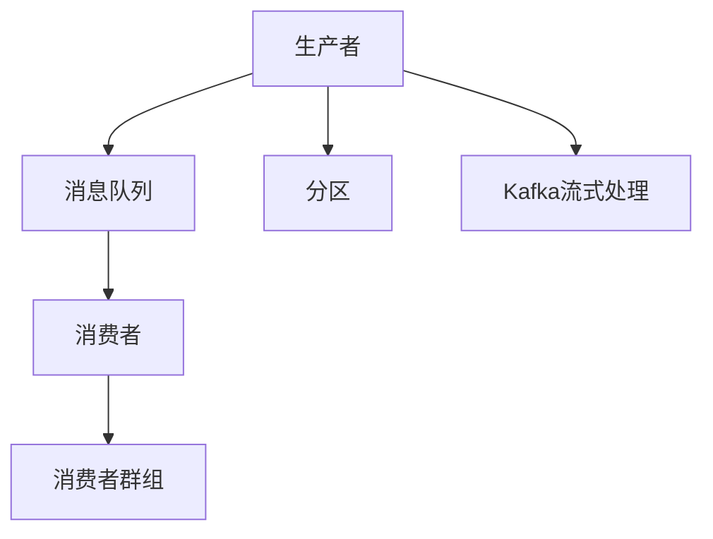

                 

# Kafka原理与代码实例讲解

## 1. 背景介绍

### 1.1 问题由来
随着互联网业务的迅速发展，系统间的数据交换变得日益频繁和复杂。传统的数据传输方式，如HTTP请求、消息队列、数据库同步等，已难以满足系统高吞吐量、低延迟、高可靠性的需求。特别是分布式系统中的数据同步和日志记录，常常面临着大量数据的高速流转和持久存储问题。

为了应对这些挑战，Apache Kafka应运而生。作为一个分布式流处理平台，Kafka已经成为全球数据流通的重要基础设施，被广泛应用于新闻聚合、金融交易、物联网等领域。

### 1.2 问题核心关键点
Kafka的设计理念基于流的概念，支持分布式发布和订阅，能够高效地处理海量数据流的传输和存储。其核心组件包括：

- **生产者(Producer)**：生成数据的源端，负责将数据批量写入Kafka。
- **消息队列(Message Queue)**：数据的临时存储设施，存储来自生产者的数据，并提供持久化、高可靠性保障。
- **消费者(Consumer)**：数据的目的端，负责从消息队列中读取数据，并进行后续处理。

Kafka的核心设计目标包括：
- 高吞吐量和高可靠性。
- 支持分布式架构和水平扩展。
- 低延迟和持久化存储。
- 支持流式数据处理。

## 2. 核心概念与联系

### 2.1 核心概念概述

为更好地理解Kafka的工作原理和优化方法，本节将介绍几个密切相关的核心概念：

- **分布式流处理**：Kafka通过分布式流处理机制，支持海量数据的高效传输和存储。
- **消息队列**：Kafka的消息队列采用磁盘存储，支持数据的高可靠性保障和持久化。
- **分区(Partition)**：消息队列被分割为多个分区，由多个生产者并发写入，同时由多个消费者并发读取，提高系统性能。
- **消费者群组(Consumer Group)**：多个消费者可以组成一个群组，并行读取同一个分区的数据，实现高吞吐量。
- **Kafka流式处理**：Kafka流式处理支持实时数据处理，支持流式聚合、窗口计算等复杂数据处理需求。

这些核心概念之间的逻辑关系可以通过以下Mermaid流程图来展示：



这个流程图展示了大语言模型的核心概念及其之间的关系：

1. 生产者将数据批量写入Kafka。
2. Kafka的消息队列存储数据，并提供持久化和高可靠性。
3. Kafka分区将消息队列分割为多个子队列，供多个生产者和消费者并发使用。
4. 多个消费者组成消费者群组，并行读取数据。
5. Kafka流式处理支持实时数据处理，实现复杂的数据分析需求。

## 3. 核心算法原理 & 具体操作步骤
### 3.1 算法原理概述

Kafka的核心算法原理基于分布式流处理和消息队列的设计。其核心思想是：通过分布式架构，支持海量数据的可靠传输和持久化存储。

具体来说，Kafka通过以下三个关键技术实现其高吞吐量和高可靠性：

1. **消息队列与分区技术**：Kafka将消息队列分割为多个分区，由多个生产者并发写入，同时由多个消费者并发读取，显著提高系统性能。
2. **消费者群组技术**：多个消费者组成一个群组，并行读取同一个分区的数据，实现高吞吐量。
3. **分布式流水线处理技术**：Kafka支持分布式流水线处理，支持实时数据处理和复杂数据分析，实现流式数据处理需求。

### 3.2 算法步骤详解

Kafka的核心算法步骤如下：

**Step 1: 部署Kafka集群**
- 安装Kafka分布式服务，包括Zookeeper、Kafka Producer、Kafka Consumer、Kafka Streams等组件。
- 配置Kafka集群的broker数量、分区数量、消费者群组数量等参数。

**Step 2: 发送数据到消息队列**
- 生产者按照指定主题(Topic)，将数据批量写入Kafka消息队列。
- 数据在传输过程中，由分区进行分割，并由多个生产者并发写入。

**Step 3: 读取数据并处理**
- 消费者组成消费者群组，按照指定主题，从消息队列中读取数据。
- 数据在读取过程中，由分区进行分割，并由多个消费者并发读取。

**Step 4: 数据处理与存储**
- 消费者对读取的数据进行处理，如数据清洗、聚合、计算等。
- 处理后的数据可以存储到外部数据库，或继续流向下一阶段的流式处理。

**Step 5: 数据监控与优化**
- 通过Kafka监控工具，实时监控系统性能和数据流状态。
- 根据监控数据，调整系统参数，优化性能，保障系统稳定运行。

### 3.3 算法优缺点

Kafka作为分布式流处理平台，具有以下优点：
1. 高吞吐量和高可靠性。支持海量数据的可靠传输和持久化存储。
2. 支持分布式架构和水平扩展。可以根据业务需求动态调整集群规模，提升系统性能。
3. 低延迟和流式处理。支持实时数据处理，满足高实时性的业务需求。
4. 支持复杂数据分析。支持流式聚合、窗口计算等复杂数据处理需求。

同时，Kafka也存在一定的局限性：
1. 配置复杂。需要深入理解Kafka的配置参数，才能有效利用其性能。
2. 延迟敏感。数据传输过程中，存在一定的延迟，可能不适合对延迟敏感的系统。
3. 成本较高。需要额外的硬件资源和运维成本，确保系统的高可用性和高性能。
4. 处理能力有限。虽然支持海量数据处理，但对于非常极端的高并发的场景，可能仍需优化处理。

尽管存在这些局限性，但就目前而言，Kafka是处理分布式数据流的最佳选择，广泛应用于各种大数据处理和实时数据流场景。

### 3.4 算法应用领域

Kafka的核心算法原理在多个领域得到了广泛的应用，涵盖数据流处理、实时数据处理、日志记录等多个场景，例如：

- 新闻聚合：Kafka支持高吞吐量的数据流处理，可以实时收集和聚合来自全球的新闻数据。
- 金融交易：Kafka的低延迟和高可靠性特性，非常适合实时处理交易数据和进行高频交易。
- 物联网：Kafka支持分布式流处理，可以实时处理物联网设备产生的海量数据。
- 实时分析：Kafka支持流式聚合和窗口计算等复杂数据分析，可以实时分析用户行为和交易数据。

除了上述这些经典应用外，Kafka还被创新性地应用于更多场景中，如大数据分析、日志记录、实时监控等，为大数据处理和实时数据流提供了新的解决方案。

## 4. 数学模型和公式 & 详细讲解
### 4.1 数学模型构建

Kafka的核心算法原理可以基于数学模型进行严格阐述。以下是Kafka核心算法的主要数学模型构建：

- **消息队列和分区模型**：Kafka的消息队列被分割为多个分区，每个分区对应一个唯一的ID。生产者将数据批量写入分区，消费者并发读取分区中的数据。
- **消费者群组模型**：多个消费者组成一个消费者群组，可以同时读取同一个分区中的数据。消费者群组通过内部一致性协议(CP)，确保数据的顺序性和一致性。
- **分布式流水线处理模型**：Kafka支持分布式流水线处理，将数据流处理任务分解为多个子任务，每个子任务独立运行，最终结果进行合并。

### 4.2 公式推导过程

以下是Kafka主要数学模型的公式推导过程：

**消息队列和分区模型**：

假设消息队列被分割为 $N$ 个分区，每个分区存储 $M$ 条数据。生产者以速率 $R$ 每秒写入一条数据，消费者以速率 $C$ 每秒读取一条数据。则每个分区的数据更新模型为：

$$
\begin{aligned}
&消息队列中数据数量 = M \\
&每个分区的数据数量 = \frac{M}{N} \\
&分区写入速率 = \frac{R}{N} \\
&分区读取速率 = \frac{C}{N}
\end{aligned}
$$

在分区写入过程中，如果生产者写入的数据量大于读取的数据量，则消息队列中的数据将不断增加。因此，Kafka在分区写入时，使用缓冲机制，当缓冲区满时，数据会被暂时存储到硬盘上，等待后续写入。

在分区读取过程中，消费者从消息队列中读取数据，并将其存储到本地缓存中。消费者之间通过内部一致性协议(CP)，确保数据的顺序性和一致性。

**消费者群组模型**：

假设一个消费者群组中有 $K$ 个消费者，每个消费者每秒读取 $C'$ 条数据。则消费者群组的总读取速率 $C_{group}$ 为：

$$
C_{group} = K \times C'
$$

在消费者群组中，每个消费者可以并行读取数据，因此总体读取速率是每个消费者读取速率的总和。消费者群组通过内部一致性协议(CP)，确保每个消费者读取的数据顺序一致。

**分布式流水线处理模型**：

假设一个分布式流水线处理任务被分解为 $P$ 个子任务，每个子任务每秒处理 $T$ 条数据。则整个分布式流水线的处理速率 $T_{pipeline}$ 为：

$$
T_{pipeline} = P \times T
$$

在分布式流水线处理中，每个子任务独立运行，最终结果进行合并。通过并行处理，可以显著提高系统处理能力。

### 4.3 案例分析与讲解

以下以Kafka在新闻聚合系统中的应用为例，进行详细案例分析：

**案例背景**：

某新闻聚合平台每天接收来自全球的新闻数据数百万条，需要实时收集、聚合、分析和展示这些新闻数据。系统需要支持高吞吐量、低延迟和高可靠性，能够实时处理和分析大量新闻数据。

**解决方案**：

1. **Kafka消息队列**：创建多个消息队列，每个队列对应一个新闻来源，生产者将新闻数据批量写入消息队列。
2. **Kafka分区和消费者群组**：将消息队列分割为多个分区，每个分区存储来自同一新闻来源的新闻数据。多个消费者组成消费者群组，并行读取同一分区的新闻数据。
3. **Kafka流式处理**：使用Kafka Streams进行实时数据处理和聚合，对新闻数据进行去重、分类、情感分析等处理。
4. **分布式缓存和数据库**：使用Redis等分布式缓存进行数据存储，使用Hadoop等大数据处理平台进行数据聚合和分析。

通过以上解决方案，该新闻聚合平台实现了高吞吐量、低延迟和高可靠性的数据处理需求，能够实时处理和分析全球新闻数据。

## 5. 项目实践：代码实例和详细解释说明
### 5.1 开发环境搭建

在进行Kafka实践前，我们需要准备好开发环境。以下是使用Java进行Kafka开发的环境配置流程：

1. 安装Java开发环境：从官网下载并安装JDK。
2. 安装Kafka分布式服务：下载Kafka安装包，解压并配置环境变量。
3. 启动Zookeeper服务：启动Zookeeper服务，用于Kafka集群的管理。
4. 启动Kafka服务：启动Kafka broker服务，配置生产者、消费者和流式处理任务。

完成上述步骤后，即可在本地环境进行Kafka的实践开发。

### 5.2 源代码详细实现

这里我们以Kafka流式处理任务为例，给出使用Kafka Streams进行实时数据处理和聚合的Java代码实现。

首先，定义流式处理任务的输入和输出主题：

```java
StreamsBuilder builder = new StreamsBuilder();
KStream<String, String> inputStream = builder.stream("input-topic");
KStream<String, Integer> outputStream = inputStream
    .flatMapValues(value -> value.split(" "))
    .mapValues(s -> 1)
    .sum()
    .toStream();
```

然后，定义流式处理任务的业务逻辑：

```java
StreamsConfig config = new StreamsConfig();
config.put(StreamsConfig.BOOTSTRAP_SERVERS_CONFIG, "localhost:9092");
config.put(StreamsConfig.DEFAULT_KEY_SERIALIZER_CLASS_CONFIG, Serdes.String().getClass());
config.put(StreamsConfig.DEFAULT_VALUE_SERIALIZER_CLASS_CONFIG, Serdes.String().getClass());
StreamsBuilder builder = new StreamsBuilder();
KStream<String, String> inputStream = builder.stream("input-topic");
KStream<String, Integer> outputStream = inputStream
    .flatMapValues(value -> value.split(" "))
    .mapValues(s -> 1)
    .sum()
    .toStream();

// 定义数据处理任务
inputStream.to("output-topic");
```

最后，启动流式处理任务：

```java
KafkaStreams kafkaStreams = new KafkaStreams(builder.build(), config);
kafkaStreams.start();
```

以上就是使用Kafka Streams进行实时数据处理和聚合的Java代码实现。可以看到，Kafka Streams提供了丰富的API和组件，可以方便地进行流式数据处理和聚合。

### 5.3 代码解读与分析

让我们再详细解读一下关键代码的实现细节：

**StreamsBuilder类**：
- 用于构建Kafka流式处理任务的流处理器。

**KStream类**：
- 表示流处理器的一个输入流，可以处理key-value类型的消息。

**flatMapValues方法**：
- 对输入流中的每个消息，进行自定义的映射处理，生成多个key-value对。

**mapValues方法**：
- 对扁平化后的消息进行自定义的映射处理，将字符串转换为数字。

**sum方法**：
- 对映射后的数字进行求和操作，生成最终的结果流。

**toStream方法**：
- 将结果流转换为KStream对象，可以进一步进行处理和消费。

**StreamsConfig类**：
- 用于配置Kafka流式处理任务的参数，如broker地址、序列化方式等。

**KafkaStreams类**：
- 用于启动Kafka流式处理任务，并进行实时数据处理。

Kafka流式处理的核心思想是通过分布式流处理器，对输入流进行实时处理和聚合。在实际应用中，还需要考虑数据的分发、同步、容错等机制，才能实现高效、可靠的数据处理需求。

## 6. 实际应用场景
### 6.1 智能客服系统

Kafka的消息队列和分区技术，可以应用于智能客服系统的消息传输和存储。传统客服系统往往面临数据流量大、实时性要求高的问题，难以有效支持客服会话的实时记录和快速响应。

在技术实现上，可以设计多个消息队列，分别用于记录用户的会话记录和客服的响应记录。生产者将会话数据实时写入消息队列，消费者实时读取数据，并对用户反馈进行快速响应。通过Kafka的分区技术，可以支持高并发用户会话的快速处理。

### 6.2 金融交易系统

Kafka的低延迟和高可靠性特性，非常适合应用于金融交易系统。金融交易对数据实时性和准确性要求极高，任何延迟或数据丢失都可能导致严重的经济损失。

在技术实现上，可以设计多个消息队列，分别用于记录交易数据、清算数据、审计数据等。生产者将交易数据实时写入消息队列，消费者实时读取数据，并进行交易记录、清算处理、审计等操作。通过Kafka的内部一致性协议(CP)，确保数据的一致性和完整性。

### 6.3 物联网系统

Kafka的支持分布式架构和水平扩展特性，非常适合应用于物联网系统。物联网设备产生的数据量大且复杂，需要高效、可靠的数据传输和存储。

在技术实现上，可以设计多个消息队列，分别用于记录不同类型的数据，如传感器数据、视频数据、语音数据等。生产者将数据实时写入消息队列，消费者实时读取数据，并进行数据处理、分析和存储。通过Kafka的分区技术，可以支持海量数据的快速传输和存储。

### 6.4 未来应用展望

随着Kafka技术的不断演进，其在分布式数据处理和流式数据处理方面的能力将进一步提升。未来，Kafka将在更多领域得到应用，为系统架构和业务处理带来新的突破。

- **大数据分析**：Kafka的高吞吐量特性，非常适合支持大数据分析任务。通过Kafka流式处理，可以实时处理和聚合大量数据，支持复杂的数据分析和机器学习任务。
- **实时监控**：Kafka的低延迟特性，非常适合支持实时监控任务。通过Kafka流式处理，可以实时收集和分析系统运行数据，支持异常检测和告警功能。
- **日志记录**：Kafka的持久化存储特性，非常适合支持日志记录任务。通过Kafka流式处理，可以实时记录和存储系统日志，支持日志分析和审计功能。

未来，Kafka必将在更多的业务场景中发挥重要作用，成为数据处理和流式处理的重要基础设施。相信随着技术的不断进步，Kafka将迎来更加广阔的应用前景，推动数据的流通和利用，助力各行业的数字化转型。

## 7. 工具和资源推荐
### 7.1 学习资源推荐

为了帮助开发者系统掌握Kafka的理论基础和实践技巧，这里推荐一些优质的学习资源：

1. **Kafka官方文档**：Kafka官方提供的详细文档，涵盖Kafka的安装、配置、使用等方方面面，是学习Kafka的必备资源。
2. **Kafka设计与实现**：深入浅出地讲解Kafka的核心原理和实现细节，帮助开发者理解Kafka的底层机制。
3. **Kafka与Apache生态**：讲解Kafka与Apache生态的其他组件的集成和协同工作机制，帮助开发者构建高可靠的系统。
4. **Kafka流式处理实战**：通过真实的业务案例，讲解Kafka流式处理的应用和优化，帮助开发者解决实际问题。
5. **Kafka性能优化指南**：讲解Kafka性能调优的各项参数和最佳实践，帮助开发者优化系统性能。

通过对这些资源的学习实践，相信你一定能够快速掌握Kafka的核心原理和应用技巧，并用于解决实际的业务问题。

### 7.2 开发工具推荐

高效的开发离不开优秀的工具支持。以下是几款用于Kafka开发的常用工具：

1. **IntelliJ IDEA**：一款功能强大的Java开发工具，支持Kafka的开发和调试。
2. **Kafka Streams**：Kafka官方提供的流式处理工具，支持丰富的API和组件，方便进行流式数据处理。
3. **Kafka Connect**：Kafka官方提供的集成工具，支持数据流采集、转换和存储，方便进行数据流的自动化管理。
4. **Kafka Manager**：一款Kafka监控工具，可以实时监控Kafka集群的状态和性能，帮助开发者进行系统优化和故障排除。
5. **Kafka Streams UI**：Kafka官方提供的流式处理监控工具，提供实时数据流的可视化展示，方便开发者进行数据流监控和分析。

合理利用这些工具，可以显著提升Kafka开发和调试的效率，加快创新迭代的步伐。

### 7.3 相关论文推荐

Kafka技术的不断演进得益于学界的持续研究。以下是几篇奠基性的相关论文，推荐阅读：

1. **Kafka: A Real-Time Distributed Stream Processing System**：Kafka的原始论文，介绍了Kafka的核心架构和设计理念。
2. **Kafka Streams**：Kafka流式处理的介绍和实现原理，讲解了Kafka流式处理的核心组件和应用场景。
3. **Kafka Streams: A Data Processing Platform for Real-time Streaming Applications**：讲解了Kafka流式处理的应用场景和性能优化方法。
4. **Kafka Streams for Beginners**：Kafka流式处理的基础入门教程，帮助初学者快速上手Kafka流式处理。
5. **Streaming with Kafka**：讲解了Kafka流式处理在实际业务场景中的应用案例和优化方法。

这些论文代表了大数据处理和流式处理技术的发展脉络。通过学习这些前沿成果，可以帮助研究者把握学科前进方向，激发更多的创新灵感。

## 8. 总结：未来发展趋势与挑战
### 8.1 总结

本文对Kafka的消息队列和流式处理技术进行了全面系统的介绍。首先阐述了Kafka的设计理念和应用背景，明确了其在分布式数据传输和流式数据处理方面的独特价值。其次，从原理到实践，详细讲解了Kafka的消息队列和流式处理的核心算法和技术细节，给出了Kafka开发和优化的完整代码实例。同时，本文还广泛探讨了Kafka技术在智能客服、金融交易、物联网等多个行业领域的应用前景，展示了Kafka技术的广泛应用潜力。此外，本文精选了Kafka技术的各类学习资源，力求为读者提供全方位的技术指引。

通过本文的系统梳理，可以看到，Kafka作为一种分布式流处理平台，具备高吞吐量、低延迟和高可靠性的优势，广泛应用于各种大数据处理和实时数据流场景。未来，伴随Kafka技术的不断演进，其在分布式数据处理和流式数据处理方面的能力将进一步提升，为更多的业务场景提供有力的技术支撑。

### 8.2 未来发展趋势

展望未来，Kafka技术的发展趋势主要体现在以下几个方面：

1. **流式处理能力的提升**：Kafka将进一步提升流式处理能力，支持更多的数据处理需求。未来，Kafka将支持更复杂的数据流处理任务，如流式机器学习、流式图处理等。
2. **分布式架构的优化**：Kafka将进一步优化分布式架构，支持更灵活、更高效的集群部署和管理。未来，Kafka将支持更多的分布式算法和优化方法，提升系统的扩展性和稳定性。
3. **性能调优的改进**：Kafka将进一步改进性能调优方法，提升系统的吞吐量和延迟。未来，Kafka将支持更多的参数调优和优化方法，如流式聚合、窗口计算等。
4. **新特性的引入**：Kafka将引入更多新特性，提升系统的功能性和用户体验。未来，Kafka将支持更多的数据格式和流式处理任务，如KSQL、KSQL Streams等。
5. **生态系统的扩展**：Kafka将进一步扩展其生态系统，支持更多的组件和服务集成。未来，Kafka将支持更多的第三方组件和工具集成，如KAFKA Connect、KAFKA Streams UI等。

这些趋势展示了Kafka技术在未来的巨大发展潜力和应用前景，相信Kafka将在更多的业务场景中发挥重要作用，助力各行业的数字化转型。

### 8.3 面临的挑战

尽管Kafka技术已经取得了显著成就，但在迈向更加智能化、普适化应用的过程中，它仍面临着诸多挑战：

1. **配置复杂**：Kafka的配置参数较多，需要深入理解才能有效利用其性能。配置不当可能导致系统性能下降或稳定性问题。
2. **延迟敏感**：Kafka的数据传输过程中，存在一定的延迟，可能不适合对延迟敏感的系统。需要进一步优化性能，满足实时性要求。
3. **处理能力有限**：尽管Kafka支持海量数据处理，但对于非常极端的高并发的场景，可能仍需优化处理能力。需要引入更多的分布式算法和优化方法。
4. **数据一致性问题**：Kafka的内部一致性协议(CP)可能在某些情况下存在数据不一致的问题，需要进一步优化数据一致性处理。
5. **安全性和隐私问题**：Kafka的数据传输过程中，可能存在数据泄露和隐私风险，需要加强安全性和隐私保护。

这些挑战需要在技术层面和运维层面进行全面优化，才能充分发挥Kafka的潜力，保障系统的稳定性和安全性。

### 8.4 研究展望

面对Kafka面临的诸多挑战，未来的研究需要在以下几个方面寻求新的突破：

1. **优化分布式架构**：进一步优化Kafka的分布式架构，支持更灵活、更高效的集群部署和管理。引入更多分布式算法和优化方法，提升系统的扩展性和稳定性。
2. **提升流式处理能力**：进一步提升Kafka的流式处理能力，支持更复杂的数据流处理任务，如流式机器学习、流式图处理等。引入更多新特性和优化方法，提升系统的功能和性能。
3. **优化性能调优方法**：进一步改进Kafka的性能调优方法，提升系统的吞吐量和延迟。引入更多的参数调优和优化方法，如流式聚合、窗口计算等。
4. **增强数据一致性**：进一步优化Kafka的数据一致性处理，提升系统的数据一致性和可靠性。引入更多的算法和优化方法，解决数据不一致的问题。
5. **加强安全性和隐私保护**：加强Kafka的安全性和隐私保护，防止数据泄露和隐私风险。引入更多的安全措施和隐私保护方法，保障系统的稳定性和安全性。

这些研究方向的探索，必将引领Kafka技术迈向更高的台阶，为构建安全、可靠、高效的数据处理系统铺平道路。面向未来，Kafka需要与其他大数据处理和流式处理技术进行更深入的融合，协同发力，共同推动数据处理技术的进步。

## 9. 附录：常见问题与解答

**Q1：Kafka的分区技术和消费者群组技术有何区别？**

A: Kafka的分区技术和消费者群组技术是两种不同的数据处理机制。分区技术是将消息队列分割为多个分区，由多个生产者并发写入，同时由多个消费者并发读取。每个分区对应一个唯一的ID。消费者群组技术是多个消费者组成一个群组，可以同时读取同一个分区的数据。消费者群组通过内部一致性协议(CP)，确保数据的顺序性和一致性。

**Q2：如何优化Kafka的性能？**

A: 优化Kafka的性能可以从以下几个方面入手：
1. 增加broker数量，提升系统的并发处理能力。
2. 增加分区数量，提升数据的分发和读取效率。
3. 使用流式处理，减少数据传输的延迟和损耗。
4. 使用数据压缩和串行化，减少数据的传输和存储开销。
5. 优化消费者和生产者的参数配置，提升系统的性能和稳定性。

**Q3：Kafka流式处理中，如何避免数据丢失？**

A: Kafka流式处理中，可以使用内部一致性协议(CP)，确保数据的一致性和完整性。同时，可以通过增加分区数量和流式处理窗口大小，提升系统的容错能力和处理能力，减少数据丢失的风险。

**Q4：Kafka在多租户环境中如何保证数据隔离？**

A: 在多租户环境中，可以使用Kafka的隔离机制，为每个租户分配独立的分区，确保数据隔离。同时，可以通过配置Kafka的资源管理参数，限制每个租户的数据读写权限和资源占用，保障系统的安全性和稳定性。

这些问题的解答展示了Kafka技术的核心原理和实践技巧，相信能够帮助开发者更好地理解和应用Kafka技术，实现高效、可靠的数据处理需求。

