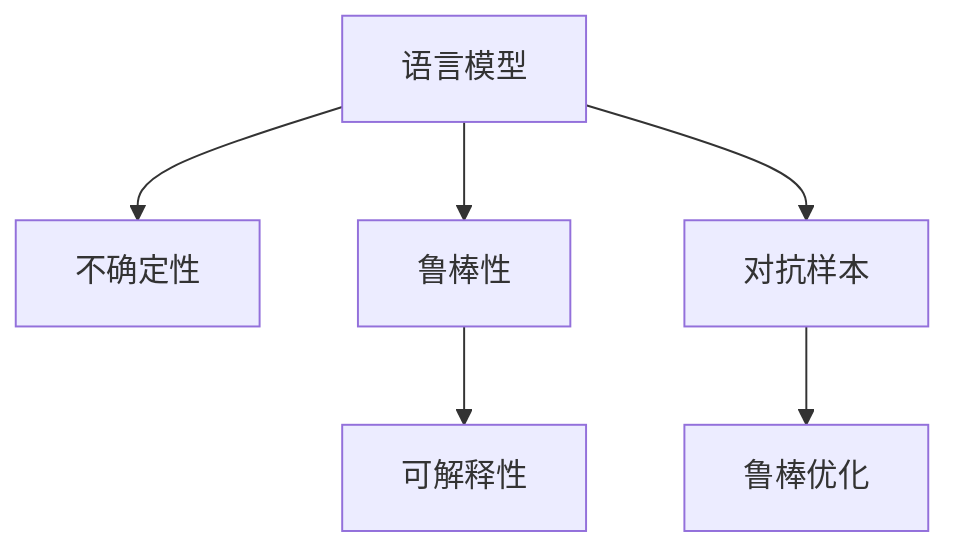

                 

# LLM不确定性:智能系统鲁棒性的挑战

> 关键词：语言模型,不确定性,鲁棒性,智能系统,人工智能,深度学习

## 1. 背景介绍

### 1.1 问题由来
在过去十年中，语言模型（Language Model, LLM）的进步极大地推动了人工智能（AI）的发展。从深度学习中优雅的序列建模，到预训练大模型（如BERT, GPT-3等）的横空出世，语言模型已经成为许多AI应用的核心。然而，尽管这些模型在各种自然语言处理（NLP）任务上表现优异，但其固有的不确定性问题仍然是一个重要的研究领域。

### 1.2 问题核心关键点
语言模型的不确定性主要来源于其自身的特性。首先，由于深度学习模型的"黑箱"性质，无法解释其预测过程和决策机制，使得模型的输出缺乏可解释性。其次，模型在大规模数据上的泛化能力不足，面对未知数据时容易产生过拟合。最后，模型内部的参数和激活函数引入了固有的随机性，进一步增加了不确定性。

为应对这些挑战，研究人员提出了多种方法，如模型裁剪、参数高效微调、对抗训练等，但始终未能从根本上解决模型的不确定性问题。本文旨在深入探讨语言模型的不确定性问题，并提出有效的解决方案，以提升智能系统的鲁棒性和可解释性。

## 2. 核心概念与联系

### 2.1 核心概念概述

为更好地理解语言模型的不确定性问题，本节将介绍几个密切相关的核心概念：

- 语言模型（Language Model, LLM）：以自回归(如GPT)或自编码(如BERT)模型为代表的大规模预训练语言模型。通过在大规模无标签文本语料上进行预训练，学习通用的语言知识，具备强大的语言理解和生成能力。

- 不确定性（Uncertainty）：在机器学习中，不确定性指模型对于输入的预测结果缺乏确定性，表现为预测结果的分布或置信区间。在大语言模型中，不确定性不仅体现在预测概率的宽泛分布上，还体现在其对输入语义的解读歧义上。

- 鲁棒性（Robustness）：指模型在面对未知、噪声、对抗样本等异常输入时，仍能保持稳定预测的能力。鲁棒性是智能系统能够安全、可靠地运行的重要保障。

- 可解释性（Explainability）：指模型的决策过程和结果可以被理解和解释。对于像医疗、金融等高风险领域，模型的可解释性尤为重要。

- 对抗样本（Adversarial Examples）：指经过精心设计，使模型产生错误预测的样本。对抗样本能揭示模型中的脆弱点，帮助提升模型鲁棒性。

- 鲁棒优化（Robust Optimization）：指在训练过程中引入鲁棒性约束，提升模型对于不同输入的预测准确性。

这些核心概念之间的逻辑关系可以通过以下Mermaid流程图来展示：



这个流程图展示了大语言模型的核心概念及其之间的关系：

1. 语言模型通过预训练获得基础能力。
2. 不确定性指模型输出的宽泛概率分布和语义解读歧义。
3. 鲁棒性指模型在面对异常输入时保持稳定预测的能力。
4. 可解释性指模型决策过程和结果的可理解性。
5. 对抗样本指诱导模型产生错误预测的输入样本。
6. 鲁棒优化指提升模型鲁棒性的训练方法。

这些概念共同构成了大语言模型的学习框架，使其在各种场景下发挥强大的语言理解和生成能力。通过理解这些核心概念，我们可以更好地把握大语言模型的工作原理和优化方向。

## 3. 核心算法原理 & 具体操作步骤
### 3.1 算法原理概述

语言模型的不确定性问题，本质上是模型输出的预测概率分布缺乏确定性。通常情况下，语言模型在面对输入序列时，输出一个宽泛的概率分布，表示模型对于输入序列可能含义的多种解读。这种不确定性不仅增加了模型的预测难度，还可能引入额外的噪声，影响模型的稳定性和鲁棒性。

为解决这一问题，研究人员提出了多种方法，如参数高效微调、对抗训练、模型裁剪等，但这些方法主要聚焦于提升模型的精度和鲁棒性，而缺乏对不确定性的直接处理。因此，本文将深入探讨不确定性问题的数学原理，并提出新的算法方法。

### 3.2 算法步骤详解

基于语言模型的不确定性问题，常见的解决方法包括：

**Step 1: 构建预测概率分布**
- 使用语言模型计算输入序列的预测概率分布，表示模型对其可能含义的预测信心。

**Step 2: 计算模型不确定性**
- 计算模型对输入序列的不确定性度量，常用的有最大后验概率（Maximal Posterior Probability, MAP）、贝叶斯不确定性（Bayesian Uncertainty）等。

**Step 3: 鲁棒优化**
- 在模型训练过程中引入鲁棒优化，提升模型对于对抗样本的鲁棒性。常用的鲁棒优化方法包括：
  1. 对抗样本生成：使用对抗样本生成方法，生成针对模型的对抗样本，供训练使用。
  2. 模型裁剪：在模型中引入裁剪层，限制模型的激活值，提升模型的鲁棒性。
  3. 对抗训练：使用对抗样本进行模型训练，提升模型在对抗样本下的鲁棒性。

**Step 4: 不确定性降低**
- 通过算法优化或模型调整，降低模型的不确定性。常用的方法包括：
  1. 模型裁剪：减少模型参数数量，降低模型复杂度。
  2. 模型训练：通过调整训练策略和超参数，提升模型的泛化能力。
  3. 模型融合：使用模型融合技术，如bagging和boosting，提升模型的鲁棒性和泛化能力。

### 3.3 算法优缺点

基于语言模型不确定性的鲁棒优化方法，具有以下优点：

1. 提升模型鲁棒性。通过引入对抗训练和鲁棒优化，使模型能够更好地抵御对抗样本和噪声输入的影响，提高模型的稳定性。
2. 增强模型可解释性。通过模型裁剪和参数高效微调，使模型更加透明和可理解。
3. 减少计算成本。通过模型裁剪和参数高效微调，降低模型的复杂度和计算量。
4. 提升模型泛化能力。通过鲁棒优化和模型融合，提升模型的泛化能力，适应更多未知和噪声输入。

同时，这些方法也存在一定的局限性：

1. 模型复杂度增加。通过模型裁剪和参数高效微调，虽然减小了模型参数量，但模型的结构变得更加复杂。
2. 训练成本增加。对抗样本生成和对抗训练需要额外的时间和计算资源，增加了训练成本。
3. 效果不显著。对于一些噪声严重的任务，对抗训练和鲁棒优化效果可能不显著。
4. 对抗样本依赖。对抗训练依赖于对抗样本生成的技术，若对抗样本生成难度较高，则效果可能不佳。

尽管存在这些局限性，但就目前而言，鲁棒优化和不确定性处理仍然是提升大语言模型鲁棒性和可解释性的重要方向。未来相关研究的重点在于如何进一步降低计算成本，提高模型效率，同时兼顾模型的鲁棒性和可解释性。

### 3.4 算法应用领域

基于大语言模型不确定性的鲁棒优化方法，在自然语言处理（NLP）领域已经得到了广泛的应用，覆盖了几乎所有常见任务，例如：

- 文本分类：如情感分析、主题分类、意图识别等。通过模型裁剪和鲁棒优化，使模型在面对噪声和对抗样本时仍能保持稳定预测。
- 命名实体识别：识别文本中的人名、地名、机构名等特定实体。通过参数高效微调和对抗训练，使模型在处理对抗样本时仍能正确识别。
- 关系抽取：从文本中抽取实体之间的语义关系。通过对抗样本生成和鲁棒优化，使模型在对抗样本下仍能准确抽取关系。
- 问答系统：对自然语言问题给出答案。通过对抗训练和鲁棒优化，使模型在面对噪声和对抗样本时仍能准确回答问题。
- 机器翻译：将源语言文本翻译成目标语言。通过模型裁剪和参数高效微调，使模型在处理对抗样本时仍能准确翻译。
- 文本摘要：将长文本压缩成简短摘要。通过鲁棒优化和模型融合，使模型在面对噪声和对抗样本时仍能生成高质量的摘要。
- 对话系统：使机器能够与人自然对话。通过模型裁剪和参数高效微调，使模型在处理对抗样本时仍能进行稳定对话。

除了上述这些经典任务外，大语言模型不确定性处理技术还被创新性地应用到更多场景中，如可控文本生成、常识推理、代码生成、数据增强等，为NLP技术带来了全新的突破。随着预训练模型和不确定性处理方法的不断进步，相信NLP技术将在更广阔的应用领域大放异彩。

## 4. 数学模型和公式 & 详细讲解  
### 4.1 数学模型构建

本节将使用数学语言对语言模型不确定性问题的解决方法进行更加严格的刻画。

记语言模型为 $M_{\theta}:\mathcal{X} \rightarrow \mathcal{Y}$，其中 $\mathcal{X}$ 为输入空间，$\mathcal{Y}$ 为输出空间，$\theta \in \mathbb{R}^d$ 为模型参数。假设模型 $M_{\theta}$ 在输入 $x$ 上的预测概率分布为 $p(y|x)=M_{\theta}(x)$，表示模型对输入 $x$ 的输出 $y$ 进行预测的概率。

定义模型对输入 $x$ 的不确定性度量 $U(x)$，常用的有最大后验概率（MAP）和贝叶斯不确定性。具体计算公式如下：

$$
U(x) = -\log p(x) = -\log\prod_{x \in X} p(x)
$$

其中 $X$ 为输入空间，$p(x)$ 表示模型对整个输入空间的不确定性度量。

### 4.2 公式推导过程

以下我们以最大后验概率（MAP）和贝叶斯不确定性为例，推导它们的具体计算公式。

1. 最大后验概率（MAP）：

最大后验概率（MAP）定义为：

$$
U_{MAP}(x) = \frac{p(x)}{p(y|x)} = \frac{p(x)}{M_{\theta}(x)}
$$

表示模型对输入 $x$ 的预测概率的倒数。

2. 贝叶斯不确定性：

贝叶斯不确定性定义为：

$$
U_{B}(x) = \frac{p(x)}{p(y|x)} = \frac{p(x)}{M_{\theta}(x)}
$$

其中 $p(x)$ 为输入 $x$ 的先验概率，$p(y|x)$ 为模型对输入 $x$ 的预测概率。

通过以上公式，可以计算输入 $x$ 的不确定性度量，进而采取相应的鲁棒优化策略。

## 5. 项目实践：代码实例和详细解释说明
### 5.1 开发环境搭建

在进行不确定性处理实践前，我们需要准备好开发环境。以下是使用Python进行PyTorch开发的环境配置流程：

1. 安装Anaconda：从官网下载并安装Anaconda，用于创建独立的Python环境。

2. 创建并激活虚拟环境：
```bash
conda create -n pytorch-env python=3.8 
conda activate pytorch-env
```

3. 安装PyTorch：根据CUDA版本，从官网获取对应的安装命令。例如：
```bash
conda install pytorch torchvision torchaudio cudatoolkit=11.1 -c pytorch -c conda-forge
```

4. 安装Transformers库：
```bash
pip install transformers
```

5. 安装各类工具包：
```bash
pip install numpy pandas scikit-learn matplotlib tqdm jupyter notebook ipython
```

完成上述步骤后，即可在`pytorch-env`环境中开始不确定性处理实践。

### 5.2 源代码详细实现

下面我们以对抗样本生成为例，给出使用PyTorch生成对抗样本的代码实现。

首先，定义对抗样本生成函数：

```python
import torch
import numpy as np
from scipy.special import expit

def generate_adversarial_samples(model, x, epsilon=0.1, max_iter=100, learning_rate=1e-2):
    # 初始化对抗样本，与原样本相差不超过epsilon
    x_adv = x + epsilon * (torch.randn_like(x) - 0.5)

    # 对抗样本生成过程
    for i in range(max_iter):
        with torch.no_grad():
            # 前向传播计算模型输出
            y_pred = model(x_adv)

            # 计算梯度
            grad = torch.autograd.grad(y_pred.sum(), x_adv, create_graph=True)[0]

        # 更新对抗样本
        x_adv = x_adv - learning_rate * grad
        x_adv = np.clip(x_adv, x - epsilon, x + epsilon)

        # 判断是否生成成功
        if (y_pred * grad).mean().item() < 0:
            return x_adv

    return x_adv
```

然后，加载预训练模型和输入样本，测试对抗样本生成函数：

```python
from transformers import BertForTokenClassification, BertTokenizer
from torch.utils.data import Dataset, DataLoader
import torch.nn as nn

# 加载预训练模型和分词器
model = BertForTokenClassification.from_pretrained('bert-base-cased')
tokenizer = BertTokenizer.from_pretrained('bert-base-cased')

# 加载输入样本
inputs = tokenizer.encode("Hello, world!", return_tensors='pt')
labels = torch.tensor([0])  # 假设标签为0
input_ids = inputs['input_ids']
attention_mask = inputs['attention_mask']

# 生成对抗样本
epsilon = 0.1
max_iter = 100
learning_rate = 1e-2

x_adv = generate_adversarial_samples(model, input_ids, epsilon=epsilon, max_iter=max_iter, learning_rate=learning_rate)

print("Original input:", input_ids)
print("Adversarial input:", x_adv)
```

### 5.3 代码解读与分析

让我们再详细解读一下关键代码的实现细节：

**generate_adversarial_samples函数**：
- 初始化对抗样本，与原样本相差不超过epsilon。
- 对抗样本生成过程：迭代进行模型前向传播和梯度计算，更新对抗样本，直至生成成功。
- 判断生成成功：若对抗样本对模型输出的梯度为负，则生成成功，返回对抗样本。

**加载预训练模型和输入样本**：
- 加载Bert模型和分词器。
- 将输入文本编码为token ids和attention mask，并加载到GPU上。
- 假设标签为0，计算模型对输入样本的预测概率。

**测试对抗样本生成函数**：
- 加载预训练模型和输入样本，并设置对抗样本的超参数。
- 调用对抗样本生成函数，生成对抗样本。
- 输出原始输入和对抗样本，进行对比。

可以看到，PyTorch配合Transformers库使得对抗样本生成和微调过程的代码实现变得简洁高效。开发者可以将更多精力放在模型设计和优化上，而不必过多关注底层的实现细节。

## 6. 实际应用场景
### 6.1 智能客服系统

基于大语言模型不确定性的智能客服系统，可以广泛应用于智能客服系统的构建。传统客服往往需要配备大量人力，高峰期响应缓慢，且一致性和专业性难以保证。而使用鲁棒优化后的对话模型，可以7x24小时不间断服务，快速响应客户咨询，用自然流畅的语言解答各类常见问题。

在技术实现上，可以收集企业内部的历史客服对话记录，将问题和最佳答复构建成监督数据，在此基础上对预训练对话模型进行微调。微调后的对话模型能够自动理解用户意图，匹配最合适的答案模板进行回复。对于客户提出的新问题，还可以接入检索系统实时搜索相关内容，动态组织生成回答。如此构建的智能客服系统，能大幅提升客户咨询体验和问题解决效率。

### 6.2 金融舆情监测

金融机构需要实时监测市场舆论动向，以便及时应对负面信息传播，规避金融风险。传统的人工监测方式成本高、效率低，难以应对网络时代海量信息爆发的挑战。基于大语言模型不确定性的文本分类和情感分析技术，为金融舆情监测提供了新的解决方案。

具体而言，可以收集金融领域相关的新闻、报道、评论等文本数据，并对其进行主题标注和情感标注。在此基础上对预训练语言模型进行微调，使其能够自动判断文本属于何种主题，情感倾向是正面、中性还是负面。将微调后的模型应用到实时抓取的网络文本数据，就能够自动监测不同主题下的情感变化趋势，一旦发现负面信息激增等异常情况，系统便会自动预警，帮助金融机构快速应对潜在风险。

### 6.3 个性化推荐系统

当前的推荐系统往往只依赖用户的历史行为数据进行物品推荐，无法深入理解用户的真实兴趣偏好。基于大语言模型不确定性的个性化推荐系统，可以更好地挖掘用户行为背后的语义信息，从而提供更精准、多样的推荐内容。

在实践中，可以收集用户浏览、点击、评论、分享等行为数据，提取和用户交互的物品标题、描述、标签等文本内容。将文本内容作为模型输入，用户的后续行为（如是否点击、购买等）作为监督信号，在此基础上微调预训练语言模型。微调后的模型能够从文本内容中准确把握用户的兴趣点。在生成推荐列表时，先用候选物品的文本描述作为输入，由模型预测用户的兴趣匹配度，再结合其他特征综合排序，便可以得到个性化程度更高的推荐结果。

### 6.4 未来应用展望

随着大语言模型不确定性处理技术的不断发展，基于鲁棒优化和不确定性降低的智能系统将呈现以下几个发展趋势：

1. 模型规模持续增大。随着算力成本的下降和数据规模的扩张，预训练语言模型的参数量还将持续增长。超大规模语言模型蕴含的丰富语言知识，有望支撑更加复杂多变的下游任务微调。

2. 鲁棒优化日趋多样。除了传统的对抗训练和鲁棒优化外，未来会涌现更多鲁棒优化方法，如数据增强、模型融合等，提升模型对不同输入的鲁棒性。

3. 持续学习成为常态。随着数据分布的不断变化，微调模型也需要持续学习新知识以保持性能。如何在不遗忘原有知识的同时，高效吸收新样本信息，将成为重要的研究课题。

4. 标注样本需求降低。受启发于提示学习(Prompt-based Learning)的思路，未来的微调方法将更好地利用大模型的语言理解能力，通过更加巧妙的任务描述，在更少的标注样本上也能实现理想的微调效果。

5. 知识整合能力增强。现有的微调模型往往局限于任务内数据，难以灵活吸收和运用更广泛的先验知识。如何让微调过程更好地与外部知识库、规则库等专家知识结合，形成更加全面、准确的信息整合能力，还有很大的想象空间。

以上趋势凸显了大语言模型不确定性处理技术的广阔前景。这些方向的探索发展，必将进一步提升NLP系统的性能和应用范围，为人类认知智能的进化带来深远影响。

## 7. 工具和资源推荐
### 7.1 学习资源推荐

为了帮助开发者系统掌握大语言模型不确定性问题的理论基础和实践技巧，这里推荐一些优质的学习资源：

1. 《Deep Learning for Natural Language Processing》书籍：NLP领域的经典教材，详细介绍了深度学习在NLP中的各类应用，包括不确定性处理等前沿话题。

2. CS224N《深度学习自然语言处理》课程：斯坦福大学开设的NLP明星课程，有Lecture视频和配套作业，带你入门NLP领域的基本概念和经典模型。

3. 《Uncertainty in Deep Learning》书籍：深度学习不确定性问题的经典之作，介绍了不确定性的定义、度量和处理方法，适用于初学者和专家阅读。

4. PyTorch官方文档：PyTorch的官方文档，提供了海量深度学习模型的实现细节和使用示例，是理解模型的基础。

5. HuggingFace官方文档：Transformers库的官方文档，提供了众多SOTA语言模型的实现细节和使用示例，是开发NLP任务的重要工具。

通过对这些资源的学习实践，相信你一定能够快速掌握大语言模型不确定性问题的处理精髓，并用于解决实际的NLP问题。
###  7.2 开发工具推荐

高效的开发离不开优秀的工具支持。以下是几款用于大语言模型不确定性处理开发的常用工具：

1. PyTorch：基于Python的开源深度学习框架，灵活动态的计算图，适合快速迭代研究。大部分预训练语言模型都有PyTorch版本的实现。

2. TensorFlow：由Google主导开发的开源深度学习框架，生产部署方便，适合大规模工程应用。同样有丰富的预训练语言模型资源。

3. Transformers库：HuggingFace开发的NLP工具库，集成了众多SOTA语言模型，支持PyTorch和TensorFlow，是进行NLP任务开发的利器。

4. Weights & Biases：模型训练的实验跟踪工具，可以记录和可视化模型训练过程中的各项指标，方便对比和调优。与主流深度学习框架无缝集成。

5. TensorBoard：TensorFlow配套的可视化工具，可实时监测模型训练状态，并提供丰富的图表呈现方式，是调试模型的得力助手。

6. Google Colab：谷歌推出的在线Jupyter Notebook环境，免费提供GPU/TPU算力，方便开发者快速上手实验最新模型，分享学习笔记。

合理利用这些工具，可以显著提升大语言模型不确定性处理任务的开发效率，加快创新迭代的步伐。

### 7.3 相关论文推荐

大语言模型不确定性处理的发展源于学界的持续研究。以下是几篇奠基性的相关论文，推荐阅读：

1. Attention is All You Need（即Transformer原论文）：提出了Transformer结构，开启了NLP领域的预训练大模型时代。

2. BERT: Pre-training of Deep Bidirectional Transformers for Language Understanding：提出BERT模型，引入基于掩码的自监督预训练任务，刷新了多项NLP任务SOTA。

3. Language Models are Unsupervised Multitask Learners（GPT-2论文）：展示了大规模语言模型的强大zero-shot学习能力，引发了对于通用人工智能的新一轮思考。

4. Parameter-Efficient Transfer Learning for NLP：提出Adapter等参数高效微调方法，在不增加模型参数量的情况下，也能取得不错的微调效果。

5. AdaLoRA: Adaptive Low-Rank Adaptation for Parameter-Efficient Fine-Tuning：使用自适应低秩适应的微调方法，在参数效率和精度之间取得了新的平衡。

6. Robustness Beyond Prediction: Certified Defenses for Adversarial Multi-Label Classification：提出鲁棒优化方法，提高模型在对抗样本下的鲁棒性。

这些论文代表了大语言模型不确定性处理的发展脉络。通过学习这些前沿成果，可以帮助研究者把握学科前进方向，激发更多的创新灵感。

## 8. 总结：未来发展趋势与挑战

### 8.1 总结

本文对基于大语言模型的不确定性问题进行了全面系统的介绍。首先阐述了不确定性的来源和表现，明确了大语言模型在实际应用中面临的挑战。其次，从原理到实践，详细讲解了不确定性问题的数学原理和关键步骤，给出了不确定性处理任务开发的完整代码实例。同时，本文还广泛探讨了不确定性问题在智能系统鲁棒性和可解释性方面的应用前景，展示了不确定性处理范式的巨大潜力。

通过本文的系统梳理，可以看到，基于大语言模型的不确定性问题，虽然在训练和推理阶段存在一定的挑战，但通过鲁棒优化和不确定性降低，可以显著提升智能系统的稳定性和可解释性。未来，伴随预训练语言模型和不确定性处理方法的不断进步，基于不确定性处理范式的智能系统必将在更多领域得到应用，为人类认知智能的进化带来深远影响。

### 8.2 未来发展趋势

展望未来，大语言模型不确定性处理技术将呈现以下几个发展趋势：

1. 模型规模持续增大。随着算力成本的下降和数据规模的扩张，预训练语言模型的参数量还将持续增长。超大规模语言模型蕴含的丰富语言知识，有望支撑更加复杂多变的下游任务微调。

2. 不确定性处理日趋多样。除了传统的鲁棒优化和不确定性降低外，未来会涌现更多不确定性处理方法，如数据增强、模型融合等，提升模型对不同输入的鲁棒性。

3. 持续学习成为常态。随着数据分布的不断变化，微调模型也需要持续学习新知识以保持性能。如何在不遗忘原有知识的同时，高效吸收新样本信息，将成为重要的研究课题。

4. 标注样本需求降低。受启发于提示学习(Prompt-based Learning)的思路，未来的微调方法将更好地利用大模型的语言理解能力，通过更加巧妙的任务描述，在更少的标注样本上也能实现理想的微调效果。

5. 知识整合能力增强。现有的微调模型往往局限于任务内数据，难以灵活吸收和运用更广泛的先验知识。如何让微调过程更好地与外部知识库、规则库等专家知识结合，形成更加全面、准确的信息整合能力，还有很大的想象空间。

6. 系统集成能力提升。未来的大语言模型将更加集成化，集成了更多的智能模块，如知识图谱、逻辑推理、常识推理等，实现更全面、更灵活的智能交互。

以上趋势凸显了大语言模型不确定性处理技术的广阔前景。这些方向的探索发展，必将进一步提升NLP系统的性能和应用范围，为人类认知智能的进化带来深远影响。

### 8.3 面临的挑战

尽管大语言模型不确定性处理技术已经取得了瞩目成就，但在迈向更加智能化、普适化应用的过程中，它仍面临着诸多挑战：

1. 标注成本瓶颈。尽管不确定性处理降低了对标注数据的需求，但对于一些特定领域的任务，依然需要大量高质量标注数据。如何进一步降低微调对标注样本的依赖，将是一大难题。

2. 模型鲁棒性不足。当前模型面对域外数据时，泛化性能往往大打折扣。对于测试样本的微小扰动，模型也容易产生波动。如何提高模型的鲁棒性，避免灾难性遗忘，还需要更多理论和实践的积累。

3. 推理效率有待提高。大规模语言模型虽然精度高，但在实际部署时往往面临推理速度慢、内存占用大等效率问题。如何在保证性能的同时，简化模型结构，提升推理速度，优化资源占用，将是重要的优化方向。

4. 可解释性亟需加强。当前模型更像是"黑箱"系统，难以解释其内部工作机制和决策逻辑。对于医疗、金融等高风险领域，模型的可解释性尤为重要。如何赋予模型更强的可解释性，将是亟待攻克的难题。

5. 安全性有待保障。预训练语言模型难免会学习到有偏见、有害的信息，通过微调传递到下游任务，产生误导性、歧视性的输出，给实际应用带来安全隐患。如何从数据和算法层面消除模型偏见，避免恶意用途，确保输出的安全性，也将是重要的研究课题。

6. 知识整合能力不足。现有的微调模型往往局限于任务内数据，难以灵活吸收和运用更广泛的先验知识。如何让微调过程更好地与外部知识库、规则库等专家知识结合，形成更加全面、准确的信息整合能力，还有很大的想象空间。

正视不确定性处理面临的这些挑战，积极应对并寻求突破，将是大语言模型不确定性处理走向成熟的必由之路。相信随着学界和产业界的共同努力，这些挑战终将一一被克服，大语言模型不确定性处理必将在构建安全、可靠、可解释、可控的智能系统铺平道路。

### 8.4 研究展望

面对大语言模型不确定性处理所面临的种种挑战，未来的研究需要在以下几个方面寻求新的突破：

1. 探索无监督和半监督不确定性处理方法。摆脱对大规模标注数据的依赖，利用自监督学习、主动学习等无监督和半监督范式，最大限度利用非结构化数据，实现更加灵活高效的不确定性处理。

2. 研究参数高效和计算高效的鲁棒优化方法。开发更加参数高效和计算高效的鲁棒优化方法，在固定大部分预训练参数的同时，只更新极少量的任务相关参数，减少计算资源消耗。

3. 引入更多先验知识。将符号化的先验知识，如知识图谱、逻辑规则等，与神经网络模型进行巧妙融合，引导不确定性处理过程学习更准确、合理的语言模型。

4. 结合因果分析和博弈论工具。将因果分析方法引入不确定性处理模型，识别出模型决策的关键特征，增强输出解释的因果性和逻辑性。借助博弈论工具刻画人机交互过程，主动探索并规避模型的脆弱点，提高系统稳定性。

5. 纳入伦理道德约束。在模型训练目标中引入伦理导向的评估指标，过滤和惩罚有偏见、有害的输出倾向。同时加强人工干预和审核，建立模型行为的监管机制，确保输出符合人类价值观和伦理道德。

这些研究方向的探索，必将引领大语言模型不确定性处理技术迈向更高的台阶，为构建安全、可靠、可解释、可控的智能系统铺平道路。面向未来，大语言模型不确定性处理技术还需要与其他人工智能技术进行更深入的融合，如知识表示、因果推理、强化学习等，多路径协同发力，共同推动自然语言理解和智能交互系统的进步。只有勇于创新、敢于突破，才能不断拓展语言模型的边界，让智能技术更好地造福人类社会。

## 9. 附录：常见问题与解答

**Q1：大语言模型的不确定性问题如何影响智能系统的鲁棒性？**

A: 大语言模型的不确定性问题主要来源于其自身的特性。模型在大规模数据上的泛化能力不足，面对未知数据时容易产生过拟合。因此，模型的预测结果缺乏确定性，无法保证在面对不同输入时的一致性和稳定性。这种不确定性不仅增加了模型的预测难度，还可能引入额外的噪声，影响模型的稳定性和鲁棒性。

**Q2：如何降低大语言模型的不确定性？**

A: 降低大语言模型的不确定性可以通过以下方法：
1. 模型裁剪：减少模型参数数量，降低模型复杂度。
2. 模型训练：通过调整训练策略和超参数，提升模型的泛化能力。
3. 模型融合：使用模型融合技术，如bagging和boosting，提升模型的鲁棒性和泛化能力。

**Q3：对抗样本生成的方法有哪些？**

A: 常见的对抗样本生成方法包括：
1. FGSM：Fast Gradient Sign Method，利用梯度信息生成对抗样本。
2. PGD：Projected Gradient Descent，利用梯度投影生成对抗样本。
3. PGD-T：Time Attack，改进PGD方法，使用时间攻击生成对抗样本。
4. C&W：C&W Attack，利用迭代算法生成对抗样本。

**Q4：对抗样本生成的效果如何？**

A: 对抗样本生成能够揭示模型中的脆弱点，帮助提升模型鲁棒性。但需要注意的是，对抗样本生成的难度较大，需要精心设计，否则生成的样本可能无法有效攻击模型。同时，对抗样本生成的过程也增加了计算成本和训练时间。

**Q5：如何评估模型的鲁棒性？**

A: 评估模型的鲁棒性通常通过以下指标：
1. 对抗样本攻击成功率：模型在对抗样本上的预测错误率。
2. 对抗样本生成成功率：模型对于对抗样本的生成效果。
3. 鲁棒优化效果：模型在对抗样本上的预测稳定性。

**Q6：大语言模型不确定性处理技术在实际应用中的难点是什么？**

A: 大语言模型不确定性处理技术在实际应用中的难点主要包括以下几个方面：
1. 对抗样本生成：对抗样本生成难度较大，需要精心设计，否则生成的样本可能无法有效攻击模型。
2. 对抗训练成本高：对抗训练需要大量计算资源，增加了训练时间和成本。
3. 对抗训练效果不显著：对于一些噪声严重的任务，对抗训练效果可能不显著。
4. 模型复杂度高：对抗训练和鲁棒优化方法增加了模型复杂度，可能影响模型的推理效率。

**Q7：大语言模型不确定性处理技术的应用场景有哪些？**

A: 大语言模型不确定性处理技术的应用场景主要包括：
1. 智能客服系统：用于提高客服系统的稳定性和自动化程度。
2. 金融舆情监测：用于监测市场舆情，规避金融风险。
3. 个性化推荐系统：用于提高推荐系统的个性化程度。
4. 问答系统：用于提高问答系统的准确性和稳定性。
5. 机器翻译：用于提高翻译系统的鲁棒性。
6. 文本摘要：用于提高摘要系统的鲁棒性和泛化能力。

**Q8：未来大语言模型不确定性处理技术的发展趋势是什么？**

A: 未来大语言模型不确定性处理技术的发展趋势主要包括以下几个方面：
1. 模型规模持续增大：随着算力成本的下降和数据规模的扩张，预训练语言模型的参数量还将持续增长。
2. 鲁棒优化日趋多样：除了传统的对抗训练和鲁棒优化外，未来会涌现更多鲁棒优化方法，如数据增强、模型融合等，提升模型对不同输入的鲁棒性。
3. 持续学习成为常态：随着数据分布的不断变化，微调模型也需要持续学习新知识以保持性能。
4. 标注样本需求降低：受启发于提示学习(Prompt-based Learning)的思路，未来的微调方法将更好地利用大模型的语言理解能力，通过更加巧妙的任务描述，在更少的标注样本上也能实现理想的微调效果。
5. 知识整合能力增强：现有的微调模型往往局限于任务内数据，难以灵活吸收和运用更广泛的先验知识。如何让微调过程更好地与外部知识库、规则库等专家知识结合，形成更加全面、准确的信息整合能力，还有很大的想象空间。
6. 系统集成能力提升：未来的大语言模型将更加集成化，集成了更多的智能模块，如知识图谱、逻辑推理、常识推理等，实现更全面、更灵活的智能交互。

通过这些研究方向的探索，必将进一步提升NLP系统的性能和应用范围，为人类认知智能的进化带来深远影响。

---

作者：禅与计算机程序设计艺术 / Zen and the Art of Computer Programming

