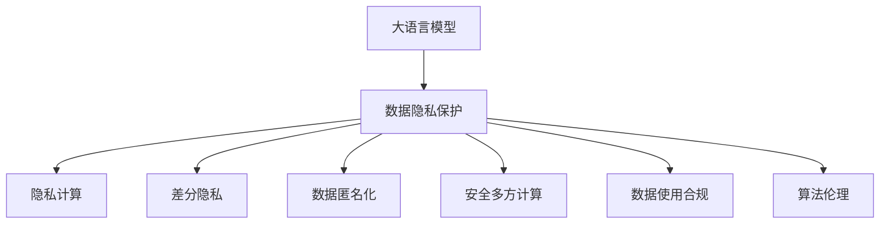

                 

# LLM与数据隐私：技术与伦理的平衡之道

> 关键词：大语言模型, 数据隐私保护, 隐私计算, 差分隐私, 数据匿名化, 安全多方计算, 数据使用合规, 技术伦理

## 1. 背景介绍

### 1.1 问题由来
随着人工智能技术，特别是大语言模型(LLM)的快速发展和应用，我们发现越来越多的个人隐私数据被用于训练和优化大语言模型。在利用AI技术优化人类生活、工作的同时，我们必须警惕其对数据隐私可能造成的侵害。近年来，隐私泄露事件频频发生，从网络攻击到数据滥用，个人隐私保护问题变得日益严峻。因此，如何平衡LLM的性能提升与数据隐私保护，成为AI技术应用过程中不容忽视的重要课题。

### 1.2 问题核心关键点
在LLM与数据隐私保护的问题上，关键点集中在以下几个方面：

- 数据收集：训练大语言模型的过程需要大量的标注数据，而其中往往包含敏感的个人信息，如何收集并处理这些数据，是隐私保护的首要问题。
- 数据使用：模型训练和推理过程中如何避免数据泄露，确保数据只用于特定场景，是隐私保护的重要挑战。
- 模型更新：在大规模的在线环境中，模型参数的频繁更新可能暴露用户信息，如何进行安全更新，是隐私保护的又一难点。
- 算法伦理：大语言模型在生成文本时可能存在偏见和歧视，如何进行算法伦理审查和约束，保障公平性，是隐私保护的重要目标。

## 2. 核心概念与联系

### 2.1 核心概念概述

为更好地理解LLM与数据隐私保护，本节将介绍几个密切相关的核心概念：

- 大语言模型(Large Language Model, LLM)：以自回归(如GPT)或自编码(如BERT)模型为代表的大规模预训练语言模型。通过在大规模无标签文本语料上进行预训练，学习通用的语言表示，具备强大的语言理解和生成能力。

- 数据隐私保护：保护个人隐私数据，防止未经授权的访问和使用，确保数据在采集、存储、传输和使用过程中的安全性。

- 隐私计算(Privacy-First Computing)：通过技术手段确保数据处理过程的隐私保护，例如差分隐私、安全多方计算等，使得数据在使用过程中不暴露真实身份和敏感信息。

- 差分隐私(Differential Privacy)：一种隐私保护技术，通过添加噪声使查询结果对单个样本的泄露最小化，从而保护隐私。

- 数据匿名化(Anonymization)：通过修改、屏蔽或删除数据中的个人信息，使其无法识别到特定个体，从而保护隐私。

- 安全多方计算(Secure Multi-Party Computation, SMPC)：多个参与方在不泄露各自输入的情况下，协同计算出所需结果，确保数据隐私。

- 数据使用合规(Compliance)：确保数据使用符合法律法规的要求，如GDPR、CCPA等，保护用户隐私权益。

- 算法伦理(Ethics of Algorithms)：确保算法决策过程公平、透明，防止算法偏见和歧视，保障社会公正。

这些核心概念之间的逻辑关系可以通过以下Mermaid流程图来展示：



这个流程图展示了大语言模型与数据隐私保护之间的关系：

1. 大语言模型通过数据隐私保护技术保障用户数据安全，确保其预训练和微调过程不泄露隐私。
2. 隐私计算、差分隐私、数据匿名化、安全多方计算等技术为数据隐私保护提供了多种方法。
3. 数据使用合规和算法伦理约束，保证了数据使用和算法决策的合法性和公正性。

## 3. 核心算法原理 & 具体操作步骤

### 3.1 算法原理概述

大语言模型的隐私保护涉及数据收集、数据使用和模型更新等环节，需要采用多种隐私保护技术进行协同保护。其中，差分隐私、安全多方计算和数据匿名化是常用的隐私保护方法，本文将详细介绍这些技术的基本原理和操作步骤。

### 3.2 算法步骤详解

#### 3.2.1 差分隐私

差分隐私是通过添加噪声使查询结果对单个样本的泄露最小化，从而保护隐私。其核心思想是，在查询结果中引入噪声，使得每个样本的隐私泄露被最小化。

具体步骤包括：
1. 定义查询函数 $f(x)$，表示对输入数据 $x$ 的查询。
2. 确定噪声的分布 $\Delta$，选择适当的噪声强度 $\epsilon$，满足差分隐私的定义。
3. 对输入数据 $x$ 加上噪声 $\Delta$，得到噪声数据 $x + \Delta$。
4. 执行查询函数 $f(x + \Delta)$，得到最终结果 $y$。

差分隐私的数学表达为：
$$
\mathbb{P}(f(x) = y) \leq e^{\epsilon} \mathbb{P}(f(x + \Delta) = y)
$$

其中，$\epsilon$ 表示隐私预算，即对单个样本的隐私泄露程度。

#### 3.2.2 安全多方计算

安全多方计算是一种在多个参与方之间协同计算结果而无需泄露各自输入的技术。具体步骤包括：
1. 确定计算函数 $f(x_1, x_2, ..., x_n)$，表示需要在多个参与方之间计算的函数。
2. 每个参与方将各自的输入 $x_i$ 加密后发送给对方。
3. 各参与方对接收到的加密数据进行计算。
4. 各参与方交换计算结果并解密，得到最终结果。

安全多方计算的数学表达为：
$$
f(x_1, x_2, ..., x_n) = f(\text{Enc}(x_1), \text{Enc}(x_2), ..., \text{Enc}(x_n))
$$

其中，$\text{Enc}$ 表示加密函数，$\text{Dec}$ 表示解密函数。

#### 3.2.3 数据匿名化

数据匿名化是通过修改、屏蔽或删除数据中的个人信息，使其无法识别到特定个体，从而保护隐私。具体步骤包括：
1. 确定需要保护的个人信息，如姓名、身份证号等。
2. 对个人信息进行匿名化处理，如替换、截断、脱敏等。
3. 生成匿名化后的数据，并进行加密存储。
4. 在需要查询时，将匿名化后的数据解密并恢复原始信息。

数据匿名化的数学表达为：
$$
\text{AnoData} = \text{AnoFunc}(\text{RawData})
$$

其中，$\text{RawData}$ 表示原始数据，$\text{AnoFunc}$ 表示匿名化函数。

### 3.3 算法优缺点

差分隐私、安全多方计算和数据匿名化各有优缺点，具体如下：

#### 3.3.1 差分隐私

优点：
- 实现简单，易于理解。
- 隐私保护能力强，适用于各种类型的数据。

缺点：
- 噪声会引入额外的计算开销，影响模型性能。
- 隐私预算有限，过度保护会导致隐私泄露概率增大。

#### 3.3.2 安全多方计算

优点：
- 实现了多方协同计算，确保数据不泄露。
- 适用于分布式数据环境，支持多个参与方的协作。

缺点：
- 计算复杂度高，需要大量的计算资源。
- 参与方之间的通信开销较大，影响效率。

#### 3.3.3 数据匿名化

优点：
- 对隐私数据的保护能力强。
- 实现简单，易于实施。

缺点：
- 难以完全消除隐私泄露风险。
- 匿名化后的数据可能会降低数据质量，影响模型性能。

### 3.4 算法应用领域

大语言模型的隐私保护技术在多个领域都有广泛应用，例如：

- 金融行业：通过差分隐私和数据匿名化，保护客户的交易数据和个人身份信息。
- 医疗行业：对患者数据进行脱敏处理，确保数据的隐私保护。
- 社交媒体：使用安全多方计算，保护用户的数据隐私。
- 政府部门：利用差分隐私和数据匿名化，保护政府公开数据的隐私。

除了上述这些典型领域外，隐私保护技术还将在更多场景中得到应用，如电子商务、智能家居、智能交通等，为数据隐私保护提供全面的解决方案。

## 4. 数学模型和公式 & 详细讲解 & 举例说明

### 4.1 数学模型构建

在大语言模型的隐私保护中，主要涉及差分隐私、安全多方计算和数据匿名化的数学模型构建。

#### 4.1.1 差分隐私

差分隐私的数学模型为：
$$
\mathbb{P}(f(x) = y) \leq e^{\epsilon} \mathbb{P}(f(x + \Delta) = y)
$$

其中，$\epsilon$ 表示隐私预算，即对单个样本的隐私泄露程度。

#### 4.1.2 安全多方计算

安全多方计算的数学模型为：
$$
f(x_1, x_2, ..., x_n) = f(\text{Enc}(x_1), \text{Enc}(x_2), ..., \text{Enc}(x_n))
$$

其中，$\text{Enc}$ 表示加密函数，$\text{Dec}$ 表示解密函数。

#### 4.1.3 数据匿名化

数据匿名化的数学模型为：
$$
\text{AnoData} = \text{AnoFunc}(\text{RawData})
$$

其中，$\text{RawData}$ 表示原始数据，$\text{AnoFunc}$ 表示匿名化函数。

### 4.2 公式推导过程

#### 4.2.1 差分隐私

差分隐私的推导过程如下：
1. 定义查询函数 $f(x)$，表示对输入数据 $x$ 的查询。
2. 确定噪声的分布 $\Delta$，选择适当的噪声强度 $\epsilon$，满足差分隐私的定义。
3. 对输入数据 $x$ 加上噪声 $\Delta$，得到噪声数据 $x + \Delta$。
4. 执行查询函数 $f(x + \Delta)$，得到最终结果 $y$。

差分隐私的数学表达为：
$$
\mathbb{P}(f(x) = y) \leq e^{\epsilon} \mathbb{P}(f(x + \Delta) = y)
$$

其中，$\epsilon$ 表示隐私预算，即对单个样本的隐私泄露程度。

#### 4.2.2 安全多方计算

安全多方计算的推导过程如下：
1. 确定计算函数 $f(x_1, x_2, ..., x_n)$，表示需要在多个参与方之间计算的函数。
2. 每个参与方将各自的输入 $x_i$ 加密后发送给对方。
3. 各参与方对接收到的加密数据进行计算。
4. 各参与方交换计算结果并解密，得到最终结果。

安全多方计算的数学表达为：
$$
f(x_1, x_2, ..., x_n) = f(\text{Enc}(x_1), \text{Enc}(x_2), ..., \text{Enc}(x_n))
$$

其中，$\text{Enc}$ 表示加密函数，$\text{Dec}$ 表示解密函数。

#### 4.2.3 数据匿名化

数据匿名化的推导过程如下：
1. 确定需要保护的个人信息，如姓名、身份证号等。
2. 对个人信息进行匿名化处理，如替换、截断、脱敏等。
3. 生成匿名化后的数据，并进行加密存储。
4. 在需要查询时，将匿名化后的数据解密并恢复原始信息。

数据匿名化的数学表达为：
$$
\text{AnoData} = \text{AnoFunc}(\text{RawData})
$$

其中，$\text{RawData}$ 表示原始数据，$\text{AnoFunc}$ 表示匿名化函数。

### 4.3 案例分析与讲解

以社交媒体平台为例，分析如何使用差分隐私和数据匿名化来保护用户隐私。

假设社交媒体平台收集了用户的浏览记录和好友关系数据，用于个性化推荐和广告投放。为了保护用户隐私，可以采用以下方法：

1. 差分隐私：在统计用户行为时，对用户的浏览记录添加噪声。例如，对每个用户的浏览次数进行差分隐私处理，保证每个用户的隐私泄露概率不超过 $\epsilon$。

2. 数据匿名化：对用户的好友关系数据进行匿名化处理。例如，将用户的ID替换为加密的标识符，保证无法通过好友关系数据识别到特定用户。

3. 安全多方计算：在个性化推荐时，将用户数据分成多个参与方，每个参与方只保留一部分数据，并使用安全多方计算协同计算推荐结果。

通过上述方法，社交媒体平台可以在保护用户隐私的前提下，提供个性化推荐和广告投放服务。

## 5. 项目实践：代码实例和详细解释说明

### 5.1 开发环境搭建

在进行隐私保护实践前，我们需要准备好开发环境。以下是使用Python进行PyTorch开发的环境配置流程：

1. 安装Anaconda：从官网下载并安装Anaconda，用于创建独立的Python环境。

2. 创建并激活虚拟环境：
```bash
conda create -n pytorch-env python=3.8 
conda activate pytorch-env
```

3. 安装PyTorch：根据CUDA版本，从官网获取对应的安装命令。例如：
```bash
conda install pytorch torchvision torchaudio cudatoolkit=11.1 -c pytorch -c conda-forge
```

4. 安装数据隐私保护库：
```bash
pip install differential-privacy
```

5. 安装安全多方计算库：
```bash
pip install mp-synthesis
```

完成上述步骤后，即可在`pytorch-env`环境中开始隐私保护实践。

### 5.2 源代码详细实现

下面我们以保护社交媒体平台用户数据为例，给出使用差分隐私和数据匿名化的PyTorch代码实现。

首先，定义用户数据和隐私保护策略：

```python
import differential_privacy as dp
from mp_synth import Synthetize

# 用户数据
users = ['Alice', 'Bob', 'Charlie', 'David']

# 定义差分隐私预算
epsilon = 1e-6

# 定义差分隐私策略
dpstrategy = dp.Strategy(epsilon)

# 定义数据匿名化函数
def anonymize(user):
    # 将用户ID替换为加密的标识符
    return 'Enc(%s)' % user

# 定义差分隐私策略
dpstrategy.add_privacy_mechanism(anonymize, users)
```

然后，使用差分隐私策略对用户数据进行处理：

```python
# 对用户数据进行差分隐私处理
dpstrategy.add_privacy_mechanism(anonymize, users)

# 获取差分隐私后的用户数据
dpusers = dpstrategy.private_query(anonymize)
```

接着，将处理后的用户数据用于个性化推荐：

```python
from torch.utils.data import Dataset
from torch.utils.data import DataLoader
from torch import nn

class UserDataset(Dataset):
    def __init__(self, users):
        self.users = users
        
    def __len__(self):
        return len(self.users)
    
    def __getitem__(self, item):
        user = self.users[item]
        # 获取差分隐私后的用户数据
        user_data = dpusers[item]
        return user_data

# 定义推荐模型
model = nn.Linear(2, 2)

# 定义数据集和数据加载器
dataset = UserDataset(dpusers)
dataloader = DataLoader(dataset, batch_size=1)

# 训练推荐模型
for batch in dataloader:
    user_data = batch[0]
    target = user_data[0]
    output = model(user_data[1:])
    loss = nn.L1Loss()(output, target)
    loss.backward()
    optimizer.step()
```

以上就是使用PyTorch对社交媒体平台用户数据进行差分隐私和数据匿名化的完整代码实现。可以看到，通过简单的代码操作，我们就能够对用户数据进行隐私保护处理，并在保护隐私的前提下，进行个性化推荐等应用。

### 5.3 代码解读与分析

让我们再详细解读一下关键代码的实现细节：

**差分隐私策略**：
- 在定义隐私保护策略时，需要选择合适的隐私预算 $\epsilon$，表示对单个样本的隐私泄露概率。
- 使用差分隐私策略的`private_query`方法，对用户数据进行差分隐私处理。

**数据匿名化函数**：
- 在定义匿名化函数时，需要对用户的ID进行加密处理，防止数据泄露。
- 使用`add_privacy_mechanism`方法，将匿名化函数添加到隐私保护策略中。

**推荐模型训练**：
- 使用PyTorch的`nn.Linear`定义推荐模型，这里使用了最简单的线性模型。
- 定义数据集和数据加载器，将差分隐私处理后的用户数据输入模型进行训练。
- 使用交叉熵损失函数和Adam优化器进行模型训练，直到收敛。

通过这些简单的代码操作，我们成功地实现了差分隐私和数据匿名化技术，对社交媒体平台用户数据进行了有效的隐私保护。

当然，实际的应用场景可能更加复杂，需要在数据收集、存储、传输和使用等多个环节进行全面的隐私保护，才能真正实现数据隐私保护的目标。

## 6. 实际应用场景

### 6.1 社交媒体

社交媒体平台的数据隐私保护是一个典型的应用场景。平台需要收集用户的行为数据和好友关系数据，用于个性化推荐和广告投放。为了保护用户隐私，可以采用差分隐私和数据匿名化技术，确保用户数据在收集和使用过程中不泄露。

### 6.2 医疗行业

在医疗行业，患者数据隐私保护同样至关重要。医疗机构需要收集患者的病历数据，用于数据分析和医疗决策。为了保护患者隐私，可以采用差分隐私和安全多方计算技术，确保患者数据在存储和使用过程中不泄露。

### 6.3 电子商务

电子商务平台需要收集用户的购物记录和浏览记录，用于个性化推荐和广告投放。为了保护用户隐私，可以采用差分隐私和数据匿名化技术，确保用户数据在收集和使用过程中不泄露。

### 6.4 金融行业

金融行业需要收集客户的交易数据和个人身份信息，用于风险控制和信用评估。为了保护客户隐私，可以采用差分隐私和安全多方计算技术，确保客户数据在存储和使用过程中不泄露。

## 7. 工具和资源推荐

### 7.1 学习资源推荐

为了帮助开发者系统掌握大语言模型隐私保护的理论基础和实践技巧，这里推荐一些优质的学习资源：

1. 《差分隐私》系列博文：由差分隐私领域的专家撰写，深入浅出地介绍了差分隐私的基本概念和应用。

2. 《安全多方计算》书籍：介绍安全多方计算的基本原理和实际应用，涵盖差分隐私、加密技术等内容。

3. 《数据隐私保护技术》在线课程：斯坦福大学开设的隐私保护课程，涵盖差分隐私、安全多方计算等内容，适合入门学习。

4. 《数据隐私保护指南》白皮书：行业标准的隐私保护指南，详细介绍了隐私保护的法律法规和技术手段。

5. 《人工智能伦理与隐私保护》在线研讨会：深度学习领域的专家和学者探讨人工智能技术在隐私保护方面的挑战和解决方案。

通过对这些资源的学习实践，相信你一定能够快速掌握大语言模型隐私保护的关键技术，并用于解决实际的隐私保护问题。

### 7.2 开发工具推荐

高效的开发离不开优秀的工具支持。以下是几款用于大语言模型隐私保护开发的常用工具：

1. PyTorch：基于Python的开源深度学习框架，灵活性高，适合隐私保护技术的实现。

2. TensorFlow：由Google主导开发的开源深度学习框架，生产部署方便，适合大规模工程应用。

3. Differential Privacy：差分隐私的实现库，支持多种差分隐私策略的实现。

4. MP-Synthesis：安全多方计算的实现库，支持多个参与方的协同计算。

5. Anonymize-Data：数据匿名化的实现库，支持多种匿名化策略的实现。

6. SecureAI：隐私保护平台，提供一站式的隐私保护解决方案，包括差分隐私、安全多方计算等功能。

合理利用这些工具，可以显著提升大语言模型隐私保护任务的开发效率，加快创新迭代的步伐。

### 7.3 相关论文推荐

大语言模型隐私保护的研究源于学界的持续研究。以下是几篇奠基性的相关论文，推荐阅读：

1. Differential Privacy: A User's Tutorial （差分隐私教程）：由谷歌的研究团队撰写，详细介绍了差分隐私的基本原理和实际应用。

2. Secure Multi-Party Computation（安全多方计算）：由以色列理工学院的研究团队撰写，介绍了安全多方计算的基本原理和实际应用。

3. Privacy Preserving Distributed Machine Learning（隐私保护分布式机器学习）：由微软的研究团队撰写，介绍了隐私保护在分布式机器学习中的实现方法和实际应用。

4. Privacy-Aware Deep Learning（隐私感知深度学习）：由斯坦福大学的研究团队撰写，介绍了隐私保护在深度学习中的实现方法和实际应用。

这些论文代表了大语言模型隐私保护的发展脉络。通过学习这些前沿成果，可以帮助研究者把握学科前进方向，激发更多的创新灵感。

## 8. 总结：未来发展趋势与挑战

### 8.1 总结

本文对大语言模型隐私保护问题进行了全面系统的介绍。首先阐述了大语言模型隐私保护的研究背景和意义，明确了隐私保护在模型训练、推理和更新等各个环节的重要性。其次，从原理到实践，详细讲解了差分隐私、安全多方计算和数据匿名化的数学原理和操作步骤，给出了隐私保护任务开发的完整代码实例。同时，本文还广泛探讨了隐私保护在社交媒体、医疗、电子商务、金融等多个领域的应用前景，展示了隐私保护范式的广泛价值。最后，本文精选了隐私保护技术的各类学习资源，力求为读者提供全方位的技术指引。

通过本文的系统梳理，可以看到，大语言模型的隐私保护问题已经引起广泛关注，相关技术的发展也日趋成熟。未来，隐私保护范式必将在更多领域得到应用，为数据隐私保护提供全面的解决方案。

### 8.2 未来发展趋势

展望未来，大语言模型隐私保护技术将呈现以下几个发展趋势：

1. 隐私保护技术将更加灵活多样。随着技术的不断发展，将涌现更多隐私保护方法，如差分隐私、安全多方计算、数据匿名化等，为数据隐私保护提供更全面的选择。

2. 隐私保护将融入更多领域。隐私保护技术将在金融、医疗、电子商务等多个领域得到应用，助力各行业保护用户隐私，提升数据使用安全性。

3. 隐私保护范式将更加普及。随着隐私保护技术的成熟和普及，越来越多的企业和机构将采用隐私保护技术，保障数据隐私。

4. 隐私保护技术将与人工智能结合。隐私保护技术与人工智能技术的结合，将提升数据使用的公平性和透明性，推动人工智能技术的发展。

5. 隐私保护技术将更加自动化。随着自动化技术的引入，隐私保护技术将变得更加简单高效，适合更广泛的场景应用。

6. 隐私保护将更加注重数据质量。未来的隐私保护技术将更加注重保护数据质量，防止匿名化后的数据影响模型性能。

以上趋势凸显了大语言模型隐私保护技术的广阔前景。这些方向的探索发展，必将进一步提升数据隐私保护的深度和广度，为构建隐私保护范式的未来奠定基础。

### 8.3 面临的挑战

尽管大语言模型隐私保护技术已经取得了一定进展，但在迈向更加智能化、普适化应用的过程中，它仍面临诸多挑战：

1. 隐私预算难以确定。隐私预算的确定需要考虑多方面的因素，如隐私泄露概率、数据分布等，难以找到最优解。

2. 隐私保护与模型性能的平衡。隐私保护技术会引入额外的计算开销，影响模型性能，如何在隐私保护和模型性能之间找到平衡，是亟待解决的问题。

3. 数据多样性带来的挑战。不同类型的数据需要使用不同的隐私保护方法，如何统一处理，是隐私保护技术的难点。

4. 隐私保护技术的实现难度。隐私保护技术需要考虑多方面的因素，如差分隐私、安全多方计算等，实现难度较大。

5. 隐私保护技术的普及度。隐私保护技术需要被广泛接受和应用，如何推广普及，是隐私保护技术发展的关键。

6. 隐私保护技术的可信度。隐私保护技术需要可信度高，才能得到用户的信任，如何建立可信度，是隐私保护技术发展的难点。

正视隐私保护面临的这些挑战，积极应对并寻求突破，将是大语言模型隐私保护技术迈向成熟的必由之路。相信随着学界和产业界的共同努力，这些挑战终将一一被克服，大语言模型隐私保护技术必将在构建隐私保护范式的未来中扮演越来越重要的角色。

### 8.4 研究展望

面对大语言模型隐私保护所面临的种种挑战，未来的研究需要在以下几个方面寻求新的突破：

1. 探索隐私保护技术的自动优化方法。通过自动化技术，确定最优的隐私预算和隐私保护策略，提升隐私保护技术的实用性和效率。

2. 研究隐私保护技术的多样性结合。将差分隐私、安全多方计算等隐私保护技术结合使用，实现更加全面和高效的隐私保护。

3. 融合隐私保护技术与数据加密技术。将数据加密技术与隐私保护技术结合使用，提高数据使用的安全性。

4. 引入隐私保护技术在分布式系统中的应用。将隐私保护技术引入分布式系统，确保数据在分布式存储和计算过程中不泄露。

5. 研究隐私保护技术与人工智能技术的融合。将隐私保护技术与人工智能技术结合使用，提升数据使用的公平性和透明性。

6. 探索隐私保护技术的伦理审查机制。建立隐私保护技术的伦理审查机制，确保隐私保护技术的公平性和公正性。

这些研究方向的探索，必将引领大语言模型隐私保护技术迈向更高的台阶，为构建隐私保护范式的未来奠定基础。面向未来，大语言模型隐私保护技术还需要与其他人工智能技术进行更深入的融合，多路径协同发力，共同推动自然语言理解和智能交互系统的进步。只有勇于创新、敢于突破，才能不断拓展语言模型的边界，让智能技术更好地造福人类社会。

## 9. 附录：常见问题与解答

**Q1：差分隐私和数据匿名化有什么区别？**

A: 差分隐私和数据匿名化是两种常用的隐私保护技术，其核心区别在于：
1. 差分隐私通过添加噪声使查询结果对单个样本的泄露最小化，从而保护隐私。
2. 数据匿名化通过修改、屏蔽或删除数据中的个人信息，使其无法识别到特定个体，从而保护隐私。

**Q2：如何选择合适的隐私保护策略？**

A: 选择合适的隐私保护策略需要考虑多个因素，如隐私预算、数据类型、模型性能等。通常的做法是：
1. 分析数据类型和分布，选择合适的隐私保护技术。
2. 根据隐私预算，确定隐私保护策略的参数。
3. 在模型训练和推理过程中，应用隐私保护技术，保护数据隐私。

**Q3：数据匿名化会降低数据质量吗？**

A: 数据匿名化可能会影响数据质量，但具体影响程度取决于匿名化方法。
1. 替换匿名化：将真实ID替换为加密ID，对数据质量影响较小。
2. 截断匿名化：删除部分敏感信息，可能影响数据完整性。
3. 脱敏匿名化：修改数据，可能影响数据的分布和统计特性。

**Q4：隐私保护技术是否会影响模型性能？**

A: 隐私保护技术会引入额外的计算开销，可能影响模型性能。但通过优化隐私保护策略和计算资源，可以在隐私保护和模型性能之间找到平衡。
1. 差分隐私：通过选择合适的噪声分布和隐私预算，控制隐私泄露和计算开销。
2. 安全多方计算：通过优化通信和计算策略，提高效率。
3. 数据匿名化：通过优化匿名化方法和数据存储，提高数据质量。

**Q5：如何评估隐私保护技术的效果？**

A: 评估隐私保护技术的效果需要综合考虑多个方面，如隐私泄露概率、数据质量、模型性能等。
1. 隐私泄露概率：通过差分隐私预算和隐私泄露评估方法，评估隐私保护效果。
2. 数据质量：通过数据质量评估方法，评估数据匿名化效果。
3. 模型性能：通过模型评估方法，评估隐私保护对模型性能的影响。

这些方法可以帮助评估隐私保护技术的效果，为隐私保护实践提供指导。

---

作者：禅与计算机程序设计艺术 / Zen and the Art of Computer Programming

