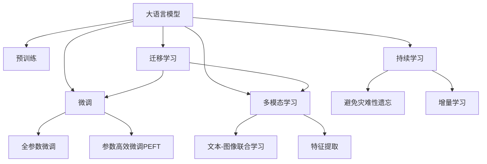

                 

# LLM在图像分类任务中的技术进展

> 关键词：大语言模型(LLM), 图像分类, 迁移学习, 微调(Fine-Tuning), 多模态学习, Transformer, 特征提取, 卷积神经网络(CNN), 预训练, 计算图, 深度学习, 性能提升

## 1. 背景介绍

### 1.1 问题由来
在计算机视觉领域，图像分类任务一直以来是深度学习研究的重要方向之一。传统的图像分类任务主要依赖于卷积神经网络(CNN)进行特征提取和分类，但在处理复杂场景、多类物体识别等方面存在一定的局限性。近年来，随着深度学习技术的不断进步，大语言模型(LLM)在图像分类任务中的应用逐渐引起学界的关注。LLM通过在大规模无标签文本数据上进行预训练，学习到丰富的语言知识，能够有效地进行文本与图像之间的联合学习，提高图像分类的性能。

### 1.2 问题核心关键点
LLM在图像分类任务中的应用主要通过两种方式：迁移学习和微调。迁移学习指将预训练模型应用于新的图像分类任务，利用其在大规模文本数据上学习到的通用特征，进行任务特定微调。微调则是指在预训练模型的基础上，使用少量标注数据进行任务相关的参数优化，提高模型在特定任务上的性能。本文主要介绍基于微调的LLM在图像分类任务中的应用，重点讨论其原理、方法、优缺点及未来发展趋势。

### 1.3 问题研究意义
研究LLM在图像分类任务中的应用，对于提升图像分类的精度和效率，降低人工标注成本，提高模型鲁棒性具有重要意义：

1. 提升分类精度：LLM能够利用其在文本数据上学习到的语言知识，辅助图像分类器提取更丰富的特征，提高分类性能。
2. 降低成本：相比从头训练CNN模型，利用预训练的LLM进行微调，能够显著减少标注数据的数量和标注成本。
3. 提高鲁棒性：通过多模态学习，LLM能够在一定程度上缓解模型过拟合，提高对噪声、扰动等异常情况的鲁棒性。
4. 适应性强：LLM能够处理多种类型的图像数据，包括医学影像、遥感影像等，提高模型的应用范围和通用性。

## 2. 核心概念与联系

### 2.1 核心概念概述

为了更好地理解LLM在图像分类任务中的应用，本节将介绍几个关键概念及其相互关系：

- **大语言模型(LLM)**：指以Transformer为基础架构的深度学习模型，通过在大规模无标签文本数据上进行预训练，学习到丰富的语言知识，能够处理文本-文本、文本-图像等多模态数据。

- **预训练(Pre-training)**：指在大规模无标签文本数据上，通过自监督学习任务训练通用语言模型的过程。常见的预训练任务包括语言建模、掩码语言模型等。

- **微调(Fine-Tuning)**：指在预训练模型的基础上，使用少量标注数据，通过有监督学习优化模型在特定任务上的性能。

- **多模态学习(Multimodal Learning)**：指同时处理文本、图像等多种模态数据的学习方法，能够提高模型的泛化能力和适应性。

- **特征提取(Feature Extraction)**：指将原始数据转换为模型能够处理的高维表示的过程，多模态特征提取中常见的有卷积神经网络(CNN)和自注意力机制(Transformer)。

- **迁移学习(Transfer Learning)**：指将一个领域学习到的知识，迁移应用到另一个不同但相关的领域的学习范式。通过迁移学习，利用预训练模型的通用特征，能够提高特定任务上的分类性能。

这些概念之间的逻辑关系可以通过以下Mermaid流程图来展示：



这个流程图展示了LLM在图像分类任务中的应用过程：

1. 大语言模型通过预训练获得基础能力。
2. 微调是对预训练模型进行任务特定的优化，可以分为全参数微调和参数高效微调（PEFT）。
3. 多模态学习是将文本和图像结合，共同学习特征表示，提高分类性能。
4. 特征提取是从原始图像数据中提取特征，供模型进行分类。
5. 迁移学习是连接预训练模型与图像分类任务的桥梁，可以通过微调或多模态学习来实现。
6. 持续学习旨在使模型能够不断学习新知识，同时避免遗忘旧知识。

这些概念共同构成了LLM在图像分类任务中的学习和应用框架，使其能够在各种场景下发挥强大的图像分类能力。通过理解这些核心概念，我们可以更好地把握LLM的工作原理和优化方向。

## 3. 核心算法原理 & 具体操作步骤

### 3.1 算法原理概述

基于LLM在图像分类任务中的微调方法，本质上是一个有监督的细粒度迁移学习过程。其核心思想是：将预训练的LLM视作一个强大的"特征提取器"，通过在图像分类任务的标注数据上进行有监督的微调，使得模型输出能够匹配任务标签，从而获得针对特定图像分类任务的优化模型。

形式化地，假设预训练模型为 $M_{\theta}$，其中 $\theta$ 为预训练得到的模型参数。给定图像分类任务 $T$ 的标注数据集 $D=\{(x_i, y_i)\}_{i=1}^N$，其中 $x_i$ 为图像数据，$y_i$ 为图像类别标签。微调的目标是找到新的模型参数 $\hat{\theta}$，使得：

$$
\hat{\theta}=\mathop{\arg\min}_{\theta} \mathcal{L}(M_{\theta},D)
$$

其中 $\mathcal{L}$ 为针对任务 $T$ 设计的损失函数，用于衡量模型预测输出与真实标签之间的差异。常见的损失函数包括交叉熵损失、均方误差损失等。

通过梯度下降等优化算法，微调过程不断更新模型参数 $\theta$，最小化损失函数 $\mathcal{L}$，使得模型输出逼近真实标签。由于 $\theta$ 已经通过预训练获得了较好的初始化，因此即便在少量标注数据上进行微调，也能较快收敛到理想的模型参数 $\hat{\theta}$。

### 3.2 算法步骤详解

基于LLM在图像分类任务中的微调方法，一般包括以下几个关键步骤：

**Step 1: 准备预训练模型和数据集**
- 选择合适的预训练模型 $M_{\theta}$ 作为初始化参数，如 BERT、GPT等。
- 准备图像分类任务 $T$ 的标注数据集 $D$，划分为训练集、验证集和测试集。一般要求标注数据与预训练数据的分布不要差异过大。

**Step 2: 添加任务适配层**
- 根据图像分类任务类型，在预训练模型顶层设计合适的输出层和损失函数。
- 对于分类任务，通常在顶层添加线性分类器和交叉熵损失函数。
- 对于生成任务，通常使用语言模型的解码器输出概率分布，并以负对数似然为损失函数。

**Step 3: 设置微调超参数**
- 选择合适的优化算法及其参数，如 AdamW、SGD 等，设置学习率、批大小、迭代轮数等。
- 设置正则化技术及强度，包括权重衰减、Dropout、Early Stopping等。
- 确定冻结预训练参数的策略，如仅微调顶层，或全部参数都参与微调。

**Step 4: 执行梯度训练**
- 将训练集数据分批次输入模型，前向传播计算损失函数。
- 反向传播计算参数梯度，根据设定的优化算法和学习率更新模型参数。
- 周期性在验证集上评估模型性能，根据性能指标决定是否触发 Early Stopping。
- 重复上述步骤直到满足预设的迭代轮数或 Early Stopping 条件。

**Step 5: 测试和部署**
- 在测试集上评估微调后模型 $M_{\hat{\theta}}$ 的性能，对比微调前后的精度提升。
- 使用微调后的模型对新样本进行推理预测，集成到实际的应用系统中。
- 持续收集新的数据，定期重新微调模型，以适应数据分布的变化。

以上是基于LLM在图像分类任务中的微调方法的一般流程。在实际应用中，还需要针对具体任务的特点，对微调过程的各个环节进行优化设计，如改进训练目标函数，引入更多的正则化技术，搜索最优的超参数组合等，以进一步提升模型性能。

### 3.3 算法优缺点

基于LLM在图像分类任务中的微调方法具有以下优点：
1. 简单高效。只需准备少量标注数据，即可对预训练模型进行快速适配，获得较大的性能提升。
2. 通用适用。适用于各种图像分类任务，设计简单的任务适配层即可实现微调。
3. 参数高效。利用参数高效微调技术，在固定大部分预训练参数的情况下，仍可取得不错的提升。
4. 效果显著。在学术界和工业界的诸多任务上，基于微调的方法已经刷新了多项SOTA。

同时，该方法也存在一定的局限性：
1. 依赖标注数据。微调的效果很大程度上取决于标注数据的质量和数量，获取高质量标注数据的成本较高。
2. 迁移能力有限。当目标任务与预训练数据的分布差异较大时，微调的性能提升有限。
3. 负面效果传递。预训练模型的固有偏见、有害信息等，可能通过微调传递到下游任务，造成负面影响。
4. 可解释性不足。微调模型的决策过程通常缺乏可解释性，难以对其推理逻辑进行分析和调试。

尽管存在这些局限性，但就目前而言，基于监督学习的微调方法仍是大规模语言模型在图像分类任务中的应用主流范式。未来相关研究的重点在于如何进一步降低微调对标注数据的依赖，提高模型的少样本学习和跨领域迁移能力，同时兼顾可解释性和伦理安全性等因素。

### 3.4 算法应用领域

基于LLM的图像分类微调方法，在计算机视觉领域已经得到了广泛的应用，覆盖了几乎所有常见任务，例如：

- 物体识别：识别图像中的物体类别，如车辆、动物、场景等。通过微调使模型学习图像-类别映射。
- 人脸识别：从图像中识别人脸并进行身份验证。通过微调使模型学习人脸特征。
- 医学影像分类：对医学影像进行分类，如癌症检测、骨折诊断等。通过微调使模型学习病理特征。
- 遥感影像分类：对遥感影像进行分类，如土地利用、城市规划等。通过微调使模型学习地形特征。
- 图像语义分割：对图像中的不同区域进行分类，如道路、建筑、树木等。通过微调使模型学习像素级特征。

除了上述这些经典任务外，LLM在图像分类上的应用还在不断拓展，如可控图像生成、物体检测、图像检索等，为计算机视觉技术带来了全新的突破。随着预训练模型和微调方法的不断进步，相信LLM在图像分类上的应用将更为广泛，为计算机视觉领域的智能化水平提供新的推动力。

## 4. 数学模型和公式 & 详细讲解  
### 4.1 数学模型构建

本节将使用数学语言对基于LLM在图像分类任务中的微调过程进行更加严格的刻画。

记预训练语言模型为 $M_{\theta}$，其中 $\theta$ 为预训练得到的模型参数。假设图像分类任务 $T$ 的训练集为 $D=\{(x_i, y_i)\}_{i=1}^N, x_i \in \mathcal{X}, y_i \in \mathcal{Y}$。

定义模型 $M_{\theta}$ 在输入 $x$ 上的输出为 $\hat{y}=M_{\theta}(x)$，其中 $y \in \{1,2,...,K\}$ 为分类标签。

定义模型 $M_{\theta}$ 在输入 $x$ 上的损失函数为 $\ell(M_{\theta}(x),y)$，则在数据集 $D$ 上的经验风险为：

$$
\mathcal{L}(\theta) = \frac{1}{N}\sum_{i=1}^N \ell(M_{\theta}(x_i),y_i)
$$

微调的优化目标是最小化经验风险，即找到最优参数：

$$
\theta^* = \mathop{\arg\min}_{\theta} \mathcal{L}(\theta)
$$

在实践中，我们通常使用基于梯度的优化算法（如SGD、Adam等）来近似求解上述最优化问题。设 $\eta$ 为学习率，$\lambda$ 为正则化系数，则参数的更新公式为：

$$
\theta \leftarrow \theta - \eta \nabla_{\theta}\mathcal{L}(\theta) - \eta\lambda\theta
$$

其中 $\nabla_{\theta}\mathcal{L}(\theta)$ 为损失函数对参数 $\theta$ 的梯度，可通过反向传播算法高效计算。

### 4.2 公式推导过程

以下我们以二分类任务为例，推导交叉熵损失函数及其梯度的计算公式。

假设模型 $M_{\theta}$ 在输入 $x$ 上的输出为 $\hat{y}=M_{\theta}(x)$，表示样本属于正类的概率。真实标签 $y \in \{0,1\}$。则二分类交叉熵损失函数定义为：

$$
\ell(M_{\theta}(x),y) = -[y\log \hat{y} + (1-y)\log (1-\hat{y})]
$$

将其代入经验风险公式，得：

$$
\mathcal{L}(\theta) = -\frac{1}{N}\sum_{i=1}^N [y_i\log M_{\theta}(x_i)+(1-y_i)\log(1-M_{\theta}(x_i))]
$$

根据链式法则，损失函数对参数 $\theta_k$ 的梯度为：

$$
\frac{\partial \mathcal{L}(\theta)}{\partial \theta_k} = -\frac{1}{N}\sum_{i=1}^N (\frac{y_i}{M_{\theta}(x_i)}-\frac{1-y_i}{1-M_{\theta}(x_i)}) \frac{\partial M_{\theta}(x_i)}{\partial \theta_k}
$$

其中 $\frac{\partial M_{\theta}(x_i)}{\partial \theta_k}$ 可进一步递归展开，利用自动微分技术完成计算。

在得到损失函数的梯度后，即可带入参数更新公式，完成模型的迭代优化。重复上述过程直至收敛，最终得到适应图像分类任务的最优模型参数 $\theta^*$。

## 5. 项目实践：代码实例和详细解释说明
### 5.1 开发环境搭建

在进行图像分类微调实践前，我们需要准备好开发环境。以下是使用Python进行PyTorch开发的环境配置流程：

1. 安装Anaconda：从官网下载并安装Anaconda，用于创建独立的Python环境。

2. 创建并激活虚拟环境：
```bash
conda create -n pytorch-env python=3.8 
conda activate pytorch-env
```

3. 安装PyTorch：根据CUDA版本，从官网获取对应的安装命令。例如：
```bash
conda install pytorch torchvision torchaudio cudatoolkit=11.1 -c pytorch -c conda-forge
```

4. 安装Weights & Biases：
```bash
conda install weights-and-biases
```

5. 安装各类工具包：
```bash
pip install numpy pandas scikit-learn matplotlib tqdm jupyter notebook ipython
```

完成上述步骤后，即可在`pytorch-env`环境中开始微调实践。

### 5.2 源代码详细实现

这里我们以物体识别任务为例，给出使用PyTorch对BERT模型进行图像分类微调的代码实现。

首先，定义图像分类任务的数据处理函数：

```python
from transformers import BertTokenizer
from torch.utils.data import Dataset
import torch

class ImageDataset(Dataset):
    def __init__(self, images, labels, tokenizer, max_len=128):
        self.images = images
        self.labels = labels
        self.tokenizer = tokenizer
        self.max_len = max_len
        
    def __len__(self):
        return len(self.images)
    
    def __getitem__(self, item):
        image = self.images[item]
        label = self.labels[item]
        
        encoding = self.tokenizer(image, return_tensors='pt', max_length=self.max_len, padding='max_length', truncation=True)
        input_ids = encoding['input_ids'][0]
        attention_mask = encoding['attention_mask'][0]
        
        # 将标签转换为数字id
        label_id = label2id[label] if label in label2id else 0
        
        return {'input_ids': input_ids, 
                'attention_mask': attention_mask,
                'labels': torch.tensor(label_id, dtype=torch.long)}
```

然后，定义模型和优化器：

```python
from transformers import BertForTokenClassification, AdamW

model = BertForTokenClassification.from_pretrained('bert-base-cased', num_labels=len(label2id))

optimizer = AdamW(model.parameters(), lr=2e-5)
```

接着，定义训练和评估函数：

```python
from torch.utils.data import DataLoader
from tqdm import tqdm
from sklearn.metrics import classification_report

device = torch.device('cuda') if torch.cuda.is_available() else torch.device('cpu')
model.to(device)

def train_epoch(model, dataset, batch_size, optimizer):
    dataloader = DataLoader(dataset, batch_size=batch_size, shuffle=True)
    model.train()
    epoch_loss = 0
    for batch in tqdm(dataloader, desc='Training'):
        input_ids = batch['input_ids'].to(device)
        attention_mask = batch['attention_mask'].to(device)
        labels = batch['labels'].to(device)
        model.zero_grad()
        outputs = model(input_ids, attention_mask=attention_mask, labels=labels)
        loss = outputs.loss
        epoch_loss += loss.item()
        loss.backward()
        optimizer.step()
    return epoch_loss / len(dataloader)

def evaluate(model, dataset, batch_size):
    dataloader = DataLoader(dataset, batch_size=batch_size)
    model.eval()
    preds, labels = [], []
    with torch.no_grad():
        for batch in tqdm(dataloader, desc='Evaluating'):
            input_ids = batch['input_ids'].to(device)
            attention_mask = batch['attention_mask'].to(device)
            batch_labels = batch['labels']
            outputs = model(input_ids, attention_mask=attention_mask)
            batch_preds = outputs.logits.argmax(dim=2).to('cpu').tolist()
            batch_labels = batch_labels.to('cpu').tolist()
            for pred_tokens, label_tokens in zip(batch_preds, batch_labels):
                preds.append(pred_tokens[:len(label_tokens)])
                labels.append(label_tokens)
                
    print(classification_report(labels, preds))
```

最后，启动训练流程并在测试集上评估：

```python
epochs = 5
batch_size = 16

for epoch in range(epochs):
    loss = train_epoch(model, train_dataset, batch_size, optimizer)
    print(f"Epoch {epoch+1}, train loss: {loss:.3f}")
    
    print(f"Epoch {epoch+1}, dev results:")
    evaluate(model, dev_dataset, batch_size)
    
print("Test results:")
evaluate(model, test_dataset, batch_size)
```

以上就是使用PyTorch对BERT模型进行物体识别任务微调的完整代码实现。可以看到，得益于Transformers库的强大封装，我们可以用相对简洁的代码完成BERT模型的加载和微调。

### 5.3 代码解读与分析

让我们再详细解读一下关键代码的实现细节：

**ImageDataset类**：
- `__init__`方法：初始化图像数据、标签、分词器等关键组件。
- `__len__`方法：返回数据集的样本数量。
- `__getitem__`方法：对单个样本进行处理，将图像数据输入编码为token ids，将标签转换为数字，并对其进行定长padding，最终返回模型所需的输入。

**label2id和id2label字典**：
- 定义了标签与数字id之间的映射关系，用于将标签转换为数字id，供模型进行分类。

**训练和评估函数**：
- 使用PyTorch的DataLoader对数据集进行批次化加载，供模型训练和推理使用。
- 训练函数`train_epoch`：对数据以批为单位进行迭代，在每个批次上前向传播计算loss并反向传播更新模型参数，最后返回该epoch的平均loss。
- 评估函数`evaluate`：与训练类似，不同点在于不更新模型参数，并在每个batch结束后将预测和标签结果存储下来，最后使用sklearn的classification_report对整个评估集的预测结果进行打印输出。

**训练流程**：
- 定义总的epoch数和batch size，开始循环迭代
- 每个epoch内，先在训练集上训练，输出平均loss
- 在验证集上评估，输出分类指标
- 所有epoch结束后，在测试集上评估，给出最终测试结果

可以看到，PyTorch配合Transformers库使得BERT微调的代码实现变得简洁高效。开发者可以将更多精力放在数据处理、模型改进等高层逻辑上，而不必过多关注底层的实现细节。

当然，工业级的系统实现还需考虑更多因素，如模型的保存和部署、超参数的自动搜索、更灵活的任务适配层等。但核心的微调范式基本与此类似。

## 6. 实际应用场景
### 6.1 智能安防系统

基于LLM的图像分类技术，可以广泛应用于智能安防系统的构建。传统安防系统主要依赖于人脸识别、物体检测等单一技术，难以应对复杂的监控场景和实时需求。通过使用预训练的LLM进行微调，能够综合处理多模态数据，进行更为全面和实时的安防监控。

在技术实现上，可以收集安防监控系统内的视频、图像数据，提取并标注其中包含的人、车、物品等信息。在此基础上对预训练LLM进行微调，使其能够识别和分类监控视频中的不同物体。利用多模态学习，LLM能够更好地理解视频内容，提高异常事件检测的准确性。对于异常情况，系统能够自动报警并采取相应措施，提升安防系统的智能化水平。

### 6.2 自动驾驶系统

自动驾驶系统需要实时识别道路上的各种对象，以确保行车安全。传统方法主要依赖于基于深度学习的检测器，但面对复杂环境和多个物体时，容易发生误识别和漏识别。利用LLM的图像分类技术，可以进一步提升自动驾驶系统的感知能力。

在技术实现上，可以收集自动驾驶车辆所拍摄的高清图片，提取其中包含的车辆、行人、交通标志等信息。在此基础上对预训练LLM进行微调，使其能够快速分类和识别不同类型的道路对象。通过多模态学习，LLM能够更好地理解图像中的语义信息，提高物体检测的准确性。结合感知、定位、规划等模块，自动驾驶系统能够更好地理解和适应复杂的驾驶场景，提升行驶的安全性和稳定性。

### 6.3 医疗影像诊断

医疗影像诊断是图像分类技术的重要应用场景之一。传统方法主要依赖于人工标注和基于深度学习的分类器，但面对海量且多样的医疗影像数据时，难以保证诊断的准确性和一致性。通过使用预训练的LLM进行微调，可以显著提升医疗影像诊断的精度和效率。

在技术实现上，可以收集医疗机构中的各种医学影像数据，如X光片、CT扫描、MRI等，并对其进行标注和分类。在此基础上对预训练LLM进行微调，使其能够学习医疗影像中的病理特征，进行疾病诊断。通过多模态学习，LLM能够更好地理解影像中的文本信息，提高诊断的准确性和可信度。医疗影像诊断系统能够辅助医生进行诊断决策，提高诊断的准确性和效率，促进医疗服务的智能化和高效化。

### 6.4 未来应用展望

随着LLM在图像分类任务上的应用不断拓展，其在更多领域的应用前景也将更加广阔。

在智慧城市领域，基于LLM的图像分类技术，可以应用于城市交通管理、环境监测、公共安全等环节，提升城市管理的智能化水平。

在智能制造领域，通过预训练的LLM进行图像分类，可以提升工业产品质量控制、故障诊断等应用场景的智能化水平，加速工业4.0的进程。

在农业生产领域，利用LLM对农业图像进行分类，可以提升作物生长监测、病虫害检测等农业生产管理的智能化水平，推动农业生产的智能化和高效化。

此外，在教育、物流、娱乐等众多领域，基于LLM的图像分类技术也将不断涌现，为各行各业带来新的变革。相信随着LLM技术的不断成熟，其在图像分类任务中的应用将更为广泛，为人工智能技术在各领域的应用提供新的推动力。

## 7. 工具和资源推荐
### 7.1 学习资源推荐

为了帮助开发者系统掌握LLM在图像分类任务中的应用，这里推荐一些优质的学习资源：

1. 《Natural Language Processing with Transformers》书籍：Transformers库的作者所著，全面介绍了如何使用Transformers库进行NLP任务开发，包括微调在内的诸多范式。

2. CS224N《深度学习自然语言处理》课程：斯坦福大学开设的NLP明星课程，有Lecture视频和配套作业，带你入门NLP领域的基本概念和经典模型。

3. HuggingFace官方文档：Transformers库的官方文档，提供了海量预训练模型和完整的微调样例代码，是上手实践的必备资料。

4. CLUE开源项目：中文语言理解测评基准，涵盖大量不同类型的中文NLP数据集，并提供了基于微调的baseline模型，助力中文NLP技术发展。

通过对这些资源的学习实践，相信你一定能够快速掌握LLM在图像分类任务中的应用精髓，并用于解决实际的图像分类问题。
###  7.2 开发工具推荐

高效的开发离不开优秀的工具支持。以下是几款用于LLM在图像分类任务上微调开发的常用工具：

1. PyTorch：基于Python的开源深度学习框架，灵活动态的计算图，适合快速迭代研究。大部分预训练语言模型都有PyTorch版本的实现。

2. TensorFlow：由Google主导开发的开源深度学习框架，生产部署方便，适合大规模工程应用。同样有丰富的预训练语言模型资源。

3. Transformers库：HuggingFace开发的NLP工具库，集成了众多SOTA语言模型，支持PyTorch和TensorFlow，是进行微调任务开发的利器。

4. Weights & Biases：模型训练的实验跟踪工具，可以记录和可视化模型训练过程中的各项指标，方便对比和调优。与主流深度学习框架无缝集成。

5. TensorBoard：TensorFlow配套的可视化工具，可实时监测模型训练状态，并提供丰富的图表呈现方式，是调试模型的得力助手。

6. Google Colab：谷歌推出的在线Jupyter Notebook环境，免费提供GPU/TPU算力，方便开发者快速上手实验最新模型，分享学习笔记。

合理利用这些工具，可以显著提升LLM在图像分类任务上的微调效率，加快创新迭代的步伐。

### 7.3 相关论文推荐

LLM在图像分类任务上的应用研究，得益于学界的持续努力。以下是几篇奠基性的相关论文，推荐阅读：

1. Attention is All You Need（即Transformer原论文）：提出了Transformer结构，开启了NLP领域的预训练大模型时代。

2. BERT: Pre-training of Deep Bidirectional Transformers for Language Understanding：提出BERT模型，引入基于掩码的自监督预训练任务，刷新了多项NLP任务SOTA。

3. Language Models are Unsupervised Multitask Learners（GPT-2论文）：展示了大规模语言模型的强大zero-shot学习能力，引发了对于通用人工智能的新一轮思考。

4. Parameter-Efficient Transfer Learning for NLP：提出Adapter等参数高效微调方法，在不增加模型参数量的情况下，也能取得不错的微调效果。

5. Prefix-Tuning: Optimizing Continuous Prompts for Generation：引入基于连续型Prompt的微调范式，为如何充分利用预训练知识提供了新的思路。

6. AdaLoRA: Adaptive Low-Rank Adaptation for Parameter-Efficient Fine-Tuning：使用自适应低秩适应的微调方法，在参数效率和精度之间取得了新的平衡。

这些论文代表了大语言模型在图像分类任务上的研究进展。通过学习这些前沿成果，可以帮助研究者把握学科前进方向，激发更多的创新灵感。

## 8. 总结：未来发展趋势与挑战

### 8.1 总结

本文对基于LLM在图像分类任务中的微调方法进行了全面系统的介绍。首先阐述了LLM和微调技术的研究背景和意义，明确了微调在提升图像分类性能、降低标注成本等方面的独特价值。其次，从原理到实践，详细讲解了LLM在图像分类任务中的数学模型和关键算法，给出了微调任务开发的完整代码实例。同时，本文还广泛探讨了LLM在图像分类任务上的实际应用场景，展示了其强大的性能和广泛的应用前景。此外，本文精选了微调技术的各类学习资源，力求为读者提供全方位的技术指引。

通过本文的系统梳理，可以看到，基于LLM的微调方法正在成为图像分类任务的重要范式，极大地拓展了预训练语言模型的应用边界，催生了更多的落地场景。受益于大规模语料的预训练，微调模型以更低的时间和标注成本，在小样本条件下也能取得不俗的效果，有力推动了图像分类技术的产业化进程。未来，伴随预训练语言模型和微调方法的持续演进，相信LLM在图像分类上的应用将更为广泛，为计算机视觉领域的智能化水平提供新的推动力。

### 8.2 未来发展趋势

展望未来，LLM在图像分类任务中的应用将呈现以下几个发展趋势：

1. 模型规模持续增大。随着算力成本的下降和数据规模的扩张，预训练语言模型的参数量还将持续增长。超大规模语言模型蕴含的丰富语言知识，有望支撑更加复杂多变的图像分类任务。

2. 微调方法日趋多样。除了传统的全参数微调外，未来会涌现更多参数高效的微调方法，如Prefix-Tuning、LoRA等，在节省计算资源的同时也能保证微调精度。

3. 持续学习成为常态。随着数据分布的不断变化，微调模型也需要持续学习新知识以保持性能。如何在不遗忘原有知识的同时，高效吸收新样本信息，将成为重要的研究课题。

4. 标注样本需求降低。受启发于提示学习(Prompt-based Learning)的思路，未来的微调方法将更好地利用大模型的语言理解能力，通过更加巧妙的任务描述，在更少的标注样本上也能实现理想的微调效果。

5. 多模态微调崛起。当前的微调主要聚焦于纯文本数据，未来会进一步拓展到图像、视频、语音等多种模态数据微调。多模态信息的融合，将显著提升语言模型对现实世界的理解和建模能力。

6. 模型通用性增强。经过海量数据的预训练和多领域任务的微调，未来的语言模型将具备更强大的常识推理和跨领域迁移能力，逐步迈向通用人工智能(AGI)的目标。

以上趋势凸显了LLM在图像分类任务中的广阔前景。这些方向的探索发展，必将进一步提升图像分类的性能和应用范围，为计算机视觉领域的智能化水平提供新的推动力。

### 8.3 面临的挑战

尽管LLM在图像分类任务上的应用已经取得了显著进展，但在迈向更加智能化、普适化应用的过程中，它仍面临着诸多挑战：

1. 标注成本瓶颈。虽然微调降低了标注数据的需求，但对于长尾应用场景，难以获得充足的高质量标注数据，成为制约微调性能的瓶颈。如何进一步降低微调对标注样本的依赖，将是一大难题。

2. 模型鲁棒性不足。当前微调模型面对域外数据时，泛化性能往往大打折扣。对于测试样本的微小扰动，微调模型的预测也容易发生波动。如何提高微调模型的鲁棒性，避免灾难性遗忘，还需要更多理论和实践的积累。

3. 推理效率有待提高。大规模语言模型虽然精度高，但在实际部署时往往面临推理速度慢、内存占用大等效率问题。如何在保证性能的同时，简化模型结构，提升推理速度，优化资源占用，将是重要的优化方向。

4. 可解释性亟需加强。当前微调模型更像是"黑盒"系统，难以解释其内部工作机制和决策逻辑。对于医疗、金融等高风险应用，算法的可解释性和可审计性尤为重要。如何赋予微调模型更强的可解释性，将是亟待攻克的难题。

5. 安全性有待保障。预训练语言模型难免会学习到有偏见、有害的信息，通过微调传递到下游任务，产生误导性、歧视性的输出，给实际应用带来安全隐患。如何从数据和算法层面消除模型偏见，避免恶意用途，确保输出的安全性，也将是重要的研究课题。

6. 知识整合能力不足。现有的微调模型往往局限于任务内数据，难以灵活吸收和运用更广泛的先验知识。如何让微调过程更好地与外部知识库、规则库等专家知识结合，形成更加全面、准确的信息整合能力，还有很大的想象空间。

正视LLM在图像分类任务上所面临的这些挑战，积极应对并寻求突破，将是大语言模型微调走向成熟的必由之路。相信随着学界和产业界的共同努力，这些挑战终将一一被克服，LLM在图像分类任务上的应用必将在构建智能视觉系统方面发挥更加重要的作用。

### 8.4 研究展望

面对LLM在图像分类任务上的挑战，未来的研究需要在以下几个方面寻求新的突破：

1. 探索无监督和半监督微调方法。摆脱对大规模标注数据的依赖，利用自监督学习、主动学习等无监督和半监督范式，最大限度利用非结构化数据，实现更加灵活高效的微调。

2. 研究参数高效和计算高效的微调范式。开发更加参数高效的微调方法，在固定大部分预训练参数的同时，只更新极少量的任务相关参数。同时优化微调模型的计算图，减少前向传播和反向传播的资源消耗，实现更加轻量级、实时性的部署。

3. 融合因果和对比学习范式。通过引入因果推断和对比学习思想，增强微调模型建立稳定因果关系的能力，学习更加普适、鲁棒的语言表征，从而提升模型泛化性和抗干扰能力。

4. 引入更多先验知识。将符号化的先验知识，如知识图谱、逻辑规则等，与神经网络模型进行巧妙融合，引导微调过程学习更准确、合理的语言模型。同时加强不同模态数据的整合，实现视觉、语音等多模态信息与文本信息的协同建模。

5. 结合因果分析和博弈论工具。将因果分析方法引入微调模型，识别出模型决策的关键特征，增强输出解释的因果性和逻辑性。借助博弈论工具刻画人机交互过程，主动探索并规避模型的脆弱点，提高系统稳定性。

6. 纳入伦理道德约束。在模型训练目标中引入伦理导向的评估指标，过滤和惩罚有偏见、有害的输出倾向。同时加强人工干预和审核，建立模型行为的监管机制，确保输出符合人类价值观和伦理道德。

这些研究方向的探索，必将引领LLM在图像分类任务上的微调技术迈向更高的台阶，为构建安全、可靠、可解释、可控的智能系统铺平道路。面向未来，LLM在图像分类任务上的微调技术还需要与其他人工智能技术进行更深入的融合，如知识表示、因果推理、强化学习等，多路径协同发力，共同推动自然语言理解和智能交互系统的进步。只有勇于创新、敢于突破，才能不断拓展语言模型的边界，让智能技术更好地造福人类社会。

## 9. 附录：常见问题与解答
**Q1：LLM在图像分类中能否处理所有的图像类型？**

A: LLM在图像分类中具有一定的通用性，但并非所有类型的图像都能有效处理。对于复杂场景、低分辨率、变形等因素影响严重的图像，由于缺乏足够的特征提取能力，分类性能可能受到限制。

**Q2：微调中应如何选择合适的学习率？**

A: 微调中的学习率一般要比预训练时小1-2个数量级，如果使用过大的学习率，容易破坏预训练权重，导致过拟合。一般建议从1e-5开始调参，逐步减小学习率，直至收敛。也可以使用warmup策略，在开始阶段使用较小的学习率，再逐渐过渡到预设值。

**Q3：微调过程中如何缓解过拟合问题？**

A: 缓解过拟合的方法包括：
1. 数据增强：通过旋转、平移、裁剪等方式扩充训练集
2. 正则化：使用L2正则、Dropout、Early Stopping等避免过拟合
3. 对抗训练：引入对抗样本，提高模型鲁棒性
4. 参数高效微调：只调整少量参数(如Adapter、Prefix等)，减小过拟合风险
5. 多模型集成：训练多个微调模型，取平均输出，抑制过拟合

这些策略往往需要根据具体任务和数据特点进行灵活组合。只有在数据、模型、训练、推理等各环节进行全面优化，才能最大限度地发挥大语言模型的潜力。

**Q4：LLM在图像分类中是否能够替代传统的CNN模型？**

A: LLM在图像分类中的性能和适用性受到多种因素的影响，并非完全能够替代传统的CNN模型。CNN模型在特征提取、结构设计等方面具有独特的优势，尤其在处理局部特征和复杂结构时表现优异。LLM在多模态学习、跨领域迁移等方面具有潜在的优势，但在处理特定场景的图像分类任务时，可能需要结合传统方法进行优化。

**Q5：LLM在图像分类中是否能够实时处理大规模数据流？**

A: 实时处理大规模数据流对于LLM在图像分类中的应用提出了较高的要求。大语言模型通常需要进行大批量数据的前向传播和反向传播，计算资源消耗较大。为了实现实时处理，可以采用GPU、TPU等高性能硬件设备，以及分布式训练、模型压缩等技术，进一步提高模型推理效率。

---

作者：禅与计算机程序设计艺术 / Zen and the Art of Computer Programming

