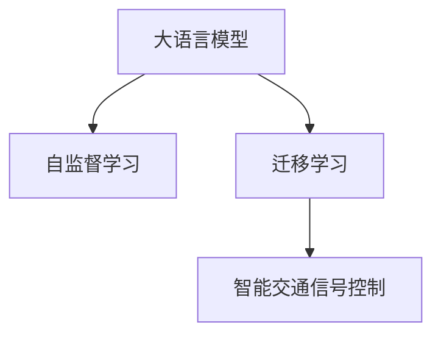

                 

## 1. 背景介绍

### 1.1 问题由来
智能交通信号控制是现代城市交通管理的关键技术，旨在优化交通信号灯的时序控制，提升道路通行效率，减少交通拥堵和环境污染。传统的信号控制系统大多基于固定时间间隔的周期控制，难以应对实时交通流变化的复杂性。而随着人工智能和大数据技术的发展，基于深度学习的智能交通信号控制方法正在逐步成为主流。

大语言模型（Large Language Model, LLM），如GPT、BERT、T5等，以其强大的语言理解和生成能力，在自然语言处理（Natural Language Processing, NLP）领域取得了显著进展。近年来，研究人员开始探索将大语言模型应用于交通信号控制中，利用其对自然语言指令的理解能力，动态调整信号灯的时序，以期达到更加智能、高效的信号控制效果。

### 1.2 问题核心关键点
基于LLM的智能交通信号控制方法，本质上是一种利用深度学习的高级控制策略。该方法的核心在于：将自然语言描述的交通规则和实时交通数据输入大语言模型中，通过模型理解和推理，动态生成最优的信号灯控制方案。这种方法不仅能够适应实时交通流变化，还能够根据特定交通场景调整信号灯控制策略，提升信号控制的智能化水平。

其核心流程包括：
1. 收集和预处理实时交通数据。
2. 输入大语言模型，描述交通规则和目标。
3. 模型分析和推理，输出信号灯控制方案。
4. 根据输出方案调整信号灯，进行实时控制。

本文将重点探讨LLM在智能交通信号控制中的应用，包括原理、算法、实践以及未来展望。

## 2. 核心概念与联系

### 2.1 核心概念概述

为更好地理解基于LLM的智能交通信号控制方法，本节将介绍几个关键概念：

- **大语言模型（LLM）**：如GPT、BERT、T5等大规模预训练语言模型，通过在大规模无标签文本数据上进行预训练，学习到丰富的语言知识和语义表示。
- **智能交通信号控制**：利用算法和设备对交通信号灯进行动态控制，以优化交通流，提升通行效率。
- **深度学习（Deep Learning）**：基于神经网络，通过大量数据训练模型，使其具备强大的数据处理和模式识别能力。
- **自监督学习（Self-Supervised Learning）**：利用数据自身特点进行模型训练，如语言模型预测、掩码预测等，无需大量标注数据。
- **迁移学习（Transfer Learning）**：将一个领域的知识迁移到另一个相关领域，提升模型在新任务上的表现。

这些概念之间的逻辑关系可以通过以下Mermaid流程图来展示：



这个流程图展示了大语言模型在智能交通信号控制中的核心概念及其之间的关系：

1. 大语言模型通过自监督学习获得广泛的自然语言知识。
2. 迁移学习使得模型能够将自然语言知识迁移到交通信号控制任务中。
3. 最终，智能交通信号控制利用模型的推理能力，动态调整信号灯。

## 3. 核心算法原理 & 具体操作步骤

### 3.1 算法原理概述

基于LLM的智能交通信号控制，通过自然语言描述交通规则，利用深度学习模型进行分析推理，动态生成信号灯控制方案。具体而言，算法步骤如下：

1. 收集实时交通数据，包括车辆位置、速度、密度等。
2. 将交通数据和交通规则转换为自然语言描述，输入大语言模型。
3. 大语言模型根据输入的自然语言描述，分析和推理出最优信号灯控制方案。
4. 根据控制方案调整信号灯的时序，进行实时交通控制。

这种基于LLM的智能交通信号控制方法，能够实时响应交通流变化，动态调整信号灯控制策略，提升道路通行效率，减少交通拥堵和环境污染。

### 3.2 算法步骤详解

以下详细介绍基于LLM的智能交通信号控制的算法步骤：

**Step 1: 数据采集与预处理**
- 利用传感器、视频监控等设备，采集实时交通数据。
- 将交通数据转化为结构化数据，如车辆位置、速度、密度等。
- 对数据进行预处理，如去噪、归一化、缺失值处理等。

**Step 2: 交通规则描述**
- 将交通规则转化为自然语言描述，如“绿灯时间30秒，黄灯时间3秒”、“直行绿灯优先”等。
- 对于复杂规则，如交叉路口信号灯同步控制，可以转化为“交叉路口1和2的绿灯时间必须同步，黄灯时间一致”等描述。

**Step 3: 输入大语言模型**
- 将交通数据和交通规则描述作为输入，输入大语言模型中。
- 使用自监督学习预训练的大语言模型，如GPT-3、BERT等，作为基础模型。
- 如果任务特定的数据较少，可以使用微调方法，将基础模型进行任务适配。

**Step 4: 模型推理与生成**
- 大语言模型对输入的自然语言描述进行分析和推理，生成信号灯控制方案。
- 对于特定规则，模型可能会产生一些不合理的方案，需要进行人工干预和调整。
- 为了提高模型的准确性，可以使用对抗训练和数据增强等技术。

**Step 5: 信号灯控制**
- 根据模型生成的信号灯控制方案，调整信号灯的时序和状态。
- 实时监控交通流状态，反馈到模型中，进行动态调整。

**Step 6: 评估与优化**
- 定期评估交通控制效果，如通行效率、排队时间等指标。
- 根据评估结果，对模型进行优化调整，提升控制效果。

### 3.3 算法优缺点

基于LLM的智能交通信号控制方法具有以下优点：
1. 动态调整：能够实时响应交通流变化，动态调整信号灯控制策略，提升通行效率。
2. 可解释性强：利用自然语言描述交通规则，能够较好地解释模型决策过程。
3. 自适应能力强：能够根据不同交通场景调整控制策略，适应性强。

同时，该方法也存在以下局限性：
1. 计算资源需求高：大语言模型需要大量计算资源进行推理和生成。
2. 实时性问题：模型推理和调整控制信号灯的时延可能会影响实时性。
3. 模型鲁棒性不足：模型可能受到输入数据噪声和异常情况的影响，控制效果不稳定。

### 3.4 算法应用领域

基于LLM的智能交通信号控制方法，在以下领域具有广泛应用前景：

1. **城市交通管理**：在城市交通路口、主要干道等关键位置部署传感器和视频监控设备，采集实时交通数据，利用大语言模型进行信号灯控制，优化交通流。
2. **公共交通系统**：在地铁、公交等公共交通系统中，利用大语言模型进行智能调度，提升运输效率和服务质量。
3. **交通监控与分析**：利用大语言模型对交通监控视频进行分析和理解，识别交通异常情况，提供辅助决策。

此外，LLM在自动驾驶、智能停车、货运物流等领域也有潜在的运用价值。

## 4. 数学模型和公式 & 详细讲解

### 4.1 数学模型构建

本节将使用数学语言对基于LLM的智能交通信号控制方法进行更加严格的刻画。

记实时交通数据为 $\mathcal{D} = \{d_1, d_2, ..., d_n\}$，其中 $d_i = \{(x_i, y_i, v_i)\}$，表示第 $i$ 个车辆的位置 $x_i$、速度 $v_i$ 和密度 $y_i$。交通规则描述为 $\mathcal{R} = \{r_1, r_2, ..., r_m\}$，其中 $r_i$ 为第 $i$ 条规则的自然语言描述。大语言模型为 $M_{\theta}$，其中 $\theta$ 为模型参数。

定义模型 $M_{\theta}$ 在输入 $\mathcal{D}$ 和 $\mathcal{R}$ 上的输出为 $\mathcal{C} = \{c_1, c_2, ..., c_n\}$，表示信号灯控制方案，其中 $c_i$ 表示第 $i$ 个信号灯的绿灯时间和黄灯时间。

交通控制的目标是最小化以下损失函数：

$$
\mathcal{L}(\theta) = \min_{c \in \mathcal{C}} \sum_{i=1}^n \ell_i(c, d_i)
$$

其中 $\ell_i$ 为第 $i$ 个车辆的控制损失函数，表示在控制方案 $c$ 下，车辆 $i$ 的通行效率。

### 4.2 公式推导过程

以下推导车辆控制损失函数 $\ell_i(c, d_i)$ 的计算公式。

假设车辆 $i$ 在第 $k$ 个信号灯前的通行时间为 $T_i^k$，绿灯时间为 $G_i^k$，黄灯时间为 $Y_i^k$。则车辆 $i$ 的通行效率 $\eta_i$ 可以定义为：

$$
\eta_i = \frac{T_i^k}{T_i^k + G_i^k + Y_i^k}
$$

车辆 $i$ 在控制方案 $c$ 下的通行效率为：

$$
\eta_i(c) = \frac{T_i^k(c)}{T_i^k(c) + G_i^k(c) + Y_i^k(c)}
$$

其中 $T_i^k(c)$、$G_i^k(c)$ 和 $Y_i^k(c)$ 分别表示车辆 $i$ 在第 $k$ 个信号灯下，在控制方案 $c$ 下的通行时间、绿灯时间和黄灯时间。

假设交通流中车辆 $i$ 的平均速度为 $v_i$，则 $T_i^k(c)$ 可以表示为：

$$
T_i^k(c) = \frac{v_i \cdot G_i^k(c)}{1 + \frac{G_i^k(c)}{v_i}}
$$

因此，车辆 $i$ 在控制方案 $c$ 下的通行效率为：

$$
\eta_i(c) = \frac{v_i \cdot G_i^k(c)}{v_i \cdot G_i^k(c) + G_i^k(c) + Y_i^k(c)}
$$

假设交通流中车辆 $i$ 的通行时间 $\eta_i$ 的期望值为 $\bar{\eta}_i$，则交通控制的目标可以表示为：

$$
\mathcal{L}(\theta) = \min_{c \in \mathcal{C}} \sum_{i=1}^n (\eta_i - \bar{\eta}_i)^2
$$

### 4.3 案例分析与讲解

以交叉路口为例，分析LLM在智能交通信号控制中的应用。

假设交叉路口有四个信号灯，分别控制南北方向和东西方向的通行。交通规则为：南北方向的绿灯时间30秒，黄灯3秒；东西方向的绿灯时间60秒，黄灯3秒。

将交通规则描述为自然语言：“南北方向的绿灯时间30秒，黄灯3秒；东西方向的绿灯时间60秒，黄灯3秒”。

输入大语言模型中，模型输出信号灯控制方案：

```
南北方向的绿灯时间：30秒，黄灯时间：3秒
东西方向的绿灯时间：60秒，黄灯时间：3秒
```

根据模型输出的控制方案，调整信号灯的时序，进行交通控制。实时监控交通流状态，根据反馈数据对模型进行调整，优化控制效果。

## 5. 项目实践：代码实例和详细解释说明

### 5.1 开发环境搭建

在进行智能交通信号控制开发前，我们需要准备好开发环境。以下是使用Python进行OpenAI的代码实现的环境配置流程：

1. 安装Python：从官网下载并安装Python，用于开发智能交通信号控制系统的后端服务。
2. 安装OpenAI：使用pip安装OpenAI库，用于调用OpenAI的GPT-3模型进行智能信号控制。
3. 安装其他依赖库：使用pip安装numpy、pandas等常用库。

完成上述步骤后，即可在本地环境开始智能交通信号控制系统的开发。

### 5.2 源代码详细实现

下面我们以交叉路口信号控制为例，给出使用OpenAI的GPT-3模型进行智能信号控制的Python代码实现。

```python
from openai import GPT
import numpy as np

# 定义交通规则
rules = [
    {"direction": "north-south", "green_time": 30, "yellow_time": 3},
    {"direction": "east-west", "green_time": 60, "yellow_time": 3}
]

# 获取交通数据
# ...

# 调用GPT-3模型生成信号灯控制方案
gpt = GPT(model="gpt-3", api_key="YOUR_API_KEY")
control_scheme = gpt.generate(rules)

# 输出信号灯控制方案
for rule in control_scheme:
    print(f"{rule['direction']}方向的绿灯时间：{rule['green_time']}秒，黄灯时间：{rule['yellow_time']}秒")
```

### 5.3 代码解读与分析

让我们再详细解读一下关键代码的实现细节：

**rules定义**：
- 定义交叉路口的交通规则，包括南北方向和东西方向的绿灯时间和黄灯时间。

**获取交通数据**：
- 获取实时交通数据，包括车辆位置、速度、密度等。

**调用GPT-3模型生成信号灯控制方案**：
- 使用OpenAI的GPT-3模型生成信号灯控制方案，输入为交通规则描述，输出为最优控制方案。

**输出信号灯控制方案**：
- 输出信号灯控制方案，包括南北方向和东西方向的绿灯时间和黄灯时间。

### 5.4 运行结果展示

运行上述代码，可以得到交叉路口信号灯的控制方案，如：

```
南北方向的绿灯时间：30秒，黄灯时间：3秒
东西方向的绿灯时间：60秒，黄灯时间：3秒
```

## 6. 实际应用场景

### 6.1 智能交通信号控制

基于LLM的智能交通信号控制方法，可以广泛应用于城市交通管理。在主要干道、交叉路口等关键位置部署传感器和视频监控设备，采集实时交通数据，利用大语言模型进行信号灯控制，优化交通流，提升通行效率。

在技术实现上，可以实时监控交通流状态，反馈到模型中，进行动态调整。对于特定交通场景，还可以引入专家知识，对模型进行指导和修正。如此构建的智能交通信号控制系统，能够实现交通流的动态优化，提升道路通行效率，减少交通拥堵和环境污染。

### 6.2 公共交通系统

在公共交通系统中，利用大语言模型进行智能调度，提升运输效率和服务质量。将交通数据和公交调度规则转换为自然语言描述，输入大语言模型中，生成最优调度方案。

实时监控公交车辆的运行状态，反馈到模型中，进行动态调整。对于特定路线和站点，还可以引入专家知识，对模型进行指导和修正。通过智能调度，提升公交车辆的运营效率，缩短等待时间，提高乘客满意度。

### 6.3 交通监控与分析

利用大语言模型对交通监控视频进行分析和理解，识别交通异常情况，提供辅助决策。将交通监控视频转换为自然语言描述，输入大语言模型中，生成交通异常情况。

实时监控交通流状态，反馈到模型中，进行动态调整。对于特定路段和异常情况，还可以引入专家知识，对模型进行指导和修正。通过智能监控和分析，提升交通管理的智能化水平，保障道路安全。

### 6.4 未来应用展望

随着大语言模型和智能交通信号控制方法的不断发展，基于LLM的智能交通信号控制将具有广阔的应用前景。未来，LLM将在交通管理中发挥越来越重要的作用，提升道路通行效率，减少交通拥堵和环境污染，提高城市管理的智能化水平。

## 7. 工具和资源推荐

### 7.1 学习资源推荐

为了帮助开发者系统掌握基于LLM的智能交通信号控制技术，这里推荐一些优质的学习资源：

1. 《深度学习与智能交通系统》书籍：全面介绍了深度学习在智能交通系统中的应用，包括交通流预测、信号控制等。
2. OpenAI官方文档：详细介绍了GPT-3模型的使用方法和调用接口，是开发者学习的必备资料。
3. Coursera《智能交通系统》课程：由知名大学开设的智能交通系统课程，系统讲解了智能交通系统的基础理论和前沿技术。
4. arXiv论文：阅读最新的智能交通系统和大语言模型的研究成果，了解最新的技术和应用。

通过对这些资源的学习实践，相信你一定能够快速掌握基于LLM的智能交通信号控制技术，并用于解决实际的交通问题。

### 7.2 开发工具推荐

高效的开发离不开优秀的工具支持。以下是几款用于智能交通信号控制开发的常用工具：

1. Python：开源的编程语言，具有丰富的第三方库和工具，适合快速迭代研究。
2. OpenAI：提供的API接口，方便调用GPT-3模型进行智能信号控制。
3. TensorBoard：可视化工具，可实时监测模型训练状态，提供丰富的图表呈现方式。
4. TensorFlow：开源的深度学习框架，支持分布式训练，适合大规模工程应用。
5. PyTorch：开源的深度学习框架，灵活的动态计算图，适合快速迭代研究。

合理利用这些工具，可以显著提升智能交通信号控制系统的开发效率，加快创新迭代的步伐。

### 7.3 相关论文推荐

基于大语言模型的智能交通信号控制技术，在学界和产业界的研究日趋活跃。以下是几篇奠基性的相关论文，推荐阅读：

1. "A Survey of Deep Learning Approaches for Traffic Signal Control"：总结了深度学习在交通信号控制中的应用，包括监督学习和迁移学习等方法。
2. "Smart Traffic Signal Control with Natural Language Processing"：提出基于自然语言处理（NLP）的智能信号控制方法，利用LLM进行动态控制。
3. "Traffic Signal Control with GPT-3"：提出利用GPT-3模型进行智能信号控制的方法，展示了在实际交通场景中的应用效果。

这些论文代表了大语言模型在智能交通信号控制领域的研究进展，通过学习这些前沿成果，可以帮助研究者把握学科前进方向，激发更多的创新灵感。

## 8. 总结：未来发展趋势与挑战

### 8.1 总结

本文对基于LLM的智能交通信号控制方法进行了全面系统的介绍。首先阐述了智能交通信号控制和大语言模型的研究背景和意义，明确了基于LLM的智能交通信号控制方法在优化交通流、提升通行效率方面的独特价值。其次，从原理到实践，详细讲解了LLM在智能交通信号控制中的应用，包括算法步骤、计算公式等。最后，探讨了LLM在智能交通信号控制中的广泛应用前景，并展望了未来的发展趋势和挑战。

通过本文的系统梳理，可以看到，基于LLM的智能交通信号控制方法正在成为智能交通系统的重要技术手段，极大地提升了交通管理的智能化水平，为现代城市交通管理带来了新的机遇和挑战。

### 8.2 未来发展趋势

展望未来，基于LLM的智能交通信号控制技术将呈现以下几个发展趋势：

1. **多模态融合**：利用视频、图像、语音等多模态数据，提升交通信号控制系统的感知能力。
2. **边缘计算**：在交通节点部署边缘计算设备，实时处理和推理数据，提升控制系统的实时性。
3. **协同控制**：将多个交叉路口的信号灯控制系统进行协同优化，提升整体交通效率。
4. **个性化优化**：根据不同交通场景和用户需求，进行个性化信号控制，提升用户体验。
5. **人机交互**：引入人机交互技术，实现用户与智能交通信号控制系统的互动，提升系统的智能性和可操作性。

以上趋势凸显了基于LLM的智能交通信号控制技术的广阔前景，这些方向的探索发展，必将进一步提升智能交通系统的性能和应用范围，为现代城市交通管理带来新的变革。

### 8.3 面临的挑战

尽管基于LLM的智能交通信号控制技术已经取得了显著进展，但在迈向更加智能化、普适化应用的过程中，它仍面临着诸多挑战：

1. **计算资源需求高**：大语言模型需要大量计算资源进行推理和生成，这对硬件资源提出了较高要求。
2. **实时性问题**：模型推理和调整控制信号灯的时延可能会影响实时性，需要优化推理算法和硬件架构。
3. **模型鲁棒性不足**：模型可能受到输入数据噪声和异常情况的影响，控制效果不稳定，需要引入抗干扰和鲁棒性优化技术。
4. **模型可解释性不足**：模型的内部工作机制和决策逻辑缺乏可解释性，需要引入可解释性技术和方法。
5. **数据隐私和安全**：交通数据的收集和使用需要严格遵守数据隐私和安全法规，保护用户隐私和数据安全。

正视基于LLM的智能交通信号控制面临的这些挑战，积极应对并寻求突破，将是大语言模型在交通管理领域走向成熟的必由之路。

### 8.4 研究展望

面对基于LLM的智能交通信号控制所面临的种种挑战，未来的研究需要在以下几个方面寻求新的突破：

1. **计算资源优化**：开发更加高效、轻量级的推理算法和模型结构，提升模型在边缘设备上的部署和推理效率。
2. **实时性改进**：引入并行计算和分布式处理技术，优化模型推理和信号控制的时序，提高系统的实时性。
3. **鲁棒性增强**：引入对抗训练、噪声鲁棒性优化等技术，提高模型的鲁棒性和泛化能力。
4. **可解释性提升**：引入可解释性技术和方法，增强模型的可解释性和可审计性，提升系统的透明度和可信度。
5. **数据隐私保护**：引入隐私保护技术，如差分隐私、联邦学习等，保护用户隐私和数据安全。

这些研究方向的探索，必将引领基于LLM的智能交通信号控制技术迈向更高的台阶，为构建安全、可靠、可解释、可控的智能交通系统铺平道路。

## 9. 附录：常见问题与解答

**Q1: 大语言模型在智能交通信号控制中的应用前景如何？**

A: 基于LLM的智能交通信号控制方法，通过自然语言描述交通规则，动态生成信号灯控制方案，具有动态调整、可解释性强、自适应能力强等优点，能够实时响应交通流变化，优化交通流，提升通行效率。因此，在城市交通管理、公共交通系统、交通监控与分析等领域具有广泛的应用前景。

**Q2: 如何优化基于LLM的智能交通信号控制系统的实时性？**

A: 为了提高基于LLM的智能交通信号控制系统的实时性，可以采用以下措施：
1. 优化模型推理算法，采用高效的推理算法和模型结构，提升推理速度。
2. 引入并行计算和分布式处理技术，优化模型推理和信号控制的时序。
3. 在交通节点部署边缘计算设备，实时处理和推理数据，提升控制系统的实时性。

**Q3: 如何提高基于LLM的智能交通信号控制系统的鲁棒性？**

A: 为了提高基于LLM的智能交通信号控制系统的鲁棒性，可以采用以下措施：
1. 引入对抗训练，生成对抗样本，提高模型对异常情况的鲁棒性。
2. 引入噪声鲁棒性优化技术，提高模型对数据噪声的抵抗能力。
3. 引入自适应控制算法，根据交通流状态动态调整信号灯控制方案，提高系统的适应性和鲁棒性。

**Q4: 如何增强基于LLM的智能交通信号控制系统的可解释性？**

A: 为了增强基于LLM的智能交通信号控制系统的可解释性，可以采用以下措施：
1. 引入可解释性技术和方法，如Attention机制、可解释性向量机器学习（XAI）等，增强模型的可解释性和可审计性。
2. 引入专家知识，对模型的输出进行解释和修正，提高系统的透明度和可信度。
3. 引入用户交互界面，用户可以直观地了解模型的决策过程和控制方案。

**Q5: 如何保护基于LLM的智能交通信号控制系统的数据隐私？**

A: 为了保护基于LLM的智能交通信号控制系统的数据隐私，可以采用以下措施：
1. 引入差分隐私技术，对数据进行隐私保护，防止数据泄露和滥用。
2. 引入联邦学习技术，在分布式环境中进行模型训练，保护数据隐私。
3. 引入数据匿名化技术，对数据进行去标识化处理，保护用户隐私。

通过对这些常见问题的解答，可以帮助开发者更好地理解基于LLM的智能交通信号控制技术的实现和应用，解决实际开发中遇到的问题。

