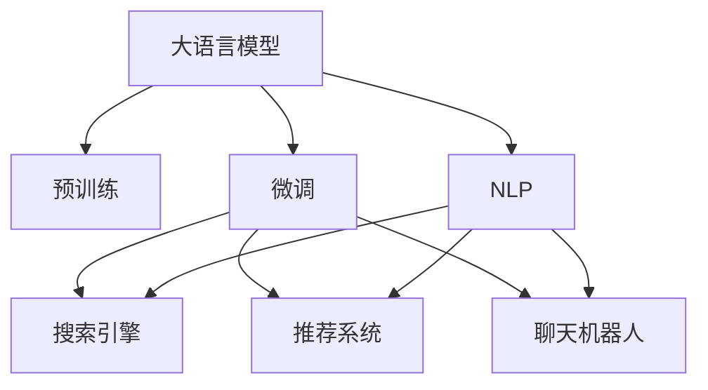

                 

# LLM在电子商务中的应用：智能购物体验

> 关键词：
- 大语言模型(Large Language Model, LLM)
- 电子商务(EC)
- 智能购物
- 推荐系统(Recommendation System)
- 搜索引擎(Search Engine)
- 聊天机器人(Chatbot)
- 自然语言处理(NLP)

## 1. 背景介绍

### 1.1 问题由来
随着电商行业的快速发展，如何在海量商品中快速找到符合用户需求的商品，成为了电商平台面临的核心挑战。传统电商搜索引擎通常基于关键词匹配，忽视了用户意图和上下文信息，导致搜索结果相关性不足，用户体验不佳。为了更好地满足用户需求，电商平台纷纷引入先进技术，如自然语言处理(NLP)、深度学习等，提升搜索结果的相关性和个性化推荐能力。

其中，大语言模型(Large Language Model, LLM)是一种通过自监督学习和任务微调获取语言表示能力的先进模型。通过在大规模无标签文本语料上进行预训练，大语言模型能够学习到丰富的语言知识和上下文理解能力。将其应用于电商搜索和推荐等场景，可以显著提升搜索结果的相关性和用户体验。

### 1.2 问题核心关键点
大语言模型在电商领域的应用，主要体现在以下几个方面：

1. 智能搜索：通过自然语言查询，模型能够理解用户意图，返回相关的搜索结果。
2. 推荐系统：模型能够分析用户行为和上下文信息，提供个性化推荐。
3. 聊天机器人：模型可以作为虚拟客服，解答用户问题，提升用户体验。
4. 内容生成：模型能够自动生成商品描述、广告文案等，提升内容创意和多样性。

这些应用场景都需要大语言模型具备较强的语义理解和生成能力，能够快速准确地理解自然语言输入，并生成符合用户期望的输出。

## 2. 核心概念与联系

### 2.1 核心概念概述

为更好地理解大语言模型在电商领域的应用，本节将介绍几个密切相关的核心概念：

- 大语言模型(Large Language Model, LLM)：以自回归(如GPT)或自编码(如BERT)模型为代表的大规模预训练语言模型。通过在大规模无标签文本语料上进行预训练，学习通用的语言表示，具备强大的语言理解和生成能力。

- 预训练(Pre-training)：指在大规模无标签文本语料上，通过自监督学习任务训练通用语言模型的过程。常见的预训练任务包括言语建模、遮挡语言模型等。

- 微调(Fine-tuning)：指在预训练模型的基础上，使用下游任务的少量标注数据，通过有监督学习优化模型在该任务上的性能。通常只需要调整顶层分类器或解码器，并以较小的学习率更新全部或部分的模型参数。

- 推荐系统(Recommendation System)：利用用户行为数据和商品特征，为每个用户推荐最相关的商品集合。通过模型学习和优化，不断提升推荐质量。

- 搜索引擎(Search Engine)：根据用户输入的关键词，在商品库中查找最相关的搜索结果。通过深度学习模型，提升搜索相关性和用户体验。

- 聊天机器人(Chatbot)：通过与用户的自然语言交流，解答用户疑问，提升客户服务效率和满意度。通过模型训练，提升智能客服的语义理解和生成能力。

- 自然语言处理(NLP)：研究计算机如何理解和生成人类语言的技术。包括分词、词性标注、句法分析、语义理解、文本生成等多个子领域。

这些核心概念之间的逻辑关系可以通过以下Mermaid流程图来展示：



这个流程图展示了大语言模型的核心概念及其之间的关系：

1. 大语言模型通过预训练获得基础能力。
2. 微调是对预训练模型进行任务特定的优化，可以分为搜索引擎、推荐系统、聊天机器人等方向。
3. NLP是实现大语言模型功能的基础技术。

这些概念共同构成了大语言模型在电商领域的应用框架，使其能够在各种场景下发挥强大的语言理解和生成能力。通过理解这些核心概念，我们可以更好地把握大语言模型的工作原理和优化方向。

## 3. 核心算法原理 & 具体操作步骤
### 3.1 算法原理概述

基于大语言模型在电商领域的应用，本质上是一个有监督的细粒度迁移学习过程。其核心思想是：将预训练的大语言模型视作一个强大的"特征提取器"，通过在电商搜索、推荐、聊天等任务的少量标注数据上进行有监督的微调，使得模型输出能够匹配任务标签，从而获得针对特定电商任务优化的模型。

形式化地，假设预训练模型为 $M_{\theta}$，其中 $\theta$ 为预训练得到的模型参数。给定电商任务 $T$ 的标注数据集 $D=\{(x_i, y_i)\}_{i=1}^N$，微调的目标是找到新的模型参数 $\hat{\theta}$，使得：

$$
\hat{\theta}=\mathop{\arg\min}_{\theta} \mathcal{L}(M_{\theta},D)
$$

其中 $\mathcal{L}$ 为针对任务 $T$ 设计的损失函数，用于衡量模型预测输出与真实标签之间的差异。常见的损失函数包括交叉熵损失、均方误差损失等。

通过梯度下降等优化算法，微调过程不断更新模型参数 $\theta$，最小化损失函数 $\mathcal{L}$，使得模型输出逼近真实标签。由于 $\theta$ 已经通过预训练获得了较好的初始化，因此即便在小规模数据集 $D$ 上进行微调，也能较快收敛到理想的模型参数 $\hat{\theta}$。

### 3.2 算法步骤详解

基于大语言模型在电商领域的应用，一般包括以下几个关键步骤：

**Step 1: 准备预训练模型和数据集**
- 选择合适的预训练语言模型 $M_{\theta}$ 作为初始化参数，如 BERT、GPT等。
- 准备电商任务 $T$ 的标注数据集 $D$，划分为训练集、验证集和测试集。一般要求标注数据与预训练数据的分布不要差异过大。

**Step 2: 添加任务适配层**
- 根据任务类型，在预训练模型顶层设计合适的输出层和损失函数。
- 对于搜索引擎任务，通常在顶层添加线性分类器和交叉熵损失函数。
- 对于推荐系统任务，通常使用基于用户行为序列的循环神经网络（RNN）或变分自编码器（VAE）生成推荐序列，并以均方误差为损失函数。
- 对于聊天机器人任务，通常使用对话模型生成合适的回复，并以序列交叉熵损失函数进行优化。

**Step 3: 设置微调超参数**
- 选择合适的优化算法及其参数，如 AdamW、SGD 等，设置学习率、批大小、迭代轮数等。
- 设置正则化技术及强度，包括权重衰减、Dropout、Early Stopping等。
- 确定冻结预训练参数的策略，如仅微调顶层，或全部参数都参与微调。

**Step 4: 执行梯度训练**
- 将训练集数据分批次输入模型，前向传播计算损失函数。
- 反向传播计算参数梯度，根据设定的优化算法和学习率更新模型参数。
- 周期性在验证集上评估模型性能，根据性能指标决定是否触发 Early Stopping。
- 重复上述步骤直到满足预设的迭代轮数或 Early Stopping 条件。

**Step 5: 测试和部署**
- 在测试集上评估微调后模型 $M_{\hat{\theta}}$ 的性能，对比微调前后的精度提升。
- 使用微调后的模型对新样本进行推理预测，集成到实际的应用系统中。
- 持续收集新的数据，定期重新微调模型，以适应数据分布的变化。

以上是基于大语言模型在电商领域的应用的一般流程。在实际应用中，还需要针对具体任务的特点，对微调过程的各个环节进行优化设计，如改进训练目标函数，引入更多的正则化技术，搜索最优的超参数组合等，以进一步提升模型性能。

### 3.3 算法优缺点

基于大语言模型在电商领域的应用方法具有以下优点：
1. 简单高效。只需准备少量标注数据，即可对预训练模型进行快速适配，获得较大的性能提升。
2. 通用适用。适用于各种电商任务，包括搜索、推荐、聊天等，设计简单的任务适配层即可实现微调。
3. 参数高效。利用参数高效微调技术，在固定大部分预训练权重不变的情况下，仍可取得不错的提升。
4. 效果显著。在电商搜索引擎、推荐系统、智能客服等诸多场景上，基于微调的方法已经刷新了最先进的性能指标。

同时，该方法也存在一定的局限性：
1. 依赖标注数据。微调的效果很大程度上取决于标注数据的质量和数量，获取高质量标注数据的成本较高。
2. 迁移能力有限。当目标任务与预训练数据的分布差异较大时，微调的性能提升有限。
3. 负面效果传递。预训练模型的固有偏见、有害信息等，可能通过微调传递到下游任务，造成负面影响。
4. 可解释性不足。微调模型的决策过程通常缺乏可解释性，难以对其推理逻辑进行分析和调试。

尽管存在这些局限性，但就目前而言，基于监督学习的微调方法仍是大语言模型在电商领域应用的最主流范式。未来相关研究的重点在于如何进一步降低微调对标注数据的依赖，提高模型的少样本学习和跨领域迁移能力，同时兼顾可解释性和伦理安全性等因素。

### 3.4 算法应用领域

基于大语言模型在电商领域的应用方法，已经在搜索引擎、推荐系统、智能客服等多个领域得到了广泛应用，取得了显著的效果。以下是具体应用领域的详细介绍：

#### 3.4.1 智能搜索引擎
智能搜索引擎是大语言模型在电商领域的重要应用之一。通过微调，模型可以理解用户的自然语言查询，返回最相关的搜索结果。具体实现如下：

**Step 1: 数据预处理**
- 收集电商网站上的用户查询记录和商品信息，进行文本清洗和标注。
- 将查询记录和商品信息分别进行分词、向量化等预处理，构建输入和标签数据。

**Step 2: 模型微调**
- 使用预训练模型作为初始化参数，对模型进行微调。
- 通过交叉熵损失函数，优化模型对查询和商品的匹配度。

**Step 3: 评估与优化**
- 在验证集上评估模型的搜索相关性，根据评估结果调整模型超参数。
- 周期性在测试集上评估模型性能，持续优化模型。

通过智能搜索引擎，用户可以通过自然语言查询找到相关商品，提升了电商平台的搜索体验。

#### 3.4.2 个性化推荐系统
个性化推荐系统是电商领域的重要应用之一，通过微调模型，可以提供高度个性化的商品推荐，提升用户满意度。具体实现如下：

**Step 1: 数据预处理**
- 收集用户浏览、点击、购买等行为数据，进行数据清洗和特征工程。
- 将用户行为数据和商品特征进行向量化，构建输入和标签数据。

**Step 2: 模型微调**
- 使用预训练模型作为初始化参数，对模型进行微调。
- 通过均方误差损失函数，优化模型对用户行为的预测能力。

**Step 3: 评估与优化**
- 在验证集上评估模型的推荐质量，根据评估结果调整模型超参数。
- 周期性在测试集上评估模型性能，持续优化模型。

通过个性化推荐系统，电商平台能够根据用户行为和兴趣，提供符合其期望的商品推荐，提升了用户体验和转化率。

#### 3.4.3 智能客服系统
智能客服系统是大语言模型在电商领域的重要应用之一，通过微调，模型可以自动回答用户问题，提升客服效率和满意度。具体实现如下：

**Step 1: 数据预处理**
- 收集电商网站的客服对话记录，进行文本清洗和标注。
- 将对话历史和用户问题进行向量化，构建输入和标签数据。

**Step 2: 模型微调**
- 使用预训练模型作为初始化参数，对模型进行微调。
- 通过序列交叉熵损失函数，优化模型对用户问题的理解和回答。

**Step 3: 评估与优化**
- 在验证集上评估模型的对话质量，根据评估结果调整模型超参数。
- 周期性在测试集上评估模型性能，持续优化模型。

通过智能客服系统，电商平台能够自动回答用户问题，提升了客服效率和满意度。

## 4. 数学模型和公式 & 详细讲解  
### 4.1 数学模型构建

本节将使用数学语言对基于大语言模型在电商领域的应用过程进行更加严格的刻画。

记预训练语言模型为 $M_{\theta}$，其中 $\theta$ 为预训练得到的模型参数。假设电商搜索引擎任务 $T$ 的标注数据集 $D=\{(x_i,y_i)\}_{i=1}^N, x_i \in \mathcal{X}, y_i \in \mathcal{Y}$，其中 $\mathcal{X}$ 为查询文本集合，$\mathcal{Y}$ 为商品ID集合。定义模型 $M_{\theta}$ 在查询文本 $x$ 上的输出为 $\hat{y}=M_{\theta}(x) \in [0,1]$，表示商品ID对应的预测概率。

定义模型 $M_{\theta}$ 在查询文本 $x$ 和商品ID $y$ 上的损失函数为 $\ell(M_{\theta}(x),y)$，则在数据集 $D$ 上的经验风险为：

$$
\mathcal{L}(\theta) = \frac{1}{N}\sum_{i=1}^N \ell(M_{\theta}(x_i),y_i)
$$

其中 $\ell$ 为交叉熵损失函数，用于衡量模型预测输出与真实标签之间的差异。具体的损失函数计算公式如下：

$$
\ell(M_{\theta}(x),y) = -\sum_{i=1}^N \log \frac{M_{\theta}(x_i)}{\sum_{j=1}^J M_{\theta}(x_i,y_j)}
$$

其中 $J$ 为商品ID总数，$M_{\theta}(x_i,y_j)$ 表示模型在查询文本 $x_i$ 和商品ID $y_j$ 上的预测概率。

通过梯度下降等优化算法，微调过程不断更新模型参数 $\theta$，最小化损失函数 $\mathcal{L}$，使得模型输出逼近真实标签。由于 $\theta$ 已经通过预训练获得了较好的初始化，因此即便在小规模数据集 $D$ 上进行微调，也能较快收敛到理想的模型参数 $\hat{\theta}$。

### 4.2 公式推导过程

以下我们以智能搜索引擎任务为例，推导交叉熵损失函数及其梯度的计算公式。

假设模型 $M_{\theta}$ 在查询文本 $x$ 上的输出为 $\hat{y}=M_{\theta}(x) \in [0,1]$，表示商品ID对应的预测概率。真实标签 $y \in \{1,2,\dots,J\}$。则二分类交叉熵损失函数定义为：

$$
\ell(M_{\theta}(x),y) = -y\log \hat{y} - (1-y)\log(1-\hat{y})
$$

将其代入经验风险公式，得：

$$
\mathcal{L}(\theta) = -\frac{1}{N}\sum_{i=1}^N [y_i\log M_{\theta}(x_i)+(1-y_i)\log(1-M_{\theta}(x_i))]
$$

根据链式法则，损失函数对参数 $\theta_k$ 的梯度为：

$$
\frac{\partial \mathcal{L}(\theta)}{\partial \theta_k} = -\frac{1}{N}\sum_{i=1}^N \frac{\partial}{\partial \theta_k} [y_i\log M_{\theta}(x_i)+(1-y_i)\log(1-M_{\theta}(x_i))]
$$

其中 $\frac{\partial}{\partial \theta_k} M_{\theta}(x_i)$ 为模型 $M_{\theta}$ 在查询文本 $x_i$ 上的输出对参数 $\theta_k$ 的梯度，可进一步递归展开，利用自动微分技术完成计算。

在得到损失函数的梯度后，即可带入参数更新公式，完成模型的迭代优化。重复上述过程直至收敛，最终得到适应电商搜索任务的最优模型参数 $\theta^*$。

## 5. 项目实践：代码实例和详细解释说明
### 5.1 开发环境搭建

在进行电商搜索微调实践前，我们需要准备好开发环境。以下是使用Python进行PyTorch开发的环境配置流程：

1. 安装Anaconda：从官网下载并安装Anaconda，用于创建独立的Python环境。

2. 创建并激活虚拟环境：
```bash
conda create -n pytorch-env python=3.8 
conda activate pytorch-env
```

3. 安装PyTorch：根据CUDA版本，从官网获取对应的安装命令。例如：
```bash
conda install pytorch torchvision torchaudio cudatoolkit=11.1 -c pytorch -c conda-forge
```

4. 安装Transformers库：
```bash
pip install transformers
```

5. 安装各类工具包：
```bash
pip install numpy pandas scikit-learn matplotlib tqdm jupyter notebook ipython
```

完成上述步骤后，即可在`pytorch-env`环境中开始微调实践。

### 5.2 源代码详细实现

下面我们以智能搜索引擎任务为例，给出使用Transformers库对BERT模型进行微调的PyTorch代码实现。

首先，定义智能搜索引擎任务的数据处理函数：

```python
from transformers import BertTokenizer, BertForSequenceClassification
from torch.utils.data import Dataset
import torch

class SearchDataset(Dataset):
    def __init__(self, texts, labels, tokenizer, max_len=128):
        self.texts = texts
        self.labels = labels
        self.tokenizer = tokenizer
        self.max_len = max_len
        
    def __len__(self):
        return len(self.texts)
    
    def __getitem__(self, item):
        text = self.texts[item]
        label = self.labels[item]
        
        encoding = self.tokenizer(text, return_tensors='pt', max_length=self.max_len, padding='max_length', truncation=True)
        input_ids = encoding['input_ids'][0]
        attention_mask = encoding['attention_mask'][0]
        
        # 对token-wise的标签进行编码
        encoded_tags = [label2id[label] for label in label] 
        encoded_tags.extend([label2id['O']] * (self.max_len - len(encoded_tags)))
        labels = torch.tensor(encoded_tags, dtype=torch.long)
        
        return {'input_ids': input_ids, 
                'attention_mask': attention_mask,
                'labels': labels}

# 标签与id的映射
label2id = {'query': 0, 'product': 1}
id2label = {v: k for k, v in label2id.items()}

# 创建dataset
tokenizer = BertTokenizer.from_pretrained('bert-base-cased')

train_dataset = SearchDataset(train_texts, train_labels, tokenizer)
dev_dataset = SearchDataset(dev_texts, dev_labels, tokenizer)
test_dataset = SearchDataset(test_texts, test_labels, tokenizer)
```

然后，定义模型和优化器：

```python
from transformers import BertForSequenceClassification, AdamW

model = BertForSequenceClassification.from_pretrained('bert-base-cased', num_labels=len(label2id))

optimizer = AdamW(model.parameters(), lr=2e-5)
```

接着，定义训练和评估函数：

```python
from torch.utils.data import DataLoader
from tqdm import tqdm
from sklearn.metrics import accuracy_score, precision_recall_fscore_support

device = torch.device('cuda') if torch.cuda.is_available() else torch.device('cpu')
model.to(device)

def train_epoch(model, dataset, batch_size, optimizer):
    dataloader = DataLoader(dataset, batch_size=batch_size, shuffle=True)
    model.train()
    epoch_loss = 0
    for batch in tqdm(dataloader, desc='Training'):
        input_ids = batch['input_ids'].to(device)
        attention_mask = batch['attention_mask'].to(device)
        labels = batch['labels'].to(device)
        model.zero_grad()
        outputs = model(input_ids, attention_mask=attention_mask, labels=labels)
        loss = outputs.loss
        epoch_loss += loss.item()
        loss.backward()
        optimizer.step()
    return epoch_loss / len(dataloader)

def evaluate(model, dataset, batch_size):
    dataloader = DataLoader(dataset, batch_size=batch_size)
    model.eval()
    preds, labels = [], []
    with torch.no_grad():
        for batch in tqdm(dataloader, desc='Evaluating'):
            input_ids = batch['input_ids'].to(device)
            attention_mask = batch['attention_mask'].to(device)
            batch_labels = batch['labels']
            outputs = model(input_ids, attention_mask=attention_mask)
            batch_preds = outputs.logits.argmax(dim=2).to('cpu').tolist()
            batch_labels = batch_labels.to('cpu').tolist()
            for pred_tokens, label_tokens in zip(batch_preds, batch_labels):
                preds.append(pred_tokens[:len(label_tokens)])
                labels.append(label_tokens)
                
    acc = accuracy_score(labels, preds)
    precision, recall, f1, _ = precision_recall_fscore_support(labels, preds, average='binary')
    print(f"Accuracy: {acc:.4f}, Precision: {precision:.4f}, Recall: {recall:.4f}, F1-score: {f1:.4f}")
```

最后，启动训练流程并在测试集上评估：

```python
epochs = 5
batch_size = 16

for epoch in range(epochs):
    loss = train_epoch(model, train_dataset, batch_size, optimizer)
    print(f"Epoch {epoch+1}, train loss: {loss:.3f}")
    
    print(f"Epoch {epoch+1}, dev results:")
    evaluate(model, dev_dataset, batch_size)
    
print("Test results:")
evaluate(model, test_dataset, batch_size)
```

以上就是使用PyTorch对BERT进行智能搜索引擎任务微调的完整代码实现。可以看到，得益于Transformers库的强大封装，我们可以用相对简洁的代码完成BERT模型的加载和微调。

### 5.3 代码解读与分析

让我们再详细解读一下关键代码的实现细节：

**SearchDataset类**：
- `__init__`方法：初始化查询文本、商品ID、分词器等关键组件。
- `__len__`方法：返回数据集的样本数量。
- `__getitem__`方法：对单个样本进行处理，将查询文本输入编码为token ids，将商品ID编码为数字，并对其进行定长padding，最终返回模型所需的输入。

**label2id和id2label字典**：
- 定义了查询文本和商品ID与数字id之间的映射关系，用于将token-wise的预测结果解码回真实的标签。

**训练和评估函数**：
- 使用PyTorch的DataLoader对数据集进行批次化加载，供模型训练和推理使用。
- 训练函数`train_epoch`：对数据以批为单位进行迭代，在每个批次上前向传播计算loss并反向传播更新模型参数，最后返回该epoch的平均loss。
- 评估函数`evaluate`：与训练类似，不同点在于不更新模型参数，并在每个batch结束后将预测和标签结果存储下来，最后使用sklearn的accuracy_score、precision_recall_fscore_support等函数对整个评估集的预测结果进行打印输出。

**训练流程**：
- 定义总的epoch数和batch size，开始循环迭代
- 每个epoch内，先在训练集上训练，输出平均loss
- 在验证集上评估，输出准确率、精确率、召回率和F1-score等分类指标
- 所有epoch结束后，在测试集上评估，给出最终测试结果

可以看到，PyTorch配合Transformers库使得BERT微调的代码实现变得简洁高效。开发者可以将更多精力放在数据处理、模型改进等高层逻辑上，而不必过多关注底层的实现细节。

当然，工业级的系统实现还需考虑更多因素，如模型的保存和部署、超参数的自动搜索、更灵活的任务适配层等。但核心的微调范式基本与此类似。

## 6. 实际应用场景
### 6.1 智能搜索
智能搜索是电商领域的重要应用之一，通过微调，模型可以理解用户的自然语言查询，返回最相关的搜索结果。以下是一个典型的电商智能搜索系统实现流程：

**Step 1: 数据预处理**
- 收集电商网站上的用户查询记录和商品信息，进行文本清洗和标注。
- 将查询记录和商品信息分别进行分词、向量化等预处理，构建输入和标签数据。

**Step 2: 模型微调**
- 使用预训练模型作为初始化参数，对模型进行微调。
- 通过交叉熵损失函数，优化模型对查询和商品的匹配度。

**Step 3: 评估与优化**
- 在验证集上评估模型的搜索相关性，根据评估结果调整模型超参数。
- 周期性在测试集上评估模型性能，持续优化模型。

通过智能搜索，用户可以通过自然语言查询找到相关商品，提升了电商平台的搜索体验。

### 6.2 个性化推荐
个性化推荐是电商领域的重要应用之一，通过微调模型，可以提供高度个性化的商品推荐，提升用户满意度。以下是一个典型的电商个性化推荐系统实现流程：

**Step 1: 数据预处理**
- 收集用户浏览、点击、购买等行为数据，进行数据清洗和特征工程。
- 将用户行为数据和商品特征进行向量化，构建输入和标签数据。

**Step 2: 模型微调**
- 使用预训练模型作为初始化参数，对模型进行微调。
- 通过均方误差损失函数，优化模型对用户行为的预测能力。

**Step 3: 评估与优化**
- 在验证集上评估模型的推荐质量，根据评估结果调整模型超参数。
- 周期性在测试集上评估模型性能，持续优化模型。

通过个性化推荐系统，电商平台能够根据用户行为和兴趣，提供符合其期望的商品推荐，提升了用户体验和转化率。

### 6.3 智能客服
智能客服是电商领域的重要应用之一，通过微调，模型可以自动回答用户问题，提升客服效率和满意度。以下是一个典型的电商智能客服系统实现流程：

**Step 1: 数据预处理**
- 收集电商网站的客服对话记录，进行文本清洗和标注。
- 将对话历史和用户问题进行向量化，构建输入和标签数据。

**Step 2: 模型微调**
- 使用预训练模型作为初始化参数，对模型进行微调。
- 通过序列交叉熵损失函数，优化模型对用户问题的理解和回答。

**Step 3: 评估与优化**
- 在验证集上评估模型的对话质量，根据评估结果调整模型超参数。
- 周期性在测试集上评估模型性能，持续优化模型。

通过智能客服系统，电商平台能够自动回答用户问题，提升了客服效率和满意度。

### 6.4 未来应用展望
随着大语言模型和微调方法的不断发展，基于微调范式将在更多领域得到应用，为传统行业带来变革性影响。

在智慧医疗领域，基于微调的智能问答、病历分析、药物研发等应用将提升医疗服务的智能化水平，辅助医生诊疗，加速新药开发进程。

在智能教育领域，微调技术可应用于作业批改、学情分析、知识推荐等方面，因材施教，促进教育公平，提高教学质量。

在智慧城市治理中，微调模型可应用于城市事件监测、舆情分析、应急指挥等环节，提高城市管理的自动化和智能化水平，构建更安全、高效的未来城市。

此外，在企业生产、社会治理、文娱传媒等众多领域，基于大模型微调的人工智能应用也将不断涌现，为经济社会发展注入新的动力。相信随着技术的日益成熟，微调方法将成为人工智能落地应用的重要范式，推动人工智能技术在各行业的深度融合。

## 7. 工具和资源推荐
### 7.1 学习资源推荐

为了帮助开发者系统掌握大语言模型在电商领域的应用理论基础和实践技巧，这里推荐一些优质的学习资源：

1. 《Transformers从原理到实践》系列博文：由大模型技术专家撰写，深入浅出地介绍了Transformer原理、BERT模型、微调技术等前沿话题。

2. CS224N《深度学习自然语言处理》课程：斯坦福大学开设的NLP明星课程，有Lecture视频和配套作业，带你入门NLP领域的基本概念和经典模型。

3. 《Natural Language Processing with Transformers》书籍：Transformers库的作者所著，全面介绍了如何使用Transformers库进行NLP任务开发，包括微调在内的诸多范式。

4. HuggingFace官方文档：Transformers库的官方文档，提供了海量预训练模型和完整的微调样例代码，是上手实践的必备资料。

5. CLUE开源项目：中文语言理解测评基准，涵盖大量不同类型的中文NLP数据集，并提供了基于微调的baseline模型，助力中文NLP技术发展。

通过对这些资源的学习实践，相信你一定能够快速掌握大语言模型在电商领域的应用精髓，并用于解决实际的NLP问题。
###  7.2 开发工具推荐

高效的开发离不开优秀的工具支持。以下是几款用于大语言模型在电商领域微调开发的常用工具：

1. PyTorch：基于Python的开源深度学习框架，灵活动态的计算图，适合快速迭代研究。大部分预训练语言模型都有PyTorch版本的实现。

2. TensorFlow：由Google主导开发的开源深度学习框架，生产部署方便，适合大规模工程应用。同样有丰富的预训练语言模型资源。

3. Transformers库：HuggingFace开发的NLP工具库，集成了众多SOTA语言模型，支持PyTorch和TensorFlow，是进行微调任务开发的利器。

4. Weights & Biases：模型训练的实验跟踪工具，可以记录和可视化模型训练过程中的各项指标，方便对比和调优。与主流深度学习框架无缝集成。

5. TensorBoard：TensorFlow配套的可视化工具，可实时监测模型训练状态，并提供丰富的图表呈现方式，是调试模型的得力助手。

6. Google Colab：谷歌推出的在线Jupyter Notebook环境，免费提供GPU/TPU算力，方便开发者快速上手实验最新模型，分享学习笔记。

合理利用这些工具，可以显著提升大语言模型在电商领域微调任务的开发效率，加快创新迭代的步伐。

### 7.3 相关论文推荐

大语言模型和微调技术的发展源于学界的持续研究。以下是几篇奠基性的相关论文，推荐阅读：

1. Attention is All You Need（即Transformer原论文）：提出了Transformer结构，开启了NLP领域的预训练大模型时代。

2. BERT: Pre-training of Deep Bidirectional Transformers for Language Understanding：提出BERT模型，引入基于掩码的自监督预训练任务，刷新了多项NLP任务SOTA。

3. Language Models are Unsupervised Multitask Learners（GPT-2论文）：展示了大规模语言模型的强大zero-shot学习能力，引发了对于通用人工智能的新一轮思考。

4. Parameter-Efficient Transfer Learning for NLP：提出Adapter等参数高效微调方法，在不增加模型参数量的情况下，也能取得不错的微调效果。

5. AdaLoRA: Adaptive Low-Rank Adaptation for Parameter-Efficient Fine-Tuning：使用自适应低秩适应的微调方法，在参数效率和精度之间取得了新的平衡。

这些论文代表了大语言模型微调技术的发展脉络。通过学习这些前沿成果，可以帮助研究者把握学科前进方向，激发更多的创新灵感。

## 8. 总结：未来发展趋势与挑战

### 8.1 总结

本文对基于大语言模型在电商领域的应用进行了全面系统的介绍。首先阐述了大语言模型和微调技术的研究背景和意义，明确了微调在拓展预训练模型应用、提升电商搜索结果和推荐质量方面的独特价值。其次，从原理到实践，详细讲解了电商搜索引擎、推荐系统、智能客服等任务的具体微调过程，给出了微调任务开发的完整代码实例。同时，本文还广泛探讨了微调方法在电商领域的应用前景，展示了微调范式的巨大潜力。

通过本文的系统梳理，可以看到，基于大语言模型的微调方法在电商领域的应用已经取得了显著效果，提升了电商平台的搜索体验、推荐质量和客户服务效率。未来，伴随预训练语言模型和微调方法的持续演进，基于微调范式将在更多领域得到应用，为传统行业带来变革性影响。

### 8.2 未来发展趋势

展望未来，大语言模型在电商领域的应用将呈现以下几个发展趋势：

1. 模型规模持续增大。随着算力成本的下降和数据规模的扩张，预训练语言模型的参数量还将持续增长。超大规模语言模型蕴含的丰富语言知识，有望支撑更加复杂多变的电商任务微调。

2. 微调方法日趋多样。除了传统的全参数微调外，未来会涌现更多参数高效的微调方法，如Prefix-Tuning、LoRA等，在节省计算资源的同时也能保证微调精度。

3. 持续学习成为常态。随着数据分布的不断变化，微调模型也需要持续学习新知识以保持性能。如何在不遗忘原有知识的同时，高效吸收新样本信息，将成为重要的研究课题。

4. 标注样本需求降低。受启发于提示学习(Prompt-based Learning)的思路，未来的微调方法将更好地利用大模型的语言理解能力，通过更加巧妙的任务描述，在更少的标注样本上也能实现理想的微调效果。

5. 跨领域迁移能力增强。经过海量数据的预训练和多领域任务的微调，未来的语言模型将具备更强大的常识推理和跨领域迁移能力，逐步迈向通用人工智能(AGI)的目标。

6. 融合多模态数据。未来的微调模型将不仅仅局限于文本数据，还将融合视觉、语音、时序等模态数据，实现多模态信息的协同建模。

以上趋势凸显了大语言模型在电商领域应用的广阔前景。这些方向的探索发展，必将进一步提升电商平台的智能化水平，构建更高效、智能的购物体验。

### 8.3 面临的挑战

尽管大语言模型在电商领域的应用已经取得了显著效果，但在迈向更加智能化、普适化应用的过程中，它仍面临诸多挑战：

1. 标注成本瓶颈。虽然微调大大降低了标注数据的需求，但对于长尾应用场景，难以获得充足的高质量标注数据，成为制约微调性能的瓶颈。如何进一步降低微调对标注样本的依赖，将是一大难题。

2. 模型鲁棒性不足。当前微调模型面对域外数据时，泛化性能往往大打折扣。对于测试样本的微小扰动，微调模型的预测也容易发生波动。如何提高微调模型的鲁棒性，避免灾难性遗忘，还需要更多理论和实践的积累。

3. 推理效率有待提高。大规模语言模型虽然精度高，但在实际部署时往往面临推理速度慢、内存占用大等效率问题。如何在保证性能的同时，简化模型结构，提升推理速度，优化资源占用，将是重要的优化方向。

4. 可解释性亟需加强。当前微调模型更像是"黑盒"系统，难以解释其内部工作机制和决策逻辑。对于医疗、金融等高风险应用，算法的可解释性和可审计性尤为重要。如何赋予微调模型更强的可解释性，将是亟待攻克的难题。

5. 安全性有待保障。预训练语言模型难免会学习到有偏见、有害的信息，通过微调传递到下游任务，产生误导性、歧视性的输出，给实际应用带来安全隐患。如何从数据和算法层面消除模型偏见，避免恶意用途，确保输出的安全性，也将是重要的研究课题。

6. 知识整合能力不足。现有的微调模型往往局限于任务内数据，难以灵活吸收和运用更广泛的先验知识。如何让微调过程更好地与外部知识库、规则库等专家知识结合，形成更加全面、准确的信息整合能力，还有很大的想象空间。

正视微调面临的这些挑战，积极应对并寻求突破，将是大语言模型在电商领域应用的必由之路。相信随着学界和产业界的共同努力，这些挑战终将一一被克服，大语言模型在电商领域必将在构建安全、可靠、可解释、可控的智能系统上取得更大的进展。

### 8.4 研究展望

面向未来，大语言模型在电商领域的研究需要在以下几个方向寻求新的突破：

1. 探索无监督和半监督微调方法。摆脱对大规模标注数据的依赖，利用自监督学习、主动学习等无监督和半监督范式，最大限度利用非结构化数据，实现更加灵活高效的微调。

2. 研究参数高效和计算高效的微调范式。开发更加参数高效的微调方法，在固定大部分预训练参数的同时，只更新极少量的任务相关参数。同时优化微调模型的计算图，减少前向传播和反向传播的资源消耗，实现更加轻量级、实时性的部署。

3. 引入更多先验知识。将符号化的先验知识，如知识图谱、逻辑规则等，与神经网络模型进行巧妙融合，引导微调过程学习更准确、合理的语言模型。同时加强不同模态数据的整合，实现视觉、语音等多模态信息与文本信息的协同建模。

4. 结合因果分析和博弈论工具。将因果分析方法引入微调模型，识别出模型决策的关键特征，增强输出解释的因果性和逻辑性。借助博弈论工具刻画人机交互过程，主动探索并规避模型的脆弱点，提高系统稳定性。

5. 纳入伦理道德约束。在模型训练目标中引入伦理导向的评估指标，过滤和惩罚有偏见、有害的输出倾向。同时加强人工干预和审核，建立模型行为的监管机制，确保输出符合人类价值观和伦理道德。

这些研究方向的研究，必将引领大语言模型在电商领域微调技术迈向更高的台阶，为构建安全、可靠、可解释、可控的智能系统提供新的方向和动力。

