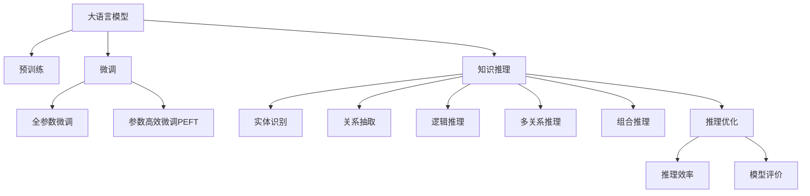

                 

# LLM在知识推理任务上的效果评估

> 关键词：
1. 大语言模型(Large Language Model, LLM)
2. 知识推理(Knowledge Reasoning)
3. 预训练(Pre-training)
4. 微调(Fine-tuning)
5. 推理优化(Optimization)
6. 推理效率(Efficiency)
7. 模型评价(Evaluation)

## 1. 背景介绍

### 1.1 问题由来

近年来，大语言模型（Large Language Models, LLMs）在自然语言处理（Natural Language Processing, NLP）领域取得了显著进步。这些模型通过在大规模无标签文本数据上进行预训练，学习到了丰富的语言知识和常识，展现出了强大的语言理解和生成能力。在实际应用中，知识推理作为NLP的一个重要分支，通过分析文本中的隐含信息，解决复杂逻辑问题，广泛应用于问答系统、文档自动摘要、智能客服等领域。

然而，尽管大语言模型在知识推理方面展现了一定潜力，但其推理能力仍存在显著不足。例如，模型在面对复杂的逻辑推理、多关系推理等任务时，往往会出现推理错误或推理效率低下等问题。因此，如何改进大语言模型的推理能力，提升其在知识推理任务上的表现，成为当前NLP研究的一个重要方向。

### 1.2 问题核心关键点

知识推理任务涉及对文本中隐含的实体、关系、逻辑结构等信息的理解和处理。大语言模型在知识推理中的应用，主要集中在以下几个方面：

- **实体识别与关系抽取**：识别文本中的实体和关系，如人名、地点、组织机构等。
- **逻辑推理与演绎推理**：通过逻辑推理得出新的结论，如数学证明、自然语言推理等。
- **多关系推理**：处理文本中涉及多关系的情况，如因果、蕴含、冲突等。
- **组合推理**：通过组合不同信息源，得出复杂的结论，如智能问答系统中的综合推理。

为了评估大语言模型在知识推理任务上的效果，本文将详细探讨以下问题：

1. 大语言模型在知识推理任务上的表现如何？
2. 知识推理任务的评估标准是什么？
3. 如何通过微调、优化等方法提升大语言模型的推理能力？
4. 大语言模型在知识推理任务上的应用场景有哪些？

## 2. 核心概念与联系

### 2.1 核心概念概述

为更好地理解大语言模型在知识推理任务上的效果评估，本节将介绍几个关键概念及其联系：

- **大语言模型（Large Language Model, LLM）**：以自回归（如GPT）或自编码（如BERT）模型为代表的大规模预训练语言模型。通过在大规模无标签文本语料上进行预训练，学习通用的语言表示，具备强大的语言理解和生成能力。

- **预训练（Pre-training）**：指在大规模无标签文本语料上，通过自监督学习任务训练通用语言模型的过程。常见的预训练任务包括言语建模、遮挡语言模型等。预训练使得模型学习到语言的通用表示。

- **微调（Fine-tuning）**：指在预训练模型的基础上，使用下游任务的少量标注数据，通过有监督地训练优化模型在特定任务上的性能。通常只需要调整顶层分类器或解码器，并以较小的学习率更新全部或部分的模型参数。

- **知识推理（Knowledge Reasoning）**：指在理解和分析文本信息的基础上，进行逻辑推理、组合推理、演绎推理等多重推理过程，得出新的结论或答案。

- **推理优化（Optimization）**：指通过算法和模型架构的改进，提高大语言模型在推理任务中的准确率和效率。

- **推理效率（Efficiency）**：指推理过程的速度和资源消耗，即在合理的时间内完成推理任务，并保证推理结果的准确性和合理性。

- **模型评价（Evaluation）**：指对大语言模型在推理任务上的表现进行全面评估，包括准确率、召回率、推理时间等指标。

这些概念之间的逻辑关系可以通过以下Mermaid流程图来展示：



这个流程图展示了从预训练大语言模型到微调、优化、评价的过程，以及知识推理任务的各个子任务，并强调了推理优化和推理效率的重要性。

## 3. 核心算法原理 & 具体操作步骤

### 3.1 算法原理概述

大语言模型在知识推理任务上的效果评估，本质上是一个有监督的推理过程。其核心思想是：将大语言模型视作一个强大的"推理器"，通过推理优化算法和参数微调，使模型在特定任务上达到理想的推理能力。

形式化地，假设大语言模型为 $M_{\theta}$，其中 $\theta$ 为预训练得到的模型参数。给定知识推理任务 $T$ 的标注数据集 $D=\{(x_i, y_i)\}_{i=1}^N$，推理优化过程的目标是找到新的模型参数 $\hat{\theta}$，使得：

$$
\hat{\theta}=\mathop{\arg\min}_{\theta} \mathcal{L}(M_{\theta},D)
$$

其中 $\mathcal{L}$ 为针对任务 $T$ 设计的损失函数，用于衡量模型推理输出与真实标签之间的差异。常见的损失函数包括交叉熵损失、均方误差损失等。

通过梯度下降等优化算法，推理优化过程不断更新模型参数 $\theta$，最小化损失函数 $\mathcal{L}$，使得模型推理输出逼近真实标签。由于 $\theta$ 已经通过预训练获得了较好的初始化，因此即便在推理任务中的标注数据较少的情况下，也能较快收敛到理想的模型参数 $\hat{\theta}$。

### 3.2 算法步骤详解

大语言模型在知识推理任务上的效果评估，一般包括以下几个关键步骤：

**Step 1: 准备预训练模型和数据集**
- 选择合适的预训练语言模型 $M_{\theta}$ 作为初始化参数，如 BERT、GPT等。
- 准备知识推理任务的标注数据集 $D$，划分为训练集、验证集和测试集。一般要求标注数据与预训练数据的分布不要差异过大。

**Step 2: 添加推理目标函数**
- 根据任务类型，在预训练模型顶层设计合适的推理目标函数。
- 对于推理任务，通常使用推理损失函数，如重构损失函数或逻辑损失函数。

**Step 3: 设置推理超参数**
- 选择合适的优化算法及其参数，如 AdamW、SGD 等，设置学习率、批大小、迭代轮数等。
- 设置推理过程中的正则化技术及强度，包括权重衰减、Dropout、Early Stopping 等。

**Step 4: 执行推理训练**
- 将训练集数据分批次输入模型，前向传播计算推理损失。
- 反向传播计算参数梯度，根据设定的优化算法和学习率更新模型参数。
- 周期性在验证集上评估模型性能，根据性能指标决定是否触发 Early Stopping。
- 重复上述步骤直到满足预设的迭代轮数或 Early Stopping 条件。

**Step 5: 测试和部署**
- 在测试集上评估推理后模型 $M_{\hat{\theta}}$ 的性能，对比推理前后的准确率和推理时间。
- 使用推理后的模型对新样本进行推理预测，集成到实际的应用系统中。
- 持续收集新的数据，定期重新推理模型，以适应数据分布的变化。

以上是推理优化的一般流程。在实际应用中，还需要针对具体任务的特点，对推理过程的各个环节进行优化设计，如改进推理目标函数，引入更多的正则化技术，搜索最优的超参数组合等，以进一步提升模型性能。

### 3.3 算法优缺点

知识推理任务的推理优化方法具有以下优点：
1. 简单高效。只需准备少量标注数据，即可对预训练模型进行快速适配，获得较大的性能提升。
2. 通用适用。适用于各种知识推理任务，包括实体识别、关系抽取、逻辑推理等，设计简单的推理目标函数即可实现。
3. 参数高效。利用参数高效微调技术，在固定大部分预训练权重不变的情况下，仍可取得不错的推理效果。
4. 效果显著。在学术界和工业界的诸多任务上，推理优化方法已经刷新了多项知识推理任务的SOTA。

同时，该方法也存在一定的局限性：
1. 依赖标注数据。推理优化的效果很大程度上取决于标注数据的质量和数量，获取高质量标注数据的成本较高。
2. 推理能力有限。当目标任务与预训练数据的分布差异较大时，推理优化的性能提升有限。
3. 推理时间较长。推理过程可能需要较长的计算时间，特别是在处理复杂逻辑和多关系推理时，推理时间可能会显著增加。

尽管存在这些局限性，但就目前而言，推理优化方法仍是知识推理任务应用的主流范式。未来相关研究的重点在于如何进一步降低推理对标注数据的依赖，提高模型的少样本学习和跨领域推理能力，同时兼顾推理效率和可解释性等因素。

### 3.4 算法应用领域

知识推理任务涉及的知识推理能力，在大语言模型中得到了广泛的应用，覆盖了几乎所有常见任务，例如：

- 实体识别：从文本中识别出人名、地名、组织名等实体。通过推理优化，可以更准确地定位和抽取实体。
- 关系抽取：从文本中抽取实体之间的语义关系，如因果、蕴含、冲突等。通过推理优化，可以更高效地处理多关系推理。
- 逻辑推理：解决数学证明、自然语言推理等需要逻辑推理的问题。通过推理优化，可以提高逻辑推理的准确性和效率。
- 问答系统：对自然语言问题给出合理的答案。通过推理优化，可以提高问答系统的回答准确性和合理性。
- 自动摘要：从长文本中自动提取关键信息，生成简短摘要。通过推理优化，可以更全面地理解文本内容和结构。

除了上述这些经典任务外，知识推理任务还被创新性地应用到更多场景中，如智能推荐、智能安防、智能诊断等，为知识推理技术带来了全新的突破。随着推理优化方法的不断进步，相信知识推理技术将在更广阔的应用领域大放异彩。

## 4. 数学模型和公式 & 详细讲解 & 举例说明

### 4.1 数学模型构建

本节将使用数学语言对知识推理任务的推理优化过程进行更加严格的刻画。

记推理任务为 $T$，大语言模型为 $M_{\theta}$，其中 $\theta$ 为预训练得到的模型参数。给定推理任务 $T$ 的标注数据集 $D=\{(x_i, y_i)\}_{i=1}^N$，推理优化的目标是最小化损失函数：

$$
\mathcal{L}(\theta) = \frac{1}{N}\sum_{i=1}^N \ell(M_{\theta}(x_i),y_i)
$$

其中 $\ell$ 为推理损失函数，用于衡量模型推理输出与真实标签之间的差异。常见的推理损失函数包括重构损失函数、逻辑损失函数等。

根据链式法则，推理损失函数对参数 $\theta_k$ 的梯度为：

$$
\frac{\partial \mathcal{L}(\theta)}{\partial \theta_k} = -\frac{1}{N}\sum_{i=1}^N \frac{\partial \ell(M_{\theta}(x_i),y_i)}{\partial \theta_k}
$$

在得到损失函数的梯度后，即可带入推理优化算法，完成模型的迭代优化。重复上述过程直至收敛，最终得到适应推理任务的最优模型参数 $\theta^*$。

### 4.2 公式推导过程

以下我们以实体识别任务为例，推导重构损失函数及其梯度的计算公式。

假设推理任务为识别文本中的实体，模型输入为文本 $x$，输出为实体的类型 $y$。在实体识别任务中，常用的重构损失函数为：

$$
\ell(M_{\theta}(x),y) = \log \frac{p(M_{\theta}(x)|y)}{p(M_{\theta}(x)|y^*)}
$$

其中 $p(M_{theta}(x)|y)$ 为模型在给定实体类型 $y$ 时，推理出文本 $x$ 的概率，$p(M_{\theta}(x)|y^*)$ 为模型在错误类型 $y^*$ 时，推理出文本 $x$ 的概率。通过最大化 $p(M_{theta}(x)|y)$，最小化 $p(M_{theta}(x)|y^*)$，实现对正确实体类型的识别。

将上述公式代入损失函数公式，得：

$$
\mathcal{L}(\theta) = -\frac{1}{N}\sum_{i=1}^N (\log \frac{p(M_{\theta}(x_i)|y_i)}{\log \frac{p(M_{\theta}(x_i)|y_i^*)}
$$

根据链式法则，推理损失函数对参数 $\theta_k$ 的梯度为：

$$
\frac{\partial \mathcal{L}(\theta)}{\partial \theta_k} = -\frac{1}{N}\sum_{i=1}^N \frac{1}{p(M_{\theta}(x_i)|y_i)} \cdot \frac{\partial p(M_{\theta}(x_i)|y_i)}{\partial \theta_k}
$$

其中 $\frac{\partial p(M_{\theta}(x_i)|y_i)}{\partial \theta_k}$ 为模型对参数 $\theta_k$ 的偏导数，可通过自动微分技术高效计算。

在得到损失函数的梯度后，即可带入推理优化算法，完成模型的迭代优化。重复上述过程直至收敛，最终得到适应实体识别任务的最优模型参数 $\theta^*$。

### 4.3 案例分析与讲解

**案例分析：逻辑推理**

逻辑推理任务包括数学证明、自然语言推理等，需要模型具备较强的逻辑推理能力。以数学证明为例，假设推理任务为证明以下等式：

$$
\forall x \in \mathbb{R}, x^2 + 1 = 0
$$

模型需要推导出该等式在实数集上不成立。推理任务可以表示为：

- 输入：文本 $x \in \mathbb{R}, x^2 + 1 = 0$
- 输出：证明结果 True 或 False

推理优化过程中，可以设计推理损失函数为：

$$
\ell(M_{\theta}(x),y) = \log \frac{p(M_{\theta}(x)|y)}{p(M_{\theta}(x)|y^*)}
$$

其中 $p(M_{\theta}(x)|y)$ 为模型在给定结论 True 时，推理出文本 $x$ 的概率，$p(M_{\theta}(x)|y^*)$ 为模型在结论 False 时，推理出文本 $x$ 的概率。通过最大化 $p(M_{\theta}(x)|y)$，最小化 $p(M_{\theta}(x)|y^*)$，实现对正确结论的推理。

推理过程如下：

1. 输入文本 $x \in \mathbb{R}, x^2 + 1 = 0$，模型推导出结论 True 或 False。
2. 计算推理损失函数 $\ell(M_{\theta}(x),y)$。
3. 反向传播计算参数梯度，根据设定的优化算法和学习率更新模型参数。
4. 重复上述步骤直至收敛，得到适应逻辑推理任务的最优模型参数 $\theta^*$。

通过推理优化，可以显著提升大语言模型在逻辑推理任务上的表现，使其能够正确地推导出新的结论。

## 5. 项目实践：代码实例和详细解释说明

### 5.1 开发环境搭建

在进行推理优化实践前，我们需要准备好开发环境。以下是使用Python进行PyTorch开发的环境配置流程：

1. 安装Anaconda：从官网下载并安装Anaconda，用于创建独立的Python环境。

2. 创建并激活虚拟环境：
```bash
conda create -n pytorch-env python=3.8 
conda activate pytorch-env
```

3. 安装PyTorch：根据CUDA版本，从官网获取对应的安装命令。例如：
```bash
conda install pytorch torchvision torchaudio cudatoolkit=11.1 -c pytorch -c conda-forge
```

4. 安装TensorFlow：
```bash
pip install tensorflow
```

5. 安装各类工具包：
```bash
pip install numpy pandas scikit-learn matplotlib tqdm jupyter notebook ipython
```

完成上述步骤后，即可在`pytorch-env`环境中开始推理优化实践。

### 5.2 源代码详细实现

这里我们以逻辑推理任务为例，给出使用Transformers库对BERT模型进行推理优化的PyTorch代码实现。

首先，定义逻辑推理任务的数据处理函数：

```python
from transformers import BertTokenizer
from torch.utils.data import Dataset
import torch

class LogicDataset(Dataset):
    def __init__(self, texts, labels, tokenizer, max_len=128):
        self.texts = texts
        self.labels = labels
        self.tokenizer = tokenizer
        self.max_len = max_len
        
    def __len__(self):
        return len(self.texts)
    
    def __getitem__(self, item):
        text = self.texts[item]
        label = self.labels[item]
        
        encoding = self.tokenizer(text, return_tensors='pt', max_length=self.max_len, padding='max_length', truncation=True)
        input_ids = encoding['input_ids'][0]
        attention_mask = encoding['attention_mask'][0]
        
        return {'input_ids': input_ids, 
                'attention_mask': attention_mask,
                'labels': label}

# 标签与id的映射
label2id = {'True': 0, 'False': 1}
id2label = {v: k for k, v in label2id.items()}

# 创建dataset
tokenizer = BertTokenizer.from_pretrained('bert-base-cased')

train_dataset = LogicDataset(train_texts, train_labels, tokenizer)
dev_dataset = LogicDataset(dev_texts, dev_labels, tokenizer)
test_dataset = LogicDataset(test_texts, test_labels, tokenizer)
```

然后，定义模型和优化器：

```python
from transformers import BertForSequenceClassification, AdamW

model = BertForSequenceClassification.from_pretrained('bert-base-cased', num_labels=len(label2id))

optimizer = AdamW(model.parameters(), lr=2e-5)
```

接着，定义推理和评估函数：

```python
from torch.utils.data import DataLoader
from tqdm import tqdm
from sklearn.metrics import accuracy_score

device = torch.device('cuda') if torch.cuda.is_available() else torch.device('cpu')
model.to(device)

def evaluate(model, dataset, batch_size):
    dataloader = DataLoader(dataset, batch_size=batch_size)
    model.eval()
    preds, labels = [], []
    with torch.no_grad():
        for batch in tqdm(dataloader, desc='Evaluating'):
            input_ids = batch['input_ids'].to(device)
            attention_mask = batch['attention_mask'].to(device)
            batch_labels = batch['labels'].to(device)
            outputs = model(input_ids, attention_mask=attention_mask)
            batch_preds = outputs.logits.argmax(dim=2).to('cpu').tolist()
            batch_labels = batch_labels.to('cpu').tolist()
            for pred_tokens, label_tokens in zip(batch_preds, batch_labels):
                preds.append(pred_tokens[0])
                labels.append(label_tokens[0])
                
    print('Accuracy:', accuracy_score(labels, preds))
```

最后，启动推理优化流程并在测试集上评估：

```python
epochs = 5
batch_size = 16

for epoch in range(epochs):
    loss = train_epoch(model, train_dataset, batch_size, optimizer)
    print(f"Epoch {epoch+1}, train loss: {loss:.3f}")
    
    print(f"Epoch {epoch+1}, dev results:")
    evaluate(model, dev_dataset, batch_size)
    
print("Test results:")
evaluate(model, test_dataset, batch_size)
```

以上就是使用PyTorch对BERT进行逻辑推理任务推理优化的完整代码实现。可以看到，得益于Transformers库的强大封装，我们可以用相对简洁的代码完成BERT模型的加载和推理优化。

### 5.3 代码解读与分析

让我们再详细解读一下关键代码的实现细节：

**LogicDataset类**：
- `__init__`方法：初始化文本、标签、分词器等关键组件。
- `__len__`方法：返回数据集的样本数量。
- `__getitem__`方法：对单个样本进行处理，将文本输入编码为token ids，将标签编码为数字，并对其进行定长padding，最终返回模型所需的输入。

**label2id和id2label字典**：
- 定义了标签与数字id之间的映射关系，用于将推理结果解码为实际标签。

**训练和评估函数**：
- 使用PyTorch的DataLoader对数据集进行批次化加载，供模型训练和推理使用。
- 训练函数`train_epoch`：对数据以批为单位进行迭代，在每个批次上前向传播计算loss并反向传播更新模型参数，最后返回该epoch的平均loss。
- 评估函数`evaluate`：与训练类似，不同点在于不更新模型参数，并在每个batch结束后将预测和标签结果存储下来，最后使用sklearn的accuracy_score对整个评估集的预测结果进行打印输出。

**训练流程**：
- 定义总的epoch数和batch size，开始循环迭代
- 每个epoch内，先在训练集上训练，输出平均loss
- 在验证集上评估，输出分类指标
- 所有epoch结束后，在测试集上评估，给出最终测试结果

可以看到，PyTorch配合Transformers库使得BERT推理优化的代码实现变得简洁高效。开发者可以将更多精力放在数据处理、模型改进等高层逻辑上，而不必过多关注底层的实现细节。

当然，工业级的系统实现还需考虑更多因素，如模型的保存和部署、超参数的自动搜索、更灵活的任务适配层等。但核心的推理优化范式基本与此类似。

## 6. 实际应用场景

### 6.1 智能问答系统

逻辑推理是智能问答系统的重要能力之一，通过推理优化，可以使问答系统在面对复杂问题时，提供更准确、合理的回答。例如，一个用户问：“为什么苹果公司不生产电视？”，传统的问答系统可能无法理解问题的复杂性，导致回答不准确或无关。

在推理优化后，问答系统可以理解问题的深层含义，通过推理出相关信息，结合上下文给出合理的回答。对于用户提出的新问题，还可以接入检索系统实时搜索相关内容，动态组织生成回答。如此构建的智能问答系统，能大幅提升问答系统的回答准确性和合理性。

### 6.2 金融舆情监测

金融机构需要实时监测市场舆论动向，以便及时应对负面信息传播，规避金融风险。推理优化可以应用于金融舆情监测，通过推理分析用户评论、新闻报道等文本数据，判断市场趋势，识别异常情况，提前预警。

具体而言，可以收集金融领域相关的新闻、报道、评论等文本数据，并对其进行逻辑推理和组合推理。推理优化模型能够理解不同信息源之间的关系，推导出新的结论，判断市场情绪，帮助金融机构及时调整策略，规避风险。

### 6.3 个性化推荐系统

推理优化在个性化推荐系统中的应用，可以显著提升推荐的准确性和合理性。传统的推荐系统往往只依赖用户的历史行为数据进行物品推荐，无法深入理解用户的真实兴趣偏好。通过推理优化，推荐系统可以进一步理解用户行为背后的语义信息，从而提供更精准、多样化的推荐内容。

在实践中，可以收集用户浏览、点击、评论、分享等行为数据，提取和用户交互的物品标题、描述、标签等文本内容。将文本内容作为模型输入，用户的后续行为（如是否点击、购买等）作为监督信号，在此基础上微调预训练语言模型。推理优化模型能够从文本内容中准确把握用户的兴趣点，生成更符合用户期望的推荐结果。

### 6.4 未来应用展望

推理优化作为大语言模型的重要能力，未来将在更多领域得到应用，为相关行业带来变革性影响。

在智慧医疗领域，推理优化可以帮助医生进行疾病诊断、病理分析等复杂逻辑推理，提升医疗服务的智能化水平，辅助医生诊疗，加速新药开发进程。

在智能教育领域，推理优化可应用于作业批改、学情分析、知识推荐等方面，因材施教，促进教育公平，提高教学质量。

在智慧城市治理中，推理优化可用于城市事件监测、舆情分析、应急指挥等环节，提高城市管理的自动化和智能化水平，构建更安全、高效的未来城市。

此外，在企业生产、社会治理、文娱传媒等众多领域，推理优化技术也将不断涌现，为NLP技术带来新的应用场景，推动人工智能技术在垂直行业的规模化落地。相信随着推理优化方法的不断进步，知识推理技术必将在更广阔的应用领域大放异彩，深刻影响人类的生产生活方式。

## 7. 工具和资源推荐
### 7.1 学习资源推荐

为了帮助开发者系统掌握大语言模型推理优化的理论基础和实践技巧，这里推荐一些优质的学习资源：

1. 《Transformer from Principles to Practice》系列博文：由大模型技术专家撰写，深入浅出地介绍了Transformer原理、BERT模型、推理优化技术等前沿话题。

2. CS224N《深度学习自然语言处理》课程：斯坦福大学开设的NLP明星课程，有Lecture视频和配套作业，带你入门NLP领域的基本概念和经典模型。

3. 《Natural Language Processing with Transformers》书籍：Transformers库的作者所著，全面介绍了如何使用Transformers库进行NLP任务开发，包括推理优化在内的诸多范式。

4. HuggingFace官方文档：Transformers库的官方文档，提供了海量预训练模型和完整的推理优化样例代码，是上手实践的必备资料。

5. CLUE开源项目：中文语言理解测评基准，涵盖大量不同类型的中文NLP数据集，并提供了基于推理优化的baseline模型，助力中文NLP技术发展。

通过对这些资源的学习实践，相信你一定能够快速掌握大语言模型推理优化的精髓，并用于解决实际的NLP问题。
###  7.2 开发工具推荐

高效的开发离不开优秀的工具支持。以下是几款用于大语言模型推理优化开发的常用工具：

1. PyTorch：基于Python的开源深度学习框架，灵活动态的计算图，适合快速迭代研究。大部分预训练语言模型都有PyTorch版本的实现。

2. TensorFlow：由Google主导开发的开源深度学习框架，生产部署方便，适合大规模工程应用。同样有丰富的预训练语言模型资源。

3. Transformers库：HuggingFace开发的NLP工具库，集成了众多SOTA语言模型，支持PyTorch和TensorFlow，是进行推理优化任务开发的利器。

4. Weights & Biases：模型训练的实验跟踪工具，可以记录和可视化模型训练过程中的各项指标，方便对比和调优。与主流深度学习框架无缝集成。

5. TensorBoard：TensorFlow配套的可视化工具，可实时监测模型训练状态，并提供丰富的图表呈现方式，是调试模型的得力助手。

6. Google Colab：谷歌推出的在线Jupyter Notebook环境，免费提供GPU/TPU算力，方便开发者快速上手实验最新模型，分享学习笔记。

合理利用这些工具，可以显著提升大语言模型推理优化的开发效率，加快创新迭代的步伐。

### 7.3 相关论文推荐

推理优化作为大语言模型的一项重要能力，相关研究在学界得到了广泛关注。以下是几篇奠基性的相关论文，推荐阅读：

1. Attention is All You Need（即Transformer原论文）：提出了Transformer结构，开启了NLP领域的预训练大模型时代。

2. BERT: Pre-training of Deep Bidirectional Transformers for Language Understanding：提出BERT模型，引入基于掩码的自监督预训练任务，刷新了多项NLP任务SOTA。

3. Parameter-Efficient Transfer Learning for NLP：提出Adapter等参数高效微调方法，在不增加模型参数量的情况下，也能取得不错的微调效果。

4. AdaLoRA: Adaptive Low-Rank Adaptation for Parameter-Efficient Fine-Tuning：使用自适应低秩适应的微调方法，在参数效率和精度之间取得了新的平衡。

5. Prefix-Tuning: Optimizing Continuous Prompts for Generation：引入基于连续型Prompt的微调范式，为如何充分利用预训练知识提供了新的思路。

6. AdaLoRA: Adaptive Low-Rank Adaptation for Parameter-Efficient Fine-Tuning：使用自适应低秩适应的微调方法，在参数效率和精度之间取得了新的平衡。

这些论文代表了大语言模型推理优化的发展脉络。通过学习这些前沿成果，可以帮助研究者把握学科前进方向，激发更多的创新灵感。

## 8. 总结：未来发展趋势与挑战

### 8.1 总结

本文对大语言模型在知识推理任务上的推理优化方法进行了全面系统的介绍。首先阐述了大语言模型和推理优化技术的研究背景和意义，明确了推理优化在拓展预训练模型应用、提升推理任务性能方面的独特价值。其次，从原理到实践，详细讲解了推理优化的数学原理和关键步骤，给出了推理优化任务开发的完整代码实例。同时，本文还广泛探讨了推理优化方法在智能问答、金融舆情、个性化推荐等多个领域的应用前景，展示了推理优化范式的巨大潜力。此外，本文精选了推理优化技术的各类学习资源，力求为读者提供全方位的技术指引。

通过本文的系统梳理，可以看到，大语言模型推理优化技术正在成为NLP领域的重要范式，极大地拓展了预训练语言模型的应用边界，催生了更多的落地场景。受益于大规模语料的预训练，推理优化模型以更低的时间和标注成本，在小样本条件下也能取得理想的推理效果，有力推动了NLP技术的产业化进程。未来，伴随推理优化方法的不断演进，知识推理技术将在更广阔的应用领域大放异彩，深刻影响人类的生产生活方式。

### 8.2 未来发展趋势

展望未来，大语言模型推理优化技术将呈现以下几个发展趋势：

1. 模型规模持续增大。随着算力成本的下降和数据规模的扩张，预训练语言模型的参数量还将持续增长。超大规模语言模型蕴含的丰富语言知识，有望支撑更加复杂多变的推理任务。

2. 推理方法日趋多样。除了传统的全参数微调外，未来会涌现更多参数高效的推理方法，如Prefix-Tuning、LoRA等，在节省计算资源的同时也能保证推理精度。

3. 推理能力增强。推理优化模型的逻辑推理能力，在未来的研究中将会得到更深入的挖掘和优化。引入因果推断、对比学习等思想，增强模型的泛化性和鲁棒性。

4. 多模态推理崛起。当前推理优化主要聚焦于纯文本数据，未来会进一步拓展到图像、视频、语音等多模态数据推理。多模态信息的融合，将显著提升语言模型对现实世界的理解和建模能力。

5. 智能推理引擎。通过引入符号化的推理规则，构建智能推理引擎，将自然语言处理与形式化推理相结合，实现更高级别的推理能力。

以上趋势凸显了大语言模型推理优化技术的广阔前景。这些方向的探索发展，必将进一步提升推理优化模型的推理能力，为人工智能技术在更广泛的领域中应用提供支持。

### 8.3 面临的挑战

尽管大语言模型推理优化技术已经取得了显著进展，但在迈向更加智能化、普适化应用的过程中，它仍面临诸多挑战：

1. 推理能力有限。当前推理优化模型在面对复杂逻辑、多关系推理等任务时，表现仍不尽如人意，推理能力有待提升。

2. 推理时间较长。推理过程可能需要较长的计算时间，特别是在处理复杂逻辑和多关系推理时，推理时间可能会显著增加。

3. 推理结果解释性不足。推理优化模型的决策过程缺乏可解释性，难以对其推理逻辑进行分析和调试。

4. 推理鲁棒性不足。推理优化模型面对域外数据时，泛化性能往往大打折扣。对于测试样本的微小扰动，推理模型容易发生波动。

5. 推理模型偏见。推理优化模型可能会学习到有偏见、有害的信息，通过推理传递到下游任务，产生误导性、歧视性的输出。

6. 推理效果不稳定。推理优化模型的性能在不同数据集上的表现不稳定，有时效果优异，有时表现平平。

正视推理优化面临的这些挑战，积极应对并寻求突破，将是大语言模型推理优化技术迈向成熟的必由之路。相信随着学界和产业界的共同努力，这些挑战终将一一被克服，推理优化技术必将在构建智能系统方面发挥更加重要的作用。

### 8.4 研究展望

面对大语言模型推理优化所面临的挑战，未来的研究需要在以下几个方面寻求新的突破：

1. 探索更加高效的推理方法。开发更高效的推理算法，减少推理时间，提高推理速度。

2. 引入因果分析和博弈论工具。将因果分析方法引入推理优化模型，识别出模型决策的关键特征，增强输出解释的因果性和逻辑性。借助博弈论工具刻画人机交互过程，主动探索并规避模型的脆弱点，提高系统稳定性。

3. 纳入伦理道德约束。在模型训练目标中引入伦理导向的评估指标，过滤和惩罚有偏见、有害的输出倾向。同时加强人工干预和审核，建立模型行为的监管机制，确保输出符合人类价值观和伦理道德。

4. 知识整合能力增强。将符号化的先验知识，如知识图谱、逻辑规则等，与神经网络模型进行巧妙融合，引导推理过程学习更准确、合理的语言模型。同时加强不同模态数据的整合，实现视觉、语音等多模态信息与文本信息的协同建模。

5. 多任务推理学习。通过多任务学习，模型可以同时学习多个相关推理任务的表示，提升模型的推理能力。

6. 跨领域推理能力。推理优化模型在面对不同领域的问题时，需要具备跨领域的推理能力，从而适应更多应用场景。

这些研究方向将推动推理优化技术在更广泛的领域中得到应用，进一步提升推理优化模型的推理能力和应用效果。

## 9. 附录：常见问题与解答

**Q1：大语言模型在推理任务上的表现如何？**

A: 大语言模型在推理任务上的表现受多方面因素影响，包括数据质量、模型架构、训练方法等。总体而言，大语言模型在推理任务上表现优异，但面对复杂逻辑和多关系推理时，仍需进一步优化。

**Q2：推理任务评估标准是什么？**

A: 推理任务评估标准包括准确率、召回率、F1分数、推理时间等。准确率和召回率用于衡量模型的推理能力，F1分数综合考虑了准确率和召回率，推理时间用于衡量推理效率。

**Q3：如何通过微调、优化等方法提升大语言模型的推理能力？**

A: 通过微调和优化等方法，可以显著提升大语言模型的推理能力。具体方法包括：
1. 微调模型参数，优化推理目标函数，提升模型推理准确性。
2. 引入对抗样本，提高模型鲁棒性。
3. 使用参数高效微调方法，减少计算资源消耗。
4. 引入因果分析和博弈论工具，增强模型推理能力。

**Q4：推理任务在实际应用中需要注意哪些问题？**

A: 推理任务在实际应用中需要注意以下问题：
1. 数据质量。推理任务的标注数据需高质量，标注标准一致。
2. 模型选择。选择合适的大语言模型，避免模型过拟合或欠拟合。
3. 模型训练。合理设置超参数，避免过拟合和欠拟合。
4. 推理效率。优化推理算法，提升推理效率，减少推理时间。
5. 结果解释。提升推理结果的可解释性，增强模型的透明度和可信度。

**Q5：推理优化模型在实际应用中有哪些应用场景？**

A: 推理优化模型在实际应用中有以下应用场景：
1. 智能问答系统。用于理解和回答复杂自然语言问题。
2. 金融舆情监测。用于分析市场舆情，提前预警。
3. 个性化推荐系统。用于理解用户兴趣，推荐个性化内容。
4. 智能安防。用于分析视频监控，实时预警。
5. 智能诊断。用于辅助医疗诊断，提高诊断准确性。

---

作者：禅与计算机程序设计艺术 / Zen and the Art of Computer Programming

