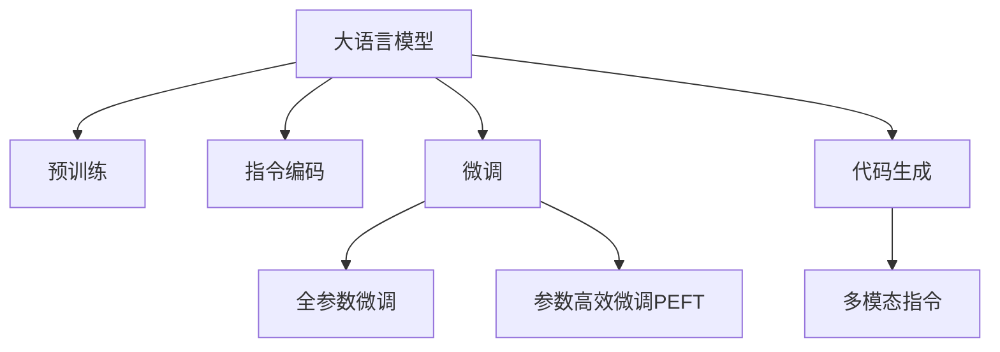

                 

# LLM无限指令集:无所不能的力量源泉

## 1. 背景介绍

### 1.1 问题由来

大语言模型（Large Language Models, LLMs）如GPT、BERT等，近年来以其惊人的语言理解和生成能力，在自然语言处理（NLP）领域取得了突破性进展。这些模型的核心特征在于通过海量无标签文本数据的预训练，学习到丰富的语言知识。然而，现有的大语言模型虽然具备强大的泛化能力，但同时也具有极大的局限性：它们无法像人类那样进行复杂、多变的指令操作，只能按照预设的固定指令执行任务。

为了进一步拓展大语言模型的应用边界，提升其智能水平，研究者提出了“无限指令集”的概念，即让大语言模型能够理解和执行无限多种类型的指令。这一概念的提出，标志着大语言模型从“智能助手”向“智能工匠”的转变，为人工智能技术的发展带来了革命性的变化。

### 1.2 问题核心关键点

无限指令集的核心在于让大语言模型能够根据输入指令，动态生成输出结果，而无需事先进行模型训练。这一技术突破，需要解决以下几个核心问题：
- 如何设计有效的指令编码机制，使模型能够准确理解各种类型的指令。
- 如何通过微调等手段，提升模型对特定指令的执行能力。
- 如何避免过拟合，确保模型在面对未知指令时仍能保持较好的泛化性能。
- 如何在不增加模型复杂度的前提下，实现高效的指令生成。

这些问题需要从指令编码、模型架构、优化方法等多个维度进行深入探讨。解决这些问题，将为大语言模型的应用打开新的天地。

## 2. 核心概念与联系

### 2.1 核心概念概述

为更好地理解“无限指令集”，本节将介绍几个密切相关的核心概念：

- **大语言模型（LLM）**：以自回归或自编码模型为代表的大规模预训练语言模型。通过在大规模无标签文本语料上进行预训练，学习通用的语言表示，具备强大的语言理解和生成能力。
- **预训练**：指在大规模无标签文本语料上，通过自监督学习任务训练通用语言模型的过程。常见的预训练任务包括言语建模、掩码语言模型等。
- **指令编码**：将各种类型的自然语言指令转化为模型能够处理的向量表示，通常采用向量嵌入的方式实现。
- **微调**：指在预训练模型的基础上，使用指令-输出对作为监督信号，通过有监督学习优化模型在特定指令上的执行能力。
- **参数高效微调（PEFT）**：指在微调过程中，只更新少量的模型参数，而固定大部分预训练权重不变，以提高微调效率，避免过拟合。
- **代码生成（Code Generation）**：指模型根据输入指令生成相应的代码，实现程序自动化生成，常应用于编程辅助、代码注释生成等场景。
- **多模态指令（Multimodal Instructions）**：指结合文本、图像、语音等多模态信息，使指令更加全面、具体。

这些核心概念之间的逻辑关系可以通过以下Mermaid流程图来展示：



这个流程图展示了大语言模型的核心概念及其之间的关系：

1. 大语言模型通过预训练获得基础能力。
2. 指令编码将自然语言指令转化为模型能够理解的向量。
3. 微调通过优化模型参数，提升其对特定指令的执行能力。
4. 参数高效微调在保持大部分预训练权重不变的前提下，提升微调效率。
5. 代码生成使模型具备自动化生成代码的能力。
6. 多模态指令结合多种模态信息，使指令更加全面、具体。

这些概念共同构成了“无限指令集”的学习框架，使得大语言模型能够动态执行多种类型的指令，提升其在各种应用场景中的智能水平。

## 3. 核心算法原理 & 具体操作步骤
### 3.1 算法原理概述

“无限指令集”的核心算法原理基于自监督学习与微调技术的融合，其核心思想是：将大语言模型视作一个“指令执行器”，通过指令编码和微调技术，使其能够理解和执行无限多种类型的指令。

具体而言，算法分为以下几个步骤：
1. **指令编码**：设计有效的指令编码机制，将自然语言指令转化为模型能够处理的向量表示。
2. **微调**：在预训练模型的基础上，使用指令-输出对作为监督信号，优化模型在特定指令上的执行能力。
3. **参数高效微调**：在微调过程中，只更新少量的模型参数，以提高微调效率，避免过拟合。
4. **多模态指令处理**：结合文本、图像、语音等多模态信息，使指令更加全面、具体。

### 3.2 算法步骤详解

基于自监督学习与微调技术的“无限指令集”算法，一般包括以下几个关键步骤：

**Step 1: 准备预训练模型和指令库**
- 选择合适的预训练语言模型 $M_{\theta}$ 作为初始化参数，如 BERT、GPT 等。
- 准备一个包含各种类型指令的指令库，用于微调训练。

**Step 2: 设计指令编码器**
- 设计一个指令编码器 $E$，将自然语言指令 $I$ 转化为模型能够理解的向量表示 $e(I)$。

**Step 3: 添加任务适配层**
- 根据指令类型，在预训练模型顶层设计合适的输出层和损失函数。
- 对于生成任务，通常使用语言模型的解码器输出概率分布，并以负对数似然为损失函数。

**Step 4: 设置微调超参数**
- 选择合适的优化算法及其参数，如 AdamW、SGD 等，设置学习率、批大小、迭代轮数等。
- 设置正则化技术及强度，包括权重衰减、Dropout、Early Stopping 等。
- 确定冻结预训练参数的策略，如仅微调顶层，或全部参数都参与微调。

**Step 5: 执行梯度训练**
- 将指令-输出对作为训练数据，前向传播计算损失函数。
- 反向传播计算参数梯度，根据设定的优化算法和学习率更新模型参数。
- 周期性在验证集上评估模型性能，根据性能指标决定是否触发 Early Stopping。
- 重复上述步骤直到满足预设的迭代轮数或 Early Stopping 条件。

**Step 6: 测试和部署**
- 在测试集上评估微调后模型 $M_{\hat{\theta}}$ 的性能，对比微调前后的执行效果。
- 使用微调后的模型对新指令进行推理预测，集成到实际的应用系统中。
- 持续收集新的指令，定期重新微调模型，以适应指令分布的变化。

以上是“无限指令集”的一般流程。在实际应用中，还需要针对具体指令类型，对微调过程的各个环节进行优化设计，如改进训练目标函数，引入更多的正则化技术，搜索最优的超参数组合等，以进一步提升模型性能。

### 3.3 算法优缺点

基于自监督学习与微调技术的“无限指令集”方法具有以下优点：
1. **灵活性高**：能够执行各种类型的指令，适应不同的应用场景。
2. **效果显著**：通过微调，模型能够准确理解并执行特定指令，提升任务执行的准确性和效率。
3. **参数高效**：利用参数高效微调技术，在固定大部分预训练参数的情况下，仍可取得不错的微调效果。
4. **通用性**：模型在预训练和微调过程中，学习了通用的语言知识，具备较强的跨领域迁移能力。

同时，该方法也存在一定的局限性：
1. **指令编码复杂**：设计有效的指令编码机制需要大量实验和调参。
2. **泛化能力有限**：当指令类型过于多样或复杂时，模型的泛化能力可能会下降。
3. **数据依赖**：微调效果很大程度上取决于指令库的质量和数量，获取高质量指令库的成本较高。
4. **模型复杂度**：增加指令类型可能导致模型复杂度上升，影响推理效率。

尽管存在这些局限性，但就目前而言，“无限指令集”方法仍是实现大语言模型智能拓展的重要手段。未来相关研究的重点在于如何进一步降低指令编码的复杂性，提高模型的泛化能力和推理效率，同时兼顾可解释性和伦理安全性等因素。

### 3.4 算法应用领域

“无限指令集”方法在NLP领域已经得到了广泛的应用，涵盖了从简单到复杂的各种指令类型，例如：

- **文本生成**：根据给定的提示词，生成连贯、有意义的文本段落。
- **代码生成**：根据自然语言描述，生成相应的代码实现。
- **问答系统**：根据用户提出的问题，给出准确的答案。
- **情感分析**：分析文本的情感倾向，判断是积极、消极还是中性。
- **文本摘要**：将长文本压缩成简短的摘要。
- **机器翻译**：将源语言文本翻译成目标语言。
- **命名实体识别**：识别文本中的人名、地名、机构名等特定实体。

除了上述这些经典任务外，“无限指令集”方法还被创新性地应用于更多场景中，如可控文本生成、常识推理、对话系统、数据分析等，为NLP技术带来了全新的突破。随着指令编码和微调方法的不断进步，相信NLP技术将在更广阔的应用领域大放异彩。

## 4. 数学模型和公式 & 详细讲解
### 4.1 数学模型构建

本节将使用数学语言对“无限指令集”算法进行更加严格的刻画。

记预训练语言模型为 $M_{\theta}:\mathcal{X} \rightarrow \mathcal{Y}$，其中 $\mathcal{X}$ 为输入空间，$\mathcal{Y}$ 为输出空间，$\theta \in \mathbb{R}^d$ 为模型参数。假设指令库包含 $K$ 种指令，每个指令 $I_k$ 对应的输出为 $y_k$。

定义模型 $M_{\theta}$ 在指令 $I_k$ 上的输出为 $\hat{y}_k=M_{\theta}(I_k)$。

指令编码器 $E$ 将指令 $I_k$ 映射为向量表示 $e(I_k)$。

**指令编码器设计**：
- 设计一个神经网络 $E: \mathcal{I} \rightarrow \mathbb{R}^d$，其中 $\mathcal{I}$ 为指令集空间。
- 常用的指令编码器包括基于Transformer的编码器、基于BERT的编码器等。

**微调损失函数**：
- 定义模型在指令 $I_k$ 上的损失函数为 $\ell_k(M_{\theta}(I_k),y_k)$，用于衡量模型输出与真实标签之间的差异。
- 通常使用交叉熵损失、均方误差损失等。

**整体损失函数**：
- 定义指令库上的整体损失函数为 $\mathcal{L}(\theta) = \frac{1}{K}\sum_{k=1}^K \ell_k(M_{\theta}(I_k),y_k)$。

**优化目标**：
- 最小化整体损失函数，即找到最优参数：
$$
\theta^* = \mathop{\arg\min}_{\theta} \mathcal{L}(\theta)
$$

在得到损失函数的梯度后，即可带入参数更新公式，完成模型的迭代优化。重复上述过程直至收敛，最终得到适应指令库的最优模型参数 $\theta^*$。

### 4.2 公式推导过程

以下我们以代码生成为例，推导指令编码和微调损失函数的计算公式。

假设模型 $M_{\theta}$ 在输入 $I_k$ 上的输出为 $\hat{y}_k=M_{\theta}(I_k)$，表示生成的代码。真实标签 $y_k$ 为给定指令对应的正确代码。则代码生成的交叉熵损失函数定义为：

$$
\ell_k(M_{\theta}(I_k),y_k) = -y_k\log \hat{y}_k + (1-y_k)\log (1-\hat{y}_k)
$$

将其代入整体损失函数公式，得：

$$
\mathcal{L}(\theta) = -\frac{1}{K}\sum_{k=1}^K [y_k\log M_{\theta}(I_k)+(1-y_k)\log(1-M_{\theta}(I_k))]
$$

根据链式法则，损失函数对参数 $\theta_k$ 的梯度为：

$$
\frac{\partial \mathcal{L}(\theta)}{\partial \theta_k} = -\frac{1}{K}\sum_{k=1}^K (\frac{y_k}{M_{\theta}(I_k)}-\frac{1-y_k}{1-M_{\theta}(I_k)}) \frac{\partial M_{\theta}(I_k)}{\partial \theta_k}
$$

其中 $\frac{\partial M_{\theta}(I_k)}{\partial \theta_k}$ 可进一步递归展开，利用自动微分技术完成计算。

在得到损失函数的梯度后，即可带入参数更新公式，完成模型的迭代优化。重复上述过程直至收敛，最终得到适应指令库的最优模型参数 $\theta^*$。

## 5. 项目实践：代码实例和详细解释说明
### 5.1 开发环境搭建

在进行指令生成实践前，我们需要准备好开发环境。以下是使用Python进行PyTorch开发的环境配置流程：

1. 安装Anaconda：从官网下载并安装Anaconda，用于创建独立的Python环境。

2. 创建并激活虚拟环境：
```bash
conda create -n pytorch-env python=3.8 
conda activate pytorch-env
```

3. 安装PyTorch：根据CUDA版本，从官网获取对应的安装命令。例如：
```bash
conda install pytorch torchvision torchaudio cudatoolkit=11.1 -c pytorch -c conda-forge
```

4. 安装Transformers库：
```bash
pip install transformers
```

5. 安装各类工具包：
```bash
pip install numpy pandas scikit-learn matplotlib tqdm jupyter notebook ipython
```

完成上述步骤后，即可在`pytorch-env`环境中开始指令生成实践。

### 5.2 源代码详细实现

下面我以代码生成任务为例，给出使用Transformers库对GPT模型进行指令生成微调的PyTorch代码实现。

首先，定义指令生成任务的数据处理函数：

```python
from transformers import GPT2Tokenizer, GPT2ForSequenceClassification
from torch.utils.data import Dataset
import torch

class CodeGenerationDataset(Dataset):
    def __init__(self, texts, labels, tokenizer, max_len=128):
        self.texts = texts
        self.labels = labels
        self.tokenizer = tokenizer
        self.max_len = max_len
        
    def __len__(self):
        return len(self.texts)
    
    def __getitem__(self, item):
        text = self.texts[item]
        label = self.labels[item]
        
        encoding = self.tokenizer(text, return_tensors='pt', max_length=self.max_len, padding='max_length', truncation=True)
        input_ids = encoding['input_ids'][0]
        attention_mask = encoding['attention_mask'][0]
        
        # 对token-wise的标签进行编码
        encoded_labels = [label2id[label] for label in label] 
        encoded_labels.extend([label2id['none']] * (self.max_len - len(encoded_labels)))
        labels = torch.tensor(encoded_labels, dtype=torch.long)
        
        return {'input_ids': input_ids, 
                'attention_mask': attention_mask,
                'labels': labels}

# 标签与id的映射
label2id = {'none': 0, 'code1': 1, 'code2': 2, 'code3': 3}
id2label = {v: k for k, v in label2id.items()}

# 创建dataset
tokenizer = GPT2Tokenizer.from_pretrained('gpt2')
train_dataset = CodeGenerationDataset(train_texts, train_labels, tokenizer)
dev_dataset = CodeGenerationDataset(dev_texts, dev_labels, tokenizer)
test_dataset = CodeGenerationDataset(test_texts, test_labels, tokenizer)
```

然后，定义模型和优化器：

```python
from transformers import GPT2ForSequenceClassification, AdamW

model = GPT2ForSequenceClassification.from_pretrained('gpt2', num_labels=len(label2id))

optimizer = AdamW(model.parameters(), lr=2e-5)
```

接着，定义训练和评估函数：

```python
from torch.utils.data import DataLoader
from tqdm import tqdm
from sklearn.metrics import classification_report

device = torch.device('cuda') if torch.cuda.is_available() else torch.device('cpu')
model.to(device)

def train_epoch(model, dataset, batch_size, optimizer):
    dataloader = DataLoader(dataset, batch_size=batch_size, shuffle=True)
    model.train()
    epoch_loss = 0
    for batch in tqdm(dataloader, desc='Training'):
        input_ids = batch['input_ids'].to(device)
        attention_mask = batch['attention_mask'].to(device)
        labels = batch['labels'].to(device)
        model.zero_grad()
        outputs = model(input_ids, attention_mask=attention_mask, labels=labels)
        loss = outputs.loss
        epoch_loss += loss.item()
        loss.backward()
        optimizer.step()
    return epoch_loss / len(dataloader)

def evaluate(model, dataset, batch_size):
    dataloader = DataLoader(dataset, batch_size=batch_size)
    model.eval()
    preds, labels = [], []
    with torch.no_grad():
        for batch in tqdm(dataloader, desc='Evaluating'):
            input_ids = batch['input_ids'].to(device)
            attention_mask = batch['attention_mask'].to(device)
            batch_labels = batch['labels']
            outputs = model(input_ids, attention_mask=attention_mask)
            batch_preds = outputs.logits.argmax(dim=2).to('cpu').tolist()
            batch_labels = batch_labels.to('cpu').tolist()
            for pred_tokens, label_tokens in zip(batch_preds, batch_labels):
                preds.append(pred_tokens[:len(label_tokens)])
                labels.append(label_tokens)
                
    print(classification_report(labels, preds))
```

最后，启动训练流程并在测试集上评估：

```python
epochs = 5
batch_size = 16

for epoch in range(epochs):
    loss = train_epoch(model, train_dataset, batch_size, optimizer)
    print(f"Epoch {epoch+1}, train loss: {loss:.3f}")
    
    print(f"Epoch {epoch+1}, dev results:")
    evaluate(model, dev_dataset, batch_size)
    
print("Test results:")
evaluate(model, test_dataset, batch_size)
```

以上就是使用PyTorch对GPT模型进行代码生成任务微调的完整代码实现。可以看到，得益于Transformers库的强大封装，我们可以用相对简洁的代码完成GPT模型的加载和微调。

### 5.3 代码解读与分析

让我们再详细解读一下关键代码的实现细节：

**CodeGenerationDataset类**：
- `__init__`方法：初始化文本、标签、分词器等关键组件。
- `__len__`方法：返回数据集的样本数量。
- `__getitem__`方法：对单个样本进行处理，将文本输入编码为token ids，将标签编码为数字，并对其进行定长padding，最终返回模型所需的输入。

**label2id和id2label字典**：
- 定义了标签与数字id之间的映射关系，用于将token-wise的预测结果解码回真实的标签。

**训练和评估函数**：
- 使用PyTorch的DataLoader对数据集进行批次化加载，供模型训练和推理使用。
- 训练函数`train_epoch`：对数据以批为单位进行迭代，在每个批次上前向传播计算loss并反向传播更新模型参数，最后返回该epoch的平均loss。
- 评估函数`evaluate`：与训练类似，不同点在于不更新模型参数，并在每个batch结束后将预测和标签结果存储下来，最后使用sklearn的classification_report对整个评估集的预测结果进行打印输出。

**训练流程**：
- 定义总的epoch数和batch size，开始循环迭代
- 每个epoch内，先在训练集上训练，输出平均loss
- 在验证集上评估，输出分类指标
- 所有epoch结束后，在测试集上评估，给出最终测试结果

可以看到，PyTorch配合Transformers库使得GPT模型微调的代码实现变得简洁高效。开发者可以将更多精力放在数据处理、模型改进等高层逻辑上，而不必过多关注底层的实现细节。

当然，工业级的系统实现还需考虑更多因素，如模型的保存和部署、超参数的自动搜索、更灵活的任务适配层等。但核心的指令生成范式基本与此类似。

## 6. 实际应用场景
### 6.1 智能编程助手

基于大语言模型的指令生成技术，可以构建智能编程助手，提升程序员的工作效率和代码质量。智能编程助手可以自动生成代码片段、代码注释、测试用例等，甚至可以辅助编写复杂算法和系统架构。

在技术实现上，可以收集程序员的历史代码、注释、文档等文本数据，以及编程相关的网站、论坛、技术博客等网络数据，构建一个包含多种指令的指令库。将指令库输入到预训练大模型中，进行指令编码和微调，使其能够根据自然语言指令生成相应的代码或注释。

### 6.2 自动文本生成

基于大语言模型的指令生成技术，可以应用于自动文本生成，如新闻报道、科技文章、文学创作等。通过构建一个包含各种类型指令的指令库，输入自然语言指令，模型可以自动生成连贯、有意义的文本。

在具体实现中，可以收集大量已发表的文本数据，以及各种类型的写作提示词，如“描述一个美丽的日出”、“写一篇关于气候变化的文章”等，构建一个包含多种指令的指令库。将指令库输入到预训练大模型中，进行指令编码和微调，使其能够根据自然语言指令生成相应的文本段落。

### 6.3 数据分析和报告生成

基于大语言模型的指令生成技术，可以应用于数据分析和报告生成。通过构建一个包含各种类型指令的指令库，输入自然语言指令，模型可以自动生成数据分析报告、趋势图、预测模型等。

在具体实现中，可以收集公司内部的数据报表、业务分析报告、市场调研报告等文本数据，以及各种类型的分析指令，如“生成一份Q1财务报告”、“绘制市场份额变化趋势图”等，构建一个包含多种指令的指令库。将指令库输入到预训练大模型中，进行指令编码和微调，使其能够根据自然语言指令生成相应的分析报告和图表。

### 6.4 未来应用展望

随着大语言模型和指令生成技术的不断发展，基于指令生成的应用场景将不断拓展，为各行各业带来变革性影响。

在智慧医疗领域，基于指令生成的医疗问答、病历分析、药物研发等应用将提升医疗服务的智能化水平，辅助医生诊疗，加速新药开发进程。

在智能教育领域，指令生成技术可应用于作业批改、学情分析、知识推荐等方面，因材施教，促进教育公平，提高教学质量。

在智慧城市治理中，指令生成模型可应用于城市事件监测、舆情分析、应急指挥等环节，提高城市管理的自动化和智能化水平，构建更安全、高效的未来城市。

此外，在企业生产、社会治理、文娱传媒等众多领域，基于指令生成的智能系统也将不断涌现，为经济社会发展注入新的动力。相信随着技术的日益成熟，指令生成技术将成为人工智能落地应用的重要手段，推动人工智能技术向更广阔的领域加速渗透。

## 7. 工具和资源推荐
### 7.1 学习资源推荐

为了帮助开发者系统掌握大语言模型指令生成的理论基础和实践技巧，这里推荐一些优质的学习资源：

1. 《Transformer从原理到实践》系列博文：由大模型技术专家撰写，深入浅出地介绍了Transformer原理、BERT模型、指令生成技术等前沿话题。

2. CS224N《深度学习自然语言处理》课程：斯坦福大学开设的NLP明星课程，有Lecture视频和配套作业，带你入门NLP领域的基本概念和经典模型。

3. 《Natural Language Processing with Transformers》书籍：Transformers库的作者所著，全面介绍了如何使用Transformers库进行NLP任务开发，包括指令生成在内的诸多范式。

4. HuggingFace官方文档：Transformers库的官方文档，提供了海量预训练模型和完整的指令生成样例代码，是上手实践的必备资料。

5. CLUE开源项目：中文语言理解测评基准，涵盖大量不同类型的中文NLP数据集，并提供了基于指令生成的baseline模型，助力中文NLP技术发展。

通过对这些资源的学习实践，相信你一定能够快速掌握大语言模型指令生成的精髓，并用于解决实际的NLP问题。
###  7.2 开发工具推荐

高效的开发离不开优秀的工具支持。以下是几款用于大语言模型指令生成开发的常用工具：

1. PyTorch：基于Python的开源深度学习框架，灵活动态的计算图，适合快速迭代研究。大部分预训练语言模型都有PyTorch版本的实现。

2. TensorFlow：由Google主导开发的开源深度学习框架，生产部署方便，适合大规模工程应用。同样有丰富的预训练语言模型资源。

3. Transformers库：HuggingFace开发的NLP工具库，集成了众多SOTA语言模型，支持PyTorch和TensorFlow，是进行指令生成任务开发的利器。

4. Weights & Biases：模型训练的实验跟踪工具，可以记录和可视化模型训练过程中的各项指标，方便对比和调优。与主流深度学习框架无缝集成。

5. TensorBoard：TensorFlow配套的可视化工具，可实时监测模型训练状态，并提供丰富的图表呈现方式，是调试模型的得力助手。

6. Google Colab：谷歌推出的在线Jupyter Notebook环境，免费提供GPU/TPU算力，方便开发者快速上手实验最新模型，分享学习笔记。

合理利用这些工具，可以显著提升大语言模型指令生成的开发效率，加快创新迭代的步伐。

### 7.3 相关论文推荐

大语言模型和指令生成技术的发展源于学界的持续研究。以下是几篇奠基性的相关论文，推荐阅读：

1. Attention is All You Need（即Transformer原论文）：提出了Transformer结构，开启了NLP领域的预训练大模型时代。

2. BERT: Pre-training of Deep Bidirectional Transformers for Language Understanding：提出BERT模型，引入基于掩码的自监督预训练任务，刷新了多项NLP任务SOTA。

3. Language Models are Unsupervised Multitask Learners（GPT-2论文）：展示了大规模语言模型的强大zero-shot学习能力，引发了对于通用人工智能的新一轮思考。

4. Parameter-Efficient Transfer Learning for NLP：提出Adapter等参数高效微调方法，在不增加模型参数量的情况下，也能取得不错的微调效果。

5. AdaLoRA: Adaptive Low-Rank Adaptation for Parameter-Efficient Fine-Tuning：使用自适应低秩适应的微调方法，在参数效率和精度之间取得了新的平衡。

6. Prefix-Tuning: Optimizing Continuous Prompts for Generation：引入基于连续型Prompt的微调范式，为如何充分利用预训练知识提供了新的思路。

这些论文代表了大语言模型指令生成技术的发展脉络。通过学习这些前沿成果，可以帮助研究者把握学科前进方向，激发更多的创新灵感。

## 8. 总结：未来发展趋势与挑战

### 8.1 总结

本文对基于自监督学习与微调技术的大语言模型指令生成方法进行了全面系统的介绍。首先阐述了指令生成技术的研究背景和意义，明确了指令生成在拓展大语言模型智能边界方面的重要价值。其次，从原理到实践，详细讲解了指令生成的数学原理和关键步骤，给出了指令生成任务开发的完整代码实例。同时，本文还广泛探讨了指令生成方法在智能编程助手、自动文本生成、数据分析和报告生成等多个行业领域的应用前景，展示了指令生成技术的巨大潜力。此外，本文精选了指令生成技术的各类学习资源，力求为读者提供全方位的技术指引。

通过本文的系统梳理，可以看到，基于指令生成的技术突破，将大语言模型从“智能助手”提升为“智能工匠”，显著增强了其执行复杂、多变指令的能力，为人工智能技术的发展带来了革命性的变化。未来，伴随指令生成技术的不断进步，大语言模型将能够应对更多未知指令，实现更加广泛、深入的应用，推动人工智能技术的全面落地。

### 8.2 未来发展趋势

展望未来，大语言模型指令生成技术将呈现以下几个发展趋势：

1. **参数高效**：未来的指令生成模型将更注重参数效率，采用如 Adapter、Prefix等参数高效微调方法，在保持模型性能的同时，显著减少计算资源消耗。
2. **多模态融合**：结合文本、图像、语音等多模态信息，使指令更加全面、具体，提升模型对多模态数据的理解和生成能力。
3. **跨领域迁移**：通过指令生成技术，大语言模型能够更好地跨领域迁移，适应不同领域、不同任务的需求。
4. **对抗生成**：引入对抗样本训练，提升模型鲁棒性和泛化能力，避免生成器攻击等风险。
5. **零样本生成**：通过技术手段，使模型能够在未见过的指令下生成高质量的输出，拓展指令生成技术的应用范围。
6. **可解释性提升**：研究如何通过技术手段增强生成结果的可解释性，使其更加透明、可信。

这些趋势凸显了大语言模型指令生成技术的广阔前景。这些方向的探索发展，将进一步提升指令生成模型的智能水平和应用效果，推动NLP技术向更广泛的领域拓展。

### 8.3 面临的挑战

尽管大语言模型指令生成技术已经取得了瞩目成就，但在迈向更加智能化、普适化应用的过程中，它仍面临着诸多挑战：

1. **指令编码复杂**：设计有效的指令编码机制需要大量实验和调参，如何构建一个通用的、灵活的指令编码器，是当前研究的重要方向。
2. **泛化能力有限**：当指令类型过于多样或复杂时，模型的泛化能力可能会下降，如何在保持参数高效的同时，提升泛化性能，仍需深入研究。
3. **数据依赖**：指令生成效果很大程度上取决于指令库的质量和数量，获取高质量指令库的成本较高，如何构建高质量、多样化的指令库，是未来研究的重要课题。
4. **推理效率问题**：尽管参数高效，但指令生成模型在推理过程中的计算复杂度仍然较高，如何进一步提升推理效率，优化模型结构，也是研究重点。
5. **可解释性不足**：指令生成模型的决策过程通常缺乏可解释性，难以对其推理逻辑进行分析和调试。如何赋予模型更强的可解释性，将是亟待攻克的难题。
6. **安全性问题**：指令生成模型可能生成有害、不当的内容，如何确保生成结果的安全性，避免模型滥用，也是研究中的重要问题。

尽管存在这些挑战，但通过不断的研究和探索，相信大语言模型指令生成技术将在未来取得更大的突破，为人工智能技术的发展注入新的活力。

### 8.4 研究展望

面对指令生成技术所面临的挑战，未来的研究需要在以下几个方面寻求新的突破：

1. **无监督与半监督学习**：探索如何通过无监督和半监督学习，在减少数据依赖的同时，提升指令生成模型的泛化能力和推理效率。
2. **多模态指令生成**：结合文本、图像、语音等多模态信息，使指令更加全面、具体，提升模型对多模态数据的理解和生成能力。
3. **因果与对比学习**：引入因果推断和对比学习思想，增强指令生成模型的泛化能力和鲁棒性。
4. **先验知识融合**：将符号化的先验知识，如知识图谱、逻辑规则等，与神经网络模型进行融合，引导指令生成过程学习更准确、合理的语言模型。
5. **可解释性与可控性**：研究如何通过技术手段增强生成结果的可解释性和可控性，使其更加透明、可信。
6. **安全性保障**：在模型训练目标中引入伦理导向的评估指标，过滤和惩罚有害、不当的生成内容，确保生成结果的安全性。

这些研究方向的探索，将引领大语言模型指令生成技术迈向更高的台阶，为构建安全、可靠、可解释、可控的智能系统铺平道路。面向未来，大语言模型指令生成技术还需要与其他人工智能技术进行更深入的融合，如知识表示、因果推理、强化学习等，多路径协同发力，共同推动自然语言理解和智能交互系统的进步。只有勇于创新、敢于突破，才能不断拓展语言模型的边界，让智能技术更好地造福人类社会。

## 9. 附录：常见问题与解答

**Q1：指令生成是否适用于所有NLP任务？**

A: 指令生成在大多数NLP任务上都能取得不错的效果，特别是对于数据量较小的任务。但对于一些特定领域的任务，如医学、法律等，指令生成模型可能难以很好地适应。此时需要在特定领域语料上进一步预训练，再进行微调，才能获得理想效果。此外，对于一些需要时效性、个性化很强的任务，如对话、推荐等，指令生成方法也需要针对性的改进优化。

**Q2：如何选择合适的指令编码器？**

A: 选择合适的指令编码器是指令生成模型的关键。常用的指令编码器包括基于Transformer的编码器、基于BERT的编码器等。设计指令编码器时，需要考虑指令集的多样性、语言的复杂性等因素，以确保编码器的灵活性和泛化能力。

**Q3：指令生成过程中如何避免过拟合？**

A: 指令生成过程中，过拟合是一个常见的问题。为避免过拟合，可以采用数据增强、正则化、对抗训练等技术手段。数据增强包括对指令进行回译、同义词替换等；正则化包括L2正则、Dropout等；对抗训练包括引入对抗样本，提高模型鲁棒性。

**Q4：指令生成模型在落地部署时需要注意哪些问题？**

A: 将指令生成模型转化为实际应用，还需要考虑以下因素：
1. 模型裁剪：去除不必要的层和参数，减小模型尺寸，加快推理速度。
2. 量化加速：将浮点模型转为定点模型，压缩存储空间，提高计算效率。
3. 服务化封装：将模型封装为标准化服务接口，便于集成调用。
4. 弹性伸缩：根据请求流量动态调整资源配置，平衡服务质量和成本。
5. 监控告警：实时采集系统指标，设置异常告警阈值，确保服务稳定性。
6. 安全防护：采用访问鉴权、数据脱敏等措施，保障数据和模型安全。

通过合理利用这些技术手段，可以显著提升指令生成模型的部署效率和稳定性，确保其在实际应用中的可靠性和安全性。

---

作者：禅与计算机程序设计艺术 / Zen and the Art of Computer Programming

