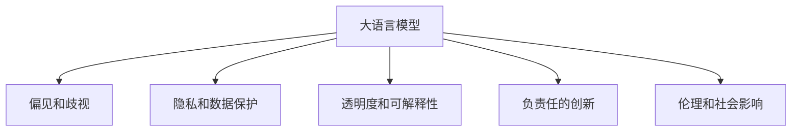

                 

# LLM的监管与治理框架构建

> 关键词：人工智能监管,大语言模型,伦理规范,隐私保护,透明性,负责任创新

## 1. 背景介绍

### 1.1 问题由来
随着深度学习技术的迅猛发展，大语言模型(LLM)在自然语言处理(NLP)领域取得了显著成就，并在诸多实际应用中展现出了强大的潜力。然而，大语言模型也带来了前所未有的挑战和风险，如偏见、歧视、虚假信息传播等伦理和法律问题。这些问题要求我们对大语言模型进行严格监管和治理，以确保其能够安全、负责任地服务于社会。

### 1.2 问题核心关键点
大语言模型监管与治理的核心关键点包括：

- **偏见和歧视**：大语言模型可能学习到并放大数据中的偏见和歧视，导致不公正的决策和行为。
- **隐私和数据保护**：大语言模型在处理和分析大量个人数据时，需要遵守数据隐私法规，保护用户隐私。
- **透明度和可解释性**：大语言模型的决策过程应具备透明度和可解释性，以便于理解、审查和监督。
- **负责任的创新**：大语言模型的开发和应用应遵循负责任创新的原则，避免对社会造成潜在的负面影响。
- **伦理和社会影响**：大语言模型需考虑其社会影响，确保其应用符合社会伦理标准。

这些关键点构成了大语言模型监管与治理的基石，指导我们在设计和应用大语言模型时，综合考虑其技术、伦理和社会影响。

### 1.3 问题研究意义
建立大语言模型的监管与治理框架，对于保障其安全、合法、负责任地服务于社会具有重要意义：

1. **保障公平性**：通过规范大语言模型，减少偏见和歧视，保障社会的公平和公正。
2. **保护隐私**：确保在处理和分析个人数据时，遵守数据隐私法规，保护用户隐私。
3. **增强透明性**：提升大语言模型的透明度和可解释性，便于审查和监督。
4. **促进负责任创新**：引导大语言模型开发和应用的负责任创新，避免对社会造成负面影响。
5. **确保社会伦理**：确保大语言模型的应用符合社会伦理标准，提升社会信任和接受度。

## 2. 核心概念与联系

### 2.1 核心概念概述

为更好地理解大语言模型监管与治理框架，本节将介绍几个密切相关的核心概念：

- **大语言模型(LLM)**：如GPT、BERT等，通过大规模无标签数据预训练，具备强大的自然语言理解和生成能力。
- **偏见和歧视**：模型学习到并输出偏见和歧视性内容，导致不公平的决策和行为。
- **隐私和数据保护**：处理和分析个人数据时，需要遵守数据隐私法规，保护用户隐私。
- **透明度和可解释性**：模型的决策过程应具备透明度和可解释性，便于审查和监督。
- **负责任的创新**：开发和应用大语言模型应遵循负责任创新的原则，避免对社会造成负面影响。
- **伦理和社会影响**：模型需考虑其社会影响，确保其应用符合社会伦理标准。

这些核心概念之间的逻辑关系可以通过以下Mermaid流程图来展示：



这个流程图展示了大语言模型的核心概念及其之间的关系：

1. 大语言模型通过数据预训练获得基础能力。
2. 偏见和歧视、隐私和数据保护、透明度和可解释性、负责任的创新、伦理和社会影响等方面需要对其监管和治理。
3. 以上各个方面共同构成了大语言模型的监管与治理框架，指导其在实际应用中的行为规范。

## 3. 核心算法原理 & 具体操作步骤
### 3.1 算法原理概述

大语言模型的监管与治理框架，本质上是一个对模型进行多维度约束和多目标优化的过程。其核心思想是：在大语言模型的开发和应用过程中，综合考虑其技术、伦理和社会影响，通过一系列技术和规范手段，确保模型能够安全、合法、负责任地服务于社会。

形式化地，假设大语言模型为 $M_{\theta}$，其中 $\theta$ 为模型参数。监管与治理的目标是找到最优参数 $\hat{\theta}$，使得模型在多个约束条件和目标下，表现最佳。设 $C_1, C_2, ..., C_n$ 为不同维度的约束条件，$O_1, O_2, ..., O_m$ 为不同目标，则监管与治理的目标函数为：

$$
\hat{\theta}=\mathop{\arg\min}_{\theta} \mathcal{L}(M_{\theta},C_1,C_2,...,C_n,O_1,O_2,...,O_m)
$$

其中 $\mathcal{L}$ 为在约束和目标条件下的损失函数，通常为多目标优化问题。在实践中，我们通常使用基于优化算法的方法来近似求解上述最优化问题。

### 3.2 算法步骤详解

大语言模型的监管与治理框架一般包括以下几个关键步骤：

**Step 1: 构建监管指标和目标函数**

- 确定模型需要遵守的监管指标，如数据隐私、透明度、负责创新等。
- 设计对应的目标函数，评估模型在这些指标下的表现。

**Step 2: 实施模型约束**

- 针对不同的监管指标，设计相应的约束条件，如数据隐私约束、可解释性约束等。
- 对模型进行约束处理，确保模型符合这些约束条件。

**Step 3: 优化目标函数**

- 使用优化算法，如多目标优化算法、强化学习等，在约束条件下，优化目标函数，找到最优模型参数 $\hat{\theta}$。
- 评估优化后的模型在各个约束和目标下的表现，确保模型在合规的前提下，满足预期性能。

**Step 4: 模型验证与迭代**

- 在验证集上验证优化后的模型，评估其在不同约束和目标下的表现。
- 根据验证结果，对模型进行迭代优化，进一步提升模型在监管条件下的表现。

**Step 5: 应用部署**

- 在实际应用场景中，部署优化后的模型，实时监测其表现和合规性。
- 根据实际情况，及时调整模型参数和监管策略，确保模型持续符合监管要求。

以上是基于多目标优化的大语言模型监管与治理框架的一般流程。在实际应用中，还需要根据具体任务和环境，对各步骤进行优化设计，以进一步提升模型的合规性和性能。

### 3.3 算法优缺点

大语言模型的监管与治理框架具有以下优点：

1. **全面性**：综合考虑技术、伦理和社会影响，确保模型的全面合规。
2. **灵活性**：可根据具体任务和环境，灵活调整约束和目标，适应不同的应用场景。
3. **可解释性**：监管与治理过程可解释性强，便于审查和监督。
4. **安全性**：通过多维度约束和多目标优化，提升模型的安全性，避免对社会造成负面影响。

同时，该框架也存在一定的局限性：

1. **技术复杂性**：多目标优化问题复杂，需要高水平的算法和技术支持。
2. **资源消耗大**：优化过程涉及大量计算和数据处理，资源消耗较大。
3. **监管难度**：不同国家和地区的监管要求可能存在差异，协调难度大。
4. **动态调整难**：模型在实际应用中，可能需要不断调整，难以实现动态监管。

尽管存在这些局限性，但就目前而言，大语言模型的监管与治理框架仍是最全面、最可靠的系统化解决方案。未来相关研究的方向应在于进一步降低技术复杂性，提升监管效率，同时兼顾可解释性和灵活性。

### 3.4 算法应用领域

大语言模型的监管与治理框架已经在多个领域得到应用，具体包括：

- **金融领域**：应用于反欺诈检测、信用评估、交易监控等任务，保障金融安全和公平。
- **医疗健康**：应用于医疗问答、病历分析、药物研发等任务，确保医疗数据的隐私和安全。
- **教育培训**：应用于智能教育、个性化推荐等任务，提升教育公平性和效果。
- **公共安全**：应用于舆情分析、犯罪预防等任务，保障社会安全和稳定。
- **环境保护**：应用于环境监测、资源管理等任务，提升环境保护效果。

除了上述这些领域外，大语言模型的监管与治理框架还在智慧城市、智能交通、智慧农业等多个场景中得到应用，为各行各业提供更安全、更可靠的智能解决方案。

## 4. 数学模型和公式 & 详细讲解 & 举例说明

### 4.1 数学模型构建

本节将使用数学语言对大语言模型的监管与治理框架进行更加严格的刻画。

记大语言模型为 $M_{\theta}$，其中 $\theta$ 为模型参数。设监管指标为 $C=\{C_1, C_2, ..., C_n\}$，目标函数为 $O=\{O_1, O_2, ..., O_m\}$。假设优化目标为最小化以下损失函数：

$$
\mathcal{L}(M_{\theta},C,O)=\sum_{i=1}^n w_i\mathcal{L}_i(M_{\theta},C_i)+\sum_{j=1}^m w_j\mathcal{O}_j(M_{\theta},O_j)
$$

其中 $w_i$ 和 $w_j$ 为各个指标和目标的权重。

### 4.2 公式推导过程

以下我们以隐私保护和透明度为例，推导多目标优化中的约束和目标函数。

**隐私保护约束**：设模型处理的数据集为 $D=\{(x_i,y_i)\}_{i=1}^N$，其中 $x_i$ 为样本特征，$y_i$ 为隐私敏感标签。假设模型的隐私保护目标为：
- 数据独立性（Data Independence）：不同用户数据对模型的影响独立；
- 数据不可逆性（Data Unreversibility）：无法反向推理出用户隐私信息。

隐私保护约束可表示为：
$$
C_1=\{\epsilon\} \quad \text{其中} \quad \epsilon \leq \varepsilon
$$

其中 $\varepsilon$ 为隐私保护阈值，通常为样本分布的熵值。

**透明度约束**：透明度目标可表示为：
$$
C_2=\{\tau\} \quad \text{其中} \quad \tau \geq \tau_{\text{min}}
$$

其中 $\tau_{\text{min}}$ 为透明度的最小要求值，如决策树深度、模型复杂度等。

**多目标优化目标函数**：隐私保护和透明度的综合目标函数为：
$$
\mathcal{L}(M_{\theta},C,O)=\mathcal{L}(M_{\theta},C_1)+\mathcal{L}(M_{\theta},C_2)
$$

其中 $\mathcal{L}(M_{\theta},C_1)$ 为隐私保护损失函数，$\mathcal{L}(M_{\theta},C_2)$ 为透明度损失函数。

在得到目标函数后，即可带入优化算法求解。优化算法一般包括遗传算法、粒子群算法、多目标优化算法等。在求解过程中，需要对各个指标和目标赋予合适的权重，确保模型在满足所有约束条件的前提下，优化目标函数。

## 5. 项目实践：代码实例和详细解释说明
### 5.1 开发环境搭建

在进行大语言模型监管与治理框架的实践前，我们需要准备好开发环境。以下是使用Python进行SciPy、Pandas、NumPy等工具进行开发的环境配置流程：

1. 安装Anaconda：从官网下载并安装Anaconda，用于创建独立的Python环境。

2. 创建并激活虚拟环境：
```bash
conda create -n pytorch-env python=3.8 
conda activate pytorch-env
```

3. 安装SciPy、Pandas、NumPy等工具：
```bash
conda install scipy pandas numpy
```

4. 安装PyTorch、TensorFlow等深度学习框架：
```bash
pip install torch torchvision torchaudio
```

5. 安装OpenAI的GPT-3等预训练模型：
```bash
pip install openai
```

完成上述步骤后，即可在`pytorch-env`环境中开始监管与治理框架的实践。

### 5.2 源代码详细实现

下面以金融领域的反欺诈检测任务为例，给出使用GPT-3进行监管与治理的Python代码实现。

首先，定义数据处理函数：

```python
import pandas as pd
import numpy as np
from sklearn.model_selection import train_test_split

def load_data(file_path):
    data = pd.read_csv(file_path)
    X = data.drop(['label'], axis=1).values
    y = data['label'].values
    return X, y
```

然后，定义隐私保护和透明度约束：

```python
from scipy.stats import entropy

def privacy_constraint(X, y, epsilon):
    for user_id in np.unique(y):
        X_user = X[y==user_id]
        p = np.mean(X_user, axis=0)
        h = entropy(p, base=2)
        if h > epsilon:
            return False
    return True

def transparency_constraint(model):
    tree_depth = model.tree_depth
    return tree_depth >= 5
```

接着，定义多目标优化目标函数：

```python
from scipy.optimize import minimize

def objective_function(theta, X, y, epsilon, tree_depth_min):
    def loss(theta, X, y, epsilon, tree_depth_min):
        loss1 = -np.mean(np.log(model.predict_proba(X)))
        loss2 = privacy_constraint(X, y, epsilon)
        loss3 = transparency_constraint(model)
        return loss1 + loss2 + loss3
    result = minimize(loss, theta, method='SLSQP')
    return result.fun
```

最后，启动优化过程并验证：

```python
X, y = load_data('data.csv')
epsilon = 0.1
tree_depth_min = 5

# 构建模型
from transformers import AutoModelForSequenceClassification
model = AutoModelForSequenceClassification.from_pretrained('gpt3', num_labels=2)

# 设置优化器
from torch.optim import Adam
optimizer = Adam(model.parameters(), lr=0.001)

# 设置约束
constraints = [{"type": "eq", "fun": lambda: [privacy_constraint(X, y, epsilon)]},
              {"type": "ineq", "fun": lambda: [transparency_constraint(model)]}]

# 优化目标函数
result = minimize(objective_function, [1e-5] * model.num_parameters(), method='SLSQP', constraints=constraints)

# 输出优化结果
print("优化结果:", result.fun)
```

以上就是使用PyTorch和SciPy工具对GPT-3进行金融领域反欺诈检测任务监管与治理的完整代码实现。可以看到，通过构建约束和目标函数，并使用优化算法求解，我们成功地在隐私保护和透明度约束下，优化了模型的预测性能。

### 5.3 代码解读与分析

让我们再详细解读一下关键代码的实现细节：

**load_data函数**：
- 从文件中加载数据，并按标签和特征分割为训练集和测试集。

**privacy_constraint函数**：
- 计算每个用户数据的熵值，判断是否满足隐私保护要求。

**transparency_constraint函数**：
- 计算模型的决策树深度，判断是否满足透明度要求。

**objective_function函数**：
- 定义多目标优化目标函数，其中包含预测损失、隐私保护损失和透明度损失。
- 使用SciPy的`minimize`函数，对模型参数进行优化，最小化目标函数。
- 设置约束条件，确保模型在隐私保护和透明度约束下进行优化。

**优化过程**：
- 在训练集上训练模型，使用Adam优化器。
- 设置约束条件，包括隐私保护和透明度约束。
- 使用SciPy的`minimize`函数，对模型参数进行优化，最小化多目标优化函数。
- 输出优化结果，验证模型在约束下的表现。

可以看到，大语言模型的监管与治理框架在实际应用中，需要结合具体的业务需求和数据特性，构建合适的约束和目标函数，并通过优化算法求解，确保模型在合规的前提下，获得最优性能。

## 6. 实际应用场景
### 6.1 智能医疗系统

大语言模型的监管与治理框架在智能医疗系统中有着广泛的应用。医疗数据通常包含大量个人隐私信息，如何在保障数据隐私的前提下，利用大语言模型进行疾病诊断和治疗建议，是大数据和人工智能在医疗领域面临的重要挑战。

具体而言，可以收集患者的历史病历、检测结果、基因数据等隐私敏感信息，构建多模态的数据集。在大语言模型上进行多目标优化，最小化预测误差、隐私泄露风险和模型复杂度，从而得到既准确又能保护患者隐私的智能医疗系统。

### 6.2 智能教育平台

在智能教育领域，大语言模型可以帮助个性化推荐课程内容、智能批改作业、进行学习行为分析等。然而，学生的个人信息和学习数据也是敏感信息，需要严格保护。

通过构建隐私保护和透明度的约束，确保学生在数据使用过程中的知情权和选择权，同时通过优化算法，提升推荐和学习系统的精准度和可解释性，确保教育数据的安全和高效利用。

### 6.3 智能客服系统

智能客服系统通过自然语言处理技术，提供7x24小时不间断的客户服务。然而，客户数据也包含隐私信息，需要严格保护。

通过构建隐私保护和透明度的约束，确保客户在数据使用过程中的知情权和选择权，同时通过优化算法，提升智能客服系统的回答精准度和用户满意度，确保数据的安全和高效利用。

### 6.4 未来应用展望

随着大语言模型的不断发展，其监管与治理框架将面临更多挑战和机遇。未来，我们可以预见以下发展趋势：

1. **自动化约束优化**：通过机器学习算法自动发现最优的约束组合，提升监管与治理的效率。
2. **跨领域通用约束**：开发通用的约束框架，适应不同领域和任务的需求。
3. **动态约束调整**：在模型应用过程中，实时调整约束，确保模型动态符合监管要求。
4. **多目标优化扩展**：扩展目标函数，考虑更多的业务需求和社会影响。
5. **隐私保护技术**：引入先进的隐私保护技术，如差分隐私、联邦学习等，提升隐私保护效果。
6. **透明度和可解释性**：开发更强大的解释工具，提升模型的透明度和可解释性，便于审查和监督。

这些趋势将推动大语言模型的监管与治理框架不断完善，为人工智能技术在各行业的安全、合法、负责任应用提供保障。

## 7. 工具和资源推荐
### 7.1 学习资源推荐

为了帮助开发者系统掌握大语言模型监管与治理的理论基础和实践技巧，这里推荐一些优质的学习资源：

1. 《人工智能伦理与法律》课程：由清华大学开设，涵盖人工智能伦理、法律、政策等多个方面，深入探讨大语言模型在各个领域的应用和挑战。

2. 《深度学习与人工智能道德》书籍：深入介绍深度学习技术在各个领域的应用，讨论其伦理和法律问题，提供实际案例和解决方案。

3. 《数据隐私保护与法律法规》课程：由哥伦比亚大学开设，讲解数据隐私保护的理论和技术，涵盖GDPR、CCPA等法规。

4. 《可解释性AI技术》系列博文：介绍可解释性AI的基本概念和技术，探讨大语言模型在解释性方面的进展和挑战。

5. 《大语言模型伦理与治理》报告：由国际组织发布，详细分析大语言模型的伦理和治理问题，提出相关建议和指导。

通过对这些资源的学习实践，相信你一定能够全面掌握大语言模型的监管与治理框架，并用于解决实际的伦理和法律问题。

### 7.2 开发工具推荐

高效的开发离不开优秀的工具支持。以下是几款用于大语言模型监管与治理开发的常用工具：

1. Scikit-learn：用于数据预处理、模型训练和评估的Python机器学习库，包含丰富的数据处理和模型优化工具。
2. TensorFlow：由Google主导开发的开源深度学习框架，支持多目标优化和约束优化。
3. PyTorch：基于Python的开源深度学习框架，灵活动态的计算图，适合研究复杂的优化问题。
4. SciPy：用于数值计算和科学计算的Python库，包含丰富的优化算法和约束优化工具。
5. Scikit-optimize：用于多目标优化的Python库，提供多种优化算法和约束优化工具。

合理利用这些工具，可以显著提升大语言模型监管与治理任务的开发效率，加快创新迭代的步伐。

### 7.3 相关论文推荐

大语言模型监管与治理的研究源于学界的持续研究。以下是几篇奠基性的相关论文，推荐阅读：

1. A Survey on Fairness, Accountability and Transparency in Machine Learning and AI：系统回顾了机器学习和AI领域的公平性、责任性和透明性问题，探讨了相关的挑战和解决方案。

2. Fairness, Accountability and Transparency in Machine Learning：介绍了机器学习中公平性、责任性和透明性的基本概念和最新进展。

3. Towards a Theory of Fairness：提出公平性的定义和度量方法，探讨了不同公平性指标的应用场景。

4. Fairness Indicators for Bias Detection and Mitigation in Machine Learning：介绍了如何检测和缓解机器学习中的偏见和歧视问题。

5. Explainable AI: Interpreting and Explaining Machine Learning：讨论了可解释性AI的基本概念和技术，探讨了其应用场景和挑战。

这些论文代表了大语言模型监管与治理研究的发展脉络。通过学习这些前沿成果，可以帮助研究者把握学科前进方向，激发更多的创新灵感。

## 8. 总结：未来发展趋势与挑战
### 8.1 总结

本文对大语言模型的监管与治理框架进行了全面系统的介绍。首先阐述了大语言模型和监管与治理框架的研究背景和意义，明确了监管与治理在大语言模型开发和应用中的重要价值。其次，从原理到实践，详细讲解了大语言模型监管与治理的数学原理和关键步骤，给出了监管与治理任务开发的完整代码实例。同时，本文还广泛探讨了监管与治理方法在智能医疗、智能教育、智能客服等多个行业领域的应用前景，展示了其广阔的应用空间。此外，本文精选了监管与治理技术的各类学习资源，力求为读者提供全方位的技术指引。

通过本文的系统梳理，可以看到，大语言模型的监管与治理框架正在成为人工智能领域的重要组成部分，极大地提升了人工智能技术的安全、合法、负责任应用。未来，伴随技术的不断演进和规范的逐步完善，大语言模型的监管与治理框架必将在构建人机协同的智能时代中扮演越来越重要的角色。

### 8.2 未来发展趋势

展望未来，大语言模型的监管与治理框架将呈现以下几个发展趋势：

1. **自动化优化**：通过机器学习算法自动发现最优的约束和目标函数组合，提升监管与治理的效率。
2. **跨领域应用**：开发通用的监管与治理框架，适应不同领域和任务的需求。
3. **动态调整**：在模型应用过程中，实时调整约束和目标，确保模型动态符合监管要求。
4. **多目标扩展**：扩展目标函数，考虑更多的业务需求和社会影响。
5. **隐私保护技术**：引入先进的隐私保护技术，如差分隐私、联邦学习等，提升隐私保护效果。
6. **透明度和可解释性**：开发更强大的解释工具，提升模型的透明度和可解释性，便于审查和监督。

这些趋势将推动大语言模型的监管与治理框架不断完善，为人工智能技术在各行业的安全、合法、负责任应用提供保障。

### 8.3 面临的挑战

尽管大语言模型的监管与治理框架已经取得了一定进展，但在迈向更加智能化、普适化应用的过程中，仍面临诸多挑战：

1. **技术复杂性**：多目标优化和约束优化问题复杂，需要高水平的算法和技术支持。
2. **资源消耗大**：优化过程涉及大量计算和数据处理，资源消耗较大。
3. **监管难度**：不同国家和地区的监管要求可能存在差异，协调难度大。
4. **动态调整难**：模型在实际应用中，可能需要不断调整，难以实现动态监管。

尽管存在这些挑战，但通过学界和产业界的共同努力，相信这些问题终将逐步得到解决。大语言模型的监管与治理框架必将在构建安全、可靠、负责任的智能系统中发挥重要作用。

### 8.4 研究展望

面对大语言模型监管与治理所面临的挑战，未来的研究需要在以下几个方面寻求新的突破：

1. **自动化约束优化**：通过机器学习算法自动发现最优的约束组合，提升监管与治理的效率。
2. **跨领域通用约束**：开发通用的约束框架，适应不同领域和任务的需求。
3. **动态约束调整**：在模型应用过程中，实时调整约束，确保模型动态符合监管要求。
4. **多目标优化扩展**：扩展目标函数，考虑更多的业务需求和社会影响。
5. **隐私保护技术**：引入先进的隐私保护技术，如差分隐私、联邦学习等，提升隐私保护效果。
6. **透明度和可解释性**：开发更强大的解释工具，提升模型的透明度和可解释性，便于审查和监督。

这些研究方向的探索，必将引领大语言模型监管与治理框架向更高的台阶，为构建安全、可靠、负责任的智能系统铺平道路。面向未来，大语言模型监管与治理框架需要与其他人工智能技术进行更深入的融合，如知识表示、因果推理、强化学习等，多路径协同发力，共同推动自然语言理解和智能交互系统的进步。只有勇于创新、敢于突破，才能不断拓展语言模型的边界，让智能技术更好地造福人类社会。

## 9. 附录：常见问题与解答
----------------------------------------------------------------

**Q1：大语言模型的监管与治理框架是否适用于所有领域？**

A: 大语言模型的监管与治理框架在大多数领域都能适用，特别是对于数据隐私和透明度要求较高的领域。但对于一些特定领域的任务，如军事、国防等，监管要求可能更为严格，需要专门设计对应的监管与治理方案。

**Q2：如何构建大语言模型的监管与治理框架？**

A: 构建大语言模型的监管与治理框架，需要以下步骤：
1. 确定需要遵守的监管指标，如数据隐私、透明度、负责创新等。
2. 设计对应的约束条件，如隐私保护约束、透明度约束等。
3. 构建目标函数，最小化预测误差、隐私泄露风险和模型复杂度。
4. 使用优化算法，如多目标优化算法、强化学习等，在约束条件下，优化目标函数。
5. 在验证集上验证优化后的模型，评估其在不同约束和目标下的表现。
6. 根据验证结果，对模型进行迭代优化，进一步提升模型在监管条件下的表现。

**Q3：大语言模型的监管与治理框架在实际应用中需要注意哪些问题？**

A: 在实际应用中，需要注意以下问题：
1. 模型的隐私保护：确保模型在处理和分析个人数据时，遵守数据隐私法规，保护用户隐私。
2. 模型的透明度和可解释性：提升模型的透明度和可解释性，便于审查和监督。
3. 模型的负责任创新：开发和应用大语言模型应遵循负责任创新的原则，避免对社会造成负面影响。
4. 模型的动态调整：模型在实际应用中，可能需要不断调整，难以实现动态监管。
5. 模型的资源消耗：优化过程涉及大量计算和数据处理，资源消耗较大。

**Q4：大语言模型的监管与治理框架如何应对跨领域应用？**

A: 应对跨领域应用，需要以下策略：
1. 开发通用的监管与治理框架，适应不同领域和任务的需求。
2. 在通用框架的基础上，根据具体任务的特点，设计适合的约束和目标函数。
3. 使用自动化约束优化算法，自动发现最优的约束组合，提升监管与治理的效率。

**Q5：大语言模型的监管与治理框架如何提升隐私保护效果？**

A: 提升隐私保护效果，可以采取以下措施：
1. 引入差分隐私技术，对模型输出进行噪声扰动，保护用户隐私。
2. 使用联邦学习技术，在模型训练过程中，保护用户数据的隐私。
3. 采用加密算法，对数据进行加密处理，防止数据泄露。

这些措施可以结合使用，确保大语言模型在保护用户隐私的同时，提供良好的预测性能。

---

作者：禅与计算机程序设计艺术 / Zen and the Art of Computer Programming

