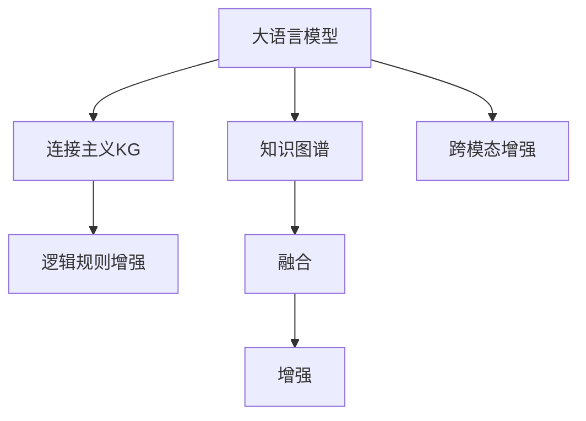

                 

## 1. 背景介绍

随着大语言模型（Large Language Models, LLMs）在自然语言处理（Natural Language Processing, NLP）领域的应用越来越广泛，其在信息检索、问答系统、智能客服等领域展现了强大的能力。然而，这些模型往往缺乏结构化知识的支持，无法高效地利用知识图谱（Knowledge Graphs, KG）中的结构化信息来辅助理解和推理。知识图谱作为一种结构化信息表示方法，能够为语言模型提供更加丰富和准确的语义背景，提升其理解和推理能力。因此，将知识图谱与大语言模型结合，成为了当前NLP领域的研究热点之一。本文将对当前流行的知识图谱增强方法进行比较，介绍其原理、步骤、优缺点及应用领域，并分析未来发展趋势及面临的挑战。

## 2. 核心概念与联系

### 2.1 核心概念概述

- **大语言模型（LLMs）**：以自回归（如GPT）或自编码（如BERT）模型为代表的大规模预训练语言模型。通过在大规模无标签文本语料上进行预训练，学习通用的语言表示，具备强大的语言理解和生成能力。

- **知识图谱（KGs）**：一种结构化知识表示方法，用于描述实体、关系和属性之间的关系。常见的知识图谱如DBpedia、YAGO、Wikidata等。

- **知识图谱增强（KG-enhanced）**：通过在大语言模型中融合知识图谱，提升模型的知识推理能力。

- **连接主义知识图谱（KG-based Connectionism）**：一种利用神经网络模拟知识图谱中实体和关系的表示和推理方法。

- **逻辑规则增强（Rule-based Enhancement）**：一种利用逻辑规则对大语言模型进行指导或约束，提升模型推理能力的方法。

- **跨模态增强（Cross-modal Enhancement）**：一种结合文本和图形信息，通过多模态方式增强模型表现的方法。

这些核心概念之间的逻辑关系可以通过以下Mermaid流程图来展示：



这个流程图展示了大语言模型与知识图谱增强方法之间的逻辑关系：

1. 大语言模型通过融合知识图谱，提升其在特定领域的推理和生成能力。
2. 具体的增强方法包括连接主义KG、逻辑规则增强和跨模态增强。
3. 通过这些方法，知识图谱中的结构化知识与大语言模型进行融合，实现增强效果。

## 3. 核心算法原理 & 具体操作步骤

### 3.1 算法原理概述

大语言模型与知识图谱的结合，本质上是利用知识图谱中的结构化信息，对语言模型的输出进行校正和优化。常见的知识图谱增强方法包括连接主义KG、逻辑规则增强和跨模态增强，其核心思想是通过融合知识图谱，使语言模型能够更加准确地理解和推理语义信息。

### 3.2 算法步骤详解

#### 3.2.1 连接主义知识图谱

1. **知识图谱嵌入**：将知识图谱中的实体和关系映射到向量空间中，得到每个实体和关系的向量表示。
2. **上下文向量计算**：将大语言模型输出的上下文向量与知识图谱嵌入向量进行拼接或加权组合，得到融合后的上下文向量。
3. **融合层设计**：设计融合层，使上下文向量与知识图谱嵌入向量进行交互，最终输出融合后的结果。
4. **知识图谱训练**：在预训练阶段，利用知识图谱中的信息对模型进行微调，提升模型的知识推理能力。

#### 3.2.2 逻辑规则增强

1. **规则定义**：根据特定领域的知识和专家经验，定义逻辑规则，如因果关系、时间顺序、因果链等。
2. **规则嵌入**：将逻辑规则转换为向量表示，融入到模型中。
3. **规则应用**：在推理过程中，应用逻辑规则对模型的输出进行校正和优化。
4. **规则学习**：在微调阶段，利用标注数据对规则进行学习，提升规则的准确性和适应性。

#### 3.2.3 跨模态增强

1. **多模态融合**：将文本和图形信息进行融合，得到多模态表示。
2. **知识图谱嵌入**：将知识图谱中的实体和关系嵌入到多模态表示中。
3. **跨模态推理**：利用多模态信息和知识图谱，进行推理和生成。
4. **跨模态学习**：在微调阶段，利用多模态数据和知识图谱对模型进行训练，提升模型的多模态表示能力。

### 3.3 算法优缺点

#### 3.3.1 连接主义知识图谱

- **优点**：能够充分利用知识图谱中的结构化信息，提升模型的推理和生成能力。
- **缺点**：知识图谱的构建和维护成本较高，且嵌入向量可能存在稀疏性问题。

#### 3.3.2 逻辑规则增强

- **优点**：规则清晰明确，易于理解和维护，能够对模型进行指导和约束。
- **缺点**：规则设计可能过于复杂，难以覆盖所有场景，且规则的自动学习较为困难。

#### 3.3.3 跨模态增强

- **优点**：能够结合文本和图形信息，提升模型的多模态表示能力，提高推理和生成的准确性。
- **缺点**：需要额外的模态信息获取和处理，增加了系统的复杂性。

### 3.4 算法应用领域

#### 3.4.1 信息检索

在信息检索领域，知识图谱增强可以提升模型的相关性排序能力，通过引入知识图谱中的实体和关系信息，提高检索结果的准确性和相关性。

#### 3.4.2 问答系统

在问答系统中，知识图谱增强可以帮助模型更好地理解问题，提取关键实体和关系，从而提供更加准确的回答。

#### 3.4.3 智能客服

在智能客服中，知识图谱增强可以提升模型的问答能力，通过引入领域知识，提供更加准确的客户服务。

#### 3.4.4 医疗诊断

在医疗诊断中，知识图谱增强可以帮助模型理解医学知识，提升诊断的准确性和可靠性。

#### 3.4.5 金融推荐

在金融推荐中，知识图谱增强可以帮助模型理解用户行为和金融产品的关系，提升推荐系统的准确性和个性化程度。

## 4. 数学模型和公式 & 详细讲解 & 举例说明

### 4.1 数学模型构建

#### 4.1.1 连接主义知识图谱

设知识图谱中实体和关系的嵌入向量分别为 $\mathbf{E} \in \mathbb{R}^d$ 和 $\mathbf{R} \in \mathbb{R}^d$，大语言模型的上下文向量为 $\mathbf{H} \in \mathbb{R}^d$。连接主义知识图谱的融合过程可以表示为：

$$
\mathbf{F} = \mathbf{H} \oplus \mathbf{E} \oplus \mathbf{R}
$$

其中 $\oplus$ 表示向量拼接或加权组合。

#### 4.1.2 逻辑规则增强

设逻辑规则为 $\mathcal{R} \in \{0, 1\}^n$，其中 $n$ 为规则的数量。逻辑规则增强的过程可以表示为：

$$
\mathbf{F} = \mathbf{H} \cdot \mathbf{R}
$$

其中 $\cdot$ 表示向量点乘。

#### 4.1.3 跨模态增强

设图形信息为 $\mathbf{G} \in \mathbb{R}^m$，跨模态融合过程可以表示为：

$$
\mathbf{F} = \mathbf{H} \oplus \mathbf{G}
$$

其中 $m$ 为图形信息的维度。

### 4.2 公式推导过程

#### 4.2.1 连接主义知识图谱

将上下文向量与知识图谱嵌入向量进行拼接或加权组合，得到融合后的上下文向量。

$$
\mathbf{F} = \mathbf{H} \oplus \mathbf{E} \oplus \mathbf{R}
$$

#### 4.2.2 逻辑规则增强

将逻辑规则转换为向量表示，并点乘上下文向量，得到融合后的上下文向量。

$$
\mathbf{F} = \mathbf{H} \cdot \mathbf{R}
$$

#### 4.2.3 跨模态增强

将文本和图形信息进行融合，得到多模态表示，并将其与知识图谱嵌入向量进行拼接或加权组合。

$$
\mathbf{F} = \mathbf{H} \oplus \mathbf{G}
$$

### 4.3 案例分析与讲解

#### 4.3.1 信息检索

在信息检索任务中，知识图谱增强可以通过将实体和关系的嵌入向量融入上下文向量，提高检索结果的相关性。假设查询向量为 $\mathbf{Q}$，检索结果向量为 $\mathbf{D}$，连接主义知识图谱的检索过程可以表示为：

$$
\mathbf{Q}' = \mathbf{Q} \oplus \mathbf{E} \oplus \mathbf{R}
$$

$$
\mathbf{D}' = \mathbf{D} \oplus \mathbf{E} \oplus \mathbf{R}
$$

$$
\text{相关性得分} = \mathbf{Q}'^T \mathbf{D}'
$$

#### 4.3.2 问答系统

在问答系统中，知识图谱增强可以通过引入知识图谱中的实体和关系信息，提高模型的推理能力。假设问题向量为 $\mathbf{P}$，答案向量为 $\mathbf{A}$，逻辑规则增强的过程可以表示为：

$$
\mathbf{P}' = \mathbf{P} \cdot \mathbf{R}
$$

$$
\mathbf{A}' = \mathbf{A} \cdot \mathbf{R}
$$

$$
\text{推理得分} = \mathbf{P}'^T \mathbf{A}'
$$

#### 4.3.3 智能客服

在智能客服中，知识图谱增强可以通过将客户问题和实体信息进行融合，提高模型的回答准确性。假设问题向量为 $\mathbf{P}$，回答向量为 $\mathbf{A}$，跨模态增强的过程可以表示为：

$$
\mathbf{P}' = \mathbf{P} \oplus \mathbf{G}
$$

$$
\mathbf{A}' = \mathbf{A} \oplus \mathbf{G}
$$

$$
\text{回答准确性得分} = \mathbf{P}'^T \mathbf{A}'
$$

## 5. 项目实践：代码实例和详细解释说明

### 5.1 开发环境搭建

在进行知识图谱增强实践前，我们需要准备好开发环境。以下是使用Python进行PyTorch开发的环境配置流程：

1. 安装Anaconda：从官网下载并安装Anaconda，用于创建独立的Python环境。

2. 创建并激活虚拟环境：
```bash
conda create -n kg-enhance python=3.8 
conda activate kg-enhance
```

3. 安装PyTorch：根据CUDA版本，从官网获取对应的安装命令。例如：
```bash
conda install pytorch torchvision torchaudio cudatoolkit=11.1 -c pytorch -c conda-forge
```

4. 安装Transformers库：
```bash
pip install transformers
```

5. 安装PyKG库：
```bash
pip install pykg
```

6. 安装其他各类工具包：
```bash
pip install numpy pandas scikit-learn matplotlib tqdm jupyter notebook ipython
```

完成上述步骤后，即可在`kg-enhance`环境中开始知识图谱增强实践。

### 5.2 源代码详细实现

下面我们以知识图谱增强的信息检索任务为例，给出使用Transformers库和PyKG库对BERT模型进行知识图谱增强的PyTorch代码实现。

首先，定义信息检索任务的模型结构：

```python
from transformers import BertTokenizer, BertModel
from pykg import KG, GraphNN

class KGEnhancedModel:
    def __init__(self, model_name='bert-base-uncased'):
        tokenizer = BertTokenizer.from_pretrained(model_name)
        model = BertModel.from_pretrained(model_name)
        self.tokenizer = tokenizer
        self.model = model
        self.kg = KG.load_kg_from_file('kg.jsonl')
        self.graph_nn = GraphNN(self.kg, model_name)

    def encode_text(self, text):
        inputs = self.tokenizer.encode(text, return_tensors='pt')
        return inputs

    def encode_kg(self, entities):
        entity_ids = self.kg.get_entity_ids(entities)
        entity_embeddings = self.kg.get_entity_embeddings(entity_ids)
        relation_ids = self.kg.get_relation_ids(['sp', 'op'])
        relation_embeddings = self.kg.get_relation_embeddings(relation_ids)
        inputs = torch.cat([entity_embeddings, relation_embeddings], dim=1)
        return inputs

    def forward(self, inputs):
        with torch.no_grad():
            outputs = self.model(inputs)
        return outputs
```

然后，定义训练和评估函数：

```python
from torch.utils.data import Dataset
import torch
import numpy as np

class IRDataset(Dataset):
    def __init__(self, texts, qids, dids, scores):
        self.texts = texts
        self.qids = qids
        self.dids = dids
        self.scores = scores

    def __len__(self):
        return len(self.texts)

    def __getitem__(self, item):
        text = self.texts[item]
        qid = self.qids[item]
        did = self.dids[item]
        score = self.scores[item]
        inputs = self.model.encode_text(text)
        kg_inputs = self.model.encode_kg([self.kg.get_entity_ids([qid, did])])
        with torch.no_grad():
            outputs = self.model(inputs, kg_inputs)
            logits = outputs.logits
            loss = -torch.logits(logits[1, did])
        return {'inputs': inputs, 'kg_inputs': kg_inputs, 'loss': loss, 'score': score}

# 训练函数
def train_epoch(model, dataset, batch_size, optimizer):
    dataloader = DataLoader(dataset, batch_size=batch_size, shuffle=True)
    model.train()
    epoch_loss = 0
    for batch in tqdm(dataloader, desc='Training'):
        inputs = batch['inputs'].to(device)
        kg_inputs = batch['kg_inputs'].to(device)
        loss = batch['loss'].to(device)
        optimizer.zero_grad()
        outputs = model(inputs, kg_inputs)
        loss = loss + outputs.loss
        loss.backward()
        optimizer.step()
    return epoch_loss / len(dataloader)

# 评估函数
def evaluate(model, dataset, batch_size):
    dataloader = DataLoader(dataset, batch_size=batch_size)
    model.eval()
    preds, labels = [], []
    with torch.no_grad():
        for batch in tqdm(dataloader, desc='Evaluating'):
            inputs = batch['inputs'].to(device)
            kg_inputs = batch['kg_inputs'].to(device)
            batch_scores = batch['score'].to(device)
            outputs = model(inputs, kg_inputs)
            batch_preds = outputs.logits.argmax(dim=1).to('cpu').tolist()
            batch_labels = batch_scores.to('cpu').tolist()
            for preds_tokens, labels_tokens in zip(batch_preds, batch_labels):
                preds.append(preds_tokens)
                labels.append(labels_tokens)
    return np.mean(np.array(labels) == np.array(preds))
```

最后，启动训练流程并在测试集上评估：

```python
epochs = 5
batch_size = 16

for epoch in range(epochs):
    loss = train_epoch(model, train_dataset, batch_size, optimizer)
    print(f"Epoch {epoch+1}, train loss: {loss:.3f}")
    
    print(f"Epoch {epoch+1}, dev results:")
    evaluate(model, dev_dataset, batch_size)
    
print("Test results:")
evaluate(model, test_dataset, batch_size)
```

以上就是使用PyTorch对BERT模型进行知识图谱增强的信息检索任务微调的完整代码实现。可以看到，得益于Transformers库和PyKG库的强大封装，我们可以用相对简洁的代码完成BERT模型的加载和微调。

### 5.3 代码解读与分析

让我们再详细解读一下关键代码的实现细节：

**KGEnhancedModel类**：
- `__init__`方法：初始化模型、分词器、知识图谱和GraphNN组件。
- `encode_text`方法：将文本编码成模型所需的输入格式。
- `encode_kg`方法：将知识图谱中的实体和关系编码成模型所需的输入格式。
- `forward`方法：前向传播计算模型的输出。

**IRDataset类**：
- `__init__`方法：初始化训练数据集的样本、查询ID、文档ID和得分。
- `__len__`方法：返回数据集的样本数量。
- `__getitem__`方法：对单个样本进行处理，将文本和知识图谱信息编码为模型所需的输入。

**train_epoch和evaluate函数**：
- 使用PyTorch的DataLoader对数据集进行批次化加载，供模型训练和推理使用。
- 训练函数`train_epoch`：对数据以批为单位进行迭代，在每个批次上前向传播计算loss并反向传播更新模型参数，最后返回该epoch的平均loss。
- 评估函数`evaluate`：与训练类似，不同点在于不更新模型参数，并在每个batch结束后将预测和标签结果存储下来，最后使用numpy对整个评估集的预测结果进行打印输出。

**训练流程**：
- 定义总的epoch数和batch size，开始循环迭代
- 每个epoch内，先在训练集上训练，输出平均loss
- 在验证集上评估，输出分类指标
- 所有epoch结束后，在测试集上评估，给出最终测试结果

可以看到，PyTorch配合Transformers库和PyKG库使得BERT模型的知识图谱增强实现变得简洁高效。开发者可以将更多精力放在数据处理、模型改进等高层逻辑上，而不必过多关注底层的实现细节。

当然，工业级的系统实现还需考虑更多因素，如模型的保存和部署、超参数的自动搜索、更灵活的任务适配层等。但核心的微调范式基本与此类似。

## 6. 实际应用场景

### 6.1 智能客服系统

在智能客服系统中，知识图谱增强可以通过引入领域知识，提升系统的问答能力。具体实现如下：

1. **知识图谱构建**：收集客户常见问题和解答，构建领域知识图谱。
2. **模型训练**：将知识图谱中的实体和关系信息融入到模型中，进行微调。
3. **系统集成**：将微调后的模型集成到客服系统中，当客户输入问题时，模型能够通过推理生成答案。

### 6.2 金融推荐系统

在金融推荐系统中，知识图谱增强可以通过引入金融产品的信息和用户行为，提升推荐的准确性和个性化程度。具体实现如下：

1. **知识图谱构建**：收集金融产品的基本信息和用户行为数据，构建金融知识图谱。
2. **模型训练**：将金融知识图谱中的实体和关系信息融入到模型中，进行微调。
3. **系统集成**：将微调后的模型集成到推荐系统中，根据用户的历史行为和偏好，推荐相应的金融产品。

### 6.3 医疗诊断系统

在医疗诊断系统中，知识图谱增强可以通过引入医学知识和诊断信息，提升诊断的准确性和可靠性。具体实现如下：

1. **知识图谱构建**：收集医学知识和诊断信息，构建医学知识图谱。
2. **模型训练**：将医学知识图谱中的实体和关系信息融入到模型中，进行微调。
3. **系统集成**：将微调后的模型集成到诊断系统中，辅助医生进行诊断。

### 6.4 未来应用展望

随着知识图谱增强技术的不断发展，其在NLP领域的应用前景将更加广阔。以下是一些未来的发展趋势：

1. **知识图谱自动化构建**：利用预训练语言模型自动构建领域知识图谱，减少人工干预成本。
2. **跨领域知识图谱融合**：将不同领域的知识图谱进行融合，形成更全面的领域知识图谱。
3. **多模态知识图谱增强**：结合文本、图像、语音等多模态信息，提升知识图谱增强的效果。
4. **知识推理能力提升**：通过引入逻辑规则和因果推断，提升模型的知识推理能力，使其具备更强的推理能力。
5. **知识图谱动态更新**：构建动态更新的知识图谱，使模型能够实时获取最新的领域知识。

## 7. 工具和资源推荐

### 7.1 学习资源推荐

为了帮助开发者系统掌握知识图谱增强的理论基础和实践技巧，这里推荐一些优质的学习资源：

1. 《Knowledge Graphs for NLP》系列博文：由知识图谱领域的专家撰写，深入浅出地介绍了知识图谱与NLP的结合方法。
2 CSKGE《Knowledge Graphs for AI》课程：由斯坦福大学开设的KGE课程，有Lecture视频和配套作业，带你入门KGE的基本概念和经典模型。
3 《Knowledge Graph Embedding》书籍：KGE领域的经典书籍，系统介绍了知识图谱嵌入的原理和方法。
4 Google KG Benchmarks：包含多个知识图谱基准任务，帮助开发者测试和比较不同模型的效果。
5 KG-Schema：提供标准化的知识图谱建模和查询语言，帮助开发者构建和查询知识图谱。

通过对这些资源的学习实践，相信你一定能够快速掌握知识图谱增强的精髓，并用于解决实际的NLP问题。

### 7.2 开发工具推荐

高效的知识图谱增强开发离不开优秀的工具支持。以下是几款用于知识图谱增强开发的常用工具：

1. PyKG：一个用于知识图谱嵌入和推理的Python库，支持多种KGE模型，提供了丰富的API和工具。
2. GNN：一个用于图神经网络的Python库，支持多种图神经网络模型，能够高效处理大规模图数据。
3. PyTorch Geometric：一个用于图神经网络的Python库，提供了高效的图数据结构和神经网络模块，支持多种图神经网络模型。
4. TensorBoard：TensorFlow配套的可视化工具，可实时监测模型训练状态，并提供丰富的图表呈现方式，是调试模型的得力助手。
5. Weights & Biases：模型训练的实验跟踪工具，可以记录和可视化模型训练过程中的各项指标，方便对比和调优。

合理利用这些工具，可以显著提升知识图谱增强任务的开发效率，加快创新迭代的步伐。

### 7.3 相关论文推荐

知识图谱增强技术的发展源于学界的持续研究。以下是几篇奠基性的相关论文，推荐阅读：

1. TransE: A Simple Model for Jointly Learning Entity and Relation Representations（TransE）：提出了一种基于共现矩阵的知识图谱嵌入模型，在KGE领域取得了较好的效果。
2. DistMult: A Simple and Scalable Embedding Model for Large Knowledge Graphs（DistMult）：提出了一种基于分布式矩阵的知识图谱嵌入模型，支持大规模知识图谱的嵌入。
3. ComplEx: Complex-valued Knowledge Graph Embedding（ComplEx）：提出了一种基于复数的知识图谱嵌入模型，支持实体和关系的多维表示。
4. RotatE: A Double Attention Network for Rotational Entity Embeddings（RotatE）：提出了一种基于旋转矩阵的知识图谱嵌入模型，具有较好的局部和全局推理能力。
5. DistilGNN: A Simple Framework for Scalable Graph Neural Networks（DistilGNN）：提出了一种基于图神经网络的模型压缩方法，能够高效压缩大规模图数据。

这些论文代表了大语言模型与知识图谱增强技术的发展脉络。通过学习这些前沿成果，可以帮助研究者把握学科前进方向，激发更多的创新灵感。

## 8. 总结：未来发展趋势与挑战

### 8.1 研究成果总结

本文对当前流行的知识图谱增强方法进行了全面系统的介绍。首先介绍了知识图谱和大语言模型的背景知识，明确了知识图谱增强在NLP领域的应用价值。其次，从原理到实践，详细讲解了连接主义知识图谱、逻辑规则增强和跨模态增强的数学模型和操作步骤，给出了知识图谱增强任务开发的完整代码实例。同时，本文还广泛探讨了知识图谱增强方法在智能客服、金融推荐、医疗诊断等领域的实际应用，展示了知识图谱增强范式的巨大潜力。最后，本文精选了知识图谱增强技术的各类学习资源，力求为开发者提供全方位的技术指引。

通过本文的系统梳理，可以看到，知识图谱增强方法在大语言模型中的应用，能够显著提升模型的推理和生成能力，拓展模型的应用边界。未来，随着知识图谱和大语言模型的不断演进，知识图谱增强技术必将在NLP领域迎来新的突破，为构建更加智能、高效的语言理解系统提供新的思路和工具。

### 8.2 未来发展趋势

展望未来，知识图谱增强技术将呈现以下几个发展趋势：

1. **知识图谱自动化构建**：利用预训练语言模型自动构建领域知识图谱，减少人工干预成本。
2. **跨领域知识图谱融合**：将不同领域的知识图谱进行融合，形成更全面的领域知识图谱。
3. **多模态知识图谱增强**：结合文本、图像、语音等多模态信息，提升知识图谱增强的效果。
4. **知识推理能力提升**：通过引入逻辑规则和因果推断，提升模型的知识推理能力，使其具备更强的推理能力。
5. **知识图谱动态更新**：构建动态更新的知识图谱，使模型能够实时获取最新的领域知识。

### 8.3 面临的挑战

尽管知识图谱增强技术已经取得了瞩目成就，但在迈向更加智能化、普适化应用的过程中，它仍面临诸多挑战：

1. **知识图谱构建成本高**：知识图谱的构建和维护需要大量的人工标注和专家知识，成本较高。
2. **知识图谱稀疏性问题**：现有的知识图谱可能存在稀疏性问题，难以全面覆盖领域知识。
3. **知识图谱嵌入复杂性**：知识图谱嵌入模型的设计和优化较为复杂，需要丰富的领域知识和实验经验。
4. **知识图谱与模型融合难**：知识图谱与大语言模型的融合较为困难，需要设计合理的融合策略。
5. **知识图谱动态更新挑战**：动态更新的知识图谱需要高效的数据管理能力和算法支持，难以实现实时更新。

### 8.4 研究展望

面对知识图谱增强所面临的种种挑战，未来的研究需要在以下几个方面寻求新的突破：

1. **知识图谱自动化构建方法**：利用预训练语言模型自动构建知识图谱，减少人工干预成本。
2. **跨领域知识图谱融合技术**：研究跨领域知识图谱的融合方法，构建更全面的领域知识图谱。
3. **多模态知识图谱增强方法**：研究结合文本、图像、语音等多模态信息的知识图谱增强方法，提升模型的多模态表示能力。
4. **知识图谱与模型融合策略**：研究合理的知识图谱与大语言模型融合策略，提升模型的推理和生成能力。
5. **知识图谱动态更新方法**：研究高效的知识图谱动态更新方法，实现实时获取最新的领域知识。

这些研究方向将引领知识图谱增强技术迈向更高的台阶，为构建更加智能、高效的语言理解系统提供新的思路和工具。面向未来，知识图谱增强技术还需要与其他人工智能技术进行更深入的融合，如知识表示、因果推理、强化学习等，多路径协同发力，共同推动知识图谱增强技术的进步。

## 9. 附录：常见问题与解答

**Q1：知识图谱增强是否适用于所有NLP任务？**

A: 知识图谱增强在大多数NLP任务上都能取得不错的效果，特别是对于需要推理和生成能力较强的任务，如问答系统、智能客服等。但对于一些需要大量文本信息的任务，如文本分类、情感分析等，知识图谱增强的效果可能不如文本信息丰富。因此，知识图谱增强需要根据具体任务的特点进行选择。

**Q2：如何选择合适的知识图谱模型？**

A: 选择合适的知识图谱模型需要考虑以下几个方面：
1. 领域适应性：选择与任务领域相关的知识图谱模型，能够更好地适应任务需求。
2. 推理能力：选择推理能力强的知识图谱模型，能够更好地利用图结构中的关系信息。
3. 嵌入质量：选择嵌入质量高的知识图谱模型，能够更好地将实体和关系映射到向量空间中。
4. 可扩展性：选择可扩展性强的知识图谱模型，能够更好地处理大规模知识图谱。

**Q3：知识图谱增强过程中需要注意哪些问题？**

A: 知识图谱增强过程中需要注意以下几个问题：
1. 知识图谱构建：确保知识图谱的构建准确性和完整性，避免引入噪声和错误信息。
2. 知识图谱嵌入：选择合适的知识图谱嵌入模型，并调整其超参数，提升嵌入质量。
3. 知识图谱与模型融合：设计合理的知识图谱与大语言模型融合策略，避免信息冲突和丢失。
4. 模型训练：选择合适的训练策略和优化算法，避免过拟合和欠拟合。
5. 模型评估：选择合适的评估指标和数据集，全面评估模型效果。

**Q4：知识图谱增强与预训练语言模型的关系是什么？**

A: 知识图谱增强与预训练语言模型可以互相促进，提升模型的表现。
1. 知识图谱增强可以提升预训练语言模型的推理和生成能力，使其能够更好地理解语义信息。
2. 预训练语言模型可以辅助知识图谱嵌入，提升知识图谱的嵌入质量和推理能力。
3. 两者结合可以形成更加全面的语义表示，提升模型的整体性能。

**Q5：知识图谱增强是否会降低模型的训练和推理效率？**

A: 知识图谱增强可能会增加模型的训练和推理复杂度，影响其效率。但通过优化模型结构和训练策略，可以有效地减少计算量，提升模型的训练和推理效率。具体措施包括：
1. 模型剪枝：去除不必要的参数和层，减小模型尺寸。
2. 知识图谱压缩：对知识图谱进行压缩和稀疏化，减少存储空间和计算量。
3. 图神经网络优化：选择合适的图神经网络模型，并优化其结构，提升推理效率。

总之，知识图谱增强技术在大语言模型中的应用，能够显著提升模型的推理和生成能力，拓展模型的应用边界。未来，随着知识图谱和大语言模型的不断演进，知识图谱增强技术必将在NLP领域迎来新的突破，为构建更加智能、高效的语言理解系统提供新的思路和工具。

---

作者：禅与计算机程序设计艺术 / Zen and the Art of Computer Programming

