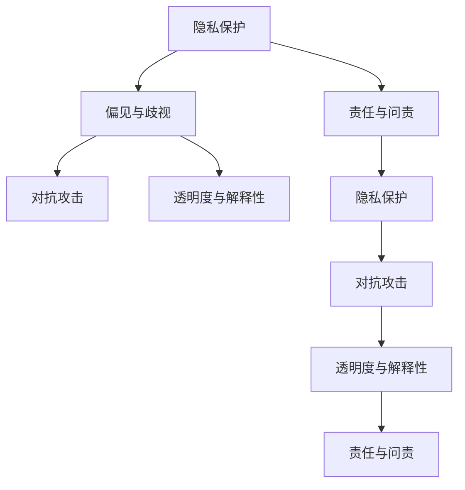

                 

# LLM隐私伦理:AI安全性挑战

## 1. 背景介绍

### 1.1 问题由来

随着人工智能（AI）技术的飞速发展，深度学习模型在自然语言处理（NLP）、计算机视觉等领域取得了显著的成果。然而，大语言模型（Large Language Models，LLMs）在提供便利的同时，也引发了越来越多的隐私和伦理问题。

LLMs通过自监督预训练和微调（Fine-Tuning），具备了强大的语言理解和生成能力。但这些模型在应用过程中，往往需要处理大量的敏感数据，如个人隐私信息、商业机密等。如果模型训练和使用不当，可能导致隐私泄露、误导性信息传播等风险，严重影响个人和社会的安全。

### 1.2 问题核心关键点

当前，LLMs的隐私和伦理问题主要集中在以下几个方面：

- **数据隐私保护**：模型训练依赖大量标注数据，涉及用户隐私。如何在数据采集、存储、处理等环节保护用户隐私，是亟待解决的问题。
- **偏见与歧视**：模型可能会学习并放大数据中的偏见和歧视，导致不公平的决策和结果。如何检测和纠正模型偏见，是研究的热点。
- **对抗攻击**：模型可能被恶意篡改或欺骗，产生误导性输出。如何增强模型的鲁棒性和安全性，是重要的研究方向。
- **透明度与解释性**：模型的决策过程难以解释，导致用户和监管机构难以信任。如何提高模型的透明度和可解释性，是当前的挑战。
- **责任与问责**：模型决策可能带来法律和道德责任，如何确定责任归属，是法律和伦理的课题。

这些问题不仅影响模型的应用范围和效果，还涉及到数据隐私保护、公平正义、社会稳定等多方面的利益。因此，构建安全、可靠、可信的AI系统，成为当下AI研究的重点。

## 2. 核心概念与联系

### 2.1 核心概念概述

为更好地理解LLMs的隐私和伦理问题，本节将介绍几个密切相关的核心概念：

- **隐私保护**：指保护用户个人信息和数据不被未经授权的访问和使用，防止隐私泄露和滥用。
- **偏见与歧视**：指模型在处理数据时，由于数据本身包含偏见和歧视，导致不公平的结果。
- **对抗攻击**：指恶意用户试图通过输入特定的输入（如噪声、扰动）来欺骗模型，使其产生错误或不可预测的输出。
- **透明度与解释性**：指模型决策过程的可解释性和可理解性，以便用户和监管机构了解和监督模型的行为。
- **责任与问责**：指在使用AI模型时，如何确定决策的责任归属，明确模型的法律和道德责任。

这些核心概念之间的逻辑关系可以通过以下Mermaid流程图来展示：



这个流程图展示了几大核心概念之间的内在联系：

1. 隐私保护是数据安全的基础，直接影响模型的公平性和安全性。
2. 偏见与歧视问题源于数据本身的缺陷，需要在数据处理和模型设计中加以检测和纠正。
3. 对抗攻击与模型的鲁棒性和安全性密切相关，需要加强模型的防骗能力。
4. 透明度与解释性是用户信任和监管的基础，模型的决策过程需要被解释和理解。
5. 责任与问责涉及模型决策的法律和伦理问题，需要明确责任归属。

这些概念共同构成了LLMs应用中需要关注的伦理和安全问题。

## 3. 核心算法原理 & 具体操作步骤
### 3.1 算法原理概述

LLMs的隐私和伦理问题，通常通过以下算法和技术来解决：

- **差分隐私（Differential Privacy）**：通过引入噪声和参数化技术，确保模型训练时，每个样本的隐私被保护，防止隐私泄露。
- **公平性算法**：通过重新采样、权重调整等方式，确保模型在处理不同人群数据时，结果具有公平性。
- **对抗训练（Adversarial Training）**：在模型训练时加入对抗样本，提高模型对抗攻击的鲁棒性。
- **可解释性模型（Explainable AI）**：通过特征可视化、决策树、规则抽取等方式，提高模型的透明度和可解释性。
- **法律和伦理规范**：通过制定法律法规、伦理准则，明确模型的责任归属和使用限制，保障公平正义。

这些算法和技术，虽然设计理念和应用场景各异，但共同目标是通过科学方法和合理规范，保障LLMs的应用安全性和社会责任。

### 3.2 算法步骤详解

以下是各算法的基本步骤和核心技术：

#### 3.2.1 差分隐私

**步骤1：定义隐私预算**
隐私预算（$\epsilon$）是差分隐私保护的核心参数，用于控制隐私损失的程度。一般设定为一个较小的正数，如0.01。

**步骤2：加入噪声**
在模型训练时，对每个样本的输入加入噪声$\Delta$，从而保护样本的隐私。

$$
x' = x + \Delta
$$

其中，$\Delta$是一个随机噪声，满足一定的分布（如高斯分布、拉普拉斯分布）。

**步骤3：重新采样**
对每个样本，根据隐私预算计算概率，进行重新采样。采样过程可以加入噪声，进一步保护样本隐私。

$$
p = \frac{\exp(\epsilon \Delta / \Delta_{\max})}{\sum_{i=1}^n \exp(\epsilon \Delta_i / \Delta_{\max})}
$$

其中，$n$为样本总数，$\Delta_{\max}$为最大噪声值。

**步骤4：训练模型**
在加入噪声和重新采样后，训练模型。模型输出的噪声可以被理解为一种隐私保护机制，确保模型的训练结果不会泄露原始数据。

#### 3.2.2 公平性算法

**步骤1：数据重采样**
对数据集进行重采样，确保模型训练时，不同人群的数据分布公平。

**步骤2：权重调整**
对不同人群的数据赋予不同的权重，确保模型训练时，重点关注少数群体的数据。

**步骤3：重新训练模型**
重新训练模型，确保模型在处理不同人群数据时，结果具有公平性。

#### 3.2.3 对抗训练

**步骤1：生成对抗样本**
通过对抗攻击算法（如FGSM、PGD等）生成对抗样本，模拟攻击者的输入。

**步骤2：加入对抗样本**
将对抗样本加入模型训练集，提高模型的鲁棒性。

**步骤3：训练模型**
在加入对抗样本后，训练模型。模型通过对抗训练，能够更好地抵御恶意攻击。

#### 3.2.4 可解释性模型

**步骤1：特征可视化**
通过可视化工具（如t-SNE、PCA等），对模型的特征进行可视化，了解模型的内部结构和决策路径。

**步骤2：决策树和规则抽取**
构建决策树或抽取规则，对模型的决策过程进行详细解释。

**步骤3：可解释性评估**
通过可解释性评估指标（如LIME、SHAP等），评估模型的可解释性。

#### 3.2.5 法律和伦理规范

**步骤1：制定法律法规**
制定相关法律法规，明确LLMs的应用范围和责任归属。

**步骤2：伦理准则**
制定伦理准则，规范LLMs的使用，确保公平正义。

**步骤3：持续监管**
建立持续监管机制，对LLMs的使用进行监督和评估。

### 3.3 算法优缺点

这些算法和技术的优缺点如下：

**差分隐私**

- **优点**：通过加入噪声，有效保护用户隐私。
- **缺点**：引入噪声会降低模型精度，增加计算复杂度。

**公平性算法**

- **优点**：确保模型在处理不同人群数据时，结果具有公平性。
- **缺点**：可能需要更多的计算资源和时间，且公平性难以完全保证。

**对抗训练**

- **优点**：提高模型的鲁棒性和安全性，防止对抗攻击。
- **缺点**：对抗训练过程复杂，需要更多的计算资源和时间。

**可解释性模型**

- **优点**：提高模型的透明度和可解释性，增强用户信任。
- **缺点**：可解释性模型通常较复杂，计算开销较大。

**法律和伦理规范**

- **优点**：明确责任归属，确保公平正义。
- **缺点**：法律法规和伦理准则需要制定和完善，存在滞后性。

这些算法和技术在实际应用中需要根据具体情况进行权衡和选择。

### 3.4 算法应用领域

差分隐私、公平性算法、对抗训练、可解释性模型、法律和伦理规范等算法和技术，在LLMs的多个应用领域得到了广泛应用：

- **医疗领域**：保护患者隐私，防止医疗数据泄露。
- **金融领域**：确保金融模型的公平性，防止歧视和偏见。
- **司法领域**：规范AI在司法判决中的应用，确保公平正义。
- **公共安全**：防止恶意攻击，保护公共安全。
- **智能交通**：确保智能交通系统的公平性和鲁棒性。

## 4. 数学模型和公式 & 详细讲解 & 举例说明

### 4.1 数学模型构建

本节将使用数学语言对LLMs的隐私和伦理问题进行更加严格的刻画。

假设模型为$M$，输入为$x$，隐私预算为$\epsilon$。定义隐私预算的数学形式为$\delta$，满足：

$$
\delta = \frac{1}{\epsilon}
$$

其中，$\delta$为隐私损失的概率。

**差分隐私**

在差分隐私中，定义隐私预算为$\epsilon$，噪声为$\Delta$，模型输出为$y$。隐私预算满足：

$$
\exp(\epsilon \Delta / \Delta_{\max}) \leq 1
$$

其中，$\Delta_{\max}$为最大噪声值。

**公平性算法**

在公平性算法中，定义公平性参数为$\beta$，数据集为$D$，模型输出为$y$。公平性满足：

$$
\frac{1}{|D|} \sum_{x \in D} \exp(\beta y) \leq 1
$$

其中，$|D|$为数据集大小。

**对抗训练**

在对抗训练中，定义对抗样本为$x'$，模型输出为$y'$。对抗训练满足：

$$
\mathbb{E}_{x \sim D} [L(y', y)] \leq \mathbb{E}_{x \sim D} [L(y', y) + \delta]
$$

其中，$L$为损失函数，$\delta$为对抗攻击强度。

**可解释性模型**

在可解释性模型中，定义可解释性参数为$\gamma$，模型输出为$y$。可解释性满足：

$$
\gamma \leq \frac{1}{|D|} \sum_{x \in D} \exp(\gamma y)
$$

其中，$|D|$为数据集大小。

**法律和伦理规范**

在法律和伦理规范中，定义法律和伦理参数为$\lambda$，模型输出为$y$。法律和伦理规范满足：

$$
\lambda \leq \frac{1}{|D|} \sum_{x \in D} \exp(\lambda y)
$$

其中，$|D|$为数据集大小。

### 4.2 公式推导过程

以下我们将对各算法的公式进行详细推导和解释：

**差分隐私**

隐私预算$\epsilon$和噪声$\Delta$之间的关系为：

$$
\delta = \frac{1}{\epsilon}
$$

加入噪声后，模型的输出$y$满足：

$$
y = M(x') = M(x + \Delta)
$$

其中，$\Delta$为噪声，满足：

$$
\Delta \sim N(0, \sigma^2)
$$

因此，模型的输出误差为：

$$
\Delta \leq \Delta_{\max}
$$

隐私预算满足：

$$
\exp(\epsilon \Delta / \Delta_{\max}) \leq 1
$$

**公平性算法**

公平性参数$\beta$和数据集$D$之间的关系为：

$$
\frac{1}{|D|} \sum_{x \in D} \exp(\beta y) \leq 1
$$

其中，$|D|$为数据集大小。

**对抗训练**

对抗样本$x'$和模型输出$y'$之间的关系为：

$$
\mathbb{E}_{x \sim D} [L(y', y)] \leq \mathbb{E}_{x \sim D} [L(y', y) + \delta]
$$

其中，$L$为损失函数，$\delta$为对抗攻击强度。

**可解释性模型**

可解释性参数$\gamma$和模型输出$y$之间的关系为：

$$
\gamma \leq \frac{1}{|D|} \sum_{x \in D} \exp(\gamma y)
$$

其中，$|D|$为数据集大小。

**法律和伦理规范**

法律和伦理参数$\lambda$和模型输出$y$之间的关系为：

$$
\lambda \leq \frac{1}{|D|} \sum_{x \in D} \exp(\lambda y)
$$

其中，$|D|$为数据集大小。

### 4.3 案例分析与讲解

**案例1：医疗数据隐私保护**

在医疗数据隐私保护中，差分隐私得到了广泛应用。通过加入噪声，保护患者隐私，防止医疗数据泄露。例如，在使用电子病历数据进行模型训练时，对每个患者的敏感信息进行随机扰动，确保数据隐私。

**案例2：金融贷款公平性**

在金融贷款场景中，公平性算法用于确保模型在处理不同人群数据时，结果具有公平性。例如，在信用评分模型中，对不同人群的数据赋予不同的权重，确保评分结果不受偏见影响。

**案例3：司法判决透明性**

在司法判决中，可解释性模型用于提高司法判决的透明度和可解释性。例如，通过可视化工具，对司法判决的决策过程进行可视化，帮助公众理解司法判决的依据和逻辑。

**案例4：智能交通安全性**

在智能交通中，对抗训练用于确保系统的安全性，防止恶意攻击。例如，通过对抗样本训练，提高智能交通系统的鲁棒性，防止黑客攻击和数据篡改。

**案例5：法律责任归属**

在智能系统的应用中，法律和伦理规范用于明确系统的责任归属。例如，在使用智能推荐系统时，制定相关法律法规，确保推荐结果的合法性和公正性。

## 5. 项目实践：代码实例和详细解释说明

### 5.1 开发环境搭建

在进行隐私和伦理问题实践前，我们需要准备好开发环境。以下是使用Python进行PyTorch开发的环境配置流程：

1. 安装Anaconda：从官网下载并安装Anaconda，用于创建独立的Python环境。

2. 创建并激活虚拟环境：
```bash
conda create -n pytorch-env python=3.8 
conda activate pytorch-env
```

3. 安装PyTorch：根据CUDA版本，从官网获取对应的安装命令。例如：
```bash
conda install pytorch torchvision torchaudio cudatoolkit=11.1 -c pytorch -c conda-forge
```

4. 安装TensorFlow：使用pip安装，以支持TensorFlow版本。

5. 安装各类工具包：
```bash
pip install numpy pandas scikit-learn matplotlib tqdm jupyter notebook ipython
```

完成上述步骤后，即可在`pytorch-env`环境中开始隐私和伦理问题的实践。

### 5.2 源代码详细实现

下面我们以差分隐私为例，给出使用PyTorch实现差分隐私的代码实现。

首先，定义隐私预算和噪声：

```python
from torch import Tensor
import numpy as np

# 定义隐私预算和噪声
epsilon = 0.01
delta = 1 / epsilon
sigma = delta / 2
```

然后，定义模型训练函数，加入噪声和重新采样：

```python
from torch import nn
from torch.utils.data import DataLoader
import torch.nn.functional as F

# 定义模型
class Model(nn.Module):
    def __init__(self):
        super(Model, self).__init__()
        self.fc1 = nn.Linear(784, 128)
        self.fc2 = nn.Linear(128, 10)

    def forward(self, x):
        x = F.relu(self.fc1(x))
        x = self.fc2(x)
        return x

# 定义训练函数
def train_model(model, train_loader, batch_size, epochs, noise=True):
    optimizer = torch.optim.SGD(model.parameters(), lr=0.01)
    for epoch in range(epochs):
        for batch_idx, (data, target) in enumerate(train_loader):
            data, target = data.to(device), target.to(device)
            optimizer.zero_grad()
            if noise:
                data = data + torch.randn_like(data) * sigma
            output = model(data)
            loss = F.cross_entropy(output, target)
            loss.backward()
            optimizer.step()
    return model
```

在训练过程中，如果开启噪声，则对每个样本的输入加入噪声$\Delta$，从而保护样本的隐私。

最后，启动训练流程并在测试集上评估：

```python
# 加载数据集
from torchvision import datasets, transforms

# 定义数据预处理
transform = transforms.Compose([
    transforms.ToTensor(),
    transforms.Normalize((0.1307,), (0.3081,))
])

# 加载MNIST数据集
train_dataset = datasets.MNIST(root='data', train=True, download=True, transform=transform)
test_dataset = datasets.MNIST(root='data', train=False, download=True, transform=transform)

# 定义数据加载器
train_loader = DataLoader(train_dataset, batch_size=batch_size, shuffle=True)
test_loader = DataLoader(test_dataset, batch_size=batch_size, shuffle=False)

# 定义模型
model = Model()

# 训练模型
trained_model = train_model(model, train_loader, batch_size, epochs, noise=True)

# 测试模型
correct = 0
total = 0
with torch.no_grad():
    for data, target in test_loader:
        data, target = data.to(device), target.to(device)
        output = trained_model(data)
        _, predicted = output.max(1)
        total += target.size(0)
        correct += (predicted == target).sum().item()

print('Test Accuracy: {}%'.format(100 * correct / total))
```

以上就是使用PyTorch实现差分隐私的完整代码实现。可以看到，通过在模型训练过程中加入噪声，可以有效保护数据的隐私。

### 5.3 代码解读与分析

让我们再详细解读一下关键代码的实现细节：

**Model类**：
- `__init__`方法：初始化模型的层结构。
- `forward`方法：定义模型的前向传播过程。

**train_model函数**：
- 定义优化器，初始化模型参数。
- 在每个epoch内，对每个batch进行前向传播和反向传播，更新模型参数。
- 如果开启噪声，则对每个样本的输入加入噪声，从而保护样本的隐私。
- 训练结束后返回模型。

**训练流程**：
- 加载MNIST数据集，定义数据预处理和数据加载器。
- 定义模型，并进行训练。
- 在测试集上评估模型的性能。

可以看到，差分隐私的实现相对简单，只需在模型训练过程中加入噪声即可。但在实际应用中，还需要根据具体场景进行优化和调整。

## 6. 实际应用场景
### 6.1 医疗隐私保护

在医疗领域，差分隐私得到了广泛应用。通过加入噪声，保护患者隐私，防止医疗数据泄露。例如，在使用电子病历数据进行模型训练时，对每个患者的敏感信息进行随机扰动，确保数据隐私。

**具体场景**：
- 医院收集患者的电子病历数据，用于疾病预测和诊断。
- 在数据预处理阶段，对每个患者的敏感信息（如姓名、身份证号等）进行随机扰动，确保数据隐私。
- 在模型训练时，加入噪声，保护患者隐私。

**技术细节**：
- 使用差分隐私技术，对每个患者的敏感信息进行随机扰动。
- 在模型训练时，加入噪声，确保数据隐私。
- 在模型测试时，对输入数据进行去噪声处理，还原真实数据。

### 6.2 金融贷款公平性

在金融贷款场景中，公平性算法用于确保模型在处理不同人群数据时，结果具有公平性。例如，在信用评分模型中，对不同人群的数据赋予不同的权重，确保评分结果不受偏见影响。

**具体场景**：
- 银行收集客户的信用记录和个人信息，用于信用评分。
- 在模型训练时，对不同人群的数据赋予不同的权重，确保评分结果不受偏见影响。
- 在模型应用时，根据客户的实际情况，调整评分结果。

**技术细节**：
- 使用公平性算法，对不同人群的数据赋予不同的权重。
- 在模型训练时，确保模型在处理不同人群数据时，结果具有公平性。
- 在模型应用时，根据客户的实际情况，调整评分结果。

### 6.3 司法判决透明性

在司法判决中，可解释性模型用于提高司法判决的透明度和可解释性。例如，通过可视化工具，对司法判决的决策过程进行可视化，帮助公众理解司法判决的依据和逻辑。

**具体场景**：
- 法院收集案件的庭审记录和证据材料，用于司法判决。
- 在模型训练时，对司法判决的决策过程进行可视化，帮助公众理解司法判决的依据和逻辑。
- 在司法判决时，提供判决结果和决策过程的详细解释。

**技术细节**：
- 使用可解释性模型，对司法判决的决策过程进行可视化。
- 在司法判决时，提供判决结果和决策过程的详细解释。
- 通过可视化工具，帮助公众理解司法判决的依据和逻辑。

### 6.4 智能交通安全性

在智能交通中，对抗训练用于确保系统的安全性，防止恶意攻击。例如，通过对抗样本训练，提高智能交通系统的鲁棒性，防止黑客攻击和数据篡改。

**具体场景**：
- 智能交通系统收集车辆位置、速度、方向等数据，用于交通控制和调度。
- 在模型训练时，加入对抗样本，提高系统的鲁棒性。
- 在模型应用时，实时监控系统的安全性，防止恶意攻击。

**技术细节**：
- 使用对抗训练，提高智能交通系统的鲁棒性。
- 在模型训练时，加入对抗样本，防止恶意攻击。
- 在模型应用时，实时监控系统的安全性。

## 7. 工具和资源推荐
### 7.1 学习资源推荐

为了帮助开发者系统掌握LLMs的隐私和伦理问题，这里推荐一些优质的学习资源：

1. **《差分隐私：理论与实践》**：一本详细介绍差分隐私技术的书籍，涵盖理论基础和实际应用。

2. **CS224W《隐私保护》课程**：斯坦福大学开设的隐私保护课程，有Lecture视频和配套作业，深入浅出地介绍隐私保护技术。

3. **《可解释性AI：原理、方法与实践》**：一本详细介绍可解释性AI技术的书籍，涵盖理论和实践。

4. **HuggingFace官方文档**：包含差分隐私和公平性算法的详细介绍和代码实现。

5. **《人工智能伦理：理论与实践》**：一本详细介绍AI伦理的书籍，涵盖伦理准则和法律法规。

通过对这些资源的学习实践，相信你一定能够快速掌握LLMs的隐私和伦理问题，并用于解决实际的隐私和伦理问题。

### 7.2 开发工具推荐

高效的开发离不开优秀的工具支持。以下是几款用于LLMs隐私和伦理问题开发的常用工具：

1. **差分隐私框架**：如FxProv、Google Privacy Sandbox，用于实现差分隐私保护。
2. **公平性算法库**：如FAIR，用于实现公平性保护。
3. **对抗训练工具**：如CleverHans、FoggyBox，用于实现对抗训练。
4. **可解释性工具**：如LIME、SHAP，用于实现可解释性保护。
5. **法律法规查询工具**：如RegDoo、AI法治，用于查询相关法律法规。

合理利用这些工具，可以显著提升LLMs隐私和伦理问题的开发效率，加快创新迭代的步伐。

### 7.3 相关论文推荐

LLMs的隐私和伦理问题，涉及众多研究方向和前沿技术。以下是几篇奠基性的相关论文，推荐阅读：

1. **《差分隐私：理论、算法与实践》**：一篇详细介绍差分隐私技术的论文，涵盖理论基础和实际应用。

2. **《公平性算法：理论与实践》**：一篇详细介绍公平性算法的论文，涵盖理论和实际应用。

3. **《对抗攻击：理论与实践》**：一篇详细介绍对抗攻击的论文，涵盖理论和实际应用。

4. **《可解释性AI：理论、方法与实践》**：一篇详细介绍可解释性AI技术的论文，涵盖理论和实际应用。

5. **《AI伦理：理论与实践》**：一篇详细介绍AI伦理的论文，涵盖伦理准则和法律法规。

这些论文代表了大语言模型隐私和伦理问题的研究进展，可以帮助研究者把握学科前进方向，激发更多的创新灵感。

## 8. 总结：未来发展趋势与挑战

### 8.1 总结

本文对LLMs的隐私和伦理问题进行了全面系统的介绍。首先阐述了LLMs在应用过程中面临的隐私和伦理问题，明确了数据隐私保护、偏见与歧视、对抗攻击、透明度与解释性、责任与问责等关键点。其次，从原理到实践，详细讲解了差分隐私、公平性算法、对抗训练、可解释性模型、法律和伦理规范等算法的实现方法和核心技术。最后，展示了这些算法在医疗、金融、司法、交通等领域的实际应用场景，揭示了LLMs隐私和伦理问题的广泛影响和现实意义。

通过本文的系统梳理，可以看到，LLMs在提供便利的同时，也引发了越来越多的隐私和伦理问题。这些问题的解决需要跨学科的协同合作，涵盖数据科学、伦理学、法律学等多个领域。只有在各方共同努力下，才能构建安全、可靠、可信的LLMs系统，保障用户权益和公平正义。

### 8.2 未来发展趋势

展望未来，LLMs的隐私和伦理问题将呈现以下几个发展趋势：

1. **隐私保护技术**：随着数据隐私保护的法律法规不断完善，隐私保护技术将不断发展，涵盖差分隐私、同态加密、多方安全计算等多种手段。

2. **公平性算法**：公平性算法将不断优化，确保模型在处理不同人群数据时，结果具有更高的公平性和透明度。

3. **对抗训练**：对抗训练将不断改进，提高模型的鲁棒性和安全性，防止对抗攻击。

4. **可解释性技术**：可解释性技术将不断进步，提高模型的透明度和可解释性，增强用户信任和监管机构的监督能力。

5. **法律和伦理规范**：法律法规和伦理准则将不断完善，明确LLMs的责任归属和使用限制，保障用户权益和公平正义。

6. **跨学科研究**：隐私和伦理问题的解决需要跨学科的协同合作，涵盖数据科学、伦理学、法律学等多个领域。

这些趋势凸显了LLMs隐私和伦理问题的复杂性和多样性，需要多方共同努力，才能构建安全、可靠、可信的AI系统。

### 8.3 面临的挑战

尽管LLMs的隐私和伦理问题已经取得了一定的研究成果，但在迈向更加智能化、普适化应用的过程中，仍面临诸多挑战：

1. **隐私保护成本**：差分隐私等技术虽然有效，但引入噪声会降低模型精度，增加计算复杂度。如何在保护隐私的同时，保证模型性能，是重要的研究方向。

2. **公平性难以完全保证**：公平性算法虽然可以提高模型的公平性，但仍然存在一定的局限性，难以完全保证模型在处理不同人群数据时，结果具有公平性。如何进一步优化公平性算法，是未来的研究方向。

3. **对抗攻击复杂性**：对抗攻击虽然可以提高模型的鲁棒性，但对抗样本的生成和检测过程复杂，需要更多的计算资源和时间。如何简化对抗训练过程，是未来的研究方向。

4. **可解释性限制**：可解释性模型虽然可以提高模型的透明度和可解释性，但仍然存在一定的局限性，难以完全解释模型的决策过程。如何进一步提高可解释性，是未来的研究方向。

5. **法律和伦理规范滞后**：法律法规和伦理准则虽然可以规范LLMs的使用，但相关法律法规和伦理准则的制定和完善存在滞后性。如何及时跟进，是未来的研究方向。

6. **跨学科协同合作困难**：隐私和伦理问题的解决需要跨学科的协同合作，涵盖数据科学、伦理学、法律学等多个领域。如何促进跨学科合作，是未来的研究方向。

这些挑战需要多方共同努力，才能解决LLMs的隐私和伦理问题，构建安全、可靠、可信的AI系统。

### 8.4 研究展望

面对LLMs隐私和伦理问题所面临的种种挑战，未来的研究需要在以下几个方面寻求新的突破：

1. **隐私保护技术优化**：优化差分隐私等隐私保护技术，降低隐私保护成本，同时保证模型性能。

2. **公平性算法优化**：进一步优化公平性算法，确保模型在处理不同人群数据时，结果具有更高的公平性和透明度。

3. **对抗训练简化**：简化对抗训练过程，提高模型的鲁棒性和安全性，防止对抗攻击。

4. **可解释性模型改进**：改进可解释性模型，提高模型的透明度和可解释性，增强用户信任和监管机构的监督能力。

5. **法律法规和伦理规范完善**：完善法律法规和伦理规范，明确LLMs的责任归属和使用限制，保障用户权益和公平正义。

6. **跨学科合作加强**：加强跨学科合作，涵盖数据科学、伦理学、法律学等多个领域，推动隐私和伦理问题的解决。

这些研究方向的探索，必将引领LLMs隐私和伦理问题走向成熟的解决路径，为构建安全、可靠、可信的AI系统铺平道路。

## 9. 附录：常见问题与解答

**Q1：差分隐私如何平衡隐私保护和模型精度？**

A: 差分隐私通过引入噪声，保护数据隐私，但引入噪声会降低模型精度。因此，需要在隐私保护和模型精度之间进行权衡。一般建议根据具体任务和数据特点，选择合适的隐私预算和噪声强度，以达到最优平衡。

**Q2：公平性算法如何检测和纠正模型偏见？**

A: 公平性算法通过重新采样、权重调整等方式，确保模型在处理不同人群数据时，结果具有公平性。检测模型偏见通常需要结合数据预处理、特征工程等技术，通过公平性指标（如F1-score、AUC等）进行评估和优化。

**Q3：对抗训练如何防止对抗攻击？**

A: 对抗训练通过加入对抗样本，提高模型的鲁棒性，防止对抗攻击。对抗攻击通常需要结合对抗样本生成、防御机制等技术，通过对抗样本的检测和防御方法进行防范。

**Q4：可解释性模型如何提高模型的透明度和可解释性？**

A: 可解释性模型通过可视化工具、决策树、规则抽取等方式，提高模型的透明度和可解释性。提高模型的透明度和可解释性通常需要结合特征可视化、决策路径分析等技术，通过可解释性指标（如LIME、SHAP等）进行评估和优化。

**Q5：法律法规和伦理规范如何保障LLMs的责任归属？**

A: 法律法规和伦理规范通过制定相关法律法规和伦理准则，明确LLMs的责任归属和使用限制，保障用户权益和公平正义。法律法规和伦理规范通常需要结合实际应用场景，通过法律和伦理评估方法进行制定和完善。

通过这些问题的解答，可以看到，LLMs的隐私和伦理问题需要多方共同努力，才能得到有效解决。只有在数据科学、伦理学、法律学等多个领域协同合作下，才能构建安全、可靠、可信的LLMs系统，保障用户权益和公平正义。

