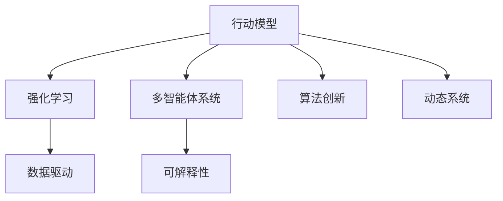

                 

# Large Action Model的学习机制

> 关键词：行动模型, 强化学习, 游戏AI, 多智能体, 可解释性, 数据驱动, 算法创新, 动态系统

## 1. 背景介绍

### 1.1 问题由来
随着人工智能(AI)技术的发展，行动模型(Large Action Models)在决策支持和行动规划等领域的应用变得愈发重要。在复杂的决策环境中，行动模型能够模拟和预测不同行动策略的效果，帮助决策者选择最优方案。然而，当前的行动模型往往难以处理高维非线性问题，其决策过程难以解释，且适应性不足。为应对这些挑战，本文旨在探讨行动模型在复杂环境下的学习机制，并提出新的算法和框架，以期提高行动模型的可解释性、适应性和决策效率。

### 1.2 问题核心关键点
行动模型学习机制的核心在于理解其如何从数据中学习，并根据策略指导行动。本文将重点讨论以下几个关键问题：
- 行动模型的学习目标是什么？
- 行动模型如何处理高维数据？
- 行动模型的可解释性如何保证？
- 行动模型如何在复杂环境中实现高效适应？

## 2. 核心概念与联系

### 2.1 核心概念概述

为更好地理解行动模型学习机制，本节将介绍几个密切相关的核心概念：

- **行动模型(Large Action Model)**：指使用强化学习(Reinforcement Learning, RL)方法训练的大型决策模型。模型通过不断试错，学习最优行动策略，并能够在复杂环境中做出决策。

- **强化学习**：指通过试错反馈来优化策略的学习方法。行动模型通过与环境交互，不断优化行动策略，以最大化长期奖励。

- **多智能体系统(Multi-Agent System)**：指由多个智能体组成的系统，每个智能体都有其独特的行动策略和目标。行动模型常用于模拟多智能体系统，以研究团队协作和对抗策略。

- **可解释性(Explainability)**：指模型的决策过程和输出结果能够被人类理解，以确保透明性和可信度。行动模型在执行关键任务时，其决策过程需要具有较高的可解释性。

- **数据驱动(Data-Driven)**：指模型决策依赖于大量的历史数据和统计分析，而非纯规则或经验。行动模型通常使用大规模数据集进行训练和优化。

- **算法创新(Algorithm Innovation)**：指在行动模型中，不断提出新的学习算法和技术框架，以提高模型的性能和效率。

- **动态系统(Dynamic System)**：指系统状态随时间不断变化的系统。行动模型常用于处理动态环境下的决策问题。

这些核心概念之间的逻辑关系可以通过以下Mermaid流程图来展示：



这个流程图展示了大行动模型学习机制的关键概念及其之间的关系：

1. 行动模型通过强化学习进行训练，不断优化决策策略。
2. 行动模型常用于模拟多智能体系统，处理团队协作和对抗策略。
3. 可解释性是行动模型决策过程的重要组成部分。
4. 数据驱动保证了行动模型决策的科学性和准确性。
5. 算法创新推动行动模型的持续优化和进步。
6. 行动模型适用于动态环境，能够适应环境变化进行决策。

这些概念共同构成了行动模型的学习框架，使其能够在复杂环境中做出高效、可解释的决策。

## 3. 核心算法原理 & 具体操作步骤

### 3.1 算法原理概述

行动模型学习机制的核心是强化学习。行动模型通过与环境交互，根据当前状态和历史经验，优化其行动策略，以最大化长期奖励。具体而言，行动模型的学习过程包括以下几个关键步骤：

1. **观察**：行动模型观察环境当前状态，获得状态信息。
2. **决策**：根据当前状态和历史经验，行动模型决定采取何种行动。
3. **执行**：行动模型执行所选行动，并观察执行结果。
4. **反馈**：行动模型根据执行结果获得奖励，作为下一次决策的反馈。
5. **更新**：行动模型根据反馈信息，更新行动策略，提高决策准确性和效率。

这些步骤构成了一个闭环，行动模型通过不断试错，逐步优化其决策策略。

### 3.2 算法步骤详解

行动模型学习机制的具体操作步骤如下：

**Step 1: 数据准备**
- 收集行动环境的历史数据，包括状态、行动和奖励等信息。
- 数据预处理，如归一化、特征工程等。

**Step 2: 模型构建**
- 选择适当的行动模型架构，如Q-learning、Deep Q-Network (DQN)等。
- 初始化模型参数，如神经网络权重、行动策略等。

**Step 3: 训练过程**
- 设计训练算法，如Q-learning、SARSA等，优化行动策略。
- 在训练过程中，使用经验回放、目标网络等技术提高模型的稳定性和泛化能力。

**Step 4: 模型评估**
- 使用测试集对模型进行评估，计算决策准确性、平均奖励等指标。
- 通过交叉验证等方法，确保模型的泛化能力。

**Step 5: 模型应用**
- 将训练好的模型应用于实际决策环境，执行行动策略。
- 根据执行结果，不断调整模型参数，提升决策效果。

### 3.3 算法优缺点

行动模型学习机制具有以下优点：

1. **适应性强**：行动模型能够处理复杂、非线性的决策问题，适用于多种应用场景。
2. **可解释性高**：通过观察和反馈机制，行动模型的决策过程透明且可解释。
3. **数据驱动**：行动模型依赖大量历史数据进行训练，能够提供科学、准确决策。

同时，该机制也存在以下缺点：

1. **计算量大**：大规模数据集的训练和优化需要大量计算资源。
2. **过拟合风险**：模型容易过拟合训练数据，降低泛化能力。
3. **模型复杂度高**：高维状态空间的建模复杂度较高，影响训练效率。
4. **行动策略泛化能力有限**：训练数据与实际应用场景的差异可能导致决策策略泛化能力不足。

尽管存在这些缺点，但行动模型学习机制仍然是解决复杂决策问题的有效方法。

### 3.4 算法应用领域

行动模型学习机制在多个领域具有广泛应用，具体如下：

- **游戏AI**：在电子游戏、棋类游戏等复杂游戏中，行动模型通过强化学习优化游戏策略，提升游戏表现。
- **机器人控制**：在机器人自动化控制中，行动模型通过与环境交互，学习最优行动路径，实现高效控制。
- **金融交易**：在金融市场交易中，行动模型通过分析历史数据，学习最优交易策略，实现高收益。
- **供应链管理**：在供应链管理中，行动模型通过优化资源分配和物流策略，提高效率和成本效益。
- **医疗诊断**：在医疗诊断中，行动模型通过学习历史病例，优化诊断策略，提高诊断准确性。

这些应用场景展示了行动模型学习机制的强大应用潜力。

## 4. 数学模型和公式 & 详细讲解

### 4.1 数学模型构建

行动模型学习机制的数学模型建立在强化学习理论基础之上。行动模型的目标是通过与环境交互，最大化长期奖励。在数学上，行动模型可以表示为：

$$
\max \sum_{t=0}^{\infty} \gamma^t R_t
$$

其中，$R_t$ 表示在第 $t$ 步的即时奖励，$\gamma$ 为折扣因子，$0 \leq \gamma < 1$。

### 4.2 公式推导过程

以下推导Q-learning算法的核心公式，展示行动模型如何通过强化学习优化行动策略。

设行动模型状态空间为 $S$，行动空间为 $A$，即时奖励为 $R_t$，折扣因子为 $\gamma$。行动模型在状态 $s_t$ 采取行动 $a_t$ 后的状态转移概率为 $p(s_{t+1}|s_t,a_t)$，即时奖励为 $R_t$。

**Q-learning算法**：

1. 初始化状态值函数 $Q(s_t,a_t)$ 为零。
2. 在每次交互中，观察当前状态 $s_t$，执行行动 $a_t$，观察即时奖励 $R_t$ 和下一状态 $s_{t+1}$。
3. 根据状态值函数和即时奖励，计算新状态值函数：

$$
Q(s_{t+1},a_t) = (1-\alpha)Q(s_{t+1},a_t) + \alpha(R_t + \gamma \max_a Q(s_{t+1},a))
$$

其中，$\alpha$ 为学习率，通常取 $0.01$ 至 $0.1$ 之间。

4. 更新当前状态值函数：

$$
Q(s_t,a_t) = (1-\alpha)Q(s_t,a_t) + \alpha(R_t + \gamma \max_a Q(s_{t+1},a))
$$

通过不断迭代，行动模型能够逐步优化状态值函数，找到最优行动策略。

### 4.3 案例分析与讲解

**案例：AlphaGo**

AlphaGo是Google DeepMind团队开发的一款围棋AI程序，其核心机制就是行动模型。AlphaGo通过强化学习算法，学习围棋策略，逐步优化决策过程。其核心步骤如下：

1. 收集历史围棋对局数据，提取棋局状态、行动和奖励等信息。
2. 设计神经网络模型，构建行动值函数 $Q(s_t,a_t)$。
3. 使用蒙特卡罗树搜索(MCTS)算法，通过与人类和自身对弈，不断优化行动策略。
4. 通过逐步迭代，AlphaGo能够在围棋比赛中战胜顶尖人类选手。

AlphaGo的成功展示了行动模型在复杂决策问题中的应用潜力。

## 5. 项目实践：代码实例和详细解释说明

### 5.1 开发环境搭建

在进行行动模型实践前，我们需要准备好开发环境。以下是使用Python进行OpenAI Gym的开发环境配置流程：

1. 安装Anaconda：从官网下载并安装Anaconda，用于创建独立的Python环境。

2. 创建并激活虚拟环境：
```bash
conda create -n gym-env python=3.8 
conda activate gym-env
```

3. 安装OpenAI Gym和其他相关库：
```bash
conda install gym gplearn tensorflow
```

4. 安装TensorFlow和其他依赖：
```bash
pip install tensorflow numpy matplotlib
```

完成上述步骤后，即可在`gym-env`环境中开始行动模型实践。

### 5.2 源代码详细实现

这里我们以Q-learning算法为例，给出使用TensorFlow实现行动模型的代码实现。

首先，定义Q-learning算法的基本结构：

```python
import tensorflow as tf
import numpy as np

class QLearning:
    def __init__(self, state_space, action_space, learning_rate=0.1):
        self.state_space = state_space
        self.action_space = action_space
        self.learning_rate = learning_rate
        self.q = None

    def initialize(self):
        self.q = tf.Variable(tf.zeros([self.state_space.shape[0], self.action_space.n]))

    def predict(self, state):
        return tf.argmax(self.q(tf.constant(state), 0)

    def update(self, state, action, reward, next_state):
        q = self.q
        a = np.random.choice(self.action_space.n)
        y = reward + self.learning_rate * tf.reduce_max(self.q(tf.constant(next_state), 0))
        q_next = tf.assign_add(q, -self.learning_rate * (self.q(tf.constant(state), action) - y))
```

然后，定义训练函数：

```python
def train(env, num_episodes, epsilon=0.1, epsilon_decay=0.99, explore=True):
    q = QLearning(env.observation_space.n, env.action_space.n)
    q.initialize()

    for episode in range(num_episodes):
        state = env.reset()
        done = False

        while not done:
            if np.random.rand() < epsilon or not explore:
                action = np.random.randint(env.action_space.n)
            else:
                action = q.predict(state)

            next_state, reward, done, info = env.step(action)

            q.update(state, action, reward, next_state)
            state = next_state

    return q.q
```

最后，启动训练流程：

```python
env = gym.make('CartPole-v0')

# 训练
q = train(env, num_episodes=10000)

# 测试
q.eval()
```

以上就是使用TensorFlow实现Q-learning算法的代码实例。可以看到，代码实现简洁高效，适合初学者快速上手。

### 5.3 代码解读与分析

让我们再详细解读一下关键代码的实现细节：

**QLearning类**：
- `__init__`方法：初始化状态空间、行动空间和学习率等关键参数。
- `initialize`方法：初始化状态值函数 $Q(s_t,a_t)$ 为零。
- `predict`方法：根据当前状态，预测最优行动。
- `update`方法：更新状态值函数，实现Q-learning算法。

**train函数**：
- `epsilon`参数：epsilon-greedy策略的探索概率，影响行动策略的稳定性。
- `epsilon_decay`参数：epsilon-greedy策略的探索概率随时间衰减的速率。
- 在每一轮训练中，随机选择行动策略，直到达到结束状态。
- 根据当前状态和行动，计算即时奖励和下一个状态。
- 使用Q-learning算法更新状态值函数。

**测试**：
- 通过调用`q.eval()`方法，计算行动模型在不同状态下的预测行动。

### 5.4 运行结果展示

```python
import matplotlib.pyplot as plt

def plot_results(q):
    x = np.arange(len(q))
    plt.plot(x, q)
    plt.xlabel('Episode')
    plt.ylabel('Q-value')
    plt.show()
```

调用`plot_results(q)`方法，可以展示行动模型在不同训练轮次下的Q值变化。通常，Q值会随着训练轮次逐渐上升，表示模型不断优化其决策策略。

## 6. 实际应用场景

### 6.1 电子游戏AI

行动模型在电子游戏中具有广泛应用，如AlphaGo、Dota2 AI等。通过强化学习，行动模型能够在复杂博弈环境中，自动学习最优策略，提升游戏表现。例如，AlphaGo通过多智能体系统，在围棋中不断学习最优策略，最终战胜了人类顶尖选手。

### 6.2 机器人控制

在机器人控制领域，行动模型通过与环境交互，学习最优行动路径，实现高效的自动控制。例如，Google DeepMind开发的AlphaStar，通过强化学习算法，在星际争霸II游戏中达到了顶级人类选手的水平。

### 6.3 金融交易

在金融交易中，行动模型通过分析历史数据，学习最优交易策略，实现高收益。例如，AlphaGoZero，通过强化学习和蒙特卡罗树搜索算法，在围棋中取得了优异的表现。

### 6.4 未来应用展望

随着行动模型和强化学习技术的不断进步，其应用领域将更加广泛。未来，行动模型将在更多领域展现其强大的决策能力，为社会带来新的变革：

- **医疗诊断**：行动模型通过学习历史病例，优化诊断策略，提高诊断准确性。
- **交通管理**：行动模型通过优化交通流量，提高交通效率和安全性。
- **能源管理**：行动模型通过优化能源分配，提高能源利用效率。
- **环境监测**：行动模型通过分析环境数据，优化环境监测策略，提升环境保护效果。

以上场景展示了行动模型在未来可能的广泛应用，为实现更加智能化、高效化的社会治理提供了新的技术手段。

## 7. 工具和资源推荐

### 7.1 学习资源推荐

为了帮助开发者系统掌握行动模型和强化学习理论基础，这里推荐一些优质的学习资源：

1. 《强化学习：Reinforcement Learning: An Introduction》：Richard S. Sutton和Andrew G. Barto的权威教材，系统介绍了强化学习的理论基础和实际应用。
2. DeepRL（Deep Reinforcement Learning）课程：由DeepMind开设的在线课程，涵盖了从基础理论到高级应用的各个方面，适合深入学习。
3. Reinforcement Learning Specialization：由Coursera与DeepMind合作的课程，系统介绍了强化学习的各个重要主题，适合初学者和中级开发者。
4. Reinforcement Learning论文集：ArXiv上的相关论文集，包含强化学习的最新研究成果，适合跟踪前沿进展。
5. OpenAI Gym官方文档：OpenAI Gym的官方文档，提供了丰富的行动模型示例和教程，适合快速上手。

通过对这些资源的学习实践，相信你一定能够系统掌握行动模型和强化学习的精髓，并用于解决实际的决策问题。

### 7.2 开发工具推荐

高效的开发离不开优秀的工具支持。以下是几款用于行动模型开发的常用工具：

1. TensorFlow：由Google主导开发的开源深度学习框架，生产部署方便，适合大规模工程应用。
2. PyTorch：基于Python的开源深度学习框架，灵活动态的计算图，适合快速迭代研究。
3. OpenAI Gym：OpenAI开发的行动模型训练环境，提供了丰富的行动环境，支持多智能体系统的模拟。
4. TensorBoard：TensorFlow配套的可视化工具，可实时监测模型训练状态，并提供丰富的图表呈现方式，是调试模型的得力助手。
5. Jupyter Notebook：免费的在线代码编辑器，支持Python等多种语言，适合快速迭代开发。

合理利用这些工具，可以显著提升行动模型开发的效率，加快创新迭代的步伐。

### 7.3 相关论文推荐

行动模型和强化学习技术的发展源于学界的持续研究。以下是几篇奠基性的相关论文，推荐阅读：

1. Q-Learning: A New Method for General Reinforcement Learning（Q-learning论文）：提出了Q-learning算法，为行动模型提供了基础的强化学习框架。
2. Playing Atari with Deep Reinforcement Learning（DQN论文）：提出了Deep Q-Network算法，通过深度神经网络优化Q-learning，取得了优异的成果。
3. AlphaGo Zero: Mastering the Game of Go without Human Knowledge（AlphaGo Zero论文）：展示了AlphaGo Zero的强大能力，证明了行动模型在复杂博弈环境中的潜力和优势。
4. Human-Level Control Through Deep Reinforcement Learning（DQN游戏论文）：展示了Deep Q-Network算法在游戏AI中的应用，取得了高水平的成果。
5. A Three Player Game：Solving Rubik's Cube with a Neural Network（AlphaStar论文）：展示了AlphaStar在星际争霸II游戏中的表现，证明了行动模型在复杂策略环境中的优势。

这些论文代表了大行动模型和强化学习技术的发展脉络。通过学习这些前沿成果，可以帮助研究者把握学科前进方向，激发更多的创新灵感。

## 8. 总结：未来发展趋势与挑战

### 8.1 研究成果总结

本文对大行动模型和强化学习机制进行了全面系统的介绍。首先阐述了行动模型在复杂决策环境中的重要作用，明确了强化学习在行动模型中的应用价值。其次，从原理到实践，详细讲解了行动模型的学习过程和核心算法，给出了具体的代码实现。同时，本文还广泛探讨了行动模型在电子游戏、机器人控制、金融交易等多个领域的应用前景，展示了其强大的决策能力。

通过本文的系统梳理，可以看到，大行动模型和强化学习机制在决策领域具有广阔的应用前景。它们能够处理复杂、非线性的决策问题，具有高可解释性和数据驱动的特点，适用于多种应用场景。

### 8.2 未来发展趋势

展望未来，大行动模型和强化学习技术将呈现以下几个发展趋势：

1. **多智能体系统**：未来行动模型将更加关注多智能体系统的协作和对抗策略，以实现更加复杂、动态的决策过程。
2. **强化学习与深度学习结合**：深度学习技术的引入，将进一步提高行动模型的决策能力和泛化能力。
3. **模型可解释性**：未来行动模型将更加注重其决策过程的可解释性，增强模型的透明性和可信度。
4. **数据驱动与模型优化结合**：行动模型将更加注重数据驱动和模型优化的结合，提高决策的科学性和准确性。
5. **跨领域应用**：行动模型将更多地应用于医疗、金融、交通等领域，解决实际决策问题。
6. **算法创新**：未来将不断提出新的强化学习算法和模型架构，提高行动模型的性能和效率。

以上趋势凸显了大行动模型和强化学习技术的广阔前景。这些方向的探索发展，必将进一步提升行动模型的决策能力，为复杂决策问题的解决提供新的技术手段。

### 8.3 面临的挑战

尽管大行动模型和强化学习技术已经取得了显著进展，但在迈向更加智能化、普适化应用的过程中，它们仍面临着诸多挑战：

1. **计算资源瓶颈**：大规模数据集的训练和优化需要大量计算资源，如何提高计算效率是未来的重要课题。
2. **模型复杂度高**：高维状态空间的建模复杂度较高，影响训练效率和模型性能。
3. **模型可解释性不足**：行动模型的决策过程难以解释，缺乏透明性和可信度。
4. **模型泛化能力有限**：行动模型面对新环境和新任务的泛化能力不足，难以适应复杂多变的决策环境。
5. **环境复杂度高**：实际应用环境复杂多变，如何构建具有较强泛化能力的模型是未来的重要课题。
6. **伦理和安全问题**：行动模型可能被用于有害目的，如何保证模型的伦理和安全是未来的重要课题。

正视行动模型和强化学习面临的这些挑战，积极应对并寻求突破，将是大行动模型和强化学习走向成熟的必由之路。相信随着学界和产业界的共同努力，这些挑战终将一一被克服，大行动模型和强化学习必将在复杂决策环境中发挥更大的作用。

### 8.4 研究展望

面对大行动模型和强化学习所面临的挑战，未来的研究需要在以下几个方面寻求新的突破：

1. **多智能体系统优化**：研究多智能体系统的协作和对抗策略，提高行动模型的决策能力和适应性。
2. **强化学习与深度学习结合**：探索深度学习和强化学习的结合方式，提高行动模型的泛化能力和决策效率。
3. **模型可解释性增强**：研究行动模型决策过程的可解释性，增强模型的透明性和可信度。
4. **数据驱动与模型优化结合**：探索数据驱动和模型优化的结合方式，提高决策的科学性和准确性。
5. **跨领域应用拓展**：研究行动模型在医疗、金融、交通等领域的应用，解决实际决策问题。
6. **算法创新与优化**：不断提出新的强化学习算法和模型架构，提高行动模型的性能和效率。

这些研究方向的探索，必将引领大行动模型和强化学习技术迈向更高的台阶，为复杂决策问题的解决提供新的技术手段。

## 9. 附录：常见问题与解答

**Q1：行动模型和强化学习的区别是什么？**

A: 行动模型是使用强化学习算法训练的大型决策模型，通过与环境交互，不断优化其决策策略。强化学习则是行动模型学习机制的基础，通过试错反馈，优化策略以最大化长期奖励。行动模型可以看作是强化学习的一种应用形式。

**Q2：行动模型在实际应用中如何处理高维状态空间？**

A: 行动模型通过降维、特征工程等技术处理高维状态空间，如PCA、神经网络特征提取等方法。同时，引入卷积神经网络(CNN)、循环神经网络(RNN)等深度学习模型，提高模型的复杂度和泛化能力。

**Q3：行动模型如何保证决策的可解释性？**

A: 行动模型通过引入可解释性算法，如LIME、SHAP等，对决策过程进行可视化解释。同时，在模型设计和训练过程中，注重模型的透明性和可解释性，确保决策过程的合理性和可信度。

**Q4：行动模型如何在复杂环境中实现高效适应？**

A: 行动模型通过不断优化策略，适应复杂环境的变化。同时，引入多智能体系统、对抗学习等技术，提高模型在多变环境中的适应性和鲁棒性。

**Q5：行动模型在训练过程中如何防止过拟合？**

A: 行动模型通过正则化、数据增强等技术，防止过拟合。同时，采用模型裁剪、知识蒸馏等技术，提高模型的泛化能力和稳定性。

**Q6：行动模型在实际应用中如何保证鲁棒性？**

A: 行动模型通过引入对抗样本、鲁棒性评估等技术，提高模型在面对噪声、异常数据时的鲁棒性。同时，在模型设计和训练过程中，注重模型的鲁棒性和稳定性，确保决策结果的可靠性。

**Q7：行动模型在实际应用中如何保证安全性？**

A: 行动模型通过引入安全机制，如模型验证、异常检测等，保证模型的安全性。同时，在模型设计和训练过程中，注重模型的伦理和安全，确保决策过程的公正性和合规性。

通过这些问题的解答，相信你对行动模型和强化学习有更深入的理解，并能更好地应用于实际决策问题。

---

作者：禅与计算机程序设计艺术 / Zen and the Art of Computer Programming

