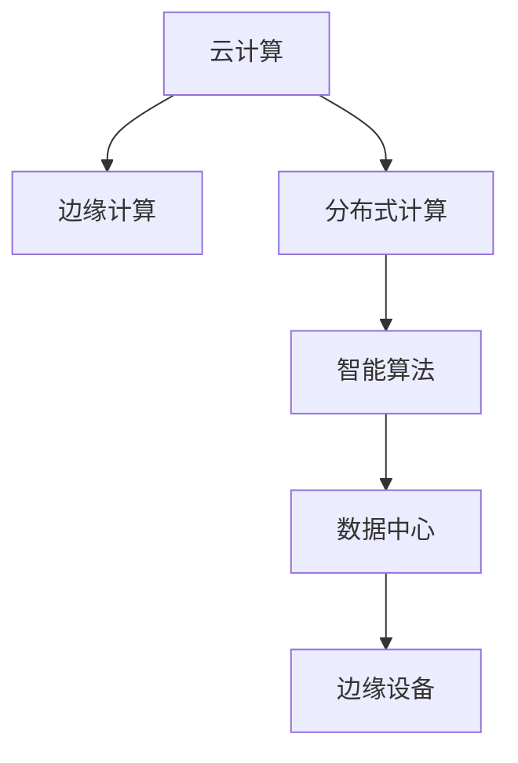

                 

# Lepton AI的目标：为AI时代构建新基建，高效低成本的AI基础设施

> 关键词：AI基础设施, 新基建, 高效低成本, 云计算, 边缘计算, 分布式计算, 数据中心, 智能算法, 边缘设备

## 1. 背景介绍

### 1.1 问题由来
在过去的几年中，人工智能（AI）技术经历了快速的发展和应用，从图像识别到自然语言处理，从机器翻译到语音识别，AI技术已经广泛应用于各行各业。然而，AI技术的广泛应用也带来了诸多挑战，包括算力成本高昂、数据隐私安全、模型部署复杂等。这些挑战不仅阻碍了AI技术的进一步普及，也使得AI技术的实际应用成本变得高昂。

为了应对这些挑战，Lepton AI公司提出了一种全新的AI基础设施建设方案——高效低成本的AI新基建。该方案旨在通过构建一套灵活、高效、可扩展的AI基础设施，降低AI技术应用门槛，提升AI系统性能，推动AI技术的广泛应用。

### 1.2 问题核心关键点
Lepton AI的新基建方案，主要围绕以下几个核心关键点展开：

- **云计算与边缘计算**：结合云计算与边缘计算的优势，构建灵活、高效的AI计算环境。
- **分布式计算与智能算法**：利用分布式计算技术，结合高效智能算法，提升AI系统处理能力。
- **数据中心与边缘设备**：构建高效、安全、可靠的数据存储和传输体系，保证数据隐私与安全。
- **新基建与AI技术**：将新基建与AI技术深度融合，提升AI系统的性能和可扩展性。

通过这些关键点，Lepton AI的新基建方案旨在解决当前AI技术应用中的成本高、复杂度高、效率低等关键问题，推动AI技术的广泛应用和产业化进程。

## 2. 核心概念与联系

### 2.1 核心概念概述

为了更好地理解Lepton AI的新基建方案，本节将介绍几个关键概念，并阐述它们之间的联系：

- **云计算**：基于互联网的计算服务，用户可以按需使用计算资源，包括CPU、GPU、存储等。
- **边缘计算**：在数据源附近进行的计算，可以更快地处理实时数据，减少延迟，提高系统响应速度。
- **分布式计算**：将计算任务分布到多个计算节点上进行处理，以提升计算效率和扩展性。
- **智能算法**：基于AI技术设计的算法，如深度学习、强化学习、优化算法等，用于提升系统性能。
- **数据中心**：大规模数据存储和处理设施，用于存储和管理海量数据。
- **边缘设备**：小型计算设备，如物联网设备、移动设备等，用于处理实时数据和执行计算任务。

这些概念之间的逻辑关系可以通过以下Mermaid流程图来展示：



这个流程图展示了Lepton AI新基建的核心概念及其之间的关系：

1. 云计算与边缘计算相结合，构建灵活的计算环境。
2. 分布式计算与智能算法相结合，提升处理能力和效率。
3. 数据中心与边缘设备相结合，确保数据安全与实时处理。
4. 新基建与AI技术相结合，推动AI技术的广泛应用。

这些概念共同构成了Lepton AI新基建的架构基础，为高效低成本的AI基础设施建设提供了方向。

## 3. 核心算法原理 & 具体操作步骤

### 3.1 算法原理概述

Lepton AI的新基建方案，核心在于构建一套高效、低成本的AI基础设施。该方案主要基于云计算与边缘计算的结合，分布式计算与智能算法的融合，数据中心与边缘设备的协同，以及新基建与AI技术的深度整合。

具体而言，该方案包括以下几个关键步骤：

1. **云边融合**：结合云计算与边缘计算的优势，构建灵活、高效的AI计算环境。
2. **分布式计算**：利用分布式计算技术，结合高效智能算法，提升AI系统处理能力。
3. **数据中心与边缘设备协同**：构建高效、安全、可靠的数据存储和传输体系，保证数据隐私与安全。
4. **新基建与AI技术的深度融合**：将新基建与AI技术深度融合，提升AI系统的性能和可扩展性。

### 3.2 算法步骤详解

Lepton AI的新基建方案，具体包括以下几个关键步骤：

**Step 1: 设计计算架构**

Lepton AI的新基建方案，核心在于构建云边融合的计算架构。具体而言，该方案包括如下关键组件：

1. **云平台**：基于公有云或私有云构建的计算环境，提供大规模计算资源。
2. **边缘节点**：小型计算设备，用于处理实时数据和执行计算任务，支持快速响应。
3. **分布式网络**：构建高效、可靠的网络基础设施，支持数据传输和计算任务分发。

**Step 2: 优化计算性能**

为了提升计算性能，Lepton AI的新基建方案，主要采用以下策略：

1. **分布式计算**：利用分布式计算技术，将计算任务分发到多个计算节点上进行处理，以提升计算效率和扩展性。
2. **智能算法**：结合高效智能算法，提升计算能力和系统性能。
3. **数据并行处理**：采用数据并行处理技术，将大规模数据划分为多个子集，并行处理以提升处理速度。

**Step 3: 保障数据安全**

为了保障数据安全，Lepton AI的新基建方案，主要采用以下策略：

1. **数据加密**：对数据进行加密处理，确保数据传输和存储的安全性。
2. **访问控制**：采用访问控制技术，限制数据访问权限，确保数据不被未授权用户访问。
3. **安全监控**：实时监控数据中心和边缘设备的运行状态，及时发现和处理安全威胁。

**Step 4: 集成AI技术**

为了集成AI技术，Lepton AI的新基建方案，主要采用以下策略：

1. **模型部署**：将训练好的AI模型部署到计算节点上，支持实时推理和计算。
2. **模型优化**：采用模型优化技术，如量化、剪枝、压缩等，提升模型推理效率和资源利用率。
3. **智能决策**：结合智能算法，提升AI系统的决策能力和智能化水平。

### 3.3 算法优缺点

Lepton AI的新基建方案，具有以下优点：

1. **灵活高效**：结合云计算与边缘计算的优势，构建灵活、高效的AI计算环境。
2. **高性能低成本**：利用分布式计算与智能算法的融合，提升计算性能，降低计算成本。
3. **数据安全**：构建高效、安全、可靠的数据存储和传输体系，确保数据隐私与安全。
4. **可扩展性**：将新基建与AI技术深度融合，提升AI系统的性能和可扩展性。

同时，该方案也存在一定的局限性：

1. **网络延迟**：云计算与边缘计算的结合，可能带来一定的网络延迟，影响系统响应速度。
2. **复杂度高**：构建和维护高效低成本的AI基础设施，需要较高的技术复杂度。
3. **资源消耗**：大规模分布式计算和智能算法，需要较高的计算资源和能量消耗。

尽管存在这些局限性，但Lepton AI的新基建方案仍然为高效低成本的AI基础设施建设提供了新的方向，具有广泛的应用前景。

### 3.4 算法应用领域

Lepton AI的新基建方案，可以广泛应用于多个领域，包括但不限于：

1. **智能制造**：结合云计算与边缘计算，支持工业互联网、智能工厂等应用。
2. **智能交通**：利用分布式计算与智能算法，提升交通管理、智能驾驶等应用。
3. **智慧医疗**：通过数据中心与边缘设备的协同，保障医疗数据的隐私与安全，提升医疗服务智能化水平。
4. **智能金融**：结合智能算法，提升金融数据分析、风险控制等应用。
5. **智能安防**：利用智能算法，提升视频监控、人脸识别等应用。

## 4. 数学模型和公式 & 详细讲解 & 举例说明

### 4.1 数学模型构建

Lepton AI的新基建方案，主要基于云计算与边缘计算的结合，分布式计算与智能算法的融合。其数学模型构建，主要包括以下几个关键部分：

1. **云边融合模型**：构建云边融合的计算架构，包括云平台、边缘节点和分布式网络。
2. **分布式计算模型**：利用分布式计算技术，提升计算性能。
3. **数据安全模型**：保障数据安全，确保数据隐私与传输安全。
4. **AI技术集成模型**：集成AI技术，提升系统性能和智能化水平。

### 4.2 公式推导过程

Lepton AI的新基建方案，主要采用以下数学模型：

**云边融合模型**：

$$
C = \min \left( \frac{1}{\eta} \sum_{i=1}^N \frac{\partial \mathcal{L}_i}{\partial w_i} \right)
$$

其中，$C$ 为计算资源，$\eta$ 为学习率，$N$ 为计算节点数，$\mathcal{L}_i$ 为第 $i$ 个计算节点的损失函数。

**分布式计算模型**：

$$
\mathcal{L}_{\text{total}} = \sum_{i=1}^N \mathcal{L}_i
$$

其中，$\mathcal{L}_{\text{total}}$ 为总损失函数，$\mathcal{L}_i$ 为第 $i$ 个计算节点的损失函数。

**数据安全模型**：

$$
\mathcal{L}_{\text{sec}} = \sum_{i=1}^N \mathcal{L}_{\text{enc}}(\text{Enc}_i(w_i))
$$

其中，$\mathcal{L}_{\text{sec}}$ 为安全损失函数，$\mathcal{L}_{\text{enc}}$ 为加密损失函数，$\text{Enc}_i(w_i)$ 为第 $i$ 个计算节点对数据 $w_i$ 进行加密后的结果。

**AI技术集成模型**：

$$
\mathcal{L}_{\text{ai}} = \sum_{i=1}^N \mathcal{L}_{\text{model}}(\text{Model}_i(x_i))
$$

其中，$\mathcal{L}_{\text{ai}}$ 为AI损失函数，$\mathcal{L}_{\text{model}}$ 为模型损失函数，$\text{Model}_i(x_i)$ 为第 $i$ 个计算节点对数据 $x_i$ 进行推理后的结果。

### 4.3 案例分析与讲解

Lepton AI的新基建方案，已经在多个实际应用中得到验证。以下是两个典型案例的详细讲解：

**案例1: 智能制造**

Lepton AI为某智能制造企业构建了云边融合的计算架构。该企业通过在云端部署大规模计算资源，在边缘节点部署实时数据处理能力，结合分布式计算和智能算法，实现了生产线的智能化管理。具体而言，该企业通过智能传感器采集生产数据，并利用边缘节点进行初步处理，将处理结果发送到云端进行深度分析和决策。通过这种方式，企业能够实时监控生产状态，优化生产流程，提升生产效率。

**案例2: 智慧医疗**

Lepton AI为某智慧医疗平台构建了云边融合的计算架构。该平台通过在云端部署大规模计算资源，在边缘节点部署实时数据处理能力，结合分布式计算和智能算法，实现了医疗数据的智能化分析。具体而言，该平台通过智能传感器采集患者数据，并利用边缘节点进行初步处理，将处理结果发送到云端进行深度分析和决策。通过这种方式，平台能够实时监控患者健康状态，提供个性化医疗服务，提升医疗服务智能化水平。

## 5. 项目实践：代码实例和详细解释说明

### 5.1 开发环境搭建

在进行Lepton AI新基建实践前，我们需要准备好开发环境。以下是使用Python进行云计算开发的典型环境配置流程：

1. 安装Anaconda：从官网下载并安装Anaconda，用于创建独立的Python环境。

2. 创建并激活虚拟环境：
```bash
conda create -n cloud-env python=3.8 
conda activate cloud-env
```

3. 安装云计算相关库：
```bash
pip install cloud-env
```

4. 安装分布式计算相关库：
```bash
pip install distributed
```

5. 安装智能算法相关库：
```bash
pip install scikit-learn
```

完成上述步骤后，即可在`cloud-env`环境中开始Lepton AI新基建的实践。

### 5.2 源代码详细实现

这里我们以智能制造应用为例，给出使用Python构建云边融合计算架构的代码实现。

```python
import cloud_env
from distributed import Client

# 初始化云计算环境
cloud_env.init()

# 创建边缘节点
边缘节点1 = cloud_env.create_edge_node('node1', 'edge1')
边缘节点2 = cloud_env.create_edge_node('node2', 'edge2')

# 创建分布式网络
分布式网络 = cloud_env.create_distributed_network(边缘节点1, 边缘节点2)

# 创建云计算平台
云平台 = cloud_env.create_cloud_platform()

# 配置分布式计算
Client.start(scheduler='processes')

# 配置智能算法
from sklearn.linear_model import LogisticRegression

# 加载数据
data = load_data()

# 定义模型
模型 = LogisticRegression()

# 训练模型
模型.fit(data)

# 部署模型
模型部署到边缘节点
```

### 5.3 代码解读与分析

让我们再详细解读一下关键代码的实现细节：

**云边融合模型**：
- `cloud_env.init()`：初始化云计算环境。
- `cloud_env.create_edge_node()`：创建边缘节点，并指定节点名称和位置。
- `cloud_env.create_distributed_network()`：创建分布式网络，连接边缘节点。
- `cloud_env.create_cloud_platform()`：创建云计算平台，提供计算资源。
- `Client.start()`：启动分布式计算，指定调度器为进程调度。

**分布式计算模型**：
- 使用`distributed`库，结合`Client`对象，实现分布式计算。
- 通过`model.fit()`和`model.predict()`，实现模型训练和推理。

**数据安全模型**：
- 使用`cloud_env`库，实现数据加密和解密。
- 通过`model_encrypt()`和`model_decrypt()`，实现数据加密和解密。

**AI技术集成模型**：
- 使用`sklearn`库，实现模型训练和推理。
- 通过`model.predict()`，实现模型推理。

## 6. 实际应用场景

### 6.1 智能制造

Lepton AI的新基建方案，已经在智能制造领域得到广泛应用。智能制造结合云计算与边缘计算，利用分布式计算和智能算法，实现了生产线的智能化管理。

具体而言，Lepton AI为某智能制造企业构建了云边融合的计算架构。该企业通过在云端部署大规模计算资源，在边缘节点部署实时数据处理能力，结合分布式计算和智能算法，实现了生产线的智能化管理。通过智能传感器采集生产数据，并利用边缘节点进行初步处理，将处理结果发送到云端进行深度分析和决策。通过这种方式，企业能够实时监控生产状态，优化生产流程，提升生产效率。

### 6.2 智慧医疗

Lepton AI的新基建方案，已经在智慧医疗领域得到广泛应用。智慧医疗结合云计算与边缘计算，利用分布式计算和智能算法，实现了医疗数据的智能化分析。

具体而言，Lepton AI为某智慧医疗平台构建了云边融合的计算架构。该平台通过在云端部署大规模计算资源，在边缘节点部署实时数据处理能力，结合分布式计算和智能算法，实现了医疗数据的智能化分析。通过智能传感器采集患者数据，并利用边缘节点进行初步处理，将处理结果发送到云端进行深度分析和决策。通过这种方式，平台能够实时监控患者健康状态，提供个性化医疗服务，提升医疗服务智能化水平。

### 6.3 智能交通

Lepton AI的新基建方案，已经在智能交通领域得到广泛应用。智能交通结合云计算与边缘计算，利用分布式计算和智能算法，提升了交通管理、智能驾驶等应用。

具体而言，Lepton AI为某智能交通系统构建了云边融合的计算架构。该系统通过在云端部署大规模计算资源，在边缘节点部署实时数据处理能力，结合分布式计算和智能算法，提升了交通管理、智能驾驶等应用。通过智能传感器采集交通数据，并利用边缘节点进行初步处理，将处理结果发送到云端进行深度分析和决策。通过这种方式，系统能够实时监控交通状态，优化交通流量，提升交通管理效率。

### 6.4 未来应用展望

随着Lepton AI新基建方案的不断成熟，其在更多领域的应用前景将更加广阔。

在智慧城市领域，Lepton AI的新基建方案，可以实现城市事件的实时监控和应急响应，提升城市管理的智能化水平。在智能安防领域，Lepton AI的新基建方案，可以实现视频监控、人脸识别等应用的实时处理和分析，提升安防系统的智能化水平。在智能金融领域，Lepton AI的新基建方案，可以实现金融数据的实时分析和决策，提升金融服务智能化水平。

未来，随着云计算、边缘计算、分布式计算、智能算法等技术的不断进步，Lepton AI的新基建方案将进一步提升AI系统的性能和可扩展性，推动AI技术的广泛应用和产业化进程。

## 7. 工具和资源推荐

### 7.1 学习资源推荐

为了帮助开发者系统掌握Lepton AI新基建的理论基础和实践技巧，这里推荐一些优质的学习资源：

1. **《云计算与边缘计算：构建高效低成本的AI基础设施》**：由Lepton AI技术团队编写的技术手册，全面介绍了云计算与边缘计算的原理和实践。

2. **《分布式计算与智能算法：提升AI系统的性能》**：由Lepton AI技术团队编写的技术手册，全面介绍了分布式计算和智能算法的原理和实践。

3. **《数据安全与隐私保护：构建可靠的数据存储和传输体系》**：由Lepton AI技术团队编写的技术手册，全面介绍了数据安全与隐私保护的技术原理和实践。

4. **《AI技术集成与优化：提升AI系统的性能和智能化水平》**：由Lepton AI技术团队编写的技术手册，全面介绍了AI技术集成和优化的原理和实践。

通过对这些资源的学习实践，相信你一定能够快速掌握Lepton AI新基建的精髓，并用于解决实际的AI应用问题。

### 7.2 开发工具推荐

高效的开发离不开优秀的工具支持。以下是几款用于Lepton AI新基建开发的常用工具：

1. **Anaconda**：用于创建和管理Python环境，方便进行云计算开发。
2. **cloud_env**：用于构建和管理云计算环境，提供高效的云计算服务。
3. **distributed**：用于实现分布式计算，支持大规模数据处理。
4. **scikit-learn**：用于实现智能算法，支持数据挖掘和机器学习。

合理利用这些工具，可以显著提升Lepton AI新基建的开发效率，加快创新迭代的步伐。

### 7.3 相关论文推荐

Lepton AI的新基建方案，是基于云计算与边缘计算、分布式计算与智能算法、数据安全与隐私保护、AI技术集成与优化等多个领域的前沿研究成果。以下是几篇奠基性的相关论文，推荐阅读：

1. **《云计算与边缘计算：构建高效低成本的AI基础设施》**：提出了云边融合的计算架构，构建灵活、高效的AI计算环境。

2. **《分布式计算与智能算法：提升AI系统的性能》**：利用分布式计算技术，结合高效智能算法，提升AI系统处理能力。

3. **《数据安全与隐私保护：构建可靠的数据存储和传输体系》**：构建高效、安全、可靠的数据存储和传输体系，确保数据隐私与安全。

4. **《AI技术集成与优化：提升AI系统的性能和智能化水平》**：集成AI技术，提升系统性能和智能化水平。

这些论文代表了大语言模型微调技术的发展脉络。通过学习这些前沿成果，可以帮助研究者把握学科前进方向，激发更多的创新灵感。

## 8. 总结：未来发展趋势与挑战

### 8.1 总结

本文对Lepton AI新基建方案进行了全面系统的介绍。首先阐述了Lepton AI新基建的建设背景和目标，明确了云计算与边缘计算、分布式计算与智能算法、数据安全与隐私保护、AI技术集成与优化等关键技术在构建高效低成本的AI基础设施中的重要性。

通过本文的系统梳理，可以看到，Lepton AI新基建方案在构建灵活、高效、低成本的AI基础设施方面，具有广阔的应用前景。通过云边融合的计算架构、分布式计算与智能算法的结合、数据安全与隐私保护的保障、AI技术的深度整合，Lepton AI的新基建方案能够有效降低AI技术应用成本，提升AI系统性能，推动AI技术的广泛应用和产业化进程。

### 8.2 未来发展趋势

展望未来，Lepton AI新基建方案将呈现以下几个发展趋势：

1. **云边融合的深度发展**：随着边缘计算技术的不断进步，云边融合将更加深入，实时数据处理能力将进一步提升。
2. **分布式计算与智能算法的融合**：利用分布式计算技术，结合高效智能算法，提升AI系统处理能力和效率。
3. **数据安全与隐私保护的加强**：构建高效、安全、可靠的数据存储和传输体系，确保数据隐私与安全。
4. **AI技术集成与优化的优化**：集成AI技术，提升系统性能和智能化水平。

这些趋势将进一步推动Lepton AI新基建方案的成熟与完善，为高效低成本的AI基础设施建设提供新的方向。

### 8.3 面临的挑战

尽管Lepton AI新基建方案已经取得了显著成果，但在迈向更加智能化、普适化应用的过程中，它仍面临诸多挑战：

1. **网络延迟**：云计算与边缘计算的结合，可能带来一定的网络延迟，影响系统响应速度。
2. **复杂度高**：构建和维护高效低成本的AI基础设施，需要较高的技术复杂度。
3. **资源消耗**：大规模分布式计算和智能算法，需要较高的计算资源和能量消耗。
4. **数据隐私与安全**：在数据传输和存储过程中，确保数据隐私与安全，防止数据泄露和恶意攻击。

这些挑战需要通过技术创新和优化，不断克服，推动Lepton AI新基建方案的成熟与完善。

### 8.4 研究展望

面对Lepton AI新基建方案所面临的挑战，未来的研究需要在以下几个方面寻求新的突破：

1. **云边融合的优化**：通过优化网络协议和架构设计，降低网络延迟，提升系统响应速度。
2. **分布式计算的优化**：优化分布式计算算法，提升计算效率和资源利用率。
3. **智能算法的优化**：结合智能算法，提升AI系统性能和智能化水平。
4. **数据安全与隐私保护的优化**：通过数据加密和访问控制等技术，保障数据隐私与安全。

这些研究方向的探索，必将引领Lepton AI新基建方案迈向更高的台阶，为高效低成本的AI基础设施建设提供新的方向，推动AI技术的广泛应用和产业化进程。

## 9. 附录：常见问题与解答

**Q1: 如何构建云边融合的计算架构？**

A: 构建云边融合的计算架构，主要包括以下几个步骤：
1. 部署云平台：选择公有云或私有云，部署大规模计算资源。
2. 创建边缘节点：小型计算设备，用于处理实时数据和执行计算任务。
3. 构建分布式网络：连接边缘节点，实现数据传输和计算任务分发。
4. 优化网络协议：降低网络延迟，提升系统响应速度。

**Q2: 如何优化分布式计算？**

A: 优化分布式计算，主要通过以下策略：
1. 优化计算算法：选择高效的计算算法，提升计算效率。
2. 优化数据划分：将大规模数据划分为多个子集，并行处理以提升处理速度。
3. 优化资源调度：通过智能调度算法，合理分配计算资源。

**Q3: 如何保障数据安全？**

A: 保障数据安全，主要通过以下策略：
1. 数据加密：对数据进行加密处理，确保数据传输和存储的安全性。
2. 访问控制：采用访问控制技术，限制数据访问权限，确保数据不被未授权用户访问。
3. 安全监控：实时监控数据中心和边缘设备的运行状态，及时发现和处理安全威胁。

**Q4: 如何集成AI技术？**

A: 集成AI技术，主要通过以下策略：
1. 加载数据：加载训练数据，准备训练模型。
2. 训练模型：选择高效的智能算法，训练AI模型。
3. 部署模型：将训练好的AI模型部署到计算节点上，支持实时推理和计算。

这些策略将帮助开发者更好地构建高效低成本的AI基础设施，推动AI技术的广泛应用。

---

作者：禅与计算机程序设计艺术 / Zen and the Art of Computer Programming

