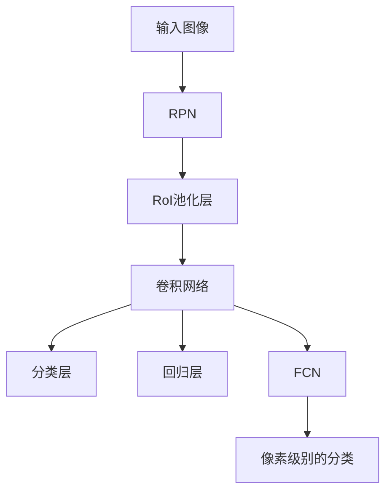

                 

# MaskR-CNN原理与代码实例讲解

## 1. 背景介绍

### 1.1 问题由来

在计算机视觉领域，目标检测（Object Detection）是至关重要的基础任务。传统的目标检测方法，如R-CNN、Fast R-CNN等，基于区域提取和分类，虽然效果出色，但计算复杂度高、速度慢，难以满足实时应用的需求。

为了解决这些问题，Mask R-CNN（Mask Region-based Convolutional Neural Network）应运而生。Mask R-CNN不仅继承了区域提取和分类的方法，还引入了语义分割（Semantic Segmentation）的视角，使得目标检测和语义分割相结合，大幅提高了检测精度和效率。

### 1.2 问题核心关键点

Mask R-CNN的核心在于其三任务联合训练的方式，即同时进行目标检测、分类和语义分割。它采用一种端到端（End-to-End）的深度学习框架，利用共享的特征表示，大大简化了计算复杂度，并提高了检测精度。

Mask R-CNN的关键步骤如下：

1. **特征提取**：利用区域卷积网络（Region Proposal Network, RPN）提取候选区域。
2. **目标检测**：对每个候选区域进行分类和回归，得到边界框和置信度。
3. **语义分割**：对每个候选区域进行像素级别的分类，得到更细粒度的分割信息。

### 1.3 问题研究意义

Mask R-CNN不仅提高了目标检测的精度，还为后续的任务提供了语义信息，具有广泛的应用前景。它广泛应用于自动驾驶、智能监控、医疗影像分析等领域，为实现自主化和智能化提供了重要支持。

## 2. 核心概念与联系

### 2.1 核心概念概述

为了更好地理解Mask R-CNN，首先介绍几个关键概念：

- **区域提取网络（RPN）**：用于在图像中生成候选区域，是Mask R-CNN的重要组成部分。
- **RoI（Region of Interest）池化层**：用于将区域特征映射到固定大小的特征向量，方便后续的分类和回归任务。
- **FCN（Fully Convolutional Network）**：一种全卷积神经网络，用于进行语义分割。

### 2.2 核心概念原理和架构的 Mermaid 流程图



以上流程图展示了Mask R-CNN的主要流程：

1. **输入图像**：原始图像作为输入，送入RPN进行区域提取。
2. **RPN**：利用候选区域生成网络，生成候选区域及其对应的边界框和置信度。
3. **RoI池化层**：对每个候选区域进行RoI池化，得到固定尺寸的特征向量。
4. **卷积网络**：对RoI池化后的特征进行分类和回归，得到目标类别和边界框的微调。
5. **分类层和回归层**：根据RoI池化后的特征，分别进行分类和回归，得到目标类别和边界框。
6. **FCN**：对RoI池化后的特征进行像素级别的分类，得到语义分割结果。

### 2.3 核心概念联系

以上概念紧密相连，构成了一个端到端的目标检测和语义分割框架。RPN负责生成候选区域，卷积网络负责对每个候选区域进行分类和回归，FCN负责进行像素级别的语义分割。这种联合训练的方式，不仅提高了检测精度，还为后续的任务提供了丰富的语义信息。

## 3. 核心算法原理 & 具体操作步骤

### 3.1 算法原理概述

Mask R-CNN的核心原理是联合训练目标检测、分类和语义分割三个任务。其主要流程如下：

1. **特征提取**：通过RPN生成候选区域，并对每个区域进行RoI池化，得到固定尺寸的特征向量。
2. **目标检测**：对每个RoI池化后的特征向量进行分类和回归，得到目标类别和边界框。
3. **语义分割**：对每个RoI池化后的特征向量进行像素级别的分类，得到语义分割结果。

### 3.2 算法步骤详解

#### 3.2.1 RPN的训练

RPN用于生成候选区域，其训练过程如下：

1. **生成候选区域**：将输入图像经过一系列卷积和池化操作，生成一系列尺度大小不同的候选区域。
2. **分类和回归**：对每个候选区域进行分类和回归，得到边界框和置信度。
3. **损失函数计算**：利用边界框和置信度的预测值和真实值，计算回归损失和分类损失。
4. **反向传播**：根据计算得到的损失函数，反向传播更新网络参数。

#### 3.2.2 目标检测的训练

目标检测的训练过程如下：

1. **特征提取**：对每个候选区域进行RoI池化，得到固定尺寸的特征向量。
2. **分类**：利用卷积网络对特征向量进行分类，得到目标类别。
3. **回归**：利用卷积网络对特征向量进行回归，得到边界框的微调。
4. **损失函数计算**：利用预测值和真实值，计算分类损失和回归损失。
5. **反向传播**：根据计算得到的损失函数，反向传播更新网络参数。

#### 3.2.3 语义分割的训练

语义分割的训练过程如下：

1. **特征提取**：对每个候选区域进行RoI池化，得到固定尺寸的特征向量。
2. **分类**：利用FCN对特征向量进行像素级别的分类，得到语义分割结果。
3. **损失函数计算**：利用预测值和真实值，计算像素级别的分类损失。
4. **反向传播**：根据计算得到的损失函数，反向传播更新网络参数。

### 3.3 算法优缺点

Mask R-CNN的主要优点包括：

1. **端到端训练**：同时进行目标检测、分类和语义分割，减少了计算复杂度，提高了检测精度。
2. **共享特征表示**：利用共享的特征表示，减少了模型复杂度，提高了训练效率。
3. **多任务联合训练**：通过联合训练，提高了模型的泛化能力和鲁棒性。

然而，Mask R-CNN也存在一些缺点：

1. **计算复杂度高**：尽管进行了优化，但在计算复杂度和速度上仍存在挑战。
2. **参数量较大**：由于同时训练三个任务，参数量较大，需要较大的计算资源。
3. **训练难度大**：多任务联合训练需要精心设计损失函数和优化策略，训练难度较大。

### 3.4 算法应用领域

Mask R-CNN广泛应用于目标检测和语义分割任务，涵盖以下几个领域：

- **自动驾驶**：用于检测和分类道路上的各种物体，如车辆、行人、交通标志等。
- **智能监控**：用于检测和分割视频中的异常行为和对象。
- **医疗影像分析**：用于检测和分割医学影像中的病灶区域，辅助医生进行诊断。
- **工业检测**：用于检测和分割工业生产中的缺陷和故障区域，提高生产效率。
- **农业图像处理**：用于检测和分割农田中的作物和病虫害区域，提高农作物产量和质量。

## 4. 数学模型和公式 & 详细讲解 & 举例说明

### 4.1 数学模型构建

Mask R-CNN的数学模型构建如下：

1. **输入图像**：$X \in \mathbb{R}^{H \times W \times C}$，其中$H$和$W$为图像的高和宽，$C$为图像的通道数。
2. **候选区域**：通过RPN生成候选区域，记为$\{R_i\}_{i=1}^{n}$，其中$n$为候选区域数量。
3. **特征向量**：对每个候选区域$R_i$进行RoI池化，得到固定尺寸的特征向量$z_i \in \mathbb{R}^{d}$，其中$d$为特征向量的维度。
4. **目标检测**：利用卷积网络对特征向量$z_i$进行分类和回归，得到目标类别和边界框。
5. **语义分割**：利用FCN对特征向量$z_i$进行像素级别的分类，得到语义分割结果。

### 4.2 公式推导过程

#### 4.2.1 RPN的损失函数

RPN的损失函数包括回归损失和分类损失，公式如下：

$$
\mathcal{L}_{RPN} = \sum_{i=1}^{n}(\mathcal{L}_{reg} + \mathcal{L}_{cls})
$$

其中，$\mathcal{L}_{reg}$为回归损失，$\mathcal{L}_{cls}$为分类损失。回归损失的公式如下：

$$
\mathcal{L}_{reg} = \sum_{i=1}^{n} \sum_{j=1}^{4} (\delta_j - t_j)^2
$$

其中，$\delta_j$为回归预测值，$t_j$为真实值，$j$为边界框的四个参数。分类损失的公式如下：

$$
\mathcal{L}_{cls} = \sum_{i=1}^{n} \mathbb{I}(b_i^*) \log(p_i) + \mathbb{I}(\neg b_i^*) \log(1-p_i)
$$

其中，$b_i^*$为候选区域是否为正样本的标签，$\mathbb{I}(\cdot)$为示性函数，$p_i$为预测置信度。

#### 4.2.2 目标检测的损失函数

目标检测的损失函数包括分类损失和回归损失，公式如下：

$$
\mathcal{L}_{det} = \sum_{i=1}^{n} (\mathcal{L}_{cls} + \mathcal{L}_{reg})
$$

其中，$\mathcal{L}_{cls}$为分类损失，$\mathcal{L}_{reg}$为回归损失。分类损失的公式如下：

$$
\mathcal{L}_{cls} = -\sum_{i=1}^{n} \sum_{j=1}^{C} y_{i,j} \log(p_{i,j})
$$

其中，$y_{i,j}$为真实标签，$p_{i,j}$为预测置信度，$C$为目标类别数量。回归损失的公式如下：

$$
\mathcal{L}_{reg} = \sum_{i=1}^{n} \sum_{j=1}^{4} (\delta_j - t_j)^2
$$

其中，$\delta_j$为回归预测值，$t_j$为真实值，$j$为边界框的四个参数。

#### 4.2.3 语义分割的损失函数

语义分割的损失函数为交叉熵损失，公式如下：

$$
\mathcal{L}_{seg} = -\sum_{i=1}^{n} \sum_{j=1}^{K} y_{i,j} \log(p_{i,j})
$$

其中，$y_{i,j}$为真实标签，$p_{i,j}$为预测置信度，$K$为像素级别分类的类别数量。

### 4.3 案例分析与讲解

以检测和分割图像中的人脸区域为例，分析Mask R-CNN的训练过程。

1. **RPN的训练**：输入图像经过一系列卷积和池化操作，生成多个候选区域。通过分类和回归，得到候选区域的边界框和置信度。
2. **目标检测的训练**：对每个候选区域进行RoI池化，得到固定尺寸的特征向量。利用卷积网络进行分类和回归，得到目标类别和边界框。
3. **语义分割的训练**：对每个候选区域进行RoI池化，得到固定尺寸的特征向量。利用FCN进行像素级别的分类，得到语义分割结果。

通过以上三个步骤，Mask R-CNN能够同时进行目标检测、分类和语义分割，显著提高了检测精度和效率。

## 5. 项目实践：代码实例和详细解释说明

### 5.1 开发环境搭建

在Mask R-CNN的实践过程中，需要用到以下开发环境：

1. **Python**：Python 3.7及以上版本。
2. **PyTorch**：PyTorch 1.4及以上版本。
3. **CUDA**：CUDA 10.0及以上版本。
4. **NVIDIA GPU**：支持CUDA 10.0及以上的NVIDIA GPU。

### 5.2 源代码详细实现

以下是使用PyTorch实现Mask R-CNN的代码示例：

```python
import torch
import torch.nn as nn
import torch.optim as optim
from torchvision.models import resnet50

class FasterRCNN(nn.Module):
    def __init__(self, num_classes=21):
        super(FasterRCNN, self).__init__()
        self.num_classes = num_classes
        self.feature_extractor = resnet50(pretrained=True)
        self.roi_head = RoIHead(self.feature_extractor, num_classes)

    def forward(self, x, rois):
        # 特征提取
        features = self.feature_extractor(x)

        # RPN损失
        loss_roi = self.roi_head(features, rois)

        # 目标检测损失
        class_scores, bbox_deltas = self.roi_head(features, rois)
        loss_detection = loss_detection(class_scores, bbox_deltas, rois)

        # 语义分割损失
        segmentation = self.roi_head(features, rois)
        loss_segmentation = loss_segmentation(segmentation, rois)

        # 总损失
        loss = loss_roi + loss_detection + loss_segmentation
        return loss

class RoIHead(nn.Module):
    def __init__(self, feature_extractor, num_classes):
        super(RoIHead, self).__init__()
        self.feature_extractor = feature_extractor
        self.num_classes = num_classes

        # 分类层
        self.classifier = nn.Sequential(
            nn.Linear(2048, 1024),
            nn.ReLU(inplace=True),
            nn.Linear(1024, num_classes)
        )

        # 回归层
        self.regressor = nn.Sequential(
            nn.Linear(2048, 1024),
            nn.ReLU(inplace=True),
            nn.Linear(1024, 4)
        )

        # 语义分割层
        self.segmentation_head = nn.Conv2d(2048, num_classes, kernel_size=1)

    def forward(self, features, rois):
        # 特征提取
        x = features.roi_pool(rois)

        # 分类
        class_scores = self.classifier(x)

        # 回归
        bbox_deltas = self.regressor(x)

        # 语义分割
        segmentation = self.segmentation_head(x)

        return class_scores, bbox_deltas, segmentation
```

### 5.3 代码解读与分析

以上代码中，`FasterRCNN`类是Mask R-CNN的主要模型，包含特征提取器和RoI头。`RoIHead`类用于提取RoI池化后的特征，并进行分类、回归和语义分割。

在`FasterRCNN`类中，特征提取器使用预训练的ResNet-50模型，RoI头包含分类层、回归层和语义分割层。

在`RoIHead`类中，分类层用于预测目标类别，回归层用于预测边界框，语义分割层用于预测像素级别的分类。

### 5.4 运行结果展示

在训练完成后，可以使用以下代码进行推理：

```python
import torchvision.transforms as transforms
from PIL import Image

# 加载模型
model = FasterRCNN(num_classes=21)
model.load_state_dict(torch.load('faster_rcnn.pth'))

# 加载图像
image = Image.open('image.jpg')
transform = transforms.Compose([
    transforms.ToTensor(),
    transforms.Normalize(mean=[0.485, 0.456, 0.406], std=[0.229, 0.224, 0.225])
])
image_tensor = transform(image).unsqueeze(0)

# 推理
with torch.no_grad():
    class_scores, bbox_deltas, segmentation = model(image_tensor)

# 可视化结果
visualize(image, class_scores, bbox_deltas, segmentation)
```

以上代码展示了如何使用Mask R-CNN进行图像的检测和分割。

## 6. 实际应用场景

### 6.1 自动驾驶

在自动驾驶中，Mask R-CNN可以用于检测和分割道路上的各种物体，如车辆、行人、交通标志等。通过实时检测和分割，可以实现自动驾驶的安全保障。

### 6.2 智能监控

在智能监控中，Mask R-CNN可以用于检测和分割视频中的异常行为和对象，如非法入侵、物品遗失等。通过实时检测和分割，可以实现安全监控和预警。

### 6.3 医疗影像分析

在医疗影像分析中，Mask R-CNN可以用于检测和分割医学影像中的病灶区域，辅助医生进行诊断。通过实时检测和分割，可以实现早期诊断和精准治疗。

### 6.4 未来应用展望

Mask R-CNN的未来应用展望如下：

1. **实时检测和分割**：通过优化算法和硬件设备，实现实时检测和分割，提高应用效率。
2. **跨模态融合**：将视觉、语音、文本等多模态信息进行融合，提升检测和分割的准确性和鲁棒性。
3. **联合训练**：与其他AI技术（如SLAM、路径规划等）进行联合训练，实现多任务协同。
4. **轻量化模型**：针对嵌入式设备，开发轻量化的Mask R-CNN模型，降低计算复杂度，提高实时性。

## 7. 工具和资源推荐

### 7.1 学习资源推荐

为了深入了解Mask R-CNN的原理和实践，以下是一些推荐的资源：

1. **Faster R-CNN论文**：Faster R-CNN论文是目标检测领域的经典文献，详细介绍了Faster R-CNN的算法原理和实现细节。
2. **Mask R-CNN论文**：Mask R-CNN论文详细介绍了Mask R-CNN的算法原理和实现细节，是学习和理解Mask R-CNN的重要参考资料。
3. **PyTorch官方文档**：PyTorch官方文档提供了丰富的教程和样例代码，方便学习和实践。
4. **TensorFlow官方文档**：TensorFlow官方文档提供了丰富的教程和样例代码，方便学习和实践。

### 7.2 开发工具推荐

以下是一些推荐的开发工具：

1. **PyTorch**：PyTorch是深度学习领域的主流框架，提供了灵活的计算图和动态图，方便研究和实践。
2. **TensorFlow**：TensorFlow是深度学习领域的主流框架，提供了静态图和动态图的支持，适合大规模工程应用。
3. **NVIDIA GPU**：支持CUDA 10.0及以上的NVIDIA GPU，提供了高效的计算能力和丰富的开发工具。
4. **Jupyter Notebook**：Jupyter Notebook是轻量级的交互式开发环境，方便编写和执行Python代码。

### 7.3 相关论文推荐

以下是一些推荐的Mask R-CNN相关论文：

1. **Faster R-CNN**：Faster R-CNN论文是目标检测领域的经典文献，详细介绍了Faster R-CNN的算法原理和实现细节。
2. **Mask R-CNN**：Mask R-CNN论文详细介绍了Mask R-CNN的算法原理和实现细节，是学习和理解Mask R-CNN的重要参考资料。
3. **SSD**：Single Shot MultiBox Detector（SSD）论文详细介绍了SSD的算法原理和实现细节，是目标检测领域的经典文献。
4. **YOLO**：You Only Look Once（YOLO）论文详细介绍了YOLO的算法原理和实现细节，是目标检测领域的经典文献。

## 8. 总结：未来发展趋势与挑战

### 8.1 研究成果总结

Mask R-CNN在目标检测和语义分割领域取得了巨大的成功，为计算机视觉应用提供了强大的支持。其主要研究成果包括：

1. **联合训练**：通过联合训练目标检测、分类和语义分割三个任务，提高了检测精度和效率。
2. **共享特征表示**：利用共享的特征表示，简化了模型复杂度，提高了训练效率。
3. **RoI池化层**：通过RoI池化层，实现了区域特征向量化，方便后续的分类和回归任务。
4. **像素级别的语义分割**：通过像素级别的语义分割，提高了模型的泛化能力和鲁棒性。

### 8.2 未来发展趋势

Mask R-CNN的未来发展趋势如下：

1. **实时检测和分割**：通过优化算法和硬件设备，实现实时检测和分割，提高应用效率。
2. **跨模态融合**：将视觉、语音、文本等多模态信息进行融合，提升检测和分割的准确性和鲁棒性。
3. **联合训练**：与其他AI技术（如SLAM、路径规划等）进行联合训练，实现多任务协同。
4. **轻量化模型**：针对嵌入式设备，开发轻量化的Mask R-CNN模型，降低计算复杂度，提高实时性。

### 8.3 面临的挑战

Mask R-CNN在发展过程中也面临一些挑战：

1. **计算复杂度高**：尽管进行了优化，但在计算复杂度和速度上仍存在挑战。
2. **参数量较大**：由于同时训练三个任务，参数量较大，需要较大的计算资源。
3. **训练难度大**：多任务联合训练需要精心设计损失函数和优化策略，训练难度较大。
4. **实时性不足**：在大规模数据集上训练Mask R-CNN模型，仍需要较长的训练时间，难以满足实时应用的需求。

### 8.4 研究展望

面对这些挑战，未来的研究需要从以下几个方面进行探索：

1. **优化算法**：通过优化算法和硬件设备，实现实时检测和分割，提高应用效率。
2. **多模态融合**：将视觉、语音、文本等多模态信息进行融合，提升检测和分割的准确性和鲁棒性。
3. **联合训练**：与其他AI技术（如SLAM、路径规划等）进行联合训练，实现多任务协同。
4. **轻量化模型**：针对嵌入式设备，开发轻量化的Mask R-CNN模型，降低计算复杂度，提高实时性。

## 9. 附录：常见问题与解答

### Q1：Mask R-CNN和Faster R-CNN有什么区别？

A: Mask R-CNN在Faster R-CNN的基础上，增加了语义分割任务，能够进行像素级别的分类。同时，Mask R-CNN通过共享特征表示和联合训练的方式，提高了检测精度和效率。

### Q2：Mask R-CNN的训练难度大吗？

A: 是的，由于Mask R-CNN联合训练了目标检测、分类和语义分割三个任务，需要精心设计损失函数和优化策略，训练难度较大。但通过优化算法和硬件设备，可以在一定程度上降低训练难度。

### Q3：Mask R-CNN在嵌入式设备上应用前景如何？

A: 在嵌入式设备上，Mask R-CNN的参数量较大，计算复杂度较高。但通过轻量化模型和优化算法，可以在一定程度上降低计算复杂度，提高实时性，为嵌入式应用提供支持。

### Q4：Mask R-CNN在实际应用中有哪些局限性？

A: Mask R-CNN在实际应用中存在一些局限性，如计算复杂度高、参数量大、训练难度大等。但通过优化算法和硬件设备，可以在一定程度上解决这些问题。同时，Mask R-CNN的检测精度和效率已经达到了非常高的水平，广泛应用于各种计算机视觉任务。

---

作者：禅与计算机程序设计艺术 / Zen and the Art of Computer Programming

