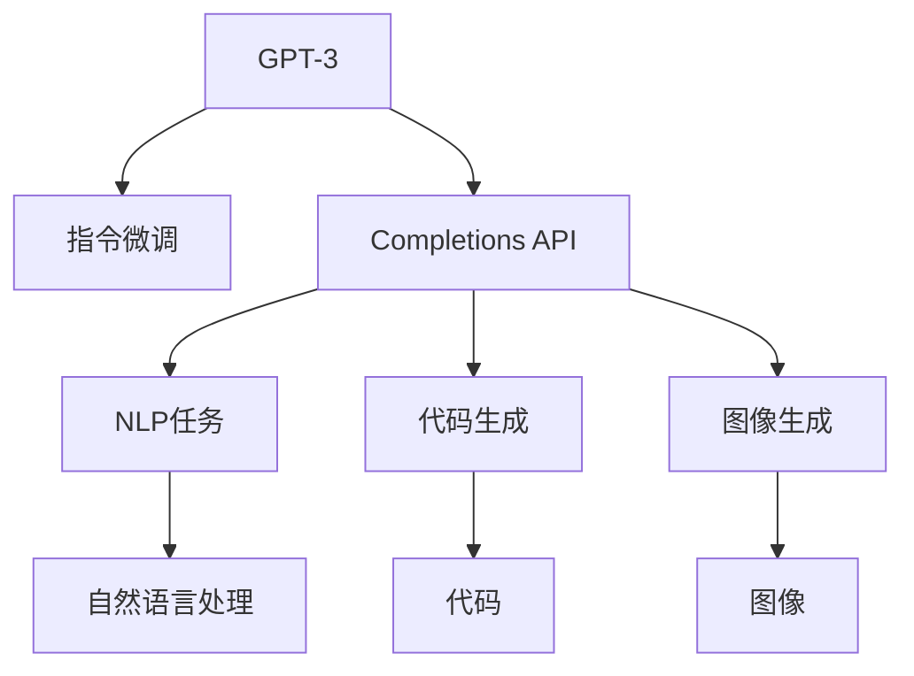

                 

# OpenAI Completions API

> 关键词：OpenAI, Completions API, 自然语言处理(NLP), 代码生成, 自动补全, GPT-3, 应用程序接口(API), 人工智能(AI)

## 1. 背景介绍

### 1.1 问题由来

OpenAI作为全球领先的人工智能公司，近年来推出了多项突破性的AI技术。其中，OpenAI Completions API（以下简称Completions API）是一项旨在生成文本、代码和图像的API服务，为开发人员提供了一种快速、高效、灵活的方式来处理自然语言处理(NLP)、代码生成和图像生成等任务。

Completions API的核心是基于GPT-3（Generative Pre-trained Transformer 3）的深度学习模型，该模型通过自监督预训练和指令微调（Instruction Fine-tuning），能够理解和执行自然语言指令，生成符合人类期望的文本、代码和图像输出。

随着OpenAI Completions API的推出，越来越多的开发者和研究者开始利用这一强大的工具，将AI技术引入到各种应用场景中，如自动摘要、文本生成、代码补全、图像描述等。

### 1.2 问题核心关键点

OpenAI Completions API的核心在于其生成的自然语言文本、代码和图像的精度和流畅度，以及如何更好地应用于实际应用场景。具体包括以下几个关键点：

- **精度和流畅度**：Completions API生成的文本、代码和图像的准确性和自然度是衡量其性能的重要指标。
- **可控性**：开发人员可以控制Completions API生成内容的具体形式和风格，如代码风格、文本情感等。
- **应用场景的适应性**：Completions API在处理不同类型的数据和任务时，需要具备一定的灵活性和适应性。
- **API的使用**：如何有效地利用Completions API，并将其集成到自己的应用程序中。

## 2. 核心概念与联系

### 2.1 核心概念概述

要深入理解OpenAI Completions API，需要先了解以下几个核心概念：

- **GPT-3**：基于Transformer架构的预训练语言模型，拥有25亿参数，能够在自然语言生成、语言推理、机器翻译等多个NLP任务上取得优异表现。
- **指令微调**：将GPT-3作为初始化参数，通过有监督学习优化模型，使其能够理解和执行自然语言指令。
- **Completions API**：OpenAI提供的一款API服务，允许开发者通过API接口调用GPT-3进行自然语言处理、代码生成和图像生成等任务。
- **自然语言处理(NLP)**：涉及文本数据的处理、分析和生成，是OpenAI Completions API的主要应用领域之一。
- **代码生成**：利用自然语言生成技术，自动编写符合特定要求的代码片段，如编写Python代码、Java代码等。
- **图像生成**：通过自然语言描述，生成符合描述的图像内容，如绘制图表、生成艺术作品等。

这些概念之间的联系可以通过以下Mermaid流程图来展示：



这个流程图展示了GPT-3与OpenAI Completions API之间的逻辑关系，以及API在处理NLP任务、代码生成和图像生成等方面的应用。

## 3. 核心算法原理 & 具体操作步骤

### 3.1 算法原理概述

OpenAI Completions API的生成过程主要基于GPT-3模型的自回归生成机制，即通过前文信息预测后文内容。具体来说，Completions API会根据输入的文本、代码或图像描述，生成符合人类期望的输出。

生成过程可以分为以下几步：

1. **输入准备**：将输入的文本、代码或图像描述转换为模型能够接受的格式，如token序列、label序列等。
2. **模型前向传播**：将输入传递给GPT-3模型，进行前向传播计算，得到模型输出。
3. **后向传播**：根据模型输出和目标输出之间的差异，进行反向传播，计算梯度。
4. **参数更新**：利用梯度下降等优化算法，更新模型参数，使得模型输出更接近目标输出。

### 3.2 算法步骤详解

#### 3.2.1 输入准备

对于不同类型的输入，Completions API有不同的处理方式。以文本输入为例，具体的步骤包括：

1. **分词**：将输入的文本序列进行分词处理，生成token序列。
2. **编码**：将分词后的token序列转换为模型能够接受的向量形式，如嵌入向量。
3. **构建输入序列**：将编码后的向量按照一定的格式组合成输入序列，包括token序列和控制信息（如提示文本）。

#### 3.2.2 模型前向传播

前向传播是Completions API的核心步骤，具体流程如下：

1. **初始化模型**：将模型参数加载到GPU或TPU等设备上，准备进行前向传播。
2. **输入序列传递**：将准备好的输入序列传递给模型，进行前向传播计算。
3. **计算输出**：根据输入序列和控制信息，模型生成符合人类期望的输出序列。

#### 3.2.3 后向传播和参数更新

后向传播和参数更新的过程如下：

1. **损失计算**：根据模型输出和目标输出之间的差异，计算损失函数。
2. **反向传播**：根据损失函数，计算梯度，并将梯度反向传播到模型参数。
3. **参数更新**：利用优化算法（如AdamW、RMSprop等）更新模型参数，使得模型输出更接近目标输出。

### 3.3 算法优缺点

#### 3.3.1 优点

OpenAI Completions API具有以下优点：

1. **高效灵活**：开发人员可以通过API接口，快速调用GPT-3模型，处理各种NLP任务和生成任务。
2. **精度高**：基于GPT-3的模型，拥有25亿参数，生成的文本、代码和图像精度高、自然流畅。
3. **可控性强**：开发人员可以控制模型的生成方式和输出内容，如指定代码风格、情感倾向等。

#### 3.3.2 缺点

OpenAI Completions API也存在一些缺点：

1. **依赖API接口**：Completions API的使用依赖OpenAI的API接口，需要网络连接和API密钥。
2. **费用较高**：使用Completions API需要支付一定的费用，根据使用的API次数和API功能，费用会有所不同。
3. **模型偏见**：GPT-3模型可能存在一些固有的偏见，需要开发人员在应用中进行注意和纠正。

### 3.4 算法应用领域

OpenAI Completions API的应用领域非常广泛，主要包括：

1. **自然语言处理(NLP)**：自动生成文本摘要、翻译、总结等任务。
2. **代码生成**：自动生成符合特定要求的代码片段，如编写Python、Java代码等。
3. **图像生成**：根据文本描述，自动生成图像内容，如绘制图表、生成艺术作品等。
4. **文本分类**：自动分类文本内容，如情感分析、主题分类等。
5. **对话系统**：自动生成符合用户意图的对话内容，如智能客服、聊天机器人等。
6. **数据增强**：利用自然语言生成技术，生成更多的训练数据，提升模型性能。

## 4. 数学模型和公式 & 详细讲解 & 举例说明

### 4.1 数学模型构建

OpenAI Completions API的生成过程基于GPT-3模型，该模型通过自回归生成机制，可以处理自然语言指令。具体来说，GPT-3模型可以将输入的文本、代码或图像描述转换为模型能够接受的向量形式，并进行前向传播计算，最终生成符合人类期望的输出。

### 4.2 公式推导过程

以文本生成为例，假设输入的文本序列为 $x_1, x_2, ..., x_T$，模型生成的文本序列为 $\hat{y}_1, \hat{y}_2, ..., \hat{y}_T$，则模型输出的概率分布可以表示为：

$$
P(\hat{y}_t|x_1, x_2, ..., x_{t-1}) = \frac{\exp(\mathrm{score}(x_1, x_2, ..., x_{t-1}, \hat{y}_t))}{\sum_{y_t \in V} \exp(\mathrm{score}(x_1, x_2, ..., x_{t-1}, y_t))}
$$

其中，$\mathrm{score}(x_1, x_2, ..., x_{t-1}, \hat{y}_t)$ 表示模型对输入序列和生成文本之间的匹配度，可以使用Transformer模型中的自注意力机制计算。

### 4.3 案例分析与讲解

以下是一个简单的案例分析，假设我们希望使用Completions API自动生成Python代码：

输入的文本提示为：

```python
def add_numbers(a, b):
    return a + b
```

希望自动补全如下内容：

```python
def add_numbers(a, b):
    return a + b + c
```

具体的实现步骤如下：

1. **输入准备**：将输入的文本提示转换为token序列，并添加控制信息。
2. **模型前向传播**：将准备好的输入序列传递给GPT-3模型，进行前向传播计算。
3. **后向传播和参数更新**：根据模型输出和目标输出之间的差异，计算损失函数并进行反向传播，更新模型参数。
4. **输出**：生成符合人类期望的输出序列，即自动补全的代码片段。

最终生成的代码为：

```python
def add_numbers(a, b):
    return a + b + c
```

## 5. 项目实践：代码实例和详细解释说明

### 5.1 开发环境搭建

要使用OpenAI Completions API，首先需要搭建一个开发环境。以下是一些基本的步骤：

1. **安装Python**：确保计算机上已经安装了Python 3.6及以上版本。
2. **安装OpenAI API**：从OpenAI官网下载API密钥，并按照官方文档进行安装。
3. **安装Python库**：安装必要的Python库，如requests、numpy、pandas等。

### 5.2 源代码详细实现

以下是一个使用Python实现的Completions API调用示例：

```python
import requests
import json

def completions_api(query, max_length, temperature=0.9):
    url = "https://api.openai.com/v1/engines/davinci-codex/completions"
    headers = {"Content-Type": "application/json", "Authorization": "Bearer YOUR_API_KEY"}
    params = {
        "prompt": query,
        "max_tokens": max_length,
        "temperature": temperature,
        "stop_token": "\n",
        "n": 1
    }
    response = requests.post(url, headers=headers, json=params)
    if response.status_code == 200:
        return response.json()["choices"][0]["text"]
    else:
        return "Error: " + response.text

# 调用Completions API
query = "def add_numbers(a, b):"
result = completions_api(query, 100, temperature=0.9)
print(result)
```

### 5.3 代码解读与分析

1. **requests库**：用于发送HTTP请求，获取Completions API的响应结果。
2. **json库**：用于解析JSON格式的响应结果。
3. **Completions API的调用**：构造请求参数，发送请求，解析响应结果。

## 6. 实际应用场景

### 6.1 智能客服系统

智能客服系统是Completions API的一个重要应用场景。通过Completions API，客服机器人可以自动理解和回复用户的问题，提升客户咨询体验和效率。

具体实现方式如下：

1. **输入准备**：将用户输入的问题进行分词处理，并添加控制信息。
2. **模型前向传播**：将准备好的输入序列传递给GPT-3模型，进行前向传播计算。
3. **后向传播和参数更新**：根据模型输出和目标输出之间的差异，计算损失函数并进行反向传播，更新模型参数。
4. **输出**：生成符合人类期望的输出序列，即客服机器人的回复内容。

### 6.2 代码生成工具

Completions API也可以用于开发代码生成工具，帮助开发者快速编写符合要求的代码片段。

具体实现方式如下：

1. **输入准备**：将待编写的代码提示转换为token序列，并添加控制信息。
2. **模型前向传播**：将准备好的输入序列传递给GPT-3模型，进行前向传播计算。
3. **后向传播和参数更新**：根据模型输出和目标输出之间的差异，计算损失函数并进行反向传播，更新模型参数。
4. **输出**：生成符合人类期望的输出序列，即自动补全的代码片段。

### 6.3 图像生成应用

Completions API也可以用于图像生成应用，根据文本描述生成图像内容。

具体实现方式如下：

1. **输入准备**：将文本描述转换为token序列，并添加控制信息。
2. **模型前向传播**：将准备好的输入序列传递给GPT-3模型，进行前向传播计算。
3. **后向传播和参数更新**：根据模型输出和目标输出之间的差异，计算损失函数并进行反向传播，更新模型参数。
4. **输出**：生成符合人类期望的输出序列，即生成的图像内容。

## 7. 工具和资源推荐

### 7.1 学习资源推荐

1. **OpenAI官方文档**：OpenAI提供的官方文档详细介绍了Completions API的使用方法和示例。
2. **Python编程指南**：推荐《Python编程：从入门到实践》，了解Python的基础语法和应用场景。
3. **NLP相关书籍**：推荐《深度学习与自然语言处理》，了解NLP的基础理论和经典模型。

### 7.2 开发工具推荐

1. **Python编程语言**：Python作为流行的编程语言，适用于各类开发场景。
2. **Jupyter Notebook**：用于编写和执行代码，支持交互式编程。
3. **Visual Studio Code**：一款轻量级的IDE，支持多种编程语言和插件。

### 7.3 相关论文推荐

1. **《Language Models are Unsupervised Multitask Learners》**：OpenAI发表的论文，介绍了GPT-3模型的训练和应用方法。
2. **《Improving Language Understanding by Generative Pre-training》**：OpenAI发表的论文，介绍了基于自回归模型的预训练方法。
3. **《Text Generation with Transformers》**：DeepMind发表的论文，介绍了Transformer模型在文本生成任务中的应用。

## 8. 总结：未来发展趋势与挑战

### 8.1 总结

OpenAI Completions API是一项强大的AI技术，为开发者提供了一种高效、灵活的方式来处理各种NLP任务和生成任务。通过利用GPT-3模型的自回归生成机制，Completions API能够生成高质量的文本、代码和图像内容。

在实际应用中，Completions API已经被广泛应用于智能客服、代码生成、图像生成等多个场景，为各行各业带来了智能化解决方案。

### 8.2 未来发展趋势

未来的发展趋势包括：

1. **模型规模和性能**：随着算力成本的下降和数据规模的扩张，Completions API将进一步提升模型的规模和性能，生成更加精确、自然的文本、代码和图像内容。
2. **多模态融合**：Completions API将拓展到更多的数据类型，如图像、语音等，实现多模态数据的融合，提升跨领域应用的能力。
3. **可控性增强**：Completions API将提供更加精细的控制功能，帮助用户生成符合特定风格、情感的文本、代码和图像内容。
4. **用户隐私保护**：随着AI技术的普及，Completions API将加强用户隐私保护，确保生成的内容不泄露用户的个人信息。

### 8.3 面临的挑战

尽管OpenAI Completions API已经取得了显著成就，但仍然面临一些挑战：

1. **计算资源限制**：Completions API的生成过程需要大量的计算资源，可能存在计算成本高、运行速度慢等问题。
2. **数据质量问题**：生成的内容质量很大程度上依赖于输入的数据质量，输入的文本、代码和图像描述需要具备较高的准确性和丰富性。
3. **模型偏见问题**：GPT-3模型可能存在固有的偏见，需要在应用中注意和纠正，以避免生成不公正、不合理的输出内容。
4. **API接口稳定性**：OpenAI的API接口可能会出现不稳定的情况，需要开发者在应用中进行处理和应对。

### 8.4 研究展望

未来的研究展望包括：

1. **模型优化**：通过改进模型架构和训练方法，提高Completions API的生成质量和效率。
2. **多模态融合**：拓展Completions API的应用范围，实现多模态数据的融合，提升跨领域应用的能力。
3. **隐私保护**：加强用户隐私保护，确保生成的内容不泄露用户的个人信息。
4. **伦理规范**：制定伦理规范，确保生成的内容符合人类价值观和伦理道德。

## 9. 附录：常见问题与解答

### Q1: 如何使用OpenAI Completions API？

A: 用户需要首先注册OpenAI账号，并获取API密钥。然后，使用Python等编程语言，通过requests库发送HTTP请求，获取API响应结果。

### Q2: OpenAI Completions API生成的内容质量如何？

A: OpenAI Completions API生成的内容质量很大程度上取决于输入的数据质量。对于高质量的输入数据，生成的内容通常质量较高。

### Q3: Completions API能否生成代码片段？

A: 是的，Completions API可以生成符合特定要求的代码片段，如编写Python代码、Java代码等。

### Q4: Completions API生成的图像质量如何？

A: 生成的图像质量也取决于输入的文本描述。高质量的文本描述能够生成更加精确、自然的图像内容。

### Q5: Completions API是否支持多语言？

A: Completions API支持多种语言，但需要注意的是，不同语言的模型参数可能有所不同，需要根据具体需求进行选择。

---

作者：禅与计算机程序设计艺术 / Zen and the Art of Computer Programming

