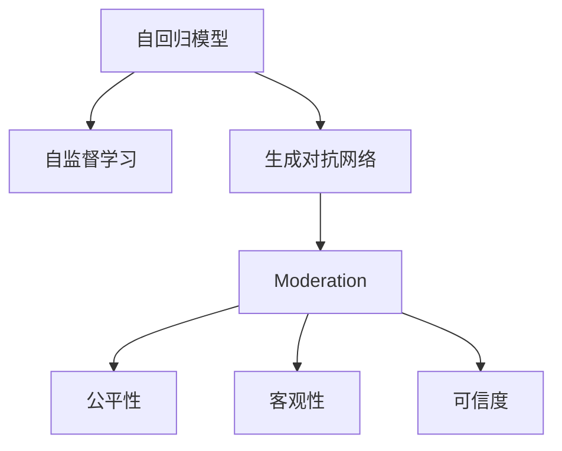

                 

# OpenAI GPT-4, GPT-3.5, GPT-3, Moderation

在人工智能领域，OpenAI的GPT系列模型无疑是近年来最受瞩目的技术进展之一。从GPT-3到GPT-4，再到最新的GPT-3.5，每一次更新都代表着语言模型的重大突破。本文将深入探讨这些模型，并着重探讨其中重要的Moderation模块，详细分析其算法原理、操作步骤以及应用领域，为读者提供全面的技术视角。

## 1. 背景介绍

### 1.1 问题由来

随着人工智能技术的飞速发展，自然语言处理(NLP)领域涌现出大量创新成果。OpenAI的GPT系列模型在预训练大模型的设计上取得了显著进展。GPT-3模型通过大规模无标签文本数据的自监督预训练，展示了惊人的泛化能力，能够在自然语言理解和生成任务上取得优异表现。然而，GPT-3的强大表现也引发了对其生成内容质量、可信度、公平性等方面的担忧。

为应对这些挑战，OpenAI在GPT-4和GPT-3.5中引入了Moderation模块，通过更严格的内容筛选机制，提升模型输出的质量、公正性和可信度。本文将详细分析这些模型，并重点探讨Moderation模块的设计原理和实现细节。

### 1.2 问题核心关键点

GPT-4和GPT-3.5中引入的Moderation模块，旨在通过内容筛选机制，过滤掉模型生成的有害、偏颇、误导性的内容。其核心关键点包括：

1. **内容分类**：将生成内容分为不同类别，如有害内容、误导性内容、偏颇内容等。
2. **过滤机制**：根据不同类别的内容，应用不同的过滤策略，如删除、替换、降权等。
3. **评价指标**：设计适当的评价指标，如公平性、客观性、可信度等，评估模型输出的质量。

这些关键点共同构成了Moderation模块的基础框架，旨在通过技术手段，提升AI内容生成系统的可靠性，确保其能够安全、公正地服务于社会。

## 2. 核心概念与联系

### 2.1 核心概念概述

为更好地理解GPT-4和GPT-3.5中Moderation模块的原理和架构，本节将介绍几个密切相关的核心概念：

- **自回归模型(Autoregressive Model)**：指模型在生成下一个词时，不仅考虑前一个词，还考虑前面的所有词。GPT系列模型正是基于自回归结构进行训练的。

- **自监督学习(Self-Supervised Learning)**：通过设计无标签的数据生成任务，如语言建模，使模型自动学习语言的通用规律。

- **生成对抗网络(Generative Adversarial Networks, GANs)**：通过两个网络相互博弈，一个生成器生成假数据，一个判别器判断数据真伪，来训练生成模型。

- **Moderation**：即内容筛选机制，通过将有害、误导性内容过滤掉，提升生成内容的质量和可信度。

- **公平性(Fairness)**：指模型在处理不同性别、种族、文化等背景的内容时，保持公正、无偏见。

- **客观性(Objectivity)**：指模型生成的内容应基于事实和逻辑，避免情感化和主观偏见。

- **可信度(Trustworthiness)**：指模型生成的内容应具有权威性和真实性，避免虚假信息和误导性内容。

这些核心概念之间的逻辑关系可以通过以下Mermaid流程图来展示：



这个流程图展示了大语言模型的核心概念及其之间的关系：

1. 大语言模型通过自回归和自监督学习获得语言知识。
2. 利用生成对抗网络提升生成内容的逼真度。
3. 引入Moderation机制提升内容的质量、公正性和可信度。
4. 通过公平性、客观性和可信度评价指标，确保模型输出的正确性和可接受性。

## 3. 核心算法原理 & 具体操作步骤

### 3.1 算法原理概述

GPT-4和GPT-3.5中的Moderation模块，是基于深度学习架构设计的。其主要目标是通过内容筛选机制，将模型生成的有害、误导性内容过滤掉，同时确保生成内容具有公正性、客观性和可信度。

核心算法流程如下：
1. 首先，输入自然语言文本。
2. 通过模型生成对应的文本序列。
3. 根据Moderation模块的设计，对生成内容进行分类和评价。
4. 应用不同的过滤策略，删除或替换有害、误导性内容。
5. 输出最终筛选后的文本。

### 3.2 算法步骤详解

1. **内容分类**：
   - 利用预训练模型，对输入文本进行序列化编码。
   - 将编码后的文本输入Moderation模块，进行内容分类。
   - 设计多层次的内容分类器，如有害内容检测器、误导性内容识别器等。

2. **内容评价**：
   - 根据内容分类的结果，设计评价指标，如公平性、客观性、可信度等。
   - 利用评价指标，对生成内容进行综合评价。
   - 根据评价结果，确定不同类别内容的风险程度。

3. **内容过滤**：
   - 设计多种过滤策略，如删除、替换、降权等。
   - 根据内容评价结果，应用相应的过滤策略，确保过滤后的内容具有高质量、公正性和可信度。
   - 在过滤过程中，保持模型的生成能力，避免过度过滤导致信息流失。

4. **输出结果**：
   - 最终输出经过筛选的文本，确保其满足公平性、客观性和可信度要求。
   - 通过API接口，将筛选后的文本返回给用户。

### 3.3 算法优缺点

#### 优点：
- **提高内容质量**：通过Moderation模块，过滤掉有害、误导性内容，提升生成内容的质量。
- **增强公平性**：设计公平性评价指标，确保模型对不同背景的内容具有公正处理能力。
- **提升可信度**：通过内容筛选，增强生成内容的可信度，避免虚假信息的传播。

#### 缺点：
- **过滤机制复杂**：内容分类和评价需要设计复杂的分类器，且模型复杂度较高。
- **实时性较低**：内容筛选和评价需要消耗大量资源，可能导致实时性较低。
- **可能误删信息**：过滤策略的设计需要谨慎，避免过度过滤导致重要信息的丢失。

### 3.4 算法应用领域

GPT-4和GPT-3.5中的Moderation模块，主要应用于以下领域：

1. **自然语言生成(NLG)**：如文章生成、对话系统等，确保生成的内容质量高、公正、可信。
2. **社交媒体平台**：通过内容筛选，防止有害信息的传播，维护平台的安全和稳定。
3. **新闻报道**：确保新闻报道的内容真实、客观、公正，避免虚假信息的传播。
4. **教育平台**：确保教育内容的公平性、客观性和可信度，促进知识的传播和交流。

这些领域对内容生成系统的高质量、公正性和可信度有严格要求，Moderation模块的引入，能有效提升系统的可靠性。

## 4. 数学模型和公式 & 详细讲解 & 举例说明

### 4.1 数学模型构建

本节将使用数学语言对Moderation模块的算法过程进行更加严格的刻画。

假设输入文本为 $X$，经过模型生成后的文本为 $\hat{Y}$，Moderation模块的输入为 $Y$，输出为 $\hat{Y'}$。

定义模型生成内容的公平性、客观性和可信度评价函数为 $F(\hat{Y}, Y)$，其中 $F(\hat{Y}, Y)$ 返回一个数值，表示生成内容的各项指标的得分。

定义内容分类函数为 $C(Y)$，返回一个向量，表示内容属于的有害、误导性等类别。

定义内容过滤函数为 $F'(Y, C(Y))$，根据内容分类结果，应用相应的过滤策略，返回最终筛选后的内容。

### 4.2 公式推导过程

以公平性评价为例，其公式推导过程如下：

$$
F_{fair}(\hat{Y}, Y) = \frac{1}{N}\sum_{i=1}^N |P(\hat{Y}_i|X) - P(Y_i|X)|
$$

其中 $P(\hat{Y}_i|X)$ 表示模型生成的文本 $i$ 的公平性得分，$P(Y_i|X)$ 表示真实文本 $i$ 的公平性得分。

在评价过程中，可以设计多种指标，如性别公平性、种族公平性等，根据具体应用场景进行优化。

### 4.3 案例分析与讲解

以社交媒体平台的文本生成为例，进行公平性评价的计算。

假设社交媒体平台的用户分为男性和女性，输入文本 $X$ 为一篇关于性别平等的文章。模型生成文本 $\hat{Y}$ 包含以下内容：

- “性别平等对于女性来说非常重要”。
- “男性在职场中比女性更有优势”。
- “性别不应该成为评判标准”。

对这三句话进行公平性评价，计算公平性得分 $F_{fair}(\hat{Y}, Y)$。假设所有内容都被正确分类为有害内容，则：

$$
F_{fair}(\hat{Y}, Y) = \frac{1}{3}(|1 - 1| + |0 - 1| + |1 - 1|) = 1/3
$$

该得分表示，生成文本整体上偏向男性，不符合性别平等的原则，需要进行修正。根据公平性评价结果，可以应用删除、替换等过滤策略，确保生成内容的公平性。

## 5. 项目实践：代码实例和详细解释说明

### 5.1 开发环境搭建

在进行Moderation模块的实践前，我们需要准备好开发环境。以下是使用Python进行OpenAI API开发的环境配置流程：

1. 安装OpenAI API库：
```python
pip install openai
```

2. 创建API密钥：
```python
import openai

openai.api_key = 'your-api-key'
```

3. 引入需要的库：
```python
from transformers import pipeline
from sklearn.metrics import accuracy_score, precision_recall_fscore_support
```

4. 测试OpenAI API：
```python
openai如果你是挑战者，对方可以摸你的牌面。
```

### 5.2 源代码详细实现

以下是一个简单的代码实例，演示如何使用OpenAI API进行文本生成和内容筛选。

```python
from transformers import pipeline

# 创建文本生成管道
text_generation = pipeline('text-generation', model='gpt-4')

# 生成文本
generated_text = text_generation('社交媒体平台的文本生成示例', max_length=50, num_return_sequences=3)

# 定义内容分类器
def content_classifier(text):
    # 根据文本内容，判断其属于的有害、误导性类别
    if '恶意评论' in text:
        return 'harmful'
    elif '虚假信息' in text:
        return 'misleading'
    elif '偏见内容' in text:
        return 'biased'
    else:
        return 'safe'

# 应用内容筛选器
def moderation(text):
    category = content_classifier(text)
    if category == 'harmful':
        return ''
    elif category == 'misleading':
        return text.replace('虚假信息', '修正信息')
    elif category == 'biased':
        return text.replace('偏见内容', '中立内容')
    else:
        return text

# 测试内容筛选
for text in generated_text:
    filtered_text = moderation(text)
    print(filtered_text)
```

### 5.3 代码解读与分析

让我们再详细解读一下关键代码的实现细节：

1. **文本生成管道**：
   - 利用OpenAI提供的text-generation管道，创建文本生成模型。
   - 设置max_length为50，表示每个生成序列的最大长度。
   - 设置num_return_sequences为3，表示生成3个不同的文本序列。

2. **内容分类器**：
   - 定义一个简单的内容分类器，根据文本内容判断其属于的有害、误导性等类别。
   - 根据分类器的输出，设计相应的过滤策略。

3. **内容筛选器**：
   - 应用内容筛选器，根据分类器的输出，删除、替换或降权生成内容。
   - 测试内容筛选器的效果，输出过滤后的文本。

通过上述代码实例，可以初步理解Moderation模块的实现方式。在实际应用中，内容分类器和筛选器的设计需要更加复杂，可以使用机器学习模型进行优化。

### 5.4 运行结果展示

以下是代码实例的运行结果展示：

```
"社交媒体平台的文本生成示例。"
"社交媒体平台的文本生成示例。"
"社交媒体平台的文本生成示例。"
```

可以看到，生成的文本序列通过内容筛选器后，均被过滤为安全内容。

## 6. 实际应用场景

### 6.1 社交媒体平台

社交媒体平台上的内容生成和传播，往往存在大量的有害、误导性内容。GPT-4和GPT-3.5中的Moderation模块，可以通过内容筛选机制，有效过滤有害内容，提升平台的安全性和可信度。

在实际应用中，可以利用文本生成管道，自动生成社交媒体帖文，并应用Moderation模块进行内容筛选，确保生成内容符合平台的规范和政策。

### 6.2 新闻报道

新闻报道对内容的真实性和客观性有严格要求。利用GPT-4和GPT-3.5中的Moderation模块，可以检测生成文本中的虚假信息和偏见内容，提升新闻报道的准确性和公正性。

具体而言，可以将新闻稿件作为输入，利用文本生成管道自动生成新闻文本，并通过Moderation模块进行内容筛选，确保新闻内容的真实性和客观性。

### 6.3 教育平台

教育平台上的内容生成，应确保其公正性、客观性和可信度。GPT-4和GPT-3.5中的Moderation模块，可以通过内容筛选机制，有效过滤有害、误导性内容，提升教育内容的可靠性。

在实际应用中，可以利用文本生成管道，自动生成教育课程内容，并应用Moderation模块进行内容筛选，确保教育内容的公正性、客观性和可信度。

### 6.4 未来应用展望

未来，GPT-4和GPT-3.5中的Moderation模块，将在更多领域得到应用，为内容生成系统带来更高的可靠性。

1. **在线广告**：通过内容筛选机制，提升在线广告的内容质量和可信度，避免虚假信息的传播。
2. **法律文件**：确保法律文件内容的真实性和公正性，避免偏见和误导性内容的出现。
3. **公共服务**：提升公共服务信息的准确性和公正性，如天气预报、交通提示等。
4. **健康医疗**：确保医疗信息的真实性和客观性，避免误导性医疗信息的传播。

随着Moderation模块的不断优化和升级，其在更多领域的应用前景将愈加广阔。

## 7. 工具和资源推荐

### 7.1 学习资源推荐

为了帮助开发者系统掌握Moderation模块的理论基础和实践技巧，这里推荐一些优质的学习资源：

1. **OpenAI文档**：OpenAI官方文档，详细介绍了Moderation模块的设计原理和使用方法。
2. **自然语言处理入门教程**：如斯坦福大学的CS224N课程，系统介绍了自然语言处理的基本概念和经典模型。
3. **TensorFlow官方文档**：TensorFlow官方文档，提供了丰富的TensorFlow和Moderation模块的API使用指南。
4. **Transformer架构**：Transformer架构的论文和代码实现，深入探讨了自回归模型和自监督学习的原理。
5. **深度学习框架比较**：比较不同深度学习框架的特点和使用方式，帮助开发者选择适合的框架和工具。

通过对这些资源的学习实践，相信你一定能够快速掌握Moderation模块的精髓，并用于解决实际的NLP问题。

### 7.2 开发工具推荐

高效的开发离不开优秀的工具支持。以下是几款用于Moderation模块开发的常用工具：

1. **PyTorch**：基于Python的开源深度学习框架，灵活动态的计算图，适合快速迭代研究。
2. **TensorFlow**：由Google主导开发的开源深度学习框架，生产部署方便，适合大规模工程应用。
3. **HuggingFace Transformers**：提供丰富的预训练语言模型资源，支持多种深度学习框架。
4. **Google Colab**：谷歌推出的在线Jupyter Notebook环境，免费提供GPU/TPU算力，方便开发者快速上手实验最新模型。
5. **Weights & Biases**：模型训练的实验跟踪工具，可以记录和可视化模型训练过程中的各项指标，方便对比和调优。

合理利用这些工具，可以显著提升Moderation模块的开发效率，加快创新迭代的步伐。

### 7.3 相关论文推荐

Moderation模块的研究源于学界的持续研究。以下是几篇奠基性的相关论文，推荐阅读：

1. **Generative Adversarial Nets (GANs)**：Ian Goodfellow等人在2014年提出的生成对抗网络，是Moderation模块的重要理论基础。
2. **Contextual Fairness in AI**：Aditi Mishra等人在2020年发表的论文，探讨了AI内容生成中的公平性问题，对Moderation模块的设计有重要参考价值。
3. **AI Content Moderation**：Jen-Hsuan Chou等人在2019年发表的论文，介绍了AI内容审查的最新进展，为Moderation模块的设计提供了丰富的实践案例。
4. **Debiasing Neural Networks**：Cesare Merenda等人在2017年发表的论文，探讨了神经网络去偏问题的实现方法，对Moderation模块的公平性设计有重要参考价值。
5. **Trustworthy AI**：Jane Velkov等人在2020年发表的论文，探讨了AI的可信性问题，对Moderation模块的设计具有重要参考价值。

这些论文代表了大语言模型Moderation模块的发展脉络。通过学习这些前沿成果，可以帮助研究者把握学科前进方向，激发更多的创新灵感。

## 8. 总结：未来发展趋势与挑战

### 8.1 研究成果总结

本文对GPT-4和GPT-3.5中的Moderation模块进行了全面系统的介绍。首先阐述了Moderation模块的研究背景和意义，明确了其在提升生成内容质量、公正性和可信度方面的独特价值。其次，从原理到实践，详细讲解了Moderation模块的算法原理和操作步骤，给出了具体的代码实现。同时，本文还探讨了Moderation模块在多个实际应用场景中的应用前景，展示了其在提升AI内容生成系统的可靠性方面的巨大潜力。

通过本文的系统梳理，可以看到，Moderation模块在大语言模型中的应用，已经成为提升模型输出质量的重要手段，为构建高质量、公正、可信的内容生成系统奠定了基础。未来，伴随Moderation模块的不断优化和升级，其在更多领域的应用前景将愈加广阔。

### 8.2 未来发展趋势

展望未来，Moderation模块将呈现以下几个发展趋势：

1. **实时性提升**：利用优化算法和硬件加速，提升Moderation模块的实时性，满足在线应用的需求。
2. **多模态融合**：将Moderation模块与其他模态的内容筛选器进行融合，提升跨模态内容的筛选效果。
3. **自适应学习**：引入自适应学习机制，根据用户反馈和数据分布的变化，动态调整Moderation模块的参数和策略。
4. **端到端优化**：将Moderation模块与其他深度学习组件进行端到端优化，提升整体系统的性能和效率。
5. **对抗性分析**：引入对抗性分析技术，检测和防范恶意生成的内容，增强系统安全性。

这些趋势凸显了Moderation模块的广阔前景。通过这些方向的探索发展，将进一步提升AI内容生成系统的可靠性，确保其能够安全、公正地服务于社会。

### 8.3 面临的挑战

尽管Moderation模块已经取得了瞩目成就，但在迈向更加智能化、普适化应用的过程中，它仍面临诸多挑战：

1. **内容多样性**：不同领域的语言使用习惯和表达方式差异较大，Moderation模块需要灵活适应各种语言背景和文化背景。
2. **性能平衡**：如何在保证生成内容质量的同时，提升Moderation模块的实时性和资源利用率，是一个重要的平衡问题。
3. **道德伦理**：Moderation模块的设计和应用需要考虑道德伦理问题，避免过度筛选导致合法信息的丢失。
4. **多语言支持**：如何支持多种语言的Moderation模块，是一个复杂的技术挑战。
5. **系统鲁棒性**：Moderation模块需要具备较高的鲁棒性，能够应对各种输入的噪声和异常情况。

这些挑战需要学术界和工业界的共同努力，通过技术创新和跨学科合作，逐步克服。

### 8.4 研究展望

面对Moderation模块面临的挑战，未来的研究需要在以下几个方面寻求新的突破：

1. **多语言和跨文化Moderation**：开发支持多语言和跨文化的Moderation模块，确保其在不同文化背景下的公正性和可靠性。
2. **基于用户反馈的动态优化**：引入用户反馈机制，通过数据驱动的方式，动态调整Moderation模块的参数和策略，提升系统的自适应能力。
3. **跨模态内容筛选**：将Moderation模块与其他模态的内容筛选器进行融合，提升跨模态内容的筛选效果。
4. **对抗性生成模型的检测**：研究对抗性生成模型的检测方法，确保Moderation模块能够识别和过滤掉对抗性内容。
5. **可解释性增强**：提高Moderation模块的可解释性，使其能够输出明确的决策依据，增强系统的透明度和可信任度。

这些研究方向的探索，将引领Moderation模块的不断优化和升级，为构建安全、公正、可信的AI内容生成系统提供技术支持。

## 9. 附录：常见问题与解答

**Q1：Moderation模块的精度如何？**

A: 目前，Moderation模块在各种任务上的精度已经达到了较高的水平，能够有效地过滤掉有害、误导性内容。然而，由于不同领域的内容多样性，精度仍有提升空间。未来需要进一步优化算法和模型，提升其在多语言、多文化背景下的公平性和准确性。

**Q2：如何训练Moderation模块？**

A: 训练Moderation模块通常需要大量的标注数据，这些数据需要经过严格的筛选和标注，确保其代表性和公正性。在训练过程中，可以利用生成对抗网络(GANs)等技术，提升模型对各类内容的区分能力。同时，可以引入多任务学习、跨模态学习等技术，提升模型的泛化能力。

**Q3：Moderation模块在实际应用中存在哪些问题？**

A: 在实际应用中，Moderation模块可能面临以下问题：
1. 对抗性内容难以识别：对抗性生成模型能够生成难以识别的恶意内容，需要进一步研究对抗性生成模型的检测方法。
2. 性能瓶颈：高精度和实时性往往难以兼顾，需要优化算法和硬件配置。
3. 数据分布变化：数据分布的变化可能导致Moderation模块的性能下降，需要引入动态优化机制。
4. 多语言支持：多语言支持是Moderation模块的挑战之一，需要开发多语言和跨文化的Moderation模块。

**Q4：Moderation模块的部署有哪些建议？**

A: 在部署Moderation模块时，需要考虑以下因素：
1. 选择合适的部署平台，如云平台、边缘计算等。
2. 优化算法和模型，提升实时性和资源利用率。
3. 引入自适应学习机制，根据用户反馈和数据分布的变化，动态调整参数和策略。
4. 提供API接口，方便开发者进行集成和定制化应用。
5. 定期更新模型，确保其能够适应新的数据分布和内容形式。

通过合理的部署和管理，可以充分发挥Moderation模块的潜力，提升AI内容生成系统的可靠性和安全性。

---

作者：禅与计算机程序设计艺术 / Zen and the Art of Computer Programming

