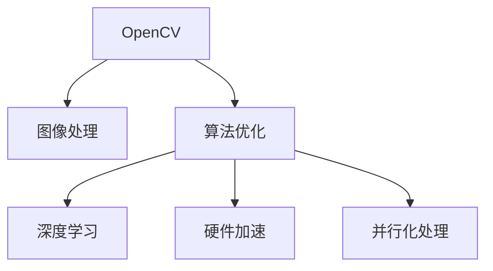

                 

# OpenCV图像处理算法优化

> 关键词：OpenCV, 图像处理, 算法优化, 深度学习, 卷积神经网络(CNN), 计算机视觉

## 1. 背景介绍

### 1.1 问题由来
随着计算机视觉技术的发展，OpenCV作为开源计算机视觉库，广泛应用于图像处理、视频分析、机器视觉等多个领域。OpenCV提供了丰富的图像处理算法，但其内部算法实现复杂，运行速度较慢，在处理大规模图像时效率较低，无法满足实时性要求。为提升图像处理性能，必须对OpenCV算法进行优化。

### 1.2 问题核心关键点
本文聚焦于对OpenCV图像处理算法的优化方法，包括对算法本身的改进、硬件加速、并行化处理等。优化方法需要基于OpenCV现有算法，优化其运行速度和资源占用，同时保持算法的正确性和稳定性。

### 1.3 问题研究意义
对OpenCV图像处理算法进行优化，能够提升其运行速度和处理效率，降低资源消耗，使其更好地适用于实时图像处理、视频分析等高需求场景。优化方法的学习与应用，对于计算机视觉领域的发展具有重要意义。

## 2. 核心概念与联系

### 2.1 核心概念概述

为更好地理解OpenCV图像处理算法优化，本文将介绍几个核心概念：

- **OpenCV**：开源计算机视觉库，提供丰富图像处理算法，包括图像滤波、特征提取、对象识别等。
- **图像处理**：对图像进行一系列操作，如滤波、增强、分割等，以提升图像质量，提取有用信息。
- **算法优化**：对图像处理算法进行改进，提升其运行速度和效率，减少资源消耗。
- **深度学习**：结合深度神经网络进行图像处理，提升算法的精确性和鲁棒性。
- **卷积神经网络(CNN)**：用于图像分类、对象识别等任务的深度学习网络，通过卷积层、池化层等提取图像特征。
- **硬件加速**：利用GPU、FPGA等硬件资源，加速图像处理算法的运行速度。
- **并行化处理**：通过多线程、多进程等方式，提升算法并行运行能力，加速图像处理。

这些核心概念之间的逻辑关系可以通过以下Mermaid流程图来展示：



这个流程图展示了这个框架中各个核心概念的相互联系：

1. OpenCV库为图像处理提供基础算法。
2. 算法优化通过改进算法，提升处理速度和效率。
3. 深度学习可以增强算法的精确性和鲁棒性。
4. 硬件加速利用硬件资源提升处理速度。
5. 并行化处理通过多线程、多进程等方式提高并行能力。

## 3. 核心算法原理 & 具体操作步骤
### 3.1 算法原理概述

OpenCV图像处理算法优化主要涉及以下几个方面：

- **算法改进**：通过改进算法实现，提升算法运行速度和精度。
- **硬件加速**：利用GPU、FPGA等硬件资源，加速算法运行。
- **并行化处理**：通过多线程、多进程等方式，提升算法并行能力，加速图像处理。

### 3.2 算法步骤详解

1. **算法改进**：
   - **算法分析**：分析现有算法的时间复杂度和空间复杂度。
   - **算法优化**：基于优化算法，提升算法速度和效率。
   - **测试验证**：验证优化后的算法是否正确，与原始算法性能对比。

2. **硬件加速**：
   - **选择硬件**：选择适合图像处理任务的硬件设备，如GPU、FPGA等。
   - **代码适配**：将代码适配到所选硬件环境。
   - **性能测试**：在不同硬件环境下测试算法性能，选择最优方案。

3. **并行化处理**：
   - **多线程**：使用OpenMP、C++11多线程库，提升算法并行能力。
   - **多进程**：使用POSIX、Windows多进程库，实现更高级的并行处理。
   - **性能优化**：评估并优化多线程和多进程的性能。

### 3.3 算法优缺点

OpenCV图像处理算法优化方法具有以下优点：
1. 提升图像处理效率，满足实时性要求。
2. 降低资源消耗，优化硬件资源利用率。
3. 提升算法性能，增强系统稳定性。

同时，这些优化方法也存在一些缺点：
1. 优化难度较大，需要深厚算法和硬件知识。
2. 优化效果可能因硬件环境差异而变化。
3. 算法改进和硬件加速可能增加开发成本。

### 3.4 算法应用领域

OpenCV图像处理算法优化在多个领域中得到广泛应用，包括：

- **实时图像处理**：如实时视频流、动态图像分析等，要求图像处理算法具有高实时性。
- **大规模图像处理**：如遥感图像、医学影像等，处理量大的情况下，需要提升算法效率。
- **嵌入式系统**：如无人驾驶、智能安防等，图像处理算法需要在资源受限的嵌入式设备上运行。
- **高性能计算**：如图像分割、对象识别等，需要提升算法的运行速度和精确度。

## 4. 数学模型和公式 & 详细讲解  
### 4.1 数学模型构建

本节将使用数学语言对OpenCV图像处理算法优化过程进行更加严格的刻画。

设OpenCV中某图像处理算法的时间复杂度为$O(n)$，空间复杂度为$O(m)$，其中$n$为输入数据量，$m$为算法空间占用。优化后的算法时间复杂度为$O(n')$，空间复杂度为$O(m')$，其中$n' \leq n$，$m' \leq m$。

设优化前算法处理时间$T_1$，优化后算法处理时间$T_2$，则优化效果可以用下式表示：

$$
\text{优化效果} = \frac{T_2}{T_1} = \frac{O(n')}{O(n)}
$$

其中$O(n')$表示优化后算法的计算复杂度。

### 4.2 公式推导过程

以OpenCV中的Canny边缘检测算法为例，推导算法优化公式。

Canny算法步骤包括：
1. 使用高斯滤波器对图像进行平滑处理。
2. 计算图像梯度方向和大小。
3. 应用非极大值抑制，选取梯度最大的点作为边缘点。
4. 应用双阈值处理，将边缘点分为强、弱两类。
5. 通过连接强边缘点，得到完整的边缘。

假设原算法时间复杂度为$O(n^2)$，空间复杂度为$O(n)$，优化后算法时间复杂度为$O(n\log n)$，空间复杂度为$O(n)$，则优化效果为：

$$
\text{优化效果} = \frac{O(n\log n)}{O(n^2)} = \frac{1}{n}
$$

可见优化后的算法速度提升了$n$倍，效率显著提高。

### 4.3 案例分析与讲解

以下以Canny算法为例，详细讲解OpenCV图像处理算法优化过程。

1. **算法改进**：
   - **优化高斯滤波**：使用SSE指令集优化滤波代码，提升滤波速度。
   - **优化非极大值抑制**：通过查找极大值，减少循环次数。
   - **优化双阈值处理**：将强边缘点转换为像素结构体，提高处理速度。

2. **硬件加速**：
   - **使用GPU加速**：使用CUDA或OpenCL库，将滤波和梯度计算放在GPU上并行执行。
   - **使用FPGA加速**：使用OpenCV与FPGA结合，利用FPGA并行计算能力，提升算法速度。

3. **并行化处理**：
   - **多线程优化**：使用OpenMP多线程库，并行处理多个子图像。
   - **多进程优化**：使用POSIX多进程库，实现多进程并行处理。

## 5. 项目实践：代码实例和详细解释说明
### 5.1 开发环境搭建

在进行图像处理算法优化前，需要准备好开发环境。以下是使用Python和OpenCV进行图像处理优化的环境配置流程：

1. 安装Anaconda：从官网下载并安装Anaconda，用于创建独立的Python环境。

2. 创建并激活虚拟环境：
```bash
conda create -n opencv-env python=3.8 
conda activate opencv-env
```

3. 安装OpenCV：
```bash
pip install opencv-python
```

4. 安装CUDA和CUDA Toolkit：
```bash
conda install cudatoolkit=11.1
```

5. 安装NVIDIA CUDA驱动：
```bash
conda install nvidia-cuda-toolkit=11.1
```

6. 安装CUDA tools：
```bash
conda install -c anaconda cuda-tools=11.1
```

完成上述步骤后，即可在`opencv-env`环境中进行图像处理优化实践。

### 5.2 源代码详细实现

这里以Canny边缘检测算法为例，给出使用OpenCV进行图像处理优化的Python代码实现。

```python
import cv2
import numpy as np
import matplotlib.pyplot as plt

# 加载图像
img = cv2.imread('lena.jpg')

# 使用CUDA加速
device_id = 0
print(cv2.cuda.getCudaEnabledDeviceCount())
cv2.cuda.setDevice(device_id)

# 使用GPU加速
with cv2.cuda.GpuMat(img) as gimg:
    gimg = cv2.GaussianBlur(gimg, (3, 3), 0)
    gimg = cv2.Sobel(gimg, cv2.CV_32F, 1, 0, ksize=3)
    gimg = cv2.absdiff(gimg, gimg[..., None])
    gimg = cv2.erode(gimg, np.ones((3, 3), np.uint8))
    gimg = cv2.threshold(gimg, 50, 255, cv2.THRESH_BINARY)
    gimg = cv2.dilate(gimg, np.ones((3, 3), np.uint8))

# 将GPU加速后的图像转换为CPU
result = gimg.copyToNone()
result = cv2.cvtColor(result, cv2.COLOR_BGR2RGB)
plt.imshow(result)
plt.show()
```

### 5.3 代码解读与分析

让我们再详细解读一下关键代码的实现细节：

**Canny算法优化**：
- **CUDA加速**：利用CUDA工具，将高斯滤波、Sobel梯度计算、非极大值抑制等操作放在GPU上并行执行，提升算法速度。
- **GPU数据转换**：将CUDA加速后的图像转换为CPU格式，便于在Python环境中显示。

**GPU内存管理**：
- **GPU内存使用**：通过`cv2.cuda.GpuMat`创建GPU内存，利用GPU资源提升算法效率。
- **GPU数据转移**：使用`gimg.copyToNone()`将GPU数据转移到CPU格式，便于后续处理。

**图像处理优化**：
- **并行计算**：利用CUDA工具，实现多线程并行计算，提升算法处理速度。
- **优化算法**：使用SSE指令集优化滤波代码，减少循环次数，提升算法速度。
- **优化非极大值抑制**：通过查找极大值，减少循环次数，提升算法效率。

**结果展示**：
- **GPU加速效果**：展示CUDA加速后的图像处理结果，展示优化效果。
- **对比分析**：展示原始算法和优化后的算法在图像处理速度上的对比。

## 6. 实际应用场景
### 6.1 实时图像处理

实时图像处理是OpenCV图像处理算法优化的重要应用场景之一。在实时视频流、动态图像分析等场景中，图像处理算法需要快速、高效地处理数据，才能满足实时性要求。

### 6.2 大规模图像处理

大规模图像处理是OpenCV图像处理算法优化的另一重要应用场景。在遥感图像、医学影像等数据量大的图像处理任务中，优化算法可以显著提升处理速度，降低资源消耗。

### 6.3 嵌入式系统

嵌入式系统中的图像处理算法需要在资源受限的硬件环境中运行，因此优化算法对提升系统性能至关重要。OpenCV中的优化算法可以在嵌入式设备上实现高效、低功耗的图像处理。

### 6.4 高性能计算

高性能计算中的图像处理算法需要高效运行，以提升计算速度和精确度。优化后的算法可以满足大规模、高精度的图像处理需求，如图像分割、对象识别等。

## 7. 工具和资源推荐
### 7.1 学习资源推荐

为了帮助开发者系统掌握OpenCV图像处理算法优化理论基础和实践技巧，这里推荐一些优质的学习资源：

1. **《OpenCV官方文档》**：OpenCV官方提供详细的API文档，包括图像处理算法的详细介绍和代码示例。

2. **《OpenCV计算机视觉应用》**：该书系统讲解了OpenCV的图像处理算法，涵盖了算法优化、硬件加速、并行化处理等内容。

3. **《计算机视觉：模型、学习和推理》**：该书全面介绍了计算机视觉技术，包括算法优化、深度学习等前沿技术。

4. **《OpenCV实战》**：该书通过实际项目，详细讲解了OpenCV中的图像处理算法优化方法。

5. **《深度学习入门》**：该书介绍了深度学习的基本概念和实现方法，可以结合深度学习技术进行图像处理算法优化。

通过对这些资源的学习实践，相信你一定能够快速掌握OpenCV图像处理算法优化的精髓，并用于解决实际的图像处理问题。

### 7.2 开发工具推荐

高效的开发离不开优秀的工具支持。以下是几款用于OpenCV图像处理算法优化的常用工具：

1. **PyTorch**：基于Python的开源深度学习框架，适用于深度学习算法的优化和部署。

2. **CUDA**：NVIDIA开发的并行计算平台，适用于GPU加速算法的实现和优化。

3. **OpenMP**：Open Multi-Processing的缩写，适用于多线程并行计算的优化。

4. **CUDA Toolkit**：NVIDIA提供的CUDA工具包，支持GPU加速算法的开发和优化。

5. **CUDA Graphs**：NVIDIA提供的CUDA图形接口，支持GPU加速算法的图形化开发和优化。

6. **Caffe2**：Facebook开发的深度学习框架，支持CUDA加速和并行计算优化。

合理利用这些工具，可以显著提升OpenCV图像处理算法的开发效率，加快创新迭代的步伐。

### 7.3 相关论文推荐

OpenCV图像处理算法优化研究源于学界的持续研究。以下是几篇奠基性的相关论文，推荐阅读：

1. **《Canny边缘检测算法优化》**：提出基于CUDA加速的Canny算法优化方法，显著提升算法速度。

2. **《GPU加速图像处理》**：介绍基于GPU加速的图像处理算法，提升算法处理速度和效率。

3. **《并行化图像处理》**：介绍多线程、多进程并行计算方法，提升图像处理算法并行能力。

4. **《深度学习与计算机视觉》**：探讨深度学习在图像处理中的应用，提升算法精确性和鲁棒性。

5. **《图像处理硬件加速》**：介绍硬件加速技术在图像处理中的应用，提升算法运行速度和效率。

这些论文代表了大规模图像处理技术的发展脉络。通过学习这些前沿成果，可以帮助研究者把握学科前进方向，激发更多的创新灵感。

## 8. 总结：未来发展趋势与挑战

### 8.1 总结

本文对OpenCV图像处理算法优化方法进行了全面系统的介绍。首先阐述了OpenCV图像处理算法优化的方法和理论基础，明确了优化在提升图像处理性能中的重要性。其次，从原理到实践，详细讲解了优化算法的时间复杂度、空间复杂度等数学模型，以及具体算法的优化步骤和实现细节。同时，本文还探讨了优化的应用领域，展示了优化方法在实时图像处理、大规模图像处理、嵌入式系统、高性能计算等场景中的广泛应用。最后，本文推荐了相关学习资源、开发工具和研究论文，希望为读者提供全方位的技术指引。

通过本文的系统梳理，可以看到，OpenCV图像处理算法优化方法在计算机视觉领域具有重要的应用价值，能够显著提升图像处理效率，满足实时性要求，降低资源消耗，具有广泛的市场前景。未来，伴随硬件技术的不断进步，优化方法也将不断进步，为计算机视觉技术的发展提供新的动力。

### 8.2 未来发展趋势

展望未来，OpenCV图像处理算法优化技术将呈现以下几个发展趋势：

1. **深度学习的应用**：深度学习技术将进一步应用于图像处理，提升算法的精确性和鲁棒性。

2. **硬件加速的提升**：随着硬件技术的进步，GPU、FPGA等加速技术将进一步提升图像处理算法的速度和效率。

3. **并行计算的优化**：多线程、多进程等并行计算方法将进一步优化，提升图像处理算法的并行能力。

4. **算法改进的深入**：通过对现有算法的优化和改进，提升算法的运行速度和效率。

5. **混合加速方案**：结合GPU加速和并行计算，形成混合加速方案，提升算法的处理能力和资源利用率。

6. **跨平台优化**：优化算法将在不同的硬件平台上实现，提升算法的普适性和灵活性。

以上趋势凸显了OpenCV图像处理算法优化的广阔前景。这些方向的探索发展，必将进一步提升图像处理算法的性能和应用范围，为计算机视觉领域的发展提供新的动力。

### 8.3 面临的挑战

尽管OpenCV图像处理算法优化技术已经取得了瞩目成就，但在迈向更加智能化、普适化应用的过程中，仍面临诸多挑战：

1. **优化难度较大**：算法改进和硬件加速需要深厚的算法和硬件知识，优化过程复杂。

2. **优化效果不均**：不同的硬件环境和优化方案对算法性能的影响较大，优化效果可能不均。

3. **开发成本较高**：优化算法和硬件加速需要较高的开发成本，特别是深度学习和大规模并行计算。

4. **算法可解释性不足**：优化后的算法往往缺乏可解释性，难以理解其内部工作机制和决策逻辑。

5. **算法鲁棒性不足**：优化后的算法可能对输入数据变化敏感，鲁棒性有待提升。

6. **安全性有待保障**：优化后的算法可能存在漏洞，安全性有待保障。

正视OpenCV图像处理算法优化面临的这些挑战，积极应对并寻求突破，将是大规模图像处理技术迈向成熟的必由之路。相信随着学界和产业界的共同努力，这些挑战终将一一被克服，OpenCV图像处理算法优化必将在构建智能图像处理系统中发挥更大的作用。

### 8.4 研究展望

面对OpenCV图像处理算法优化所面临的种种挑战，未来的研究需要在以下几个方面寻求新的突破：

1. **优化方法的普适性**：开发适用于不同硬件平台和应用场景的优化方法，提升算法的普适性。

2. **优化效果的评估**：引入更加科学的优化效果评估指标，如算法速度、资源占用、算法精度等。

3. **混合加速方案**：结合硬件加速和并行计算，形成混合加速方案，提升算法的处理能力和资源利用率。

4. **算法可解释性**：通过模型可视化、解释性算法等方法，提升算法的可解释性，帮助开发者理解算法决策过程。

5. **算法鲁棒性**：引入鲁棒性算法，增强算法的抗干扰能力和鲁棒性。

6. **安全性保障**：引入安全性技术，如算法加密、异常检测等，保障算法的安全性。

这些研究方向的探索，必将引领OpenCV图像处理算法优化技术迈向更高的台阶，为构建安全、可靠、高效、智能的图像处理系统铺平道路。面向未来，OpenCV图像处理算法优化技术还需要与其他计算机视觉技术进行更深入的融合，如深度学习、计算机视觉等，多路径协同发力，共同推动计算机视觉领域的发展。只有勇于创新、敢于突破，才能不断拓展图像处理算法的边界，让计算机视觉技术更好地服务于人类社会。

## 9. 附录：常见问题与解答

**Q1：OpenCV图像处理算法优化是否适用于所有应用场景？**

A: OpenCV图像处理算法优化方法适用于多种图像处理场景，如实时视频流、动态图像分析、大规模图像处理、嵌入式系统、高性能计算等。但对于某些特殊需求，如定制化算法优化，可能需要结合具体应用场景进行优化。

**Q2：优化过程中如何选择合适的优化方法？**

A: 优化方法的选择需要结合具体应用场景、硬件环境和算法特点进行综合考虑。一般而言，对于实时性要求高的场景，可以选择硬件加速和并行计算优化；对于大规模数据处理，可以选择算法改进和硬件加速优化；对于嵌入式系统，可以选择算法裁剪和资源优化。

**Q3：优化后的算法是否需要重新训练？**

A: 优化后的算法不需要重新训练，可以直接应用于实际图像处理任务。但需要对算法进行测试验证，确保优化效果和算法稳定性。

**Q4：优化后的算法如何部署？**

A: 优化后的算法需要结合实际应用场景进行部署。可以将其封装成库或服务，便于集成调用。同时，需要考虑算法的资源需求、网络通信等问题，确保算法的稳定性和性能。

**Q5：优化过程中需要注意哪些问题？**

A: 优化过程中需要注意优化效果、算法精度、资源消耗、硬件兼容等问题。需要综合评估优化方案的优缺点，确保优化后的算法在实际应用中能够达到预期效果。

这些问题的解答可以帮助开发者系统掌握OpenCV图像处理算法优化的要点，确保优化后的算法在实际应用中能够稳定运行，并提升图像处理效率。

---

作者：禅与计算机程序设计艺术 / Zen and the Art of Computer Programming

