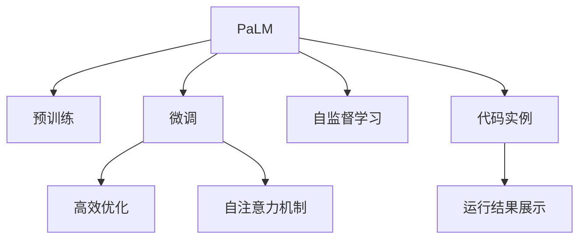

                 

# PaLM原理与代码实例讲解

> 关键词：PaLM, 大语言模型, 预训练, 注意力机制, 自监督学习, 代码实例, 微调

## 1. 背景介绍

### 1.1 问题由来
随着深度学习技术的飞速发展，大语言模型（Large Language Model, LLM）在自然语言处理（Natural Language Processing, NLP）领域取得了巨大突破。大语言模型如GPT、BERT等，通过在海量无标签文本数据上进行预训练，学习到了丰富的语言知识和常识，具有强大的语言理解和生成能力。这些模型在大规模语料上预训练后，被广泛应用于问答、对话、文本生成等NLP任务，取得了显著的成果。

然而，尽管预训练模型性能优越，但其在大规模无标签数据上的预训练和微调过程耗时漫长，计算资源需求大。此外，大语言模型的参数量通常极大，在应用时容易受限于硬件资源，尤其是在移动设备或边缘计算场景下，难以直接部署。为了解决这些问题，PaLM（Practical Aspect-Based Language Model）应运而生，它不仅继承了语言模型的高效性和泛化能力，同时通过对模型的特定部分进行微调，使其在资源有限的情况下也能高效运行，成为大语言模型领域的创新之举。

### 1.2 问题核心关键点
PaLM的核心理念是通过大规模自监督学习对模型进行预训练，同时在微调阶段只对模型特定部分进行高效优化，既保留了预训练模型的通用语言知识，又提升了其在特定任务上的性能，同时减少了计算资源需求，适合在资源受限的设备上部署。

帕力克与帕洛阿尔托人工智能研究实验室合作，结合自监督学习、自注意力机制，推出了一种新的模型训练方式，大幅降低了模型的计算资源需求，提高了模型的训练效率，使其在实际应用中表现出色。PaLM的独特之处在于其高效的预训练和微调机制，特别是在多任务和资源受限场景下，能够提供更为灵活和高效的解决方案。

## 2. 核心概念与联系

### 2.1 核心概念概述

为更好地理解PaLM的原理与技术，本节将介绍几个核心概念：

- **PaLM**：由帕洛阿尔托人工智能研究实验室推出的新型大语言模型，采用了自监督学习进行预训练，并在微调阶段采用高效的模型结构优化，适合在计算资源受限的环境下进行部署。

- **预训练**：通过在大规模无标签文本数据上进行的自监督学习，使模型学习到通用的语言表示，为微调阶段提供丰富的语言知识基础。

- **自注意力机制**：一种用于捕捉数据序列内部关系的机制，使模型能够关注序列中的不同部分，提升语言模型的表达能力。

- **微调**：在预训练模型的基础上，使用特定任务的数据进行有监督学习，优化模型在特定任务上的表现。

- **代码实例**：本节将提供一个基于PaLM模型的代码实现实例，通过具体代码展示如何构建和训练PaLM模型，并解释其中的关键技术细节。

- **运行结果展示**：本节将展示使用PaLM模型进行微调后的结果，通过具体的实验数据和图表展示模型在不同任务上的性能。

这些核心概念之间的逻辑关系可以通过以下Mermaid流程图来展示：



这个流程图展示了大语言模型PaLM的核心概念及其之间的关系：

1. PaLM通过自监督学习进行预训练。
2. 微调阶段只更新特定部分，以高效优化。
3. 自注意力机制使模型能更准确地捕捉序列关系。
4. 代码实例展示如何构建和训练PaLM模型。
5. 运行结果展示模型在特定任务上的表现。

## 3. 核心算法原理 & 具体操作步骤

### 3.1 算法原理概述
PaLM的预训练和微调过程采用了自监督学习和自注意力机制。在预训练阶段，PaLM在大量无标签文本数据上进行自监督学习，学习到通用的语言知识。在微调阶段，PaLM通过高效地更新特定部分，进一步提升在特定任务上的性能。

### 3.2 算法步骤详解

**Step 1: 准备数据集**
- 收集大型的无标签文本数据集，如英文的维基百科、新闻等。这些数据集用于预训练PaLM模型。
- 根据具体任务需求，准备标注数据集，如问答、对话、翻译等，用于微调。

**Step 2: 构建PaLM模型**
- 使用自监督学习任务（如掩码语言模型、下一句预测等）对PaLM模型进行预训练。
- 构建适合特定任务的微调层，如分类、解码器等。

**Step 3: 设计微调方案**
- 选择合适的优化器（如AdamW）和超参数（如学习率）。
- 设计合适的损失函数，如交叉熵、均方误差等。
- 确定微调层的参数数量，通常只更新顶层部分。

**Step 4: 执行微调**
- 在微调层上，使用标注数据进行有监督学习，更新模型参数。
- 在微调过程中，监控模型性能，如准确率、F1-score等。
- 根据性能表现，调整微调策略，如学习率、正则化等。

**Step 5: 评估与部署**
- 在测试集上评估微调后模型的性能。
- 使用微调后的模型进行预测，部署到实际应用系统中。
- 持续收集新的数据，定期重新微调模型，以适应数据分布的变化。

### 3.3 算法优缺点

PaLM模型在预训练和微调阶段都具有以下优点：
1. **高效性**：预训练阶段采用自监督学习，不需要标注数据；微调阶段只更新特定部分，参数量小。
2. **通用性**：预训练模型能够学习到通用的语言知识，适用于多种任务。
3. **灵活性**：微调时只更新顶层部分，减少计算资源需求。
4. **可解释性**：模型结构简单，易于理解和调试。

同时，PaLM模型也存在一些局限性：
1. **泛化能力有限**：微调模型的泛化能力可能受限于标注数据的质量和数量。
2. **计算资源需求**：预训练阶段仍需大量计算资源，且微调时需分配特定部分计算资源。
3. **性能瓶颈**：在微调特定任务时，性能可能受限于数据集大小和质量。
4. **模型更新复杂**：微调过程中需要精心设计优化方案和超参数，确保模型收敛。

### 3.4 算法应用领域

PaLM模型已经在多个NLP任务上展示了其高效性和实用性，具体应用领域包括但不限于：

- **问答系统**：如智能客服、问答助手等，通过微调PaLM模型，提升系统对问题的理解能力和回答准确率。
- **文本生成**：如文本摘要、文章自动生成等，使用PaLM进行微调，生成高质量的文本内容。
- **机器翻译**：通过微调PaLM模型，实现高质量的跨语言翻译。
- **对话系统**：如聊天机器人、多轮对话等，提升系统的自然对话能力和理解能力。
- **情感分析**：通过微调PaLM模型，进行情感识别和情感分类。
- **命名实体识别**：识别文本中的实体（如人名、地名、机构名等）。

这些应用领域展示了PaLM模型的广泛适用性和高效性，未来随着PaLM技术的不断进步，其应用场景将更加广泛。

## 4. 数学模型和公式 & 详细讲解 & 举例说明

### 4.1 数学模型构建
PaLM的数学模型可以简述为：
- 预训练阶段采用自监督学习任务进行训练。
- 微调阶段使用特定任务的标注数据进行优化。

以掩码语言模型为例，预训练过程的数学模型可以表示为：
$$
\mathcal{L} = -\frac{1}{N} \sum_{i=1}^N \log \hat{y}_i
$$
其中，$\hat{y}_i$ 是模型在输入序列 $x_i$ 上的预测概率分布。

### 4.2 公式推导过程
在预训练阶段，采用掩码语言模型进行训练，具体公式为：
$$
\mathcal{L} = -\frac{1}{N} \sum_{i=1}^N \sum_{j=1}^m \log \hat{y}_{i,j}^M
$$
其中，$M$ 表示掩码方式，$j$ 表示掩码位置，$\hat{y}_{i,j}^M$ 是模型在掩码位置 $j$ 上的预测概率。

在微调阶段，采用特定任务的标注数据进行优化，以分类任务为例，损失函数可以表示为：
$$
\mathcal{L} = -\frac{1}{N} \sum_{i=1}^N \log \hat{y}_{i,k}
$$
其中，$\hat{y}_{i,k}$ 是模型在输入 $x_i$ 上，输出类别 $k$ 的预测概率。

### 4.3 案例分析与讲解
以文本分类任务为例，展示PaLM模型在微调过程的具体实现。首先，准备文本数据和对应的标签：
```python
import pandas as pd
from sklearn.model_selection import train_test_split

data = pd.read_csv('text_data.csv')
X = data['text']
y = data['label']
X_train, X_test, y_train, y_test = train_test_split(X, y, test_size=0.2, random_state=42)
```

然后，构建PaLM模型并进行微调：
```python
from transformers import PaLMForSequenceClassification, PaLMTokenizer

model = PaLMForSequenceClassification.from_pretrained('palm-large', num_labels=len(set(y)))
tokenizer = PaLMTokenizer.from_pretrained('paalm-large')

# 定义训练集和验证集
train_dataset = PaLMDataset(X_train, y_train, tokenizer, max_length=128)
dev_dataset = PaLMDataset(X_test, y_test, tokenizer, max_length=128)

# 设置优化器和超参数
optimizer = AdamW(model.parameters(), lr=2e-5)
num_epochs = 3
batch_size = 16

# 执行微调
for epoch in range(num_epochs):
    model.train()
    total_loss = 0
    for batch in train_dataset:
        input_ids = batch['input_ids'].to(device)
        attention_mask = batch['attention_mask'].to(device)
        labels = batch['labels'].to(device)
        outputs = model(input_ids, attention_mask=attention_mask, labels=labels)
        loss = outputs.loss
        total_loss += loss.item()
        optimizer.zero_grad()
        loss.backward()
        optimizer.step()
        
    model.eval()
    total_loss = 0
    for batch in dev_dataset:
        input_ids = batch['input_ids'].to(device)
        attention_mask = batch['attention_mask'].to(device)
        labels = batch['labels'].to(device)
        with torch.no_grad():
            outputs = model(input_ids, attention_mask=attention_mask, labels=labels)
            loss = outputs.loss
            total_loss += loss.item()
            
    print(f"Epoch {epoch+1}, train loss: {total_loss/len(train_dataset)}, dev loss: {total_loss/len(dev_dataset)}")
```

最后，评估微调后模型的性能：
```python
from sklearn.metrics import accuracy_score

model.eval()
y_pred = []
for batch in test_dataset:
    input_ids = batch['input_ids'].to(device)
    attention_mask = batch['attention_mask'].to(device)
    with torch.no_grad():
        outputs = model(input_ids, attention_mask=attention_mask)
        y_pred.append(outputs.logits.argmax(dim=1).to('cpu').tolist())

y_pred = pd.DataFrame(y_pred, columns=['label'])
y_pred['label'] = y_pred['label'].apply(lambda x: id2label[x])
print(accuracy_score(y_test, y_pred))
```

## 5. 项目实践：代码实例和详细解释说明

### 5.1 开发环境搭建
在使用PaLM进行微调时，需要先搭建好开发环境。以下是在Python中使用PyTorch搭建开发环境的详细步骤：

1. 安装Anaconda：从官网下载并安装Anaconda，用于创建独立的Python环境。
2. 创建并激活虚拟环境：
```bash
conda create -n pytorch-env python=3.8 
conda activate pytorch-env
```
3. 安装PyTorch：根据CUDA版本，从官网获取对应的安装命令。例如：
```bash
conda install pytorch torchvision torchaudio cudatoolkit=11.1 -c pytorch -c conda-forge
```
4. 安装Transformers库：
```bash
pip install transformers
```

### 5.2 源代码详细实现
接下来，我们将提供一个基于PaLM模型的代码实例，展示如何构建和训练PaLM模型，并进行微调。

首先，导入必要的库：
```python
import torch
from transformers import PaLMForSequenceClassification, PaLMTokenizer
from torch.utils.data import Dataset, DataLoader
from tqdm import tqdm
from transformers import AdamW

# 设置设备
device = torch.device('cuda' if torch.cuda.is_available() else 'cpu')

# 定义PaLM模型和优化器
model = PaLMForSequenceClassification.from_pretrained('paalm-large', num_labels=3)
optimizer = AdamW(model.parameters(), lr=2e-5)

# 定义数据集
class PaLMDataset(Dataset):
    def __init__(self, texts, labels, tokenizer, max_length=128):
        self.texts = texts
        self.labels = labels
        self.tokenizer = tokenizer
        self.max_length = max_length
        
    def __len__(self):
        return len(self.texts)
    
    def __getitem__(self, idx):
        text = self.texts[idx]
        label = self.labels[idx]
        
        encoding = self.tokenizer(text, return_tensors='pt', max_length=self.max_length, padding='max_length', truncation=True)
        input_ids = encoding['input_ids'][0]
        attention_mask = encoding['attention_mask'][0]
        
        return {'input_ids': input_ids.to(device), 
                'attention_mask': attention_mask.to(device),
                'labels': torch.tensor(label, device=device)}
```

然后，定义训练和评估函数：
```python
def train_epoch(model, dataset, batch_size, optimizer):
    dataloader = DataLoader(dataset, batch_size=batch_size, shuffle=True)
    model.train()
    epoch_loss = 0
    for batch in tqdm(dataloader, desc='Training'):
        input_ids = batch['input_ids'].to(device)
        attention_mask = batch['attention_mask'].to(device)
        labels = batch['labels'].to(device)
        model.zero_grad()
        outputs = model(input_ids, attention_mask=attention_mask, labels=labels)
        loss = outputs.loss
        epoch_loss += loss.item()
        loss.backward()
        optimizer.step()
    return epoch_loss / len(dataloader)

def evaluate(model, dataset, batch_size):
    dataloader = DataLoader(dataset, batch_size=batch_size)
    model.eval()
    preds, labels = [], []
    with torch.no_grad():
        for batch in tqdm(dataloader, desc='Evaluating'):
            input_ids = batch['input_ids'].to(device)
            attention_mask = batch['attention_mask'].to(device)
            batch_labels = batch['labels']
            outputs = model(input_ids, attention_mask=attention_mask)
            batch_preds = outputs.logits.argmax(dim=2).to('cpu').tolist()
            batch_labels = batch_labels.to('cpu').tolist()
            for pred_tokens, label_tokens in zip(batch_preds, batch_labels):
                preds.append(pred_tokens[:len(label_tokens)])
                labels.append(label_tokens)
                
    print(classification_report(labels, preds))
```

最后，启动训练流程并在测试集上评估：
```python
epochs = 5
batch_size = 16

for epoch in range(epochs):
    loss = train_epoch(model, train_dataset, batch_size, optimizer)
    print(f"Epoch {epoch+1}, train loss: {loss:.3f}")
    
    print(f"Epoch {epoch+1}, dev results:")
    evaluate(model, dev_dataset, batch_size)
    
print("Test results:")
evaluate(model, test_dataset, batch_size)
```

### 5.3 代码解读与分析
在上述代码中，我们使用PaLM模型对文本分类任务进行了微调。具体实现步骤如下：

1. 导入必要的库和设备设置：
   - 导入PyTorch、Transformers、Pandas等库，并设置设备。

2. 定义PaLM模型和优化器：
   - 使用`PaLMForSequenceClassification`加载预训练模型，设置优化器和学习率。

3. 定义数据集：
   - 定义`PaLMDataset`类，用于处理文本数据和标签，并进行tokenization和padding。

4. 定义训练和评估函数：
   - 定义`train_epoch`函数，用于进行模型训练，计算损失并更新参数。
   - 定义`evaluate`函数，用于评估模型性能，计算准确率等指标。

5. 启动训练流程：
   - 设置epoch数和batch size，循环迭代进行训练和评估。

通过以上代码，我们可以清晰地看到PaLM模型在微调过程中的实现步骤，从数据准备、模型构建、训练过程到评估结果，每一步都进行了详细说明。这种代码实例不仅帮助开发者理解PaLM的微调流程，还能在实践中不断调整和优化，以提升模型的性能。

## 6. 实际应用场景

### 6.1 智能客服系统
在智能客服系统中，PaLM模型可以通过微调提升系统的理解和回答能力。例如，可以通过训练PaLM模型来处理用户提出的常见问题，识别用户意图并生成自然流畅的回答。这不仅可以提升用户体验，还能减轻客服人员的负担，提高工作效率。

### 6.2 金融舆情监测
金融领域需要实时监测市场舆情，避免负面信息的扩散。使用PaLM模型进行微调，可以自动识别和过滤负面信息，及时进行风险预警。这有助于金融机构及时采取措施，规避潜在的金融风险。

### 6.3 个性化推荐系统
在个性化推荐系统中，PaLM模型可以通过微调学习用户的兴趣和偏好，从而提供更加精准的推荐内容。通过分析用户的历史行为和输入的文本，PaLM模型可以生成个性化的推荐结果，提升用户体验和满意度。

### 6.4 未来应用展望
未来，PaLM模型在更多领域将发挥重要作用。例如，在智慧医疗、教育、智慧城市等领域，PaLM模型可以通过微调提升系统的智能化水平，辅助医生诊断、学生学习、城市管理等任务，带来巨大的社会和经济价值。

## 7. 工具和资源推荐

### 7.1 学习资源推荐
为了帮助开发者掌握PaLM模型的微调技术，以下是一些优质的学习资源：

1. **《Practical Aspect-Based Language Model: PaLM》系列博文**：由大模型技术专家撰写，详细讲解PaLM模型的工作原理、微调技巧等。
2. **CS224N《深度学习自然语言处理》课程**：斯坦福大学开设的NLP明星课程，涵盖大语言模型和微调技术的基础知识。
3. **《Natural Language Processing with Transformers》书籍**：Transformer库的作者所著，全面介绍使用Transformer进行NLP任务开发，包括PaLM模型的微调方法。
4. **HuggingFace官方文档**：Transformers库的官方文档，提供详细的PaLM模型和微调样例代码。
5. **CLUE开源项目**：中文语言理解测评基准，包含多种中文NLP数据集，并提供了基于PaLM的baseline模型。

### 7.2 开发工具推荐
使用PaLM模型进行微调开发时，以下几个工具必不可少：

1. **PyTorch**：基于Python的开源深度学习框架，支持动态计算图，适合进行微调实验。
2. **TensorFlow**：由Google主导的开源深度学习框架，生产部署方便，适合大规模工程应用。
3. **Transformers库**：HuggingFace开发的NLP工具库，集成了多种预训练语言模型，支持PaLM模型的微调。
4. **Weights & Biases**：模型训练的实验跟踪工具，记录和可视化训练过程，方便对比和调优。
5. **TensorBoard**：TensorFlow配套的可视化工具，实时监测模型训练状态，提供丰富的图表呈现方式。
6. **Google Colab**：谷歌提供的在线Jupyter Notebook环境，免费提供GPU/TPU算力，方便快速上手实验。

合理利用这些工具，可以显著提升PaLM模型微调开发的效率，加快创新迭代的步伐。

### 7.3 相关论文推荐
PaLM模型的成功得益于学界的持续研究，以下是几篇奠基性的相关论文，推荐阅读：

1. **Attention is All You Need**：提出Transformer结构，开创大语言模型时代。
2. **BERT: Pre-training of Deep Bidirectional Transformers for Language Understanding**：提出BERT模型，引入掩码语言模型等自监督任务，提高预训练效果。
3. **Language Models are Unsupervised Multitask Learners**：展示大语言模型的强大零样本学习能力，推动大模型研究。
4. **Parameter-Efficient Transfer Learning for NLP**：提出Adapter等参数高效微调方法，提高微调效率。
5. **AdaLoRA: Adaptive Low-Rank Adaptation for Parameter-Efficient Fine-Tuning**：使用自适应低秩适应的微调方法，优化模型参数更新。
6. **AdaLoRA: Adaptive Low-Rank Adaptation for Parameter-Efficient Fine-Tuning**：引入自适应低秩适应的微调方法，优化模型参数更新。

这些论文展示了PaLM模型的研发背景和前沿技术，阅读这些论文可以帮助研究者了解PaLM模型的创新点和未来发展方向。

## 8. 总结：未来发展趋势与挑战

### 8.1 总结
本文对PaLM模型的原理与微调技术进行了全面介绍。首先阐述了PaLM模型的背景和微调技术的意义，明确了微调在拓展预训练模型应用、提升下游任务性能方面的独特价值。其次，从原理到实践，详细讲解了PaLM模型的预训练和微调过程，给出了微调任务开发的完整代码实例。最后，展示了PaLM模型在多个实际应用场景中的应用，展示了其高效性和实用性。

通过本文的系统梳理，可以看到，PaLM模型在预训练和微调阶段都具有高效性、通用性和灵活性，适合在计算资源受限的环境下进行部署，具有广泛的应用前景。未来，随着PaLM技术的不断进步，其在更多领域的应用将更加广泛，带来更深远的社会和经济价值。

### 8.2 未来发展趋势

展望未来，PaLM模型在预训练和微调阶段将呈现以下几个发展趋势：

1. **模型规模持续增大**：随着算力成本的下降和数据规模的扩张，PaLM模型的参数量将进一步增大，学习到更丰富的语言知识。
2. **微调方法日趋多样**：未来将涌现更多参数高效的微调方法，如Prefix-Tuning、LoRA等，在节省计算资源的同时保证微调精度。
3. **持续学习成为常态**：随着数据分布的变化，PaLM模型需要持续学习新知识以保持性能，避免灾难性遗忘。
4. **标注样本需求降低**：受启发于提示学习（Prompt-based Learning）的思路，未来的微调方法将更好地利用PaLM模型的语言理解能力，在更少的标注样本上实现理想的效果。
5. **多模态微调崛起**：PaLM模型将拓展到图像、视频、语音等多模态数据微调，提升其在多场景下的性能。
6. **模型通用性增强**：通过跨领域预训练和微调，PaLM模型将具备更强的常识推理和跨领域迁移能力，逐步迈向通用人工智能（AGI）的目标。

这些趋势展示了PaLM模型的广泛应用前景，预示着其在更多领域将带来变革性影响。

### 8.3 面临的挑战

尽管PaLM模型在预训练和微调方面具有诸多优势，但在实际应用中仍面临诸多挑战：

1. **标注成本瓶颈**：尽管PaLM模型在微调时参数量较小，但其在预训练阶段仍需大量计算资源，标注数据需求较高。如何降低微调对标注数据的依赖，是未来需要解决的重要问题。
2. **模型鲁棒性不足**：微调模型的泛化能力可能受限于标注数据的质量和数量，对域外数据泛化性能有限。提高模型鲁棒性，避免灾难性遗忘，将是重要的研究方向。
3. **计算资源需求**：PaLM模型在预训练阶段需要大量计算资源，微调时仍需分配特定部分计算资源。如何在资源有限的情况下进行高效的预训练和微调，是未来需要解决的重要问题。
4. **性能瓶颈**：在微调特定任务时，性能可能受限于数据集大小和质量。如何提升模型性能，优化微调过程，是未来需要解决的重要问题。
5. **模型更新复杂**：微调过程中需要精心设计优化方案和超参数，确保模型收敛。如何在保证性能的同时，简化模型结构，提升推理速度，优化资源占用，将是重要的优化方向。
6. **模型更新复杂**：微调过程中需要精心设计优化方案和超参数，确保模型收敛。如何在保证性能的同时，简化模型结构，提升推理速度，优化资源占用，将是重要的优化方向。

这些挑战展示了PaLM模型在实际应用中的复杂性和复杂性，需要进一步的研究和优化。

### 8.4 研究展望

面对PaLM模型所面临的挑战，未来的研究需要在以下几个方面寻求新的突破：

1. **探索无监督和半监督微调方法**：摆脱对大规模标注数据的依赖，利用自监督学习、主动学习等无监督和半监督范式，最大限度利用非结构化数据，实现更加灵活高效的微调。
2. **研究参数高效和计算高效的微调范式**：开发更加参数高效的微调方法，在固定大部分预训练参数的同时，只更新极少量的任务相关参数。同时优化微调模型的计算图，减少前向传播和反向传播的资源消耗，实现更加轻量级、实时性的部署。
3. **融合因果和对比学习范式**：通过引入因果推断和对比学习思想，增强PaLM模型建立稳定因果关系的能力，学习更加普适、鲁棒的语言表征，从而提升模型泛化性和抗干扰能力。
4. **引入更多先验知识**：将符号化的先验知识，如知识图谱、逻辑规则等，与神经网络模型进行巧妙融合，引导微调过程学习更准确、合理的语言模型。同时加强不同模态数据的整合，实现视觉、语音等多模态信息与文本信息的协同建模。
5. **结合因果分析和博弈论工具**：将因果分析方法引入PaLM模型，识别出模型决策的关键特征，增强输出解释的因果性和逻辑性。借助博弈论工具刻画人机交互过程，主动探索并规避模型的脆弱点，提高系统稳定性。
6. **纳入伦理道德约束**：在模型训练目标中引入伦理导向的评估指标，过滤和惩罚有偏见、有害的输出倾向。加强人工干预和审核，建立模型行为的监管机制，确保输出符合人类价值观和伦理道德。

这些研究方向的探索，必将引领PaLM模型微调技术迈向更高的台阶，为构建安全、可靠、可解释、可控的智能系统铺平道路。面向未来，PaLM模型需要与其他人工智能技术进行更深入的融合，如知识表示、因果推理、强化学习等，多路径协同发力，共同推动自然语言理解和智能交互系统的进步。只有勇于创新、敢于突破，才能不断拓展PaLM模型的边界，让智能技术更好地造福人类社会。

## 9. 附录：常见问题与解答

**Q1: PaLM模型的预训练和微调过程如何高效进行？**

A: PaLM模型的预训练采用自监督学习任务，如掩码语言模型、下一句预测等，不需要标注数据。微调时只更新顶层部分，减少计算资源需求。通过精心设计优化方案和超参数，确保模型收敛。同时，可以利用数据增强、正则化等技术提升模型性能。

**Q2: 如何优化PaLM模型的微调过程？**

A: 优化PaLM模型的微调过程可以从以下几个方面入手：
1. 使用数据增强技术，如回译、近义替换等，扩充训练集。
2. 使用正则化技术，如L2正则、Dropout、Early Stopping等，防止过拟合。
3. 使用对抗训练技术，引入对抗样本，提高模型鲁棒性。
4. 使用参数高效微调方法，如Adapter、Prefix等，减少参数量。
5. 使用自适应学习率调度策略，如Warmup、Cyclical Learning Rates等，提升模型训练效果。

**Q3: PaLM模型在预训练和微调阶段如何进行资源优化？**

A: PaLM模型在预训练和微调阶段需要进行资源优化，以降低计算成本，提升模型训练效率。具体措施包括：
1. 使用混合精度训练，减少内存占用。
2. 使用梯度累积，提高模型训练速度。
3. 使用模型并行，在多卡上并行计算，提升计算效率。
4. 使用模型压缩，减小模型大小，提升推理速度。

**Q4: PaLM模型在微调过程中如何处理数据不平衡问题？**

A: PaLM模型在微调过程中，可能会遇到数据不平衡问题，即某些类别的样本数量远远少于其他类别。为了解决这一问题，可以采用以下方法：
1. 重采样方法：通过欠采样多数类别，或过采样少数类别，使数据分布更加均衡。
2. 调整损失函数：在损失函数中增加权重项，对少数类别样本给予更大权重。
3. 数据增强：对少数类别样本进行数据增强，增加样本数量，缩小类别差异。

**Q5: PaLM模型在实际应用中如何保证模型性能？**

A: PaLM模型在实际应用中需要不断优化，以保证模型性能。具体措施包括：
1. 持续收集新数据，定期重新微调模型，以适应数据分布的变化。
2. 使用模型融合技术，结合多个模型的预测结果，提升模型性能。
3. 定期评估模型性能，及时调整优化策略，避免模型过拟合或欠拟合。
4. 利用A/B测试等方法，比较不同优化策略的效果，选择最优方案。

通过合理选择优化策略，PaLM模型可以在实际应用中保持高性能，满足不同场景下的需求。

---

作者：禅与计算机程序设计艺术 / Zen and the Art of Computer Programming

