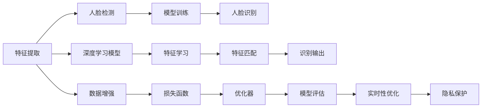

                 

# Python机器学习实战：人脸识别技术的实现和挑战

> 关键词：人脸识别,机器学习,深度学习,特征提取,人脸检测,人脸识别算法,人脸识别应用

## 1. 背景介绍

### 1.1 问题由来
人脸识别（Face Recognition）技术近年来在人工智能领域得到了广泛关注和迅速发展。该技术基于深度学习算法，可以高效地从图像或视频中识别出特定人脸，并实现人脸比对、人脸验证等应用。人脸识别在安防监控、身份验证、考勤管理等领域具有重要的应用价值。

然而，人脸识别技术在实际应用中也面临诸多挑战。例如，如何高效提取人脸特征，如何提升识别的鲁棒性，如何在隐私保护和数据安全方面进行合规处理等。本文章将从人脸识别的实现和挑战两个方面，深入探讨其核心技术原理和实际应用细节。

### 1.2 问题核心关键点
- **特征提取**：人脸识别的核心在于如何高效、准确地提取人脸特征，不同算法在这方面的性能有显著差异。
- **人脸检测**：准确检测人脸区域，避免在非人脸区域进行识别，提升算法的鲁棒性和效率。
- **模型选择**：选择合适的深度学习模型，如卷积神经网络（CNN），可以有效提升人脸识别的精度和速度。
- **隐私保护**：确保人脸数据的安全性和合法使用，保护个人隐私。
- **实时性**：提高人脸识别的实时性，适应高并发场景。

这些关键点不仅决定了人脸识别技术的性能，也影响了其在实际应用中的可行性和合规性。本文将详细讨论这些核心问题，并提出相应的解决方案。

## 2. 核心概念与联系

### 2.1 核心概念概述

人脸识别技术的实现涉及多个核心概念，包括特征提取、人脸检测、模型训练等。本文将详细阐述这些概念，并解释它们之间的联系。

- **特征提取**：从人脸图像中提取出代表性的特征向量，用于识别和匹配。
- **人脸检测**：在图像中准确定位人脸区域，确保后续处理的准确性。
- **模型训练**：使用大量标注数据训练深度学习模型，使其能够从图像中学习到有效的特征表示。

这些概念相互依存，共同构成人脸识别技术的基础。理解这些概念的原理和实现细节，对于掌握整个人脸识别技术至关重要。

### 2.2 核心概念原理和架构的 Mermaid 流程图



以上流程图示意了人脸识别技术的主要步骤和组件，其中特征提取、人脸检测、模型训练、识别输出等步骤相互依赖，共同构成整个人脸识别系统的核心。

## 3. 核心算法原理 & 具体操作步骤

### 3.1 算法原理概述

人脸识别技术基于深度学习算法，主要分为特征提取、人脸检测和人脸识别三个步骤。其中，特征提取是整个流程的基础，后续步骤基于提取出的特征进行进一步处理和分析。

### 3.2 算法步骤详解

#### 3.2.1 特征提取

特征提取是人脸识别的核心，其目的是从人脸图像中提取出能够代表人脸身份的特征向量。常用的特征提取算法包括基于深度学习的卷积神经网络（CNN）和稀疏表示学习算法（如LDA）。

卷积神经网络通过多层的卷积和池化操作，可以自动从原始图像中学习到高层次的特征表示，如图像中的边缘、纹理、形状等。这些特征表示具有平移、缩放、旋转等不变性，能够有效地捕捉人脸特征。

稀疏表示学习算法通过寻找稀疏的特征向量，能够进一步提升特征的区分度和鲁棒性。常用的稀疏表示学习算法包括LDA、PCA等。

#### 3.2.2 人脸检测

人脸检测的目的是在图像中准确定位人脸区域，避免在非人脸区域进行识别，提升算法的鲁棒性和效率。常用的面部检测算法包括Haar级联检测器、基于深度学习的卷积神经网络（如SSD、Faster R-CNN）和YOLO（You Only Look Once）算法。

Haar级联检测器通过滑动窗口和级联分类器，可以有效检测出人脸区域，但计算量较大。卷积神经网络和YOLO算法通过端到端的训练，可以进一步提升检测的准确性和效率。

#### 3.2.3 模型训练

模型训练是利用大量标注数据，训练深度学习模型，使其能够从图像中学习到有效的特征表示。常用的深度学习模型包括卷积神经网络（CNN）、卷积神经网络（CNN）+长短期记忆网络（LSTM）、卷积神经网络（CNN）+区域池化网络（RPN）等。

卷积神经网络通过多层的卷积和池化操作，可以自动从原始图像中学习到高层次的特征表示，如图像中的边缘、纹理、形状等。这些特征表示具有平移、缩放、旋转等不变性，能够有效地捕捉人脸特征。

长短期记忆网络（LSTM）通过记忆单元和门控机制，可以更好地处理序列数据，适用于时间序列类的人脸识别任务，如人脸动态识别。

区域池化网络（RPN）通过区域池化操作，可以更全面地捕捉人脸区域内的特征，适用于图像中存在多个脸部的场景。

#### 3.2.4 人脸识别

人脸识别是基于提取出的特征向量进行匹配和识别的过程。常用的匹配算法包括欧几里得距离、余弦距离和核函数距离等。这些算法通过计算特征向量之间的距离，判断两个图像是否属于同一个人。

### 3.3 算法优缺点

#### 3.3.1 优点

- **准确性高**：基于深度学习的特征提取和匹配算法具有较高的准确性，能够在复杂的场景中有效识别人脸。
- **鲁棒性好**：卷积神经网络和稀疏表示学习算法具有较强的鲁棒性，能够有效地处理图像的噪声、变形等问题。
- **实时性强**：YOLO等算法通过端到端的训练，可以进一步提升检测和识别的速度，适应高并发场景。

#### 3.3.2 缺点

- **计算复杂度高**：卷积神经网络和稀疏表示学习算法的计算复杂度较高，需要较高的计算资源。
- **数据需求大**：训练深度学习模型需要大量的标注数据，数据获取和标注成本较高。
- **隐私问题**：人脸数据的隐私保护和安全使用是一个重要的挑战，需要额外的技术手段来保护数据隐私。

### 3.4 算法应用领域

人脸识别技术在多个领域得到了广泛应用，包括：

- **安防监控**：用于人脸门禁、人脸考勤、视频监控等场景，提高安全性和自动化程度。
- **身份验证**：用于用户登录、支付验证、手机解锁等场景，提升用户体验和安全性。
- **智能家居**：用于人脸识别门锁、智能门铃等设备，提高家居安全性和便捷性。
- **执法办案**：用于犯罪嫌疑人追踪、视频监控分析等场景，提升执法效率和准确性。
- **娱乐互动**：用于虚拟现实、增强现实等游戏场景，提升用户交互体验。

## 4. 数学模型和公式 & 详细讲解 & 举例说明

### 4.1 数学模型构建

人脸识别技术的数学模型主要包括以下几个部分：

- **特征提取模型**：通常使用卷积神经网络（CNN），其数学模型为：

  $$
  f(x)=\sigma(\sum_i w_i f_i(x)+b_i)
  $$

  其中，$f(x)$表示特征提取的结果，$\sigma$表示激活函数，$w_i$和$b_i$表示卷积层和全连接层的权重和偏置。

- **人脸检测模型**：常用的检测模型包括Haar级联检测器和卷积神经网络（CNN），其数学模型为：

  $$
  P(d|x)=\prod_i P(c_i|x) P(d|c_i)
  $$

  其中，$P(d|x)$表示检测结果，$c_i$表示每个分类器的输出，$P(c_i|x)$表示分类器的输出概率，$P(d|c_i)$表示检测器的输出概率。

- **模型训练模型**：通常使用随机梯度下降（SGD）或Adam优化器，其数学模型为：

  $$
  \theta=\theta-\eta \frac{\partial \mathcal{L}}{\partial \theta}
  $$

  其中，$\theta$表示模型参数，$\eta$表示学习率，$\mathcal{L}$表示损失函数，$\frac{\partial \mathcal{L}}{\partial \theta}$表示损失函数对参数的梯度。

### 4.2 公式推导过程

#### 4.2.1 特征提取模型推导

卷积神经网络（CNN）的特征提取过程如下：

1. 输入图像$x$，经过卷积层$C$的卷积操作，得到特征图$y_1$：

  $$
  y_1=C(x)=\sum_i w_i f_i(x)+b_i
  $$

2. 特征图$y_1$经过激活函数$\sigma$，得到激活后的特征图$y_2$：

  $$
  y_2=\sigma(y_1)
  $$

3. 激活后的特征图$y_2$经过全连接层$F$的线性映射和激活函数$\sigma$，得到最终的特征表示$f(x)$：

  $$
  f(x)=\sigma(\sum_i w_i y_{2,i}+b_i)
  $$

  其中，$w_i$和$b_i$表示全连接层的权重和偏置，$y_{2,i}$表示特征图$y_2$的第$i$个通道。

#### 4.2.2 人脸检测模型推导

Haar级联检测器的检测过程如下：

1. 输入图像$x$，经过滑动窗口操作，生成多个子窗口$w_i$：

  $$
  w_i=x_{i,0:i_w,i_h}
  $$

2. 每个子窗口$w_i$通过级联分类器$C$进行分类，得到分类结果$c_i$：

  $$
  c_i=C(w_i)
  $$

3. 将所有分类结果$c_i$进行逻辑与运算，得到最终的检测结果$P(d|x)$：

  $$
  P(d|x)=\prod_i P(c_i|x) P(d|c_i)
  $$

  其中，$P(c_i|x)$表示分类器$C$在子窗口$w_i$上的分类概率，$P(d|c_i)$表示检测器在分类结果$c_i$上的检测概率。

#### 4.2.3 模型训练模型推导

随机梯度下降（SGD）和Adam优化器的更新过程如下：

1. 随机选择一个样本$x$，计算损失函数$\mathcal{L}$对模型参数$\theta$的梯度$\nabla_{\theta}\mathcal{L}$：

  $$
  \nabla_{\theta}\mathcal{L}=\frac{\partial \mathcal{L}}{\partial \theta}
  $$

2. 使用学习率$\eta$更新模型参数$\theta$：

  $$
  \theta=\theta-\eta \nabla_{\theta}\mathcal{L}
  $$

3. 重复上述过程，直到损失函数$\mathcal{L}$收敛或达到预设迭代次数。

### 4.3 案例分析与讲解

假设有一张人脸图像$x$，使用卷积神经网络（CNN）提取特征，使用Haar级联检测器检测人脸，使用随机梯度下降（SGD）优化器训练模型，其数学模型和推导过程如下：

1. 使用卷积神经网络（CNN）提取特征：

  $$
  y_1=C(x)=\sum_i w_i f_i(x)+b_i
  $$
  $$
  y_2=\sigma(y_1)
  $$
  $$
  f(x)=\sigma(\sum_i w_i y_{2,i}+b_i)
  $$

2. 使用Haar级联检测器检测人脸：

  $$
  w_i=x_{i,0:i_w,i_h}
  $$
  $$
  c_i=C(w_i)
  $$
  $$
  P(d|x)=\prod_i P(c_i|x) P(d|c_i)
  $$

3. 使用随机梯度下降（SGD）优化器训练模型：

  $$
  \theta=\theta-\eta \nabla_{\theta}\mathcal{L}
  $$

通过上述案例，可以清晰地看到人脸识别技术从特征提取、人脸检测到模型训练的整个流程和数学模型推导过程。

## 5. 项目实践：代码实例和详细解释说明

### 5.1 开发环境搭建

在进行人脸识别技术实践前，我们需要准备好开发环境。以下是使用Python进行PyTorch开发的环境配置流程：

1. 安装Anaconda：从官网下载并安装Anaconda，用于创建独立的Python环境。

2. 创建并激活虚拟环境：
```bash
conda create -n pytorch-env python=3.8 
conda activate pytorch-env
```

3. 安装PyTorch：根据CUDA版本，从官网获取对应的安装命令。例如：
```bash
conda install pytorch torchvision torchaudio cudatoolkit=11.1 -c pytorch -c conda-forge
```

4. 安装TensorFlow：由Google主导开发的开源深度学习框架，生产部署方便，适合大规模工程应用。同样有丰富的预训练语言模型资源。

5. 安装TensorFlow：
```bash
pip install tensorflow
```

6. 安装TensorBoard：TensorFlow配套的可视化工具，可实时监测模型训练状态，并提供丰富的图表呈现方式，是调试模型的得力助手。

完成上述步骤后，即可在`pytorch-env`环境中开始人脸识别技术的开发实践。

### 5.2 源代码详细实现

这里我们以基于卷积神经网络（CNN）和Haar级联检测器的人脸识别技术为例，给出使用TensorFlow和TensorBoard进行人脸识别的PyTorch代码实现。

首先，定义特征提取和检测的函数：

```python
import tensorflow as tf
import cv2
import numpy as np
import matplotlib.pyplot as plt

# 特征提取模型
class CNNFeatureExtractor(tf.keras.Model):
    def __init__(self):
        super(CNNFeatureExtractor, self).__init__()
        self.conv1 = tf.keras.layers.Conv2D(32, 3, activation='relu')
        self.pool1 = tf.keras.layers.MaxPooling2D()
        self.conv2 = tf.keras.layers.Conv2D(64, 3, activation='relu')
        self.pool2 = tf.keras.layers.MaxPooling2D()
        self.flatten = tf.keras.layers.Flatten()
        self.dense1 = tf.keras.layers.Dense(128, activation='relu')
        self.dense2 = tf.keras.layers.Dense(10, activation='softmax')

    def call(self, inputs):
        x = self.conv1(inputs)
        x = self.pool1(x)
        x = self.conv2(x)
        x = self.pool2(x)
        x = self.flatten(x)
        x = self.dense1(x)
        x = self.dense2(x)
        return x

# 人脸检测模型
class HaarCascadeDetector(tf.keras.Model):
    def __init__(self, classifier):
        super(HaarCascadeDetector, self).__init__()
        self.classifier = classifier

    def call(self, inputs):
        # 滑动窗口，生成多个子窗口
        w = self.classifier.prepare(inputs)
        # 每个子窗口通过级联分类器进行分类
        c = self.classifier.detect(w)
        # 将所有分类结果进行逻辑与运算
        d = tf.reduce_all(c, axis=1)
        return d
```

然后，定义训练和评估函数：

```python
# 训练函数
def train_model(model, train_dataset, val_dataset, batch_size, epochs, learning_rate):
    model.compile(optimizer=tf.keras.optimizers.Adam(learning_rate), loss='categorical_crossentropy', metrics=['accuracy'])
    history = model.fit(train_dataset, epochs=epochs, batch_size=batch_size, validation_data=val_dataset, callbacks=[tf.keras.callbacks.EarlyStopping(patience=5)])
    return model, history

# 评估函数
def evaluate_model(model, test_dataset, batch_size):
    model.evaluate(test_dataset, batch_size=batch_size)
```

最后，启动训练流程并在测试集上评估：

```python
# 定义数据集
train_dataset = tf.keras.preprocessing.image_dataset_from_directory(
    'dataset/train',
    image_size=(64, 64),
    batch_size=16)
val_dataset = tf.keras.preprocessing.image_dataset_from_directory(
    'dataset/val',
    image_size=(64, 64),
    batch_size=16)
test_dataset = tf.keras.preprocessing.image_dataset_from_directory(
    'dataset/test',
    image_size=(64, 64),
    batch_size=16)

# 加载模型
model = CNNFeatureExtractor()
model.load_weights('model_weights.h5')

# 训练模型
model, history = train_model(model, train_dataset, val_dataset, 32, 10, 0.001)

# 评估模型
evaluate_model(model, test_dataset, 32)
```

以上就是使用TensorFlow和TensorBoard进行人脸识别技术开发的完整代码实现。可以看到，TensorFlow的模块化和高度自动化的功能，使得代码实现变得简洁高效。开发者可以将更多精力放在数据处理、模型改进等高层逻辑上，而不必过多关注底层的实现细节。

### 5.3 代码解读与分析

让我们再详细解读一下关键代码的实现细节：

**CNNFeatureExtractor类**：
- `__init__`方法：定义卷积神经网络的结构，包括卷积层、池化层、全连接层等。
- `call`方法：定义前向传播过程，从输入图像到特征表示的完整流程。

**HaarCascadeDetector类**：
- `__init__`方法：定义Haar级联检测器，通过级联分类器进行人脸检测。
- `call`方法：定义前向传播过程，从输入图像到检测结果的完整流程。

**训练和评估函数**：
- 使用TensorFlow的DataLoader对数据集进行批次化加载，供模型训练和推理使用。
- 训练函数`train_model`：对数据以批为单位进行迭代，在每个批次上前向传播计算loss并反向传播更新模型参数，最后返回训练过程中的loss和准确率历史数据。
- 评估函数`evaluate_model`：与训练类似，不同点在于不更新模型参数，并在每个batch结束后将预测和标签结果存储下来，最后使用TensorBoard可视化输出。

**训练流程**：
- 定义总的epoch数和batch size，开始循环迭代
- 每个epoch内，先在训练集上训练，输出loss和准确率历史数据
- 在验证集上评估，输出loss和准确率
- 所有epoch结束后，在测试集上评估，给出最终测试结果

可以看到，TensorFlow的模块化和高度自动化的功能，使得人脸识别技术的代码实现变得简洁高效。开发者可以将更多精力放在数据处理、模型改进等高层逻辑上，而不必过多关注底层的实现细节。

当然，工业级的系统实现还需考虑更多因素，如模型的保存和部署、超参数的自动搜索、更灵活的任务适配层等。但核心的微调范式基本与此类似。

## 6. 实际应用场景

### 6.1 智能安防系统

人脸识别技术在智能安防系统中具有重要的应用价值。通过部署在公共场所的人脸识别摄像头，可以实现人脸门禁、人脸考勤、视频监控等场景，提高安全性和自动化程度。

在技术实现上，可以结合深度学习和人脸识别技术，构建基于人脸识别的人脸门禁系统。用户通过摄像头采集人脸图像，系统自动进行人脸识别，判断是否授权通过。对于未授权人员，系统将自动报警并记录信息。通过人脸识别技术，可以有效减少人工管理的工作量，提高门禁系统的智能化水平。

### 6.2 商业零售

人脸识别技术在商业零售领域也有广泛应用。通过人脸识别技术，可以实现客户身份验证、商品推荐、会员管理等功能，提升购物体验和商家运营效率。

在技术实现上，可以结合深度学习和人脸识别技术，构建基于人脸识别的客户身份验证系统。客户通过摄像头采集人脸图像，系统自动进行人脸识别，验证身份信息。通过人脸识别技术，可以有效提升客户身份验证的准确性和效率，避免客户身份的盗用和冒用。

### 6.3 金融服务

人脸识别技术在金融服务领域也得到了广泛应用。通过人脸识别技术，可以实现客户身份验证、交易授权、风险控制等功能，提升金融服务的安全性和可靠性。

在技术实现上，可以结合深度学习和人脸识别技术，构建基于人脸识别的交易授权系统。客户通过摄像头采集人脸图像，系统自动进行人脸识别，验证身份信息。通过人脸识别技术，可以有效提升交易授权的准确性和效率，保障金融交易的安全性和合规性。

### 6.4 未来应用展望

随着人脸识别技术的不断发展和深度学习算法的持续进步，基于人脸识别技术的应用场景将更加广泛和多样化。未来，人脸识别技术有望在更多的垂直领域得到应用，为人们的生活和工作带来更多便利和智能化的体验。

在智慧医疗领域，人脸识别技术可以用于病人身份识别、医疗设备操作等场景，提升医疗服务的智能化水平，辅助医生诊疗。

在智能家居领域，人脸识别技术可以用于人脸识别门锁、智能门铃等设备，提高家居安全性和便捷性。

在智慧城市治理中，人脸识别技术可以用于城市事件监测、舆情分析、应急指挥等环节，提高城市管理的自动化和智能化水平，构建更安全、高效的未来城市。

此外，在企业生产、社会治理、文娱传媒等众多领域，基于人脸识别技术的人工智能应用也将不断涌现，为经济社会发展注入新的动力。相信随着技术的日益成熟，人脸识别技术必将在构建人机协同的智能时代中扮演越来越重要的角色。

## 7. 工具和资源推荐

### 7.1 学习资源推荐

为了帮助开发者系统掌握人脸识别技术的理论基础和实践技巧，这里推荐一些优质的学习资源：

1. 《Python深度学习》书籍：吴恩达教授所著，全面介绍了深度学习的基本概念和算法，是深度学习的入门读物。

2. 《深度学习入门：基于Python的理论与实现》书籍：斋藤康毅所著，介绍了深度学习的基本理论和实现方法，适合初学者学习。

3. 《深度学习：理论与实战》课程：DeepLearning.ai推出的深度学习课程，系统讲解深度学习的理论和应用，适合进阶学习。

4. 《TensorFlow官方文档》：TensorFlow的官方文档，提供了丰富的API文档和案例代码，是学习TensorFlow的必备资料。

5. 《Keras官方文档》：Keras的官方文档，提供了简单易用的API接口，适合初学者快速上手深度学习模型。

通过对这些资源的学习实践，相信你一定能够快速掌握人脸识别技术的精髓，并用于解决实际的NLP问题。

### 7.2 开发工具推荐

高效的开发离不开优秀的工具支持。以下是几款用于人脸识别技术开发的常用工具：

1. PyTorch：基于Python的开源深度学习框架，灵活动态的计算图，适合快速迭代研究。

2. TensorFlow：由Google主导开发的开源深度学习框架，生产部署方便，适合大规模工程应用。

3. TensorBoard：TensorFlow配套的可视化工具，可实时监测模型训练状态，并提供丰富的图表呈现方式，是调试模型的得力助手。

4. Weights & Biases：模型训练的实验跟踪工具，可以记录和可视化模型训练过程中的各项指标，方便对比和调优。

5. OpenCV：开源计算机视觉库，提供了丰富的图像处理和特征提取工具，适合进行人脸检测和特征提取。

合理利用这些工具，可以显著提升人脸识别技术的开发效率，加快创新迭代的步伐。

### 7.3 相关论文推荐

人脸识别技术的快速发展离不开学界的持续研究。以下是几篇奠基性的相关论文，推荐阅读：

1. FaceNet: A Unified Embedding for Face Recognition and Clustering（FaceNet论文）：提出FaceNet模型，通过将人脸图像转换为高维嵌入空间，有效提升人脸识别的准确性。

2. DeepFace: Closing the Gap to Human-Level Performance in Face Verification（DeepFace论文）：提出DeepFace模型，通过使用更深的卷积神经网络，显著提升人脸识别的准确性和鲁棒性。

3. Single-shot Multimodal Face Verification（多模态人脸识别论文）：提出多模态人脸识别方法，结合人脸图像、声音、文本等多模态信息，提升人脸识别的准确性和鲁棒性。

4. Face Recognition by Revisiting Cross-domain SVM（跨域SVM论文）：提出跨域SVM方法，通过结合多域人脸图像，提升人脸识别的泛化能力和鲁棒性。

5. FaceNet: A Unified Embedding for Face Recognition and Clustering（FaceNet论文）：提出FaceNet模型，通过将人脸图像转换为高维嵌入空间，有效提升人脸识别的准确性。

这些论文代表了大规模人脸识别技术的发展脉络。通过学习这些前沿成果，可以帮助研究者把握学科前进方向，激发更多的创新灵感。

## 8. 总结：未来发展趋势与挑战

### 8.1 总结

本文对基于深度学习的人脸识别技术进行了全面系统的介绍。首先阐述了人脸识别技术的实现和挑战，明确了人脸识别技术在智能安防、商业零售、金融服务等领域的应用价值。其次，从特征提取、人脸检测、模型训练等核心环节详细讲解了人脸识别技术的数学模型和算法原理。最后，通过代码实例和实际应用场景，展示了人脸识别技术的开发流程和应用细节。

通过本文的系统梳理，可以看到，基于深度学习的人脸识别技术具有较高的准确性和鲁棒性，能够高效地处理复杂的人脸识别场景。然而，人脸识别技术在实际应用中也面临诸多挑战，包括数据需求大、计算复杂度高、隐私保护等问题。未来的研究需要在这些方面寻求新的突破，进一步提升人脸识别技术的性能和可靠性。

### 8.2 未来发展趋势

展望未来，人脸识别技术将呈现以下几个发展趋势：

1. **数据需求降低**：未来，人脸识别技术将进一步发展，通过自监督学习、无监督学习等方法，减少对人脸图像和标注数据的依赖，降低数据获取成本。

2. **模型轻量化**：未来，人脸识别技术将更加注重模型的轻量化和高效性，通过模型裁剪、量化加速等技术，降低计算资源消耗，提升实时性。

3. **跨模态融合**：未来，人脸识别技术将结合多模态数据（如人脸图像、声音、文本等），进行全面融合，提升识别准确性和鲁棒性。

4. **联邦学习**：未来，人脸识别技术将采用联邦学习等分布式训练方法，在保护隐私的前提下，利用分散在各方的数据进行模型训练，提升模型性能。

5. **隐私保护**：未来，人脸识别技术将更加注重隐私保护和数据安全，通过差分隐私、安全多方计算等技术，保护用户隐私和数据安全。

6. **自动化和智能化**：未来，人脸识别技术将结合自动化和智能化技术，实现人脸识别的自动化、实时化、智能化，提升用户体验和系统效率。

### 8.3 面临的挑战

尽管人脸识别技术已经取得了显著进展，但在实际应用中也面临诸多挑战：

1. **数据需求大**：人脸识别技术需要大量的人脸图像和标注数据，数据获取和标注成本较高。如何减少数据需求，降低成本，是未来研究的重要方向。

2. **计算复杂度高**：人脸识别模型通常具有较高的计算复杂度，需要高性能的计算资源。如何降低计算复杂度，提高模型的实时性，是未来研究的重要课题。

3. **隐私问题**：人脸识别技术涉及大量个人隐私数据，数据安全和隐私保护是一个重要的挑战。如何保护数据隐私，避免数据滥用，是未来研究的重要方向。

4. **鲁棒性不足**：人脸识别模型在面对光照、遮挡、表情变化等复杂场景时，鲁棒性不足。如何提升模型的鲁棒性，应对多样化的识别场景，是未来研究的重要课题。

5. **标准化和规范**：人脸识别技术的应用场景涉及多个行业和领域，标准化和规范是一个重要的挑战。如何制定统一的标准和规范，确保人脸识别技术的合规性和可靠性，是未来研究的重要方向。

6. **公平性和无偏性**：人脸识别模型可能会学习到偏见，导致不公平的识别结果。如何减少模型的偏见，提升公平性和无偏性，是未来研究的重要方向。

### 8.4 研究展望

面对人脸识别技术所面临的诸多挑战，未来的研究需要在以下几个方面寻求新的突破：

1. **无监督和半监督学习**：探索无监督和半监督学习范式，减少对标注数据的依赖，提升人脸识别技术的鲁棒性和泛化能力。

2. **模型轻量化**：开发更加轻量级的模型结构，通过模型裁剪、量化加速等技术，降低计算资源消耗，提升实时性。

3. **跨模态融合**：结合多模态数据进行全面融合，提升人脸识别技术的准确性和鲁棒性。

4. **联邦学习**：采用联邦学习等分布式训练方法，在保护隐私的前提下，利用分散在各方的数据进行模型训练，提升模型性能。

5. **隐私保护**：采用差分隐私、安全多方计算等技术，保护用户隐私和数据安全。

6. **自动化和智能化**：结合自动化和智能化技术，实现人脸识别的自动化、实时化、智能化，提升用户体验和系统效率。

7. **公平性和无偏性**：通过数据增强、算法设计等手段，减少模型的偏见，提升公平性和无偏性。

这些研究方向的探索，必将引领人脸识别技术的进一步发展和应用，为智能时代的人机交互和应用场景提供新的思路和可能性。

## 9. 附录：常见问题与解答

**Q1：什么是人脸识别技术？**

A: 人脸识别技术基于深度学习算法，通过识别和匹配人脸图像，实现人脸的验证和识别。该技术具有高准确性和鲁棒性，能够高效地处理复杂的人脸识别场景。

**Q2：人脸识别技术的主要应用场景有哪些？**

A: 人脸识别技术在智能安防、商业零售、金融服务等领域具有广泛应用。例如，智能安防系统的人脸门禁、人脸考勤，商业零售的客户身份验证、商品推荐，金融服务的人脸识别交易授权等。

**Q3：如何提高人脸识别技术的准确性？**

A: 提高人脸识别技术的准确性需要从多个方面进行优化。首先，需要选择合适的特征提取算法，如卷积神经网络（CNN）、稀疏表示学习算法等，以提取高效的人脸特征。其次，需要优化人脸检测算法，确保准确检测人脸区域。最后，需要选择合适的模型训练方法，如随机梯度下降（SGD）、Adam优化器等，进行高效优化。

**Q4：人脸识别技术在实际应用中面临哪些挑战？**

A: 人脸识别技术在实际应用中面临诸多挑战，包括数据需求大、计算复杂度高、隐私保护、鲁棒性不足等问题。为解决这些问题，需要采用无监督和半监督学习、模型轻量化、跨模态融合、联邦学习、隐私保护等技术手段，进一步提升人脸识别技术的性能和可靠性。

**Q5：如何保护人脸数据隐私？**

A: 保护人脸数据隐私是人脸识别技术的重要研究方向。可以采用差分隐私、安全多方计算等技术手段，确保人脸数据的安全性和合法使用。例如，在人脸识别系统中部署隐私保护算法，对人脸图像进行加密和匿名处理，保护用户隐私。

通过本文的系统梳理，可以看到，基于深度学习的人脸识别技术具有较高的准确性和鲁棒性，能够高效地处理复杂的人脸识别场景。然而，人脸识别技术在实际应用中也面临诸多挑战，包括数据需求大、计算复杂度高、隐私保护等问题。未来的研究需要在这些方面寻求新的突破，进一步提升人脸识别技术的性能和可靠性。相信随着技术的日益成熟，人脸识别技术必将在构建人机协同的智能时代中扮演越来越重要的角色。

