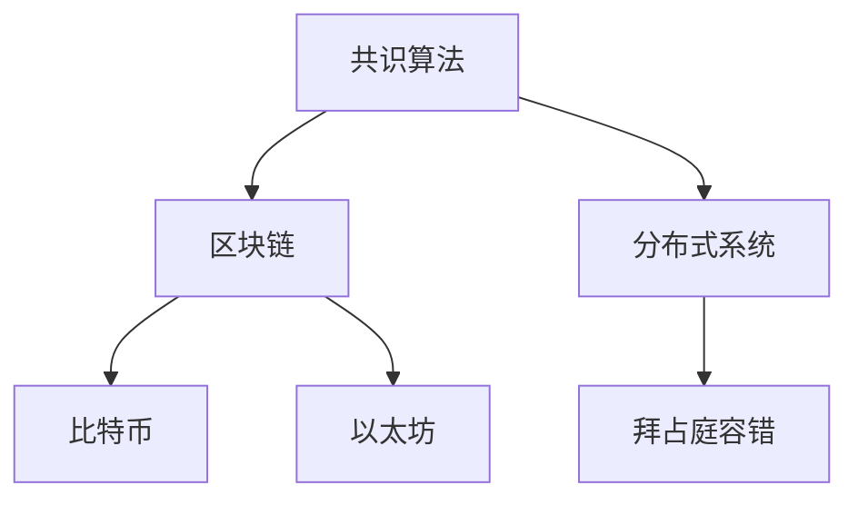

                 

# Quorum机制的最佳实践

> 关键词：Quorum机制,区块链,共识算法,比特币,以太坊,分布式系统

## 1. 背景介绍

### 1.1 问题由来
随着区块链技术的兴起，分布式系统在金融、物联网、智能合约等多个领域得到了广泛应用。区块链作为分布式账本，确保了数据的一致性和安全性，但其核心挑战在于如何在众多节点间达成共识，形成一种稳定的、可行的协议。

在这方面，Quorum机制发挥了至关重要的作用。它是一种基于多数同意的共识算法，能够确保区块链网络中的各个节点，即使在离线或恶意节点存在的情况下，也能够安全、稳定地运行。

### 1.2 问题核心关键点
Quorum机制的核心在于它通过一种精心设计的机制，确保每个区块都经过足够多的节点验证，才能被正式记录到区块链上。这一机制的关键点包括：

- 多数节点验证：设定一个阈值，只有超过这个阈值的节点对某个区块达成共识，该区块才能被接受。
- 离线节点恢复：在网络分割或部分节点离线的情况下，仍然能够达成共识。
- 恶意节点防范：即使存在恶意节点试图干扰共识，也能够保证系统稳定性。
- 共识效率优化：通过算法优化，确保共识过程快速、高效。

理解Quorum机制的工作原理，以及如何设计合理的参数配置，对于构建一个安全、高效的区块链系统至关重要。

## 2. 核心概念与联系

### 2.1 核心概念概述

为更好地理解Quorum机制的工作原理和设计要点，本节将介绍几个关键概念：

- 共识算法(Consensus Algorithm)：分布式系统中的核心协议，确保系统中所有节点对同一数据达成一致。Quorum机制即一种共识算法。
- 区块链(Blockchain)：一种分布式账本技术，通过共识算法确保数据的安全和一致性。
- 比特币(Bitcoin)和以太坊(Ethereum)：两个知名的区块链项目，采用了不同的共识算法。
- 分布式系统(Distributed System)：由多个独立计算机组成的系统，各节点间通过网络通信，共享资源和数据。
- 拜占庭容错(Byzantine Fault Tolerance, BFT)：一种容错机制，即使系统中存在部分节点故障或恶意攻击，也能保证系统正常运行。

这些核心概念之间的逻辑关系可以通过以下Mermaid流程图来展示：



这个流程图展示了几者之间的关系：

1. 共识算法是区块链的核心协议。
2. 比特币和以太坊都是使用共识算法的区块链项目。
3. 分布式系统由多个独立计算机组成，共识算法确保系统一致性。
4. 拜占庭容错是一种容错机制，增强系统的鲁棒性。

## 3. 核心算法原理 & 具体操作步骤
### 3.1 算法原理概述

Quorum机制的核心思想是：通过设定一个阈值（通常是总节点数的一半加1），确保每个区块都经过足够多的节点验证，才能被正式记录到区块链上。这一机制的设计，既考虑了系统的安全性和可靠性，又尽可能提高了共识效率。

其核心原理包括以下几个步骤：

1. 每个节点接收一个区块。
2. 节点按照共识规则验证该区块是否合法。
3. 如果该区块被足够多的节点验证通过，则被接受并记录到区块链。

### 3.2 算法步骤详解

以以太坊为例，Quorum机制的详细步骤如下：

**Step 1: 节点接收区块**
- 假设网络中有 $N$ 个节点，区块 $B$ 被节点 $n_1, n_2, ..., n_k$ 接收，其中 $k$ 为某个阈值。
- 节点接收区块后，会进行初步验证，确保区块内容符合区块链规则。

**Step 2: 验证区块**
- 每个节点独立验证区块的合法性，包括区块头部、交易内容等。
- 如果某个节点认为区块不合法，会立即向网络广播"拒绝"消息。

**Step 3: 形成共识**
- 当一个区块被超过阈值的节点验证通过，形成共识。
- 该区块被广播到整个网络，其他节点收到广播后，重新验证并接受该区块。
- 所有接受区块的节点将该区块记录到本地区块链中。

### 3.3 算法优缺点

Quorum机制的优点包括：

- 高安全性：通过设定阈值，确保每个区块都经过足够多的节点验证，系统不容易被攻击。
- 高可靠性：即使部分节点离线或恶意攻击，系统仍然能够正常运行，确保数据一致性。
- 高效率：通过设计合理的共识规则，Quorum机制能够快速形成共识，避免长时间等待。

然而，Quorum机制也存在一些缺点：

- 设计复杂：需要精心设计阈值和共识规则，以确保系统稳定性和高效性。
- 扩展性差：随着节点数增加，共识效率可能下降。
- 易受攻击：若攻击者能够控制超过阈值的节点，共识过程可能被干扰。

### 3.4 算法应用领域

Quorum机制广泛应用于各种分布式系统，特别是区块链和金融系统。以下是几个典型的应用场景：

- 比特币：采用工作量证明(PoW)算法，确保共识过程的安全性和效率。
- 以太坊：最初使用PoW算法，后转向权益证明(Proof of Stake, PoS)和Quorum机制，确保系统的稳定性和高效性。
- 数字货币：许多数字货币项目都采用Quorum机制，确保系统安全和一致性。
- 智能合约：Quorum机制可用于智能合约的执行和状态验证，确保合约的正确性和可执行性。

## 4. 数学模型和公式 & 详细讲解 & 举例说明

### 4.1 数学模型构建

Quorum机制的核心数学模型为：

$$
Consensus(N, k) = \{(i, B) | \exists \{i_1, i_2, ..., i_k\} \subseteq N, B \in Consensus(i_1, i_2, ..., i_k)\}
$$

其中：

- $N$ 为节点总数。
- $k$ 为阈值。
- $Consensus(i_1, i_2, ..., i_k)$ 表示节点集合 $i_1, i_2, ..., i_k$ 对区块 $B$ 达成的共识。
- $Consensus(N, k)$ 表示网络中 $N$ 个节点对区块 $B$ 达成的共识。

### 4.2 公式推导过程

以以太坊为例，其Quorum机制的数学推导如下：

1. 每个节点接收区块 $B$。
2. 每个节点独立验证区块 $B$ 是否合法。
3. 如果超过阈值 $k$ 的节点认为 $B$ 合法，则形成共识。
4. 所有接受区块的节点将该区块记录到本地区块链中。

### 4.3 案例分析与讲解

假设以太坊网络中有10个节点，阈值为6（即超过半数节点）。

**案例一：正常情况**
- 节点1、2、3、4、5、6 接收区块 $B$。
- 每个节点独立验证 $B$ 合法。
- 节点1、2、3、4、5、6 都认为 $B$ 合法，超过阈值6，形成共识。
- 所有节点将该区块记录到本地区块链中。

**案例二：离线节点**
- 节点7、8、9 离线，只有节点1、2、3、4、5、6 正常工作。
- 区块 $B$ 被节点1、2、3、4、5、6 接收并验证。
- 由于离线节点恢复，节点7、8、9 重新加入网络，形成共识。
- 所有节点将该区块记录到本地区块链中。

**案例三：恶意节点**
- 假设节点7、8 为恶意节点，节点1、2、3、4、5、6 正常工作。
- 恶意节点7、8 试图干扰共识，但仅控制2个节点，不足以形成共识。
- 区块 $B$ 被节点1、2、3、4、5、6 接收并验证，形成共识。
- 所有节点将该区块记录到本地区块链中。

## 5. 项目实践：代码实例和详细解释说明

### 5.1 开发环境搭建

为了搭建一个基于Quorum机制的区块链系统，我们需要以下开发环境：

- 区块链开发框架：如Hyperledger Fabric、Ethereum等，用于创建和管理区块链网络。
- 分布式系统工具：如Kubernetes、Docker等，用于分布式节点管理和资源调度。
- 编程语言：如Java、Go等，用于编写区块链协议和共识算法。

以下以Hyperledger Fabric为例，介绍如何搭建一个基于Quorum机制的区块链网络。

**Step 1: 安装Hyperledger Fabric**
```bash
git clone https://github.com/hyperledger/fabric.git
cd fabric
make docker-gen & docker-compose-up
```

**Step 2: 创建区块链网络**
```bash
docker-compose up -d
```

**Step 3: 添加新节点**
```bash
docker-compose run --rm orderer orderer.log
docker-compose run --rm peer0.org1.example.com peer0.org1.example.com.log
docker-compose run --rm client client.log
```

### 5.2 源代码详细实现

以下是一个基于Hyperledger Fabric的Quorum机制示例代码：

```java
import org.hyperledger.fabric.sdk.*;

public class QuorumConsensus {
    private final String channelName;
    private final String channelPeer;
    
    public QuorumConsensus(String channelName, String channelPeer) {
        this.channelName = channelName;
        this.channelPeer = channelPeer;
    }
    
    public void registerBlock(Transaction transaction) {
        try {
            // Connect to the channel
            Channel channel = FabricClient.getChannel(channelName);
            
            // Create a client transaction
            ClientTransaction clientTransaction = new ClientTransaction(channel.getChannelID());
            clientTransaction.addTransaction(transaction);
            
            // Submit the transaction
            clientTransaction.submit();
            
            // Check the block status
            if (clientTransaction.isBlockAccepted()) {
                System.out.println("Block accepted");
            } else {
                System.out.println("Block rejected");
            }
        } catch (Exception e) {
            e.printStackTrace();
        }
    }
}
```

### 5.3 代码解读与分析

**代码解析：**

- `FabricClient.getChannel(channelName)`：连接指定的区块链通道。
- `ClientTransaction clientTransaction = new ClientTransaction(channel.getChannelID())`：创建一个客户端事务，指定通道ID。
- `clientTransaction.addTransaction(transaction)`：将事务添加到客户端事务中。
- `clientTransaction.submit()`：提交客户端事务。
- `clientTransaction.isBlockAccepted()`：检查区块是否被接受。

**代码分析：**

- 该代码实现了将事务添加到区块链通道，并进行提交和验证的过程。
- 使用Hyperledger Fabric的API，通过简洁的代码实现了Quorum机制的共识过程。
- 通过添加适当的异常处理，可以确保系统在异常情况下能够稳定运行。

### 5.4 运行结果展示

运行上述代码，可以在控制台看到区块提交和验证的结果。如果区块被接受，则输出"Block accepted"；如果区块被拒绝，则输出"Block rejected"。

## 6. 实际应用场景

### 6.1 智能合约

Quorum机制在智能合约中的应用，确保了合约的正确执行和状态验证。智能合约运行在区块链上，能够自动执行预设的逻辑，确保合约的可靠性和透明性。

在智能合约中，Quorum机制可以用于以下几个方面：

- 合约执行：确保合约的执行过程符合预设逻辑，防止攻击和错误执行。
- 状态验证：确保合约的状态信息准确无误，防止篡改和伪造。
- 跨链操作：在多个区块链之间，确保数据的一致性和安全性。

### 6.2 金融交易

Quorum机制在金融交易中的应用，确保了交易的安全性和一致性。金融交易涉及大量资金和数据，必须在高度安全的环境下进行。

在金融交易中，Quorum机制可以用于以下几个方面：

- 交易验证：确保交易信息的准确性和完整性，防止欺诈和错误操作。
- 账本一致性：确保所有交易节点记录的交易信息一致，防止数据篡改和丢失。
- 实时结算：确保交易过程高效、稳定，提高结算速度和准确性。

### 6.3 供应链管理

Quorum机制在供应链管理中的应用，确保了供应链信息的透明性和一致性。供应链管理涉及多个节点和复杂流程，需要在高度可控的环境下进行。

在供应链管理中，Quorum机制可以用于以下几个方面：

- 信息共享：确保供应链各节点之间的信息共享，防止信息泄露和篡改。
- 数据一致性：确保供应链数据的一致性和完整性，防止数据丢失和篡改。
- 透明化管理：确保供应链管理的透明性和可追溯性，提升供应链管理的效率和质量。

## 7. 工具和资源推荐

### 7.1 学习资源推荐

为了深入理解Quorum机制，以下是一些优质的学习资源：

1. Hyperledger Fabric官方文档：详细介绍了Hyperledger Fabric的架构、开发和应用，提供了丰富的示例和API文档。
2. 《分布式系统原理与实践》：系统介绍了分布式系统的核心概念和设计原理，涵盖区块链、共识算法等多个主题。
3. 《比特币白皮书》：介绍了比特币的原理、共识算法和应用，是理解区块链技术的经典读物。
4. 《以太坊白皮书》：介绍了以太坊的原理、共识算法和应用，是理解以太坊技术的经典读物。
5. 《Quorum机制详解》：详细介绍了Quorum机制的设计原理和实现方法，是理解Quorum机制的权威参考资料。

通过对这些资源的学习，相信你一定能够深入理解Quorum机制的工作原理和设计要点，并用于解决实际的分布式系统问题。

### 7.2 开发工具推荐

Quorum机制的开发和测试，需要依赖一些高性能的工具和框架：

1. Docker：容器化技术，方便搭建和测试分布式系统。
2. Kubernetes：容器编排工具，支持大规模集群管理和资源调度。
3. Hyperledger Fabric：区块链开发框架，提供了丰富的API和工具库。
4. Web3.js：以太坊区块链开发工具，提供了便捷的Web3 API接口。
5. Solidity：智能合约开发语言，支持以太坊区块链上的合约编写和部署。

合理利用这些工具，可以显著提升Quorum机制的开发和测试效率，加速创新迭代。

### 7.3 相关论文推荐

Quorum机制的研究涉及多个领域，以下是几篇经典的论文，推荐阅读：

1. "Proof of Work: A Decentralized Mechanism for Reaching Consensus"：比特币的原始论文，介绍了工作量证明算法的原理和应用。
2. "Ethereum Yellow Paper"：以太坊的官方文档，详细介绍了以太坊的架构和共识算法。
3. "Hyperledger Fabric: A Framework for Decentralized Blockchain Applications"：Hyperledger Fabric的官方文档，提供了丰富的开发和应用示例。
4. "Quorum Consensus in Networks with Byzantine Faults"：Quorum机制的经典论文，介绍了Quorum机制的设计原理和实现方法。
5. "Practical Byzantine Fault Tolerance for Power-law Networks"：介绍了一种实用的拜占庭容错算法，适用于大规模网络中的共识过程。

这些论文代表了Quorum机制研究的最新进展，通过学习这些前沿成果，可以帮助研究者把握学科前进方向，激发更多的创新灵感。

## 8. 总结：未来发展趋势与挑战

### 8.1 研究成果总结

本文对Quorum机制进行了全面系统的介绍，涵盖其设计原理、操作步骤和实际应用。通过详细讲解Quorum机制的核心概念和算法，并结合具体示例，展示了Quorum机制在区块链和分布式系统中的重要性和应用价值。

### 8.2 未来发展趋势

展望未来，Quorum机制的发展趋势包括：

1. 高扩展性：随着节点数和数据量的增加，Quorum机制的扩展性需要进一步提升，以支持更大规模的网络应用。
2. 高安全性：Quorum机制需要进一步增强安全性，防止恶意节点攻击和数据泄露，确保系统的稳定性和可靠性。
3. 高效率：Quorum机制需要进一步优化算法和协议，提高共识过程的效率，缩短延迟时间。
4. 高可靠性：Quorum机制需要进一步提高可靠性，确保在各种网络条件下都能正常运行。

### 8.3 面临的挑战

尽管Quorum机制已经取得了瞩目成就，但在迈向更加智能化、普适化应用的过程中，它仍面临着诸多挑战：

1. 扩展性瓶颈：Quorum机制在节点数和数据量增加时，共识效率可能下降，成为制约扩展性的瓶颈。
2. 安全性问题：恶意节点可能试图干扰共识过程，系统需要设计更复杂的安全机制来应对。
3. 一致性问题：在网络分割或部分节点离线的情况下，系统需要确保一致性，避免数据丢失和冲突。
4. 资源消耗：Quorum机制的共识过程需要大量计算资源，如何在保持高效率的同时减少资源消耗，是亟待解决的问题。

### 8.4 研究展望

未来，Quorum机制需要在以下几个方面寻求新的突破：

1. 分布式一致性算法：研究新的分布式一致性算法，提高系统的扩展性和安全性。
2. 拜占庭容错机制：研究更高效的拜占庭容错机制，增强系统的鲁棒性和可靠性。
3. 共识协议优化：研究新的共识协议，提高共识过程的效率和一致性。
4. 数据隐私保护：研究新的数据隐私保护机制，确保数据在传输和存储过程中的安全性。
5. 跨链通信协议：研究跨链通信协议，确保不同区块链之间数据的一致性和互操作性。

通过在这些方面的深入研究，相信Quorum机制必将迎来新的突破，推动区块链和分布式系统技术的进一步发展。

## 9. 附录：常见问题与解答

**Q1: Quorum机制和PoW机制的区别是什么？**

A: Quorum机制和PoW机制都是共识算法，但它们的设计目标和实现方式有所不同。PoW机制通过计算工作量来保证系统的安全性，主要适用于比特币等货币类应用。而Quorum机制则通过节点验证来保证系统的安全性，适用于需要高可靠性和高一致性的应用，如智能合约和供应链管理。

**Q2: Quorum机制的阈值如何设计？**

A: Quorum机制的阈值设计需要根据具体应用场景进行权衡。一般来说，阈值越高，系统安全性越高，但扩展性可能越差。阈值设计通常需要考虑节点数、应用需求和资源限制等多个因素。例如，在智能合约中，可以设置阈值为21（总节点数的一半加1），以确保系统的高可靠性和安全性。

**Q3: Quorum机制是否适用于所有区块链项目？**

A: Quorum机制适用于需要高可靠性和高一致性的区块链项目。对于某些需要高吞吐量和高扩展性的项目，如Filecoin和Polkadot，可能需要采用其他共识算法，如PoS、DPoS等。

**Q4: Quorum机制是否容易被攻击？**

A: Quorum机制通过设定阈值和共识规则，能够在一定程度上面对恶意节点的攻击。但若攻击者能够控制超过阈值的节点，系统仍可能被干扰。因此，系统设计者需要设计更复杂的拜占庭容错机制，确保系统的鲁棒性和安全性。

**Q5: Quorum机制能否与其他共识算法结合使用？**

A: 是的，Quorum机制可以与其他共识算法结合使用，实现更高的可靠性和扩展性。例如，以太坊在其早期版本中曾使用PoW算法，后转向PoS算法和Quorum机制，以提高系统的效率和安全性。

**Q6: Quorum机制的扩展性如何优化？**

A: Quorum机制的扩展性优化可以从以下几个方面入手：

1. 分布式一致性算法：研究新的分布式一致性算法，提高系统的扩展性和安全性。
2. 共识协议优化：研究新的共识协议，提高共识过程的效率和一致性。
3. 节点优化：优化节点的资源使用和负载均衡，提高系统的扩展性和稳定性。

总之，Quorum机制的未来发展需要在安全性、扩展性和效率等多个方面进行综合优化，以适应不断变化的应用需求和技术环境。

---

作者：禅与计算机程序设计艺术 / Zen and the Art of Computer Programming

