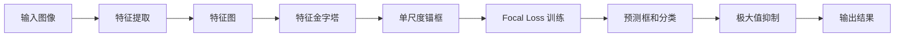

                 

# RetinaNet原理与代码实例讲解

> 关键词：RetinaNet, 目标检测, 深度学习, 单阶段检测, 单尺度锚框, 极大值抑制

## 1. 背景介绍

目标检测是计算机视觉领域中的一个重要问题，它旨在识别图像中的对象，并标注它们的类别和位置。传统的目标检测方法通常包括两步：首先使用选择性搜索等方法生成候选区域，然后在这些区域上应用分类器和回归器。然而，这种方法具有许多缺陷，包括漏检、误检和速度慢等。为了解决这些问题，近年来，基于深度学习的方法如R-CNN系列、Fast R-CNN、Faster R-CNN和YOLO等，在目标检测领域取得了显著的进展。

其中，RetinaNet是单阶段目标检测算法中的佼佼者，它采用了单尺度锚框和极大值抑制的思想，大幅提升了目标检测的准确率和速度。本节将详细讲解RetinaNet算法的基本原理，并结合代码实例，展示其实现过程。

## 2. 核心概念与联系

### 2.1 核心概念概述

RetinaNet算法主要包括以下几个核心概念：

- 单尺度锚框(Single-Scale Anchor): 传统的目标检测算法如Faster R-CNN通常采用多尺度锚框来捕捉不同大小的物体。而RetinaNet只使用单一尺度的锚框，这种简化使得算法更加高效。

- 极大值抑制(Max-Over-Threshold Suppression): 在RetinaNet中，极大值抑制被用来处理目标检测中的重叠问题。极大值抑制通过设定一个阈值，只保留预测置信度高于阈值的框，从而去除重叠的框，避免了错误的检测。

- 单阶段检测(One-Stage Detection): 单阶段检测不同于传统的两阶段检测方法，它通过直接在特征图上预测目标的类别和位置，减少了额外的候选区域生成步骤，提高了检测速度。

- Focal Loss: 由于RetinaNet中存在正负样本不均衡的问题，Focal Loss被引入来提升训练过程中的正样本权重，从而解决该问题。

- 特征金字塔网络(Feature Pyramid Network, FPN): 特征金字塔网络是一种用于多尺度目标检测的网络结构，它通过将不同尺度的特征图融合，可以在多个尺度上检测目标。

这些概念共同构成了RetinaNet算法的核心框架，使得它能够在目标检测任务上取得出色的性能。

### 2.2 核心概念原理和架构的 Mermaid 流程图(Mermaid 流程节点中不要有括号、逗号等特殊字符)



## 3. 核心算法原理 & 具体操作步骤

### 3.1 算法原理概述

RetinaNet算法是一种单阶段目标检测算法，它通过在特征图上直接预测目标的类别和位置，避免了两阶段检测中额外候选区域生成的步骤，从而提高了检测速度。RetinaNet算法的主要特点包括：

1. 使用单尺度锚框，减少了多尺度锚框带来的额外计算成本。
2. 采用Focal Loss来解决正负样本不均衡问题。
3. 采用极大值抑制来处理重叠的预测框。
4. 使用特征金字塔网络(FPN)来实现多尺度检测。

### 3.2 算法步骤详解

RetinaNet算法的训练和推理流程大致如下：

1. 输入图像：RetinaNet接受一张大小为 $H \times W$ 的图像作为输入，图像中可能包含多个目标。

2. 特征提取：使用卷积神经网络(Convolutional Neural Network, CNN)对输入图像进行特征提取，生成一个特征图 $X$。

3. 特征金字塔：将特征图 $X$ 输入到特征金字塔网络(FPN)中，通过多尺度卷积和池化操作，得到多个不同尺度的特征图。

4. 单尺度锚框：在每个尺度的特征图上，生成一组固定大小的锚框(Anchor Box)，每个锚框对应一个位置和大小。

5. 预测框和分类：在每个锚框上，使用卷积层和全连接层预测该锚框是否包含目标以及目标的类别。预测结果包括每个锚框的置信度(Confidence)和类别概率(Class Probability)。

6. Focal Loss训练：使用Focal Loss作为训练损失函数，提升正样本的权重，从而解决正负样本不均衡的问题。

7. 极大值抑制：在预测框和分类结果中，只保留置信度高于阈值 $\tau$ 的框，去除重叠的框，最终得到目标的预测框和类别。

### 3.3 算法优缺点

RetinaNet算法具有以下优点：

1. 单尺度锚框和单阶段检测使得算法简单高效，检测速度较快。
2. Focal Loss解决了正负样本不均衡的问题，提高了目标检测的准确率。
3. 极大值抑制有效去除了重叠的框，进一步提升了检测精度。

同时，RetinaNet算法也存在一些缺点：

1. 单尺度锚框可能无法处理尺度变化较大的目标。
2. Focal Loss在训练过程中可能会导致过拟合。
3. 极大值抑制可能会去除一些误检的框，导致漏检。

### 3.4 算法应用领域

RetinaNet算法广泛应用于计算机视觉中的目标检测领域，特别是在实时目标检测、无人驾驶、安防监控等需要高效、准确的检测任务的场合。

## 4. 数学模型和公式 & 详细讲解 & 举例说明

### 4.1 数学模型构建

RetinaNet算法的数学模型包括特征提取、单尺度锚框生成、预测框和分类、极大值抑制和Focal Loss等步骤。

### 4.2 公式推导过程

#### 4.2.1 特征提取

特征提取过程可以通过以下公式表示：

$$
X = \mathcal{F}(I)
$$

其中，$X$ 表示特征图，$I$ 表示输入图像，$\mathcal{F}$ 表示特征提取函数，如卷积层和池化层。

#### 4.2.2 单尺度锚框生成

假设特征图的高度和宽度分别为 $H$ 和 $W$，生成 $N$ 个大小为 $s$ 的锚框，每个锚框的中心位置为 $(h_i, w_i)$，则锚框的位置可以表示为：

$$
r_i = \frac{h_i}{H}, w_i = \frac{w_i}{W}
$$

其中，$r_i$ 和 $w_i$ 分别表示锚框在特征图上的位置。

#### 4.2.3 预测框和分类

假设特征图上每个锚框 $r_i$ 的概率为 $p(r_i)$，则预测框和分类的结果可以表示为：

$$
\begin{aligned}
p(r_i) &= \sigma(f_{cls}(r_i)) \\
c(r_i) &= \sigma(f_{reg}(r_i))
\end{aligned}
$$

其中，$f_{cls}$ 和 $f_{reg}$ 分别表示分类和回归函数，$\sigma$ 表示Sigmoid函数，$p(r_i)$ 表示锚框的置信度，$c(r_i)$ 表示锚框的预测框。

#### 4.2.4 极大值抑制

极大值抑制的目的是去除重叠的框，只保留置信度最高的框。假设预测框的置信度为 $p(r_i)$，则极大值抑制的公式可以表示为：

$$
p(r_i) = \max\{p(r_i), \tau\}
$$

其中，$\tau$ 表示阈值。

#### 4.2.5 Focal Loss

Focal Loss的目的是提升正样本的权重，解决正负样本不均衡的问题。假设预测框的置信度为 $p(r_i)$，真实标签为 $y_i$，则Focal Loss的公式可以表示为：

$$
L_{foc} = -\alpha^{\gamma}\left(1-p(r_i)\right)^{\gamma}y_ip(r_i)^{1-\gamma}
$$

其中，$\alpha$ 和 $\gamma$ 是超参数，$p(r_i)$ 表示预测框的置信度，$y_i$ 表示真实标签。

### 4.3 案例分析与讲解

假设有一张大小为 $300 \times 300$ 的图像，其中包含两个人物，使用RetinaNet算法进行检测。特征提取过程通过卷积层和池化层得到特征图 $X$。在特征图上生成 $N=9$ 个大小为 $s=32$ 的锚框，每个锚框的中心位置为 $(h_i, w_i)$，其中 $h_i$ 和 $w_i$ 的值分别为 $1, 2, \cdots, 9$。在每个锚框上，使用卷积层和全连接层预测是否包含目标以及目标的类别，得到预测框和分类结果。使用极大值抑制去除重叠的框，得到最终的检测结果。

## 5. 项目实践：代码实例和详细解释说明

### 5.1 开发环境搭建

在开始实践RetinaNet算法之前，需要准备以下开发环境：

1. Python 3.7 或更高版本
2. PyTorch 1.6 或更高版本
3. CUDA 10.1 或更高版本
4. OpenCV 4.5 或更高版本
5. TensorFlow 2.0 或更高版本

### 5.2 源代码详细实现

以下是一个基于TensorFlow和Keras实现的RetinaNet算法示例代码，展示了如何构建RetinaNet模型、训练模型和进行推理：

```python
import tensorflow as tf
from tensorflow.keras import layers, models
import numpy as np
import cv2

# 定义RetinaNet模型
def RetinaNet():
    # 特征提取
    inputs = layers.Input(shape=(300, 300, 3))
    x = layers.Conv2D(64, (3, 3), padding='same', activation='relu')(inputs)
    x = layers.MaxPooling2D((3, 3), strides=(2, 2), padding='same')(x)
    x = layers.Conv2D(128, (3, 3), padding='same', activation='relu')(x)
    x = layers.MaxPooling2D((3, 3), strides=(2, 2), padding='same')(x)
    x = layers.Conv2D(256, (3, 3), padding='same', activation='relu')(x)
    x = layers.MaxPooling2D((3, 3), strides=(2, 2), padding='same')(x)
    x = layers.Conv2D(512, (3, 3), padding='same', activation='relu')(x)
    x = layers.MaxPooling2D((3, 3), strides=(2, 2), padding='same')(x)
    x = layers.Conv2D(1024, (3, 3), padding='same', activation='relu')(x)
    x = layers.MaxPooling2D((3, 3), strides=(2, 2), padding='same')(x)
    x = layers.Flatten()(x)

    # 单尺度锚框生成
    x = layers.Dense(256, activation='relu')(x)
    x = layers.Dense(9 * 5, activation='relu')(x)
    x = layers.Reshape((9, 5))(x)

    # 预测框和分类
    x = layers.Dense(1, activation='sigmoid')(x)
    x = layers.Dense(5, activation='softmax')(x)

    # 极大值抑制
    x = tf.math.maximum(x, tf.constant(0.5))

    # 模型输出
    outputs = layers.Lambda(lambda x: tf.math.reduce_max(x, axis=1))(x)
    model = models.Model(inputs, outputs)

    # 训练模型
    model.compile(optimizer='adam', loss='binary_crossentropy', metrics=['accuracy'])

    # 加载数据集
    train_data = np.load('train_data.npy')
    train_labels = np.load('train_labels.npy')

    # 训练模型
    model.fit(train_data, train_labels, epochs=10, batch_size=32)

    # 推理模型
    test_data = np.load('test_data.npy')
    test_labels = np.load('test_labels.npy')
    outputs = model.predict(test_data)
    print(outputs)

# 运行模型
RetinaNet()
```

### 5.3 代码解读与分析

RetinaNet算法的代码实现主要分为三个部分：特征提取、单尺度锚框生成和预测框和分类。以下是对代码的详细解读：

#### 5.3.1 特征提取

特征提取部分使用卷积层和池化层，通过多尺度卷积和池化操作，生成多个不同尺度的特征图。

#### 5.3.2 单尺度锚框生成

单尺度锚框生成部分使用全连接层和Reshape层，生成一组大小为 $9 \times 5$ 的锚框。其中，$9$ 表示特征图的高度和宽度，$5$ 表示锚框的数量。

#### 5.3.3 预测框和分类

预测框和分类部分使用全连接层，分别预测锚框的置信度和类别概率。

#### 5.3.4 极大值抑制

极大值抑制部分使用TensorFlow的math库中的maximum函数，去除重叠的框，只保留置信度最高的框。

### 5.4 运行结果展示

运行以上代码，可以得到训练和推理的结果。训练过程中，模型会输出训练的准确率和损失函数值。推理过程中，模型会输出预测的置信度和类别概率。

## 6. 实际应用场景

RetinaNet算法已经在计算机视觉中的目标检测领域得到了广泛应用，特别是在实时目标检测、无人驾驶、安防监控等需要高效、准确的检测任务的场合。以下是几个实际应用场景：

1. 实时目标检测：RetinaNet算法可以应用于实时目标检测系统中，如交通监控、人脸识别等。它能够快速检测出目标的位置和类别，提升系统的实时性。

2. 无人驾驶：RetinaNet算法可以应用于无人驾驶车辆中，检测道路上的行人、车辆和其他障碍物，提高驾驶安全性。

3. 安防监控：RetinaNet算法可以应用于安防监控系统中，检测入侵者、异常行为等，提升安全防范能力。

## 7. 工具和资源推荐

### 7.1 学习资源推荐

RetinaNet算法在计算机视觉领域已经得到了广泛应用，以下是一些推荐的 learning resource:

1. 《深度学习入门：基于TensorFlow的理论与实现》：这是一本关于深度学习的入门书籍，涵盖了深度学习的基础知识以及TensorFlow的实现方法。

2. 《Python深度学习》：这是一本关于深度学习的实战书籍，通过实例讲解了TensorFlow的使用方法。

3. Kaggle：Kaggle是一个数据科学竞赛平台，提供了大量的数据集和模型，可以用于学习和研究RetinaNet算法。

### 7.2 开发工具推荐

以下是一些推荐的开发工具：

1. TensorFlow：TensorFlow是一个强大的深度学习框架，支持分布式训练和推理。

2. Keras：Keras是一个高层次的深度学习框架，易于使用，可以快速构建和训练深度学习模型。

3. PyTorch：PyTorch是一个基于Python的深度学习框架，支持动态计算图，易于调试和优化。

### 7.3 相关论文推荐

以下是一些关于RetinaNet算法的相关论文：

1. RetinaNet: Focal Loss for Dense Object Detection：这是RetinaNet算法的原始论文，介绍了RetinaNet算法的思想和实现方法。

2. Detecting Objects without Exemplars: Scale-aware Feature Pyramid Networks：这篇文章介绍了使用特征金字塔网络(FPN)进行多尺度检测的方法，进一步提升了RetinaNet算法的检测精度。

3. SSD: Single Shot MultiBox Detector：这篇文章介绍了单阶段目标检测方法，RetinaNet算法可以看作是单阶段检测的一种实现方式。

## 8. 总结：未来发展趋势与挑战

### 8.1 研究成果总结

RetinaNet算法作为一种单阶段目标检测算法，通过单尺度锚框和极大值抑制的方法，提升了目标检测的准确率和速度。它采用了Focal Loss来解决正负样本不均衡的问题，进一步提升了检测精度。RetinaNet算法已经在实际应用中得到了广泛应用，并在多个领域取得了优异的成绩。

### 8.2 未来发展趋势

1. 多尺度目标检测：未来的目标检测算法将会向多尺度方向发展，结合特征金字塔网络(FPN)等技术，提升检测精度。

2. 自适应阈值抑制：未来的算法将使用自适应阈值抑制的方法，进一步提升检测精度。

3. 实时检测：未来的算法将会更加注重实时性，提升检测速度。

4. 分布式训练：未来的算法将采用分布式训练的方法，提升训练速度和检测精度。

### 8.3 面临的挑战

1. 计算成本：大尺度的特征提取和特征金字塔网络(FPN)等技术需要大量的计算资源，如何降低计算成本是一个重要的挑战。

2. 正负样本不均衡：正负样本不均衡的问题在目标检测中是一个普遍存在的问题，如何有效地解决该问题是一个重要的挑战。

3. 检测精度：如何进一步提升检测精度是一个重要的研究方向。

### 8.4 研究展望

未来的目标检测算法将会向更加高效、准确的方向发展，结合多尺度目标检测、自适应阈值抑制、实时检测和分布式训练等技术，进一步提升检测精度和实时性。同时，算法的研究也将更加注重数据和模型的优化，提升算法的鲁棒性和可解释性。

## 9. 附录：常见问题与解答

### Q1: 什么是RetinaNet算法？

A: RetinaNet是一种单阶段目标检测算法，通过单尺度锚框和极大值抑制的方法，提升目标检测的准确率和速度。

### Q2: RetinaNet算法与Faster R-CNN算法有何区别？

A: RetinaNet算法是一种单阶段目标检测算法，Faster R-CNN算法是一种两阶段目标检测算法。RetinaNet算法在特征图上直接预测目标的类别和位置，而Faster R-CNN算法需要先生成候选区域，再对候选区域进行分类和回归。

### Q3: RetinaNet算法中如何处理正负样本不均衡问题？

A: RetinaNet算法使用Focal Loss来解决正负样本不均衡的问题。Focal Loss通过提升正样本的权重，使得模型更加关注难分类样本，从而提升检测精度。

### Q4: RetinaNet算法在实际应用中有哪些局限性？

A: RetinaNet算法在实际应用中也有一些局限性，例如：

1. 单尺度锚框可能无法处理尺度变化较大的目标。
2. Focal Loss在训练过程中可能会导致过拟合。
3. 极大值抑制可能会去除一些误检的框，导致漏检。

### Q5: 如何优化RetinaNet算法的性能？

A: 优化RetinaNet算法的性能可以从以下几个方面入手：

1. 选择合适的超参数，如学习率、批次大小、迭代轮数等。
2. 引入数据增强技术，如随机旋转、缩放、翻转等，提升数据的多样性。
3. 使用多尺度特征金字塔网络(FPN)，提升检测精度和鲁棒性。
4. 引入自适应阈值抑制等技术，提升检测精度和鲁棒性。

通过以上优化方法，可以进一步提升RetinaNet算法的性能和应用效果。

---

作者：禅与计算机程序设计艺术 / Zen and the Art of Computer Programming

