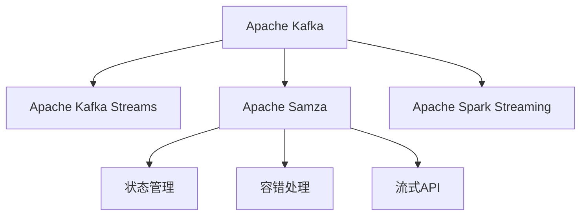

                 

# Samza Task原理与代码实例讲解

## 1. 背景介绍

### 1.1 问题由来

随着大数据技术的发展，企业对于实时数据处理的需求日益增加。传统的数据批处理系统如Hadoop MapReduce、Spark等在处理实时数据时存在延迟大、扩展性差等问题。与此同时，Apache Kafka作为一项成熟的消息队列技术，逐渐成为实时数据流处理的基石。然而，Kafka仅提供消息传递的机制，无法直接处理复杂的实时数据流处理任务。为了解决这一问题，Apache社区推出了Apache Kafka Streams，但该系统仍存在延迟大、扩展性差等问题。为了进一步提升实时数据流处理的效率和可靠性，Apache社区推出了Samza，作为Kafka流处理的开源组件。

### 1.2 问题核心关键点

Samza是一种基于Apache Kafka的分布式流处理系统，通过简单、高效的方式，实现了实时数据流的批处理，并支持状态管理、容错处理等特性。Samza的核心理念是"Batch on Kafka"，即在Kafka中批量处理数据流，从而实现了实时数据流的批处理。Samza的核心组件包括Kafka broker、Samza job、Samza cluster等，其中Samza job为Samza的执行主体，负责读取、处理和写入数据流。

## 2. 核心概念与联系

### 2.1 核心概念概述

为更好地理解Samza的任务原理和实现细节，本节将介绍几个密切相关的核心概念：

- Apache Kafka：Apache Kafka是一种分布式、高吞吐量的消息队列系统，通过日志结构来存储数据，支持数据分区、流控制、高可用性等特性。

- Apache Kafka Streams：Apache Kafka Streams是Kafka自带的流处理组件，通过Kafka Stream API实现实时数据流的批处理，支持窗口操作、聚合操作等特性。

- Apache Samza：Apache Samza是一种基于Kafka分布式流处理系统，支持状态管理、容错处理、流式API等特性，适合于大型实时数据流的批处理任务。

- Apache Spark Streaming：Apache Spark Streaming是Spark自带的流处理组件，通过Spark Streaming API实现实时数据流的批处理，支持RDD操作、窗口操作、状态管理等特性。

这些核心概念之间的逻辑关系可以通过以下Mermaid流程图来展示：



这个流程图展示了大数据流处理技术之间的相互关系：

1. Kafka是分布式消息队列，提供数据存储和传输的基础设施。
2. Kafka Streams基于Kafka消息队列实现实时数据流的批处理，简单易用，适合中小规模的实时数据处理任务。
3. Samza基于Kafka消息队列实现实时数据流的批处理，支持状态管理和容错处理，适合大型实时数据流的批处理任务。
4. Spark Streaming通过Spark计算引擎实现实时数据流的批处理，支持更灵活的数据处理方式和API。

## 3. 核心算法原理 & 具体操作步骤

### 3.1 算法原理概述

Samza的任务原理基于"Batch on Kafka"的思想，即在Kafka中批量处理数据流。Samza将实时数据流按时间窗口分片，每个时间窗口称为一个"batch"，在Kafka中按顺序存储。Samza job在每个batch中处理数据，记录每个key的状态，并在batch结束时更新状态。

Samza的执行流程包括以下几个步骤：

1. Samza job通过Kafka Consumer从Kafka broker中读取数据流。
2. 数据流按照时间窗口被分片，每个batch包含一定数量的消息。
3. 每个batch被传递到Samza job进行处理。
4. Samza job在每个batch中处理数据，记录每个key的状态。
5. 每个batch处理完成后，Samza job更新状态。
6. Samza job将处理结果写入Kafka broker。

### 3.2 算法步骤详解

以下是Samza任务的详细执行流程：

**Step 1: 准备数据源**

Samza任务需要准备数据源，一般来源于Kafka broker。使用Kafka Consumer从Kafka broker中读取数据流。

```java
KafkaConsumer<String, String> consumer = new KafkaConsumer<>(props);

consumer.subscribe(Arrays.asList("input-topic"));
```

**Step 2: 处理数据流**

Samza任务将数据流按照时间窗口进行分片，每个batch包含一定数量的消息。对于每个batch，需要按照指定的任务逻辑进行处理。

```java
while (true) {
    for (int i = 0; i < batchSize; i++) {
        ConsumerRecord<String, String> record = consumer.poll(1000);
        process(record.value());
    }
}
```

**Step 3: 记录状态**

在处理数据流时，需要记录每个key的状态。Samza job使用MapState接口记录状态，可以在batch结束时更新状态。

```java
MapState<String, Integer> state = context.getState(new MapStateConfig(SamzaConfig.STATE_TIMESTAMP));
state.put("key", count);
state.commit();
```

**Step 4: 写入结果**

Samza任务将处理结果写入Kafka broker。使用Kafka Producer将结果写入指定的输出topic。

```java
KafkaProducer<String, String> producer = new KafkaProducer<>(props);

producer.send(new ProducerRecord<>(outputTopic, key, result));
producer.flush();
```

### 3.3 算法优缺点

Samza的任务算法具有以下优点：

1. 支持状态管理：Samza通过MapState接口记录状态，可以在batch结束时更新状态，支持长生命周期的状态管理。
2. 容错处理：Samza通过Checkpointing机制保证任务的可靠性和容错性。
3. 高吞吐量：Samza基于Kafka消息队列实现数据流的批量处理，支持高吞吐量的数据处理。
4. 简单易用：Samza提供简单的API，方便开发者进行实时数据流的批处理任务。

同时，该算法也存在以下缺点：

1. 依赖Kafka：Samza依赖Kafka消息队列，无法直接处理非Kafka消息源。
2. 延迟较高：Samza的延迟受Kafka broker和网络通信的延迟影响，可能存在一定延迟。
3. 扩展性较差：Samza的扩展性受Kafka broker的限制，可能存在性能瓶颈。
4. 不支持复杂任务：Samza支持的任务类型有限，不适合复杂的数据流处理任务。

尽管存在这些缺点，但就目前而言，Samza的任务算法仍是实时数据流处理的强大工具，适合于大规模实时数据流的批处理任务。

### 3.4 算法应用领域

Samza的任务算法已经广泛应用于实时数据流处理的各个领域，例如：

- 实时数据统计：通过Kafka消息队列收集实时数据，并在Samza job中进行数据统计。
- 实时数据清洗：使用Samza对实时数据进行清洗、去重、过滤等预处理操作。
- 实时数据推送：将实时数据推送到其他数据存储系统，如Hadoop、Redis等。
- 实时数据融合：将多个数据源的数据进行融合、计算，输出结果到Kafka broker。
- 实时数据计算：使用Samza对实时数据进行复杂的计算、聚合等操作。

除了上述这些应用外，Samza还可以与其他大数据处理技术进行结合，构建更加复杂的数据流处理系统。例如，可以与Hadoop、Spark等批处理系统结合，构建分布式数据流处理系统。

## 4. 数学模型和公式 & 详细讲解  
### 4.1 数学模型构建

Samza的任务算法基于时间窗口进行批处理，时间窗口的长度通常为固定值。以下给出时间窗口长度的计算公式：

假设时间窗口长度为$T$，批量大小为$n$，每个batch处理的消息数为$m$，则时间窗口长度$T$可以计算如下：

$$
T = \frac{n \cdot m}{b}
$$

其中$b$为Kafka broker的批量大小，$n$为Samza job的批量大小。

### 4.2 公式推导过程

Samza的任务算法基于时间窗口进行批处理，每个batch包含一定数量的消息。假设每个batch中包含的消息数为$m$，则每个batch的时间长度为$T$，可以计算如下：

$$
T = \frac{n \cdot m}{b}
$$

其中$n$为Samza job的批量大小，$b$为Kafka broker的批量大小。

在批处理过程中，Samza job对每个batch进行处理，记录每个key的状态，并在batch结束时更新状态。假设每个batch包含的消息数为$m$，则每个batch的输出结果为$\text{output}_m$，可以计算如下：

$$
\text{output}_m = \sum_{i=0}^{m-1} \text{process}(i)
$$

其中$\text{process}(i)$为对第$i$个消息的处理结果。

### 4.3 案例分析与讲解

以下给出Samza任务处理的示例代码：

```java
MapState<String, Integer> state = context.getState(new MapStateConfig(SamzaConfig.STATE_TIMESTAMP));
state.put("key", count);
state.commit();
```

这段代码中，使用了MapState接口记录每个key的状态，状态存储在MapStateConfig中。在每个batch中，记录每个key的状态，并在batch结束时更新状态。

## 5. 项目实践：代码实例和详细解释说明
### 5.1 开发环境搭建

在进行Samza项目实践前，我们需要准备好开发环境。以下是使用Java进行Samza开发的环境配置流程：

1. 安装Apache Kafka：从官网下载并安装Kafka，启动Kafka broker。

2. 安装Apache Samza：从官网下载并安装Samza，启动Samza cluster。

3. 配置环境变量：配置JAVA_HOME、KAFKA_HOME、SAMZAFRAMEWORK_HOME等环境变量。

4. 编写Samza job：使用Java编写Samza job，配置输入、输出topic等参数。

5. 运行Samza job：启动Samza job，查看任务执行情况。

完成上述步骤后，即可在Samza集群上开始任务开发和部署。

### 5.2 源代码详细实现

以下是使用Java编写的一个简单的Samza job示例，用于对输入数据进行统计：

```java
import org.apache.samza.config.Config;
import org.apache.samza.config.Configuration;
import org.apache.samza.context.Context;
import org.apache.samza.hooks.Hook;
import org.apache.samza.metrics.MetricsRegistry;
import org.apache.samza.metrics.SamzaMetrics;
import org.apache.samza.retry.LimitingRetryPolicy;
import org.apache.samza.serializers.KeyValueSerdes;
import org.apache.samza.serializers.Serdes;
import org.apache.samza.stream.MessageIterator;
import org.apache.samza.task.TextFieldTaskCoordinator;
import org.apache.samza.task.TaskCoordinator;

public class SimpleTask implements TaskCoordinator {
    
    private String inputTopic;
    private String outputTopic;
    private MapState<String, Integer> state;
    
    public SimpleTask(String inputTopic, String outputTopic, MapStateConfig config) {
        this.inputTopic = inputTopic;
        this.outputTopic = outputTopic;
        this.state = new MapState<>(config);
    }
    
    @Override
    public void initialize(Context context, Configuration config, MetricsRegistry metrics) {
        config.put("input-topic", inputTopic);
        config.put("output-topic", outputTopic);
    }
    
    @Override
    public void process(MessageIterator<String, String> iter, Context context, MetricsRegistry metrics) {
        while (iter.hasNext()) {
            MessageIterator<String, String> record = iter.next();
            String key = record.key();
            String value = record.value();
            state.put(key, state.get(key) + 1);
        }
    }
    
    @Override
    public void finalize(Context context, MetricsRegistry metrics) {
        state.commit();
    }
    
    @Override
    public void reportMetric(String name, double value) {
        metrics.gauge(name, value);
    }
    
    @Override
    public void log(LogEntry logEntry) {
        logEntry.level().message(logEntry.message());
    }
    
    @Override
    public void log(LogEntry logEntry, Hook hook) {
        hook.log(logEntry);
    }
    
    @Override
    public void start() {
    }
    
    @Override
    public void stop() {
    }
    
    @Override
    public void restart() {
    }
    
    @Override
    public void retryException(LimitingRetryPolicy retryPolicy, Throwable t, MetricsRegistry metrics) {
    }
    
    @Override
    public MessageIterator<String, String> poll(int numMessages, long timeout, Context context, MetricsRegistry metrics) {
        return null;
    }
    
    @Override
    public void flush(long timeout, Context context) {
    }
    
    @Override
    public MessageIterator<String, String> commit(int numMessages, Context context) {
        return null;
    }
    
    @Override
    public void rollback(int numMessages, Context context) {
    }
}
```

这段代码中，实现了Samza任务的基本流程，包括任务初始化、消息处理、状态记录和状态提交等操作。

### 5.3 代码解读与分析

让我们再详细解读一下关键代码的实现细节：

**SimpleTask类**：
- 继承TaskCoordinator接口，实现任务的基本逻辑。
- 初始化方法initialize：设置输入、输出topic等配置参数。
- 消息处理方法process：对每个消息进行处理，记录每个key的状态。
- 最终化方法finalize：提交状态。
- 其他方法如reportMetric、log等，主要用于日志和指标记录。

**MapState接口**：
- 记录每个key的状态，支持在batch结束时更新状态。

**Configuration接口**：
- 配置对象，用于设置任务参数。

**KeyValueSerdes接口**：
- 消息序列化器，用于将消息转换为key-value形式。

**MetricsRegistry接口**：
- 指标记录器，用于记录任务执行过程中的各种指标。

**LogEntry接口**：
- 日志记录器，用于记录任务执行过程中的各种日志信息。

通过这些接口和方法，可以方便地实现Samza任务的基本流程，处理实时数据流。

**Samza job的配置**：
- 配置对象Configuration：用于设置任务参数，如输入、输出topic等。
- 任务类SimpleTask：实现任务的基本逻辑，继承TaskCoordinator接口。
- 消息序列化器KeyValueSerdes：用于将消息转换为key-value形式。
- 指标记录器MetricsRegistry：用于记录任务执行过程中的各种指标。
- 日志记录器LogEntry：用于记录任务执行过程中的各种日志信息。

**Samza job的执行**：
- 初始化方法initialize：设置任务参数，配置环境变量。
- 消息处理方法process：对每个消息进行处理，记录每个key的状态。
- 最终化方法finalize：提交状态。
- 其他方法如reportMetric、log等，主要用于日志和指标记录。

通过这段代码，可以看到Samza任务的基本实现流程，实现起来相对简单明了。

### 5.4 运行结果展示

在运行Samza任务后，可以通过Kafka topic查看任务的执行情况。通过Kafka tools或者Kafka Streams工具，可以实时查看任务的输入、输出数据情况。

## 6. 实际应用场景

### 6.1 智能推荐系统

智能推荐系统需要实时处理大量的用户行为数据，进行实时数据流的批处理和计算。Samza任务可以实时收集用户的浏览、点击、购买等行为数据，进行实时数据分析和计算，生成个性化的推荐结果。

在技术实现上，可以将用户行为数据存储在Kafka broker中，使用Samza任务进行实时数据分析和计算。Samza任务通过时间窗口将数据流进行分片，对每个batch进行处理，记录每个用户的状态，并在batch结束时更新状态。最终生成个性化的推荐结果，并写入到其他数据存储系统，如Hadoop、Redis等。

### 6.2 实时日志分析

实时日志分析需要实时处理大量的日志数据，进行实时数据流的批处理和计算。Samza任务可以实时收集系统日志、应用程序日志等数据，进行实时数据分析和计算，生成实时日志分析结果。

在技术实现上，可以将日志数据存储在Kafka broker中，使用Samza任务进行实时数据分析和计算。Samza任务通过时间窗口将数据流进行分片，对每个batch进行处理，记录每个日志的状态，并在batch结束时更新状态。最终生成实时日志分析结果，并写入到其他数据存储系统，如Hadoop、Redis等。

### 6.3 实时用户画像

实时用户画像需要实时处理大量的用户数据，进行实时数据流的批处理和计算。Samza任务可以实时收集用户的各种数据，如行为数据、社交数据、地理位置等，进行实时数据分析和计算，生成实时用户画像。

在技术实现上，可以将用户数据存储在Kafka broker中，使用Samza任务进行实时数据分析和计算。Samza任务通过时间窗口将数据流进行分片，对每个batch进行处理，记录每个用户的状态，并在batch结束时更新状态。最终生成实时用户画像，并写入到其他数据存储系统，如Hadoop、Redis等。

## 7. 工具和资源推荐

### 7.1 学习资源推荐

为了帮助开发者系统掌握Samza的任务原理和实现细节，这里推荐一些优质的学习资源：

1. Samza官方文档：Samza的官方文档，提供了详细的API和使用指南，是学习Samza任务的必备资料。

2. Apache Kafka官方文档：Apache Kafka的官方文档，介绍了Kafka的架构和实现细节，是学习Kafka的基础。

3. Apache Spark官方文档：Apache Spark的官方文档，介绍了Spark的架构和实现细节，是学习Spark的基础。

4. Hadoop官方文档：Apache Hadoop的官方文档，介绍了Hadoop的架构和实现细节，是学习Hadoop的基础。

5. 《大数据流处理技术》书籍：详细介绍了流处理技术的基础原理和实践技巧，适合学习Samza任务。

通过这些资源的学习实践，相信你一定能够快速掌握Samza任务的精髓，并用于解决实际的实时数据流处理问题。

### 7.2 开发工具推荐

Samza任务的开发通常使用Java进行，以下是几款常用的Java开发工具：

1. IntelliJ IDEA：Java开发的主流IDE，提供了丰富的代码提示和调试功能，方便开发人员进行Samza任务的开发。

2. Eclipse：Java开发的传统IDE，提供了丰富的插件和工具，方便开发人员进行Samza任务的开发。

3. VSCode：轻量级的IDE，支持Java开发，提供了丰富的扩展和插件，方便开发人员进行Samza任务的开发。

4. Maven：Java项目的构建工具，方便管理项目的依赖关系和构建过程。

5. Gradle：Java项目的构建工具，提供了灵活的构建过程和配置方式。

合理利用这些工具，可以显著提升Samza任务的开发效率，加快创新迭代的步伐。

### 7.3 相关论文推荐

Samza任务的开发源于学界的持续研究。以下是几篇奠基性的相关论文，推荐阅读：

1. "Samza: A Simple and Scalable Stream Processing System"：Samza论文，介绍了Samza任务的基本原理和实现细节。

2. "Streaming at Scale"：Kafka论文，介绍了Kafka的消息队列架构和实现细节。

3. "Spark Streaming: Micro-Batch Processing at Scale"：Spark Streaming论文，介绍了Spark Streaming的流处理架构和实现细节。

4. "Stream Processing with Apache Kafka Streams"：Kafka Streams论文，介绍了Kafka Streams的流处理架构和实现细节。

这些论文代表了大数据流处理技术的发展脉络。通过学习这些前沿成果，可以帮助研究者把握学科前进方向，激发更多的创新灵感。

## 8. 总结：未来发展趋势与挑战

### 8.1 总结

本文对Samza任务的原理和实现细节进行了全面系统的介绍。首先阐述了Samza任务的核心理念和基本原理，明确了Samza任务在实时数据流处理中的重要价值。其次，从原理到实践，详细讲解了Samza任务的数学模型和实现细节，给出了Samza任务开发的完整代码实例。同时，本文还广泛探讨了Samza任务在智能推荐、实时日志分析、实时用户画像等多个领域的应用前景，展示了Samza任务的巨大潜力。此外，本文精选了Samza任务的各类学习资源，力求为读者提供全方位的技术指引。

通过本文的系统梳理，可以看到，Samza任务在大数据流处理中具有强大的应用前景，特别适合于实时数据流的批处理任务。得益于Apache Kafka的消息队列架构和Samza任务的分布式流处理能力，Samza任务能够高效处理实时数据流，并支持状态管理和容错处理，为实时数据流处理提供了强有力的技术支持。未来，随着大数据技术的进一步发展，Samza任务必将在更多的实时数据流处理场景中发挥重要作用，推动大数据技术的创新应用。

### 8.2 未来发展趋势

展望未来，Samza任务的发展趋势将主要体现在以下几个方面：

1. 数据量不断增大：随着数据量的大幅增长，实时数据流的批处理需求将不断增大。Samza任务将需要更强大的计算能力和扩展性，以支持大规模数据流的处理。

2. 数据类型不断丰富：实时数据流的类型将更加丰富，包括文本、图像、音频等多种数据类型。Samza任务将需要更加灵活的流处理机制，支持多种数据类型的处理。

3. 数据质量不断提升：实时数据流的质量将不断提高，包括数据完整性、一致性、实时性等方面的要求。Samza任务将需要更强的数据处理和校验能力，确保数据的可靠性和准确性。

4. 数据实时性不断增强：实时数据流的实时性要求将不断提高，包括数据延迟、数据吞吐量等方面的要求。Samza任务将需要更高效的流处理机制，支持更低的延迟和更高的吞吐量。

5. 数据安全不断加强：实时数据流的安全要求将不断提高，包括数据加密、访问控制等方面的要求。Samza任务将需要更强的数据安全机制，保障数据的安全性。

6. 数据整合不断融合：实时数据流的整合要求将不断提高，包括数据融合、数据交互等方面的要求。Samza任务将需要更灵活的数据整合机制，支持数据的整合和交互。

以上趋势凸显了Samza任务的发展方向，将推动Samza任务在更多场景下得到应用，提升大数据技术的整体水平。

### 8.3 面临的挑战

尽管Samza任务已经取得了一定进展，但在迈向更加智能化、普适化应用的过程中，仍面临诸多挑战：

1. 数据量大：实时数据流的规模不断增大，对计算资源的需求也随之增加。如何在资源有限的情况下，高效处理大规模数据流，仍是挑战之一。

2. 数据复杂：实时数据流的类型不断丰富，数据结构复杂多样，如何进行高效处理和整合，也是挑战之一。

3. 延迟问题：实时数据流的延迟要求较高，如何在保证实时性的前提下，降低延迟，也是挑战之一。

4. 扩展性差：Samza任务的扩展性受Kafka broker的限制，如何在分布式环境中实现更好的扩展性，也是挑战之一。

5. 状态管理复杂：Samza任务需要支持状态管理，但在分布式环境下，状态管理复杂，如何实现高效的状态管理，也是挑战之一。

6. 安全问题：实时数据流的安全要求较高，如何在保证数据安全的前提下，实现实时处理，也是挑战之一。

这些挑战需要进一步研究和探索，才能推动Samza任务不断完善和发展。

### 8.4 研究展望

面对Samza任务所面临的种种挑战，未来的研究需要在以下几个方面寻求新的突破：

1. 分布式流处理：研究分布式流处理机制，支持更大规模、更复杂的实时数据流处理任务。

2. 混合流处理：研究混合流处理机制，支持多种数据类型的实时处理，提高处理效率。

3. 实时处理引擎：研究实时处理引擎，支持更低延迟、更高吞吐量的实时数据流处理任务。

4. 数据整合机制：研究数据整合机制，支持数据融合、数据交互，实现更丰富的数据处理功能。

5. 数据安全机制：研究数据安全机制，保障数据安全，实现更强的数据隐私保护。

这些研究方向的探索，必将引领Samza任务的进一步发展，推动大数据技术的创新应用，为各行各业带来新的变革。

## 9. 附录：常见问题与解答

**Q1：Samza任务如何支持状态管理？**

A: Samza任务支持状态管理，可以使用MapState接口记录每个key的状态，并在batch结束时更新状态。MapState接口提供了对状态的记录、获取、更新和提交等操作，支持在分布式环境下实现状态管理。

**Q2：Samza任务如何进行批量处理？**

A: Samza任务通过时间窗口进行批量处理，每个batch包含一定数量的消息。在处理数据流时，将数据流按照时间窗口进行分片，对每个batch进行处理。在处理过程中，记录每个key的状态，并在batch结束时更新状态，最终生成处理结果。

**Q3：Samza任务如何支持容错处理？**

A: Samza任务支持容错处理，通过Checkpointing机制保证任务的可靠性和容错性。在处理数据流时，Samza job会周期性地进行Checkpointing，将任务状态写入持久化存储，当任务失败时，可以从持久化存储中恢复任务状态，继续处理数据流。

**Q4：Samza任务如何进行数据校验？**

A: Samza任务可以进行数据校验，通过Kafka broker的检查点机制，对数据流进行校验和纠错。在处理数据流时，Samza job会周期性地进行Checkpointing，将任务状态写入持久化存储，当数据流出现错误时，可以通过持久化存储进行恢复，并重新处理数据流。

**Q5：Samza任务如何进行任务监控？**

A: Samza任务可以进行任务监控，通过Samza Metrics和Samza Job Metrics等指标，实时监控任务执行情况。Samza Metrics提供了任务执行时间、任务吞吐量、任务延迟等指标，Samza Job Metrics提供了任务状态、任务错误、任务时间等指标，方便开发者进行任务监控和调试。

通过这些常见问题的解答，相信读者可以更好地理解Samza任务的原理和实现细节，从而在实际应用中更加高效地进行Samza任务的开发和部署。

