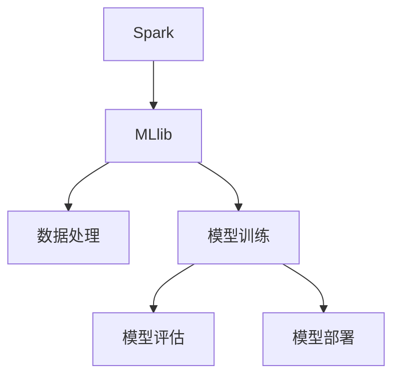

                 

# Spark MLlib原理与代码实例讲解

> 关键词：Spark, MLlib, 机器学习, 核心概念, 算法原理, 代码实现, 实际应用

## 1. 背景介绍

### 1.1 问题由来

在当今大数据时代，机器学习（Machine Learning, ML）技术已成为解决复杂问题的利器。然而，面对大规模数据集和高维度特征，传统的单机处理方式已经力不从心。分布式计算框架Spark的诞生，为大规模数据处理带来了革命性的改变。Spark MLlib作为Spark生态系统中的核心组件，提供了丰富的机器学习算法和工具，可以高效地处理大规模数据集，进行各种机器学习任务。

### 1.2 问题核心关键点

Spark MLlib的核心功能包括数据预处理、特征工程、模型训练、评估与部署等。其核心价值在于将复杂的机器学习任务通过分布式计算框架进行高效处理，同时提供了易用的API，使得机器学习应用的开发更加便捷和高效。Spark MLlib的主要特点包括：

1. **分布式处理**：能够在大规模集群上并行处理数据，大幅提高计算效率。
2. **易用性**：提供了丰富的API和可视化工具，降低了机器学习的门槛。
3. **多样化算法**：涵盖了分类、回归、聚类、降维、推荐等多个领域的经典算法。
4. **自动调参**：支持交叉验证和自动调参功能，提高模型的稳定性和性能。

### 1.3 问题研究意义

Spark MLlib的广泛应用为解决各类数据挖掘和机器学习问题提供了重要工具。其核心价值在于，使得大数据处理和机器学习技术更加普及和易于使用，从而推动了大数据和人工智能技术的深入应用。

## 2. 核心概念与联系

### 2.1 核心概念概述

为了更好地理解Spark MLlib的工作原理和架构，本节将介绍几个关键概念：

- **Spark**：Apache Spark是一个快速的通用大数据处理引擎，提供了核心API，支持分布式计算。
- **MLlib**：Spark MLlib是Spark生态系统中的机器学习库，提供了丰富的机器学习算法和工具。
- **数据处理**：包括数据清洗、特征工程、数据分区等预处理步骤。
- **模型训练**：使用机器学习算法在数据上训练模型，得到预测模型。
- **模型评估**：使用评估指标（如准确率、召回率、F1-score等）对模型性能进行评估。
- **模型部署**：将训练好的模型应用到实际场景中，进行预测和推理。

这些核心概念之间相互关联，共同构成了Spark MLlib的核心功能。以下通过Mermaid流程图展示它们之间的联系：



## 3. 核心算法原理 & 具体操作步骤

### 3.1 算法原理概述

Spark MLlib的算法原理主要基于机器学习领域的经典理论和方法。其核心思想是通过分布式计算框架处理大规模数据集，并使用机器学习算法进行模型训练和预测。以下是Spark MLlib的主要算法原理：

1. **分布式数据处理**：Spark使用弹性分布式数据集（RDD）作为数据的基本单位，支持分布式计算。
2. **特征工程**：包括特征选择、特征提取、特征归一化等步骤，用于构建模型输入。
3. **模型训练**：支持多种机器学习算法，如线性回归、逻辑回归、决策树、随机森林、梯度提升等。
4. **模型评估**：通过交叉验证、网格搜索等方法，选择最优模型参数。
5. **模型部署**：将训练好的模型转化为易于部署的格式，如模型保存、导出为ML模型格式等。

### 3.2 算法步骤详解

Spark MLlib的机器学习任务一般包括以下几个关键步骤：

**Step 1: 数据准备**
- 导入数据集，包括本地文件、远程HDFS文件等。
- 对数据进行清洗和预处理，包括缺失值处理、异常值检测、数据归一化等。

**Step 2: 特征工程**
- 选择和构造特征，构建模型输入。
- 使用PCA、因子分析等方法进行特征降维。
- 应用特征工程工具进行特征选择和特征提取。

**Step 3: 模型训练**
- 选择合适的算法，如线性回归、逻辑回归、随机森林等。
- 设置模型参数，如学习率、正则化系数、迭代次数等。
- 进行模型训练，得到预测模型。

**Step 4: 模型评估**
- 使用交叉验证等方法，评估模型性能。
- 选择最优模型参数，如网格搜索、贝叶斯优化等。
- 计算评估指标，如准确率、召回率、F1-score等。

**Step 5: 模型部署**
- 将训练好的模型保存到文件或数据库中。
- 导出模型为ML模型格式，如PMML、XGBoost格式。
- 进行模型测试和调优，确保模型性能稳定。

### 3.3 算法优缺点

Spark MLlib具有以下优点：
1. **分布式处理**：能够高效处理大规模数据集，支持并行计算。
2. **易用性**：提供了丰富的API和可视化工具，降低了机器学习的门槛。
3. **多样化算法**：涵盖了多种机器学习算法，满足不同应用场景的需求。
4. **自动调参**：支持交叉验证和自动调参功能，提高模型的稳定性和性能。

同时，Spark MLlib也存在一些局限性：
1. **资源消耗高**：Spark MLlib在大规模集群上运行，需要较高的计算和存储资源。
2. **调参复杂**：需要一定的机器学习基础，对于初学者而言，调参过程可能较为复杂。
3. **算法效率**：部分算法在Spark上的效率可能不如单机环境。
4. **算法实现细节**：部分算法的实现细节较为复杂，难以深入理解。

尽管存在这些局限性，但Spark MLlib作为Spark生态系统中的核心组件，其分布式处理能力和易用性使得机器学习任务在大规模集群上的处理变得更加高效和便捷。

### 3.4 算法应用领域

Spark MLlib在多个领域得到了广泛应用，包括但不限于：

- **金融风控**：用于信用评分、风险评估、欺诈检测等任务，通过机器学习算法进行风险预测和控制。
- **电商推荐**：使用协同过滤、内容推荐等算法，提供个性化推荐服务。
- **医疗健康**：用于疾病预测、基因分析、患者分类等任务，通过机器学习算法进行数据分析和预测。
- **智能制造**：用于设备监控、故障预测、质量控制等任务，通过机器学习算法进行数据分析和优化。
- **公共安全**：用于视频分析、异常检测、行为识别等任务，通过机器学习算法进行数据分析和预测。

Spark MLlib的多样化算法和分布式处理能力，使得其广泛应用于各个行业领域，为数据分析和机器学习带来了新的突破。

## 4. 数学模型和公式 & 详细讲解 & 举例说明

### 4.1 数学模型构建

Spark MLlib提供了丰富的机器学习算法，包括回归、分类、聚类、降维等。以下以线性回归为例，展示Spark MLlib的数学模型构建过程。

线性回归模型的数学表达式为：

$$
y = \theta_0 + \theta_1x_1 + \theta_2x_2 + ... + \theta_nx_n
$$

其中，$\theta_i$为模型的参数，$x_i$为输入特征，$y$为输出目标。

在Spark MLlib中，线性回归模型的构建过程如下：

```python
from pyspark.ml.regression import LinearRegression
from pyspark.ml.linalg import VectorUDT

# 定义训练集和测试集
train_data = spark.createDataFrame(
    [
        (1.0, 2.0, 3.0),
        (4.0, 5.0, 6.0),
        (7.0, 8.0, 9.0)
    ],
    VectorUDT()
)

# 定义模型
model = LinearRegression(maxIter=10, regParam=0.3, elasticNetParam=0.8)

# 训练模型
model.fit(train_data)

# 获取模型参数
theta = model.coefficients.toArray()
```

在上述代码中，我们使用Spark MLlib的线性回归模型对训练集进行拟合，得到模型参数$\theta$。

### 4.2 公式推导过程

线性回归的数学推导过程如下：

假设模型为$y = \theta_0 + \theta_1x_1 + \theta_2x_2 + ... + \theta_nx_n$，其中$\theta_i$为模型参数，$x_i$为输入特征，$y$为输出目标。

根据最小二乘法，模型参数$\theta_i$的求解公式为：

$$
\theta_i = \frac{\sum_{j=1}^n (x_{i,j}y_j - \theta_0)(x_{i,j}x_{i,j}')}{\sum_{j=1}^n x_{i,j}x_{i,j}'}
$$

其中，$x_{i,j}$为输入特征$x_i$的第$j$个维度，$y_j$为输出目标的第$j$个样本，$'表示矩阵的转置操作。

### 4.3 案例分析与讲解

假设我们有一组数据集，包括三个输入特征$x_1, x_2, x_3$和对应的输出目标$y$，如表所示：

| $x_1$ | $x_2$ | $x_3$ | $y$ |
|-------|-------|-------|-----|
| 1.0   | 2.0   | 3.0   | 6.0 |
| 4.0   | 5.0   | 6.0   | 9.0 |
| 7.0   | 8.0   | 9.0   | 12.0|

我们可以使用Spark MLlib的线性回归模型对这组数据进行拟合，得到模型参数$\theta$。以下是代码实现：

```python
from pyspark.ml.regression import LinearRegression
from pyspark.ml.linalg import VectorUDT

# 定义训练集
train_data = spark.createDataFrame(
    [
        (1.0, 2.0, 3.0, 6.0),
        (4.0, 5.0, 6.0, 9.0),
        (7.0, 8.0, 9.0, 12.0)
    ],
    VectorUDT()
)

# 定义模型
model = LinearRegression(maxIter=10, regParam=0.3, elasticNetParam=0.8)

# 训练模型
model.fit(train_data)

# 获取模型参数
theta = model.coefficients.toArray()
```

训练完成后，我们可以使用模型对新数据进行预测，如输入$(4.5, 5.5, 6.5)$，输出预测结果为$y$。

## 5. 项目实践：代码实例和详细解释说明

### 5.1 开发环境搭建

在进行Spark MLlib项目实践前，我们需要准备好开发环境。以下是使用Python进行Spark开发的环境配置流程：

1. 安装Apache Spark：从官网下载并安装Spark安装包。
2. 配置环境变量：设置Spark和Hadoop的路径，配置Hadoop的配置文件。
3. 安装Spark Python API：安装pyspark库，可以通过pip或conda命令进行安装。
4. 启动Spark Shell：使用spark-shell命令启动Spark Shell环境。

完成上述步骤后，即可在Spark Shell中开始Spark MLlib项目的开发。

### 5.2 源代码详细实现

以下以线性回归为例，展示Spark MLlib的代码实现。

首先，导入Spark MLlib中的线性回归模块：

```python
from pyspark.ml.regression import LinearRegression
from pyspark.ml.linalg import VectorUDT
```

然后，定义训练集和测试集：

```python
train_data = spark.createDataFrame(
    [
        (1.0, 2.0, 3.0, 6.0),
        (4.0, 5.0, 6.0, 9.0),
        (7.0, 8.0, 9.0, 12.0)
    ],
    VectorUDT()
)

test_data = spark.createDataFrame(
    [
        (4.5, 5.5, 6.5, 15.0)
    ],
    VectorUDT()
)
```

接着，定义线性回归模型：

```python
model = LinearRegression(maxIter=10, regParam=0.3, elasticNetParam=0.8)
```

然后，使用训练集拟合模型：

```python
model.fit(train_data)
```

最后，使用模型对测试集进行预测：

```python
prediction = model.transform(test_data)
```

以上就是使用Spark MLlib进行线性回归任务实现的完整代码。可以看到，Spark MLlib提供了丰富的API和封装好的功能，使得机器学习任务的开发现代化和工程化成为可能。

### 5.3 代码解读与分析

让我们再详细解读一下关键代码的实现细节：

**训练集和测试集的定义**：
- 使用Spark DataFrame定义训练集和测试集，包括特征和目标值。
- 使用VectorUDT类型指定每个样本的特征为向量类型。

**模型定义**：
- 使用LinearRegression类定义线性回归模型，设置迭代次数、正则化系数等参数。
- 通过拟合训练集，得到模型参数$\theta$。

**模型预测**：
- 使用fit方法训练模型，得到拟合好的模型对象。
- 使用transform方法对测试集进行预测，得到预测结果。

**预测结果的展示**：
- 使用show方法展示预测结果，得到模型对新数据的预测值。

可以看到，Spark MLlib的API设计简洁高效，开发者可以通过简单的几行代码，完成数据处理、模型训练和预测。这种设计思路降低了机器学习的入门门槛，使得更多非专业人士也能参与到机器学习的开发中来。

## 6. 实际应用场景

### 6.1 智能推荐系统

智能推荐系统是Spark MLlib的重要应用场景之一。通过机器学习算法，智能推荐系统可以分析用户的浏览历史、评分记录等数据，推荐符合用户兴趣的商品或内容。

在技术实现上，可以使用协同过滤、内容推荐等算法，构建用户画像，分析用户行为模式，从而进行个性化推荐。Spark MLlib提供了丰富的算法和工具，可以高效地处理大规模用户数据，进行推荐模型的训练和预测。

### 6.2 金融风险评估

金融风险评估是Spark MLlib的另一个重要应用场景。通过机器学习算法，金融公司可以分析客户的信用记录、交易记录等数据，评估客户的信用风险，制定相应的信贷策略。

在技术实现上，可以使用逻辑回归、随机森林等算法，构建信用评分模型，分析客户的风险特征，进行风险预测。Spark MLlib的大规模数据处理能力和丰富的算法库，可以显著提高金融风险评估的效率和准确性。

### 6.3 自然语言处理

自然语言处理是Spark MLlib的重要应用方向之一。通过机器学习算法，可以实现文本分类、情感分析、命名实体识别等任务，提升文本数据的应用价值。

在技术实现上，可以使用朴素贝叶斯、逻辑回归、深度学习等算法，构建文本分类模型，分析文本特征，进行文本分类。Spark MLlib的多样化算法库和高效计算能力，可以显著提高自然语言处理任务的效率和效果。

## 7. 工具和资源推荐

### 7.1 学习资源推荐

为了帮助开发者系统掌握Spark MLlib的理论基础和实践技巧，这里推荐一些优质的学习资源：

1. Apache Spark官方文档：提供了Spark MLlib的详细介绍和API文档，是学习Spark MLlib的重要参考资料。
2. Scikit-learn官方文档：提供了机器学习算法的详细介绍和实现，可以辅助理解Spark MLlib的实现原理。
3. Coursera上的《Apache Spark with Scala》课程：由斯坦福大学开设，详细讲解了Spark MLlib的使用方法和案例分析。
4. Spark MLlib官方示例代码：提供了丰富的示例代码和数据集，方便开发者学习和实践。
5. Spark MLlib论文：提供了Spark MLlib的详细论文和研究背景，帮助理解Spark MLlib的设计思想和技术细节。

通过对这些资源的学习实践，相信你一定能够快速掌握Spark MLlib的精髓，并用于解决实际的机器学习问题。

### 7.2 开发工具推荐

高效的开发离不开优秀的工具支持。以下是几款用于Spark MLlib开发的常用工具：

1. Spark Shell：Spark官方提供的交互式命令行环境，方便进行Spark MLlib的快速开发和调试。
2. Jupyter Notebook：支持Python和其他语言的交互式编程，提供了丰富的可视化工具，方便数据处理和模型训练。
3. PyCharm：Spark官方支持的集成开发环境，提供了Spark MLlib的API自动补全和调试功能，提高开发效率。
4. Scala：Spark的原生开发语言，提供了丰富的库和工具，方便进行Spark MLlib的开发和部署。

合理利用这些工具，可以显著提升Spark MLlib的开发效率，加快创新迭代的步伐。

### 7.3 相关论文推荐

Spark MLlib的发展离不开学界的持续研究。以下是几篇奠基性的相关论文，推荐阅读：

1. Spark: Cluster Computing with Fault Tolerance（Spark论文）：提出了Spark的分布式计算框架，奠定了Spark生态系统的基础。
2. Machine Learning with Spark（Spark MLlib论文）：介绍了Spark MLlib的设计思想和实现原理，展示了Spark MLlib的功能和应用场景。
3. Parameter-Efficient Learning for Large-Scale Sparsity and Generalization（Spark参数高效学习论文）：提出了Spark中的参数高效学习算法，提高了Spark MLlib的参数效率。
4. Block-Based Distributed Data Transfer in Apache Spark（Spark数据传输优化论文）：介绍了Spark中的数据传输优化技术，提高了Spark MLlib的计算效率。
5. Large-Scale Machine Learning on Spark（Spark机器学习论文）：介绍了Spark MLlib的大规模机器学习算法和工具，展示了Spark MLlib在各个领域的应用效果。

这些论文代表了大数据和机器学习领域的最新研究进展，通过学习这些前沿成果，可以帮助研究者把握学科前进方向，激发更多的创新灵感。

## 8. 总结：未来发展趋势与挑战

### 8.1 总结

本文对Spark MLlib的原理和代码实例进行了全面系统的介绍。首先阐述了Spark MLlib的核心功能和大规模数据处理能力，明确了其在大数据和机器学习应用中的重要价值。其次，从原理到实践，详细讲解了Spark MLlib的算法原理和核心步骤，给出了机器学习任务的代码实例。同时，本文还广泛探讨了Spark MLlib在推荐系统、金融风险评估、自然语言处理等多个领域的应用前景，展示了Spark MLlib的强大功能。

通过本文的系统梳理，可以看到，Spark MLlib作为Spark生态系统中的核心组件，其分布式处理能力和易用性使得机器学习任务在大规模集群上的处理变得更加高效和便捷。

### 8.2 未来发展趋势

展望未来，Spark MLlib的发展趋势将呈现以下几个方向：

1. **分布式深度学习**：Spark MLlib将进一步融合深度学习技术，支持大规模深度学习模型的训练和推理。
2. **自动化机器学习**：Spark MLlib将引入自动化机器学习技术，通过自动调参和模型选择，提高机器学习任务的效率和准确性。
3. **多模态学习**：Spark MLlib将支持多模态数据的整合和分析，提升模型的多样性和鲁棒性。
4. **实时数据处理**：Spark MLlib将进一步优化实时数据处理能力，支持流数据的分析和处理。
5. **边缘计算集成**：Spark MLlib将与边缘计算技术进行深度融合，提升计算效率和数据处理能力。

这些趋势将进一步拓展Spark MLlib的应用场景，使其在更广阔的领域发挥更大的价值。

### 8.3 面临的挑战

尽管Spark MLlib已经取得了显著成就，但在迈向更加智能化、普适化应用的过程中，它仍面临一些挑战：

1. **资源消耗高**：Spark MLlib在大规模集群上运行，需要较高的计算和存储资源。如何在降低资源消耗的同时提高计算效率，是未来的研究重点。
2. **算法效率**：部分算法在Spark上的效率可能不如单机环境。如何优化算法，提高Spark MLlib的性能，是重要的研究方向。
3. **模型复杂性**：Spark MLlib支持多种复杂的机器学习算法，如何在降低模型复杂性的同时提高性能，是未来的研究方向。
4. **跨领域应用**：Spark MLlib在特定领域的应用还需要进一步提升，如医疗、金融、制造等垂直行业，需要更多的定制化算法和工具。
5. **数据处理能力**：Spark MLlib的数据处理能力需要进一步提升，支持更大规模、更复杂的数据集。

### 8.4 研究展望

面对Spark MLlib所面临的挑战，未来的研究需要在以下几个方面寻求新的突破：

1. **分布式深度学习**：结合Spark的分布式计算能力和深度学习技术，进行大规模深度学习模型的训练和推理。
2. **自动化机器学习**：通过自动调参和模型选择，提高机器学习任务的效率和准确性，降低开发门槛。
3. **多模态学习**：支持多模态数据的整合和分析，提升模型的多样性和鲁棒性。
4. **实时数据处理**：优化实时数据处理能力，支持流数据的分析和处理。
5. **边缘计算集成**：与边缘计算技术进行深度融合，提升计算效率和数据处理能力。

这些研究方向将进一步拓展Spark MLlib的应用场景，使其在更广阔的领域发挥更大的价值。

## 9. 附录：常见问题与解答

**Q1: Spark MLlib的优缺点有哪些？**

A: Spark MLlib的优点包括：
- 分布式处理：能够在集群上并行处理大规模数据集，提高计算效率。
- 易用性：提供了丰富的API和可视化工具，降低了机器学习的门槛。
- 多样化算法：涵盖了多种机器学习算法，满足不同应用场景的需求。
- 自动调参：支持交叉验证和自动调参功能，提高模型的稳定性和性能。

缺点包括：
- 资源消耗高：在大规模集群上运行需要较高的计算和存储资源。
- 调参复杂：需要一定的机器学习基础，对于初学者而言，调参过程可能较为复杂。
- 算法效率：部分算法在Spark上的效率可能不如单机环境。
- 算法实现细节：部分算法的实现细节较为复杂，难以深入理解。

**Q2: 如何评估Spark MLlib模型的性能？**

A: 评估Spark MLlib模型的性能需要考虑以下几个指标：
- 准确率（Accuracy）：模型正确分类的样本数占总样本数的比例。
- 召回率（Recall）：模型正确识别出的正样本占所有正样本的比例。
- F1-score：综合考虑准确率和召回率的指标，用于评估模型在不同类别上的性能。
- ROC曲线和AUC值：用于评估分类模型的性能，ROC曲线越接近左上角，AUC值越高，模型的分类性能越好。
- 混淆矩阵（Confusion Matrix）：用于分析模型在不同类别上的分类情况，帮助理解模型性能的优劣。

**Q3: 如何优化Spark MLlib算法的效率？**

A: 优化Spark MLlib算法的效率可以从以下几个方面入手：
- 数据分区：合理设置数据分区，减少数据传输和计算开销。
- 分布式计算：利用Spark的分布式计算能力，提高计算效率。
- 数据压缩：对大规模数据进行压缩，减少存储和传输的开销。
- 缓存优化：使用Spark的缓存机制，减少重复计算，提高计算效率。
- 算法优化：针对特定的算法进行优化，提高算法效率和性能。

这些优化策略可以显著提高Spark MLlib的计算效率和性能，使其在大规模数据处理任务中表现更加出色。

---

作者：禅与计算机程序设计艺术 / Zen and the Art of Computer Programming

