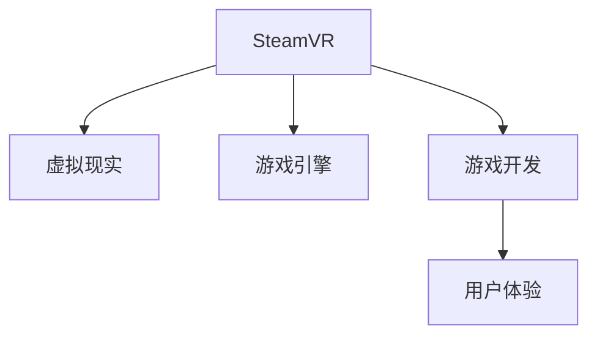

                 

# SteamVR 体验：Valve 的虚拟现实平台

> 关键词：SteamVR, Valve, 虚拟现实, VR平台, 游戏开发, 用户体验

## 1. 背景介绍

### 1.1 问题由来
随着虚拟现实技术的不断进步，VR 已成为当前科技界和消费市场的一个热门话题。虚拟现实技术不仅应用于游戏、娱乐、教育等领域，还在医疗、军事、工业等各行各业产生了广泛的影响。Valve 作为全球领先的独立游戏开发公司，凭借其在计算机图形学、游戏引擎等方面的深厚积累，于 2015 年发布了基于 Steam 平台的虚拟现实平台 SteamVR。SteamVR 平台不仅为开发者提供了强大的开发工具和平台，还通过与 Steam 平台的无缝集成，极大地推动了 VR 游戏的普及和应用。

### 1.2 问题核心关键点
SteamVR 平台的核心功能包括：

- 开发者工具包：提供简单易用的 VR 开发工具，如虚拟控制器、游戏物理模拟等。
- 集成 Steam 平台：通过 Steam 平台的接口和用户管理系统，方便游戏分发和用户体验管理。
- 高性能硬件支持：适配多种高性能 VR 设备，支持最新的 VR 技术。
- 开源社区生态：构建了庞大的开发者社区，促进了 VR 游戏的创新和生态建设。

SteamVR 平台通过这些核心功能，极大地降低了 VR 游戏开发的门槛，推动了虚拟现实游戏的发展。

### 1.3 问题研究意义
研究 SteamVR 平台的优势和应用场景，不仅有助于理解 Valve 的 VR 战略和技术细节，还能为 VR 游戏开发者提供宝贵的指导和借鉴，进一步推动 VR 游戏技术的创新和应用。此外，通过研究 SteamVR 平台的成功案例，还可以为其他平台和开发者提供可借鉴的经验和模式，促进整个虚拟现实行业的快速发展。

## 2. 核心概念与联系

### 2.1 核心概念概述

为了更好地理解 SteamVR 平台的工作原理和应用场景，本节将介绍几个密切相关的核心概念：

- SteamVR：Valve 开发的基于 Steam 平台的虚拟现实平台，提供强大的 VR 开发工具和平台支持。
- 虚拟现实(VR)：通过计算机图形学、传感器技术、人机交互技术等手段，模拟三维环境，提供沉浸式体验。
- 游戏引擎：用于开发、测试和发布游戏的应用程序框架，提供游戏开发所需的基础组件和工具。
- 游戏开发：通过使用游戏引擎和开发工具，将游戏创意转化为可玩游戏的全过程。
- 用户体验：游戏或应用的用户在使用过程中所获得的直观感受和满意程度。

这些核心概念之间的逻辑关系可以通过以下 Mermaid 流程图来展示：



这个流程图展示了几大核心概念之间的联系：

1. SteamVR 平台基于虚拟现实技术，提供强大的 VR 开发工具。
2. SteamVR 平台依托游戏引擎，方便游戏开发和发布。
3. 游戏开发通过使用 SteamVR 平台，最终实现用户体验。

这些概念共同构成了 SteamVR 平台的开发与应用框架，使其能够实现沉浸式、高品质的 VR 游戏体验。

## 3. 核心算法原理 & 具体操作步骤
### 3.1 算法原理概述

SteamVR 平台的算法原理主要基于以下三个方面：

- 传感器融合：通过融合多种传感器数据，如陀螺仪、加速度计、位置传感器等，实现对用户行为的高精度跟踪。
- 物理引擎模拟：通过先进的物理引擎模拟技术，实现逼真的物体碰撞、运动等效果。
- 图形渲染引擎：通过强大的图形渲染引擎，提供高性能、高品质的图像渲染效果。

这些技术共同构成了 SteamVR 平台的核心算法，使得用户能够在虚拟环境中进行沉浸式互动，享受高品质的游戏体验。

### 3.2 算法步骤详解

SteamVR 平台的核心算法步骤如下：

1. 传感器数据采集：通过各种传感器收集用户的动作数据，包括角度、速度、位置等。
2. 传感器数据融合：对采集到的数据进行融合，消除传感器之间的误差和噪声，得到更精确的动作数据。
3. 物理引擎模拟：将动作数据输入物理引擎，模拟物体碰撞、运动等效果，计算物体的状态和位置。
4. 图像渲染：通过图形渲染引擎，将物理引擎计算出的物体状态和位置数据渲染成图像，输出到用户的显示屏上。
5. 用户交互：用户通过控制器和显示屏，与虚拟环境进行交互，实现游戏或应用的功能。

SteamVR 平台通过这些步骤，实现对用户动作的精确跟踪和逼真渲染，提供沉浸式的虚拟现实体验。

### 3.3 算法优缺点

SteamVR 平台在虚拟现实技术上取得了显著的成就，但也存在一些局限性：

优点：

1. 开源社区：SteamVR 平台提供开源的 SDK 和开发工具，方便开发者进行二次开发和创新。
2. 高性能硬件支持：SteamVR 平台适配多种高性能 VR 设备，支持最新的 VR 技术。
3. 用户体验：SteamVR 平台通过精确的传感器数据和逼真的物理引擎模拟，提供高质量的游戏体验。

缺点：

1. 硬件限制：SteamVR 平台依赖高性能硬件设备，如高性能 PC、VR 头显和控制器等，使用门槛较高。
2. 开发门槛：尽管 SteamVR 提供简单易用的开发工具，但开发高质量的 VR 游戏仍需要较高的技术门槛。
3. 网络依赖：SteamVR 平台依赖 Steam 平台的网络服务，用户需要稳定的网络连接才能进行游戏。

### 3.4 算法应用领域

SteamVR 平台已经在多个领域得到了应用，例如：

1. 游戏开发：SteamVR 平台提供了强大的游戏开发工具，支持开发者创建高质量的 VR 游戏。
2. 虚拟旅游：通过 VR 技术，用户可以体验到不同国家和城市的风景，感受真实的环境和氛围。
3. 医疗康复：VR 技术可以用于医疗康复训练，帮助患者进行身体康复训练。
4. 教育培训：VR 技术可以用于教育培训，提供沉浸式的学习体验，提高学习效果。
5. 远程协作：VR 技术可以用于远程协作，帮助团队进行虚拟会议和协作。

此外，SteamVR 平台还可以用于虚拟实验室、虚拟购物、虚拟演出等更多场景，为虚拟现实技术的应用提供了广阔的想象空间。

## 4. 数学模型和公式 & 详细讲解 & 举例说明

### 4.1 数学模型构建

SteamVR 平台的数学模型主要涉及计算机图形学和物理模拟两个方面。以下是蒸汽VR中涉及的一些核心数学模型：

- 3D 空间坐标系转换：将现实世界中的坐标系转换为虚拟空间中的坐标系。
- 摄像机变换：通过旋转和位移变换，实现虚拟相机的视点变换。
- 物体碰撞检测：通过球体、四面体等基本几何体的碰撞检测，实现物体的交互和碰撞效果。
- 物理引擎模拟：通过求解刚体动力学方程，实现物体的运动和碰撞效果。

### 4.2 公式推导过程

下面以摄像机变换为例，推导摄像机变换的公式。

设现实世界中的坐标系为 $Oxyz$，虚拟空间中的坐标系为 $O'x'y'z'$，摄像机的位置为 $T$，摄像机的旋转矩阵为 $R$，摄像机旋转的角度为 $\theta$。摄像机变换公式为：

$$
\begin{pmatrix}
x' \\
y' \\
z' \\
1
\end{pmatrix}
=
R
\begin{pmatrix}
x \\
y \\
z \\
1
\end{pmatrix}
+
\begin{pmatrix}
t_x \\
t_y \\
t_z \\
0
\end{pmatrix}
$$

其中 $R$ 为旋转矩阵，$t_x, t_y, t_z$ 为摄像机位置向量。

### 4.3 案例分析与讲解

以游戏开发为例，分析 SteamVR 平台如何实现虚拟场景的渲染和交互。

SteamVR 平台通过摄像机变换，将用户的视点位置和旋转角度映射到虚拟空间中，实现了虚拟相机的视点变换。同时，通过物体碰撞检测和物理引擎模拟，实现了虚拟物体的运动和碰撞效果。最终，通过图形渲染引擎，将虚拟场景渲染成图像，输出到用户的显示屏上。用户可以通过控制器和显示屏，与虚拟环境进行交互，实现游戏或应用的功能。

## 5. 项目实践：代码实例和详细解释说明

### 5.1 开发环境搭建

要使用 SteamVR 平台进行游戏开发，需要先搭建好开发环境。以下是搭建环境的详细步骤：

1. 安装 SteamVR SDK：从 Valve 官方网站下载 SteamVR SDK，并按照安装向导进行安装。
2. 安装 SteamVR 客户端：安装 SteamVR 客户端，并启动 SteamVR 服务。
3. 安装开发工具：安装 Visual Studio 或 Unity 等开发工具，并配置 SteamVR 插件。
4. 安装 VR 设备：安装高性能的 VR 头显和控制器等设备，并连接至电脑。

完成上述步骤后，即可在 SteamVR 平台上进行游戏开发。

### 5.2 源代码详细实现

以下是一个简单的 VR 游戏开发项目示例，展示如何使用 SteamVR 平台进行开发。

```csharp
using UnityEngine;
using UnityEngine.XR.SteamVR;

public class VRController : MonoBehaviour
{
    public SteamVRHandController controller;

    void Update()
    {
        if (controller.input-digitgiester.isPressed)
        {
            Debug.Log("Button Pressed!");
        }
    }
}
```

这段代码中，通过 SteamVRHandController 类获取用户的手部控制器输入，并在用户按下按钮时输出日志信息。通过这样的简单示例，可以更好地理解 SteamVR 平台的使用方法和开发技巧。

### 5.3 代码解读与分析

上面的代码实现了一个简单的 VR 控制器输入处理逻辑。代码中使用 SteamVRHandController 类获取用户的手部控制器输入，并在用户按下按钮时输出日志信息。

SteamVRHandController 类是 SteamVR 平台提供的控制器类，可以方便地获取用户的手部控制器输入。在实际应用中，还可以通过该类实现更复杂的手部动作识别和处理逻辑，如手势识别、握持检测等。

## 6. 实际应用场景

### 6.1 智能旅游

SteamVR 平台可以用于虚拟旅游应用，为用户提供沉浸式的旅游体验。用户可以在虚拟环境中自由探索，体验不同国家和城市的风景，感受真实的环境和氛围。虚拟旅游不仅可以节省旅行成本，还可以实现对难以到达地区的探访，为旅游业带来新的发展机遇。

### 6.2 医疗康复

SteamVR 平台可以用于医疗康复训练，帮助患者进行身体康复训练。通过虚拟现实技术，患者可以在虚拟环境中进行运动和训练，增强身体协调性和平衡感，加速康复进程。虚拟现实技术还可以用于模拟手术，帮助医生进行手术训练和模拟。

### 6.3 教育培训

SteamVR 平台可以用于教育培训，提供沉浸式的学习体验，提高学习效果。虚拟现实技术可以用于历史、地理、化学等课程的教学，让学生通过互动体验，更直观地理解复杂的概念和原理。虚拟现实技术还可以用于虚拟实验室，提供安全、低成本的实验环境，促进科学教育的发展。

### 6.4 远程协作

SteamVR 平台可以用于远程协作，帮助团队进行虚拟会议和协作。通过虚拟现实技术，团队成员可以在虚拟环境中进行面对面交流，增强协作效果。虚拟现实技术还可以用于虚拟培训和模拟，提高团队培训和演练的效率。

## 7. 工具和资源推荐

### 7.1 学习资源推荐

为了帮助开发者掌握 SteamVR 平台的开发技巧，以下是一些优秀的学习资源：

1. Valve 官方文档：Valve 官方网站提供详细的 SteamVR 平台开发文档，包含 SDK 使用指南和示例代码。
2. SteamVR SDK 用户手册：SteamVR SDK 用户手册详细介绍了 SDK 的使用方法和注意事项。
3. Unity 官方文档：Unity 官方文档中提供了 SteamVR 插件的使用教程和示例代码。
4. SteamVR 社区：SteamVR 社区是一个开放的开发者社区，提供丰富的交流资源和开发经验。
5. SteamVR 开发者博客：SteamVR 开发者博客分享了众多 SteamVR 平台的开发经验和技巧。

通过这些学习资源，开发者可以全面了解 SteamVR 平台的开发技巧，提升开发效率和质量。

### 7.2 开发工具推荐

SteamVR 平台使用广泛，以下是一些常用的开发工具：

1. Unity：Unity 是全球领先的跨平台游戏引擎，支持 SteamVR 平台的开发和发布。
2. Unreal Engine：Unreal Engine 是另一款流行的游戏引擎，也支持 SteamVR 平台的开发和发布。
3. Visual Studio：Visual Studio 是微软提供的开发工具，支持 C# 语言开发。
4. SteamVR SDK：SteamVR SDK 提供了丰富的开发工具和接口，方便开发者进行二次开发和创新。

这些工具和资源能够为开发者提供强大的支持，帮助其快速开发高质量的 SteamVR 应用。

### 7.3 相关论文推荐

SteamVR 平台的成功案例和最新进展，推动了虚拟现实技术的发展。以下是几篇相关论文，推荐阅读：

1. "VR/AR in Digital Heritage: A Review and Analysis of Case Studies"：探讨了虚拟现实和增强现实技术在数字遗产保护中的应用。
2. "Interactive 3D Environments for Immersive Training and Education"：分析了虚拟现实技术在教育培训中的应用前景。
3. "A Survey of Virtual Reality in Therapy"：综述了虚拟现实技术在心理治疗和康复训练中的应用。
4. "The Impact of Virtual Reality on Educational Learning and Training"：研究了虚拟现实技术在教育培训中的应用效果。
5. "Virtual Reality in the Future: An Overview of Recent Developments"：介绍了当前虚拟现实技术的研究进展和未来发展趋势。

这些论文代表了虚拟现实技术发展的最新成果，能够为开发者提供丰富的理论基础和技术支持。

## 8. 总结：未来发展趋势与挑战

### 8.1 总结

SteamVR 平台通过其强大的开发工具和平台支持，推动了虚拟现实技术在游戏、娱乐、教育、医疗等多个领域的应用。SteamVR 平台的核心功能包括：

- 开发者工具包：提供简单易用的 VR 开发工具，如虚拟控制器、游戏物理模拟等。
- 集成 Steam 平台：通过 Steam 平台的接口和用户管理系统，方便游戏分发和用户体验管理。
- 高性能硬件支持：适配多种高性能 VR 设备，支持最新的 VR 技术。
- 开源社区生态：构建了庞大的开发者社区，促进了 VR 游戏的创新和生态建设。

SteamVR 平台通过这些核心功能，极大地降低了 VR 游戏开发的门槛，推动了虚拟现实游戏的发展。

### 8.2 未来发展趋势

展望未来，SteamVR 平台将在多个方面取得新的突破：

1. 增强现实(AR)与VR的融合：AR 和 VR 技术的融合将带来全新的交互体验，使得虚拟现实技术在更多的场景中得到应用。
2. 5G 网络支持：5G 网络将为 VR 应用提供更稳定的网络连接，支持高帧率的实时传输和渲染。
3. 低延迟技术：低延迟技术将提高 VR 应用的互动体验，使得用户能够更加流畅地与虚拟环境互动。
4. 分布式 VR 平台：分布式 VR 平台将支持多用户同时在虚拟环境中互动，拓展 VR 应用的社交和协作功能。
5. 虚拟现实标准：VR 标准的制定将推动整个虚拟现实行业的规范化发展，促进技术的普及和应用。

### 8.3 面临的挑战

尽管 SteamVR 平台在虚拟现实技术上取得了显著的成就，但也面临诸多挑战：

1. 硬件成本：高性能 VR 设备的成本较高，限制了虚拟现实技术的大规模普及。
2. 应用场景限制：虚拟现实技术的应用场景目前仍较为有限，需要更多的创新和应用拓展。
3. 技术门槛：VR 技术的开发和应用需要较高的技术门槛，需要更多的教育和培训。
4. 网络环境：VR 应用依赖稳定的网络连接，网络环境的不稳定将影响用户的体验。
5. 用户接受度：用户对虚拟现实技术仍有一定的接受度和使用习惯，需要更多的市场推广和教育。

### 8.4 研究展望

未来的研究需要在以下几个方面寻求新的突破：

1. 增强现实与虚拟现实技术融合：AR 和 VR 技术的融合将带来全新的交互体验，拓展虚拟现实技术的应用场景。
2. 低成本硬件设备的开发：开发低成本的 VR 设备和传感器，降低 VR 设备的门槛，推动技术普及。
3. 应用场景的创新：拓展虚拟现实技术在教育、医疗、军事等更多领域的应用，推动技术创新和应用发展。
4. 用户接受度的提升：通过市场推广和教育，提高用户对虚拟现实技术的接受度，推动技术的普及和应用。
5. 技术的标准化和规范化：制定 VR 技术的标准和规范，推动技术的普及和应用。

## 9. 附录：常见问题与解答

**Q1：SteamVR 平台如何使用？**

A: 使用 SteamVR 平台进行游戏开发，需要先搭建好开发环境。完成环境搭建后，可以使用 SteamVR SDK 提供的开发工具和接口，进行游戏开发和调试。开发完成后，通过 Steam 平台发布应用，供用户下载和体验。

**Q2：SteamVR 平台支持哪些 VR 设备？**

A: SteamVR 平台支持多种高性能 VR 设备，包括 Oculus Rift、HTC Vive、PICO Neo 2等。此外，SteamVR 平台还支持许多第三方 VR 设备，如 Quest 2、PlayStation VR 等。

**Q3：SteamVR 平台有哪些开发工具和接口？**

A: SteamVR 平台提供多种开发工具和接口，如 SteamVRSDK、SteamVRHandler、SteamVRVirtualEnvironment 等。这些工具和接口可以方便地进行 VR 开发和调试。

**Q4：SteamVR 平台有哪些学习资源？**

A: SteamVR 平台提供了丰富的学习资源，包括官方文档、SDK 用户手册、Unity 官方文档、SteamVR 社区、开发者博客等。开发者可以通过这些学习资源，全面了解 SteamVR 平台的开发技巧和注意事项。

**Q5：SteamVR 平台在虚拟现实技术上取得了哪些成就？**

A: SteamVR 平台在虚拟现实技术上取得了诸多成就，包括：

1. 强大的开发工具和平台支持：提供简单易用的 VR 开发工具和平台，方便开发者进行二次开发和创新。
2. 高性能硬件支持：适配多种高性能 VR 设备，支持最新的 VR 技术。
3. 大规模应用：在虚拟旅游、医疗康复、教育培训、远程协作等多个领域得到了广泛应用，推动了虚拟现实技术的普及和发展。

这些成就使得 SteamVR 平台成为当前虚拟现实技术的重要应用平台，引领了整个虚拟现实行业的发展方向。

