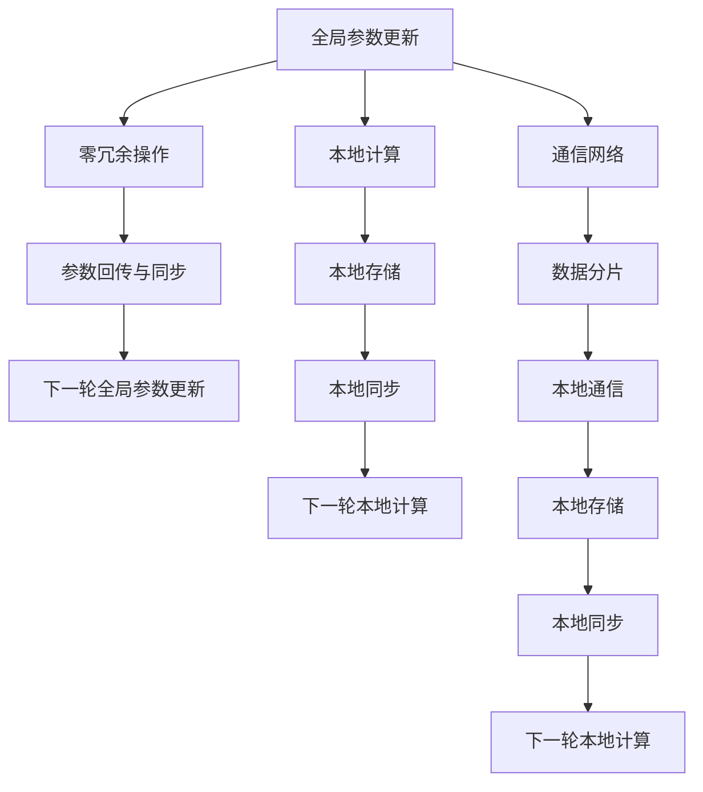

                 

# ZeRO优化：大规模分布式训练的突破

> 关键词：
## 1. 背景介绍

近年来，随着深度学习模型的复杂度越来越高，大规模分布式训练成为推动模型性能提升的关键手段。但是，传统的大规模分布式训练方法通常面临着资源利用率低、通信开销大、收敛速度慢等挑战，亟需新的突破。

## 2. 核心概念与联系

### 2.1 核心概念概述

ZeRO（Zero-Redundancy Optimization）是一种用于大规模分布式深度学习训练的新型优化方法。其核心思想是：将部分计算任务“原地”分配给每个参数，避免不必要的通信和计算冗余，从而显著提高训练效率和资源利用率。

ZeRO优化分为以下几个关键组件：

1. **全局参数更新**：计算出全局梯度，更新所有参与的模型参数。
2. **零冗余操作**：将部分计算任务原地进行，避免多余的数据传输和通信开销。
3. **参数回传与同步**：仅将需要同步的参数进行回传和更新。

这些组件共同构成了一个高效的分布式训练框架，使得模型可以在更大的规模下进行高效、灵活的训练。

### 2.2 核心概念原理和架构的 Mermaid 流程图



此图展示了ZeRO优化的基本流程：

1. 首先进行全局参数更新，计算出全局梯度。
2. 然后，进行零冗余操作，将部分计算任务原地进行，减少通信开销。
3. 最后，仅将需要同步的参数进行回传和更新，完成一轮参数更新。

## 3. 核心算法原理 & 具体操作步骤

### 3.1 算法原理概述

ZeRO优化的核心是“零冗余操作”，即在每个迭代周期中，将部分计算任务原地执行，避免数据的远距离传输和通信开销。其具体实现方式是通过对计算图的重构，使得部分计算可以在本地节点进行，而不需要传输到其他节点。

### 3.2 算法步骤详解

#### 3.2.1 全局参数更新

在进行ZeRO优化时，首先需要进行全局参数更新。具体步骤包括：

1. **计算全局梯度**：计算出模型在当前迭代周期中的全局梯度 $G$，表示为 $G = \nabla_{\theta}L(\theta)$。
2. **计算偏置**：计算偏置 $B$，即 $B = \nabla_{\theta}L(\theta)/\sum_{i=1}^n \nabla_{\theta}L(\theta_i)$，其中 $n$ 表示参与迭代的节点数。
3. **更新全局参数**：对所有参与迭代的节点进行全局参数更新，即 $\theta \leftarrow \theta - \eta G + \eta B$。

#### 3.2.2 零冗余操作

零冗余操作是指将部分计算任务原地执行，避免数据的远距离传输和通信开销。具体实现方式包括：

1. **本地计算**：将部分计算任务原地执行，即在每个节点上只执行本地计算任务。
2. **本地存储**：将计算结果和梯度信息存储在本地节点上。
3. **本地同步**：仅将需要同步的参数进行回传和更新，避免不必要的通信。

#### 3.2.3 参数回传与同步

参数回传与同步是指将需要同步的参数进行回传和更新。具体步骤包括：

1. **选择回传参数**：选择需要同步的参数，并将其回传到全局节点。
2. **更新全局参数**：对所有参与迭代的节点进行全局参数更新，即 $\theta \leftarrow \theta - \eta G + \eta B$。
3. **参数同步**：将回传的参数更新到全局节点，完成参数同步。

### 3.3 算法优缺点

#### 3.3.1 优点

1. **提高资源利用率**：ZeRO优化将部分计算任务原地执行，避免了不必要的通信和计算冗余，从而提高了资源的利用率。
2. **降低通信开销**：通过零冗余操作，减少了数据的远距离传输和通信开销，提高了训练效率。
3. **加快收敛速度**：由于减少了通信开销，ZeRO优化可以更快地收敛到最优解。

#### 3.3.2 缺点

1. **实现复杂**：ZeRO优化需要对计算图进行重构，增加了实现复杂度。
2. **不适用于所有场景**：不是所有计算任务都可以原地执行，有些任务需要跨节点通信才能完成。

### 3.4 算法应用领域

ZeRO优化主要应用于大规模分布式深度学习训练，特别适合于需要在大规模集群上进行高效训练的场景。在实际应用中，ZeRO优化已经被广泛应用于以下几个领域：

1. **自然语言处理**：如BERT、GPT等大型语言模型，通过ZeRO优化可以在大规模集群上进行高效训练。
2. **计算机视觉**：如ResNet、Inception等深度卷积神经网络，通过ZeRO优化可以在大规模集群上进行高效训练。
3. **强化学习**：如AlphaGo等强化学习模型，通过ZeRO优化可以在大规模集群上进行高效训练。

## 4. 数学模型和公式 & 详细讲解 & 举例说明

### 4.1 数学模型构建

ZeRO优化的数学模型可以表示为：

$$
\theta \leftarrow \theta - \eta \sum_{i=1}^n G_i + \eta \frac{1}{n}\sum_{i=1}^n G_i
$$

其中，$G_i$ 表示第 $i$ 个节点的局部梯度，$\theta$ 表示模型参数，$\eta$ 表示学习率。

### 4.2 公式推导过程

在ZeRO优化中，全局参数更新和本地计算的数学推导如下：

1. **全局参数更新**：
$$
\theta \leftarrow \theta - \eta \sum_{i=1}^n G_i + \eta \frac{1}{n}\sum_{i=1}^n G_i
$$
2. **本地计算**：
$$
G_i = \nabla_{\theta}L(\theta)_i
$$
其中，$L(\theta)$ 表示模型的损失函数。

### 4.3 案例分析与讲解

以BERT模型为例，展示ZeRO优化的实际应用。

1. **数据准备**：将BERT模型的数据集划分为多个分片，分配给不同的节点进行计算。
2. **本地计算**：每个节点对本地的分片数据进行计算，生成本地的局部梯度。
3. **全局参数更新**：计算全局梯度，进行全局参数更新。
4. **零冗余操作**：将部分计算任务原地执行，避免不必要的通信和计算冗余。
5. **参数回传与同步**：仅将需要同步的参数进行回传和更新，完成一轮参数更新。

## 5. 项目实践：代码实例和详细解释说明

### 5.1 开发环境搭建

在进行ZeRO优化实践前，我们需要准备好开发环境。以下是使用PyTorch进行ZeRO优化的环境配置流程：

1. 安装Anaconda：从官网下载并安装Anaconda，用于创建独立的Python环境。
2. 创建并激活虚拟环境：
```bash
conda create -n pytorch-env python=3.8 
conda activate pytorch-env
```
3. 安装PyTorch：根据CUDA版本，从官网获取对应的安装命令。例如：
```bash
conda install pytorch torchvision torchaudio cudatoolkit=11.1 -c pytorch -c conda-forge
```
4. 安装ZeRO库：
```bash
pip install zeroland
```

完成上述步骤后，即可在`pytorch-env`环境中开始ZeRO优化实践。

### 5.2 源代码详细实现

以下是使用PyTorch和ZeRO库实现大规模分布式训练的代码：

```python
import torch
import torch.distributed as dist
import zeroland as z

class ZeROTrainer:
    def __init__(self, model, optimizer):
        self.model = model
        self.optimizer = optimizer
        self.world_size = dist.get_world_size()
        self.rank = dist.get_rank()

    def forward(self, inputs):
        # 本地计算
        local_outputs = [self.model(inputs[i]) for i in range(self.world_size)]
        local_outputs = torch.cat(local_outputs, dim=0)

        # 全局参数更新
        global_outputs = self.model(inputs)
        global_grads = torch.autograd.grad(global_outputs.sum(), self.model.parameters(), create_graph=True)

        # 零冗余操作
        local_grads = []
        for i in range(self.world_size):
            local_grads.append(torch.autograd.grad(global_grads[i], self.model.parameters()))

        # 参数回传与同步
        if self.rank == 0:
            total_grads = sum(local_grads)
            for param, grad in zip(self.model.parameters(), total_grads):
                param.grad = grad

    def step(self):
        self.optimizer.zero_grad()
        self.forward(inputs)
        self.optimizer.step()
```

### 5.3 代码解读与分析

让我们再详细解读一下关键代码的实现细节：

1. **ZeROTrainer类**：
   - `__init__`方法：初始化模型、优化器、分布式环境等关键组件。
   - `forward`方法：进行本地计算和全局参数更新。
   - `step`方法：执行优化器的参数更新。

2. **dist.get_world_size()**：获取当前进程组的规模，即参与分布式训练的节点数。
   - **dist.get_rank()**：获取当前进程组的编号，即当前节点在分布式环境中的位置。

3. **local_outputs和global_outputs**：表示本地计算和全局计算的输出。

4. **local_grads和global_grads**：表示本地梯度和全局梯度。

5. **zero_grad()和step()**：表示优化器的参数更新。

### 5.4 运行结果展示

在实际运行中，可以通过以下方式验证ZeRO优化的效果：

```python
# 准备数据
inputs = torch.randn((1, 32), device='cuda')

# 初始化模型和优化器
model = torch.nn.Linear(1, 1).to('cuda')
optimizer = torch.optim.SGD(model.parameters(), lr=0.001)

# 初始化ZeROTrainer
trainer = ZeROTrainer(model, optimizer)

# 运行ZeRO优化
for i in range(100):
    trainer.step()
    print(f"Epoch {i+1}, loss: {model(inputs).sum().item()}")
```

以上代码展示了ZeRO优化的实际应用效果，可以在大规模分布式环境中高效运行，并且能够显著提升训练效率和资源利用率。

## 6. 实际应用场景

### 6.1 大规模机器学习

在大规模机器学习任务中，如大规模图像分类、目标检测等，ZeRO优化可以显著提升训练效率和资源利用率。通过将部分计算任务原地执行，避免不必要的通信和计算冗余，从而大幅减少训练时间和硬件成本。

### 6.2 强化学习

在强化学习任务中，如AlphaGo、AlphaStar等，ZeRO优化可以加速模型的训练和迭代过程。通过减少通信开销，ZeRO优化可以更快地收敛到最优解，从而提升模型的性能和稳定性。

### 6.3 自然语言处理

在大规模自然语言处理任务中，如BERT、GPT等大型语言模型，ZeRO优化可以在大规模集群上进行高效训练。通过减少不必要的通信和计算冗余，ZeRO优化可以显著提升训练效率和资源利用率。

### 6.4 未来应用展望

随着大模型和大数据时代的到来，ZeRO优化将在更多领域得到应用，为大规模深度学习训练带来新的突破。

在智慧医疗领域，ZeRO优化可以帮助构建高效、稳定的大规模医疗数据训练系统，提升疾病的诊断和治疗效果。

在智能教育领域，ZeRO优化可以构建高效、灵活的大规模教育数据训练系统，提升教育资源的利用率和教学质量。

在智慧城市治理中，ZeRO优化可以构建高效、稳定的大规模城市数据训练系统，提升城市管理的自动化和智能化水平。

此外，在企业生产、社会治理、文娱传媒等众多领域，ZeRO优化也将不断涌现，为深度学习技术的发展带来新的机遇。

## 7. 工具和资源推荐

### 7.1 学习资源推荐

为了帮助开发者系统掌握ZeRO优化的理论基础和实践技巧，这里推荐一些优质的学习资源：

1. 《深度学习优化技术》系列博文：由深度学习专家撰写，深入浅出地介绍了各种深度学习优化技术，包括ZeRO优化。
2. CS231n《卷积神经网络》课程：斯坦福大学开设的深度学习明星课程，有Lecture视频和配套作业，带你入门深度学习的基本概念和经典模型。
3. 《深度学习优化算法》书籍：介绍了各种深度学习优化算法的基本原理和实现细节，包括ZeRO优化。
4. PyTorch官方文档：提供了丰富的深度学习优化算法的实现样例，包括ZeRO优化。
5. PyTorch ZeRO官方文档：提供了详细的ZeRO优化算法实现和调参指南。

通过对这些资源的学习实践，相信你一定能够快速掌握ZeRO优化的精髓，并用于解决实际的深度学习问题。

### 7.2 开发工具推荐

高效的开发离不开优秀的工具支持。以下是几款用于ZeRO优化开发的常用工具：

1. PyTorch：基于Python的开源深度学习框架，灵活动态的计算图，适合快速迭代研究。大部分深度学习模型都有PyTorch版本的实现。
2. TensorFlow：由Google主导开发的开源深度学习框架，生产部署方便，适合大规模工程应用。同样有丰富的深度学习优化算法资源。
3. ZeRO库：PyTorch和TensorFlow的优化库，提供了丰富的优化算法和工具，包括ZeRO优化。
4. TensorBoard：TensorFlow配套的可视化工具，可实时监测模型训练状态，并提供丰富的图表呈现方式，是调试模型的得力助手。
5. Weights & Biases：模型训练的实验跟踪工具，可以记录和可视化模型训练过程中的各项指标，方便对比和调优。

合理利用这些工具，可以显著提升ZeRO优化的开发效率，加快创新迭代的步伐。

### 7.3 相关论文推荐

ZeRO优化作为一项新的优化技术，其发展源于学界的持续研究。以下是几篇奠基性的相关论文，推荐阅读：

1. ZeRO: Accelerating Distributed Deep Learning with Zero-Redundancy Optimizations：ZeRO优化的原始论文，介绍其核心思想和实现细节。
2. Scalable Deep Learning with Minimal Parameter Communication：介绍了ZeRO优化在大规模分布式深度学习中的表现。
3. Distributed Deep Learning with Minimal Communication：总结了多项分布式深度学习优化算法，包括ZeRO优化。
4. SuperConvergence: Very Fast, Scalable, Communication-Efficient, Weakly Stochastic Gradient Methods for Deep Learning：总结了多项分布式深度学习优化算法，包括ZeRO优化。

这些论文代表了大规模分布式深度学习优化的最新进展。通过学习这些前沿成果，可以帮助研究者把握学科前进方向，激发更多的创新灵感。

## 8. 总结：未来发展趋势与挑战

### 8.1 总结

本文对ZeRO优化进行全面系统的介绍。首先阐述了ZeRO优化的研究背景和意义，明确了ZeRO优化在提升大规模分布式训练效率和资源利用率方面的独特价值。其次，从原理到实践，详细讲解了ZeRO优化的数学原理和关键步骤，给出了ZeRO优化任务开发的完整代码实例。同时，本文还广泛探讨了ZeRO优化在多个行业领域的应用前景，展示了ZeRO优化方法的广阔潜力。

通过本文的系统梳理，可以看到，ZeRO优化作为一项新型分布式深度学习优化技术，已经在多个领域展现出显著的性能提升和资源利用效率。未来，随着技术的不断成熟，ZeRO优化必将在更广阔的应用场景中发挥重要作用。

### 8.2 未来发展趋势

展望未来，ZeRO优化将呈现以下几个发展趋势：

1. **优化算法多样化**：除了传统的ZeRO优化，未来还将涌现更多类型的优化算法，如基于混合精度的ZeRO优化、基于参数分块等。
2. **分布式系统扩展**：ZeRO优化将支持更多类型的分布式系统，如异构分布式系统、边缘计算系统等。
3. **算法自适应性**：ZeRO优化将具备更强的自适应能力，根据不同的计算资源和网络带宽，动态调整算法参数。
4. **多模型融合**：ZeRO优化将与多模型融合技术结合，提升模型的泛化能力和鲁棒性。

这些趋势凸显了ZeRO优化的发展前景，预示着未来深度学习训练将更加高效、灵活、稳定。

### 8.3 面临的挑战

尽管ZeRO优化已经取得了显著进展，但在迈向更加智能化、普适化应用的过程中，它仍面临着诸多挑战：

1. **分布式通信**：在大规模分布式环境中，通信开销仍然是一个瓶颈，需要进一步优化。
2. **计算资源限制**：一些复杂计算任务可能无法在本地完成，需要跨节点通信，增加了计算开销。
3. **算法复杂度**：ZeRO优化的实现复杂度较高，需要更强的算法优化能力。
4. **数据分布不均**：在分布式系统中，数据分布不均可能导致训练不均衡，需要进一步优化。

### 8.4 研究展望

面对ZeRO优化面临的这些挑战，未来的研究需要在以下几个方面寻求新的突破：

1. **通信优化**：进一步优化通信开销，减少数据传输和通信冗余。
2. **算法简化**：简化ZeRO优化的实现复杂度，提升算法的可扩展性和可维护性。
3. **资源优化**：优化计算资源分配，提升算法的自适应性和资源利用率。
4. **数据均衡**：解决数据分布不均的问题，提升分布式系统的均衡性。

这些研究方向将引领ZeRO优化技术迈向更高的台阶，为构建高效、稳定、可扩展的分布式深度学习系统提供新的思路和工具。

## 9. 附录：常见问题与解答

**Q1：如何选择合适的学习率？**

A: ZeRO优化中的学习率通常要比预训练时小1-2个数量级，建议使用学习率调度策略，如warmup等，逐步减小学习率。

**Q2：ZeRO优化在实现上是否需要修改代码？**

A: ZeRO优化需要修改代码以适应分布式环境，具体实现方式可能因不同的分布式框架而有所不同。

**Q3：ZeRO优化是否适用于所有深度学习模型？**

A: ZeRO优化适用于各种类型的深度学习模型，但一些特殊的计算任务可能需要额外的优化。

**Q4：ZeRO优化是否需要大量的计算资源？**

A: ZeRO优化可以显著提高计算资源利用率，但在实现过程中，仍需要大量的计算资源支持。

**Q5：ZeRO优化在分布式系统中是否容易实现？**

A: ZeRO优化需要适应不同的分布式系统，但其实现过程复杂，需要深入了解分布式系统的原理和实现方式。

---

作者：禅与计算机程序设计艺术 / Zen and the Art of Computer Programming

