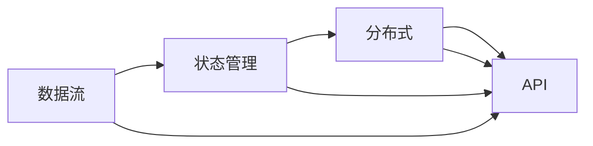

                 

# 【AI大数据计算原理与代码实例讲解】Flink

> 关键词：Flink, 大数据计算, 流处理, 实时计算, 分布式计算, 数据流, 系统架构, 编程模型, 实例代码, 应用场景, 部署实践, 资源推荐

## 1. 背景介绍

### 1.1 问题由来
随着互联网技术的迅猛发展，大数据处理已成为信息化建设中不可或缺的重要组成部分。从传统的离线数据处理模式，到如今追求即时响应的实时数据流处理，大数据技术不断突破和演变。流处理，作为实时数据处理的核心技术之一，已经成为数据驱动决策分析的关键。

Flink，作为流处理领域的领先平台，因其高效、稳定、灵活的特点，被广泛应用在各种大数据场景中。无论是在金融风控、实时广告、电子商务、智能制造，还是在物流追踪、事件监测、物联网等领域，Flink都能提供灵活、可扩展的数据处理解决方案。本文将从理论到实践，深入探讨Flink的计算原理、核心概念与算法，并结合代码实例，展示Flink在大数据计算中的应用场景与实践技巧。

### 1.2 问题核心关键点
本节将重点讨论Flink的核心概念及其关键技术点，以便读者能够深入理解Flink的工作原理和实现机制：

- **Flink:** 一个开源的流处理框架，由Apache软件基金会发布，具有高性能、低延迟、高可靠性和强大的扩展性。
- **数据流:** 流处理系统中的核心概念，指实时产生或到达的数据流。
- **状态管理:** 存储和管理流处理任务的中间状态。
- **API:** Flink提供了丰富的API接口，包括Java、Scala、Python等。
- **分布式:** 支持大规模分布式计算，能够适应集群计算环境。

Flink的这些核心概念和关键技术点，构成了其计算框架的基础，并通过实践进一步展现其应用效果。

### 1.3 问题研究意义
Flink以其强大的流处理能力、灵活的编程模型和广泛的生态支持，成为大数据领域中不可或缺的重要组件。掌握Flink，不仅能够深入理解流处理的基本原理，还能在实际应用中灵活运用其技术优势，实现高效的实时数据处理。本文旨在通过深入的技术分析，帮助读者全面理解Flink的计算原理，并通过丰富的实例代码，让读者能够在实际项目中应用Flink技术，提升大数据计算能力。

## 2. 核心概念与联系

### 2.1 核心概念概述

为更好地理解Flink的核心概念及其之间的关系，本节将进行详细讲解：

- **数据流:** 指连续不断产生的数据序列，可以是实时数据流或历史数据流。流处理系统通过实时处理数据流，能够快速响应数据变化，从而支持实时计算和分析。
- **状态管理:** 流处理任务需要维护中间状态，存储在外部存储系统或内存中。状态可以用于计算中间结果、维护分布式一致性等。
- **分布式:** 通过分布式计算引擎，Flink能够高效地处理大规模数据集，适应各种规模的计算环境。
- **API:** 提供了多种编程接口，使得开发者能够使用不同语言编写Flink程序。

这些核心概念共同构成了Flink的计算框架，并通过它们之间的联系，实现了高效、稳定、可扩展的数据处理。

### 2.2 核心概念之间的联系

Flink的核心概念之间具有紧密的联系，通过这些概念的相互作用，共同构成了Flink的计算框架。数据流作为Flink处理的核心对象，需要依赖状态管理来维护中间结果和一致性，而分布式计算引擎则通过并行处理和资源调度，实现了高效的分布式计算。API则提供了灵活的编程接口，使得开发者能够根据需求选择不同的编程语言和工具，快速实现数据处理任务。

以下是一个简单的Mermaid流程图，展示了Flink核心概念之间的联系：



该流程图展示了数据流、状态管理、分布式和API之间的关系。数据流作为核心，通过状态管理维护中间结果，并通过分布式计算引擎进行并行处理，最后通过API进行灵活的编程和实现。

## 3. 核心算法原理 & 具体操作步骤

### 3.1 算法原理概述

Flink的计算框架主要基于流处理和分布式计算，其核心算法原理主要包括数据流模型、状态管理和并行计算。

- **数据流模型:** 采用事件驱动的数据流模型，通过流式数据源不断向系统输入数据，并生成事件流，进行实时处理和分析。
- **状态管理:** 通过外部存储系统和内存管理中间状态，支持高效的流处理任务。
- **并行计算:** 采用数据并行和任务并行相结合的方式，通过分布式计算引擎进行并行处理，提高计算效率。

Flink的算法原理不仅涵盖了数据流处理和分布式计算，还通过状态管理和灵活的API支持，实现了高效、稳定、可扩展的流处理能力。

### 3.2 算法步骤详解

Flink的算法步骤主要包括数据源处理、数据流处理和结果输出。

1. **数据源处理:** 通过Flink的数据源API，将数据流输入到系统中，进行初步处理和转换。
2. **数据流处理:** 采用Flink的流处理算法，对数据流进行处理和分析，包括过滤、聚合、分组、排序等操作。
3. **结果输出:** 将处理后的结果输出到外部系统或进行进一步的分析，如写入数据库、发送消息、生成报告等。

以下是一个简单的Flink数据流处理示例：

```python
from pyflink.datastream import StreamExecutionEnvironment
from pyflink.table import StreamTableEnvironment, CsvTableSource

env = StreamExecutionEnvironment.get_execution_environment()
table_env = StreamTableEnvironment.create(env)

# 定义数据源
table_env.execute_sql("""
CREATE TABLE input_table (id INT, value INT)
WITH (
    'connector'='csv',
    'path'='input.csv',
    'format'='csv',
    'field'='id,value'
)
""")

# 定义流处理任务
result = table_env.sql_query("""
SELECT id, value, count(*) as count
FROM input_table
GROUP BY id, value
""").to_data_stream()

# 输出结果
result.print()

# 执行任务
table_env.execute("Flink Table Example")
```

上述代码展示了Flink的基本用法，通过定义数据源和流处理任务，实现了对输入数据的处理和分析，并输出结果。

### 3.3 算法优缺点

Flink具有以下优点：

1. **高效性:** 通过流处理算法和分布式计算引擎，Flink能够高效地处理大规模数据流，支持低延迟、高吞吐量的实时计算。
2. **可扩展性:** 采用分布式计算架构，支持大规模集群环境下的数据处理，能够适应各种规模的计算需求。
3. **灵活性:** 通过灵活的API和编程模型，开发者能够使用多种语言和工具进行数据处理，实现高效的开发和应用。

同时，Flink也存在以下缺点：

1. **复杂性:** 实现复杂的数据流处理任务，需要深入理解Flink的计算原理和API使用，开发难度较高。
2. **资源消耗:** 对于大规模数据流处理任务，Flink的资源消耗较大，需要较高的硬件配置。
3. **状态管理:** 状态管理是Flink的核心功能之一，但其实现和管理较为复杂，需要仔细配置和优化。

### 3.4 算法应用领域

Flink的应用领域非常广泛，涵盖了各种大数据场景，包括但不限于以下领域：

1. **实时计算:** 在金融、广告、电商、物流等行业中，Flink用于实时数据分析和决策支持，能够快速响应数据变化，提供实时计算和分析能力。
2. **事件处理:** 在智能制造、物联网等领域，Flink用于处理各种事件，进行实时监控和分析，实现自动化生产和管理。
3. **数据仓库:** 在数据集成和分析领域，Flink用于构建分布式数据仓库，支持大规模数据的存储和处理。
4. **实时流处理:** 在实时数据流处理领域，Flink用于处理各种实时数据流，支持各种数据应用场景，如实时消息处理、实时数据监控等。
5. **分布式计算:** 在分布式计算领域，Flink用于构建大规模分布式计算环境，支持各种计算需求，如数据挖掘、机器学习、大数据分析等。

Flink以其强大的计算能力和灵活的编程模型，成为大数据领域中不可或缺的重要组件。

## 4. 数学模型和公式 & 详细讲解 & 举例说明

### 4.1 数学模型构建

Flink的数学模型主要基于流处理和分布式计算，其核心数学模型包括数据流模型、状态管理和并行计算。

- **数据流模型:** 采用事件驱动的数据流模型，通过流式数据源不断向系统输入数据，并生成事件流。
- **状态管理:** 通过外部存储系统和内存管理中间状态，支持高效的流处理任务。
- **并行计算:** 采用数据并行和任务并行相结合的方式，通过分布式计算引擎进行并行处理。

以下是一个简单的Flink数据流处理模型：


该图展示了Flink数据流处理的基本模型，数据源通过流处理器进行处理，并将结果输出到外部系统。

### 4.2 公式推导过程

Flink的计算公式主要基于流处理和分布式计算，其核心计算公式包括数据流计算和状态管理计算。

- **数据流计算:** 采用流处理算法，对数据流进行处理和分析，包括过滤、聚合、分组、排序等操作。
- **状态管理计算:** 通过外部存储系统和内存管理中间状态，支持高效的流处理任务。

以下是一个简单的Flink数据流计算公式：

$$
\text{Result} = \text{Data Flow} \times \text{State Management}
$$

该公式展示了Flink数据流计算的基本原理，数据流通过流处理器进行处理和分析，最终通过状态管理得到计算结果。

### 4.3 案例分析与讲解

以下是一个Flink数据流处理案例分析：

**案例:** 实时计算用户的平均消费金额

```python
from pyflink.datastream import StreamExecutionEnvironment
from pyflink.table import StreamTableEnvironment, CsvTableSource

env = StreamExecutionEnvironment.get_execution_environment()
table_env = StreamTableEnvironment.create(env)

# 定义数据源
table_env.execute_sql("""
CREATE TABLE input_table (id INT, amount DOUBLE)
WITH (
    'connector'='csv',
    'path'='input.csv',
    'format'='csv',
    'field'='id,amount'
)
""")

# 定义流处理任务
result = table_env.sql_query("""
SELECT AVG(amount) as avg_amount
FROM input_table
GROUP BY id
""").to_data_stream()

# 输出结果
result.print()

# 执行任务
table_env.execute("Flink Table Example")
```

该案例展示了如何使用Flink进行实时计算用户的平均消费金额。首先，定义数据源和流处理任务，对输入数据进行分组和聚合，最终输出平均消费金额。

## 5. 项目实践：代码实例和详细解释说明

### 5.1 开发环境搭建

在使用Flink进行大数据计算前，需要进行开发环境搭建。以下是一个简单的Flink开发环境搭建流程：

1. **安装Java:** Flink依赖Java环境，确保安装最新版本的Java JDK。
2. **安装Apache Flink:** 从Apache Flink官网下载并安装Flink，选择适合的操作系统和Java版本。
3. **配置环境:** 设置Flink的配置文件和依赖库，确保Flink能够正常运行。
4. **启动Flink集群:** 启动Flink集群，并进行必要的测试和调试，确保环境配置正确。

以下是一个简单的Flink开发环境搭建示例：

```bash
# 安装Java
sudo apt-get update
sudo apt-get install default-jdk

# 安装Apache Flink
wget http://flink.apache.org/downloads/1.14.1/flink-1.14.1-bin-scala_2.11.tgz
tar -xzvf flink-1.14.1-bin-scala_2.11.tgz
cd flink-1.14.1-scala_2.11

# 配置环境
bin/flink-configurations.sh

# 启动Flink集群
bin/start-cluster.sh --cluster-id cluster1 --standalone
```

通过上述示例，可以轻松搭建Flink的开发环境，并确保其能够正常运行。

### 5.2 源代码详细实现

以下是一个简单的Flink数据流处理实现示例：

```python
from pyflink.datastream import StreamExecutionEnvironment
from pyflink.table import StreamTableEnvironment, CsvTableSource

env = StreamExecutionEnvironment.get_execution_environment()
table_env = StreamTableEnvironment.create(env)

# 定义数据源
table_env.execute_sql("""
CREATE TABLE input_table (id INT, value INT)
WITH (
    'connector'='csv',
    'path'='input.csv',
    'format'='csv',
    'field'='id,value'
)
""")

# 定义流处理任务
result = table_env.sql_query("""
SELECT id, value, count(*) as count
FROM input_table
GROUP BY id, value
""").to_data_stream()

# 输出结果
result.print()

# 执行任务
table_env.execute("Flink Table Example")
```

该示例展示了Flink的基本用法，通过定义数据源和流处理任务，实现了对输入数据的处理和分析，并输出结果。

### 5.3 代码解读与分析

在Flink的代码实现中，通过定义数据源和流处理任务，实现对输入数据的处理和分析，并输出结果。其中，数据源通过CSV文件连接器，将数据流输入到系统中，流处理任务通过SQL查询语句进行聚合和分组，最终输出结果。

## 6. 实际应用场景

### 6.1 智能制造

在智能制造领域，Flink用于处理各种实时数据流，进行实时监控和分析，实现自动化生产和管理。

**场景:** 实时监控生产线设备状态

```python
from pyflink.datastream import StreamExecutionEnvironment
from pyflink.table import StreamTableEnvironment, CsvTableSource

env = StreamExecutionEnvironment.get_execution_environment()
table_env = StreamTableEnvironment.create(env)

# 定义数据源
table_env.execute_sql("""
CREATE TABLE equipment_status (id INT, status STRING)
WITH (
    'connector'='csv',
    'path'='equipment_status.csv',
    'format'='csv',
    'field'='id,status'
)
""")

# 定义流处理任务
result = table_env.sql_query("""
SELECT status, COUNT(*) as count
FROM equipment_status
GROUP BY status
""").to_data_stream()

# 输出结果
result.print()

# 执行任务
table_env.execute("Flink Table Example")
```

该场景展示了如何使用Flink进行实时监控生产线设备状态。首先，定义设备状态数据源和流处理任务，对输入数据进行分组和聚合，最终输出设备状态的数量。

### 6.2 电子商务

在电子商务领域，Flink用于实时处理和分析各种数据流，提供实时决策支持。

**场景:** 实时分析用户行为数据

```python
from pyflink.datastream import StreamExecutionEnvironment
from pyflink.table import StreamTableEnvironment, CsvTableSource

env = StreamExecutionEnvironment.get_execution_environment()
table_env = StreamTableEnvironment.create(env)

# 定义数据源
table_env.execute_sql("""
CREATE TABLE user_behavior (id INT, action STRING)
WITH (
    'connector'='csv',
    'path'='user_behavior.csv',
    'format'='csv',
    'field'='id,action'
)
""")

# 定义流处理任务
result = table_env.sql_query("""
SELECT action, COUNT(*) as count
FROM user_behavior
GROUP BY action
""").to_data_stream()

# 输出结果
result.print()

# 执行任务
table_env.execute("Flink Table Example")
```

该场景展示了如何使用Flink进行实时分析用户行为数据。首先，定义用户行为数据源和流处理任务，对输入数据进行分组和聚合，最终输出用户行为的统计结果。

### 6.3 金融风控

在金融风控领域，Flink用于实时处理和分析各种数据流，提供实时决策支持。

**场景:** 实时计算用户信用评分

```python
from pyflink.datastream import StreamExecutionEnvironment
from pyflink.table import StreamTableEnvironment, CsvTableSource

env = StreamExecutionEnvironment.get_execution_environment()
table_env = StreamTableEnvironment.create(env)

# 定义数据源
table_env.execute_sql("""
CREATE TABLE user_info (id INT, score DOUBLE)
WITH (
    'connector'='csv',
    'path'='user_info.csv',
    'format'='csv',
    'field'='id,score'
)
""")

# 定义流处理任务
result = table_env.sql_query("""
SELECT id, AVG(score) as avg_score
FROM user_info
GROUP BY id
""").to_data_stream()

# 输出结果
result.print()

# 执行任务
table_env.execute("Flink Table Example")
```

该场景展示了如何使用Flink进行实时计算用户信用评分。首先，定义用户信息数据源和流处理任务，对输入数据进行分组和聚合，最终输出用户的平均信用评分。

### 6.4 未来应用展望

未来，Flink将在更多领域得到应用，为各行各业带来新的变革。

- **实时数据处理:** Flink将更多应用于实时数据处理，支持各种实时应用场景，如实时广告投放、实时监控、实时数据分析等。
- **分布式计算:** Flink将支持大规模分布式计算环境，提供高效的计算能力和资源调度，适应各种计算需求。
- **人工智能:** Flink将结合人工智能技术，提供智能化的数据处理和分析能力，支持各种AI应用场景。
- **物联网:** Flink将更多应用于物联网领域，处理各种实时数据流，支持智能设备和物联网应用。

Flink以其强大的计算能力和灵活的编程模型，成为大数据领域中不可或缺的重要组件。未来，随着技术的不断进步，Flink将在更多领域发挥更大的作用，带来更多的创新和突破。

## 7. 工具和资源推荐

### 7.1 学习资源推荐

为帮助开发者深入理解Flink的计算原理和应用技巧，以下是一些优质的学习资源推荐：

1. **官方文档:** Apache Flink官网提供了详细的官方文档，包括安装、配置、使用和优化等内容。
2. **在线课程:** Coursera和edX等在线教育平台提供了多种Flink相关课程，涵盖Flink基础、高级技术和应用场景。
3. **技术博客:** 各大技术博客平台（如Medium、Stack Overflow等）上有大量Flink相关的技术文章和案例分享，值得深入阅读。
4. **社区交流:** 加入Apache Flink社区，参与讨论和交流，获取最新动态和技术支持。

通过对这些资源的学习和实践，相信你一定能够全面掌握Flink的计算原理和应用技巧，实现高效的大数据计算。

### 7.2 开发工具推荐

以下推荐一些常用的Flink开发工具：

1. **PyFlink:** 提供了Python API，方便开发者使用Python语言编写Flink程序。
2. **Flink Connect:** 提供了丰富的连接器，支持与各种外部系统的数据交换和集成。
3. **Flink Connector:** 提供了多种数据源和数据流连接器，支持各种数据格式和数据源。
4. **Kafka:** 作为Flink的重要数据源，Kafka提供了高效的实时数据流处理能力，支持各种数据格式和数据源。
5. **Hadoop:** 作为Flink的重要外部存储系统，Hadoop提供了高效的分布式数据存储和计算能力，支持大规模数据的存储和处理。

这些工具为Flink的应用和开发提供了有力的支持，能够显著提升Flink的应用效果。

### 7.3 相关论文推荐

以下是几篇与Flink相关的经典论文，值得深入阅读：

1. **Flink: A Stream Processing Framework:** 描述了Flink的核心架构和计算原理，是了解Flink的入门必读。
2. **Performance Evaluation of Stream Processing Frameworks:** 通过实验比较了各种流处理框架的性能和稳定性，提供了Flink的性能评测结果。
3. **Anomaly Detection in Streaming Data Streams using Apache Flink:** 展示了Flink在异常检测中的应用，通过流处理算法进行实时数据分析和异常检测。

这些论文展示了Flink的计算原理和应用效果，为深入理解Flink提供了重要的理论支持。

## 8. 总结：未来发展趋势与挑战

### 8.1 研究成果总结

Flink以其强大的流处理能力和灵活的编程模型，成为大数据领域中不可或缺的重要组件。通过深入理解Flink的计算原理和应用技巧，开发人员可以高效地实现各种大数据计算任务，提供实时数据处理和分析能力。Flink在实时计算、事件处理、分布式计算、人工智能和物联网等多个领域得到了广泛应用，为各行各业带来了新的变革。

### 8.2 未来发展趋势

未来，Flink将在更多领域得到应用，为各行各业带来新的变革。以下是Flink未来发展的几个趋势：

1. **实时计算:** Flink将更多应用于实时数据处理，支持各种实时应用场景，如实时广告投放、实时监控、实时数据分析等。
2. **分布式计算:** Flink将支持大规模分布式计算环境，提供高效的计算能力和资源调度，适应各种计算需求。
3. **人工智能:** Flink将结合人工智能技术，提供智能化的数据处理和分析能力，支持各种AI应用场景。
4. **物联网:** Flink将更多应用于物联网领域，处理各种实时数据流，支持智能设备和物联网应用。
5. **跨平台支持:** Flink将支持更多平台和生态，提供跨平台的数据处理和分析能力。

### 8.3 面临的挑战

尽管Flink已经取得了很大的进展，但在实现高效、稳定、可扩展的实时计算过程中，仍然面临一些挑战：

1. **资源管理:** Flink在处理大规模数据流时，需要高效地管理计算资源，避免资源浪费和瓶颈。
2. **状态管理:** Flink在处理中间状态时，需要高效地管理内存和存储资源，避免状态丢失和数据不一致。
3. **性能优化:** Flink在处理复杂数据流时，需要优化计算效率和数据传输，避免性能瓶颈。
4. **安全性和隐私保护:** Flink在处理敏感数据时，需要保护数据隐私和安全，避免数据泄露和滥用。

### 8.4 研究展望

未来，Flink需要在以下几个方面进行深入研究和探索：

1. **资源管理优化:** 进一步优化计算资源管理，提高资源利用率和系统性能。
2. **状态管理优化:** 进一步优化中间状态管理，提高数据一致性和处理效率。
3. **性能优化:** 进一步优化数据处理和传输，提高计算效率和处理能力。
4. **安全性和隐私保护:** 加强数据隐私和安全保护，确保数据处理和分析的安全性和可靠性。
5. **生态系统建设:** 加强与大数据生态系统的融合，提供更多的数据源和连接器支持。

总之，Flink未来的发展需要持续的技术创新和优化，才能更好地适应各种大数据场景和应用需求。

## 9. 附录：常见问题与解答

**Q1: Flink的流处理算法有哪些？**

A: Flink提供了多种流处理算法，包括但不限于以下几种：

1. **窗口操作:** 通过定义滑动窗口和固定窗口，对数据流进行分组和聚合操作。
2. **事件处理:** 通过事件驱动的方式，处理各种事件流，支持复杂的数据流处理任务。
3. **连接操作:** 通过连接操作，将多个数据流进行关联和合并，实现复杂的数据流处理任务。
4. **过滤操作:** 通过过滤操作，筛选出符合条件的数据流，提高数据处理效率和准确性。
5. **映射操作:** 通过映射操作，将数据流中的元素进行转换和映射，支持灵活的数据流处理任务。

**Q2: Flink的状态管理有哪些方式？**

A: Flink的状态管理主要通过以下几种方式实现：

1. **外部存储系统:** 通过连接外部存储系统（如HDFS、Cassandra等），进行中间状态的管理和存储。
2. **内存管理:** 通过内存管理中间状态，实现高效的数据流处理任务。
3. **状态后端:** 通过状态后端，实现中间状态的持久化和恢复。
4. **分布式状态管理:** 通过分布式状态管理，支持大规模数据的处理和存储。

**Q3: Flink的编程模型有哪些？**

A: Flink提供了多种编程模型，包括但不限于以下几种：

1. **DataStream API:** 提供基于数据流的API，支持复杂的数据流处理任务。
2. **Table API:** 提供基于表的API，支持灵活的数据查询和操作。
3. **SQL API:** 提供基于SQL的API，支持复杂的数据处理和分析任务。
4. **Flink Python API:** 提供基于Python的API，支持灵活的数据流处理任务。

以上是Flink的常见问题和解答，希望对你有所帮助。

