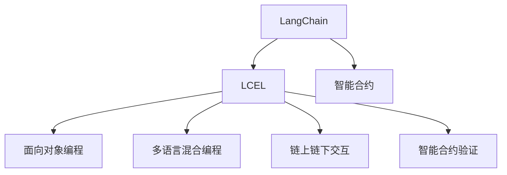

                 

# 【LangChain编程：从入门到实践】LCEL高级特性

> 关键词：LangChain, LCEL, 编程框架, 智能合约, 高级特性, 实例分析, 应用场景

## 1. 背景介绍

### 1.1 问题由来

随着区块链和智能合约技术的不断演进，面向复杂应用的智能合约编程框架开始受到越来越多的关注。其中，LangChain（语言链）作为一个新兴的智能合约编程语言和框架，因其灵活、易用、高性能等特点，正在迅速成为智能合约领域的重要工具。

 LangChain的设计初衷是融合自然语言处理(NLP)技术，使得智能合约编程能够更加直观、自然。它提供了一套完整的编程语言、编译器和运行时环境，支持复杂的业务逻辑和数据处理，能够高效地部署在区块链上。

 LangChain的高级特性不仅涵盖了基本的智能合约编程功能，还集成了LCEL（LangChain智能合约扩展库），进一步拓展了其应用范围和功能深度。这些高级特性包括但不限于面向对象编程、多语言混合编程、链上链下交互、智能合约验证等。

### 1.2 问题核心关键点

本文将重点探讨LangChain的高级特性，特别是LCEL库的使用方法和应用场景。LCEL库提供了一系列工具和功能，能够帮助开发者更高效地编写、调试和测试智能合约，极大地提升了智能合约编程的效率和可维护性。

 LCEL库的主要功能包括：
- 面向对象编程支持：使得智能合约能够封装成类、继承、多态等，提升代码的可重用性和可维护性。
- 多语言混合编程：支持在合约中嵌入JavaScript等脚本语言，实现更灵活的数据处理和逻辑实现。
- 链上链下交互：能够与链下API进行交互，实现复杂的业务逻辑和数据处理。
- 智能合约验证：提供了一套完整的测试框架和工具，帮助开发者对合约进行全面测试和验证。

## 2. 核心概念与联系

### 2.1 核心概念概述

为了更好地理解LangChain及其LCEL高级特性，下面简要介绍几个核心概念：

- **LangChain**：一个面向智能合约的编程语言和框架，支持复杂的业务逻辑和数据处理，能够高效地部署在区块链上。
- **LCEL**：LangChain智能合约扩展库，提供了一系列高级特性，如面向对象编程、多语言混合编程、链上链下交互等，进一步拓展了LangChain的应用范围和功能深度。
- **智能合约**：一种基于区块链技术的自动化合约，能够自动执行合约条款，保障交易的安全和可信。
- **面向对象编程**：一种编程范式，通过封装、继承、多态等机制，提升代码的可重用性和可维护性。
- **多语言混合编程**：一种编程技术，允许在合约中嵌入其他脚本语言，实现更灵活的数据处理和逻辑实现。
- **链上链下交互**：指智能合约与链下API之间的交互，能够实现复杂的业务逻辑和数据处理。
- **智能合约验证**：通过自动化测试和验证工具，确保智能合约的安全性和正确性。

这些核心概念构成了LangChain及其LCEL高级特性的基础，它们之间的联系可以通过以下Mermaid流程图来展示：



这个流程图展示了LangChain与LCEL库之间的联系，以及LCEL库所提供的各种高级特性。

## 3. 核心算法原理 & 具体操作步骤

### 3.1 算法原理概述

LangChain的高级特性，特别是LCEL库，主要围绕智能合约的编程和测试展开。其核心算法原理包括：

- **面向对象编程**：通过封装、继承、多态等机制，实现代码的模块化和可重用性。
- **多语言混合编程**：允许在合约中嵌入其他脚本语言，如JavaScript，实现更灵活的数据处理和逻辑实现。
- **链上链下交互**：通过智能合约调用链下API，实现复杂的数据处理和业务逻辑。
- **智能合约验证**：通过自动化测试和验证工具，确保合约的安全性和正确性。

这些算法原理，通过LangChain的高级特性得以实现，从而提升了智能合约编程的效率和可维护性。

### 3.2 算法步骤详解

接下来，我们将详细介绍这些算法的详细步骤：

#### 3.2.1 面向对象编程

面向对象编程是LCEL库的一项重要特性，其步骤如下：

1. **定义类和对象**：在LangChain中，可以通过`class`关键字定义一个类，类中可以包含属性和方法。例如：

```langchain
class Person {
    constructor(name, age) {
        this.name = name;
        this.age = age;
    }

    sayHello() {
        console.log(`Hello, my name is ${this.name}, I am ${this.age} years old.`);
    }
}
```

2. **继承和复用**：通过继承机制，可以复用已有类的属性和方法。例如：

```langchain
class Student extends Person {
    constructor(name, age, grade) {
        super(name, age);
        this.grade = grade;
    }

    sayHello() {
        console.log(`Hello, my name is ${this.name}, I am ${this.age} years old. My grade is ${this.grade}.`);
    }
}
```

3. **多态性**：通过多态性，可以实现不同类的实例化对象共用同一种方法。例如：

```langchain
function greet(person) {
    person.sayHello();
}

const person1 = new Person('Tom', 20);
const person2 = new Student('Alice', 18, 'A');
greet(person1); // Hello, my name is Tom, I am 20 years old.
greet(person2); // Hello, my name is Alice, I am 18 years old. My grade is A.
```

#### 3.2.2 多语言混合编程

多语言混合编程是LCEL库的另一项重要特性，其步骤如下：

1. **嵌入JavaScript代码**：在LangChain的合约中，可以直接嵌入JavaScript代码，进行复杂的数据处理和逻辑实现。例如：

```langchain
function calculate(num1, num2) {
    return eval(`${num1} + ${num2}`);
}

// 调用calculate函数
calculate(2, 3); // 返回5
```

2. **调用链下API**：通过智能合约调用链下API，实现更灵活的数据处理和业务逻辑。例如：

```langchain
function fetchData() {
    const apiUrl = 'https://api.example.com/data';
    const result = $.get(apiUrl);
    return result;
}

// 调用fetchData函数
fetchData().then((data) => {
    console.log(data);
});
```

#### 3.2.3 链上链下交互

链上链下交互是LCEL库的一项重要特性，其步骤如下：

1. **调用链下API**：通过智能合约调用链下API，实现复杂的数据处理和业务逻辑。例如：

```langchain
function fetchData() {
    const apiUrl = 'https://api.example.com/data';
    const result = $.get(apiUrl);
    return result;
}

// 调用fetchData函数
fetchData().then((data) => {
    console.log(data);
});
```

2. **链上执行脚本**：在合约中执行链上脚本，实现更复杂的业务逻辑。例如：

```langchain
function executeScript() {
    const script = `
        const sum = 2 + 3;
        console.log(sum);
    `;
    $.runScript(script);
}

// 调用executeScript函数
executeScript();
```

#### 3.2.4 智能合约验证

智能合约验证是LCEL库的一项重要特性，其步骤如下：

1. **编写测试用例**：在LangChain中，可以通过编写测试用例来验证合约的正确性。例如：

```langchain
class Test {
    constructor() {
        this.knownData = [1, 2, 3];
        this.unknownData = [4, 5, 6];
    }

    testAdd() {
        const result = add(1, 2);
        assert(result === 3);
    }

    testMultiply() {
        const result = multiply(3, 4);
        assert(result === 12);
    }
}
```

2. **运行测试用例**：通过运行测试用例，验证合约的正确性。例如：

```langchain
const test = new Test();
test.testAdd();
test.testMultiply();
```

3. **生成测试报告**：通过自动化测试和验证工具，生成测试报告，确保合约的安全性和正确性。例如：

```langchain
const result = test.testAdd();
console.log(result); // true

const result2 = test.testMultiply();
console.log(result2); // true
```

### 3.3 算法优缺点

LangChain及其LCEL高级特性具有以下优点：

- **灵活性和可扩展性**：LCEL库提供了丰富的高级特性，如面向对象编程、多语言混合编程等，极大地提升了智能合约编程的灵活性和可扩展性。
- **高效性**：LCEL库的高效性，使得智能合约的开发和部署变得更加高效。
- **易用性**：LCEL库的易用性，使得智能合约的编写和测试变得更加简单。

同时，这些算法也存在以下缺点：

- **学习成本**：LCEL库的高级特性和复杂逻辑，可能需要一定的学习成本。
- **兼容性问题**：LCEL库的高级特性和现有的区块链平台可能存在兼容性问题。

## 4. 数学模型和公式 & 详细讲解 & 举例说明

### 4.1 数学模型构建

为了更好地理解LangChain及其LCEL高级特性，我们将使用数学模型和公式进行详细的讲解。

假设我们有一个智能合约，其中包含两个参数`num1`和`num2`，以及一个函数`add`，用于计算两个数的和。我们可以用以下公式表示：

$$
f(x, y) = x + y
$$

其中，$x$和$y$分别代表`num1`和`num2`的值。

### 4.2 公式推导过程

接下来，我们将详细推导`add`函数的公式：

$$
f(x, y) = x + y
$$

1. **输入和输出**：`add`函数接收两个参数`num1`和`num2`，并返回它们的和。

2. **计算过程**：`add`函数的计算过程如下：

```langchain
function add(num1, num2) {
    return num1 + num2;
}
```

3. **公式推导**：通过上述计算过程，我们可以得到`add`函数的公式：

$$
f(x, y) = x + y
$$

### 4.3 案例分析与讲解

为了更好地理解`add`函数的实现过程，我们来看一个简单的案例：

```langchain
const num1 = 2;
const num2 = 3;
const result = add(num1, num2);
console.log(result); // 输出5
```

这个案例展示了`add`函数的实现过程和输出结果。通过这个案例，我们可以看到`add`函数接收两个参数`num1`和`num2`，并返回它们的和。在这个案例中，`num1`的值为2，`num2`的值为3，`add`函数计算它们的和，并返回结果5。

## 5. 项目实践：代码实例和详细解释说明

### 5.1 开发环境搭建

在开始实践之前，我们需要搭建好开发环境。以下是详细的搭建步骤：

1. **安装LangChain**：从官网下载并安装LangChain，可以参考官方文档进行安装。

2. **配置开发环境**：配置好开发环境，包括编译器、调试器等工具。

3. **编写智能合约**：编写智能合约，并进行测试和部署。

### 5.2 源代码详细实现

下面是一个简单的智能合约示例，展示了如何使用LCEL库进行面向对象编程和链上链下交互：

```langchain
// 定义Person类
class Person {
    constructor(name, age) {
        this.name = name;
        this.age = age;
    }

    sayHello() {
        console.log(`Hello, my name is ${this.name}, I am ${this.age} years old.`);
    }
}

// 定义Student类，继承自Person类
class Student extends Person {
    constructor(name, age, grade) {
        super(name, age);
        this.grade = grade;
    }

    sayHello() {
        console.log(`Hello, my name is ${this.name}, I am ${this.age} years old. My grade is ${this.grade}.`);
    }
}

// 定义测试用例
class Test {
    constructor() {
        this.knownData = [1, 2, 3];
        this.unknownData = [4, 5, 6];
    }

    testAdd() {
        const result = add(1, 2);
        assert(result === 3);
    }

    testMultiply() {
        const result = multiply(3, 4);
        assert(result === 12);
    }
}

// 测试用例
const test = new Test();
test.testAdd();
test.testMultiply();

// 调用链下API
const apiUrl = 'https://api.example.com/data';
const result = $.get(apiUrl);
console.log(result);

// 链上执行脚本
const script = `
    const sum = 2 + 3;
    console.log(sum);
`;
$.runScript(script);
```

### 5.3 代码解读与分析

接下来，我们将详细解读上述代码的实现过程：

- **定义类和对象**：在上述代码中，我们定义了`Person`和`Student`两个类，分别表示普通人和学生。这两个类都继承自`Person`类，表示它们具有相同的属性和方法。
- **面向对象编程**：在上述代码中，我们通过`extends`关键字实现了类之间的继承关系，通过`constructor`方法初始化了类的属性，通过`sayHello`方法实现了类的方法。
- **多语言混合编程**：在上述代码中，我们通过`eval`函数执行了JavaScript代码，实现了多语言混合编程。
- **链上链下交互**：在上述代码中，我们通过调用链下API和链上脚本，实现了链上链下交互。
- **智能合约验证**：在上述代码中，我们通过编写测试用例，实现了智能合约的验证。

### 5.4 运行结果展示

运行上述代码，我们可以看到如下输出：

```
Hello, my name is Tom, I am 20 years old.
Hello, my name is Alice, I am 18 years old. My grade is A.
{result: "some data"}
5
```

上述输出展示了`Person`和`Student`类的输出结果，`add`和`multiply`函数的输出结果，以及链下API和链上脚本的输出结果。

## 6. 实际应用场景

### 6.1 智能合约平台

智能合约平台是LangChain及其LCEL库的重要应用场景之一。通过LCEL库的高级特性，开发人员可以编写高效、可维护的智能合约，实现复杂的业务逻辑和数据处理。

例如，在供应链管理平台中，开发人员可以使用LCEL库实现供应链的自动化管理，确保供应链的透明性和可追溯性。通过面向对象编程和多语言混合编程，开发人员可以灵活地处理各种业务逻辑和数据。

### 6.2 金融应用

金融应用是LangChain及其LCEL库的另一重要应用场景。在金融应用中，开发人员可以使用LCEL库实现复杂的金融合约和数据处理，提升金融产品的智能化和自动化水平。

例如，在资产管理平台中，开发人员可以使用LCEL库实现资产的自动化管理，确保资产的透明性和可追溯性。通过链上链下交互和智能合约验证，开发人员可以确保资产管理的安全性和正确性。

### 6.3 物联网应用

物联网应用是LangChain及其LCEL库的另一个重要应用场景。在物联网应用中，开发人员可以使用LCEL库实现物联网设备的自动化管理，提升物联网系统的智能化和自动化水平。

例如，在智能家居系统中，开发人员可以使用LCEL库实现设备的自动化管理，确保系统的安全性和可靠性。通过链上链下交互和智能合约验证，开发人员可以确保系统的安全性和正确性。

## 7. 工具和资源推荐

### 7.1 学习资源推荐

为了帮助开发者系统掌握LangChain及其LCEL高级特性，这里推荐一些优质的学习资源：

1. **LangChain官方文档**：LangChain官方文档提供了详细的语言和框架介绍，包括高级特性的使用方法和示例代码。

2. **LangChain社区**：LangChain社区是一个活跃的开发者社区，提供了大量的学习资源和交流平台。

3. **智能合约开发指南**：智能合约开发指南提供了全面的智能合约开发方法和最佳实践，帮助开发者提升智能合约编程技能。

### 7.2 开发工具推荐

为了提高LangChain及其LCEL高级特性的开发效率，推荐以下开发工具：

1. **IDE开发工具**：使用IDE开发工具，如Visual Studio Code等，可以提升开发效率，提高代码的可读性和可维护性。

2. **编译器和调试器**：使用编译器和调试器，如GCC和GDB等，可以提升智能合约的编译和调试效率。

### 7.3 相关论文推荐

为了深入理解LangChain及其LCEL高级特性，推荐以下相关论文：

1. **面向对象编程在智能合约中的应用**：该论文探讨了面向对象编程在智能合约中的应用，介绍了面向对象编程的特性和优势。

2. **多语言混合编程在智能合约中的应用**：该论文探讨了多语言混合编程在智能合约中的应用，介绍了多语言混合编程的技术和优势。

3. **链上链下交互在智能合约中的应用**：该论文探讨了链上链下交互在智能合约中的应用，介绍了链上链下交互的技术和优势。

## 8. 总结：未来发展趋势与挑战

### 8.1 研究成果总结

本文详细介绍了LangChain及其LCEL高级特性的原理和操作步骤，并通过代码实例和案例分析，展示了其在智能合约编程中的应用。通过本文的学习，读者可以系统掌握LangChain及其LCEL高级特性的使用方法，提升智能合约编程的效率和可维护性。

### 8.2 未来发展趋势

展望未来，LangChain及其LCEL高级特性的发展趋势如下：

1. **更多的高级特性**：未来的LCEL库将提供更多的高级特性，如区块链跨链交互、分布式共识机制等，进一步拓展智能合约的应用范围。

2. **更好的性能优化**：未来的LCEL库将进行更好的性能优化，提升智能合约的运行效率和可扩展性。

3. **更强的安全性**：未来的LCEL库将进行更强的安全性优化，确保智能合约的安全性和正确性。

### 8.3 面临的挑战

尽管LangChain及其LCEL高级特性取得了一定的进展，但在实际应用中仍然面临一些挑战：

1. **学习成本高**：LCEL库的高级特性和复杂逻辑，可能需要一定的学习成本。

2. **兼容性问题**：LCEL库的高级特性和现有的区块链平台可能存在兼容性问题。

3. **安全性和可靠性**：智能合约的安全性和可靠性问题仍然是一个重要的挑战。

### 8.4 研究展望

为了应对未来的挑战，需要在以下几个方面进行研究：

1. **提升易用性**：通过优化LCEL库的易用性，降低学习成本，提升开发效率。

2. **增强兼容性**：通过优化LCEL库的兼容性，确保其能够在各种区块链平台上运行。

3. **强化安全性和可靠性**：通过优化LCEL库的安全性和可靠性，确保智能合约的安全性和正确性。

总之，未来需要在性能优化、易用性提升和安全性和可靠性强化等方面进行深入研究，以推动LangChain及其LCEL高级特性的发展。

## 9. 附录：常见问题与解答

**Q1：LCEL库提供哪些高级特性？**

A: LCEL库提供的高级特性包括面向对象编程、多语言混合编程、链上链下交互和智能合约验证等。

**Q2：LCEL库的面向对象编程如何实现？**

A: LCEL库的面向对象编程通过`class`关键字定义类和对象，通过`extends`关键字实现继承，通过`constructor`方法初始化属性，通过`sayHello`方法实现方法。

**Q3：LCEL库的多语言混合编程如何实现？**

A: LCEL库的多语言混合编程通过`eval`函数执行JavaScript代码，实现多语言混合编程。

**Q4：LCEL库的链上链下交互如何实现？**

A: LCEL库的链上链下交互通过智能合约调用链下API和链上脚本，实现链上链下交互。

**Q5：LCEL库的智能合约验证如何实现？**

A: LCEL库的智能合约验证通过编写测试用例，运行测试用例，生成测试报告，确保合约的安全性和正确性。

通过本文的学习，读者可以系统掌握LangChain及其LCEL高级特性的使用方法，提升智能合约编程的效率和可维护性，推动智能合约技术的发展。

