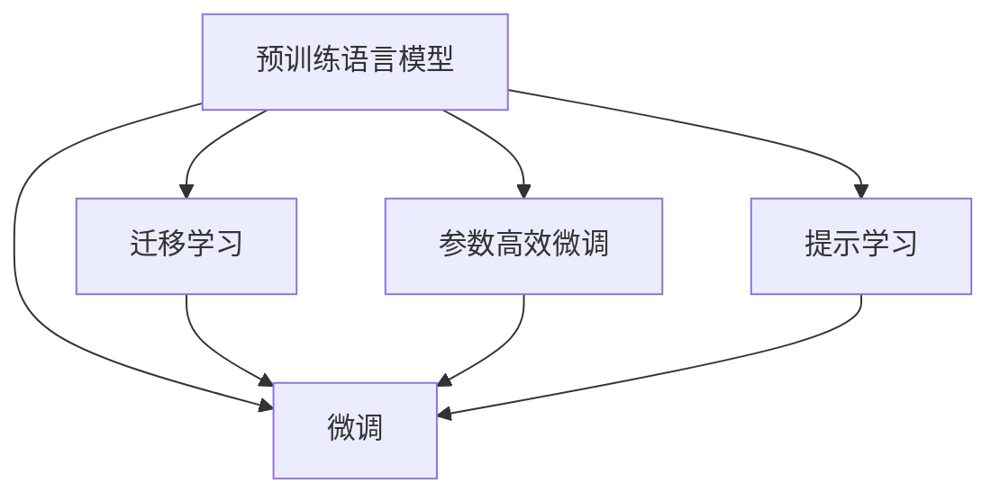

                 

# 【LangChain编程：从入门到实践】快速开始

## 1. 背景介绍

### 1.1 问题由来
随着人工智能技术的飞速发展，语言处理成为了AI研究的一个重要方向。近年来，预训练语言模型（Pre-trained Language Models, PLMs）在自然语言处理（NLP）领域取得了显著进展，如BERT、GPT等。这些模型通过大规模无标签文本数据进行预训练，具备强大的语言理解和生成能力。然而，在特定任务上，直接使用预训练模型并不能达到最优效果，需要通过微调（Fine-tuning）进一步优化模型。

### 1.2 问题核心关键点
微调是一种基于监督学习的范式，利用有限的标注数据，通过有监督训练，优化模型在下游任务上的性能。微调的核心在于选择合适的模型和数据，以及调整适当的超参数，以确保模型能够充分利用预训练的知识，同时避免过拟合。

微调方法简单高效，广泛应用于文本分类、命名实体识别、机器翻译、问答系统等任务。微调的优点在于数据需求少、训练速度快、效果显著，但缺点也明显：对标注数据依赖大、泛化能力有限、模型容易受数据分布影响等。

### 1.3 问题研究意义
微调方法能够显著提升模型在特定任务上的表现，是NLP技术落地应用的重要手段。掌握微调方法，不仅能够降低开发成本，提高模型性能，还能加速开发进度，为各行各业带来AI应用的变革。

## 2. 核心概念与联系

### 2.1 核心概念概述
为了更好地理解微调方法，首先需要了解以下核心概念：

- **预训练语言模型**：如BERT、GPT等，通过大规模无标签文本数据预训练得到的模型，具备强大的语言表示能力。
- **微调**：在有标签数据上进行细粒度训练，优化模型在特定任务上的性能。
- **迁移学习**：利用预训练模型在其他任务上的迁移能力，减少数据需求，提升训练效率。
- **参数高效微调**：只调整部分参数，以提高模型效率，避免过拟合。
- **提示学习**：通过设计特定的输入格式，引导模型生成期望的输出，减少微调参数。

这些概念相互关联，共同构成微调方法的理论基础。下面通过Mermaid流程图展示这些概念之间的联系：



这个流程图展示了预训练语言模型通过微调、迁移学习和参数高效微调、提示学习等技术，在不同任务上实现性能提升的逻辑关系。

## 3. 核心算法原理 & 具体操作步骤

### 3.1 算法原理概述
微调的核心思想是在预训练模型的基础上，通过有监督学习，优化模型在特定任务上的性能。具体来说，假设预训练模型为$M_{\theta}$，下游任务数据集为$D=\{(x_i, y_i)\}_{i=1}^N$，其中$x_i$为输入，$y_i$为标签。微调的目标是最小化模型在训练集上的损失函数$\mathcal{L}(\theta)$，得到最优模型参数$\hat{\theta}$。

### 3.2 算法步骤详解
微调的具体步骤包括：

**Step 1: 准备预训练模型和数据集**
- 选择合适的预训练语言模型$M_{\theta}$，如BERT、GPT等。
- 准备下游任务的数据集$D$，划分为训练集、验证集和测试集。

**Step 2: 添加任务适配层**
- 根据任务类型，设计合适的输出层和损失函数。
- 例如，分类任务使用线性分类器和交叉熵损失函数。

**Step 3: 设置微调超参数**
- 选择合适的优化算法及其参数，如AdamW、SGD等，设置学习率、批大小、迭代轮数等。
- 设置正则化技术，如L2正则、Dropout、Early Stopping等。
- 确定冻结预训练参数的策略，如仅微调顶层，或全部参数都参与微调。

**Step 4: 执行梯度训练**
- 将训练集数据分批次输入模型，计算损失函数。
- 反向传播计算参数梯度，根据设定的优化算法和学习率更新模型参数。
- 周期性在验证集上评估模型性能，根据性能指标决定是否触发Early Stopping。
- 重复上述步骤直到满足预设的迭代轮数或Early Stopping条件。

**Step 5: 测试和部署**
- 在测试集上评估微调后模型$M_{\hat{\theta}}$的性能，对比微调前后的精度提升。
- 使用微调后的模型对新样本进行推理预测，集成到实际的应用系统中。
- 持续收集新的数据，定期重新微调模型，以适应数据分布的变化。

### 3.3 算法优缺点
微调方法的优点包括：
- 数据需求少，训练速度快。
- 效果显著，能够显著提升模型在特定任务上的表现。
- 适用性广，适用于各种NLP下游任务。

缺点包括：
- 对标注数据依赖大，获取高质量标注数据的成本较高。
- 泛化能力有限，当目标任务与预训练数据的分布差异较大时，微调的性能提升有限。
- 模型容易受数据分布影响，泛化能力可能不如从头训练。

### 3.4 算法应用领域
微调方法在NLP领域已经得到了广泛应用，覆盖了文本分类、命名实体识别、机器翻译、问答系统等多个任务。以下以机器翻译为例，介绍微调的具体应用：

假设输入文本为源语言句子$s$，输出为目标语言句子$t$，目标为使翻译模型学习源语言到目标语言的映射。具体步骤如下：

1. 收集并标注大量的双语语料库$D=\{(s_i, t_i)\}_{i=1}^N$。
2. 使用预训练的机器翻译模型$M_{\theta}$，如Transformer模型。
3. 将翻译模型作为初始化参数，通过有监督学习优化模型参数$\theta$，使其最小化损失函数$\mathcal{L}(\theta)$。
4. 在测试集上评估模型性能，使用微调后的模型进行翻译任务。

## 4. 数学模型和公式 & 详细讲解 & 举例说明

### 4.1 数学模型构建
假设预训练模型为$M_{\theta}:\mathcal{X} \rightarrow \mathcal{Y}$，其中$\mathcal{X}$为输入空间，$\mathcal{Y}$为输出空间，$\theta \in \mathbb{R}^d$为模型参数。下游任务$T$的训练集为$D=\{(x_i, y_i)\}_{i=1}^N$，其中$x_i \in \mathcal{X}$为输入，$y_i \in \mathcal{Y}$为标签。微调的目标是最小化经验风险$\mathcal{L}(\theta)$：

$$
\mathcal{L}(\theta) = \frac{1}{N} \sum_{i=1}^N \ell(M_{\theta}(x_i),y_i)
$$

其中$\ell$为任务特定的损失函数，如交叉熵损失、均方误差损失等。

### 4.2 公式推导过程
以二分类任务为例，假设模型输出为$\hat{y}=M_{\theta}(x)$，真实标签为$y \in \{0, 1\}$，二分类交叉熵损失函数为：

$$
\ell(M_{\theta}(x),y) = -[y\log \hat{y} + (1-y)\log (1-\hat{y})]
$$

代入经验风险公式，得：

$$
\mathcal{L}(\theta) = -\frac{1}{N}\sum_{i=1}^N [y_i\log M_{\theta}(x_i)+(1-y_i)\log(1-M_{\theta}(x_i))]
$$

根据链式法则，损失函数对参数$\theta_k$的梯度为：

$$
\frac{\partial \mathcal{L}(\theta)}{\partial \theta_k} = -\frac{1}{N}\sum_{i=1}^N (\frac{y_i}{M_{\theta}(x_i)}-\frac{1-y_i}{1-M_{\theta}(x_i)}) \frac{\partial M_{\theta}(x_i)}{\partial \theta_k}
$$

其中$\frac{\partial M_{\theta}(x_i)}{\partial \theta_k}$为模型的导数，通常使用自动微分技术计算。

### 4.3 案例分析与讲解
以BERT微调进行命名实体识别（NER）为例，具体步骤如下：

1. 准备标注数据集，包含文本和对应的实体标注。
2. 使用BERT作为预训练模型，添加特定的输出层和损失函数，如线性分类器。
3. 设置适当的超参数，如学习率、批大小等。
4. 通过梯度下降等优化算法，最小化损失函数$\mathcal{L}(\theta)$，得到最优模型参数$\hat{\theta}$。
5. 在测试集上评估模型性能，如精确率、召回率、F1分数等。

## 5. 项目实践：代码实例和详细解释说明

### 5.1 开发环境搭建

**Step 1: 安装Python和相关库**
- 安装Python：从官网下载并安装Python 3.x版本。
- 安装PyTorch：使用以下命令安装PyTorch及其依赖库：
  ```bash
  pip install torch torchtext transformers
  ```
- 安装其他依赖库：如numpy、scikit-learn等，具体命令如下：
  ```bash
  pip install numpy scikit-learn
  ```

**Step 2: 准备数据集**
- 下载并准备命名实体识别数据集，如CoNLL-2003等。
- 使用Python代码读取并预处理数据集，如分词、标注实体等。

### 5.2 源代码详细实现

```python
import torch
import torchtext
from transformers import BertForTokenClassification, BertTokenizer, AdamW

# 设置数据集
train_data, test_data = torchtext.datasets.TextClassification.prepare_data('conll03', train='train', test='test')

# 初始化模型和参数
model = BertForTokenClassification.from_pretrained('bert-base-cased', num_labels=3)
tokenizer = BertTokenizer.from_pretrained('bert-base-cased')
optimizer = AdamW(model.parameters(), lr=2e-5)

# 训练函数
def train(model, data, batch_size, optimizer, num_epochs):
    model.train()
    for epoch in range(num_epochs):
        for batch in data:
            input_ids = batch.text.to(device)
            attention_mask = batch.attention_mask.to(device)
            labels = batch.label.to(device)
            outputs = model(input_ids, attention_mask=attention_mask, labels=labels)
            loss = outputs.loss
            optimizer.zero_grad()
            loss.backward()
            optimizer.step()
        print(f'Epoch {epoch+1}, train loss: {loss:.3f}')

# 测试函数
def evaluate(model, data, batch_size):
    model.eval()
    preds, labels = [], []
    for batch in data:
        input_ids = batch.text.to(device)
        attention_mask = batch.attention_mask.to(device)
        labels = batch.label.to(device)
        outputs = model(input_ids, attention_mask=attention_mask)
        preds.append(outputs.logits.argmax(dim=2).to('cpu').tolist())
        labels.append(labels.to('cpu').tolist())
    print(classification_report(labels, preds))

# 训练和测试
device = torch.device('cuda') if torch.cuda.is_available() else torch.device('cpu')
model.to(device)
train_data, test_data = torchtext.datasets.TextClassification.prepare_data('conll03', train='train', test='test')
train(model, train_data, batch_size=16, optimizer=optimizer, num_epochs=5)
evaluate(model, test_data, batch_size=16)
```

### 5.3 代码解读与分析

**数据处理函数**
- `torchtext.datasets.TextClassification.prepare_data`：用于加载和预处理命名实体识别数据集。
- `torchtext.data.TextClassification`：定义数据集的预处理步骤，如分词、标注等。

**模型和参数初始化**
- `BertForTokenClassification.from_pretrained`：使用预训练的BERT模型。
- `BertTokenizer.from_pretrained`：初始化BERT分词器。

**训练函数**
- `model.train()`：将模型设置为训练模式。
- `model(input_ids, attention_mask=attention_mask, labels=labels)`：前向传播计算输出和损失。
- `optimizer.zero_grad()`：清除梯度缓存。
- `loss.backward()`：反向传播计算梯度。
- `optimizer.step()`：更新模型参数。

**测试函数**
- `model.eval()`：将模型设置为评估模式。
- `outputs.logits.argmax(dim=2)`：计算模型输出的预测标签。
- `classification_report`：生成分类报告，评估模型性能。

**训练和测试流程**
- 加载数据集，设置模型和参数。
- 训练模型，每轮输出损失。
- 在测试集上评估模型，输出分类报告。

## 6. 实际应用场景

### 6.1 智能客服系统

智能客服系统通过微调大语言模型，能够实现自然流畅的对话和高效的用户问题解答。具体实现步骤如下：

1. 收集历史客服对话记录，标注问题和最佳答复。
2. 使用BERT等预训练模型，添加分类器进行微调。
3. 部署到生产环境，实时处理用户咨询，并提供个性化回答。

### 6.2 金融舆情监测

金融舆情监测系统通过微调大语言模型，实现对新闻、报道等信息的自动化分析和情感分析。具体实现步骤如下：

1. 收集金融领域相关文本数据，并标注其主题和情感。
2. 使用BERT等预训练模型，添加分类器和情感分析器进行微调。
3. 部署到实时监控系统，实时分析舆情变化，及时预警风险。

### 6.3 个性化推荐系统

个性化推荐系统通过微调大语言模型，实现精准的用户兴趣分析和推荐。具体实现步骤如下：

1. 收集用户浏览、点击、评论等行为数据，提取文本内容。
2. 使用BERT等预训练模型，添加分类器和推荐模型进行微调。
3. 根据用户兴趣和行为，动态生成推荐内容。

## 7. 工具和资源推荐

### 7.1 学习资源推荐

1. **《Transformer从原理到实践》系列博文**：深入浅出地介绍Transformer原理、BERT模型和微调技术。
2. **CS224N《深度学习自然语言处理》课程**：斯坦福大学开设的NLP明星课程，涵盖基础知识和经典模型。
3. **《Natural Language Processing with Transformers》书籍**：介绍如何使用Transformers库进行NLP任务开发。
4. **HuggingFace官方文档**：提供海量预训练模型和微调样例代码。
5. **CLUE开源项目**：涵盖多类型的中文NLP数据集和微调baseline。

### 7.2 开发工具推荐

1. **PyTorch**：开源深度学习框架，支持动态计算图，适合快速迭代研究。
2. **TensorFlow**：由Google主导的深度学习框架，生产部署方便。
3. **Transformers库**：HuggingFace开发的NLP工具库，支持多种预训练模型和微调方法。
4. **Weights & Biases**：实验跟踪工具，记录模型训练指标。
5. **TensorBoard**：可视化工具，监测模型训练状态。

### 7.3 相关论文推荐

1. **Attention is All You Need**：提出Transformer结构，开启大模型预训练时代。
2. **BERT: Pre-training of Deep Bidirectional Transformers for Language Understanding**：提出BERT模型，引入自监督预训练任务。
3. **Language Models are Unsupervised Multitask Learners**：展示大语言模型的零样本学习能力。
4. **Parameter-Efficient Transfer Learning for NLP**：提出 Adapter等参数高效微调方法。
5. **Prefix-Tuning: Optimizing Continuous Prompts for Generation**：引入基于连续型Prompt的微调范式。

## 8. 总结：未来发展趋势与挑战

### 8.1 研究成果总结

微调方法通过在大规模预训练语言模型基础上，利用有监督数据进一步优化模型性能，已经广泛应用于各种NLP任务。其简单高效的特点，使其成为NLP技术落地的重要手段。

### 8.2 未来发展趋势

1. **模型规模增大**：预训练模型参数量持续增长，能够学习更丰富的语言知识，适应更复杂的下游任务。
2. **微调方法多样化**：除了全参数微调，未来将涌现更多参数高效和计算高效的方法，如Prefix-Tuning、LoRA等。
3. **持续学习成为常态**：模型需要不断学习新知识，避免过时，保持性能。
4. **标注样本需求降低**：利用提示学习等方法，减少微调对标注数据的依赖。
5. **多模态微调崛起**：将视觉、语音等非文本信息与文本信息结合，提高模型的理解能力。
6. **模型通用性增强**：学习更广泛的先验知识，增强模型的迁移能力。

### 8.3 面临的挑战

1. **标注成本瓶颈**：获取高质量标注数据的成本较高，限制了微调的应用范围。
2. **模型鲁棒性不足**：面对域外数据时，泛化性能有限。
3. **推理效率有待提高**：模型参数量大，推理速度慢。
4. **可解释性亟需加强**：模型缺乏可解释性，难以调试和理解。
5. **安全性有待保障**：预训练模型可能学习有害信息，输出不安全。
6. **知识整合能力不足**：模型难以吸收和运用外部知识。

### 8.4 研究展望

未来研究需要在以下方向进行突破：
1. **探索无监督和半监督微调方法**：利用自监督和主动学习方法，减少对标注数据的依赖。
2. **研究参数高效和计算高效的微调范式**：只调整少量参数，提高微调效率。
3. **融合因果和对比学习范式**：增强模型的泛化能力和鲁棒性。
4. **引入更多先验知识**：将专家知识与神经网络结合，提高模型的综合能力。
5. **结合因果分析和博弈论工具**：增强模型的决策逻辑和稳定性。
6. **纳入伦理道德约束**：确保模型输出的安全性。

## 9. 附录：常见问题与解答

### Q1: 微调是否适用于所有NLP任务？

A: 微调方法适用于大多数NLP任务，尤其是数据量较小的任务。但对于特定领域的任务，需要进一步在特定领域数据上进行预训练，才能获得理想效果。

### Q2: 微调过程中如何选择合适的学习率？

A: 微调学习率一般比预训练时小1-2个数量级，避免破坏预训练权重。可以使用warmup策略，逐渐增加学习率。

### Q3: 微调模型在落地部署时需要注意哪些问题？

A: 模型裁剪、量化加速、服务化封装、弹性伸缩、监控告警和安全防护等。

---

作者：禅与计算机程序设计艺术 / Zen and the Art of Computer Programming

