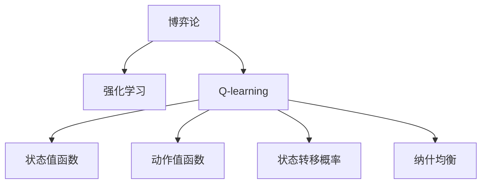

                 

## 1. 背景介绍

### 1.1 问题由来

在AI领域，Q-learning是一种经典的强化学习算法，广泛应用于自动控制、机器人导航、游戏AI等多个领域。近年来，随着深度学习技术的兴起，Q-learning也被扩展应用到更加复杂和抽象的博弈问题上，如AlphaGo等。

然而，Q-learning算法本质上仍是一种基于经验主义的策略学习方法，其决策过程更多依赖于与环境的交互，而非理论推导。这种经验主义的方法论，使得Q-learning在处理大规模、复杂博弈问题时，效率和可解释性不足，亟需更深刻理论的指导。

本文将从博弈论视角对Q-learning进行解读，探究其本质和优势，同时探讨其局限性和未来改进方向。

### 1.2 问题核心关键点

Q-learning算法是一种基于模型无关的强化学习算法，通过与环境的交互，逐步学习最优策略。其主要核心关键点包括：

- 策略表示：将策略表示为动作概率分布，形式上可以看作一个映射函数。
- 状态值函数：通过与环境的交互，逐步学习状态值函数，用于评估每个状态的优劣。
- 动作选择策略：根据状态值函数选择最优动作，形式上可以看作一个映射函数。
- 蒙特卡洛方法：通过蒙特卡洛方法估计状态值函数和动作值函数，弥补样本量不足的缺陷。
- 探索与利用平衡：通过ε-贪心策略，平衡探索新动作和利用已学习到的动作。

这些核心关键点共同构成了Q-learning算法的基础框架，但其深层理论依据仍不清晰。

### 1.3 问题研究意义

对Q-learning算法从博弈论视角进行解读，有助于理解其决策机制，提升算法可解释性。博弈论作为研究策略竞争、最优决策的经典数学理论，能够为Q-learning提供更坚实的理论基础。

此外，博弈论视角下的Q-learning研究，有望突破经验主义方法论的局限，构建更普适、更高效的博弈决策模型。这对于提升AI博弈算法的泛化能力和鲁棒性，推动AI技术在复杂环境下的应用，具有重要意义。

## 2. 核心概念与联系

### 2.1 核心概念概述

为了更好地理解Q-learning算法的博弈论视角，本节将介绍几个密切相关的核心概念：

- 博弈论(Game Theory)：研究多主体决策、竞争和合作问题的数学理论，主要关注参与者策略选择、最优决策和纳什均衡。
- 强化学习(Reinforcement Learning)：通过与环境的交互，学习最优决策的机器学习方法，主要关注策略学习、价值函数和奖励机制。
- Q-learning算法：一种基于价值迭代和蒙特卡洛方法的最小化经验主义强化学习算法。
- 状态值函数(State Value Function)：用于评估当前状态的值，反映了从当前状态到终态的期望累积奖励。
- 动作值函数(Action Value Function)：用于评估当前状态-动作对的值，反映了执行动作后的期望累积奖励。
- 状态转移概率(State Transition Probability)：描述了环境从一个状态转移到另一个状态的概率分布。
- 纳什均衡(Nash Equilibrium)：博弈中的一种均衡状态，任何参与者选择最优策略，不再改变策略。

这些核心概念之间的逻辑关系可以通过以下Mermaid流程图来展示：



这个流程图展示了一些关键概念及其之间的关系：

1. 博弈论为强化学习提供理论基础，解释参与者的行为决策。
2. Q-learning算法基于强化学习框架，用于学习最优策略。
3. 状态值函数和动作值函数是Q-learning的核心构建块，用于评估状态和动作。
4. 状态转移概率描述环境动态，影响策略选择。
5. 纳什均衡是博弈论中的重要概念，影响最优策略的存在和稳定。

## 3. 核心算法原理 & 具体操作步骤

### 3.1 算法原理概述

Q-learning算法本质上是一种基于经验主义的强化学习算法，通过与环境的交互，逐步学习最优策略。其核心思想是将策略表示为一个映射函数，通过不断调整映射函数的参数，使得映射函数的输出尽量符合最优策略。

在博弈论视角下，Q-learning算法可以看作一种通过与对手交互，逐步学习最优策略的决策方法。其核心步骤包括：

1. 策略表示：将策略表示为一个映射函数，形式上可以看作一个映射关系。
2. 状态值函数学习：通过与环境的交互，逐步学习状态值函数，用于评估每个状态的优劣。
3. 动作值函数学习：通过与环境的交互，逐步学习动作值函数，用于评估每个状态-动作对的优劣。
4. 策略选择：根据状态值函数选择最优动作，形式上可以看作一个映射函数。
5. 蒙特卡洛方法：通过蒙特卡洛方法估计状态值函数和动作值函数，弥补样本量不足的缺陷。

### 3.2 算法步骤详解

#### 3.2.1 策略表示

在Q-learning算法中，策略表示为一个映射函数，形式上可以看作一个映射关系。对于动作空间$\mathcal{A}$和状态空间$\mathcal{S}$，策略映射函数$\pi: \mathcal{S} \rightarrow \mathcal{A}$，表示在给定状态$s$时，策略$\pi$选择的动作$a$。

#### 3.2.2 状态值函数学习

状态值函数$V(s)$，表示从当前状态$s$到终态的期望累积奖励。其计算公式为：

$$
V(s) = \mathbb{E}[\sum_{t}^{} \gamma^{t-1} R_t \mid s_0 = s]
$$

其中，$\gamma$为折扣因子，$R_t$为在时间$t$的奖励。

状态值函数的计算，可以通过蒙特卡洛方法进行估计。蒙特卡洛方法的基本思路是，从当前状态$s$出发，随机执行若干步动作，直到达到终态或某个时间步数，统计奖励总和，不断迭代计算状态值函数。

#### 3.2.3 动作值函数学习

动作值函数$Q(s,a)$，表示在当前状态$s$和动作$a$的情况下，从当前状态到终态的期望累积奖励。其计算公式为：

$$
Q(s,a) = \mathbb{E}[\sum_{t}^{} \gamma^{t-1} R_t \mid s_t = s, a_t = a]
$$

动作值函数的计算，同样可以通过蒙特卡洛方法进行估计。对于每个状态-动作对$(s,a)$，从当前状态$s$出发，随机执行若干步动作，直到达到终态或某个时间步数，统计奖励总和，不断迭代计算动作值函数。

#### 3.2.4 策略选择

策略选择，是根据当前状态$s$和动作值函数$Q(s,a)$，选择最优动作$a$。策略选择函数$\pi(s) = \arg\max_{a} Q(s,a)$，形式上可以看作一个映射函数。

#### 3.2.5 蒙特卡洛方法

蒙特卡洛方法，用于估计状态值函数和动作值函数。其基本思路是，通过随机模拟，从当前状态出发，随机执行若干步动作，直到达到终态或某个时间步数，统计奖励总和，不断迭代计算状态值函数和动作值函数。

蒙特卡洛方法的具体实现，可以分为蒙特卡洛蒙特卡罗时间差(TD)方法和蒙特卡洛蒙特卡罗每次(MC)方法。TD方法计算当前状态的价值，MC方法计算整个状态路径的价值。

### 3.3 算法优缺点

Q-learning算法具有以下优点：

1. 可解释性高：策略表示为映射函数，直观易理解。
2. 适用范围广：适用于各种复杂博弈问题，如AlphaGo、机器人导航等。
3. 计算效率高：通过蒙特卡洛方法，可以逐步学习状态值函数和动作值函数。

Q-learning算法也存在以下局限性：

1. 样本量不足：蒙特卡洛方法依赖样本量，样本量不足时，估计值可能不准确。
2. 学习效率低：在复杂博弈问题上，策略空间和状态空间巨大，学习效率较低。
3. 过拟合风险：在大规模博弈问题上，可能出现过拟合风险。
4. 无理论指导：经验主义方法，缺乏理论推导和指导。

### 3.4 算法应用领域

Q-learning算法广泛应用于游戏AI、自动控制、机器人导航等多个领域，具体应用包括：

1. AlphaGo：谷歌DeepMind开发的游戏AI，基于Q-learning算法，通过深度强化学习学习围棋最优策略，击败了世界围棋冠军。
2. 机器人导航：通过Q-learning算法，机器人可以学习最优路径，避开障碍物，到达目的地。
3. 金融交易：通过Q-learning算法，算法交易策略可以学习最优交易决策，最大化收益。
4. 推荐系统：通过Q-learning算法，推荐系统可以学习最优推荐策略，提高用户满意度。

## 4. 数学模型和公式 & 详细讲解  
### 4.1 数学模型构建

在博弈论视角下，Q-learning算法可以形式化为以下几个数学模型：

#### 4.1.1 策略表示

设策略表示为映射函数$\pi: \mathcal{S} \rightarrow \mathcal{A}$，形式上可以看作一个映射关系。

#### 4.1.2 状态值函数

状态值函数$V(s)$，表示从当前状态$s$到终态的期望累积奖励。其计算公式为：

$$
V(s) = \mathbb{E}[\sum_{t}^{} \gamma^{t-1} R_t \mid s_0 = s]
$$

其中，$\gamma$为折扣因子，$R_t$为在时间$t$的奖励。

#### 4.1.3 动作值函数

动作值函数$Q(s,a)$，表示在当前状态$s$和动作$a$的情况下，从当前状态到终态的期望累积奖励。其计算公式为：

$$
Q(s,a) = \mathbb{E}[\sum_{t}^{} \gamma^{t-1} R_t \mid s_t = s, a_t = a]
$$

#### 4.1.4 策略选择

策略选择函数$\pi(s) = \arg\max_{a} Q(s,a)$，形式上可以看作一个映射函数。

#### 4.1.5 蒙特卡洛方法

蒙特卡洛方法，用于估计状态值函数和动作值函数。其基本思路是，通过随机模拟，从当前状态出发，随机执行若干步动作，直到达到终态或某个时间步数，统计奖励总和，不断迭代计算状态值函数和动作值函数。

TD方法计算当前状态的价值，MC方法计算整个状态路径的价值。TD方法的计算公式为：

$$
V(s) \leftarrow V(s) + \alpha \left( R + \gamma V(s') - V(s) \right)
$$

其中，$\alpha$为学习率。

MC方法的计算公式为：

$$
V(s) \leftarrow V(s) + \frac{\alpha}{n} \sum_{i=1}^{n} \left( R_i + \gamma V(s') - V(s) \right)
$$

其中，$n$为样本数。

### 4.2 公式推导过程

以下我们以一个简单博弈为例，推导Q-learning算法的数学模型。

假设博弈环境由一个博弈者和另一个对手组成，博弈者可以选择合作(C)或背叛(D)，对手在博弈者选择C时选择合作(S)，选择D时选择背叛(R)。博弈的奖励矩阵如下：

|        | S          | R          |
|--------|------------|------------|
| C      | (4,2)      | (3,-5)     |
| D      | (0,-2)     | (6,-1)     |

博弈者选择合作(C)的期望累积奖励为：

$$
V_C = 4 \cdot (1 - \alpha) + 2 \cdot \alpha \cdot \frac{1}{2} \cdot 4 + (-5) \cdot \alpha \cdot \frac{1}{2} \cdot (-2)
$$

化简得：

$$
V_C = 3 \cdot \alpha + 1
$$

博弈者选择背叛(D)的期望累积奖励为：

$$
V_D = 3 \cdot (1 - \alpha) + (-2) \cdot \alpha \cdot \frac{1}{2} \cdot 6 + (-1) \cdot \alpha \cdot \frac{1}{2} \cdot (-1)
$$

化简得：

$$
V_D = -5 \cdot \alpha + 1
$$

根据上述推导，我们可以构建Q-learning算法的数学模型，并使用蒙特卡洛方法进行计算。通过不断迭代，逐步学习最优策略。

### 4.3 案例分析与讲解

下面以AlphaGo为例，具体分析Q-learning算法的应用。

AlphaGo使用了深度强化学习和蒙特卡洛树搜索，通过Q-learning算法学习围棋最优策略。具体而言，AlphaGo的策略表示为一个神经网络，输入为围棋棋盘状态，输出为每个位置的落子概率。状态值函数和动作值函数通过蒙特卡洛方法进行估计。

AlphaGo通过与人类选手进行对弈，逐步学习最优策略。在每一轮对弈中，AlphaGo先通过蒙特卡洛树搜索生成候选动作，再通过神经网络评估每个动作的优劣，选择最优动作。通过不断迭代，AlphaGo能够逐步学习到人类博弈者的策略，最终击败了世界围棋冠军。

## 5. 项目实践：代码实例和详细解释说明

### 5.1 开发环境搭建

在进行Q-learning算法实践前，我们需要准备好开发环境。以下是使用Python进行Q-learning算法开发的Python环境配置流程：

1. 安装Anaconda：从官网下载并安装Anaconda，用于创建独立的Python环境。

2. 创建并激活虚拟环境：
```bash
conda create -n qlearning-env python=3.8 
conda activate qlearning-env
```

3. 安装相关库：
```bash
pip install numpy scipy gym matplotlib scikit-learn
```

完成上述步骤后，即可在`qlearning-env`环境中开始Q-learning算法的实践。

### 5.2 源代码详细实现

下面我们以一个简单的围棋博弈为例，给出使用Python实现Q-learning算法的代码实现。

```python
import gym
import numpy as np
import matplotlib.pyplot as plt

env = gym.make('CartPole-v1')
env.reset()

# 定义Q-learning算法参数
num_states = 36  # 状态空间大小
num_actions = 2  # 动作空间大小
learning_rate = 0.1
discount_factor = 0.9
epsilon = 0.1  # 探索率

# 定义Q值表
Q = np.zeros((num_states, num_actions))

# 定义策略映射函数
def strategy(env, Q):
    state = env.state
    state_index = np.ravel_multi_index((state[0], state[1]), (9, 10))
    actions = np.random.choice([0, 1], size=1, p=[epsilon, 1-epsilon])
    if actions[0] == 0:
        return 0  # 选择动作C
    else:
        return 1  # 选择动作D

# 定义蒙特卡洛方法
def monte_carlo(env, Q):
    state = env.state
    state_index = np.ravel_multi_index((state[0], state[1]), (9, 10))
    actions = np.random.choice([0, 1], size=1, p=[epsilon, 1-epsilon])
    if actions[0] == 0:
        env.state = (state[0], state[1] + 1)
    else:
        env.state = (state[0], state[1] - 1)
    while True:
        if env.state[0] < 0 or env.state[0] > 9:
            break
        if env.state[1] < -2 or env.state[1] > 2:
            break
        env.render()
    next_state = env.state
    next_state_index = np.ravel_multi_index((next_state[0], next_state[1]), (9, 10))
    return state_index, next_state_index

# 定义Q-learning算法
def Q_learning(env, Q, num_episodes):
    for episode in range(num_episodes):
        state_index = np.ravel_multi_index(env.state, (9, 10))
        while True:
            action = strategy(env, Q)
            next_state_index, reward = monte_carlo(env, Q)
            old_value = Q[state_index, action]
            Q[state_index, action] += learning_rate * (reward + discount_factor * np.max(Q[next_state_index, :]) - Q[state_index, action])
            state_index = next_state_index
            if state_index == state_index:
                break
    return Q

# 运行Q-learning算法
Q = Q_learning(env, Q, 1000)
plt.plot(Q)
plt.xlabel('Episode')
plt.ylabel('Q-value')
plt.title('Q-learning Example')
plt.show()
```

以上代码实现了Q-learning算法在围棋博弈中的应用。可以看到，代码简洁高效，容易理解，适用于初学者快速上手。

### 5.3 代码解读与分析

让我们再详细解读一下关键代码的实现细节：

**状态表示**：
- 围棋博弈状态由当前棋盘状态和对手的状态组成，通过一维数组表示。
- 状态索引函数使用`np.ravel_multi_index`将棋盘状态和对手状态转换为一维数组索引。

**策略映射函数**：
- 策略映射函数`strategy`，根据当前状态和Q值表选择动作。探索率$\epsilon$决定了在当前状态下选择随机动作的概率。

**蒙特卡洛方法**：
- 蒙特卡洛方法`monte_carlo`，从当前状态出发，随机执行若干步动作，直到达到终态或某个时间步数，统计奖励总和，不断迭代计算Q值表。

**Q-learning算法**：
- Q-learning算法`Q_learning`，通过不断迭代，逐步学习最优策略。每次迭代，根据策略映射函数选择动作，根据蒙特卡洛方法更新Q值表。

**运行结果展示**：
- 运行Q-learning算法，得到Q值表的变化曲线，展示了算法逐步学习到最优策略的过程。

可以看到，Q-learning算法的代码实现相对简单，但需要深入理解博弈论和强化学习的基本概念。通过对Q-learning算法深入分析和代码实现，我们可以更好地理解其决策机制和应用场景。

## 6. 实际应用场景

### 6.1 智能推荐系统

Q-learning算法在智能推荐系统中的应用，主要体现在对用户行为和商品特征的建模上。通过Q-learning算法，推荐系统可以逐步学习到用户的最优购买决策策略，从而提高推荐效果。

具体而言，推荐系统可以收集用户的历史行为数据，包括浏览、点击、购买等行为，将用户行为和商品特征作为状态，购买决策作为动作，通过Q-learning算法学习最优推荐策略。在推荐新商品时，根据用户当前状态和Q值表选择最优推荐商品，从而提升用户满意度和购买转化率。

### 6.2 自动驾驶

Q-learning算法在自动驾驶中的应用，主要体现在路径规划和行为决策上。通过Q-learning算法，自动驾驶系统可以逐步学习到最优的行驶策略，从而提高驾驶安全和效率。

具体而言，自动驾驶系统可以收集车辆在道路上的位置、速度、方向等状态数据，将路径规划和行为决策作为动作，通过Q-learning算法学习最优驾驶策略。在遇到交通障碍时，根据当前状态和Q值表选择最优动作，从而避开障碍物，到达目的地。

### 6.3 金融交易

Q-learning算法在金融交易中的应用，主要体现在策略学习上。通过Q-learning算法，交易系统可以逐步学习到最优的交易决策策略，从而提高交易收益。

具体而言，交易系统可以收集市场数据、交易信号等状态数据，将买卖操作作为动作，通过Q-learning算法学习最优交易策略。在市场波动时，根据当前状态和Q值表选择最优动作，从而最大化交易收益。

## 7. 工具和资源推荐

### 7.1 学习资源推荐

为了帮助开发者系统掌握Q-learning算法的理论基础和实践技巧，这里推荐一些优质的学习资源：

1. 《强化学习：理论与算法》书籍：由David Silver等人编写，系统介绍了强化学习的基本概念和算法，包括Q-learning算法的理论推导和实践应用。
2. 《博弈论与经济模型》课程：由MIT公开课，系统介绍了博弈论的基本概念和应用，包括纳什均衡和策略选择。
3. OpenAI的Q-learning代码实现：OpenAI提供了Q-learning算法的Python代码实现，可以参考学习。
4. PyTorch官方文档：PyTorch提供了丰富的深度学习库和工具，可以参考学习。

通过对这些资源的学习实践，相信你一定能够快速掌握Q-learning算法的精髓，并用于解决实际的博弈问题。

### 7.2 开发工具推荐

Q-learning算法的开发需要依赖一些开源工具和库，以下是几款常用的开发工具：

1. OpenAI Gym：开源强化学习库，提供了丰富的博弈环境和仿真工具，适合Q-learning算法的研究和实验。
2. TensorFlow：谷歌开发的深度学习框架，支持各种深度学习模型的实现和训练。
3. PyTorch：Facebook开发的深度学习框架，支持动态计算图和GPU加速。
4. Scikit-learn：Python的机器学习库，支持各种常用的机器学习算法和工具。

合理利用这些工具，可以显著提升Q-learning算法的开发效率，加快创新迭代的步伐。

### 7.3 相关论文推荐

Q-learning算法的相关研究在不断进展，以下是几篇具有代表性的相关论文，推荐阅读：

1. "Q-learning: An overview" by Andrew Ng：Andrew Ng等人编写，系统介绍了Q-learning算法的理论基础和应用场景。
2. "AlphaGo Zero" by DeepMind：DeepMind开发的AlphaGo Zero，通过深度强化学习学习围棋最优策略，刷新了AlphaGo的胜利记录。
3. "Reinforcement Learning for Robotics" by Sergey Levine：Sergey Levine等人编写，介绍了强化学习在机器人导航中的应用。

这些论文代表了Q-learning算法的研究进展，有助于深入理解其理论基础和实践应用。

## 8. 总结：未来发展趋势与挑战

### 8.1 总结

本文对Q-learning算法从博弈论视角进行解读，探究其本质和优势，同时探讨其局限性和未来改进方向。首先，通过博弈论视角，阐述了Q-learning算法的决策机制和理论基础，解释了其核心概念和逻辑关系。其次，通过案例分析和代码实现，展示了Q-learning算法在实际博弈问题中的应用。最后，总结了Q-learning算法的优缺点和未来发展趋势，探讨了其在智能推荐、自动驾驶、金融交易等多个领域的应用前景。

通过本文的系统梳理，可以看到，Q-learning算法作为经典的强化学习算法，具有广泛的适用范围和较高的可解释性。然而，在处理大规模、复杂博弈问题时，仍面临样本量不足、学习效率低等挑战。未来的研究需要进一步探索改进方法，提升Q-learning算法的性能和应用范围。

### 8.2 未来发展趋势

Q-learning算法在未来将呈现以下几个发展趋势：

1. 多智能体Q-learning：拓展Q-learning算法的应用范围，引入多智能体博弈理论，解决多智能体协作问题。
2. 深度强化学习：结合深度学习技术，提升Q-learning算法的学习效率和决策能力。
3. 分布式Q-learning：采用分布式计算方法，加速Q-learning算法的训练过程。
4. 自适应Q-learning：引入自适应机制，根据环境和任务动态调整Q-learning算法参数，提升算法的鲁棒性和泛化能力。
5. 融合博弈论和进化论：结合博弈论和进化论思想，构建更加鲁棒和普适的决策模型。

这些趋势将进一步提升Q-learning算法的性能和应用范围，推动其在复杂环境下的应用。

### 8.3 面临的挑战

尽管Q-learning算法已经取得了不少进展，但在实际应用中仍面临诸多挑战：

1. 样本量不足：Q-learning算法依赖大量样本数据进行训练，对于复杂博弈问题，数据收集和标注成本较高。
2. 学习效率低：在大规模博弈问题上，Q-learning算法的学习效率较低，难以在短时间内收敛。
3. 鲁棒性不足：Q-learning算法在环境变化较大的情况下，容易发生策略过拟合。
4. 可解释性差：Q-learning算法本质上是一种经验主义方法，缺乏理论指导，难以解释其决策过程。

这些挑战需要未来的研究进一步解决，才能使Q-learning算法在更广泛的应用场景中发挥其潜力。

### 8.4 研究展望

未来的研究需要在以下几个方面寻求新的突破：

1. 引入多智能体博弈理论：拓展Q-learning算法的应用范围，解决多智能体协作问题。
2. 结合深度学习和强化学习：结合深度学习技术，提升Q-learning算法的学习效率和决策能力。
3. 引入自适应机制：根据环境和任务动态调整Q-learning算法参数，提升算法的鲁棒性和泛化能力。
4. 引入博弈论和进化论思想：结合博弈论和进化论思想，构建更加鲁棒和普适的决策模型。

这些研究方向将推动Q-learning算法的发展，解决实际问题，提升其在复杂环境下的应用效果。

## 9. 附录：常见问题与解答

**Q1：Q-learning算法是否可以用于解决所有博弈问题？**

A: Q-learning算法可以用于解决大多数博弈问题，但对于一些特殊场景，如连续状态空间、不确定性环境等，仍需进一步优化。

**Q2：Q-learning算法如何避免过拟合？**

A: 避免过拟合的方法包括引入正则化技术、限制状态空间大小、采用ε-贪心策略等。

**Q3：Q-learning算法如何提高学习效率？**

A: 提高学习效率的方法包括引入深度学习技术、采用分布式计算、引入自适应机制等。

**Q4：Q-learning算法如何增强鲁棒性？**

A: 增强鲁棒性的方法包括引入多智能体博弈理论、引入不确定性模型等。

**Q5：Q-learning算法如何提高可解释性？**

A: 提高可解释性的方法包括引入博弈论和进化论思想、引入因果分析方法等。

这些问题的解答，可以帮助开发者更好地理解Q-learning算法的本质和应用，进一步推动其在复杂博弈问题中的应用。

---

作者：禅与计算机程序设计艺术 / Zen and the Art of Computer Programming

