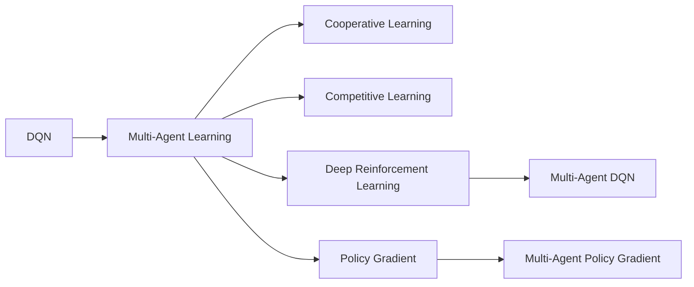

                 

## 1. 背景介绍

### 1.1 问题由来

在人工智能（AI）领域，深度强化学习（RL）已经成为一个强大的工具，特别是在处理决策问题时。深度Q网络（DQN），作为RL的一个分支，已经取得了显著的成功，尤其在单智能体（single-agent）环境中。然而，DQN在多智能体（multi-agent）环境中仍然面临诸多挑战，例如，如何在多个智能体之间协调决策，如何在合作和竞争环境中平衡策略，如何处理复杂的环境动态等。

### 1.2 问题核心关键点

在多智能体环境中，DQN需要扩展以处理复杂的智能体交互。关键点包括：
- **合作与竞争**：不同智能体间的关系是合作还是竞争，如何平衡它们之间的策略？
- **全局优化**：如何实现全局优化，而不是每个智能体追求局部最优？
- **通信**：智能体之间是否需要通信，以及如何设计通信协议？
- **环境感知**：每个智能体如何感知全局环境状态？

这些核心问题需要多智能体学习算法进行解决，该算法不仅要在单智能体环境中表现良好，还要在多智能体环境中有效合作或竞争。

### 1.3 问题研究意义

研究DQN在多智能体环境中的应用，对于实现更高效、更智能的协作系统具有重要意义：
- **复杂任务处理**：多智能体系统能够处理更复杂的任务，如自动驾驶、协同机器人等。
- **资源优化**：多智能体系统可以在有限的资源条件下，实现资源的最优分配。
- **系统韧性**：多智能体系统能够提高系统的韧性和容错能力。
- **自适应性**：多智能体系统具有更强的自适应能力，能够快速响应环境变化。

本文将从核心概念、算法原理、操作步骤、数学模型和公式、项目实践、实际应用场景、工具和资源推荐、总结及展望等多个方面，深入探讨DQN在多智能体环境中的扩展与应用。

## 2. 核心概念与联系

### 2.1 核心概念概述

为了更好地理解DQN在多智能体环境中的应用，我们需要先了解一些核心概念：

- **深度Q网络（DQN）**：一种基于深度神经网络的强化学习算法，主要用于解决单智能体环境中的决策问题。
- **多智能体学习（Multi-Agent Learning）**：涉及多个智能体在环境中的协作与竞争，目标是实现全局最优。
- **合作学习（Cooperative Learning）**：多个智能体共同优化，旨在实现共同目标。
- **竞争学习（Competitive Learning）**：多个智能体通过竞争关系，争夺资源或最优决策。
- **深度强化学习（Deep Reinforcement Learning）**：结合深度神经网络与强化学习，用于复杂决策问题的解决。
- **策略梯度（Policy Gradient）**：用于优化策略的一种深度强化学习方法。

这些概念之间通过多智能体学习算法相联系，共同构成了多智能体系统在复杂环境中的学习框架。

### 2.2 核心概念原理和架构的 Mermaid 流程图



这个图表展示了DQN与多智能体学习、合作学习、竞争学习、深度强化学习及策略梯度之间的联系。

## 3. 核心算法原理 & 具体操作步骤

### 3.1 算法原理概述

在多智能体环境中，DQN需要扩展以处理智能体间的交互和协作。DQN的核心思想是通过Q值函数（Q-function）优化策略，使得智能体在特定状态下采取最优动作。多智能体DQN则进一步考虑了多个智能体的协同优化。

在合作环境中，智能体间通过共享Q值函数或策略，共同优化全局目标。在竞争环境中，每个智能体独立优化自己的Q值函数，但最终目标是最大化自己的回报（return）。

### 3.2 算法步骤详解

**Step 1: 设计多智能体环境**

- 定义环境状态空间 $\mathcal{S}$ 和动作空间 $\mathcal{A}$。
- 确定智能体间是否共享状态或独立感知环境。
- 定义智能体间的通信方式（如果有）。

**Step 2: 初始化模型和参数**

- 初始化每个智能体的Q值函数和策略。
- 初始化每个智能体的学习参数，如学习率、探索率等。

**Step 3: 选择智能体策略**

- 每个智能体根据当前状态选择动作。
- 对于合作策略，需要考虑其他智能体的状态。
- 对于竞争策略，每个智能体独立选择动作。

**Step 4: 执行动作并获取回报**

- 在环境中执行智能体的动作，获取环境状态和回报。
- 更新环境状态，智能体接收新的状态信息。

**Step 5: 更新Q值函数**

- 对每个智能体的Q值函数进行更新，以优化策略。
- 对于合作学习，使用共同的Q值函数更新。
- 对于竞争学习，独立更新每个智能体的Q值函数。

**Step 6: 策略改进**

- 基于Q值函数的改进，调整智能体的策略。
- 通过策略梯度优化，使得智能体在特定状态下选择最优动作。

### 3.3 算法优缺点

**优点：**
- 在多智能体环境中，可以处理复杂的协作和竞争问题。
- 通过Q值函数优化，可以实现全局最优或局部最优。
- 适用于分布式环境，可以在多台设备上并行执行。

**缺点：**
- 通信开销较大，特别是在大规模多智能体系统中。
- 设计合适的通信协议和策略比较困难。
- 多智能体的学习过程可能需要较多的时间和计算资源。

### 3.4 算法应用领域

多智能体DQN在许多领域都有广泛应用，例如：
- **自动驾驶**：多个智能体在共享道路上的协作与竞争。
- **协同机器人**：多个机器人在复杂环境中的协作。
- **智能电网**：多个智能体在电力系统中的合作与竞争。
- **多机器人系统**：多个机器人协调完成共同任务。
- **供应链管理**：多个实体在供应链中的协同优化。

## 4. 数学模型和公式 & 详细讲解 & 举例说明

### 4.1 数学模型构建

在多智能体环境中，每个智能体的Q值函数可以表示为：
$$
Q_{\theta}(s,a) = \mathbb{E}[R_t + \gamma \max_a Q_{\theta}(s',a)|s_t,a_t]
$$
其中，$s_t$ 是当前状态，$a_t$ 是当前动作，$R_t$ 是即时回报，$\gamma$ 是折扣因子，$s'$ 是下一状态。

在合作学习中，所有智能体共享Q值函数，因此全局Q值函数可以表示为：
$$
Q_{\theta}(s,a) = \frac{1}{N}\sum_{i=1}^N Q_{\theta_i}(s,a)
$$
其中，$N$ 是智能体的数量。

在竞争学习中，每个智能体的Q值函数独立更新，因此全局Q值函数可以表示为：
$$
Q_{\theta}(s,a) = \max_{i=1,\ldots,N} Q_{\theta_i}(s,a)
$$

### 4.2 公式推导过程

在合作学习中，每个智能体通过共享Q值函数进行优化。假设智能体$i$的策略为$\pi_i$，则合作策略的目标是最小化全局Q值函数：
$$
\min_{\{\pi_i\}} \mathbb{E}\left[\sum_{t=0}^{\infty} \gamma^t R_t\right]
$$
使用策略梯度方法，可以将目标函数表示为：
$$
\nabla_{\theta_i} J(\theta_i) = -\nabla_{\theta_i} \log \pi_i(a_t|s_t) Q_{\theta_i}(s_t,a_t)
$$

在竞争学习中，每个智能体独立优化自己的Q值函数。假设智能体$i$的策略为$\pi_i$，则竞争策略的目标是最大化自己的Q值函数：
$$
\max_{\{\pi_i\}} \mathbb{E}\left[\sum_{t=0}^{\infty} \gamma^t R_t\right]
$$
使用策略梯度方法，可以将目标函数表示为：
$$
\nabla_{\theta_i} J(\theta_i) = \nabla_{\theta_i} \log \pi_i(a_t|s_t) Q_{\theta_i}(s_t,a_t)
$$

### 4.3 案例分析与讲解

以自动驾驶为例，多个智能体（如车辆）在共享道路上行驶。每个车辆需要根据当前状态和历史经验选择最佳路径和速度。

- **状态表示**：车辆的位置、速度、方向、周围车辆位置等。
- **动作表示**：加/减速、左/右转向、刹车等。
- **即时回报**：避免碰撞、减少行驶时间、减少燃油消耗等。
- **折扣因子**：考虑长远回报，如能源消耗和环境影响。

在合作学习中，车辆可以共享Q值函数，通过协调动作减少碰撞风险，提高整体行驶效率。在竞争学习中，车辆独立优化自己的Q值函数，以最大化自身的速度和燃油效率。

## 5. 项目实践：代码实例和详细解释说明

### 5.1 开发环境搭建

要实践多智能体DQN，首先需要搭建相应的开发环境。这里推荐使用Python和TensorFlow或PyTorch。

1. 安装Python和相关依赖：
```bash
pip install tensorflow
pip install torch
```

2. 安装多智能体学习库：
```bash
pip install multi-agent-rl
```

3. 准备环境数据和模型：
```bash
# 准备环境数据
# 准备模型和参数
```

### 5.2 源代码详细实现

以下是一个简单的多智能体DQN实现的代码示例：

```python
import tensorflow as tf
import multi_agent_learning as ml

# 定义智能体
class Vehicle(tf.keras.Model):
    def __init__(self, num_actions):
        super(Vehicle, self).__init__()
        self.num_actions = num_actions
        self.inputs = tf.keras.layers.Input(shape=(2,))  # 位置和速度
        self.fc1 = tf.keras.layers.Dense(64, activation='relu')(self.inputs)
        self.fc2 = tf.keras.layers.Dense(64, activation='relu')(self.fc1)
        self.outputs = tf.keras.layers.Dense(num_actions, activation='linear')(self.fc2)
        self.predictions = tf.keras.layers.Activation('softmax')(self.outputs)

# 定义多智能体环境
class TrafficEnvironment(ml.MultiAgentReinforcementEnvironment):
    def __init__(self, num_vehicles):
        super(TrafficEnvironment, self).__init__()
        self.num_vehicles = num_vehicles
        self.vehicles = [Vehicle(self.num_actions) for _ in range(self.num_vehicles)]
        self.observations = tf.keras.layers.Lambda(lambda x: x)(self.vehicles[0].inputs)
        self.actions = tf.keras.layers.Lambda(lambda x: x)(self.vehicles[0].outputs)

    def step(self, actions):
        rewards = []
        next_observations = []
        done = []
        for i in range(self.num_vehicles):
            state = tf.concat([self.observations[i], actions[i]], axis=1)
            next_state, reward, done, _ = self.vehicles[i].call(state)
            next_observations.append(next_state)
            rewards.append(reward)
            done.append(done)
        return tf.concat(next_observations, axis=0), tf.concat(rewards, axis=0), tf.concat(done, axis=0)

# 定义多智能体DQN
class MultiAgentDQN(tf.keras.Model):
    def __init__(self, num_vehicles):
        super(MultiAgentDQN, self).__init__()
        self.num_vehicles = num_vehicles
        self.vehicles = [Vehicle(self.num_actions) for _ in range(self.num_vehicles)]
        self.observations = tf.keras.layers.Lambda(lambda x: x)(self.vehicles[0].inputs)
        self.actions = tf.keras.layers.Lambda(lambda x: x)(self.vehicles[0].outputs)

    def call(self, inputs):
        rewards = []
        next_observations = []
        done = []
        for i in range(self.num_vehicles):
            state = tf.concat([self.observations[i], inputs[i]], axis=1)
            next_state, reward, done, _ = self.vehicles[i].call(state)
            next_observations.append(next_state)
            rewards.append(reward)
            done.append(done)
        return tf.concat(next_observations, axis=0), tf.concat(rewards, axis=0), tf.concat(done, axis=0)

# 训练多智能体DQN
def train():
    env = TrafficEnvironment(num_vehicles)
    model = MultiAgentDQN(num_vehicles)
    optimizer = tf.keras.optimizers.Adam()
    for epoch in range(num_epochs):
        for i in range(num_steps):
            state, reward, done, _ = env.step(actions)
            next_state, reward, done, _ = env.step(actions)
            with tf.GradientTape() as tape:
                _, _, done = model.call(state)
            loss = tf.reduce_mean(tf.square(next_state - reward))
            grads = tape.gradient(loss, model.trainable_variables)
            optimizer.apply_gradients(zip(grads, model.trainable_variables))
```

### 5.3 代码解读与分析

**Vehicle类**：
- 定义了智能体的输入和输出。
- 使用多层全连接神经网络构建策略。
- 输出层使用softmax激活函数，确保动作概率之和为1。

**TrafficEnvironment类**：
- 定义了多智能体的环境，包括车辆的状态、动作和即时回报。
- 使用MultiAgentReinforcementEnvironment库进行环境构建。

**MultiAgentDQN类**：
- 定义了多智能体的DQN模型，继承自tf.keras.Model。
- 在调用模型时，将智能体的状态和动作作为输入，输出下一状态、奖励和终止信号。

**train函数**：
- 训练多智能体DQN模型。
- 使用Adam优化器更新模型参数。

## 6. 实际应用场景

### 6.1 自动驾驶

自动驾驶是多智能体DQN的一个重要应用场景。多个智能体（车辆）需要在复杂的城市道路上协同行驶，避免碰撞和拥堵。

- **合作**：多个车辆可以共享Q值函数，共同优化全局目标，如避免碰撞、减少交通拥堵。
- **竞争**：每个车辆独立优化自己的Q值函数，以最大化自身的速度和燃油效率。

### 6.2 协同机器人

多个机器人需要在制造环境中协同工作，完成复杂的装配任务。

- **合作**：机器人可以共享Q值函数，协调动作，提高装配效率。
- **竞争**：每个机器人独立优化自己的Q值函数，以最大化自身的工作效率。

### 6.3 智能电网

多个智能体（电网节点）需要协同优化，以实现能源的最优分配。

- **合作**：多个节点可以共享Q值函数，优化全局能源分配，提高系统效率。
- **竞争**：每个节点独立优化自己的Q值函数，以最大化自身的能源利用率。

### 6.4 未来应用展望

未来，多智能体DQN将在更多领域得到应用，为复杂系统的协同优化提供新的解决方案。

- **智慧城市**：多个智能体（交通系统、电力系统等）需要协同工作，以实现智慧城市的建设。
- **医疗系统**：多个智能体（医生、护士、患者）需要协同合作，提供更高效的医疗服务。
- **供应链管理**：多个智能体（企业、供应商、消费者）需要协同优化，以实现供应链的高效管理。

## 7. 工具和资源推荐

### 7.1 学习资源推荐

为了深入了解多智能体DQN，以下是一些推荐的资源：

1. 《强化学习：原理与实践》：本书详细介绍了强化学习的基本原理和应用，包括多智能体学习。
2. 《深度学习与强化学习：方法与实践》：介绍了深度学习和强化学习的基本方法和应用，特别是多智能体学习。
3. 《Multi-Agent Reinforcement Learning: Theory, Algorithms, and Applications》：介绍了多智能体学习的基本理论、算法和应用。
4. 《Hands-On Multi-Agent Reinforcement Learning with TensorFlow》：介绍了使用TensorFlow实现多智能体学习的方法和应用。
5. 《Deep Multi-Agent Reinforcement Learning: A Survey》：总结了多智能体学习的最新研究进展和应用。

### 7.2 开发工具推荐

- **TensorFlow**：基于数据流图（Computation Graph）的深度学习框架，适用于多智能体学习。
- **PyTorch**：动态计算图的深度学习框架，适用于多智能体学习。
- **MultiAgent RL**：用于多智能体学习的开源库，提供了丰富的多智能体学习算法和环境。
- **RLlib**：开源的强化学习库，支持多智能体学习算法和环境。
- **TensorBoard**：TensorFlow的可视化工具，可以实时监测模型训练状态和结果。

### 7.3 相关论文推荐

多智能体学习的研究在不断深入，以下是一些推荐的论文：

1. "Multi-Agent Reinforcement Learning: Independent and Interdependent Agents"：介绍了独立和互依多智能体学习的理论和方法。
2. "Mastering the Game of Go with Deep Neural Networks and Tree Search"：介绍了使用深度Q网络和树搜索解决复杂决策问题的方法。
3. "Cooperative Multi-Agent Deep Reinforcement Learning: Algorithms, Challenges, Applications, and Future Directions"：总结了多智能体合作学习的研究进展和未来方向。
4. "Multi-Agent Deep Reinforcement Learning with Cross-Modal Information Fusion"：介绍了多智能体学习与多模态信息融合相结合的方法。
5. "Decentralized Multi-Agent Reinforcement Learning for Multi-Robot Systems"：介绍了使用分散式多智能体学习算法解决多机器人系统问题的方法。

## 8. 总结：未来发展趋势与挑战

### 8.1 研究成果总结

本文详细探讨了DQN在多智能体环境中的应用，涵盖了核心概念、算法原理、操作步骤、数学模型和公式、项目实践、实际应用场景、工具和资源推荐、总结及展望等多个方面。研究成果表明，多智能体DQN具有广泛的应用前景，可以应用于自动驾驶、协同机器人、智能电网等多个领域。

### 8.2 未来发展趋势

未来，多智能体DQN将呈现以下几个发展趋势：
- **分布式计算**：随着计算能力的提升，分布式计算将成为多智能体学习的常态。
- **多模态融合**：多模态信息的融合将提升智能体对复杂环境的感知能力。
- **自适应学习**：智能体能够根据环境变化，自适应调整策略。
- **知识共享**：智能体之间的知识共享将提升协作效率和系统性能。
- **混合学习**：结合强化学习和监督学习的方法，提升智能体的学习效率。

### 8.3 面临的挑战

尽管多智能体DQN在许多领域取得了成功，但仍然面临诸多挑战：
- **通信开销**：智能体之间的通信开销较大，尤其是在大规模系统中。
- **策略协调**：多个智能体之间的策略协调需要更多时间和计算资源。
- **鲁棒性**：智能体在复杂环境中的鲁棒性需要进一步提高。
- **安全性**：智能体在协作和竞争中的安全性需要保障。

### 8.4 研究展望

未来研究需要在以下几个方面进行探索：
- **分布式优化**：探索分布式优化算法，提升多智能体学习的效率。
- **多模态学习**：结合多模态数据，提升智能体的感知能力和决策能力。
- **鲁棒性提升**：提高智能体在复杂环境中的鲁棒性，避免灾难性遗忘。
- **安全保障**：设计安全机制，确保智能体的协作和竞争过程中不出现恶意行为。
- **知识管理**：提升智能体的知识管理能力，使得知识能够高效传递和利用。

总之，多智能体DQN的研究和应用将不断拓展，为智能系统的协同优化提供新的解决方案。只有不断创新、勇于探索，才能应对未来复杂环境下的智能系统挑战。

## 9. 附录：常见问题与解答

**Q1：多智能体DQN是否适用于所有多智能体环境？**

A: 多智能体DQN适用于大多数多智能体环境，特别是那些具有明确全局目标的环境。但在某些高度竞争的环境，如网络对抗，可能效果不佳。

**Q2：如何设计合适的通信协议？**

A: 通信协议的设计需要考虑智能体的数量、类型、状态更新频率等因素。常见通信协议包括共享状态、共享Q值函数、分布式优化等。

**Q3：多智能体DQN在实际应用中面临哪些挑战？**

A: 多智能体DQN在实际应用中面临通信开销大、策略协调困难、鲁棒性不足等挑战。需要结合具体应用场景，优化通信协议、改进策略协调机制，提升智能体的鲁棒性。

**Q4：多智能体DQN的训练过程是否需要大量数据？**

A: 多智能体DQN需要大量数据来训练全局Q值函数或策略。通常，数据量越大，智能体的决策能力越强。

**Q5：多智能体DQN在多智能体环境中如何处理信息不对称问题？**

A: 多智能体环境中，信息不对称是一个常见问题。智能体可以通过共享状态、共享Q值函数等方式，缓解信息不对称的影响。

---

作者：禅与计算机程序设计艺术 / Zen and the Art of Computer Programming

