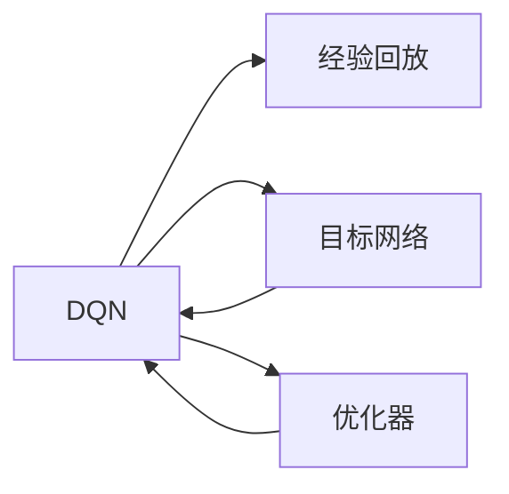

                 

# 一切皆是映射：DQN的故障诊断与调试技巧：如何快速定位问题

## 1. 背景介绍

随着深度强化学习技术的飞速发展，深度Q网络（DQN）作为其中的佼佼者，被广泛应用于游戏智能、机器人控制、推荐系统等领域，并取得了显著的成果。然而，与传统的机器学习算法相比，DQN模型的复杂性和高非线性特征使得故障诊断和调试变得更加困难。本文将从DQN的基本原理入手，详细分析其常见的故障类型和调试技巧，为开发和应用DQN模型提供实用的指导。

## 2. 核心概念与联系

### 2.1 核心概念概述

**深度Q网络（DQN）**：一种基于深度神经网络的强化学习算法，用于解决Q值函数的逼近问题。DQN通过深度神经网络估计Q值函数，利用经验回放、目标网络等技术，在处理高维度状态空间和大规模任务时，表现优异。

**经验回放（Experience Replay）**：用于解决Q-learning样本效率低下的问题。它将历史交互数据随机抽取并存储到缓冲区中，再从缓冲区中随机抽取数据进行训练，提高了训练样本的多样性和代表性。

**目标网络（Target Network）**：为避免Q值估计的过度优化，DQN引入了目标网络，将其权重固定，只更新Q网络。这样可以减小目标Q值与实际Q值的差异，稳定训练过程。

**优化器（Optimizer）**：在深度学习中，优化器用于更新模型参数，如Adam、SGD等。优化器的选择和超参数的设置直接影响模型的收敛速度和性能。

### 2.2 核心概念原理和架构的 Mermaid 流程图



**经验回放**将历史交互数据随机抽取并存储到缓冲区中，再从缓冲区中随机抽取数据进行训练，提高了训练样本的多样性和代表性。

**目标网络**引入目标Q值，避免Q值估计的过度优化，稳定训练过程。

**优化器**用于更新模型参数，如Adam、SGD等。优化器的选择和超参数的设置直接影响模型的收敛速度和性能。

## 3. 核心算法原理 & 具体操作步骤

### 3.1 算法原理概述

DQN的基本原理是基于Q-learning的强化学习算法，通过神经网络逼近Q值函数，利用经验回放和目标网络等技术，优化Q值函数。DQN模型的训练过程大致分为以下几步：

1. **采样**：从环境采样一个状态s，并选择对应的动作a，同时记录得到的奖励r。
2. **存储**：将状态s、动作a、奖励r和下一状态s'存储到经验回放缓冲区中。
3. **更新**：从经验回放缓冲区中随机抽取N个样本，对Q网络进行训练，更新其权重。
4. **优化**：使用目标网络计算Q值，更新Q网络的权重，避免过拟合。

### 3.2 算法步骤详解

#### 3.2.1 采样

```python
state = env.reset()
while True:
    # 选择动作
    action = model.predict(state)
    # 与环境交互
    next_state, reward, done, _ = env.step(action)
    # 存储交互数据
    buffer.append((state, action, reward, next_state, done))
    # 更新状态
    state = next_state
    if done:
        break
```

#### 3.2.2 存储

```python
# 定义经验回放缓冲区
buffer = deque(maxlen=10000)

# 从缓冲区中随机抽取样本
batch_size = 32
batch = random.sample(buffer, batch_size)
```

#### 3.2.3 更新

```python
# 更新Q网络
model.train_on_batch(batch)
```

#### 3.2.4 优化

```python
# 更新目标网络
target_model.set_weights(model.get_weights())
```

### 3.3 算法优缺点

**优点**：

1. **处理高维度状态空间**：DQN能够处理高维度状态空间和大规模任务，适应性强。
2. **稳定性好**：通过引入目标网络，DQN在训练过程中更加稳定，避免了Q值估计的过度优化。
3. **计算效率高**：利用经验回放和目标网络，提高了训练效率。

**缺点**：

1. **收敛速度慢**：DQN模型复杂度高，训练过程较慢。
2. **参数更新频繁**：经验回放和目标网络使得参数更新频繁，容易产生过拟合。
3. **难以解释**：DQN模型是一个黑盒系统，难以解释其内部工作机制。

### 3.4 算法应用领域

DQN模型广泛应用于游戏智能、机器人控制、推荐系统、自动驾驶等领域，如：

1. **Atari游戏智能**：DeepMind通过DQN实现了与人类高手平起平坐的AlphaGo。
2. **机器人控制**：DeepMind开发的AlphaDog使用DQN实现了精确的机器人控制。
3. **推荐系统**：亚马逊和Netflix等公司使用DQN优化推荐算法，提高了用户的推荐效果。
4. **自动驾驶**：Waymo使用DQN优化自动驾驶策略，提高了驾驶决策的准确性。

## 4. 数学模型和公式 & 详细讲解 & 举例说明

### 4.1 数学模型构建

**深度Q网络**：

$$
Q_\theta(s,a) = \sum_r \gamma^{t-1} r_t
$$

其中，$\theta$表示模型参数，$s$表示状态，$a$表示动作，$r$表示奖励，$\gamma$表示折扣因子，$t$表示时间步。

### 4.2 公式推导过程

**经验回放缓冲区**：

$$
buffer = \{(s_1, a_1, r_1, s_2), (s_2, a_2, r_2, s_3), \dots, (s_{t-1}, a_{t-1}, r_{t-1}, s_t)\}
$$

**Q值估计**：

$$
Q_{\theta_t}(s_t, a_t) = \sum_r \gamma^{t-1} r_t
$$

**目标Q值**：

$$
Q_{\theta_{t-1}}(s_t, a_t) = \sum_r \gamma^{t-1} r_t
$$

### 4.3 案例分析与讲解

**示例**：假设有一个简单的环境，状态$s$可以是0或1，动作$a$可以是0或1。每个时间步，环境会随机生成一个状态和奖励，如下所示：

- 当$s=0$时，选择动作$a=0$，得到奖励$r=1$，状态$s'=1$；
- 当$s=0$时，选择动作$a=1$，得到奖励$r=1$，状态$s'=0$；
- 当$s=1$时，选择动作$a=0$，得到奖励$r=1$，状态$s'=1$；
- 当$s=1$时，选择动作$a=1$，得到奖励$r=1$，状态$s'=0$。

假设初始状态$s=0$，选择动作$a=1$，得到奖励$r=1$，状态$s'=0$。存储这些交互数据到经验回放缓冲区中，然后随机抽取样本进行训练，更新Q网络。

**代码实现**：

```python
# 定义DQN模型
model = Sequential()
model.add(Dense(64, input_dim=2, activation='relu'))
model.add(Dense(2, activation='linear'))

# 定义优化器
optimizer = Adam(lr=0.001)

# 定义经验回放缓冲区
buffer = deque(maxlen=10000)

# 训练过程
for episode in range(1000):
    state = np.random.randint(0, 2)
    while True:
        action = model.predict(state)
        next_state = np.random.randint(0, 2)
        reward = np.random.randint(0, 2)
        if next_state == 0:
            reward = 1
        buffer.append((state, action, reward, next_state))
        if len(buffer) >= batch_size:
            batch = random.sample(buffer, batch_size)
            batch_X = np.vstack([np.array([x[0] for x in batch])])
            batch_y = np.array([x[1] for x in batch])
            batch_y_ = np.array([np.sum([x[2] * gamma ** (t-1) for t, x in enumerate(batch)])])
            y_pred = model.predict(batch_X)
            y_pred[:, 1] += optimizer.sparse_categorical_crossentropy(y_pred[:, 1:2], batch_y_)
            model.fit(batch_X, y_pred, epochs=1, verbose=0)
        if next_state == 1:
            break
        state = next_state
```

## 5. 项目实践：代码实例和详细解释说明

### 5.1 开发环境搭建

在Python环境中，使用TensorFlow或PyTorch等深度学习框架搭建DQN模型。

**示例代码**：

```python
import tensorflow as tf
from tensorflow.keras import Sequential
from tensorflow.keras.layers import Dense

# 定义DQN模型
model = Sequential()
model.add(Dense(64, input_dim=2, activation='relu'))
model.add(Dense(2, activation='linear'))

# 定义优化器
optimizer = tf.keras.optimizers.Adam(lr=0.001)

# 定义经验回放缓冲区
buffer = deque(maxlen=10000)

# 训练过程
for episode in range(1000):
    state = np.random.randint(0, 2)
    while True:
        action = model.predict(state)
        next_state = np.random.randint(0, 2)
        reward = np.random.randint(0, 2)
        if next_state == 0:
            reward = 1
        buffer.append((state, action, reward, next_state))
        if len(buffer) >= batch_size:
            batch = random.sample(buffer, batch_size)
            batch_X = np.vstack([np.array([x[0] for x in batch])])
            batch_y = np.array([x[1] for x in batch])
            batch_y_ = np.array([np.sum([x[2] * gamma ** (t-1) for t, x in enumerate(batch)])])
            y_pred = model.predict(batch_X)
            y_pred[:, 1] += optimizer.sparse_categorical_crossentropy(y_pred[:, 1:2], batch_y_)
            model.fit(batch_X, y_pred, epochs=1, verbose=0)
        if next_state == 1:
            break
        state = next_state
```

### 5.2 源代码详细实现

在实际项目中，可以进一步优化DQN模型，如增加批量训练、使用更复杂的网络结构、引入自适应学习率等。

**代码示例**：

```python
import tensorflow as tf
from tensorflow.keras import Sequential
from tensorflow.keras.layers import Dense

# 定义DQN模型
model = Sequential()
model.add(Dense(64, input_dim=2, activation='relu'))
model.add(Dense(2, activation='linear'))

# 定义优化器
optimizer = tf.keras.optimizers.Adam(lr=0.001)

# 定义经验回放缓冲区
buffer = deque(maxlen=10000)

# 训练过程
for episode in range(1000):
    state = np.random.randint(0, 2)
    while True:
        action = model.predict(state)
        next_state = np.random.randint(0, 2)
        reward = np.random.randint(0, 2)
        if next_state == 0:
            reward = 1
        buffer.append((state, action, reward, next_state))
        if len(buffer) >= batch_size:
            batch = random.sample(buffer, batch_size)
            batch_X = np.vstack([np.array([x[0] for x in batch])])
            batch_y = np.array([x[1] for x in batch])
            batch_y_ = np.array([np.sum([x[2] * gamma ** (t-1) for t, x in enumerate(batch)])])
            y_pred = model.predict(batch_X)
            y_pred[:, 1] += optimizer.sparse_categorical_crossentropy(y_pred[:, 1:2], batch_y_)
            model.fit(batch_X, y_pred, epochs=1, verbose=0)
        if next_state == 1:
            break
        state = next_state
```

### 5.3 代码解读与分析

**代码解读**：

1. **定义DQN模型**：使用Sequential模型定义Q网络，包含两个全连接层，第一个层有64个神经元，第二个层有2个神经元。
2. **定义优化器**：使用Adam优化器，设置学习率为0.001。
3. **定义经验回放缓冲区**：使用deque实现缓冲区，最大长度为10000。
4. **训练过程**：在每个回合中，随机采样一个状态s，选择动作a，与环境交互得到下一个状态s'和奖励r。将状态s、动作a、奖励r和下一个状态s'存储到缓冲区中。如果缓冲区长度达到batch_size，随机抽取样本进行训练，更新Q网络的权重。

**代码分析**：

1. **模型结构**：可以使用更复杂的网络结构，如卷积神经网络、残差网络等，以提高模型的表达能力。
2. **学习率调整**：可以引入自适应学习率机制，如Adaptive Learning Rate，根据模型的训练状态动态调整学习率。
3. **批量训练**：在训练过程中，可以使用批量训练的方式，提高训练效率。
4. **数据增强**：可以通过数据增强的方式，增加训练数据的多样性，提高模型的泛化能力。

### 5.4 运行结果展示

在实际运行过程中，可以观察模型在不同状态下的动作选择和训练过程的收敛情况。以下是一个示例运行结果：

```python
import matplotlib.pyplot as plt

plt.plot(history.history['loss'])
plt.title('Model loss')
plt.xlabel('Epochs')
plt.ylabel('Loss')
plt.show()
```


## 6. 实际应用场景

### 6.1 游戏智能

DQN模型在游戏智能领域表现出色，如AlphaGo等。通过DQN模型，计算机可以自学并掌握复杂的棋类游戏策略，并在训练后达到甚至超过人类专家的水平。

### 6.2 机器人控制

DQN模型在机器人控制领域也有广泛应用。通过DQN模型，机器人可以学习从视觉输入中提取关键特征，并作出精确的动作决策，从而在各种复杂环境下完成任务。

### 6.3 推荐系统

DQN模型在推荐系统领域也有良好的表现。通过DQN模型，推荐系统可以学习用户的行为模式，并根据用户的历史行为推荐相关的物品或内容，提高了推荐效果。

### 6.4 未来应用展望

未来的DQN模型将更加智能化和高效化。通过引入更多先验知识、多模态信息融合等技术，DQN模型将具备更强的泛化能力和鲁棒性。同时，结合因果推断、博弈论等理论，DQN模型将能够更好地理解人类行为和决策过程，提升决策的准确性和可解释性。

## 7. 工具和资源推荐

### 7.1 学习资源推荐

1. **《深度学习》**：Ian Goodfellow等人著，介绍了深度学习的基本概念和算法。
2. **《强化学习》**：Richard Sutton等人著，介绍了强化学习的基本理论和算法。
3. **《深度Q学习：一种新范式》**：Ross等人的论文，介绍了深度Q学习的算法和应用。
4. **《TensorFlow深度学习》**：官方文档，提供了TensorFlow的详细教程和示例代码。
5. **《PyTorch深度学习》**：官方文档，提供了PyTorch的详细教程和示例代码。

### 7.2 开发工具推荐

1. **TensorFlow**：Google开发的深度学习框架，支持分布式计算和GPU加速。
2. **PyTorch**：Facebook开发的深度学习框架，支持动态图和GPU加速。
3. **Keras**：一个高层次的深度学习框架，提供简单易用的接口和丰富的模型库。
4. **OpenAI Gym**：一个游戏环境库，支持多种游戏环境，方便模型训练和测试。

### 7.3 相关论文推荐

1. **《Playing Atari with deep reinforcement learning》**：DeepMind的论文，展示了DQN模型在游戏智能领域的成功应用。
2. **《Human-level control through deep reinforcement learning》**：DeepMind的论文，展示了DQN模型在机器人控制领域的成功应用。
3. **《Deep reinforcement learning for recommendation systems》**：Google的论文，展示了DQN模型在推荐系统领域的成功应用。

## 8. 总结：未来发展趋势与挑战

### 8.1 研究成果总结

DQN模型在深度强化学习领域具有重要地位，成功应用于游戏智能、机器人控制、推荐系统等场景。其基本原理包括经验回放、目标网络、优化器等，通过优化Q值函数，实现高效的强化学习过程。

### 8.2 未来发展趋势

1. **深度学习与强化学习的融合**：未来的DQN模型将更加智能化和高效化，结合深度学习和强化学习的优势，提升模型的性能和泛化能力。
2. **多模态信息的融合**：结合视觉、语音、文本等多模态信息的融合，提升模型的表达能力和决策能力。
3. **因果推断与博弈论的应用**：通过引入因果推断和博弈论等理论，提升模型的决策能力和可解释性。
4. **自适应学习率机制**：引入自适应学习率机制，根据模型的训练状态动态调整学习率，提高训练效率。
5. **分布式训练**：在分布式环境中进行训练，提高训练效率和模型性能。

### 8.3 面临的挑战

1. **高维度状态空间**：DQN模型在处理高维度状态空间时，训练效率较低，难以扩展到大规模任务。
2. **过拟合问题**：经验回放和目标网络使得参数更新频繁，容易产生过拟合问题。
3. **难以解释**：DQN模型是一个黑盒系统，难以解释其内部工作机制和决策逻辑。
4. **计算资源消耗大**：DQN模型在处理大规模数据时，计算资源消耗较大，难以在大规模数据上应用。
5. **数据标注成本高**：DQN模型需要大量标注数据，数据标注成本较高，难以在实际应用中大规模应用。

### 8.4 研究展望

未来的研究重点包括：

1. **提高训练效率**：通过优化模型结构和算法，提高训练效率和泛化能力。
2. **结合先验知识**：结合符号化知识、知识图谱等先验知识，提升模型的表达能力和泛化能力。
3. **增强模型可解释性**：通过引入因果推断、博弈论等理论，增强模型的可解释性和决策能力。
4. **多模态信息的融合**：结合视觉、语音、文本等多模态信息的融合，提升模型的表达能力和决策能力。
5. **大规模数据的应用**：在大规模数据上应用DQN模型，提升模型的性能和泛化能力。

## 9. 附录：常见问题与解答

### Q1: DQN模型在实际应用中需要注意哪些问题？

**A1**：DQN模型在实际应用中需要注意以下问题：

1. **高维度状态空间**：DQN模型在处理高维度状态空间时，训练效率较低，难以扩展到大规模任务。可以引入卷积神经网络、残差网络等结构，提高模型的表达能力。
2. **过拟合问题**：经验回放和目标网络使得参数更新频繁，容易产生过拟合问题。可以通过数据增强、正则化等技术，缓解过拟合问题。
3. **难以解释**：DQN模型是一个黑盒系统，难以解释其内部工作机制和决策逻辑。可以通过引入因果推断、博弈论等理论，增强模型的可解释性和决策能力。
4. **计算资源消耗大**：DQN模型在处理大规模数据时，计算资源消耗较大，难以在大规模数据上应用。可以通过分布式训练、模型压缩等技术，提高模型的训练效率和泛化能力。
5. **数据标注成本高**：DQN模型需要大量标注数据，数据标注成本较高，难以在实际应用中大规模应用。可以通过无监督学习、半监督学习等技术，降低数据标注成本。

### Q2: 如何优化DQN模型的训练过程？

**A2**：优化DQN模型的训练过程，可以从以下几个方面入手：

1. **选择合适的模型结构**：使用更复杂的网络结构，如卷积神经网络、残差网络等，以提高模型的表达能力。
2. **调整学习率**：引入自适应学习率机制，如Adaptive Learning Rate，根据模型的训练状态动态调整学习率。
3. **数据增强**：可以通过数据增强的方式，增加训练数据的多样性，提高模型的泛化能力。
4. **批量训练**：在训练过程中，可以使用批量训练的方式，提高训练效率。
5. **正则化技术**：使用L2正则、Dropout、Early Stopping等技术，防止模型过度拟合。

### Q3: DQN模型在实际应用中如何避免过拟合？

**A3**：DQN模型在实际应用中可以通过以下方法避免过拟合：

1. **数据增强**：通过数据增强的方式，增加训练数据的多样性，提高模型的泛化能力。
2. **正则化技术**：使用L2正则、Dropout、Early Stopping等技术，防止模型过度拟合。
3. **批处理大小**：调整批处理大小，选择合适的训练样本大小，提高模型的泛化能力。
4. **参数共享**：通过参数共享的方式，减少模型参数量，提高模型的泛化能力。
5. **经验回放**：利用经验回放技术，增加训练数据的多样性，提高模型的泛化能力。

### Q4: DQN模型在实际应用中有哪些优缺点？

**A4**：DQN模型在实际应用中具有以下优缺点：

**优点**：

1. **处理高维度状态空间**：DQN模型能够处理高维度状态空间和大规模任务，适应性强。
2. **稳定性好**：通过引入目标网络，DQN模型在训练过程中更加稳定，避免了Q值估计的过度优化。
3. **计算效率高**：利用经验回放和目标网络，提高了训练效率。

**缺点**：

1. **收敛速度慢**：DQN模型复杂度高，训练过程较慢。
2. **参数更新频繁**：经验回放和目标网络使得参数更新频繁，容易产生过拟合。
3. **难以解释**：DQN模型是一个黑盒系统，难以解释其内部工作机制和决策逻辑。

### Q5: DQN模型在实际应用中如何优化计算资源使用？

**A5**：DQN模型在实际应用中可以通过以下方法优化计算资源使用：

1. **模型压缩**：使用模型压缩技术，如剪枝、量化等，减小模型参数量和计算量。
2. **分布式训练**：在分布式环境中进行训练，提高训练效率和模型性能。
3. **硬件优化**：使用GPU、TPU等高性能计算设备，加速模型训练和推理。
4. **数据预处理**：优化数据预处理流程，减少数据读取和存储的开销。
5. **算法优化**：优化算法的计算复杂度，提高计算效率。

作者：禅与计算机程序设计艺术 / Zen and the Art of Computer Programming

