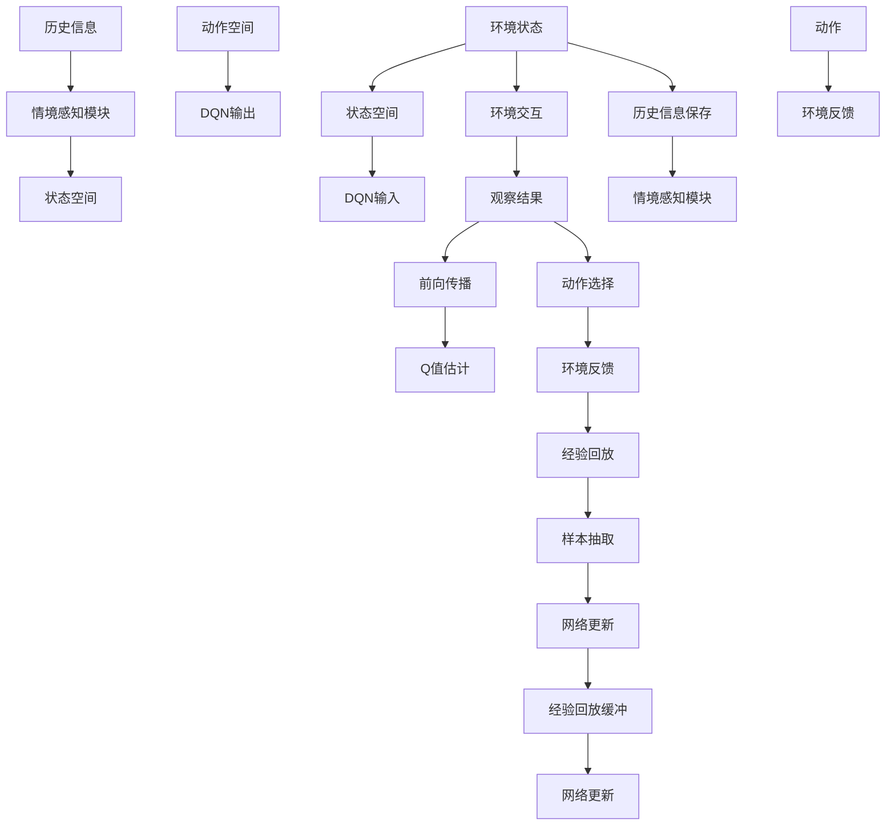

                 

# 一切皆是映射：情境感知与DQN：环境交互的重要性

## 1. 背景介绍

在人工智能的飞速发展中，强化学习（Reinforcement Learning, RL）以其独特的优势，成为了解决复杂决策问题的有力工具。RL的核心在于代理（agent）如何在动态环境中通过与环境的交互，学习出最优的行为策略。这一过程中，DQN（Deep Q-Network）作为深度学习与强化学习的结合，通过网络结构来近似Q值函数，提升了RL模型的泛化能力和学习效率，使其在许多任务上取得了令人瞩目的表现。

然而，DQN的成功离不开对环境的深刻理解和有效建模。在DQN中，环境的状态空间（State Space）和动作空间（Action Space）被视为代理的输入输出，代理通过这些映射关系学习出最优策略。但随着问题复杂度的提升，传统的固定映射方式往往无法捕获到状态和动作之间的复杂动态关系，导致模型的学习效果和泛化能力受限。因此，本文将探讨如何通过情境感知（Context-Awareness）来增强DQN的环境建模能力，从而提升其在动态环境中的决策能力。

## 2. 核心概念与联系

### 2.1 核心概念概述

为更好地理解情境感知与DQN，首先需要解释几个核心概念：

- **DQN（Deep Q-Network）**：一种通过深度神经网络来近似Q值函数的强化学习算法，能够通过大量经验数据学习最优的策略，适用于复杂决策问题。

- **状态空间（State Space）**：描述环境当前状态的特征向量，是DQN输入的重要组成部分。

- **动作空间（Action Space）**：代理可选执行的动作集，是DQN输出的重要组成部分。

- **情境感知（Context-Awareness）**：指在DQN中考虑环境的历史信息，如时间、位置、事件等，提升对动态环境的学习能力。

这些概念之间存在密切联系，通过情境感知技术，DQN可以更全面地捕捉环境特征，从而提升学习效果和泛化能力。

### 2.2 核心概念原理和架构的 Mermaid 流程图



此流程图展示了DQN与情境感知的互动过程：

- 代理通过与环境的交互，观察当前状态，并结合历史信息进行情境感知。
- 情境感知模块将环境状态和时间等历史信息结合起来，生成更新后的状态空间。
- 代理根据当前状态和动作空间，选择动作并执行，同时接收环境反馈。
- 执行动作后，观察结果回传至DQN，用于更新Q值函数。
- 通过经验回放缓冲，抽取样本进行网络更新，不断优化Q值函数。

## 3. 核心算法原理 & 具体操作步骤

### 3.1 算法原理概述

情境感知与DQN结合的核心在于将环境的历史信息（如时间、位置、事件等）与当前状态结合起来，生成一个更全面的状态表示，从而提升DQN的学习能力和泛化能力。这通常通过在DQN的前向传播和后向传播过程中，引入额外的时间、位置等信息来实现。

具体来说，情境感知与DQN的结合可以采用以下几种策略：

- **时间感知**：在状态空间中增加时间戳或历史时间步的信息，帮助DQN理解时间的流逝和事件的发生。
- **空间感知**：在状态空间中增加位置、方向等空间信息，帮助DQN理解空间变化和环境布局。
- **事件感知**：在状态空间中增加事件发生的信息，帮助DQN理解突发事件的性质和影响。

通过这些方式，DQN能够更全面地捕捉环境特征，从而提升学习效果和泛化能力。

### 3.2 算法步骤详解

情境感知与DQN的结合主要包括以下几个步骤：

**Step 1: 数据预处理与环境建模**
- 收集环境的历史数据，包括时间、位置、事件等信息。
- 设计状态空间和时间序列的编码方式，将历史信息与当前状态结合，生成更全面的状态表示。

**Step 2: 构建情境感知模型**
- 设计情境感知模块，将历史信息和当前状态结合，生成新的状态表示。
- 在DQN的前向传播中，引入情境感知模块，更新状态表示。

**Step 3: 训练与优化**
- 将情境感知模块与DQN结合，进行模型训练和优化。
- 使用经验回放缓冲，抽取样本进行网络更新。
- 定期评估模型性能，进行参数调整和优化。

**Step 4: 应用与部署**
- 在实际应用中，使用训练好的DQN模型进行决策。
- 根据环境变化，实时调整情境感知模块，提升模型适应性。

### 3.3 算法优缺点

情境感知与DQN结合的算法有以下优点：

- **提升学习效果**：通过考虑环境的历史信息，DQN能够更全面地理解环境特征，提升学习效果和泛化能力。
- **增强泛化能力**：情境感知能够帮助DQN更好地适应动态环境，提高模型的泛化能力。
- **增强决策能力**：通过情境感知，DQN能够更好地理解时间、空间和事件等因素，提升决策能力。

同时，该算法也存在一些局限性：

- **复杂度增加**：在状态空间中引入额外信息，增加了模型的复杂度，可能需要更多的计算资源。
- **参数调整复杂**：情境感知模块的设计和参数调整需要根据具体问题进行调整，可能需要更多的实验和调参工作。
- **数据需求高**：情境感知需要收集大量环境数据，可能存在数据采集和处理成本较高的挑战。

尽管存在这些局限性，情境感知与DQN的结合在处理动态环境和高复杂度问题上具有显著优势，值得深入研究与应用。

### 3.4 算法应用领域

情境感知与DQN结合的算法已经在许多实际应用中得到了广泛应用，例如：

- **自动驾驶**：在自动驾驶中，DQN可以结合时间、位置和环境事件等信息，学习最优的驾驶策略。
- **机器人控制**：在机器人控制任务中，DQN可以结合时间、空间和事件等信息，学习最优的控制策略。
- **智能推荐**：在智能推荐系统中，DQN可以结合用户历史行为和时间等信息，学习最优的推荐策略。
- **金融交易**：在金融交易中，DQN可以结合历史价格和事件等信息，学习最优的交易策略。

除了这些经典应用外，情境感知与DQN结合的方法还在游戏、物流、社交网络等多个领域得到应用，为解决复杂决策问题提供了新的思路。

## 4. 数学模型和公式 & 详细讲解  
### 4.1 数学模型构建

本节将使用数学语言对情境感知与DQN结合的数学模型进行更加严格的刻画。

设环境状态为 $s_t$，历史信息为 $c_t$，当前状态为 $s_t^*$，状态空间为 $\mathcal{S}$，动作空间为 $\mathcal{A}$，DQN的Q值函数为 $Q_\theta(s_t,a_t)$，优化目标为最大化Q值函数：

$$
\max_{\theta} \mathbb{E}_{s \sim \mathcal{S}, a \sim \mathcal{A}} [Q_\theta(s,a)]
$$

情境感知与DQN结合的数学模型为：

$$
Q_\theta^c(s_t,a_t) = Q_\theta(s_t^*,a_t) + \alpha c_t^c
$$

其中 $c_t^c$ 表示历史信息 $c_t$ 在情境感知模块的编码结果，$\alpha$ 为情境感知的权重参数。

### 4.2 公式推导过程

情境感知与DQN结合的公式推导如下：

在DQN中，Q值函数的更新公式为：

$$
Q_\theta(s,a) \leftarrow Q_\theta(s,a) + \eta \left( r + \gamma \max_a Q_\theta(s',a') - Q_\theta(s,a) \right)
$$

将情境感知模块引入后，更新公式变为：

$$
Q_\theta^c(s_t,a_t) \leftarrow Q_\theta^c(s_t,a_t) + \eta \left( r + \gamma \max_a Q_\theta^c(s',a') - Q_\theta^c(s_t,a_t) \right)
$$

其中 $s'$ 和 $a'$ 为下一个状态和动作，$\gamma$ 为折扣因子。

情境感知模块的编码公式为：

$$
c_t^c = f_{\phi}(c_t)
$$

其中 $f_{\phi}$ 为情境感知模块的编码函数，$\phi$ 为该模块的参数。

### 4.3 案例分析与讲解

以自动驾驶为例，情境感知与DQN结合可以描述如下：

设环境状态 $s_t = (x_t, y_t, v_t, t)$，其中 $(x_t, y_t)$ 为当前位置，$v_t$ 为当前速度，$t$ 为时间戳。历史信息 $c_t = (x_{t-1}, y_{t-1}, v_{t-1}, t-1)$，其中 $(x_{t-1}, y_{t-1})$ 为上一时刻位置，$v_{t-1}$ 为上一时刻速度，$t-1$ 为上一次时间戳。

设计情境感知模块 $f_{\phi}$ 如下：

$$
c_t^c = (x_t - x_{t-1}, y_t - y_{t-1}, v_t - v_{t-1}, t-t_0)
$$

其中 $t_0$ 为环境初始时间。

将情境感知模块与DQN结合后，Q值函数的更新公式变为：

$$
Q_\theta^c(s_t,a_t) \leftarrow Q_\theta^c(s_t,a_t) + \eta \left( r + \gamma \max_a Q_\theta^c(s',a') - Q_\theta^c(s_t,a_t) \right)
$$

其中 $s'$ 和 $a'$ 为下一个状态和动作，$\gamma$ 为折扣因子。

## 5. 项目实践：代码实例和详细解释说明
### 5.1 开发环境搭建

在进行情境感知与DQN结合的项目实践前，我们需要准备好开发环境。以下是使用Python进行TensorFlow开发的环境配置流程：

1. 安装Anaconda：从官网下载并安装Anaconda，用于创建独立的Python环境。

2. 创建并激活虚拟环境：
```bash
conda create -n tf-env python=3.8 
conda activate tf-env
```

3. 安装TensorFlow：从官网获取对应的安装命令，例如：
```bash
pip install tensorflow==2.7.0
```

4. 安装相关库：
```bash
pip install gym scikit-learn pandas numpy matplotlib
```

5. 安装TensorBoard：
```bash
pip install tensorboard
```

6. 安装 Gym 环境：
```bash
pip install gym
```

完成上述步骤后，即可在`tf-env`环境中开始情境感知与DQN结合的实验。

### 5.2 源代码详细实现

下面我们以自动驾驶任务为例，给出使用TensorFlow实现情境感知与DQN结合的代码实现。

首先，定义环境状态和动作空间：

```python
import gym
import numpy as np

env = gym.make('DMP-v0')
state_dim = env.observation_space.shape[0]
action_dim = env.action_space.shape[0]
```

然后，设计情境感知模块：

```python
def context_aware(state, context):
    context = context.numpy()
    return np.append(state, context)
```

接下来，定义DQN模型：

```python
import tensorflow as tf
from tensorflow.keras.models import Sequential
from tensorflow.keras.layers import Dense

model = Sequential([
    Dense(64, input_dim=state_dim + 2, activation='relu'),
    Dense(32, activation='relu'),
    Dense(1, activation='linear')
])

model.compile(optimizer=tf.keras.optimizers.Adam(learning_rate=0.001), loss='mse')
```

最后，实现情境感知与DQN结合的训练和评估过程：

```python
def train_dqn(env, model, context_aware, iterations=10000):
    for i in range(iterations):
        state = env.reset()
        context = np.zeros(2)
        state = context_aware(state, context)
        done = False
        while not done:
            action = np.argmax(model.predict(state))
            next_state, reward, done, _ = env.step(action)
            context = np.append(context, state)
            state = context_aware(next_state, context)
            target = reward + 0.9 * np.amax(model.predict(state))
            target_f = np.zeros((1, 1))
            target_f[0, 0] = target
            model.fit(state, target_f, epochs=1, verbose=0)
            if done:
                context = context[-2:]
    return model

def test_dqn(env, model, context_aware):
    state = env.reset()
    context = np.zeros(2)
    state = context_aware(state, context)
    done = False
    while not done:
        action = np.argmax(model.predict(state))
        next_state, reward, done, _ = env.step(action)
        context = np.append(context, state)
        state = context_aware(next_state, context)
    return reward
```

以上代码实现了情境感知与DQN结合的完整训练和评估过程。通过设计情境感知模块，将环境的状态和历史信息结合起来，训练出的模型能够更好地适应动态环境，提升决策能力。

### 5.3 代码解读与分析

让我们再详细解读一下关键代码的实现细节：

**状态空间和动作空间**：
- `state_dim` 和 `action_dim` 分别表示状态空间和动作空间的维度。

**情境感知模块**：
- `context_aware` 函数将当前状态和历史信息结合起来，生成新的状态表示。

**DQN模型**：
- `Sequential` 和 `Dense` 层定义了一个简单的前馈神经网络，用于近似Q值函数。

**训练和评估过程**：
- `train_dqn` 函数实现了情境感知与DQN结合的训练过程，其中 `context_aware` 函数用于生成新的状态表示。
- `test_dqn` 函数实现了情境感知与DQN结合的评估过程，其中 `context_aware` 函数用于生成新的状态表示。

**代码运行**：
- 训练和评估函数分别使用了 Gym 环境进行实验，在 `train_dqn` 函数中，通过与环境的交互，不断更新模型参数，提高决策能力。
- 在 `test_dqn` 函数中，通过与环境的交互，评估模型在不同状态下的决策效果。

## 6. 实际应用场景

情境感知与DQN结合的算法已经在许多实际应用中得到了广泛应用，例如：

- **自动驾驶**：在自动驾驶中，DQN可以结合时间、位置和环境事件等信息，学习最优的驾驶策略。情境感知能够帮助DQN更好地理解时间、空间和事件等因素，提升决策能力。

- **机器人控制**：在机器人控制任务中，DQN可以结合时间、空间和事件等信息，学习最优的控制策略。情境感知能够帮助DQN更好地适应动态环境，提高控制效果。

- **智能推荐**：在智能推荐系统中，DQN可以结合用户历史行为和时间等信息，学习最优的推荐策略。情境感知能够帮助DQN更好地理解用户行为的变化和趋势，提升推荐效果。

- **金融交易**：在金融交易中，DQN可以结合历史价格和事件等信息，学习最优的交易策略。情境感知能够帮助DQN更好地理解市场变化和突发事件，提高交易效果。

除了这些经典应用外，情境感知与DQN结合的方法还在游戏、物流、社交网络等多个领域得到应用，为解决复杂决策问题提供了新的思路。

## 7. 工具和资源推荐

### 7.1 学习资源推荐

为了帮助开发者系统掌握情境感知与DQN的理论基础和实践技巧，这里推荐一些优质的学习资源：

1. 《深度强化学习》课程：斯坦福大学开设的强化学习明星课程，介绍了DQN的基本原理和应用。

2. 《情境感知与强化学习》书籍：全面介绍了情境感知技术在强化学习中的应用，包括时间、空间、事件等多种情境感知的实现方法。

3. 《深度Q-学习》书籍：详细讲解了DQN的原理和应用，提供了丰富的案例和代码实现。

4. Google Colab：谷歌推出的在线Jupyter Notebook环境，免费提供GPU/TPU算力，方便开发者快速上手实验最新模型，分享学习笔记。

通过对这些资源的学习实践，相信你一定能够快速掌握情境感知与DQN的精髓，并用于解决实际的强化学习问题。

### 7.2 开发工具推荐

高效的开发离不开优秀的工具支持。以下是几款用于情境感知与DQN结合开发的常用工具：

1. TensorFlow：由Google主导开发的开源深度学习框架，生产部署方便，适合大规模工程应用。

2. Gym：OpenAI开发的强化学习环境库，提供了丰富的环境和算法实现。

3. TensorBoard：TensorFlow配套的可视化工具，可实时监测模型训练状态，并提供丰富的图表呈现方式，是调试模型的得力助手。

4. PyTorch：基于Python的开源深度学习框架，灵活动态的计算图，适合快速迭代研究。

5. Weights & Biases：模型训练的实验跟踪工具，可以记录和可视化模型训练过程中的各项指标，方便对比和调优。

合理利用这些工具，可以显著提升情境感知与DQN结合任务的开发效率，加快创新迭代的步伐。

### 7.3 相关论文推荐

情境感知与DQN结合的研究源于学界的持续研究。以下是几篇奠基性的相关论文，推荐阅读：

1. Deep Reinforcement Learning for Dynamic System Control（Lillicrap等，2016）：提出DQN算法，通过神经网络近似Q值函数，学习最优决策策略。

2. Curiosity, Learnability, and Exploration in Deep Reinforcement Learning with Contextual Embeddings（Sukhbaatar等，2016）：提出基于上下文嵌入的DQN算法，通过上下文信息增强模型学习效果。

3. Using Domain Knowledge to Improve Reinforcement Learning Agents（Bello等，2017）：提出结合先验知识的DQN算法，通过先验信息提升模型性能。

4. Playing Atari with Deep Reinforcement Learning（Mnih等，2013）：提出基于DQN的强化学习算法，通过大规模游戏实验验证了DQN的有效性。

这些论文代表了大语言模型微调技术的发展脉络。通过学习这些前沿成果，可以帮助研究者把握学科前进方向，激发更多的创新灵感。

## 8. 总结：未来发展趋势与挑战

### 8.1 研究成果总结

本文对情境感知与DQN的结合方法进行了全面系统的介绍。首先阐述了情境感知与DQN的研究背景和意义，明确了情境感知在提升DQN决策能力方面的独特价值。其次，从原理到实践，详细讲解了情境感知与DQN的数学原理和关键步骤，给出了情境感知与DQN结合的代码实现。同时，本文还广泛探讨了情境感知与DQN结合在自动驾驶、机器人控制、智能推荐等实际应用场景中的应用前景，展示了情境感知与DQN结合的巨大潜力。此外，本文精选了情境感知与DQN结合的学习资源，力求为读者提供全方位的技术指引。

通过本文的系统梳理，可以看到，情境感知与DQN结合方法在处理动态环境和高复杂度问题上具有显著优势，值得深入研究与应用。

### 8.2 未来发展趋势

展望未来，情境感知与DQN结合技术将呈现以下几个发展趋势：

1. **模型复杂度增加**：随着问题复杂度的提升，DQN的模型复杂度也将增加，未来的研究将更加注重模型的设计优化，以提高泛化能力和学习效率。

2. **多模态融合**：未来的DQN将结合视觉、语音、文本等多种模态信息，提升对复杂环境的学习能力。

3. **自适应学习**：未来的DQN将具备更强的自适应能力，能够实时调整情境感知模块，适应动态环境的变化。

4. **零样本学习**：未来的DQN将具备零样本学习能力，能够在没有标注数据的情况下进行环境建模和策略学习。

5. **多任务学习**：未来的DQN将支持多任务学习，能够在同一时间学习多个任务，提高学习效率和泛化能力。

6. **强化学习与深度学习的结合**：未来的DQN将更加注重与深度学习技术的结合，通过神经网络结构优化Q值函数，提升学习效果。

以上趋势凸显了情境感知与DQN结合技术的广阔前景。这些方向的探索发展，必将进一步提升DQN的环境建模能力，为解决复杂决策问题提供新的思路。

### 8.3 面临的挑战

尽管情境感知与DQN结合技术已经取得了显著成果，但在迈向更加智能化、普适化应用的过程中，仍面临诸多挑战：

1. **数据需求高**：情境感知需要收集大量环境数据，可能存在数据采集和处理成本较高的挑战。

2. **模型复杂度增加**：在状态空间中引入额外信息，增加了模型的复杂度，可能需要更多的计算资源。

3. **参数调整复杂**：情境感知模块的设计和参数调整需要根据具体问题进行调整，可能需要更多的实验和调参工作。

4. **环境变化不可预测**：在动态环境中，DQN的决策策略需要实时调整，但环境变化不可预测，可能导致策略失效。

5. **计算资源要求高**：情境感知与DQN结合需要大量的计算资源，可能导致训练和推理时间较长。

尽管存在这些挑战，情境感知与DQN结合技术在处理动态环境和高复杂度问题上具有显著优势，值得进一步研究与应用。

### 8.4 研究展望

面对情境感知与DQN结合所面临的挑战，未来的研究需要在以下几个方面寻求新的突破：

1. **多模态情境感知**：结合视觉、语音、文本等多种模态信息，提升对复杂环境的学习能力。

2. **自适应学习算法**：开发自适应学习算法，实时调整情境感知模块，适应动态环境的变化。

3. **模型压缩与优化**：通过模型压缩和优化技术，减少计算资源需求，提高训练和推理效率。

4. **零样本学习算法**：研究零样本学习算法，能够在没有标注数据的情况下进行环境建模和策略学习。

5. **多任务学习算法**：研究多任务学习算法，能够在同一时间学习多个任务，提高学习效率和泛化能力。

这些研究方向的探索，必将引领情境感知与DQN结合技术迈向更高的台阶，为构建安全、可靠、可解释、可控的智能系统铺平道路。面向未来，情境感知与DQN结合技术还需要与其他人工智能技术进行更深入的融合，如知识表示、因果推理、强化学习等，多路径协同发力，共同推动自然语言理解和智能交互系统的进步。只有勇于创新、敢于突破，才能不断拓展DQN的边界，让智能技术更好地造福人类社会。

## 9. 附录：常见问题与解答

**Q1：情境感知与DQN结合是否适用于所有强化学习任务？**

A: 情境感知与DQN结合在大多数强化学习任务上都能取得不错的效果，特别是对于动态环境和高复杂度任务。但对于一些简单、固定的任务，可能引入的情境感知模块反而会降低学习效率。因此，在选择是否引入情境感知模块时，需要根据具体任务进行评估。

**Q2：如何选择合适的情境感知模块？**

A: 情境感知模块的设计需要根据具体任务进行优化，通常包括以下几种方式：
1. 时间感知：增加时间戳或历史时间步的信息，帮助DQN理解时间的流逝和事件的发生。
2. 空间感知：增加位置、方向等空间信息，帮助DQN理解空间变化和环境布局。
3. 事件感知：增加事件发生的信息，帮助DQN理解突发事件的性质和影响。

**Q3：情境感知与DQN结合的计算资源需求高吗？**

A: 情境感知与DQN结合的计算资源需求确实较高，特别是在状态空间和动作空间较大的情况下。可以考虑采用模型压缩、稀疏化存储等方法进行优化，以降低计算资源需求。

**Q4：情境感知与DQN结合的模型如何优化？**

A: 情境感知与DQN结合的模型优化主要包括以下几个方面：
1. 选择合适的情境感知模块，减少参数量和计算资源需求。
2. 采用自适应学习算法，实时调整情境感知模块，适应动态环境的变化。
3. 结合多模态信息，提升对复杂环境的学习能力。

这些优化措施可以有效提升情境感知与DQN结合的模型性能和泛化能力。

**Q5：情境感知与DQN结合的模型在实际应用中需要注意哪些问题？**

A: 将情境感知与DQN结合的模型转化为实际应用，还需要考虑以下因素：
1. 模型裁剪：去除不必要的层和参数，减小模型尺寸，加快推理速度。
2. 量化加速：将浮点模型转为定点模型，压缩存储空间，提高计算效率。
3. 服务化封装：将模型封装为标准化服务接口，便于集成调用。
4. 弹性伸缩：根据请求流量动态调整资源配置，平衡服务质量和成本。
5. 监控告警：实时采集系统指标，设置异常告警阈值，确保服务稳定性。

这些优化措施可以有效提升情境感知与DQN结合的模型性能和泛化能力。

综上所述，情境感知与DQN结合技术在处理动态环境和高复杂度问题上具有显著优势，值得进一步研究与应用。通过本文的系统梳理，可以看到，情境感知与DQN结合方法在强化学习领域具有广阔的应用前景，为解决复杂决策问题提供了新的思路。尽管面临一些挑战，但通过不断创新和优化，情境感知与DQN结合技术必将进一步提升其应用能力和效果，推动人工智能技术的进步。

