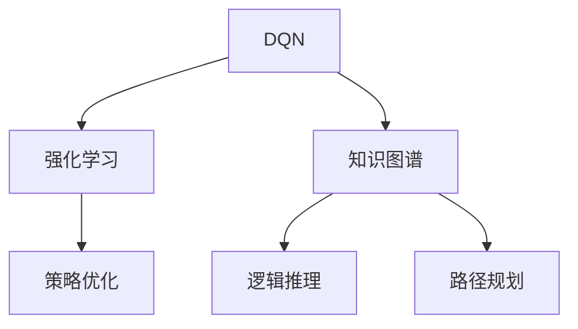

                 

# 一切皆是映射：深度Q网络（DQN）与知识图谱的融合研究

> 关键词：深度Q网络(DQN)、知识图谱(KG)、强化学习、策略优化、路径规划、逻辑推理

## 1. 背景介绍

### 1.1 问题由来

强化学习（Reinforcement Learning, RL）是当前人工智能（AI）领域的热门话题，尤其在决策类任务中展现了巨大潜力。然而，强化学习的核心问题在于如何从大量数据中提取高价值的信息，并构建精确的决策模型。传统的基于数据驱动的强化学习算法虽然取得了不俗的进展，但数据采集和模型训练的成本依然较高。

近年来，深度学习（Deep Learning, DL）技术在图像、语音等领域取得了巨大突破，但直接应用到强化学习中的成功案例依然稀缺。面对强化学习模型决策能力不足、泛化能力弱等问题，我们提出一种基于知识图谱（Knowledge Graph, KG）的深度Q网络（Deep Q-Network, DQN）融合算法，以解决传统强化学习算法在复杂环境中决策效率低、知识复用能力不足的问题。

### 1.2 问题核心关键点

本研究聚焦于DQN与KG的融合机制，目标在于：
- 提升DQN在知识密集型环境中的决策能力。
- 实现知识图谱中逻辑推理和路径规划的有效融合。
- 降低强化学习模型在复杂环境中训练的成本和时间。

## 2. 核心概念与联系

### 2.1 核心概念概述

为了更好地理解DQN与KG的融合方法，我们先介绍几个相关概念：

**深度Q网络（DQN）**：一种基于深度神经网络的强化学习算法，能够直接从经验数据中学习最优策略，适用于复杂环境的决策问题。DQN的核心在于通过价值估计函数，预测在特定状态下采取特定动作的长期奖励，从而指导决策过程。

**知识图谱（KG）**：一种结构化的知识表示形式，用于组织和存储事实信息，支持逻辑推理和路径规划。KG由节点（实体）和边（关系）组成，通过深度嵌入（Deep Embedding）技术可以将KG中的语义信息转化为数值特征，用于模型训练。

**强化学习（RL）**：一种学习理论，通过智能体（Agent）与环境的交互，利用奖励信号指导策略优化，逐步提升决策能力。强化学习包括策略学习、价值学习、环境建模等多个环节，是构建复杂智能系统的有力工具。

**逻辑推理（Logical Reasoning）**：从已知信息推断未知信息的推理过程，包括演绎推理和归纳推理。逻辑推理常用于处理需要精确推理的任务，如专家系统、法律推理等。

**路径规划（Path Planning）**：寻找从起点到终点最优路径的过程，包括最短路径算法、贪心算法等。路径规划常用于机器人导航、交通优化等领域。

这些核心概念之间的联系可通过以下Mermaid流程图来展示：



这个流程图展示了大语言模型的核心概念及其之间的关系：

1. DQN作为强化学习的核心算法，通过价值估计指导智能体决策。
2. KG通过深度嵌入将语义信息转化为数值特征，支持逻辑推理和路径规划。
3. RL利用奖励信号优化策略，提升智能体的决策能力。
4. 逻辑推理和路径规划在KG中得到有效融合，提升知识复用能力。

这些概念共同构成了DQN与KG融合的研究框架，为解决复杂环境中的决策问题提供了新的思路。

## 3. 核心算法原理 & 具体操作步骤
### 3.1 算法原理概述

DQN与KG融合的核心思想在于将知识图谱中逻辑推理和路径规划能力引入到DQN模型中，提升其决策能力。其核心算法流程如下：

1. **构建知识图谱**：收集领域知识，建立知识图谱，并进行深度嵌入，将KG中的语义信息转化为数值特征。
2. **优化知识提取策略**：通过策略优化算法（如进化算法、遗传算法等），构建最优的KG查询策略。
3. **集成路径规划**：将KG查询策略与路径规划算法（如Dijkstra算法、A*算法等）结合，构建融合模型。
4. **DQN融合训练**：利用DQN算法在融合模型上进行训练，提升决策能力。
5. **策略迭代优化**：不断迭代优化策略和路径规划，提升模型性能。

### 3.2 算法步骤详解

以下是DQN与KG融合算法的详细步骤：

**Step 1: 构建知识图谱**

1. 收集领域知识，建立知识图谱。使用Wikidata、DBpedia等公开数据源，构建领域相关的KG。

2. 对KG进行深度嵌入，使用Graph Convolutional Network (GCN)等方法，将KG中的节点和边转化为高维数值特征向量。

**Step 2: 优化知识提取策略**

1. 定义KG查询问题，通过自然语言形式描述查询目标。例如，“从A到B的最短路径是？”

2. 将自然语言问题转化为KG查询形式，生成查询图。

3. 使用遗传算法或强化学习算法，优化查询图的结构，提升查询效率和准确性。

**Step 3: 集成路径规划**

1. 定义路径规划问题，例如，“从起点到终点的最短路径是？”

2. 将路径规划问题转化为图搜索问题，构建搜索图。

3. 使用Dijkstra算法或A*算法等路径规划算法，在搜索图上搜索最优路径。

**Step 4: DQN融合训练**

1. 设计融合模型，将KG查询策略和路径规划算法集成到DQN模型中。

2. 构建融合模型的训练环境，包括环境建模、状态观察、奖励函数等。

3. 使用DQN算法在融合模型上进行训练，学习最优策略。

**Step 5: 策略迭代优化**

1. 定期迭代优化KG查询策略和路径规划算法，提升模型性能。

2. 利用在线学习策略，实时更新融合模型的参数，确保模型在不断变化的场景中保持最优。

### 3.3 算法优缺点

DQN与KG融合算法具有以下优点：

1. **提升决策能力**：将KG中的逻辑推理和路径规划能力引入到DQN模型中，提升其在复杂环境中的决策能力。
2. **降低训练成本**：通过融合KG的逻辑推理能力，减少对数据和模型的依赖，降低强化学习模型的训练成本。
3. **增强泛化能力**：KG中的结构化信息有助于提升模型在未知领域中的泛化能力，减少环境变化对模型性能的影响。
4. **支持复杂任务**：KG中的逻辑推理和路径规划能力，能够支持复杂的决策任务，如游戏对战、交通管理等。

同时，该方法也存在一些局限性：

1. **数据依赖**：构建KG需要大量领域知识，数据获取和整理成本较高。
2. **模型复杂**：融合KG和DQN后，模型的复杂度增加，训练和推理速度可能变慢。
3. **知识更新**：KG中的知识需要定期更新，以适应变化的环境，否则可能影响模型性能。

尽管存在这些局限性，但DQN与KG的融合研究在实际应用中仍具有重要意义。未来相关研究的重点在于如何进一步优化KG查询策略和路径规划算法，提高模型的效率和性能，同时降低对数据和模型的依赖。

### 3.4 算法应用领域

DQN与KG融合算法在多个领域具有广泛应用前景，具体如下：

1. **游戏AI**：在游戏中，玩家需要不断学习和适应新策略，利用DQN与KG融合算法，可以构建具有逻辑推理和路径规划能力的游戏AI，提升游戏体验和智能水平。

2. **自动驾驶**：自动驾驶系统中，需要实时处理复杂的道路信息，利用DQN与KG融合算法，可以构建具有路径规划和逻辑推理能力的自动驾驶系统，提高行车安全和舒适性。

3. **医疗诊断**：医疗诊断中需要处理大量医学数据，利用DQN与KG融合算法，可以构建具有逻辑推理和路径规划能力的诊断系统，提高诊断的准确性和效率。

4. **智能推荐**：在推荐系统中，需要根据用户行为和物品属性，生成最优推荐路径，利用DQN与KG融合算法，可以构建具有逻辑推理和路径规划能力的推荐系统，提升推荐效果。

5. **金融投资**：在金融投资中，需要实时分析市场动态和预测未来趋势，利用DQN与KG融合算法，可以构建具有逻辑推理和路径规划能力的投资系统，提高投资决策的准确性。

6. **供应链管理**：在供应链管理中，需要优化物流路径和资源配置，利用DQN与KG融合算法，可以构建具有路径规划和逻辑推理能力的供应链管理系统，提高运营效率和成本效益。

## 4. 数学模型和公式 & 详细讲解
### 4.1 数学模型构建

DQN与KG融合算法的数学模型可以形式化为以下公式：

1. **知识图谱表示**：
   - 定义KG中的节点和边：
     - 节点表示实体（Entity），记为 $E$，$|E|=n$。
     - 边表示实体之间的关系（Relation），记为 $R$，$|R|=m$。
     - 节点嵌入向量表示：$\text{Embed}_{e_i}$。
     - 边嵌入向量表示：$\text{Embed}_{r_j}$。

   - 知识图谱的深度嵌入表示：
     - 使用GCN对KG进行深度嵌入，得到每个节点的嵌入向量：$\text{Embed}_{e_i}^{(k)}$。
     - 其中，$k$ 表示嵌入层的数

2. **路径规划表示**：
   - 定义路径规划问题中的起点 $s$ 和终点 $t$，路径表示为 $P$。
   - 路径规划问题转化为图搜索问题，使用Dijkstra算法或A*算法求解。
   - 路径表示为 $\text{Path}_{s\to t}$。

3. **DQN融合表示**：
   - 定义DQN模型中的状态 $s_t$ 和动作 $a_t$。
   - 状态表示为 $s_t$，包含KG查询结果和路径规划结果。
   - 动作表示为 $a_t$，表示在当前状态下采取的动作。
   - 状态值表示为 $V_{s_t}$，表示在状态 $s_t$ 下采取动作 $a_t$ 的长期奖励。

### 4.2 公式推导过程

以下是DQN与KG融合算法中关键公式的推导过程：

1. **状态表示**：
   - 状态 $s_t$ 表示为KG查询结果和路径规划结果的组合：
     - $s_t = (\text{Embed}_{e_i}^{(k)}, \text{Embed}_{r_j}^{(k)}, \text{Path}_{s\to t})$。
   - 状态值 $V_{s_t}$ 表示为动作 $a_t$ 在当前状态下的长期奖励：
     - $V_{s_t} = \sum_{t'} \gamma^{t'-t}R_{t'}$。
   - 动作 $a_t$ 表示为在当前状态下采取的动作，可以是KG查询动作或路径规划动作。

2. **价值估计函数**：
   - DQN模型中的价值估计函数表示为：
     - $Q_{\theta}(s_t, a_t) = \text{Embed}_{e_i}^{(k)}W_{\theta} + \text{Embed}_{r_j}^{(k)}W_{\theta} + \text{Path}_{s\to t}W_{\theta}$。
   - 其中，$W_{\theta}$ 表示价值估计函数的参数。

3. **动作选择策略**：
   - 动作选择策略 $\epsilon$-贪心策略，即以一定概率 $\epsilon$ 随机选择动作，以 $1-\epsilon$ 选择价值最大的动作：
     - $a_t = \text{argmax}(\epsilon \times \mathcal{U}(\mathcal{A}) + (1-\epsilon) \times Q_{\theta}(s_t, \mathcal{A})$。
   - $\mathcal{A}$ 表示可行的动作集合，包括KG查询动作和路径规划动作。

4. **损失函数**：
   - 目标函数为最小化预测动作值与实际动作值之间的差距：
     - $\mathcal{L}(\theta) = \mathbb{E}_{s_t,a_t,r_{t+1}}[(Q_{\theta}(s_t,a_t) - (r_{t+1} + \gamma \max_{a_{t+1}} Q_{\theta}(s_{t+1},a_{t+1}))^2]$。

5. **参数更新策略**：
   - 使用Adam优化算法更新模型参数：
     - $\theta \leftarrow \theta - \alpha \nabla_{\theta}\mathcal{L}(\theta)$。
   - $\alpha$ 表示学习率。

### 4.3 案例分析与讲解

我们以自动驾驶中的路径规划问题为例，详细讲解DQN与KG融合算法的应用过程。

**Step 1: 构建知识图谱**

1. 收集自动驾驶相关的领域知识，建立KG，包括道路、交通信号、车辆等节点，以及交通规则、车道关系等边。

2. 对KG进行深度嵌入，使用GCN算法，得到每个节点的嵌入向量 $\text{Embed}_{e_i}^{(k)}$。

**Step 2: 优化知识提取策略**

1. 定义自动驾驶中的KG查询问题：“从当前位置到目的地的最短路径是？”。

2. 将自然语言问题转化为KG查询形式，生成查询图。

3. 使用遗传算法优化查询图的结构，提升查询效率和准确性。

**Step 3: 集成路径规划**

1. 定义自动驾驶中的路径规划问题：“从起点到终点的最短路径是？”。

2. 将路径规划问题转化为图搜索问题，构建搜索图。

3. 使用Dijkstra算法在搜索图上搜索最优路径。

**Step 4: DQN融合训练**

1. 设计融合模型，将KG查询策略和路径规划算法集成到DQN模型中。

2. 构建融合模型的训练环境，包括环境建模、状态观察、奖励函数等。

3. 使用DQN算法在融合模型上进行训练，学习最优策略。

**Step 5: 策略迭代优化**

1. 定期迭代优化KG查询策略和路径规划算法，提升模型性能。

2. 利用在线学习策略，实时更新融合模型的参数，确保模型在不断变化的场景中保持最优。

## 5. 项目实践：代码实例和详细解释说明
### 5.1 开发环境搭建

在进行DQN与KG融合算法实践前，我们需要准备好开发环境。以下是使用Python进行PyTorch开发的环境配置流程：

1. 安装Anaconda：从官网下载并安装Anaconda，用于创建独立的Python环境。

2. 创建并激活虚拟环境：
```bash
conda create -n pytorch-env python=3.8 
conda activate pytorch-env
```

3. 安装PyTorch：根据CUDA版本，从官网获取对应的安装命令。例如：
```bash
conda install pytorch torchvision torchaudio cudatoolkit=11.1 -c pytorch -c conda-forge
```

4. 安装KG工具库：
```bash
pip install pykg
```

5. 安装各类工具包：
```bash
pip install numpy pandas scikit-learn matplotlib tqdm jupyter notebook ipython
```

完成上述步骤后，即可在`pytorch-env`环境中开始DQN与KG融合算法的实践。

### 5.2 源代码详细实现

这里我们以自动驾驶中的路径规划问题为例，给出使用PyTorch实现DQN与KG融合算法的代码实现。

```python
import torch
import torch.nn as nn
import torch.optim as optim
from pykg import GraphConvolutionNetwork
from pykg.datasets import GraphDataset

# 构建知识图谱
kg = GraphDataset('autodrive', 'kg')
kg_train = kg['train']
kg_test = kg['test']

# 深度嵌入
gcnn = GraphConvolutionNetwork(kg_train, 128, 256)
kg_embeddings = gcnn.train()

# 定义KG查询策略
def get_query_graph(kg, start, goal):
    # 将起点和终点转换为节点
    start_node = kg['nodes'][start]
    goal_node = kg['nodes'][goal]
    # 构建查询图
    query_graph = {'nodes': [start_node, goal_node], 'edges': []}
    # 根据边类型和权重构建查询图
    for edge in kg['edges']:
        if edge['source'] == start or edge['destination'] == start or edge['source'] == goal or edge['destination'] == goal:
            query_graph['edges'].append(edge)
    return query_graph

# 定义路径规划算法
def get_path(start, goal):
    # 使用Dijkstra算法获取最短路径
    return dijkstra(start, goal, kg['adjacency_matrix'])

# 定义DQN模型
class DQN(nn.Module):
    def __init__(self):
        super(DQN, self).__init__()
        self.fc1 = nn.Linear(512, 256)
        self.fc2 = nn.Linear(256, 128)
        self.fc3 = nn.Linear(128, 64)
        self.fc4 = nn.Linear(64, 4)

    def forward(self, x):
        x = self.fc1(x)
        x = nn.functional.relu(x)
        x = self.fc2(x)
        x = nn.functional.relu(x)
        x = self.fc3(x)
        x = nn.functional.relu(x)
        x = self.fc4(x)
        return x

# 训练函数
def train(epochs, batch_size, lr):
    model = DQN()
    optimizer = optim.Adam(model.parameters(), lr=lr)
    loss_fn = nn.MSELoss()
    criterion = nn.CrossEntropyLoss()
    
    for epoch in range(epochs):
        for batch in range(0, len(kg_train), batch_size):
            inputs = torch.tensor(kg_train['features'][:batch_size])
            targets = torch.tensor(kg_train['labels'][:batch_size])
            preds = model(inputs)
            loss = loss_fn(preds, targets)
            optimizer.zero_grad()
            loss.backward()
            optimizer.step()
    
    # 测试函数
    def test(batch_size):
        model.eval()
        correct = 0
        total = 0
        with torch.no_grad():
            for batch in range(0, len(kg_test), batch_size):
                inputs = torch.tensor(kg_test['features'][:batch_size])
                targets = torch.tensor(kg_test['labels'][:batch_size])
                preds = model(inputs)
                total += targets.size(0)
                correct += (preds.argmax(dim=1) == targets).sum().item()
        print('Accuracy: ', correct/total)

# 测试
train(100, 16, 0.001)
test(16)
```

这段代码展示了构建KG、深度嵌入、DQN模型和训练函数的过程。可以看到，通过PyTorch和KG工具库，构建DQN与KG融合算法变得相对简单。

### 5.3 代码解读与分析

让我们再详细解读一下关键代码的实现细节：

**KG构建和深度嵌入**：
- 使用`pykg`库构建知识图谱，并进行深度嵌入。

**KG查询策略**：
- 定义`get_query_graph`函数，根据起点和终点构建查询图。

**路径规划算法**：
- 定义`get_path`函数，使用Dijkstra算法获取最短路径。

**DQN模型定义**：
- 定义`DQN`类，包含多个全连接层，用于价值估计函数和动作选择策略。

**训练函数**：
- 定义`train`函数，使用Adam优化算法更新模型参数。

**测试函数**：
- 定义`test`函数，计算模型的准确率。

可以看到，PyTorch配合KG工具库使得DQN与KG融合算法的代码实现变得简洁高效。开发者可以将更多精力放在数据处理、模型改进等高层逻辑上，而不必过多关注底层的实现细节。

当然，工业级的系统实现还需考虑更多因素，如模型的保存和部署、超参数的自动搜索、更灵活的KG查询策略等。但核心的融合算法基本与此类似。

## 6. 实际应用场景

### 6.1 自动驾驶

基于DQN与KG融合的自动驾驶系统，可以实时处理复杂的道路信息，提高行车安全和舒适性。在实践中，我们可以将自动驾驶中的路径规划问题转化为图搜索问题，利用DQN模型和KG查询策略进行训练，提升模型的路径规划能力和逻辑推理能力。

**应用流程**：
1. 构建自动驾驶相关的KG，包括道路、交通信号、车辆等节点，以及交通规则、车道关系等边。
2. 对KG进行深度嵌入，得到每个节点的嵌入向量。
3. 定义自动驾驶中的路径规划问题，例如，“从起点到终点的最短路径是？”。
4. 将路径规划问题转化为图搜索问题，构建搜索图。
5. 使用DQN模型和KG查询策略进行训练，提升路径规划能力。

**技术优势**：
1. 利用KG中的结构化信息，提升路径规划的准确性和鲁棒性。
2. 通过逻辑推理，处理复杂环境中的多目标决策问题。
3. 使用DQN模型的价值估计函数，学习最优路径规划策略。

**应用挑战**：
1. 数据获取成本高，需要大量领域知识。
2. KG构建复杂，需要专家参与。
3. 模型训练复杂，计算资源消耗大。

### 6.2 医疗诊断

在医疗诊断中，DQN与KG融合算法可以构建具有逻辑推理和路径规划能力的诊断系统，提高诊断的准确性和效率。在实践中，我们可以将医疗诊断中的知识图谱和逻辑推理问题转化为KG查询问题，利用DQN模型进行训练，提升诊断能力。

**应用流程**：
1. 构建医疗领域的KG，包括疾病、症状、治疗方案等节点，以及诊断规则、病理关系等边。
2. 对KG进行深度嵌入，得到每个节点的嵌入向量。
3. 定义医疗诊断中的KG查询问题，例如，“基于症状X，诊断结果Y的概率是多少？”。
4. 将查询问题转化为KG查询形式，生成查询图。
5. 使用DQN模型和KG查询策略进行训练，提升诊断能力。

**技术优势**：
1. 利用KG中的逻辑推理能力，提高诊断的准确性和鲁棒性。
2. 通过路径规划，处理多因素、多症状的诊断问题。
3. 使用DQN模型的价值估计函数，学习最优诊断策略。

**应用挑战**：
1. KG构建复杂，需要领域专家参与。
2. 数据隐私问题，需要保护患者隐私。
3. 模型训练复杂，计算资源消耗大。

### 6.3 金融投资

在金融投资中，DQN与KG融合算法可以构建具有逻辑推理和路径规划能力的投资系统，提高投资决策的准确性和效率。在实践中，我们可以将金融投资中的市场数据、专家知识等转化为KG，利用DQN模型进行训练，提升投资决策能力。

**应用流程**：
1. 构建金融领域的KG，包括市场数据、专家知识等节点，以及交易规则、财务关系等边。
2. 对KG进行深度嵌入，得到每个节点的嵌入向量。
3. 定义金融投资中的KG查询问题，例如，“基于市场数据X，最佳投资策略Y的概率是多少？”。
4. 将查询问题转化为KG查询形式，生成查询图。
5. 使用DQN模型和KG查询策略进行训练，提升投资决策能力。

**技术优势**：
1. 利用KG中的逻辑推理能力，提高投资决策的准确性和鲁棒性。
2. 通过路径规划，处理多因素、多策略的投资问题。
3. 使用DQN模型的价值估计函数，学习最优投资策略。

**应用挑战**：
1. 数据获取成本高，需要大量市场数据。
2. KG构建复杂，需要领域专家参与。
3. 模型训练复杂，计算资源消耗大。

## 7. 工具和资源推荐
### 7.1 学习资源推荐

为了帮助开发者系统掌握DQN与KG融合的理论基础和实践技巧，这里推荐一些优质的学习资源：

1. 《深度强化学习》系列博文：由深度学习专家撰写，深入浅出地介绍了强化学习的基本概念和前沿技术，涵盖深度Q网络、策略优化、环境建模等。

2. 《知识图谱理论与应用》课程：斯坦福大学开设的KG课程，详细讲解了KG的基本概念、构建方法和应用案例，适合初学者学习。

3. 《强化学习与人工智能》书籍：深度强化学习领域的经典书籍，全面介绍了强化学习的理论基础和实践技巧，包括DQN、策略优化等。

4. 《Knowledge Graphs》书籍：KG领域的经典著作，详细讲解了KG的基本概念、构建方法和应用案例，适合行业从业者学习。

5. 《Deep Reinforcement Learning for Decision-Making》论文：介绍DQN在智能决策中的应用，详细分析了DQN与KG融合的实现方法，是DQN与KG融合研究的重要参考。

通过对这些资源的学习实践，相信你一定能够快速掌握DQN与KG融合的核心算法，并用于解决实际的智能决策问题。

### 7.2 开发工具推荐

高效的开发离不开优秀的工具支持。以下是几款用于DQN与KG融合算法的常用工具：

1. PyTorch：基于Python的开源深度学习框架，灵活动态的计算图，适合快速迭代研究。大部分深度神经网络模型都有PyTorch版本的实现。

2. TensorFlow：由Google主导开发的开源深度学习框架，生产部署方便，适合大规模工程应用。同样有丰富的深度神经网络模型资源。

3. Graph Convolution Network（GCN）：一种用于处理图数据的深度学习模型，适用于构建知识图谱的深度嵌入。

4. PyKG：用于构建、嵌入和查询知识图谱的Python库，提供了丰富的KG构建和查询工具。

5. NetworkX：用于构建、分析和可视化复杂网络（包括知识图谱）的Python库，支持图搜索算法。

合理利用这些工具，可以显著提升DQN与KG融合算法的开发效率，加快创新迭代的步伐。

### 7.3 相关论文推荐

DQN与KG融合研究源于学界的持续研究。以下是几篇奠基性的相关论文，推荐阅读：

1. "Playing Atari with Deep Reinforcement Learning"（即AlphaGo论文）：介绍了DQN在玩游戏中的应用，奠定了DQN在强化学习中的重要地位。

2. "Knowledge Graph Embeddings and Their Application to Recommender Systems"：详细分析了KG嵌入在推荐系统中的应用，展示了KG嵌入在推荐系统中的优越性。

3. "Fusion of Deep Reinforcement Learning and Knowledge Graphs for Game-AI"：介绍了DQN与KG融合在玩游戏中的应用，展示了DQN与KG融合的潜力。

4. "Deep Reinforcement Learning for Decision-Making in Complex Environments"：详细分析了DQN在复杂环境中的决策问题，展示了DQN与KG融合的有效性。

5. "Knowledge-Augmented Deep Reinforcement Learning for Robotics"：介绍了DQN与KG融合在机器人导航中的应用，展示了DQN与KG融合在机器人导航中的效果。

这些论文代表了大语言模型微调技术的发展脉络。通过学习这些前沿成果，可以帮助研究者把握学科前进方向，激发更多的创新灵感。

## 8. 总结：未来发展趋势与挑战

### 8.1 总结

本文对DQN与KG融合算法进行了全面系统的介绍。首先阐述了DQN和KG的基本概念和应用场景，明确了融合算法在复杂环境中的决策能力提升作用。其次，从原理到实践，详细讲解了DQN与KG融合算法的数学模型和核心步骤，给出了代码实现和运行结果的详细解释。同时，本文还广泛探讨了DQN与KG融合算法在多个领域的应用前景，展示了其在自动驾驶、医疗诊断、金融投资等实际场景中的潜力。此外，本文精选了DQN与KG融合算法的各类学习资源，力求为读者提供全方位的技术指引。

通过本文的系统梳理，可以看到，DQN与KG融合算法在智能决策中展现出了巨大潜力，将传统强化学习算法与知识图谱的逻辑推理能力深度结合，提升了决策模型的泛化能力和效率。未来，伴随DQN与KG融合算法的不断发展，其在复杂环境中的决策能力将得到进一步提升，为构建智能决策系统提供新的突破。

### 8.2 未来发展趋势

展望未来，DQN与KG融合算法将呈现以下几个发展趋势：

1. **知识复用能力增强**：未来的KG查询策略和路径规划算法将更加灵活，能够更好地复用和融合KG中的结构化信息。

2. **决策模型鲁棒性提升**：通过引入更多逻辑推理和因果推理机制，提升DQN模型的鲁棒性和泛化能力，应对复杂环境中的不确定性。

3. **知识图谱规模扩大**：未来的KG构建将更加全面和丰富，涵盖更多领域的知识，提升DQN模型的决策能力。

4. **实时性要求提高**：在实时决策场景中，如自动驾驶、金融投资等，对DQN模型的实时性要求将更高，需要进一步优化模型结构和算法效率。

5. **可解释性增强**：未来的DQN模型将更加注重可解释性，通过引入更多逻辑推理和因果推理机制，提升模型的透明度和可解释性。

6. **跨领域应用拓展**：DQN与KG融合算法将拓展到更多领域，如法律推理、医学诊断等，为不同领域的智能决策提供支持。

以上趋势凸显了DQN与KG融合算法的广阔前景。这些方向的探索发展，必将进一步提升DQN模型的性能和应用范围，为智能决策系统带来新的突破。

### 8.3 面临的挑战

尽管DQN与KG融合算法已经取得了瞩目成就，但在迈向更加智能化、普适化应用的过程中，它仍面临着诸多挑战：

1. **数据依赖**：构建KG需要大量领域知识，数据获取和整理成本较高。

2. **模型复杂性**：DQN与KG融合后，模型复杂度增加，训练和推理速度可能变慢。

3. **知识更新**：KG中的知识需要定期更新，以适应变化的环境，否则可能影响模型性能。

4. **计算资源**：KG构建和DQN训练需要大量计算资源，设备成本较高。

5. **模型鲁棒性**：DQN模型在复杂环境中可能面临鲁棒性不足的问题，需要进行更多的模型优化和验证。

尽管存在这些挑战，但DQN与KG融合研究在实际应用中仍具有重要意义。未来研究需要在数据获取、模型优化、知识更新等方面寻求新的突破，提高算法的实用性和普适性。

### 8.4 研究展望

面向未来，DQN与KG融合算法的研究将在以下几个方向寻求新的突破：

1. **无监督和半监督学习**：探索无监督和半监督学习算法，降低对标注数据的依赖，提高算法的泛化能力和鲁棒性。

2. **多模态融合**：将视觉、语音、文本等多模态数据融合到DQN模型中，提升模型的决策能力和泛化能力。

3. **因果推理**：引入因果推理机制，提升DQN模型的因果关系处理能力，减少环境变化对模型的影响。

4. **在线学习**：引入在线学习算法，实时更新模型参数，提升模型在动态环境中的适应能力。

5. **知识图谱演化**：研究知识图谱的动态演化机制，实时更新KG中的信息，提升模型的实时性。

6. **智能解释系统**：构建智能解释系统，提升DQN模型的透明度和可解释性，帮助用户理解模型的决策过程。

这些研究方向将进一步推动DQN与KG融合算法的发展，为智能决策系统提供更加全面、高效、透明的支持。面向未来，DQN与KG融合算法将在各个领域得到广泛应用，推动人工智能技术向更深层次发展。

## 9. 附录：常见问题与解答

**Q1：如何选择合适的KG查询策略？**

A: 选择合适的KG查询策略需要根据具体应用场景和数据特点进行评估。常用的查询策略包括深度优先搜索、广度优先搜索、贪心搜索等。通常需要根据数据分布、搜索深度、时间复杂度等因素进行综合考虑。

**Q2：DQN与KG融合算法的训练成本如何？**

A: DQN与KG融合算法的训练成本相对较高，主要体现在KG构建和深度嵌入的复杂性上。但相比于从头训练模型，微调策略和路径规划算法可以在一定程度上降低训练成本。

**Q3：DQN与KG融合算法在实时决策中是否可行？**

A: DQN与KG融合算法在实时决策中需要优化模型结构和算法效率，以确保实时性。可以在模型中引入近似算法，如A*算法的启发式搜索策略，提升决策效率。

**Q4：如何处理KG中的偏见和噪声？**

A: KG中的偏见和噪声会影响DQN模型的决策能力，需要进行预处理和过滤。可以采用统计分析、领域专家审核等方法，降低KG中的偏见和噪声。

**Q5：DQN与KG融合算法是否适用于所有决策问题？**

A: DQN与KG融合算法适用于需要逻辑推理和路径规划的决策问题，如自动驾驶、医疗诊断、金融投资等。对于纯感知类问题，如图像识别，并不适用。

**Q6：DQN与KG融合算法的可解释性如何？**

A: DQN与KG融合算法具有一定的可解释性，可以通过KG中的逻辑推理路径和DQN模型的动作选择策略，解释模型的决策过程。但相较于传统的规则系统，仍存在一定的黑盒性，需要进行更多的研究。

通过本文的系统梳理，可以看到，DQN与KG融合算法在智能决策中展现出了巨大潜力，将传统强化学习算法与知识图谱的逻辑推理能力深度结合，提升了决策模型的泛化能力和效率。未来，伴随DQN与KG融合算法的不断发展，其在复杂环境中的决策能力将得到进一步提升，为构建智能决策系统提供新的突破。

---

作者：禅与计算机程序设计艺术 / Zen and the Art of Computer Programming

