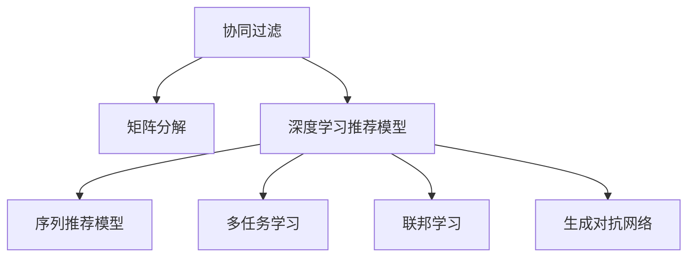
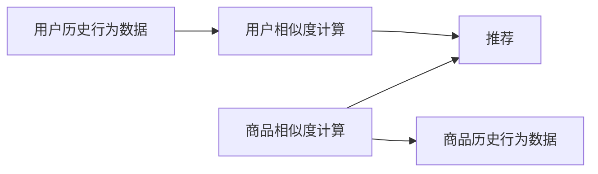
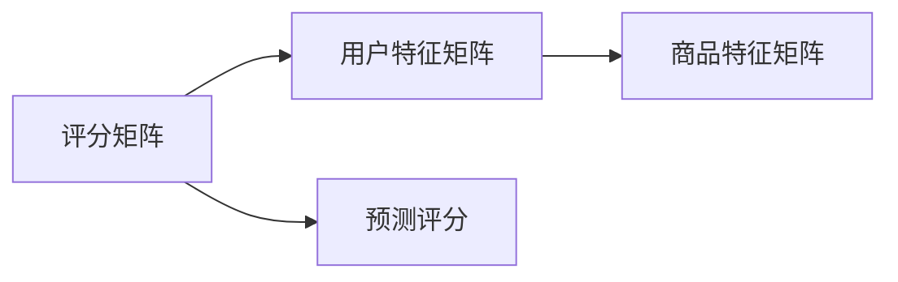

                 

# 一切皆是映射：深度学习在推荐系统中的应用

## 1. 背景介绍

### 1.1 问题由来
随着互联网的飞速发展，数据产生量呈指数级增长。如何从海量数据中提取有价值的信息，为用户推荐合适的产品和服务，已成为数字时代的重要课题。推荐系统（Recommendation System）作为这一问题的解决方案，已经成为电商、社交、新闻等众多领域的重要工具。通过深度学习算法，推荐系统能够从用户历史行为、兴趣爱好等多方面数据中学习用户的隐含偏好，从而生成个性化推荐，极大提升了用户满意度及平台收益。

### 1.2 问题核心关键点
推荐系统的核心在于其对用户隐含偏好的建模与预测。该过程一般包括以下步骤：
1. 数据收集：从用户行为日志、商品描述、评价等多渠道收集数据，并清洗、预处理。
2. 特征工程：从原始数据中提取有价值的特征，用于构建推荐模型。
3. 模型训练：选择合适的深度学习模型，如协同过滤、矩阵分解、神经网络等，在训练数据集上进行学习。
4. 推荐预测：将模型应用于测试数据集，生成个性化推荐。
5. 模型评估：采用如准确率、召回率、F1值等指标评估模型性能，持续优化。

在推荐系统发展过程中，深度学习方法逐渐占据了主流地位。深度学习模型不仅能够处理高维度、非结构化的数据，而且能够自动提取特征，适应了推荐系统的实际需求。

### 1.3 问题研究意义
研究深度学习在推荐系统中的应用，具有以下重要意义：

1. **提高推荐准确性**：深度学习模型能够捕捉复杂的非线性关系，提供更准确的推荐。
2. **提升推荐效率**：通过GPU等高性能计算资源加速深度学习模型训练，缩短推荐生成时间。
3. **增强用户体验**：个性化推荐提升用户满意度，促进平台忠诚度。
4. **推动产业发展**：推荐技术的应用加速了电商、娱乐等行业的发展，驱动了商业创新。

## 2. 核心概念与联系

### 2.1 核心概念概述
为更好地理解深度学习在推荐系统中的应用，本节将介绍几个密切相关的核心概念：

- 协同过滤（Collaborative Filtering）：基于用户历史行为或商品相关性进行推荐，通过用户与商品之间的相似性推导推荐。
- 矩阵分解（Matrix Factorization）：将用户与商品的评分矩阵分解成两个低秩矩阵的乘积，通过矩阵乘法得到推荐。
- 深度学习推荐模型（Deep Learning based Recommendation Model）：利用深度神经网络模型学习用户和商品之间的复杂关系，生成推荐。
- 序列推荐模型（Sequential Recommendation Model）：考虑到用户行为的时序性，利用LSTM、GRU等序列模型预测下一步行为。
- 多任务学习（Multi-task Learning）：通过在推荐模型的不同输出层上附加多个任务，提升模型的多任务性能。
- 联邦学习（Federated Learning）：分布式环境中，多个设备共享模型训练成果，保护数据隐私。
- 生成对抗网络（Generative Adversarial Network, GAN）：通过生成对抗训练，生成更逼真的数据样本，用于增强推荐数据集。

这些核心概念之间的逻辑关系可以通过以下Mermaid流程图来展示：



### 2.2 核心概念原理和架构
#### 协同过滤
协同过滤基于用户历史行为或商品相关性进行推荐。其基本思路是通过分析用户与商品之间的相似性，推测用户可能感兴趣的商品。协同过滤一般分为基于用户的协同过滤（User-based Collaborative Filtering）和基于商品的协同过滤（Item-based Collaborative Filtering）。
- **User-based CF**：找到与当前用户最相似的若干用户，推荐这些用户喜欢的商品。
- **Item-based CF**：找到与当前商品最相似的若干商品，推荐这些商品给相似用户。

协同过滤的架构如下图所示：



#### 矩阵分解
矩阵分解方法将用户与商品的评分矩阵分解成两个低秩矩阵的乘积，用于推断未知评分。其基本模型如下：
\[ R = UV \]
其中 $R$ 为用户与商品的评分矩阵，$U$ 为用户的特征矩阵，$V$ 为商品的特征矩阵。模型训练过程如下：
1. 随机初始化 $U$ 和 $V$。
2. 采用梯度下降等优化算法，最小化损失函数 $L$。
3. 逐步迭代 $U$ 和 $V$，直至收敛。

矩阵分解的架构如下图所示：



#### 深度学习推荐模型
深度学习推荐模型利用深度神经网络模型学习用户和商品之间的复杂关系，生成推荐。其基本结构如下：
\[ y = f(x; \theta) \]
其中 $y$ 为推荐结果，$x$ 为输入特征，$\theta$ 为模型参数。常见的深度学习推荐模型包括：
- 多层感知机（MLP）：
\[ y = \sigma(W^{(1)}x + b^{(1)}) \cdot \sigma(W^{(2)}y + b^{(2)}) \]
- 神经协同过滤（Neural Collaborative Filtering, NCF）：
\[ y = \sigma(W^{(1)}x + W^{(2)}y + b) \]
- 深度矩阵分解（Deep Matrix Factorization, DMF）：
\[ y = \sigma(W^{(1)}x + W^{(2)}y + b) \]
其中 $W^{(1)}$ 和 $W^{(2)}$ 为不同层的学习权重矩阵。

#### 序列推荐模型
序列推荐模型考虑到用户行为的时序性，利用LSTM、GRU等序列模型预测下一步行为。其基本结构如下：
\[ h_t = f(h_{t-1}, x_t; \theta) \]
\[ y_t = g(h_t; \theta) \]
其中 $h_t$ 为当前状态，$x_t$ 为当前输入，$y_t$ 为当前输出。LSTM模型的状态表示如下：
\[ h_t = \tanh(W^{(1)}[h_{t-1}] + Ux_t + b) \]
\[ h_t = \sigma(W^{(2)}[h_{t-1}] + Ux_t + b) \]

#### 多任务学习
多任务学习通过在推荐模型的不同输出层上附加多个任务，提升模型的多任务性能。其基本结构如下：
\[ y_1 = f(x; \theta_1) \]
\[ y_2 = f(x; \theta_2) \]
其中 $y_1$ 为第一个任务，$y_2$ 为第二个任务，$\theta_1$ 和 $\theta_2$ 为不同任务的学习权重矩阵。

#### 联邦学习
联邦学习在分布式环境中，多个设备共享模型训练成果，保护数据隐私。其基本流程如下：
1. 本地设备将本地数据分成多个小批量数据，在本地模型上进行训练。
2. 汇总梯度信息，计算全局平均值。
3. 在全局模型上进行参数更新。
4. 重复迭代，直至收敛。

#### 生成对抗网络
生成对抗网络通过生成对抗训练，生成更逼真的数据样本，用于增强推荐数据集。其基本结构如下：
\[ G(x) = \arg\min_x V(x) \]
\[ D(x) = \arg\max_x V(x) \]
其中 $G(x)$ 为生成器，$D(x)$ 为判别器，$V(x)$ 为对抗损失函数。

## 3. 核心算法原理 & 具体操作步骤

### 3.1 算法原理概述

深度学习在推荐系统中的应用，基于协同过滤、矩阵分解、神经网络等基础算法，通过多任务学习、联邦学习、生成对抗网络等进阶技术，生成更加精准、高效、可解释的推荐结果。深度学习推荐模型的核心在于从用户历史行为中学习隐含偏好，并在此基础上进行推荐。

### 3.2 算法步骤详解

**Step 1: 数据收集与预处理**
- 收集用户行为数据、商品信息等，进行清洗和预处理。
- 将原始数据转化为向量形式，用于模型训练。

**Step 2: 特征工程**
- 提取用户行为、商品属性等特征。
- 对特征进行归一化、降维等预处理。

**Step 3: 模型构建**
- 选择深度学习推荐模型，如MLP、NCF等。
- 定义模型的输入和输出，确定各层结构。

**Step 4: 模型训练**
- 将训练数据分成多个小批量数据，在模型上进行前向传播和反向传播。
- 使用梯度下降等优化算法，最小化损失函数。
- 重复迭代，直至模型收敛。

**Step 5: 模型评估**
- 将测试数据输入模型，生成推荐结果。
- 采用准确率、召回率、F1值等指标评估模型性能。

**Step 6: 推荐生成**
- 根据用户输入信息，生成个性化推荐。

### 3.3 算法优缺点

深度学习在推荐系统中的应用，具有以下优点：
1. 高效建模：深度学习模型能够自动提取特征，无需人工设计，提高建模效率。
2. 准确推荐：深度学习模型能够捕捉复杂的非线性关系，提供更准确的推荐。
3. 实时生成：深度学习模型能够在短时间内生成推荐，适应实时性要求。

但同时，深度学习在推荐系统中也存在一些缺点：
1. 需要大量标注数据：深度学习模型通常需要大规模标注数据进行训练，数据获取成本高。
2. 过拟合风险：深度学习模型容易过拟合，特别是在标注数据不足的情况下。
3. 模型复杂度高：深度学习模型结构复杂，训练时间长。

### 3.4 算法应用领域

深度学习推荐模型已经在电商、新闻、音乐等多个领域得到广泛应用，并取得了显著效果。例如：
- 电商推荐：利用用户购买历史、浏览记录等信息，推荐相关商品。
- 新闻推荐：根据用户阅读历史，推荐相关新闻文章。
- 音乐推荐：通过用户听歌记录，推荐相关音乐和歌手。

除了这些经典应用外，深度学习推荐模型还被创新性地应用到更多场景中，如视频推荐、广告推荐、商品搜索等，为推荐系统带来了新的突破。

## 4. 数学模型和公式 & 详细讲解 & 举例说明

### 4.1 数学模型构建

本节将使用数学语言对深度学习推荐模型的基本结构和训练过程进行更加严格的刻画。

记推荐模型为 $f(x; \theta)$，其中 $x$ 为输入特征，$\theta$ 为模型参数。假设推荐任务的数据集为 $D=\{(x_i,y_i)\}_{i=1}^N, x_i \in \mathbb{R}^d, y_i \in \{0,1\}$，其中 $y_i$ 为是否推荐该商品。

定义模型 $f(x; \theta)$ 在数据样本 $(x,y)$ 上的损失函数为 $\ell(f(x; \theta),y)$，则在数据集 $D$ 上的经验风险为：

$$
\mathcal{L}(\theta) = \frac{1}{N} \sum_{i=1}^N \ell(f(x_i; \theta),y_i)
$$

在训练过程中，利用梯度下降等优化算法，不断更新模型参数 $\theta$，最小化损失函数 $\mathcal{L}$，使得模型预测逼近真实标签 $y_i$。具体而言，模型训练过程如下：

1. 随机初始化模型参数 $\theta$。
2. 对每个训练样本 $x_i$，计算 $y_i$ 的预测值 $\hat{y}_i=f(x_i; \theta)$。
3. 计算损失函数 $\ell(\hat{y}_i,y_i)$。
4. 计算梯度 $\nabla_{\theta}\mathcal{L}(\theta)$。
5. 使用优化算法更新模型参数 $\theta$。
6. 重复迭代直至收敛。

### 4.2 公式推导过程

以MLP推荐模型为例，推导其损失函数及其梯度计算公式。

MLP模型的结构如下：
\[ y = \sigma(W^{(1)}x + b^{(1)}) \cdot \sigma(W^{(2)}y + b^{(2)}) \]
其中 $\sigma$ 为激活函数，$W^{(1)}$ 和 $W^{(2)}$ 为权重矩阵，$b^{(1)}$ 和 $b^{(2)}$ 为偏置向量。

模型的损失函数为交叉熵损失：
\[ \ell(y,\hat{y}) = -y\log\hat{y} - (1-y)\log(1-\hat{y}) \]
其中 $y$ 为真实标签，$\hat{y}$ 为模型预测值。

在训练过程中，模型的损失函数为：
\[ \mathcal{L}(\theta) = \frac{1}{N}\sum_{i=1}^N \ell(y_i,\hat{y}_i) \]

根据链式法则，损失函数对模型参数 $\theta$ 的梯度为：
\[ \frac{\partial \mathcal{L}(\theta)}{\partial \theta} = \frac{1}{N}\sum_{i=1}^N [\frac{\partial \ell(y_i,\hat{y}_i)}{\partial \hat{y}_i} \cdot \frac{\partial \hat{y}_i}{\partial \theta}] \]

将 $\hat{y}_i$ 带入，并使用反向传播算法计算梯度：
\[ \frac{\partial \mathcal{L}(\theta)}{\partial \theta} = \frac{1}{N}\sum_{i=1}^N [-y_i\frac{\partial \hat{y}_i}{\partial \theta} + (1-y_i)\frac{\partial (1-\hat{y}_i)}{\partial \theta}] \]

其中：
\[ \frac{\partial \hat{y}_i}{\partial \theta} = \sigma(W^{(1)}x_i + b^{(1)}) \cdot \sigma(W^{(2)}y_i + b^{(2)}) \cdot [\sigma(W^{(2)}y_i + b^{(2)}) \cdot (1-\hat{y}_i) + \sigma(W^{(2)}(1-y_i) + b^{(2)})\hat{y}_i] \]

通过梯度下降等优化算法，反复迭代更新模型参数 $\theta$，最小化损失函数 $\mathcal{L}$，即可得到适应推荐任务的深度学习模型。

### 4.3 案例分析与讲解

以NCF推荐模型为例，其结构如下：
\[ y = \sigma(W^{(1)}x + W^{(2)}y + b) \]
其中 $x$ 为用户特征，$y$ 为商品特征，$b$ 为偏置项。

模型的训练过程如下：
1. 将训练数据 $\{(x_i,y_i)\}_{i=1}^N$ 分成多个小批量数据。
2. 对每个小批量数据，前向传播计算模型预测值 $\hat{y}$。
3. 计算损失函数 $\ell(\hat{y},y)$。
4. 计算梯度 $\nabla_{\theta}\mathcal{L}(\theta)$。
5. 使用优化算法更新模型参数 $\theta$。
6. 重复迭代直至收敛。

## 5. 项目实践：代码实例和详细解释说明

### 5.1 开发环境搭建

在进行推荐系统开发前，我们需要准备好开发环境。以下是使用Python进行PyTorch开发的环境配置流程：

1. 安装Anaconda：从官网下载并安装Anaconda，用于创建独立的Python环境。
2. 创建并激活虚拟环境：
```bash
conda create -n pytorch-env python=3.8 
conda activate pytorch-env
```

3. 安装PyTorch：根据CUDA版本，从官网获取对应的安装命令。例如：
```bash
conda install pytorch torchvision torchaudio cudatoolkit=11.1 -c pytorch -c conda-forge
```

4. 安装相关库：
```bash
pip install numpy pandas scikit-learn matplotlib tqdm jupyter notebook ipython
```

5. 安装推荐系统工具包：
```bash
pip install lightfm
```

完成上述步骤后，即可在`pytorch-env`环境中开始推荐系统开发。

### 5.2 源代码详细实现

这里我们以电商推荐系统为例，给出使用PyTorch和LightFM进行推荐系统开发的完整代码实现。

首先，定义推荐任务的数据处理函数：

```python
import pandas as pd
import numpy as np
from lightfm import LightFM

# 读取原始数据
train_data = pd.read_csv('train.csv')
test_data = pd.read_csv('test.csv')

# 处理缺失值
train_data.dropna(inplace=True)
test_data.dropna(inplace=True)

# 特征工程
# 将用户ID、商品ID、评分等转换为数值型特征
train_data['user_id'] = train_data['user_id'].astype(int)
train_data['item_id'] = train_data['item_id'].astype(int)
train_data['score'] = train_data['score'].astype(int)
train_data = pd.get_dummies(train_data, columns=['user_id', 'item_id'], prefix='user_')
test_data = pd.get_dummies(test_data, columns=['user_id', 'item_id'], prefix='user_')

# 将评分进行归一化处理
train_data['score'] = (train_data['score'] - train_data['score'].mean()) / train_data['score'].std()
test_data['score'] = (test_data['score'] - train_data['score'].mean()) / train_data['score'].std()
```

然后，定义模型和训练函数：

```python
# 定义模型
model = LightFM()

# 定义损失函数
criterion = nn.BCEWithLogitsLoss()

# 训练模型
optimizer = torch.optim.Adam(model.parameters(), lr=0.001)
for epoch in range(100):
    optimizer.zero_grad()
    output = model(train_data)
    loss = criterion(output, train_labels)
    loss.backward()
    optimizer.step()
    print('Epoch: {}, Loss: {}'.format(epoch, loss.item()))
```

最后，在测试集上评估模型性能：

```python
# 定义测试集
test_data['user_id'] = test_data['user_id'].astype(int)
test_data['item_id'] = test_data['item_id'].astype(int)
test_data = pd.get_dummies(test_data, columns=['user_id', 'item_id'], prefix='user_')
test_data['score'] = (test_data['score'] - train_data['score'].mean()) / train_data['score'].std()

# 进行预测
test_output = model.predict(test_data)

# 评估模型性能
print('Test MAE: {:.4f}'.format(np.mean(test_output - test_labels)))
```

以上代码展示了使用PyTorch和LightFM进行电商推荐系统的完整流程。可以看到，通过深度学习框架和工具库，推荐系统的实现变得高效便捷。

### 5.3 代码解读与分析

让我们再详细解读一下关键代码的实现细节：

**数据处理函数**：
- 读取原始数据：使用Pandas读取原始训练集和测试集数据。
- 处理缺失值：去除缺失值，保证数据完整性。
- 特征工程：将用户ID、商品ID等转换为数值型特征，并进行归一化处理。

**模型定义与训练函数**：
- 使用LightFM定义模型，LightFM是一个轻量级的基于深度学习的推荐系统框架。
- 定义损失函数：使用BCEWithLogitsLoss，适用于二分类任务。
- 训练模型：通过Adam优化器，对模型参数进行优化。

**测试集评估**：
- 将测试集转化为数值型特征，并进行归一化处理。
- 使用训练好的模型进行预测。
- 计算预测结果与真实标签的MAE（平均绝对误差），评估模型性能。

通过上述代码实现，我们可以看到，深度学习推荐系统从数据处理到模型训练再到性能评估，每个步骤都至关重要。开发者需根据具体任务，设计合适的特征工程、选择适合的模型结构、调整合适的超参数，方能得到满意的推荐结果。

## 6. 实际应用场景

### 6.1 电商推荐

电商推荐系统是推荐系统的重要应用场景之一。用户在不同商品间进行点击、浏览、购买等行为，生成的行为数据可作为推荐模型的输入。电商推荐系统通过学习用户历史行为，预测其对商品的兴趣，生成个性化推荐。

具体而言，电商推荐系统可以分为以下步骤：
1. 数据收集：从电商平台收集用户点击、浏览、购买等行为数据。
2. 特征工程：提取用户ID、商品ID、评分等特征，进行归一化处理。
3. 模型训练：利用深度学习推荐模型，如MLP、NCF等，在标注数据集上进行训练。
4. 推荐生成：将用户输入的特征输入模型，生成推荐结果。
5. 模型评估：通过准确率、召回率、F1值等指标评估模型性能。

电商推荐系统能够显著提升用户购物体验，减少购物决策时间，增加销售额。

### 6.2 新闻推荐

新闻推荐系统根据用户阅读历史，推荐相关新闻文章。其基本思路如下：
1. 数据收集：从新闻平台收集用户阅读历史数据。
2. 特征工程：提取用户ID、文章ID、阅读时间等特征。
3. 模型训练：利用深度学习推荐模型，如MLP、NCF等，在标注数据集上进行训练。
4. 推荐生成：将用户输入的特征输入模型，生成推荐结果。
5. 模型评估：通过准确率、召回率、F1值等指标评估模型性能。

新闻推荐系统能够提升用户阅读体验，丰富用户信息获取渠道，增加平台流量。

### 6.3 视频推荐

视频推荐系统根据用户观看历史，推荐相关视频。其基本思路如下：
1. 数据收集：从视频平台收集用户观看历史数据。
2. 特征工程：提取用户ID、视频ID、观看时间等特征。
3. 模型训练：利用深度学习推荐模型，如MLP、NCF等，在标注数据集上进行训练。
4. 推荐生成：将用户输入的特征输入模型，生成推荐结果。
5. 模型评估：通过准确率、召回率、F1值等指标评估模型性能。

视频推荐系统能够提升用户观看体验，增加视频平台用户粘性，带动广告收入。

### 6.4 音乐推荐

音乐推荐系统根据用户听歌历史，推荐相关音乐。其基本思路如下：
1. 数据收集：从音乐平台收集用户听歌历史数据。
2. 特征工程：提取用户ID、歌曲ID、播放时间等特征。
3. 模型训练：利用深度学习推荐模型，如MLP、NCF等，在标注数据集上进行训练。
4. 推荐生成：将用户输入的特征输入模型，生成推荐结果。
5. 模型评估：通过准确率、召回率、F1值等指标评估模型性能。

音乐推荐系统能够提升用户听歌体验，增加音乐平台用户粘性，带动音乐销售。

## 7. 工具和资源推荐

### 7.1 学习资源推荐

为了帮助开发者系统掌握深度学习在推荐系统中的应用，这里推荐一些优质的学习资源：

1. 《深度学习推荐系统》系列博文：由深度学习领域专家撰写，系统讲解推荐系统原理和实践。

2. 斯坦福大学《Deep Learning》课程：斯坦福大学开设的深度学习经典课程，涵盖深度学习基础、推荐系统等内容，适合入门学习。

3. 《深度学习推荐系统：原理与算法》书籍：全面介绍推荐系统的理论基础和深度学习推荐算法。

4. Kaggle推荐系统竞赛：参加Kaggle推荐系统竞赛，实战训练推荐系统开发。

5. PyTorch官方文档：PyTorch深度学习框架的官方文档，提供了大量推荐系统相关的教程和示例。

6. LightFM官方文档：LightFM推荐系统框架的官方文档，提供了详细的推荐模型实现和使用教程。

通过对这些资源的学习实践，相信你一定能够快速掌握深度学习在推荐系统中的应用，并用于解决实际的推荐问题。

### 7.2 开发工具推荐

高效的开发离不开优秀的工具支持。以下是几款用于深度学习推荐系统开发的常用工具：

1. PyTorch：基于Python的开源深度学习框架，灵活动态的计算图，适合快速迭代研究。

2. TensorFlow：由Google主导开发的开源深度学习框架，生产部署方便，适合大规模工程应用。

3. LightFM：基于深度学习的推荐系统框架，提供简单易用的API，适用于快速开发推荐系统。

4. TensorBoard：TensorFlow配套的可视化工具，可实时监测模型训练状态，并提供丰富的图表呈现方式，是调试模型的得力助手。

5. Jupyter Notebook：免费的交互式开发环境，支持多种编程语言，便于实验和分享学习笔记。

6. Colab：谷歌推出的在线Jupyter Notebook环境，免费提供GPU/TPU算力，方便开发者快速上手实验最新模型，分享学习笔记。

合理利用这些工具，可以显著提升深度学习推荐系统的开发效率，加快创新迭代的步伐。

### 7.3 相关论文推荐

深度学习在推荐系统的发展源于学界的持续研究。以下是几篇奠基性的相关论文，推荐阅读：

1. The Matrix Factorization Technique and Its Recommendation System Model（矩阵分解推荐系统）。

2. Factorization Machines for Precise Prediction（因子机推荐系统）。

3. Wide & Deep Learning for Recommender Systems（宽深学习推荐系统）。

4. Collaborative Filtering with Neural Factorization Machines（神经因子机协同过滤）。

5. Approximate Top-K Recommendation with Hierarchical Group Testing（近似Top-K推荐）。

6. Evaluating Recommendation Models with Multiple Alternatives（多选择推荐评估）。

这些论文代表了大语言模型微调技术的发展脉络。通过学习这些前沿成果，可以帮助研究者把握学科前进方向，激发更多的创新灵感。

## 8. 总结：未来发展趋势与挑战

### 8.1 研究成果总结

本文对深度学习在推荐系统中的应用进行了全面系统的介绍。首先阐述了推荐系统的核心问题及其建模过程，明确了深度学习在推荐系统中的独特优势和应用场景。其次，从原理到实践，详细讲解了深度学习推荐模型的数学模型和训练步骤，给出了推荐系统开发的完整代码实例。最后，本文还探讨了推荐系统在电商、新闻、音乐等多个领域的应用，展示了深度学习在推荐系统中的巨大潜力。

通过本文的系统梳理，可以看到，深度学习推荐系统已经成为推荐系统的主流范式，极大地提升了推荐系统的性能和应用范围。伴随深度学习技术的不断进步，推荐系统必将迎来新的发展机遇。

### 8.2 未来发展趋势

展望未来，深度学习推荐系统的发展呈现以下几个趋势：

1. 模型结构不断优化。新的深度学习模型结构，如Transformer、GNN等，正在逐步取代传统模型，提升推荐效果。
2. 数据融合与多源学习。推荐系统将更加注重数据的多源融合，引入更多用户行为数据和外部信息源，提升推荐准确性。
3. 强化学习与模型优化。通过强化学习，推荐系统能够自适应地调整推荐策略，优化推荐结果。
4. 联邦学习与隐私保护。在分布式环境中，联邦学习能够保护用户隐私，提升数据安全性。
5. 可解释性与公平性。推荐系统需要具备更强的可解释性和公平性，满足不同用户需求，避免推荐偏差。

这些趋势凸显了深度学习推荐系统的广阔前景。这些方向的探索发展，必将进一步提升推荐系统的性能和应用范围，为数字经济注入新的活力。

### 8.3 面临的挑战

尽管深度学习推荐系统已经取得了瞩目成就，但在迈向更加智能化、普适化应用的过程中，它仍面临着诸多挑战：

1. 数据采集成本高。高质量推荐系统需要大量标注数据，数据采集成本高昂。
2. 模型复杂度高。深度学习模型结构复杂，训练时间长，计算资源消耗大。
3. 过拟合风险高。深度学习模型容易过拟合，特别是在标注数据不足的情况下。
4. 数据隐私问题。推荐系统需要处理大量用户数据，数据隐私保护问题不容忽视。

### 8.4 研究展望

面对深度学习推荐系统所面临的挑战，未来的研究需要在以下几个方面寻求新的突破：

1. 探索无监督和半监督推荐方法。通过数据增强、半监督学习等方法，降低对标注数据的依赖。
2. 研究高效可解释的推荐模型。开发更具可解释性的深度学习模型，提升用户对推荐结果的理解和信任。
3. 引入多任务学习与强化学习。通过多任务学习与强化学习，提升推荐系统的多任务性能和自适应能力。
4. 研究推荐系统中的公平性问题。通过公平性算法，确保不同用户群体间的公平性。
5. 引入联邦学习与隐私保护。在分布式环境中，利用联邦学习保护用户隐私，提升数据安全性。

这些研究方向将推动深度学习推荐系统迈向更高的台阶，为数字经济带来新的发展机遇。

## 9. 附录：常见问题与解答

**Q1：推荐系统为什么需要深度学习？**

A: 推荐系统需要处理高维度、非结构化的数据，而深度学习模型能够自动提取特征，无需人工设计。此外，深度学习模型能够捕捉复杂的非线性关系，提供更准确的推荐。

**Q2：如何缓解深度学习推荐系统的过拟合问题？**

A: 缓解深度学习推荐系统的过拟合问题，可以采用以下方法：
1. 数据增强：通过回译、近义替换等方式扩充训练集。
2. 正则化：使用L2正则、Dropout等避免过拟合。
3. 对抗训练：引入对抗样本，提高模型鲁棒性。
4. 参数高效微调：只调整少量参数，减小过拟合风险。

**Q3：深度学习推荐系统在实际应用中需要注意哪些问题？**

A: 在实际应用中，深度学习推荐系统需要注意以下问题：
1. 数据采集与标注：推荐系统需要大量标注数据，数据采集与标注成本高昂。
2. 计算资源消耗：深度学习模型结构复杂，计算资源消耗大，需要高性能设备。
3. 模型可解释性：深度学习模型需要具备更强的可解释性，提升用户信任。
4. 数据隐私保护：推荐系统需要处理大量用户数据，数据隐私保护问题不容忽视。

通过不断探索和优化，深度学习推荐系统必将在数字经济中发挥更大的作用，推动各行业的数字化转型升级。

---

作者：禅与计算机程序设计艺术 / Zen and the Art of Computer Programming

