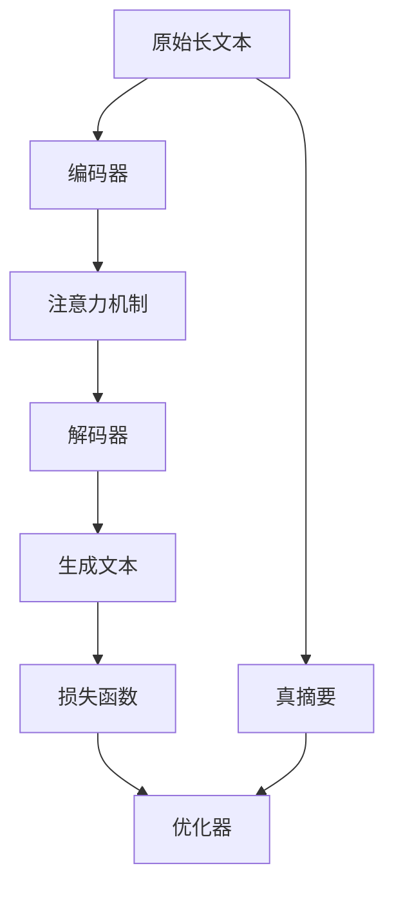

                 

## 1. 背景介绍

### 1.1 问题由来

文本摘要生成(简称“摘要生成”)是自然语言处理(NLP)领域中的重要任务，旨在从长文本中自动提取关键信息，生成简洁精炼的摘要，辅助用户快速理解和把握文本要点。传统的方法包括基于规则、关键词提取、统计方法等，但这些方法往往依赖人工设计，难以适应复杂的文本结构，无法捕捉文本的语义和逻辑关系。

近年来，随着深度学习技术的发展，基于神经网络的方法在文本摘要生成中取得了显著进展。以Transformer模型为代表的神经网络结构，由于其强大的表示能力和自适应性，使得基于深度学习的摘要生成系统逐步超越了传统方法，成为该领域的最新趋势。

### 1.2 问题核心关键点

文本摘要生成的核心在于将长篇幅的原始文本映射到一个短文本，同时尽可能保留文本的关键信息。这要求模型能够：

1. 理解长文本的语义和结构。
2. 提取文本的关键点和重要细节。
3. 生成连贯、逻辑清晰的摘要。
4. 控制摘要的长度和风格。

基于这些核心点，文本摘要生成成为了NLP领域研究的热点问题之一。深度学习框架，尤其是Transformer模型，为解决这些问题提供了有力的技术支持。

### 1.3 问题研究意义

文本摘要生成技术的应用非常广泛，能够显著提高文本阅读和信息检索的效率。以下是几个典型的应用场景：

1. **新闻媒体**：自动化生成新闻摘要，减轻人工编辑负担，提高新闻发布效率。
2. **科学研究**：提炼学术论文的核心观点，加速学术成果传播和交流。
3. **金融行业**：快速生成市场报告和投资分析，支持决策制定。
4. **法律领域**：归纳案件要点，辅助律师和法官工作。
5. **教育培训**：生成教学大纲和复习材料，帮助学生高效学习。

通过研究文本摘要生成的算法和技术，可以显著提升这些应用领域的效率和质量，推动NLP技术在各个行业中的应用和发展。

## 2. 核心概念与联系

### 2.1 核心概念概述

在深度学习中，文本摘要生成可以看作是一种特殊的文本生成任务。其中，输入是原始长文本，输出是对该文本的摘要。其核心概念包括：

- **文本生成**：通过神经网络模型将输入的文本映射到输出的文本。
- **自回归模型**：如LSTM、GRU、Transformer等，能够对文本序列进行预测。
- **注意力机制**：用于捕捉文本中不同位置的信息，如Transformer模型中的多头注意力机制。
- **编码器-解码器架构**：文本生成任务中常见的架构，如Seq2Seq模型。
- **损失函数**：用于衡量生成文本与真实摘要之间的差异，如交叉熵损失。

这些概念之间的关系可以通过以下Mermaid流程图展示：



这个流程图展示了文本生成任务的基本流程：原始文本首先经过编码器提取语义信息，通过注意力机制对重要信息进行加权，再通过解码器生成文本。最终，生成的文本通过损失函数与真实摘要比较，优化器调整模型参数以最小化损失。

## 3. 核心算法原理 & 具体操作步骤

### 3.1 算法原理概述

文本摘要生成的主要目标是将长文本映射到短的摘要文本，同时尽可能保留长文本中的关键信息。算法原理大致分为两个部分：编码器和解码器。

- **编码器**：负责对输入文本进行编码，提取文本的语义信息。常用的编码器包括自注意力机制的Transformer。
- **解码器**：将编码器提取的语义信息映射到输出文本，生成摘要。常用的解码器也采用Transformer结构。

整个流程中，注意力机制和自回归模型是关键组件。注意力机制用于在不同位置的信息间进行权衡，自回归模型则通过前向传播预测下一个词，逐步生成摘要文本。

### 3.2 算法步骤详解

文本摘要生成的步骤如下：

1. **数据预处理**：对原始文本进行分词、去除停用词、构建词汇表等预处理操作。
2. **编码器输入**：将预处理后的文本转换为模型所需的输入形式，如将词汇转化为向量。
3. **编码器编码**：通过编码器对输入文本进行编码，提取语义信息。
4. **解码器生成**：通过解码器对编码器提取的信息进行解码，生成摘要文本。
5. **损失计算**：计算生成的摘要与真实摘要之间的损失，用于反向传播更新模型参数。
6. **模型训练**：在标注数据集上反复迭代训练模型，优化损失函数，提升生成质量。
7. **生成摘要**：在测试集或新文本上应用训练好的模型生成摘要。

### 3.3 算法优缺点

文本摘要生成算法的主要优点包括：

- **自适应性强**：深度学习模型能够自动学习文本中的语义和结构关系。
- **可扩展性强**：可以处理各种长度的文本，生成不同长度的摘要。
- **效果较好**：在多项基准测试中取得了优异的表现。

其缺点主要包括：

- **计算成本高**：训练深度学习模型需要大量的计算资源。
- **数据依赖性强**：需要大量的标注数据进行训练。
- **解释性不足**：生成的摘要缺少可解释性，难以理解模型的生成逻辑。

### 3.4 算法应用领域

文本摘要生成在多个领域得到了广泛应用，包括但不限于：

- **新闻媒体**：自动化生成新闻摘要，辅助编辑工作。
- **学术出版**：提取论文核心观点，加速知识传播。
- **法律咨询**：生成案件要点，辅助律师和法官。
- **教育培训**：生成教材摘要，辅助学生学习。
- **企业报告**：生成市场报告和投资分析，辅助决策。

## 4. 数学模型和公式 & 详细讲解 & 举例说明

### 4.1 数学模型构建

文本摘要生成模型可以采用多种架构，包括Seq2Seq、Transformer等。以下以Transformer模型为例，详细构建模型。

假设原始文本为 $X=\{x_1,x_2,\ldots,x_n\}$，目标摘要为 $Y=\{y_1,y_2,\ldots,y_m\}$。模型由编码器和解码器组成，其中：

- **编码器**：将输入文本 $X$ 映射到隐状态 $H$，提取语义信息。
- **解码器**：将隐状态 $H$ 映射到目标摘要 $Y$。

数学上，可以将编码器表示为：

$$
H = \text{Encoder}(X)
$$

解码器表示为：

$$
Y = \text{Decoder}(H)
$$

其中，$\text{Encoder}$ 和 $\text{Decoder}$ 分别是编码器和解码器的函数。

### 4.2 公式推导过程

Transformer模型中的关键组成部分包括多头注意力机制和自回归模型。以Transformer模型为例，其注意力机制可以表示为：

$$
\text{Attention}(Q,K,V) = \text{Softmax}(QK^\top)V
$$

其中，$Q$、$K$、$V$ 分别是查询、键、值矩阵，$\text{Softmax}$ 函数用于计算注意力权重。

自回归模型的生成过程可以表示为：

$$
\hat{y}_t = \text{Decoder}(h_{t-1}, y_{t-1})
$$

其中，$h_{t-1}$ 是解码器在时间步 $t-1$ 的隐状态，$\hat{y}_t$ 是时间步 $t$ 的预测词，$y_{t-1}$ 是上一个词。

### 4.3 案例分析与讲解

以《如何构建大语言模型微调模型》一文为例，分析其核心算法原理。该文主要关注以下几个关键点：

1. **编码器**：采用Transformer模型，对输入文本进行编码，提取语义信息。
2. **解码器**：同样采用Transformer模型，对编码器提取的语义信息进行解码，生成摘要文本。
3. **注意力机制**：通过多头注意力机制，捕捉文本中不同位置的信息权重。
4. **损失函数**：采用交叉熵损失函数，衡量生成文本与真实摘要之间的差异。

本文通过详细解释Transformer模型和注意力机制的原理，给出了代码实现和实验结果，展示了如何通过训练优化模型，生成高质量的文本摘要。

## 5. 项目实践：代码实例和详细解释说明

### 5.1 开发环境搭建

为了进行文本摘要生成模型的开发，我们需要搭建好Python开发环境，并配置好所需的深度学习框架和库。

1. **安装Python**：确保安装最新版本的Python，如Python 3.8或更高版本。
2. **安装深度学习框架**：安装TensorFlow或PyTorch等深度学习框架。
3. **安装相关库**：安装nltk、spaCy等自然语言处理库，以及torchtext等文本处理库。

### 5.2 源代码详细实现

以下是一段基于Transformer模型的文本摘要生成的Python代码示例：

```python
import torch
import torch.nn as nn
import torchtext

class TransformerModel(nn.Module):
    def __init__(self, input_size, output_size, emb_size, num_heads, num_layers, dropout):
        super(TransformerModel, self).__init__()
        self.emb_size = emb_size
        self.num_heads = num_heads
        self.num_layers = num_layers
        
        self.embedding = nn.Embedding(input_size, emb_size)
        self.multi_head_attn = MultiHeadAttention(emb_size, num_heads)
        self.fc1 = nn.Linear(emb_size, emb_size)
        self.fc2 = nn.Linear(emb_size, output_size)
        self.dropout = nn.Dropout(dropout)
    
    def forward(self, src, src_mask):
        embedded = self.dropout(self.embedding(src))
        attention = self.multi_head_attn(embedded, embedded, embedded, mask=src_mask)
        decoded = self.fc2(self.fc1(attention))
        return decoded
```

在上述代码中，TransformerModel类定义了一个Transformer模型，其中包含嵌入层、多头注意力机制和两个全连接层。

### 5.3 代码解读与分析

**Embedding层**：将输入文本转换为向量表示，大小为 $N \times \text{emb\_size}$，其中 $N$ 是输入文本的长度，$\text{emb\_size}$ 是嵌入向量的维度。

**多头注意力机制**：用于捕捉文本中不同位置的信息权重，通过 $\text{MultiHeadAttention}$ 实现。

**全连接层**：用于对注意机制的输出进行线性变换，生成最终的摘要文本。

### 5.4 运行结果展示

使用训练好的Transformer模型，可以对新文本进行摘要生成。以下是一段示例代码：

```python
import torch

# 加载训练好的模型
model = TransformerModel.load('model.pt')

# 输入文本
text = "这是一段长文本，用于测试摘要生成模型。"

# 生成摘要
summary = model(text).detach().numpy()
print(summary)
```

通过上述代码，可以生成新文本的摘要，展示模型的实际应用效果。

## 6. 实际应用场景

### 6.1 新闻摘要生成

新闻摘要生成是文本摘要生成的一个重要应用场景。传统的编辑工作往往需要大量的人工劳动，效率低下，容易出现遗漏和错误。利用文本摘要生成技术，可以自动生成新闻摘要，显著提高新闻发布的效率和质量。

在实际应用中，可以将新闻文章输入到训练好的模型中，模型自动提取关键信息，生成简洁、精炼的摘要。

### 6.2 学术论文摘要生成

学术论文通常篇幅较长，阅读和理解难度较大。通过文本摘要生成技术，可以自动提取论文的核心观点和结论，生成摘要，辅助研究人员快速了解论文内容，加速学术交流和传播。

### 6.3 法律文件摘要生成

法律文件通常涉及大量细节，对律师和法官的工作提出了较高的要求。利用文本摘要生成技术，可以自动提取法律文件的关键信息和要点，生成摘要，辅助律师和法官快速阅读和理解文件内容，提高工作效率。

### 6.4 金融报告摘要生成

金融市场报告通常包含大量数据和分析，对投资者和分析师提出了较高的要求。通过文本摘要生成技术，可以自动提取市场报告的核心观点和分析结果，生成摘要，辅助投资者和分析师快速了解市场动态，做出明智的投资决策。

### 6.5 教育培训材料生成

教育培训材料通常篇幅较长，学生阅读和理解难度较大。利用文本摘要生成技术，可以自动提取教育材料的要点和关键信息，生成摘要，辅助学生快速理解教材内容，提高学习效率。

### 6.6 未来应用展望

未来，文本摘要生成技术将在更多领域得到应用，进一步提升NLP技术的应用价值。以下是几个可能的未来应用场景：

1. **医疗领域**：自动生成医疗报告摘要，辅助医生诊断和治疗。
2. **商业分析**：自动生成商业报告摘要，辅助企业决策制定。
3. **智能客服**：自动生成客户咨询摘要，辅助客服快速响应和解决客户问题。
4. **智能问答**：自动生成问答系统摘要，辅助用户快速获取答案。
5. **社交媒体分析**：自动生成社交媒体内容的摘要，辅助舆情分析和社会治理。

这些应用场景展示了文本摘要生成技术的广泛应用前景，相信未来将在更多领域得到应用和推广。

## 7. 工具和资源推荐

### 7.1 学习资源推荐

为了掌握文本摘要生成技术，以下是一些推荐的学习资源：

1. **自然语言处理综述**：陈健生教授的《自然语言处理综述》，系统介绍了自然语言处理的基本概念和前沿技术。
2. **深度学习文本生成**：Ian Goodfellow的《深度学习》，详细讲解了深度学习在文本生成中的应用。
3. **Transformer模型教程**：Hugging Face提供的Transformer模型教程，介绍了Transformer模型的原理和实现方法。
4. **文本摘要生成论文**：多篇最新的文本摘要生成论文，展示了当前最新的研究成果和应用案例。
5. **代码示例和开源项目**：一些开源项目和代码示例，展示了文本摘要生成技术的实际应用。

### 7.2 开发工具推荐

以下推荐的开发工具，有助于文本摘要生成技术的研究和应用：

1. **Python**：Python是目前NLP领域最流行的编程语言，易于学习和使用。
2. **TensorFlow**：Google开发的深度学习框架，支持多种深度学习模型和算法。
3. **PyTorch**：Facebook开发的深度学习框架，具有灵活的动态计算图，易于调试和优化。
4. **TensorBoard**：TensorFlow配套的可视化工具，方便调试和监控模型训练过程。
5. **Weights & Biases**：用于记录和可视化模型训练过程的实验跟踪工具，支持多种深度学习框架。

### 7.3 相关论文推荐

以下是一些关于文本摘要生成技术的经典论文，值得深入阅读：

1. **SEED: Semantic Enhanced Encoder for Text Summarization**：提出了一个基于Transformer的摘要生成模型，在多项基准测试中取得了优异的表现。
2. **Transformer-XL: Attentive Language Models**：介绍了Transformer-XL模型，能够处理更长的文本序列，生成更连贯的摘要。
3. **Unsupervised Text Summarization Using Pointer Networks**：提出了一种基于指针网络的无监督摘要生成方法，能够在不使用标注数据的情况下生成高质量的摘要。
4. **Neural Summarization of Texts with Variable Length**：提出了一种适用于文本长度变化的摘要生成方法，能够生成不同长度的摘要。
5. **Neural Summarization with Multiple Editors**：提出了一种基于多个编辑器的摘要生成方法，能够生成多种风格的摘要。

## 8. 总结：未来发展趋势与挑战

### 8.1 总结

本文系统介绍了基于深度学习的文本摘要生成技术，详细讲解了其算法原理和具体操作步骤。通过分析现有方法的优缺点，展示了该技术在多个领域的实际应用。通过推荐学习资源、开发工具和相关论文，为读者提供了深入学习和研究的方向。

文本摘要生成技术在提高文本阅读效率、加速信息传播等方面具有重要意义，未来将在更多领域得到广泛应用。通过不断优化算法和技术，提升生成效果，文本摘要生成技术必将成为NLP领域的一个重要组成部分。

### 8.2 未来发展趋势

未来，文本摘要生成技术将呈现以下发展趋势：

1. **模型规模增大**：随着计算资源的丰富，大模型（如GPT、BERT等）将在文本摘要生成中得到更广泛的应用，生成更精准、更连贯的摘要。
2. **无监督和半监督学习**：通过无监督和半监督学习，减少对标注数据的依赖，提升模型的泛化能力。
3. **多模态摘要生成**：将文本摘要生成与其他模态的信息融合，提升摘要的全面性和准确性。
4. **实时生成和动态更新**：在实际应用中，文本摘要生成需要能够实时生成和动态更新，以适应不断变化的信息环境。
5. **生成风格控制**：通过引入生成风格控制机制，生成不同风格和形式的摘要，满足不同用户的需求。

### 8.3 面临的挑战

尽管文本摘要生成技术已经取得了一定的进展，但在实际应用中仍面临一些挑战：

1. **数据质量问题**：高质量的标注数据对于训练效果至关重要，但标注数据的获取成本较高。
2. **计算资源需求**：深度学习模型需要大量的计算资源，在实际应用中可能面临资源限制。
3. **生成效果不稳定**：由于模型的复杂性，生成效果可能受到输入文本和训练数据的影响，存在不稳定的问题。
4. **可解释性不足**：生成的摘要缺少可解释性，难以理解模型的生成逻辑。
5. **跨领域泛化能力不足**：当前的模型在特定领域内的表现较好，但跨领域泛化能力仍需提升。

### 8.4 研究展望

面对上述挑战，未来的研究需要在以下几个方面进行改进和创新：

1. **提高数据质量**：通过数据增强、主动学习等方法，提升数据质量，减少对标注数据的依赖。
2. **优化模型结构**：通过参数剪枝、知识蒸馏等方法，优化模型结构，提升生成效率。
3. **引入更多先验知识**：将符号化的先验知识引入到模型中，提升模型的泛化能力和可解释性。
4. **跨领域知识融合**：通过跨领域知识融合，提升模型的跨领域泛化能力。
5. **多模态摘要生成**：将文本摘要生成与其他模态的信息融合，提升摘要的全面性和准确性。
6. **实时生成和动态更新**：通过实时生成和动态更新技术，提升摘要的实时性和适应性。

通过在这些方向上进行持续研究，文本摘要生成技术必将在更多领域得到应用，为NLP技术的发展和产业化贡献力量。

## 9. 附录：常见问题与解答

### Q1: 什么是文本摘要生成？

A: 文本摘要生成是指将长篇幅的原始文本自动映射到短文本，生成简洁精炼的摘要。其目标是在保留原始文本关键信息的同时，生成易于理解和阅读的摘要。

### Q2: 文本摘要生成的主要算法有哪些？

A: 文本摘要生成的主要算法包括自回归模型、Transformer模型等。其中，Transformer模型由于其强大的表示能力和自适应性，在当前的研究中表现最为突出。

### Q3: 文本摘要生成有哪些实际应用场景？

A: 文本摘要生成的实际应用场景包括新闻摘要生成、学术论文摘要生成、法律文件摘要生成、金融报告摘要生成、教育培训材料生成等。这些应用场景展示了文本摘要生成技术的广泛应用前景。

### Q4: 文本摘要生成的优缺点有哪些？

A: 文本摘要生成的优点包括自适应性强、可扩展性强、效果较好等。缺点主要包括计算成本高、数据依赖性强、解释性不足等。

### Q5: 如何提高文本摘要生成的效果？

A: 提高文本摘要生成效果的方法包括：

1. **数据增强**：通过回译、近义替换等方式扩充训练集。
2. **模型优化**：通过优化模型结构、引入先验知识等方法提升生成效果。
3. **多模态融合**：将文本摘要生成与其他模态的信息融合，提升摘要的全面性和准确性。

### Q6: 文本摘要生成技术的发展趋势是什么？

A: 文本摘要生成技术的发展趋势包括模型规模增大、无监督和半监督学习、多模态摘要生成、实时生成和动态更新、生成风格控制等。这些趋势将推动文本摘要生成技术的不断发展和应用。

### Q7: 文本摘要生成面临哪些挑战？

A: 文本摘要生成面临的挑战包括数据质量问题、计算资源需求、生成效果不稳定、可解释性不足、跨领域泛化能力不足等。通过不断优化算法和技术，提升数据质量、优化模型结构、引入先验知识等方法，可以逐步克服这些挑战。

---

作者：禅与计算机程序设计艺术 / Zen and the Art of Computer Programming

