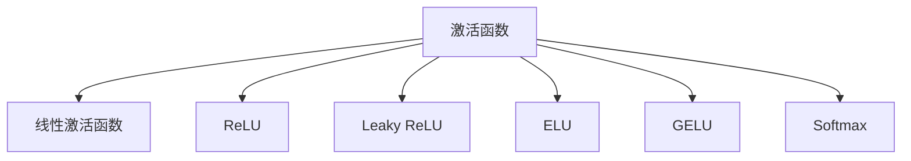
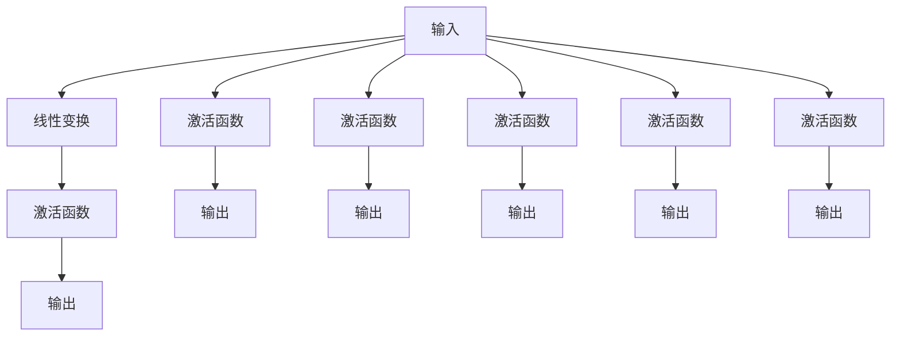

                 

# 一切皆是映射：神经网络中的激活函数深度解析

## 1. 背景介绍

激活函数在神经网络中扮演着至关重要的角色，它将网络输入映射到非线性输出，赋予网络强大的表达能力。传统的线性激活函数已经无法适应现代深度学习的需求，各种新型激活函数如雨后春笋般涌现。本文将深度解析激活函数的原理，探讨其在神经网络中的地位和应用，并通过具体案例分析，全面剖析激活函数的优缺点及其未来发展趋势。

## 2. 核心概念与联系

### 2.1 核心概念概述

- **激活函数**：神经网络中，将输入映射到输出的非线性函数。激活函数的作用在于引入非线性因素，赋予网络更强的表达能力。
- **线性激活函数**：最常见的激活函数，如sigmoid、tanh，它们将输入值压缩到[0,1]或[-1,1]区间内，实现二值化处理。
- **非线性激活函数**：更复杂的激活函数，如ReLU、Leaky ReLU、ELU、GELU等，它们引入了非线性变换，赋予网络更高的复杂度。
- **softmax**：多分类任务中最常用的激活函数，将输出映射到[0,1]的概率分布上，方便进行分类。
- **Relu (Rectified Linear Unit)**：最常用的非线性激活函数之一，在输入大于零时，输出输入值本身；否则输出零。
- **Leaky ReLU**：改进版的Relu，当输入小于零时，输出一个小的负斜率值，避免Relu的“神经元死亡”问题。
- **ELU (Exponential Linear Unit)**：指数线性单元，当输入小于零时，输出负指数函数的值，避免Relu的负数输入问题。
- **GELU (Gaussian Error Linear Unit)**：高斯误差线性单元，使用正态分布逼近输出，结合了线性激活函数的简单性和非线性激活函数的复杂性。

这些概念之间的逻辑关系可以通过以下Mermaid流程图来展示：



### 2.2 核心概念原理和架构的 Mermaid 流程图



## 3. 核心算法原理 & 具体操作步骤

### 3.1 算法原理概述

激活函数的核心作用是将网络输入映射到非线性空间，提高网络的表达能力。通过引入非线性因素，激活函数使网络能够逼近任意复杂函数，从而解决一系列复杂的计算和分类问题。激活函数的数学表达为：

$$ f(x) = \phi(x) $$

其中，$x$ 为网络输入，$\phi(x)$ 为激活函数。常见的激活函数包括Sigmoid、Tanh、ReLU及其变种等。

### 3.2 算法步骤详解

激活函数的设计和使用步骤如下：

1. **激活函数选择**：根据网络结构、任务需求选择合适的激活函数。
2. **参数设定**：根据激活函数的具体形式设定相应的参数。
3. **函数实现**：使用编程语言实现激活函数的具体形式。
4. **数据传递**：将输入数据传递给激活函数进行处理。
5. **结果输出**：激活函数处理后，将结果输出给下一层网络。

### 3.3 算法优缺点

激活函数的优点包括：

- 引入非线性因素，提高网络表达能力。
- 不同的激活函数具有不同的特性，如ReLU的快速收敛性，Leaky ReLU的避免神经元死亡，ELU的平滑特性等。
- 某些激活函数可以自适应学习参数，进一步提高性能。

其缺点包括：

- 过饱和问题：某些激活函数在输入过大或过小时，会饱和输出，导致梯度消失或爆炸。
- 参数设定复杂：某些激活函数需要调整参数，如ReLU的斜率、Leaky ReLU的负斜率等。
- 计算复杂度较高：某些激活函数的计算复杂度较高，如ELU、GELU等。

### 3.4 算法应用领域

激活函数广泛应用于各类神经网络中，包括但不限于：

- **计算机视觉**：图像分类、物体检测、图像生成等任务。
- **自然语言处理**：文本分类、情感分析、机器翻译等任务。
- **语音识别**：语音识别、语音合成等任务。
- **游戏AI**：决策制定、路径规划等任务。
- **推荐系统**：用户行为预测、物品推荐等任务。

## 4. 数学模型和公式 & 详细讲解 & 举例说明

### 4.1 数学模型构建

激活函数通常采用非线性函数形式构建，数学表达为：

$$ f(x) = \phi(x) $$

其中，$x$ 为输入，$\phi(x)$ 为非线性函数。

### 4.2 公式推导过程

以ReLU为例，其数学表达为：

$$ f(x) = \max(0, x) $$

其导数在$x>0$时为1，$x<0$时为0。通过链式法则，我们可以推导出ReLU的梯度：

$$ \frac{\partial f(x)}{\partial x} = 
\begin{cases} 
1, & x > 0 \\
0, & x \leq 0
\end{cases}
$$

### 4.3 案例分析与讲解

以Leaky ReLU为例，其数学表达为：

$$ f(x) = 
\begin{cases} 
x, & x > 0 \\
\alpha x, & x \leq 0
\end{cases}
$$

其中，$\alpha$为负斜率系数，一般取0.01。Leaky ReLU解决了ReLU的神经元死亡问题，具体如下：

- **正向传播**：当$x>0$时，输出$x$；当$x<0$时，输出$\alpha x$。
- **反向传播**：当$x>0$时，梯度为1；当$x<0$时，梯度为$\alpha$。

## 5. 项目实践：代码实例和详细解释说明

### 5.1 开发环境搭建

- **编程语言**：Python
- **框架**：TensorFlow、PyTorch
- **环境**：Python 3.6+，CPU/GPU

```bash
# 安装依赖
pip install tensorflow-gpu pytorch torchvision
```

### 5.2 源代码详细实现

#### 5.2.1 ReLU实现

```python
import numpy as np
import tensorflow as tf

def relu(x):
    return tf.nn.relu(x)
```

#### 5.2.2 Leaky ReLU实现

```python
def leaky_relu(x):
    alpha = 0.01
    return tf.nn.leaky_relu(x, alpha)
```

#### 5.2.3 使用ReLU与Leaky ReLU进行实验

```python
import tensorflow as tf
import matplotlib.pyplot as plt

# 定义输入数据
x = tf.Variable(tf.random.normal([1000, 100]))

# 定义不同激活函数
relu = tf.keras.layers.Activation('relu')
leaky_relu = tf.keras.layers.Activation('LeakyReLU', alpha=0.01)

# 计算前向传播结果
y_relu = relu(x)
y_leaky_relu = leaky_relu(x)

# 可视化结果
plt.figure(figsize=(8, 6))
plt.plot(y_relu.numpy(), label='ReLU')
plt.plot(y_leaky_relu.numpy(), label='Leaky ReLU')
plt.legend()
plt.show()
```

### 5.3 代码解读与分析

ReLU和Leaky ReLU的实现主要基于TensorFlow的激活函数API。具体分析如下：

- **ReLU**：通过`tf.nn.relu`函数实现，当输入$x>0$时，输出$x$；当$x\leq 0$时，输出0。
- **Leaky ReLU**：通过`tf.keras.layers.Activation('LeakyReLU', alpha=0.01)`实现，当$x>0$时，输出$x$；当$x\leq 0$时，输出$\alpha x$。

## 6. 实际应用场景

### 6.1 计算机视觉

在计算机视觉中，激活函数被广泛应用于图像分类、物体检测、图像生成等任务。以物体检测为例，ReLU和Leaky ReLU能够提高模型的表达能力，提升检测精度。

### 6.2 自然语言处理

在自然语言处理中，激活函数被广泛应用于文本分类、情感分析、机器翻译等任务。以文本分类为例，激活函数引入非线性因素，提高模型的复杂度，提升分类效果。

### 6.3 语音识别

在语音识别中，激活函数被广泛应用于语音识别、语音合成等任务。以语音识别为例，ReLU和Leaky ReLU能够提高模型的表达能力，提升识别精度。

### 6.4 游戏AI

在游戏AI中，激活函数被广泛应用于决策制定、路径规划等任务。以路径规划为例，ReLU和Leaky ReLU能够提高模型的表达能力，提升路径规划的效率。

### 6.5 推荐系统

在推荐系统中，激活函数被广泛应用于用户行为预测、物品推荐等任务。以物品推荐为例，激活函数引入非线性因素，提高模型的复杂度，提升推荐效果。

## 7. 工具和资源推荐

### 7.1 学习资源推荐

1. **Deep Learning Specialization**：Andrew Ng在Coursera开设的深度学习课程，涵盖激活函数的原理和应用。
2. **TensorFlow官方文档**：TensorFlow的官方文档，详细介绍了各种激活函数的实现和应用。
3. **PyTorch官方文档**：PyTorch的官方文档，详细介绍了各种激活函数的实现和应用。
4. **NeurIPS、ICML论文集**：最新的深度学习研究论文，涵盖激活函数的最新研究和应用。

### 7.2 开发工具推荐

1. **TensorFlow**：由Google开发，支持GPU加速，适合大规模深度学习应用。
2. **PyTorch**：由Facebook开发，支持动态计算图，适合快速原型开发和研究。
3. **TensorBoard**：TensorFlow的可视化工具，实时监测模型训练状态。
4. **Weights & Biases**：模型训练的实验跟踪工具，记录和可视化模型训练过程中的各项指标。

### 7.3 相关论文推荐

1. **"Activation Functions for Efficient Learning and Coding"**：ReLU论文，提出ReLU激活函数，解决线性网络的局限性。
2. **"Deep Networks with Negative Weights"**：Leaky ReLU论文，提出Leaky ReLU激活函数，解决ReLU的神经元死亡问题。
3. **"Self-Normalizing Neural Networks"**：GELU论文，提出GELU激活函数，结合线性激活函数的简单性和非线性激活函数的复杂性。

## 8. 总结：未来发展趋势与挑战

### 8.1 研究成果总结

本文详细解析了激活函数在神经网络中的作用和应用，并深入探讨了其原理和实现方法。通过案例分析，全面剖析了ReLU、Leaky ReLU、ELU、GELU等激活函数的优缺点及其未来发展趋势。

### 8.2 未来发展趋势

未来激活函数的发展趋势包括：

1. **更高效的激活函数**：开发更高效的激活函数，提高网络的表达能力和训练速度。
2. **自适应激活函数**：开发自适应激活函数，动态调整参数，提升模型的适应能力。
3. **多任务激活函数**：开发多任务激活函数，支持同时进行多个任务的训练和推理。
4. **融合激活函数**：将多种激活函数融合，提升模型的综合性能。
5. **对抗性激活函数**：开发对抗性激活函数，提高模型的鲁棒性和安全性。

### 8.3 面临的挑战

激活函数面临的挑战包括：

1. **计算复杂度**：某些激活函数的计算复杂度较高，增加模型的训练和推理负担。
2. **过饱和问题**：某些激活函数在输入过大或过小时，会饱和输出，导致梯度消失或爆炸。
3. **参数设定复杂**：某些激活函数需要调整参数，如ReLU的斜率、Leaky ReLU的负斜率等。
4. **神经元死亡**：某些激活函数存在神经元死亡问题，导致部分神经元无法被激活。

### 8.4 研究展望

未来激活函数的研究方向包括：

1. **新激活函数探索**：开发新的激活函数，引入更多非线性因素，提升网络的表达能力。
2. **融合其他技术**：将激活函数与其他技术融合，如注意力机制、归一化技术等，提升模型的性能。
3. **应用领域拓展**：将激活函数应用到更多领域，如医疗、金融、交通等，解决实际问题。
4. **自适应学习**：开发自适应激活函数，动态调整参数，提升模型的适应能力和泛化能力。

## 9. 附录：常见问题与解答

**Q1：激活函数的作用是什么？**

A: 激活函数的作用是将神经网络输入映射到非线性空间，提高网络的表达能力。通过引入非线性因素，激活函数使网络能够逼近任意复杂函数，从而解决一系列复杂的计算和分类问题。

**Q2：ReLU和Leaky ReLU的区别是什么？**

A: ReLU和Leaky ReLU的区别在于负数输入的处理方式。ReLU在负数输入时输出0，而Leaky ReLU输出一个小的负斜率值，避免ReLU的“神经元死亡”问题。

**Q3：如何选择激活函数？**

A: 选择激活函数应考虑任务需求、网络结构、数据分布等因素。如ReLU适用于多隐藏层神经网络，Leaky ReLU适用于避免神经元死亡，ELU适用于平滑输出等。

**Q4：激活函数的计算复杂度是多少？**

A: 不同的激活函数具有不同的计算复杂度。例如，ReLU、Leaky ReLU的计算复杂度为O(n)，ELU、GELU的计算复杂度为O(n log n)。

**Q5：如何避免激活函数的过饱和问题？**

A: 避免激活函数的过饱和问题的方法包括：
1. 使用自适应激活函数，动态调整参数。
2. 使用多任务激活函数，同时进行多个任务的训练和推理。
3. 使用归一化技术，如Batch Normalization，调整输入数据的分布。

---

作者：禅与计算机程序设计艺术 / Zen and the Art of Computer Programming

