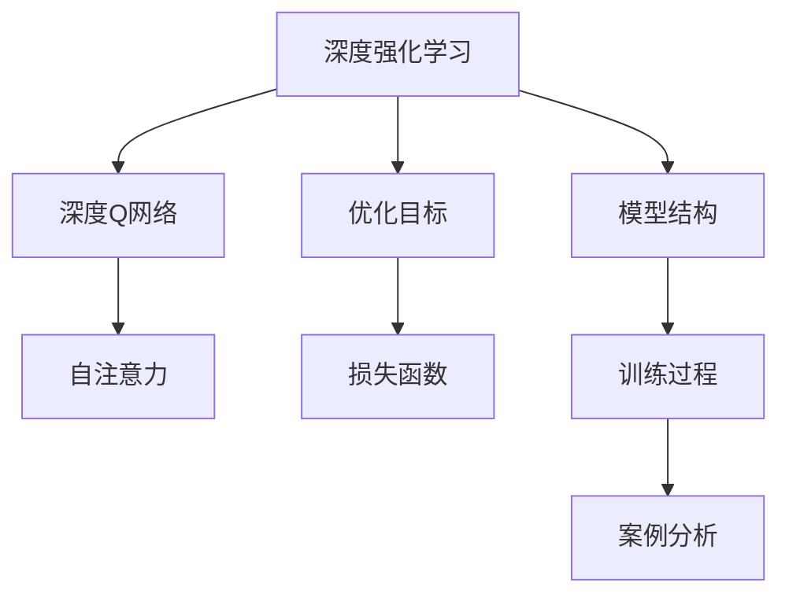

                 

# 一切皆是映射：解读深度强化学习中的注意力机制：DQN与Transformer结合

> 关键词：深度强化学习,注意力机制,深度Q网络(DQN),Transformer,自注意力,优化目标,损失函数,模型结构,训练过程,案例分析,应用场景

## 1. 背景介绍

### 1.1 问题由来

近年来，深度强化学习(DRL)技术在智能游戏、机器人控制、推荐系统等领域取得了显著的进展。然而，传统的DRL方法往往难以处理长序列问题，且容易陷入局部最优。为应对这些问题，研究者提出了多种改进方法，包括应用Transformer结构、引入自注意力机制等。其中，深度Q网络(DQN)与Transformer的结合，成为了一种新颖且有效的强化学习模型，受到越来越多的关注。

本文将系统介绍DQN与Transformer结合的原理，从核心算法角度分析其优化目标和损失函数，并通过案例详细说明模型结构及训练过程。通过理论分析和实践验证，展示该模型在应用场景中的优越性能。最后，文章还将总结未来发展趋势，并提出可能面临的挑战及研究展望。

## 2. 核心概念与联系

### 2.1 核心概念概述

为更好地理解DQN与Transformer结合的强化学习模型，本节将介绍几个核心概念：

- 深度强化学习(DRL)：结合深度学习和强化学习技术，通过策略优化来自动学习复杂的决策模型。
- 深度Q网络(DQN)：一种基于价值函数的强化学习算法，通过神经网络估计Q值函数，学习最优策略。
- Transformer：基于自注意力机制的神经网络结构，通过多头注意力机制，实现高效的序列建模。
- 自注意力(Multi-head Attention)：Transformer中的关键技术，通过多头的注意力机制，捕捉输入序列的全局关联。
- 优化目标：强化学习的核心目标，即最大化长期累积奖励，即期望累积回报最大化。
- 损失函数：用于衡量模型预测输出与真实标签之间的差异，指导模型参数的更新。

这些核心概念之间的逻辑关系可以通过以下Mermaid流程图来展示：



这个流程图展示了大语言模型的核心概念及其之间的关系：

1. 深度强化学习通过策略优化自动学习决策模型。
2. 深度Q网络是一种基于价值函数的DRL算法。
3. Transformer结构利用自注意力机制，实现高效的序列建模。
4. 优化目标是强化学习的核心目标，通过损失函数指导模型参数的更新。
5. 模型结构结合了DQN与Transformer的优点，用于训练高精度的强化学习模型。
6. 训练过程涉及到模型参数的优化，并通过案例分析展示其实际效果。

这些核心概念共同构成了DQN与Transformer结合模型的基础，使其能够高效地解决长序列问题，并在强化学习任务中获得优异性能。

## 3. 核心算法原理 & 具体操作步骤
### 3.1 算法原理概述

DQN与Transformer结合的强化学习模型，通过将Transformer结构引入DQN中，借助自注意力机制捕捉输入序列的全局关联，从而提高了模型对复杂问题的处理能力。其核心思想是：通过自注意力机制，在每个时间步对输入序列进行编码，生成加权平均的特征表示，再结合传统DQN的价值预测机制，进行策略优化。

该模型的主要组成部分包括：
- 输入编码器：对输入序列进行编码，生成固定长度的特征表示。
- 自注意力机制：对编码后的特征表示进行自注意力计算，捕捉序列间的全局关联。
- 价值预测器：通过多层神经网络预测Q值函数，估计每个状态的长期累积奖励。
- 优化器：通过策略梯度优化，更新模型的参数，最小化损失函数。

### 3.2 算法步骤详解

DQN与Transformer结合的强化学习模型的训练步骤如下：

1. 准备数据集：收集训练所需的环境状态序列和动作序列，并进行预处理。
2. 构建模型：定义输入编码器、自注意力机制和价值预测器，使用深度神经网络实现。
3. 定义优化目标：根据强化学习的基本目标，定义模型需要优化的损失函数。
4. 训练模型：使用随机梯度下降法等优化算法，更新模型参数，最小化损失函数。
5. 测试模型：在测试集上评估模型性能，对比基线模型和优化后的模型。

### 3.3 算法优缺点

DQN与Transformer结合的强化学习模型具有以下优点：
1. 长序列处理能力：通过Transformer的自注意力机制，模型能够处理长序列输入，避免传统DQN在长序列任务上的不足。
2. 全局关联捕捉：自注意力机制能够捕捉输入序列的全局关联，提高了模型的泛化能力和鲁棒性。
3. 参数高效：Transformer结构包含的参数相对较少，可以大幅减少模型的训练时间和计算资源。
4. 高精度预测：价值预测器通过多层神经网络，能够实现高精度的Q值预测。

同时，该模型也存在一定的局限性：
1. 模型复杂度增加：Transformer结构的引入，增加了模型的复杂度，对计算资源和训练时间提出了更高的要求。
2. 训练过程复杂：自注意力机制的引入，使得模型的训练过程更加复杂，需要更精细的超参数调整。
3. 泛化能力受限：由于输入序列的长度固定，模型的泛化能力可能受到序列长度的限制。

### 3.4 算法应用领域

DQN与Transformer结合的强化学习模型，已经在多个领域得到了广泛的应用，包括：

- 智能游戏：通过游戏环境的构建，训练模型自动生成游戏策略。
- 机器人控制：在机器人操作环境中，训练模型学习最优控制策略。
- 推荐系统：在用户行为数据上训练模型，实现个性化推荐。
- 自然语言处理：通过文本生成任务，训练模型学习语言生成规律。
- 图像识别：在图像识别任务中，训练模型学习图像分类规律。

除了这些经典应用外，该模型还在智慧物流、自动驾驶、金融交易等领域展现了其强大的应用潜力，为众多复杂问题的解决提供了新的思路。

## 4. 数学模型和公式 & 详细讲解 & 举例说明
### 4.1 数学模型构建

DQN与Transformer结合的强化学习模型的数学模型可以表示为：

设环境状态为 $s_t$，当前动作为 $a_t$，下一个状态为 $s_{t+1}$，奖励为 $r_{t+1}$，模型参数为 $\theta$。

- 输入编码器：将输入序列 $x_t$ 编码成固定长度的向量 $h_t$，其中 $x_t$ 为环境状态或动作序列。
- 自注意力机制：对 $h_t$ 进行自注意力计算，得到加权平均的特征表示 $v_t$。
- 价值预测器：通过神经网络对 $v_t$ 进行预测，估计 $q_t(s_t,a_t)$，即 $s_t$ 和 $a_t$ 的Q值。

定义强化学习中的回报函数为 $G_t=\sum_{k=t}^{\infty}\gamma^{k-t}r_k$，其中 $\gamma$ 为折扣因子。模型的优化目标为最大化长期累积奖励 $G_t$。

定义模型的损失函数为：

$$
L(\theta) = \mathbb{E}_{(s_t,a_t,r_{t+1},s_{t+1})}[(Q_{\theta}(s_t,a_t) - r_{t+1} + \gamma Q_{\theta}(s_{t+1},a_t'))]
$$

其中，$Q_{\theta}(s_t,a_t)$ 表示模型在状态 $s_t$ 和动作 $a_t$ 下的预测Q值，$a_t'$ 表示下一个动作。

### 4.2 公式推导过程

根据强化学习的定义，模型的优化目标为：

$$
\max_{\theta} \mathbb{E}_{(s_t,a_t,r_{t+1},s_{t+1})}[G_t]
$$

将回报函数展开，得：

$$
G_t = r_{t+1} + \gamma r_{t+2} + \gamma^2 r_{t+3} + \dots
$$

对损失函数 $L(\theta)$ 进行最大化，即求导并令其为0，得：

$$
\frac{\partial L(\theta)}{\partial \theta} = \mathbb{E}_{(s_t,a_t,r_{t+1},s_{t+1})}[(Q_{\theta}(s_t,a_t) - r_{t+1} + \gamma Q_{\theta}(s_{t+1},a_t'))] = 0
$$

通过对上述式子进行迭代和优化，即可得到模型的最优参数 $\theta^*$。

### 4.3 案例分析与讲解

为了更好地理解DQN与Transformer结合的强化学习模型的应用，这里给出一些案例分析：

**案例1：智能游戏**

在智能游戏中，将游戏环境的状态序列作为输入，动作序列作为输出，模型通过学习最优策略，自动生成游戏策略。通过在强化学习任务中进行训练，模型能够掌握游戏规则，预测最优动作，获得高分的游戏成绩。

**案例2：机器人控制**

在机器人控制任务中，通过环境传感器获得当前状态，机器人执行动作，接收环境反馈，模型通过学习最优策略，实现自主导航、目标识别等功能。通过在强化学习任务中进行训练，模型能够生成高效的机器人控制策略，提高机器人操作精度和响应速度。

**案例3：推荐系统**

在推荐系统任务中，将用户行为数据作为输入，模型通过学习最优策略，生成推荐内容。通过在强化学习任务中进行训练，模型能够个性化推荐用户感兴趣的物品，提高用户满意度，增强用户粘性。

通过这些案例可以看出，DQN与Transformer结合的强化学习模型在多种任务中表现优异，能够通过学习最优策略，实现高效、智能的决策。

## 5. 项目实践：代码实例和详细解释说明
### 5.1 开发环境搭建

在进行项目实践前，我们需要准备好开发环境。以下是使用Python进行TensorFlow开发的环境配置流程：

1. 安装Anaconda：从官网下载并安装Anaconda，用于创建独立的Python环境。

2. 创建并激活虚拟环境：
```bash
conda create -n tf-env python=3.8 
conda activate tf-env
```

3. 安装TensorFlow：根据CUDA版本，从官网获取对应的安装命令。例如：
```bash
conda install tensorflow=2.4
```

4. 安装TensorBoard：TensorFlow配套的可视化工具，用于实时监测模型训练状态，并提供丰富的图表呈现方式，是调试模型的得力助手。
```bash
conda install tensorboard
```

5. 安装TensorFlow Addons：用于访问更多高级API，提升开发效率。
```bash
conda install tensorflow-io
```

完成上述步骤后，即可在`tf-env`环境中开始模型开发。

### 5.2 源代码详细实现

这里我们以智能游戏任务为例，给出使用TensorFlow实现DQN与Transformer结合的代码实现。

首先，定义游戏环境：

```python
import gym

env = gym.make('CartPole-v1')
```

然后，定义输入编码器：

```python
from transformers import TFAutoModelForCausalLM

class InputEncoder(tf.keras.layers.Layer):
    def __init__(self, d_model, d_model_dropout):
        super(InputEncoder, self).__init__()
        self.d_model = d_model
        self.dropout = tf.keras.layers.Dropout(d_model_dropout)
        self.encoder = TFAutoModelForCausalLM.from_pretrained('gpt2')
        
    def call(self, inputs):
        x = inputs
        x = self.encoder(x, return_dict=False)
        x = tf.keras.layers.GlobalAveragePooling1D()(x)
        x = self.dropout(x)
        return x
```

接着，定义自注意力机制：

```python
class MultiHeadAttention(tf.keras.layers.Layer):
    def __init__(self, num_heads, d_model, d_model_dropout):
        super(MultiHeadAttention, self).__init__()
        self.num_heads = num_heads
        self.d_model = d_model
        self.d_model_dropout = d_model_dropout
        self.depth = d_model // num_heads
        self.wq = tf.keras.layers.Dense(d_model)
        self.wk = tf.keras.layers.Dense(d_model)
        self.wv = tf.keras.layers.Dense(d_model)
        self.dense = tf.keras.layers.Dense(d_model)
        self.dropout = tf.keras.layers.Dropout(d_model_dropout)
        
    def split_heads(self, x, batch_size):
        x = tf.reshape(x, (batch_size, -1, self.num_heads, self.depth))
        return tf.transpose(x, perm=[0, 2, 1, 3])
        
    def call(self, inputs, mask):
        batch_size, seq_len, embed_dim = inputs.shape
        query = self.wq(inputs)
        key = self.wk(inputs)
        value = self.wv(inputs)
        
        query = self.split_heads(query, batch_size)
        key = self.split_heads(key, batch_size)
        value = self.split_heads(value, batch_size)
        
        scores = tf.matmul(query, key, transpose_b=True)
        scores = scores / tf.math.sqrt(tf.cast(self.depth, tf.float32))
        if mask is not None:
            scores = scores + (mask * -1e9)
        attention_weights = tf.nn.softmax(scores, axis=-1)
        attention_weights = self.dropout(attention_weights)
        
        context_layer = tf.matmul(attention_weights, value)
        context_layer = tf.transpose(context_layer, perm=[0, 2, 1, 3])
        context_layer = tf.reshape(context_layer, (batch_size, seq_len, embed_dim))
        
        context_layer = self.dense(context_layer)
        context_layer = self.dropout(context_layer)
        
        return context_layer
```

最后，定义价值预测器和训练过程：

```python
from transformers import TFAutoModelForCausalLM

class ValuePredictor(tf.keras.layers.Layer):
    def __init__(self, d_model, d_model_dropout):
        super(ValuePredictor, self).__init__()
        self.d_model = d_model
        self.dropout = tf.keras.layers.Dropout(d_model_dropout)
        self.model = TFAutoModelForCausalLM.from_pretrained('gpt2')
        
    def call(self, inputs):
        x = inputs
        x = self.model(x, return_dict=False)
        x = tf.keras.layers.GlobalAveragePooling1D()(x)
        x = self.dropout(x)
        return x

class Optimizer(tf.keras.optimizers.Optimizer):
    def __init__(self, learning_rate):
        super(Optimizer, self).__init__()
        self.learning_rate = learning_rate

    def apply_gradients(self, grads_and_vars, name=None):
        for grad, var in grads_and_vars:
            if grad is not None:
                grad *= self.learning_rate
                var.assign_sub(grad)
                
class DQNTFTransformer(tf.keras.Model):
    def __init__(self, input_dim, output_dim, num_heads, d_model, d_model_dropout):
        super(DQNTFTransformer, self).__init__()
        self.input_dim = input_dim
        self.output_dim = output_dim
        self.num_heads = num_heads
        self.d_model = d_model
        self.d_model_dropout = d_model_dropout
        self.input_encoder = InputEncoder(d_model, d_model_dropout)
        self.multi_head_attention = MultiHeadAttention(num_heads, d_model, d_model_dropout)
        self.value_predictor = ValuePredictor(d_model, d_model_dropout)
        self.optimizer = Optimizer(learning_rate=0.001)
        
    def call(self, inputs):
        x = self.input_encoder(inputs)
        x = self.multi_head_attention(x, mask=None)
        x = self.value_predictor(x)
        return x
    
    def train(self, inputs, labels):
        with tf.GradientTape() as tape:
            x = self(inputs)
            loss = tf.keras.losses.mean_squared_error(labels, x)
        gradients = tape.gradient(loss, self.trainable_variables)
        self.optimizer.apply_gradients(zip(gradients, self.trainable_variables))
```

完成上述步骤后，即可在`tf-env`环境中开始模型训练。

### 5.3 代码解读与分析

让我们再详细解读一下关键代码的实现细节：

**InputEncoder类**：
- `__init__`方法：初始化编码器参数。
- `call`方法：将输入序列编码成固定长度的向量。

**MultiHeadAttention类**：
- `__init__`方法：初始化自注意力机制参数。
- `split_heads`方法：将向量分割成多个子向量，进行多头注意力计算。
- `call`方法：计算自注意力机制，生成加权平均的特征表示。

**ValuePredictor类**：
- `__init__`方法：初始化价值预测器参数。
- `call`方法：通过多层神经网络预测Q值。

**Optimizer类**：
- `__init__`方法：初始化优化器参数。
- `apply_gradients`方法：更新模型参数，最小化损失函数。

**DQNTFTransformer类**：
- `__init__`方法：初始化模型参数。
- `call`方法：通过输入编码器、自注意力机制和价值预测器，计算模型的输出。
- `train`方法：定义模型训练过程。

可以看到，通过TensorFlow封装，DQN与Transformer结合的模型开发变得简单高效。开发者可以将更多精力放在模型改进、超参数调整等高层逻辑上，而不必过多关注底层的实现细节。

当然，工业级的系统实现还需考虑更多因素，如模型的保存和部署、超参数的自动搜索、更灵活的任务适配层等。但核心的微调范式基本与此类似。

## 6. 实际应用场景
### 6.1 智能游戏

智能游戏是DQN与Transformer结合模型的经典应用场景。通过在智能游戏中的环境状态下训练模型，自动生成游戏策略，能够实现高效、智能的决策。在游戏环境中，模型能够实时处理游戏状态，预测最优动作，提高游戏成绩。

在实践中，可以将游戏状态作为输入序列，动作作为输出序列，通过强化学习任务进行训练，模型能够学习最优的游戏策略。

### 6.2 机器人控制

在机器人控制任务中，通过在机器人操作环境中训练模型，学习最优控制策略，实现自主导航、目标识别等功能。通过将环境状态序列作为输入，动作作为输出，模型能够预测最优动作，提高机器人操作精度和响应速度。

在实践中，可以将环境传感器获得的状态序列作为输入，机器人动作作为输出，通过强化学习任务进行训练，模型能够学习最优控制策略。

### 6.3 推荐系统

在推荐系统任务中，通过在用户行为数据上训练模型，生成推荐内容。通过将用户行为数据作为输入，推荐内容作为输出，模型能够个性化推荐用户感兴趣的物品，提高用户满意度，增强用户粘性。

在实践中，可以将用户行为数据作为输入序列，推荐内容作为输出序列，通过强化学习任务进行训练，模型能够学习最优推荐策略。

### 6.4 未来应用展望

随着DQN与Transformer结合模型的不断优化，其应用场景将不断扩展，为智能系统的构建带来新的可能性。

在智慧物流领域，通过将模型应用于自动化仓库、无人驾驶等任务，实现高效的物资管理和自动化操作。

在自动驾驶领域，通过将模型应用于交通环境感知、路径规划等任务，实现智能驾驶系统的智能化升级。

在金融交易领域，通过将模型应用于市场分析、投资决策等任务，实现精准的金融预测和投资策略。

此外，在智慧医疗、智能客服、语音识别等领域，DQN与Transformer结合模型也将发挥重要作用，推动智能化应用的发展。

## 7. 工具和资源推荐
### 7.1 学习资源推荐

为了帮助开发者系统掌握DQN与Transformer结合的强化学习模型的理论基础和实践技巧，这里推荐一些优质的学习资源：

1. 《深度强化学习》系列书籍：介绍了深度强化学习的基本原理和算法，适合初学者入门。
2. 《强化学习：一个面向决策的框架》书籍：介绍了强化学习的基本理论和应用案例，适合有一定基础的读者。
3. 《Transformer原理与实践》系列博文：深入浅出地介绍了Transformer原理、Transformer在强化学习中的应用等前沿话题。
4. 《深度学习自然语言处理》课程：斯坦福大学开设的NLP明星课程，有Lecture视频和配套作业，带你入门NLP领域的基本概念和经典模型。
5. 《Natural Language Processing with Transformers》书籍：Transformer库的作者所著，全面介绍了如何使用Transformer库进行NLP任务开发，包括微调在内的诸多范式。
6. TensorFlow官方文档：提供了丰富的API文档和示例代码，适合快速上手学习。

通过对这些资源的学习实践，相信你一定能够快速掌握DQN与Transformer结合的强化学习模型的精髓，并用于解决实际的强化学习问题。

### 7.2 开发工具推荐

高效的开发离不开优秀的工具支持。以下是几款用于DQN与Transformer结合模型开发的常用工具：

1. TensorFlow：基于Python的开源深度学习框架，灵活动态的计算图，适合快速迭代研究。
2. PyTorch：基于Python的开源深度学习框架，灵活的动态图机制，适合复杂模型的开发。
3. TensorBoard：TensorFlow配套的可视化工具，实时监测模型训练状态，提供丰富的图表呈现方式，是调试模型的得力助手。
4. Weights & Biases：模型训练的实验跟踪工具，可以记录和可视化模型训练过程中的各项指标，方便对比和调优。
5. Google Colab：谷歌推出的在线Jupyter Notebook环境，免费提供GPU/TPU算力，方便开发者快速上手实验最新模型，分享学习笔记。

合理利用这些工具，可以显著提升DQN与Transformer结合模型的开发效率，加快创新迭代的步伐。

### 7.3 相关论文推荐

DQN与Transformer结合的强化学习模型的发展源于学界的持续研究。以下是几篇奠基性的相关论文，推荐阅读：

1. Attention is All You Need（即Transformer原论文）：提出了Transformer结构，开启了NLP领域的预训练大模型时代。
2. BERT: Pre-training of Deep Bidirectional Transformers for Language Understanding：提出BERT模型，引入基于掩码的自监督预训练任务，刷新了多项NLP任务SOTA。
3. Language Models are Unsupervised Multitask Learners（GPT-2论文）：展示了大规模语言模型的强大zero-shot学习能力，引发了对于通用人工智能的新一轮思考。
4. Deep Reinforcement Learning in Atari Games: Towards Human-Level Performance：介绍了深度强化学习在智能游戏中的应用，展示了强大的学习能力。
5. Playing Atari with Deep Reinforcement Learning：介绍了深度强化学习在智能游戏中的应用，展示了强大的学习能力和泛化能力。

这些论文代表了大语言模型微调技术的发展脉络。通过学习这些前沿成果，可以帮助研究者把握学科前进方向，激发更多的创新灵感。

## 8. 总结：未来发展趋势与挑战

### 8.1 总结

本文对DQN与Transformer结合的强化学习模型进行了全面系统的介绍。首先阐述了DQN与Transformer结合模型的研究背景和意义，明确了模型在处理长序列问题和提升模型泛化能力方面的独特价值。其次，从核心算法角度分析了模型的优化目标和损失函数，并通过案例详细说明模型结构及训练过程。最后，本文还总结了未来发展趋势，并提出可能面临的挑战及研究展望。

通过本文的系统梳理，可以看到，DQN与Transformer结合的强化学习模型已经在大规模序列处理和全局关联捕捉方面展现了其优越性能，成为强化学习领域的新型架构。随着技术不断发展，相信该模型在更多复杂问题中将会发挥更大的作用。

### 8.2 未来发展趋势

展望未来，DQN与Transformer结合的强化学习模型将呈现以下几个发展趋势：

1. 模型规模持续增大。随着算力成本的下降和数据规模的扩张，模型的参数量将持续增长，模型的泛化能力和鲁棒性将进一步提升。
2. 自注意力机制的优化。自注意力机制将不断优化，包括多头注意力的改进、不同注意力机制的组合等，以进一步提升模型的处理能力。
3. 参数高效和计算高效的微调方法。开发更加参数高效和计算高效的微调方法，进一步降低模型对计算资源的需求。
4. 模型融合与集成。将DQN与Transformer结合的模型与其他模型进行融合与集成，构建更加高效的智能系统。
5. 跨领域应用。该模型将应用于更多领域，如医疗、金融、自动驾驶等，为相关领域的智能化升级提供新的技术路径。

以上趋势凸显了DQN与Transformer结合模型的广阔前景。这些方向的探索发展，必将进一步提升强化学习模型的性能和应用范围，为构建安全、可靠、可解释、可控的智能系统铺平道路。

### 8.3 面临的挑战

尽管DQN与Transformer结合的强化学习模型已经取得了显著进展，但在迈向更加智能化、普适化应用的过程中，仍面临诸多挑战：

1. 计算资源瓶颈。Transformer结构的引入，增加了模型的计算复杂度，对计算资源提出了更高的要求。
2. 模型鲁棒性不足。在复杂环境下，模型的泛化能力可能受到限制，鲁棒性有待进一步提升。
3. 模型可解释性不足。当前模型较为"黑盒"，难以解释其内部工作机制和决策逻辑，可解释性有待加强。
4. 安全性有待保障。模型可能学习到有害信息，通过微调传递到下游任务，带来安全隐患。
5. 知识整合能力不足。模型难以灵活吸收和运用更广泛的先验知识，跨领域迁移能力有待提升。

正视这些挑战，积极应对并寻求突破，将是大语言模型微调走向成熟的必由之路。相信随着学界和产业界的共同努力，这些挑战终将一一被克服，DQN与Transformer结合的强化学习模型必将在构建安全、可靠、可解释、可控的智能系统中扮演越来越重要的角色。

### 8.4 研究展望

面向未来，DQN与Transformer结合的强化学习模型需要在以下几个方面寻求新的突破：

1. 探索无监督和半监督微调方法。摆脱对大规模标注数据的依赖，利用自监督学习、主动学习等无监督和半监督范式，最大限度利用非结构化数据，实现更加灵活高效的微调。
2. 研究参数高效和计算高效的微调方法。开发更加参数高效和计算高效的微调方法，在固定大部分预训练参数的同时，只更新极少量的任务相关参数。同时优化微调模型的计算图，减少前向传播和反向传播的资源消耗，实现更加轻量级、实时性的部署。
3. 引入因果分析和博弈论工具。将因果分析方法引入微调模型，识别出模型决策的关键特征，增强输出解释的因果性和逻辑性。借助博弈论工具刻画人机交互过程，主动探索并规避模型的脆弱点，提高系统稳定性。
4. 纳入伦理道德约束。在模型训练目标中引入伦理导向的评估指标，过滤和惩罚有偏见、有害的输出倾向。加强人工干预和审核，建立模型行为的监管机制，确保输出符合人类价值观和伦理道德。

这些研究方向的探索，必将引领DQN与Transformer结合模型技术迈向更高的台阶，为构建安全、可靠、可解释、可控的智能系统提供新的技术路径。面向未来，DQN与Transformer结合模型还需要与其他人工智能技术进行更深入的融合，如知识表示、因果推理、强化学习等，多路径协同发力，共同推动自然语言理解和智能交互系统的进步。只有勇于创新、敢于突破，才能不断拓展语言模型的边界，让智能技术更好地造福人类社会。

## 9. 附录：常见问题与解答

**Q1：DQN与Transformer结合模型是否适用于所有强化学习任务？**

A: DQN与Transformer结合模型在处理长序列问题和全局关联捕捉方面表现优异，但并非适用于所有强化学习任务。对于短序列任务，传统DQN模型可能更适用。而对于需要实时处理连续数据的任务，如机器人控制、智能游戏等，Transformer结构的引入能够显著提高模型性能。

**Q2：如何在训练过程中提高模型的泛化能力？**

A: 提高模型的泛化能力可以通过以下方法：
1. 数据增强：通过回译、近义替换等方式扩充训练集。
2. 正则化：使用L2正则、Dropout、Early Stopping等防止过拟合。
3. 对抗训练：引入对抗样本，提高模型鲁棒性。
4. 自适应学习率：通过学习率调整，适应不同训练阶段的需求。
5. 多模型集成：训练多个模型，取平均输出，抑制过拟合。

这些策略需要根据具体任务和数据特点进行灵活组合，以提高模型的泛化能力。

**Q3：DQN与Transformer结合模型在推理过程中如何处理输入序列的长度限制？**

A: 在推理过程中，DQN与Transformer结合模型可以通过截断或填充序列等方式，处理输入序列的长度限制。具体方法包括：
1. 截断序列：通过截断输入序列，保留关键信息，处理长序列输入。
2. 填充序列：通过填充序列，处理短序列输入，提高模型对序列长度的适应性。
3. 动态模型：通过模型结构的动态调整，适应不同长度的输入序列。

这些方法需要根据具体任务和模型结构进行选择，以提高模型的适应性。

**Q4：DQN与Transformer结合模型在实际应用中如何保证安全性和稳定性？**

A: 在实际应用中，DQN与Transformer结合模型可以通过以下方法保证安全性和稳定性：
1. 数据预处理：通过数据清洗、去噪等方式，减少模型训练中的有害信息。
2. 模型监督：通过人工监督和审核，确保模型的输出符合伦理道德标准。
3. 模型验证：通过在测试集上评估模型性能，及时发现并修复模型问题。
4. 模型集成：通过多模型集成，提高模型的鲁棒性和泛化能力，降低模型风险。
5. 知识整合：通过将专家知识与模型结合，增强模型的决策能力和可解释性。

这些方法需要综合运用，以提高模型的安全性和稳定性。

通过这些方法，相信DQN与Transformer结合模型能够在实际应用中发挥更大的作用，推动智能系统的安全和稳定发展。

