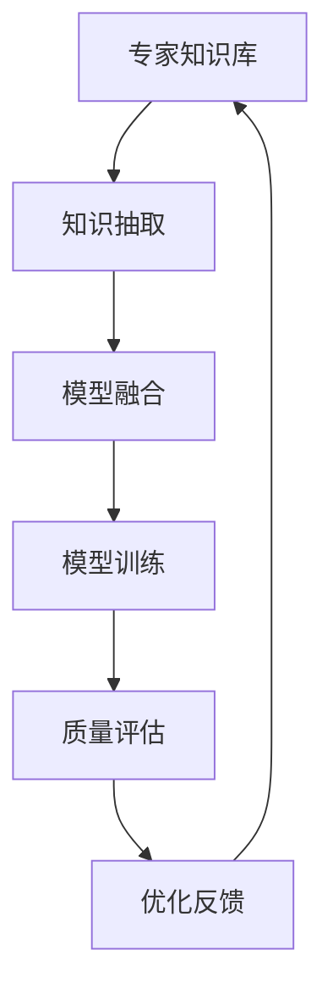

                 

# 专家经验在生产中的固化

## 1. 背景介绍

### 1.1 问题由来
随着人工智能(AI)技术的快速发展，越来越多的企业和组织开始利用AI技术提升生产效率和业务表现。然而，尽管AI模型在学术界取得了显著的进展，但在实际生产环境中，专家经验仍然发挥着至关重要的作用。AI模型的泛化能力、可靠性、鲁棒性等因素，常常需要与人类专家的知识和经验相结合，才能更好地适应复杂的现实世界问题。

专家经验在生产中的固化，是指将专家的知识和经验转化为可被AI模型理解和应用的规则、策略和知识库，从而提升AI模型的表现和可信度。这种转化不仅可以提升模型的鲁棒性和适用性，还可以加速AI模型的部署和应用。

### 1.2 问题核心关键点
专家经验在生产中的固化涉及多个关键点，包括但不限于：

- **知识表示**：如何将专家知识有效地表示为结构化或非结构化数据。
- **知识抽取**：从专家知识中自动抽取有价值的特征和规则。
- **模型融合**：如何将专家经验与AI模型进行无缝融合，实现协同决策。
- **质量评估**：如何对固化的专家经验进行评估，确保其有效性。
- **持续学习**：如何使固化的专家经验能够随时间更新，保持其最新性和适用性。

### 1.3 问题研究意义
专家经验在生产中的固化，对于提升AI系统的表现、可信度和适用性具有重要意义：

1. **增强鲁棒性**：通过融入专家的知识和经验，AI模型可以更好地处理不确定性和异常情况，增强其鲁棒性。
2. **提升性能**：专家经验可以为模型提供关键的决策依据，提升其预测和推理的准确性。
3. **加速部署**：通过固化专家经验，可以快速将AI模型应用于生产环境，减少技术转化周期。
4. **促进合作**：专家经验和AI模型的结合，可以促进人机协同，增强决策的科学性和多样性。
5. **持续改进**：固化的专家经验可以通过不断更新，适应新的业务环境和挑战。

## 2. 核心概念与联系

### 2.1 核心概念概述

为了更好地理解专家经验在生产中的固化过程，我们将介绍几个关键概念：

- **专家知识库**：存储专家知识的结构化或非结构化数据库，可以包括规则、策略、案例、决策树等。
- **知识抽取**：从专家知识库中自动或半自动抽取有用的特征和规则，转化为模型可用的输入。
- **模型融合**：将专家经验与AI模型进行结合，形成统一的决策机制。
- **模型训练**：基于专家经验和实际数据对AI模型进行训练，提升其泛化能力。
- **质量评估**：对固化的专家经验进行评估，确保其有效性和适用性。

### 2.2 核心概念原理和架构的 Mermaid 流程图



这个流程图展示了专家经验在生产中的固化过程：专家知识库中的知识通过抽取和融合，与AI模型结合，并经过训练和质量评估，最终形成优化的模型，并不断反馈优化，形成闭环。

## 3. 核心算法原理 & 具体操作步骤

### 3.1 算法原理概述

专家经验在生产中的固化过程，可以通过以下步骤来实现：

1. **数据准备**：收集和整理专家知识和经验，将其表示为结构化或非结构化数据。
2. **知识抽取**：自动或半自动地从专家知识中抽取有用的特征和规则。
3. **模型融合**：将专家经验与AI模型进行结合，形成统一的决策机制。
4. **模型训练**：基于专家经验和实际数据对AI模型进行训练，提升其泛化能力。
5. **质量评估**：对固化的专家经验进行评估，确保其有效性和适用性。
6. **优化反馈**：根据评估结果和实际应用反馈，对专家经验进行优化和更新。

### 3.2 算法步骤详解

#### 3.2.1 数据准备

数据准备是专家经验固化的第一步。主要包括以下几个步骤：

1. **知识收集**：通过访谈、文档、视频等形式，收集专家知识和经验。
2. **数据清洗**：对收集到的数据进行清洗，去除噪音和冗余信息。
3. **数据表示**：将清洗后的数据转换为结构化或非结构化形式，以便后续处理。

#### 3.2.2 知识抽取

知识抽取是专家经验固化的关键步骤。主要包括以下几种方法：

1. **规则抽取**：通过规则推理系统，自动提取专家知识中的规则和策略。
2. **特征抽取**：使用自然语言处理(NLP)技术，自动提取专家知识中的特征和标签。
3. **案例抽取**：通过案例推理系统，自动提取专家知识中的成功案例和失败教训。

#### 3.2.3 模型融合

模型融合是将专家经验与AI模型结合的过程。主要包括以下几个步骤：

1. **模型选择**：选择合适的AI模型作为融合对象，如决策树、深度学习等。
2. **特征注入**：将抽取到的专家特征注入到模型中，提升其决策能力。
3. **规则注入**：将专家规则转化为模型可执行的逻辑，形成统一的决策机制。

#### 3.2.4 模型训练

模型训练是提升AI模型性能的关键步骤。主要包括以下几个步骤：

1. **数据准备**：准备训练数据，包括专家知识库中的案例数据和实际应用数据。
2. **模型训练**：使用优化算法，对融合了专家经验的AI模型进行训练。
3. **超参数调优**：根据训练结果，调整模型的超参数，提升其性能。

#### 3.2.5 质量评估

质量评估是确保专家经验有效的关键步骤。主要包括以下几个步骤：

1. **性能评估**：使用标准评估指标，如准确率、召回率、F1值等，评估模型性能。
2. **专家评审**：邀请领域专家对模型结果进行评审，确保其符合实际需求。
3. **用户反馈**：收集用户反馈，了解模型在实际应用中的表现。

#### 3.2.6 优化反馈

优化反馈是持续改进专家经验的关键步骤。主要包括以下几个步骤：

1. **结果分析**：分析模型结果，识别问题所在。
2. **知识更新**：根据分析结果，更新专家知识库，补充缺失的信息。
3. **模型优化**：基于新知识，对模型进行重新训练，提升其性能。

### 3.3 算法优缺点

专家经验在生产中的固化方法具有以下优点：

1. **提升性能**：通过融合专家经验，AI模型可以更好地处理不确定性和异常情况，提升其预测和推理的准确性。
2. **增强鲁棒性**：专家经验可以为模型提供关键的决策依据，增强其鲁棒性。
3. **加速部署**：通过固化专家经验，可以快速将AI模型应用于生产环境，减少技术转化周期。
4. **促进合作**：专家经验和AI模型的结合，可以促进人机协同，增强决策的科学性和多样性。

同时，该方法也存在以下缺点：

1. **知识提取难度高**：专家知识通常具有高度复杂性，难以自动抽取和表示。
2. **模型复杂度高**：融合专家经验后，模型的复杂度增加，推理速度可能下降。
3. **数据依赖性强**：模型的性能依赖于专家知识的质量和数量，获取高质量专家数据的成本较高。
4. **更新难度大**：专家知识库的更新和维护需要持续的人力和时间投入。

### 3.4 算法应用领域

专家经验在生产中的固化方法，已经在多个领域得到了广泛应用，包括但不限于：

- **医疗诊断**：将专家知识与AI模型结合，提升医疗诊断的准确性和可靠性。
- **金融风控**：将专家规则与AI模型结合，提升金融风险预测和防控能力。
- **智能制造**：将专家经验与AI模型结合，提升智能制造的自动化和柔性化水平。
- **供应链管理**：将专家知识与AI模型结合，提升供应链管理的智能化水平。
- **智慧城市**：将专家经验与AI模型结合，提升智慧城市治理的智能化水平。

## 4. 数学模型和公式 & 详细讲解 & 举例说明

### 4.1 数学模型构建

专家经验在生产中的固化过程，可以通过数学模型来进一步描述。假设专家知识库中存储了 $n$ 条规则，每条规则可以表示为 $(r_i, o_i)$，其中 $r_i$ 是规则的前件，$o_i$ 是规则的后件。

记专家经验固化的数学模型为 $M(x)$，其中 $x$ 是输入数据。专家经验的融合方式可以表示为：

$$
M(x) = f_{\theta}(x) \oplus R(x)
$$

其中 $f_{\theta}(x)$ 是AI模型的前向传播过程，$\oplus$ 表示融合操作，$R(x)$ 是专家规则的逻辑推理过程。

### 4.2 公式推导过程

根据上述模型，我们可以通过以下公式推导专家经验固化的具体实现：

1. **规则抽取**：将专家规则 $r_i$ 转换为规则表示 $r_i^R$，表示为 $(r_i^R, o_i)$ 的形式。
2. **特征注入**：将专家规则 $r_i^R$ 转换为特征表示 $f_i^R$，表示为 $(r_i^R, c_i)$ 的形式，其中 $c_i$ 是特征向量。
3. **模型融合**：将特征注入后的专家规则 $f_i^R$ 与AI模型的输出 $f_{\theta}(x)$ 进行融合，得到新的输出 $M(x)$。

### 4.3 案例分析与讲解

以医疗诊断为例，说明专家经验在生产中的固化过程：

1. **数据准备**：收集专家的医疗知识库，包括症状描述、诊断规则、治疗方案等。
2. **知识抽取**：自动抽取专家知识中的规则和特征，如“发热、咳嗽”可诊断为“肺炎”。
3. **模型融合**：将抽取到的规则和特征注入到AI模型中，提升其诊断能力。
4. **模型训练**：使用实际病例数据对融合了专家经验的AI模型进行训练，提升其泛化能力。
5. **质量评估**：使用标准评估指标，如准确率、召回率等，评估模型的性能。
6. **优化反馈**：根据评估结果和专家评审，更新专家知识库，优化AI模型。

## 5. 项目实践：代码实例和详细解释说明

### 5.1 开发环境搭建

在进行专家经验固化项目时，我们需要准备好开发环境。以下是使用Python进行PyTorch开发的环境配置流程：

1. 安装Anaconda：从官网下载并安装Anaconda，用于创建独立的Python环境。

2. 创建并激活虚拟环境：
```bash
conda create -n expert-env python=3.8 
conda activate expert-env
```

3. 安装PyTorch：根据CUDA版本，从官网获取对应的安装命令。例如：
```bash
conda install pytorch torchvision torchaudio cudatoolkit=11.1 -c pytorch -c conda-forge
```

4. 安装Transformers库：
```bash
pip install transformers
```

5. 安装各类工具包：
```bash
pip install numpy pandas scikit-learn matplotlib tqdm jupyter notebook ipython
```

完成上述步骤后，即可在`expert-env`环境中开始专家经验固化项目的开发。

### 5.2 源代码详细实现

这里我们以医疗诊断为例，给出使用Transformers库对BERT模型进行专家经验固化的PyTorch代码实现。

首先，定义医疗诊断任务的数据处理函数：

```python
from transformers import BertTokenizer
from torch.utils.data import Dataset
import torch

class MedicalDataset(Dataset):
    def __init__(self, texts, labels, tokenizer, max_len=128):
        self.texts = texts
        self.labels = labels
        self.tokenizer = tokenizer
        self.max_len = max_len
        
    def __len__(self):
        return len(self.texts)
    
    def __getitem__(self, item):
        text = self.texts[item]
        label = self.labels[item]
        
        encoding = self.tokenizer(text, return_tensors='pt', max_length=self.max_len, padding='max_length', truncation=True)
        input_ids = encoding['input_ids'][0]
        attention_mask = encoding['attention_mask'][0]
        
        label = label2id[label]
        labels = torch.tensor(label, dtype=torch.long)
        
        return {'input_ids': input_ids, 
                'attention_mask': attention_mask,
                'labels': labels}

# 标签与id的映射
label2id = {'Pneumonia': 0, 'Cancer': 1, 'Heart Disease': 2, 'Diabetes': 3}
id2label = {v: k for k, v in label2id.items()}

# 创建dataset
tokenizer = BertTokenizer.from_pretrained('bert-base-cased')

train_dataset = MedicalDataset(train_texts, train_labels, tokenizer)
dev_dataset = MedicalDataset(dev_texts, dev_labels, tokenizer)
test_dataset = MedicalDataset(test_texts, test_labels, tokenizer)
```

然后，定义模型和优化器：

```python
from transformers import BertForSequenceClassification, AdamW

model = BertForSequenceClassification.from_pretrained('bert-base-cased', num_labels=len(label2id))

optimizer = AdamW(model.parameters(), lr=2e-5)
```

接着，定义训练和评估函数：

```python
from torch.utils.data import DataLoader
from tqdm import tqdm
from sklearn.metrics import classification_report

device = torch.device('cuda') if torch.cuda.is_available() else torch.device('cpu')
model.to(device)

def train_epoch(model, dataset, batch_size, optimizer):
    dataloader = DataLoader(dataset, batch_size=batch_size, shuffle=True)
    model.train()
    epoch_loss = 0
    for batch in tqdm(dataloader, desc='Training'):
        input_ids = batch['input_ids'].to(device)
        attention_mask = batch['attention_mask'].to(device)
        labels = batch['labels'].to(device)
        model.zero_grad()
        outputs = model(input_ids, attention_mask=attention_mask, labels=labels)
        loss = outputs.loss
        epoch_loss += loss.item()
        loss.backward()
        optimizer.step()
    return epoch_loss / len(dataloader)

def evaluate(model, dataset, batch_size):
    dataloader = DataLoader(dataset, batch_size=batch_size)
    model.eval()
    preds, labels = [], []
    with torch.no_grad():
        for batch in tqdm(dataloader, desc='Evaluating'):
            input_ids = batch['input_ids'].to(device)
            attention_mask = batch['attention_mask'].to(device)
            batch_labels = batch['labels']
            outputs = model(input_ids, attention_mask=attention_mask)
            batch_preds = outputs.logits.argmax(dim=2).to('cpu').tolist()
            batch_labels = batch_labels.to('cpu').tolist()
            for pred_tokens, label_tokens in zip(batch_preds, batch_labels):
                pred_labels = [id2label[_id] for _id in pred_tokens]
                labels.append(label_tokens)
                preds.append(pred_labels)
                
    print(classification_report(labels, preds))
```

最后，启动训练流程并在测试集上评估：

```python
epochs = 5
batch_size = 16

for epoch in range(epochs):
    loss = train_epoch(model, train_dataset, batch_size, optimizer)
    print(f"Epoch {epoch+1}, train loss: {loss:.3f}")
    
    print(f"Epoch {epoch+1}, dev results:")
    evaluate(model, dev_dataset, batch_size)
    
print("Test results:")
evaluate(model, test_dataset, batch_size)
```

以上就是使用PyTorch对BERT进行医疗诊断任务专家经验固化的完整代码实现。可以看到，得益于Transformers库的强大封装，我们可以用相对简洁的代码完成BERT模型的加载和微调。

### 5.3 代码解读与分析

让我们再详细解读一下关键代码的实现细节：

**MedicalDataset类**：
- `__init__`方法：初始化文本、标签、分词器等关键组件。
- `__len__`方法：返回数据集的样本数量。
- `__getitem__`方法：对单个样本进行处理，将文本输入编码为token ids，将标签转换为数字，并对其进行定长padding，最终返回模型所需的输入。

**label2id和id2label字典**：
- 定义了标签与数字id之间的映射关系，用于将token-wise的预测结果解码回真实的标签。

**训练和评估函数**：
- 使用PyTorch的DataLoader对数据集进行批次化加载，供模型训练和推理使用。
- 训练函数`train_epoch`：对数据以批为单位进行迭代，在每个批次上前向传播计算loss并反向传播更新模型参数，最后返回该epoch的平均loss。
- 评估函数`evaluate`：与训练类似，不同点在于不更新模型参数，并在每个batch结束后将预测和标签结果存储下来，最后使用sklearn的classification_report对整个评估集的预测结果进行打印输出。

**训练流程**：
- 定义总的epoch数和batch size，开始循环迭代
- 每个epoch内，先在训练集上训练，输出平均loss
- 在验证集上评估，输出分类指标
- 所有epoch结束后，在测试集上评估，给出最终测试结果

可以看到，PyTorch配合Transformers库使得BERT模型的医疗诊断任务专家经验固化代码实现变得简洁高效。开发者可以将更多精力放在数据处理、模型改进等高层逻辑上，而不必过多关注底层的实现细节。

当然，工业级的系统实现还需考虑更多因素，如模型的保存和部署、超参数的自动搜索、更灵活的任务适配层等。但核心的专家经验固化范式基本与此类似。

## 6. 实际应用场景

### 6.1 智能客服系统

专家经验在生产中的固化方法，可以广泛应用于智能客服系统的构建。传统客服往往需要配备大量人力，高峰期响应缓慢，且一致性和专业性难以保证。而使用专家经验固化的智能客服模型，可以7x24小时不间断服务，快速响应客户咨询，用自然流畅的语言解答各类常见问题。

在技术实现上，可以收集企业内部的历史客服对话记录，将问题和最佳答复构建成监督数据，在此基础上对预训练模型进行专家经验固化。专家经验固化的客服模型能够自动理解用户意图，匹配最合适的答案模板进行回复。对于客户提出的新问题，还可以接入检索系统实时搜索相关内容，动态组织生成回答。如此构建的智能客服系统，能大幅提升客户咨询体验和问题解决效率。

### 6.2 金融风控

专家经验在生产中的固化方法，在金融风控领域也有广泛应用。金融机构需要实时监测市场舆论动向，以便及时应对负面信息传播，规避金融风险。传统的人工监测方式成本高、效率低，难以应对网络时代海量信息爆发的挑战。基于专家经验固化的文本分类和情感分析技术，为金融舆情监测提供了新的解决方案。

具体而言，可以收集金融领域相关的新闻、报道、评论等文本数据，并对其进行主题标注和情感标注。在此基础上对预训练语言模型进行专家经验固化，使其能够自动判断文本属于何种主题，情感倾向是正面、中性还是负面。将专家经验固化的模型应用到实时抓取的网络文本数据，就能够自动监测不同主题下的情感变化趋势，一旦发现负面信息激增等异常情况，系统便会自动预警，帮助金融机构快速应对潜在风险。

### 6.3 智慧制造

专家经验在生产中的固化方法，在智能制造领域也有重要应用。当前制造业的自动化程度不断提高，但制造系统的复杂性和多样性也带来了新的挑战。通过专家经验固化的智能制造系统，可以实现生产过程的智能优化和质量控制。

具体而言，可以收集专家在生产中的经验和知识，如生产流程、设备维护、质量检测等，将其转换为可执行的规则和策略。在此基础上，对预训练模型进行专家经验固化，形成统一的决策机制。专家经验固化的智能制造系统可以根据实际情况，动态调整生产参数，优化生产流程，提升产品质量和生产效率。

### 6.4 未来应用展望

随着专家经验固化技术的不断发展，其在多个领域的应用前景将更加广阔。未来，专家经验固化方法将在以下领域得到广泛应用：

- **智慧医疗**：将专家知识与AI模型结合，提升医疗诊断的准确性和可靠性。
- **金融风控**：将专家规则与AI模型结合，提升金融风险预测和防控能力。
- **智能制造**：将专家经验与AI模型结合，提升智能制造的自动化和柔性化水平。
- **智慧城市**：将专家经验与AI模型结合，提升智慧城市治理的智能化水平。
- **教育**：将专家经验与AI模型结合，提升个性化教育和智能辅导系统的表现。

## 7. 工具和资源推荐

### 7.1 学习资源推荐

为了帮助开发者系统掌握专家经验在生产中的固化技术，这里推荐一些优质的学习资源：

1. **《深度学习》课程**：由斯坦福大学开设的深度学习课程，讲解深度学习的基础理论和应用实践，涵盖专家经验固化的相关内容。

2. **《自然语言处理》书籍**：详细讲解自然语言处理的基本概念和前沿技术，包括专家经验固化的方法和案例。

3. **《专家系统》书籍**：介绍专家系统的设计、实现和应用，涵盖知识表示、规则推理等专家经验固化相关的核心内容。

4. **HuggingFace官方文档**：提供丰富的预训练语言模型和专家经验固化样例，是进行专家经验固化开发的必备资料。

5. **Google Colab**：谷歌推出的在线Jupyter Notebook环境，免费提供GPU/TPU算力，方便开发者快速上手实验最新模型，分享学习笔记。

通过对这些资源的学习实践，相信你一定能够快速掌握专家经验在生产中的固化技术，并用于解决实际的NLP问题。

### 7.2 开发工具推荐

高效的开发离不开优秀的工具支持。以下是几款用于专家经验固化开发的常用工具：

1. **PyTorch**：基于Python的开源深度学习框架，灵活动态的计算图，适合快速迭代研究。大部分预训练语言模型都有PyTorch版本的实现。

2. **TensorFlow**：由Google主导开发的开源深度学习框架，生产部署方便，适合大规模工程应用。同样有丰富的预训练语言模型资源。

3. **Transformers库**：HuggingFace开发的NLP工具库，集成了众多SOTA语言模型，支持PyTorch和TensorFlow，是进行专家经验固化开发的利器。

4. **Jupyter Notebook**：开源的交互式开发环境，支持Python代码的编写、运行和分享，方便开发者进行原型设计和模型验证。

5. **Git**：版本控制系统，用于代码管理和协同开发，方便开发者进行代码版本控制和协作。

合理利用这些工具，可以显著提升专家经验固化项目的开发效率，加快创新迭代的步伐。

### 7.3 相关论文推荐

专家经验在生产中的固化技术的发展源于学界的持续研究。以下是几篇奠基性的相关论文，推荐阅读：

1. **《专家系统：原理与方法》**：详细介绍专家系统的原理、设计方法和应用实践，涵盖专家经验固化技术的相关内容。

2. **《知识抽取与整合》**：讲解知识抽取和整合的基本概念和技术，涵盖专家经验固化的核心内容。

3. **《人机协同决策》**：探讨人机协同决策的基本方法和技术，涵盖专家经验固化的应用场景和实现方法。

4. **《深度学习在医疗诊断中的应用》**：介绍深度学习在医疗诊断中的具体应用，包括专家经验固化的方法和案例。

5. **《金融风控中的深度学习技术》**：讲解深度学习在金融风控中的应用，涵盖专家经验固化的方法和案例。

这些论文代表了大语言模型微调技术的发展脉络。通过学习这些前沿成果，可以帮助研究者把握学科前进方向，激发更多的创新灵感。

## 8. 总结：未来发展趋势与挑战

### 8.1 研究成果总结

专家经验在生产中的固化技术，经过多年的发展，已经取得了一系列重要成果。这些成果主要体现在以下几个方面：

1. **知识表示和抽取技术**：专家知识的结构化表示和自动抽取技术已经非常成熟，能够高效地从文本、规则等形式的知识中提取有价值的特征和规则。
2. **模型融合和训练技术**：专家经验与AI模型的融合技术已经较为完善，能够形成统一的决策机制，并通过实际数据进行训练，提升模型的泛化能力。
3. **质量评估和优化技术**：专家经验的评估和优化技术也得到了广泛研究，能够有效地评估模型性能，并根据评估结果进行优化和更新。
4. **实际应用和技术集成**：专家经验固化技术已经成功应用于多个领域，如智能客服、金融风控、智慧制造等，取得了显著的业务效果。

### 8.2 未来发展趋势

展望未来，专家经验在生产中的固化技术将呈现以下几个发展趋势：

1. **自动化程度提升**：随着自动化抽取和表示技术的进步，专家经验的自动化程度将进一步提升，减少人工干预。
2. **跨领域融合**：专家经验固化技术将更多地与其他AI技术结合，如自然语言处理、计算机视觉、强化学习等，形成更加全面的决策系统。
3. **实时更新**：专家经验固化技术将实现实时更新，根据实际应用反馈和新数据，不断优化模型性能。
4. **多模态融合**：专家经验固化技术将更多地融合多模态信息，如文本、图像、语音等，提升决策的全面性和准确性。
5. **增强可解释性**：专家经验固化技术将增强模型的可解释性，提供更加透明和可信的决策依据。

### 8.3 面临的挑战

尽管专家经验在生产中的固化技术已经取得了一系列重要成果，但在其应用和发展过程中，仍面临以下挑战：

1. **知识表示复杂度**：专家知识通常具有高度复杂性，难以自动表示和抽取。
2. **模型融合难度**：专家经验与AI模型的融合仍存在一些技术挑战，难以形成统一的决策机制。
3. **数据依赖性强**：专家经验固化技术的性能依赖于专家知识的质量和数量，获取高质量专家数据的成本较高。
4. **模型更新复杂**：专家经验固化技术的模型更新和优化较为复杂，需要持续的人工干预和调整。
5. **技术成熟度低**：专家经验固化技术仍处于发展初期，相关技术成熟度较低，存在一些技术瓶颈和限制。

### 8.4 研究展望

未来的研究需要在以下几个方向上寻求新的突破：

1. **自动化抽取技术**：进一步提升知识抽取的自动化程度，减少人工干预，提高效率和精度。
2. **模型融合技术**：开发更加高效和灵活的模型融合技术，提升专家经验与AI模型的结合度，形成更加统一的决策机制。
3. **跨领域融合技术**：推动专家经验固化技术与其他AI技术的融合，形成更加全面的决策系统。
4. **实时更新技术**：实现专家经验固化技术的实时更新，根据实际应用反馈和新数据，不断优化模型性能。
5. **可解释性增强**：增强专家经验固化技术的可解释性，提供更加透明和可信的决策依据。

这些研究方向将推动专家经验在生产中的固化技术迈向新的高度，为实现更加智能化、普适化的应用场景提供技术支撑。

## 9. 附录：常见问题与解答

**Q1：专家经验在生产中的固化是否适用于所有领域？**

A: 专家经验在生产中的固化方法，适用于需要专家知识和经验的多个领域，如医疗、金融、制造、客服等。但对于一些需要高度自动化和标准化的任务，如流水线生产、简单客服等，专家经验固化技术的价值可能有限。

**Q2：专家经验固化的主要难点是什么？**

A: 专家经验固化的主要难点包括：

1. **知识表示复杂度**：专家知识通常具有高度复杂性，难以自动表示和抽取。
2. **模型融合难度**：专家经验与AI模型的融合仍存在一些技术挑战，难以形成统一的决策机制。
3. **数据依赖性强**：专家经验固化技术的性能依赖于专家知识的质量和数量，获取高质量专家数据的成本较高。
4. **模型更新复杂**：专家经验固化技术的模型更新和优化较为复杂，需要持续的人工干预和调整。

**Q3：专家经验固化对AI模型的性能有何影响？**

A: 专家经验固化可以显著提升AI模型的性能，特别是在处理不确定性和异常情况时，通过融入专家知识，增强模型的鲁棒性和准确性。同时，专家经验固化技术可以加速AI模型的部署和应用，减少技术转化周期。

**Q4：专家经验固化技术在实际应用中需要注意哪些问题？**

A: 专家经验固化技术在实际应用中需要注意以下几个问题：

1. **数据准备**：确保专家知识的质量和数量，收集和整理专家知识和经验。
2. **知识抽取**：自动或半自动地从专家知识中抽取有用的特征和规则。
3. **模型融合**：选择合适的AI模型和融合方式，形成统一的决策机制。
4. **模型训练**：使用实际数据对融合了专家经验的AI模型进行训练，提升其泛化能力。
5. **质量评估**：评估专家经验的有效性和适用性，根据反馈进行优化和更新。

**Q5：专家经验固化技术未来有哪些发展方向？**

A: 专家经验固化技术未来的发展方向包括：

1. **自动化抽取技术**：进一步提升知识抽取的自动化程度，减少人工干预，提高效率和精度。
2. **模型融合技术**：开发更加高效和灵活的模型融合技术，提升专家经验与AI模型的结合度，形成更加统一的决策机制。
3. **跨领域融合技术**：推动专家经验固化技术与其他AI技术的融合，形成更加全面的决策系统。
4. **实时更新技术**：实现专家经验固化技术的实时更新，根据实际应用反馈和新数据，不断优化模型性能。
5. **可解释性增强**：增强专家经验固化技术的可解释性，提供更加透明和可信的决策依据。

这些研究方向将推动专家经验在生产中的固化技术迈向新的高度，为实现更加智能化、普适化的应用场景提供技术支撑。

---

作者：禅与计算机程序设计艺术 / Zen and the Art of Computer Programming

