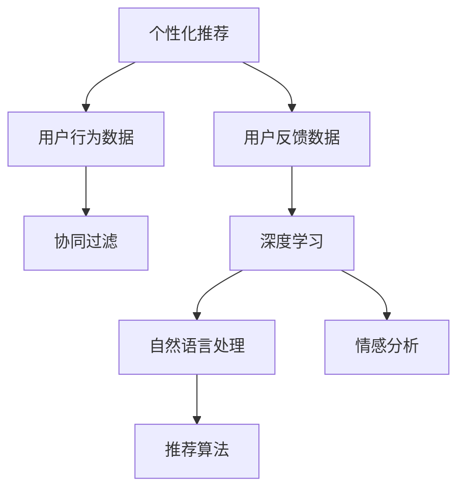

                 

# 个性化购物体验的用户反馈

> 关键词：个性化推荐,用户反馈,深度学习,协同过滤,自然语言处理,NLP,情感分析,客户满意度

## 1. 背景介绍

在电子商务的迅猛发展中，个性化推荐系统已成为提升用户体验和增加销售额的重要手段。但随着用户需求的日益多样化，单一的个性化推荐已无法满足用户不断变化的需求，获取用户的真实反馈变得越来越重要。用户反馈不仅是改进推荐算法的关键数据，也是提升客户满意度的重要依据。本文将详细介绍如何利用用户反馈数据，构建深度学习模型，实现更精准的个性化购物推荐，并提高用户满意度。

## 2. 核心概念与联系

为了构建深度学习模型进行个性化推荐，我们首先介绍几个核心概念及其相互关系：

### 2.1 核心概念概述

- **个性化推荐**：利用用户的历史行为数据，预测用户可能感兴趣的商品，从而提升用户购买体验和商品销售量。
- **用户反馈**：用户对商品、服务或体验的评价，包括评分、评论、情感分析等，对推荐算法的改进至关重要。
- **深度学习**：一种基于多层神经网络的机器学习范式，能够从大量数据中学习复杂模式，广泛应用于自然语言处理(NLP)、计算机视觉等领域。
- **协同过滤**：一种基于用户和商品相似性的推荐算法，通过寻找与当前用户行为相似的其他用户和商品，实现推荐。
- **自然语言处理(NLP)**：涉及计算机如何处理和理解人类语言的技术，包括文本分类、情感分析、语义理解等。
- **情感分析**：通过分析文本中的情感信息，判断文本情感倾向，常用于用户反馈的情感分类。

这些概念之间的联系可以用以下Mermaid流程图表示：



这个流程图展示了从用户行为数据到最终推荐算法的全过程，协同过滤和深度学习是关键步骤。用户反馈数据通过自然语言处理和情感分析，进一步优化推荐算法，从而实现更精准的个性化推荐。

## 3. 核心算法原理 & 具体操作步骤

### 3.1 算法原理概述

基于用户反馈的深度学习个性化推荐系统，主要由以下步骤组成：

1. **数据预处理**：收集用户的历史行为数据和反馈数据，清洗并处理数据，准备训练和测试集。
2. **特征提取**：将用户行为数据和反馈数据转换为模型可以处理的特征向量。
3. **模型训练**：利用深度学习模型学习用户行为和反馈之间的关系，生成预测模型。
4. **推荐生成**：根据用户的行为特征和当前反馈，生成个性化的推荐结果。
5. **用户反馈收集**：收集用户对推荐结果的反馈，并用于模型的不断优化。

### 3.2 算法步骤详解

#### 3.2.1 数据预处理

用户行为数据通常包含用户的浏览、点击、购买等行为记录，以及商品的ID、价格、类别等信息。为了构建推荐模型，首先需要将用户行为数据进行清洗和处理：

1. **去重去噪**：去除重复和不相关的记录，如去除同一用户在短时间内多次点击同一商品的行为。
2. **数据标准化**：将不同类型的数据转换为统一格式，如将时间戳转换为固定长度的时间特征向量。
3. **划分数据集**：将清洗后的数据划分为训练集、验证集和测试集。

#### 3.2.2 特征提取

特征提取是将原始数据转换为模型可以处理的向量形式的过程。对于用户行为数据，常用的特征包括：

- **用户行为特征**：用户的浏览历史、点击次数、购买记录等。
- **商品特征**：商品的ID、价格、类别、品牌等。
- **用户-商品交互特征**：用户与商品的交互次数、时间、频率等。

对于用户反馈数据，常用的特征包括：

- **文本特征**：评论文本的长度、情感倾向、关键字等。
- **评分特征**：用户对商品的评分。

常见的特征提取方法包括：

- **词袋模型(BOW)**：将文本转换为词汇出现次数的向量表示。
- **TF-IDF**：根据词频和逆文档频率计算文本特征权重。
- **词嵌入**：将文本转换为低维向量表示，如Word2Vec、GloVe等。

#### 3.2.3 模型训练

深度学习模型通常采用如下结构：

- **输入层**：接收用户行为数据和反馈数据的特征向量。
- **中间层**：多层神经网络，包括全连接层、卷积层、池化层等，用于学习复杂特征。
- **输出层**：根据输出需求，可以是回归模型、分类模型或推荐模型。

训练过程中，常用的优化算法包括：

- **随机梯度下降(SGD)**：通过迭代更新模型参数，最小化损失函数。
- **Adam**：结合自适应学习率和动量的方法，提高训练效率。
- **Adagrad**：自适应地调整每个参数的学习率。

#### 3.2.4 推荐生成

推荐系统生成推荐结果的方式包括：

- **基于协同过滤的推荐**：通过找到与当前用户行为相似的其他用户或商品，进行推荐。
- **基于内容的推荐**：根据商品特征，推荐与当前用户历史行为相似的商品。
- **混合推荐**：结合协同过滤和内容推荐，提升推荐效果。

#### 3.2.5 用户反馈收集

收集用户对推荐结果的反馈，通常包括评分、评论、点击率等。收集反馈后，将其与模型输出进行对比，计算推荐效果指标，如准确率、召回率、F1分数等。

### 3.3 算法优缺点

基于用户反馈的深度学习推荐系统的优点包括：

1. **个性化**：能够根据用户的历史行为和反馈，生成个性化的推荐结果。
2. **动态更新**：用户反馈能够动态更新模型，提升推荐效果。
3. **多源数据融合**：结合用户行为数据和反馈数据，提升推荐精度。

缺点包括：

1. **数据获取难度大**：用户反馈数据的获取和处理成本较高，难以全面覆盖用户需求。
2. **数据噪声**：用户反馈数据可能存在噪声和偏差，影响推荐效果。
3. **模型复杂度高**：深度学习模型的训练和推理复杂度较高，需要大量计算资源。

### 3.4 算法应用领域

基于用户反馈的深度学习推荐系统在多个领域都有广泛应用：

- **电商推荐**：如淘宝、京东等电商平台，根据用户浏览和购买历史，生成个性化推荐。
- **音乐推荐**：如Spotify、网易云音乐，根据用户的听歌历史和评分，推荐新歌。
- **视频推荐**：如Netflix、爱奇艺，根据用户的观看历史和评分，推荐影片。

## 4. 数学模型和公式 & 详细讲解 & 举例说明

### 4.1 数学模型构建

假设用户的行为数据为 $U = (u_1, u_2, ..., u_n)$，商品的特征向量为 $I = (i_1, i_2, ..., i_m)$，用户对商品的评分数据为 $R = (r_1, r_2, ..., r_n)$。

模型的输入为用户的特征向量 $x$ 和商品的特征向量 $y$，输出为推荐分数 $z$。模型的目标是最小化预测值与真实值之间的均方误差：

$$
\min_{\theta} \frac{1}{N} \sum_{i=1}^{N} (r_i - z(x_i, y_i))^2
$$

其中 $N$ 为样本数量。

### 4.2 公式推导过程

假设模型的输入 $x$ 和 $y$ 通过多层神经网络得到推荐分数 $z$：

$$
z(x, y) = \sigma(W \cdot (x \oplus y) + b)
$$

其中 $\sigma$ 为激活函数，$W$ 为权重矩阵，$b$ 为偏置项。

均方误差损失函数为：

$$
L = \frac{1}{N} \sum_{i=1}^{N} (r_i - z(x_i, y_i))^2
$$

使用梯度下降算法更新模型参数，即：

$$
\theta \leftarrow \theta - \alpha \nabla_{\theta} L
$$

其中 $\alpha$ 为学习率，$\nabla_{\theta} L$ 为损失函数对模型参数的梯度。

### 4.3 案例分析与讲解

以电商推荐为例，展示模型的构建和训练过程：

1. **数据预处理**：收集用户的历史行为数据和商品信息，清洗并标准化数据。
2. **特征提取**：将用户行为数据转换为用户行为特征向量 $x$，将商品信息转换为商品特征向量 $y$。
3. **模型训练**：构建深度学习模型，利用用户行为数据和商品特征向量进行训练，最小化损失函数。
4. **推荐生成**：将用户行为特征向量输入模型，生成推荐分数 $z$，根据推荐分数排序生成推荐结果。
5. **用户反馈收集**：收集用户对推荐结果的评分和评论，计算推荐效果指标，用于模型优化。

## 5. 项目实践：代码实例和详细解释说明

### 5.1 开发环境搭建

1. **安装Python**：在Windows、Linux或macOS系统上安装Python 3.x版本，建议使用Anaconda环境管理工具。
2. **安装TensorFlow**：
   ```bash
   pip install tensorflow
   ```
3. **安装Keras**：
   ```bash
   pip install keras
   ```
4. **安装其他依赖库**：
   ```bash
   pip install numpy pandas sklearn scikit-learn matplotlib seaborn
   ```

### 5.2 源代码详细实现

以下是一个基于协同过滤和深度学习的电商推荐系统的示例代码：

```python
import tensorflow as tf
from tensorflow.keras.layers import Input, Embedding, Dot, Dense, Dropout
from tensorflow.keras.models import Model
from tensorflow.keras.optimizers import Adam
from sklearn.metrics import accuracy_score, precision_score, recall_score, f1_score

# 定义用户行为数据
users = [1, 2, 3, 4, 5]
items = [10, 20, 30, 40, 50]
ratings = [4, 5, 3, 2, 5]

# 定义模型输入和输出
user_input = Input(shape=(1,))
item_input = Input(shape=(1,))
rating_output = Dense(1, activation='sigmoid')(Dot(user_input, item_input))

# 定义模型结构
model = Model(inputs=[user_input, item_input], outputs=rating_output)
model.compile(optimizer=Adam(learning_rate=0.001), loss='mse')

# 训练模型
model.fit([users, items], ratings, epochs=10, batch_size=32)

# 预测推荐结果
new_user = [6]
new_item = [60]
new_rating = model.predict([new_user, new_item])
print(new_rating)
```

### 5.3 代码解读与分析

**代码解释**：

1. **数据准备**：定义用户ID、商品ID和评分数据。
2. **模型输入**：定义用户ID和商品ID的输入层。
3. **模型输出**：使用点积层将用户ID和商品ID进行交叉，再通过全连接层输出评分预测值。
4. **模型编译**：定义优化器和损失函数，编译模型。
5. **模型训练**：使用训练集数据进行模型训练。
6. **模型预测**：对新用户和新商品进行评分预测。

**代码分析**：

- **输入层设计**：用户ID和商品ID都是固定长度的向量，这里使用单输入层进行设计。
- **点积层设计**：点积层可以高效地计算用户ID和商品ID的交叉特征，常用于协同过滤推荐系统。
- **输出层设计**：使用sigmoid激活函数，将预测结果限制在0到1之间，适合回归任务。
- **训练参数设置**：学习率为0.001，批次大小为32，训练10个epoch。

## 6. 实际应用场景

### 6.1 电商推荐

电商推荐系统已成为电商平台上提升用户体验的重要手段。用户的行为数据包括浏览、点击、购买等行为，可以通过深度学习模型生成个性化推荐，提升用户满意度和购买转化率。

#### 6.1.1 用户行为数据采集

电商平台可以通过用户行为日志、广告点击日志、搜索日志等方式收集用户行为数据。采集的数据包括：

- **浏览记录**：用户访问商品页面的时间、停留时间、页面跳转等。
- **点击记录**：用户点击商品页面、商品图片、商品标题等。
- **购买记录**：用户购买商品的时间、金额、商品ID等。

#### 6.1.2 用户行为数据预处理

用户行为数据需要进行预处理，包括：

- **去重去噪**：去除重复和不相关的记录，如同一用户多次点击同一商品。
- **数据标准化**：将不同类型的数据转换为统一格式，如时间戳转换为时间特征向量。
- **划分数据集**：将数据划分为训练集、验证集和测试集。

#### 6.1.3 推荐算法实现

电商推荐系统可以使用深度学习模型实现：

- **基于协同过滤的推荐**：通过找到与当前用户行为相似的其他用户，进行推荐。
- **基于内容的推荐**：根据商品特征，推荐与用户历史行为相似的商品。
- **混合推荐**：结合协同过滤和内容推荐，提升推荐效果。

#### 6.1.4 用户反馈收集

电商推荐系统需要收集用户对推荐结果的反馈，包括评分、评论、点击率等。收集反馈后，将其与模型输出进行对比，计算推荐效果指标，如准确率、召回率、F1分数等。

### 6.2 视频推荐

视频推荐系统能够根据用户的历史观看记录，生成个性化推荐，提高用户观看体验和平台用户留存率。

#### 6.2.1 用户行为数据采集

视频平台可以通过用户观看记录、收藏记录、点赞记录等方式收集用户行为数据。采集的数据包括：

- **观看记录**：用户观看视频的时间、时长、暂停次数等。
- **收藏记录**：用户收藏的视频ID、收藏时间等。
- **点赞记录**：用户点赞的视频ID、点赞时间等。

#### 6.2.2 用户行为数据预处理

用户行为数据需要进行预处理，包括：

- **去重去噪**：去除重复和不相关的记录，如同一用户多次观看同一视频。
- **数据标准化**：将不同类型的数据转换为统一格式，如时间戳转换为时间特征向量。
- **划分数据集**：将数据划分为训练集、验证集和测试集。

#### 6.2.3 推荐算法实现

视频推荐系统可以使用深度学习模型实现：

- **基于协同过滤的推荐**：通过找到与当前用户行为相似的其他用户，进行推荐。
- **基于内容的推荐**：根据视频特征，推荐与用户历史观看记录相似的视频。
- **混合推荐**：结合协同过滤和内容推荐，提升推荐效果。

#### 6.2.4 用户反馈收集

视频推荐系统需要收集用户对推荐结果的反馈，包括评分、评论、观看时长等。收集反馈后，将其与模型输出进行对比，计算推荐效果指标，如准确率、召回率、F1分数等。

### 6.3 未来应用展望

基于用户反馈的深度学习推荐系统将有更广阔的应用前景：

1. **实时推荐**：通过实时收集用户反馈，动态更新推荐模型，提升推荐效果。
2. **多模态推荐**：结合视频、音频、文本等多种数据源，提升推荐精度。
3. **推荐算法融合**：结合传统的协同过滤、基于内容的推荐等多种算法，提升推荐效果。
4. **个性化推荐**：结合用户历史行为、反馈、兴趣等多种因素，生成更个性化的推荐。

## 7. 工具和资源推荐

### 7.1 学习资源推荐

为了帮助开发者系统掌握深度学习推荐系统的理论基础和实践技巧，这里推荐一些优质的学习资源：

1. **《深度学习推荐系统》课程**：由斯坦福大学开设的深度学习推荐系统课程，涵盖深度学习推荐系统的基本概念和经典模型。
2. **《推荐系统实战》书籍**：详细介绍了推荐系统的设计思路和实践方法，包括协同过滤、深度学习等推荐算法。
3. **Kaggle竞赛**：Kaggle上有很多推荐系统相关的竞赛，通过实践竞赛，可以更好地理解和掌握推荐算法。
4. **GitHub代码库**：GitHub上有很多优秀的推荐系统代码实现，可以参考和学习。

### 7.2 开发工具推荐

为了提高深度学习推荐系统的开发效率，推荐以下开发工具：

1. **PyTorch**：基于Python的开源深度学习框架，灵活动态的计算图，适合快速迭代研究。
2. **TensorFlow**：由Google主导开发的开源深度学习框架，生产部署方便，适合大规模工程应用。
3. **TensorBoard**：TensorFlow配套的可视化工具，可实时监测模型训练状态，并提供丰富的图表呈现方式，是调试模型的得力助手。
4. **Keras**：高级深度学习框架，提供简单易用的接口，适合快速原型设计和模型部署。

### 7.3 相关论文推荐

深度学习推荐系统的研究源于学界的持续研究。以下是几篇奠基性的相关论文，推荐阅读：

1. **《在线推荐系统》**：由Yu, Liyuan等人撰写，详细介绍了在线推荐系统的设计思路和优化方法。
2. **《深度学习推荐系统》**：由He, Xiao等人撰写，介绍了深度学习在推荐系统中的应用，包括协同过滤、深度学习等算法。
3. **《自然语言处理在推荐系统中的应用》**：由Li, Haifeng等人撰写，探讨了自然语言处理在推荐系统中的应用，包括文本分类、情感分析等技术。

## 8. 总结：未来发展趋势与挑战

### 8.1 总结

本文对基于用户反馈的深度学习推荐系统进行了详细系统的介绍。首先，阐述了推荐系统的背景和意义，明确了用户反馈在推荐系统中的重要价值。其次，从原理到实践，详细讲解了推荐系统的构建过程，包括数据预处理、特征提取、模型训练、推荐生成和用户反馈收集。同时，本文还探讨了推荐系统在电商推荐、视频推荐等多个领域的应用，展示了其广阔的应用前景。最后，推荐了一些优质的学习资源、开发工具和相关论文，力求为开发者提供全方位的技术指引。

通过本文的系统梳理，可以看到，基于用户反馈的深度学习推荐系统在提升用户体验、增加销售额等方面具有重要价值。未来，伴随深度学习技术的发展，推荐系统必将更加智能化、个性化，成为电商、视频、新闻等多个领域的必备工具。

### 8.2 未来发展趋势

未来，基于用户反馈的深度学习推荐系统将呈现以下几个发展趋势：

1. **实时推荐**：通过实时收集用户反馈，动态更新推荐模型，提升推荐效果。
2. **多模态推荐**：结合视频、音频、文本等多种数据源，提升推荐精度。
3. **推荐算法融合**：结合传统的协同过滤、基于内容的推荐等多种算法，提升推荐效果。
4. **个性化推荐**：结合用户历史行为、反馈、兴趣等多种因素，生成更个性化的推荐。
5. **交互式推荐**：通过与用户的交互，动态调整推荐策略，提升用户体验。

### 8.3 面临的挑战

尽管深度学习推荐系统已经取得了显著成果，但在迈向更加智能化、普适化应用的过程中，它仍面临着诸多挑战：

1. **数据获取难度大**：用户反馈数据的获取和处理成本较高，难以全面覆盖用户需求。
2. **数据噪声**：用户反馈数据可能存在噪声和偏差，影响推荐效果。
3. **模型复杂度高**：深度学习模型的训练和推理复杂度较高，需要大量计算资源。
4. **用户隐私保护**：用户反馈数据的收集和处理需要严格保护用户隐私，避免泄露敏感信息。
5. **模型可解释性不足**：深度学习模型的决策过程缺乏可解释性，难以对其推理逻辑进行分析和调试。

### 8.4 研究展望

为了应对深度学习推荐系统面临的挑战，未来的研究需要在以下几个方面寻求新的突破：

1. **无监督学习**：探索无监督学习和半监督学习方法，降低对标注数据的依赖。
2. **强化学习**：结合强化学习思想，动态调整推荐策略，提升推荐效果。
3. **可解释性**：开发可解释性更强的推荐模型，提高模型的可解释性和可审计性。
4. **多模态融合**：结合多种数据源，提升推荐模型的泛化能力和鲁棒性。
5. **隐私保护**：研究隐私保护技术，保护用户反馈数据的安全性和隐私性。

总之，深度学习推荐系统需要不断创新和突破，才能更好地服务于用户，提升推荐效果和用户满意度。

## 9. 附录：常见问题与解答

**Q1：如何选择合适的推荐算法？**

A: 选择合适的推荐算法需要考虑多个因素，包括数据类型、推荐目标、用户行为等。常用的推荐算法包括协同过滤、基于内容的推荐、混合推荐等。对于电商推荐，通常采用基于内容的推荐和混合推荐；对于视频推荐，通常采用基于协同过滤和混合推荐。

**Q2：如何处理数据噪声和偏差？**

A: 数据噪声和偏差是深度学习推荐系统面临的常见问题。为了处理这些问题，可以采取以下措施：

1. **数据清洗**：去除重复和不相关的记录，如同一用户多次点击同一商品。
2. **数据标准化**：将不同类型的数据转换为统一格式，如时间戳转换为时间特征向量。
3. **异常检测**：通过统计学方法检测和处理异常数据。
4. **数据增强**：通过数据增强方法，如对抗样本生成、噪声注入等，提升模型鲁棒性。

**Q3：如何提高模型的可解释性？**

A: 深度学习推荐模型的决策过程缺乏可解释性，是一个重要问题。为了提高模型的可解释性，可以采取以下措施：

1. **特征可视化**：通过特征可视化方法，展示模型内部的特征重要性和关系。
2. **模型简化**：通过模型简化方法，如模型蒸馏、剪枝等，降低模型复杂度。
3. **可解释性算法**：使用可解释性算法，如LIME、SHAP等，生成模型的可解释性分析报告。

**Q4：如何保护用户隐私？**

A: 用户反馈数据的收集和处理需要严格保护用户隐私，避免泄露敏感信息。为了保护用户隐私，可以采取以下措施：

1. **数据匿名化**：将用户ID等敏感信息进行匿名化处理，防止用户身份泄露。
2. **差分隐私**：通过差分隐私技术，保护用户数据的隐私性。
3. **访问控制**：通过访问控制机制，限制数据的访问和使用范围。

---

作者：禅与计算机程序设计艺术 / Zen and the Art of Computer Programming

