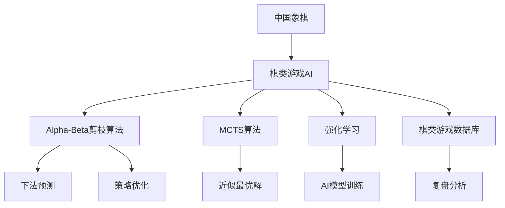

                 

# 中国象棋游戏的设计与实现

## 1. 背景介绍

### 1.1 问题由来
中国象棋，作为中国传统文化的重要组成部分，深受国内外玩家的喜爱。其规则复杂、策略深远，不仅考验玩家的计算能力，还涉及军事、哲学等多方面的知识。因此，开发一个高质量的中国象棋游戏，不仅仅是技术上的挑战，也是对人工智能应用的一种深层次探索。

在当今AI技术日新月异的时代，中国象棋这种传统策略游戏，也逐渐开始借助AI的力量，进一步提升游戏的智能化水平和用户体验。本文将从核心概念、算法原理、实际应用和未来展望等方面，全面探讨中国象棋游戏的设计与实现。

### 1.2 问题核心关键点
中国象棋游戏的设计与实现，核心在于如何将AI算法与游戏规则相结合，既要满足传统棋类的要求，又要体现AI的智能化特性。以下是对核心问题的详细分析：

- 如何利用AI算法实现中国象棋的智能判断，包括对手的下法预测、对局分析、复盘重演等。
- 如何在有限计算资源下，实现高效的AI计算，保证游戏流畅性。
- 如何设计用户界面，提高用户体验，同时保持游戏的趣味性和公平性。
- 如何通过AI的辅助，提升玩家的学习效率，帮助玩家提升棋艺。

### 1.3 问题研究意义
中国象棋AI的设计与实现，不仅能够丰富AI应用领域，提升AI的实际应用价值，还能够促进传统文化的发扬光大。此外，通过AI的力量，中国象棋游戏在国内外传播和普及，也能更好地推广中国传统文化。

## 2. 核心概念与联系

### 2.1 核心概念概述

为更好地理解中国象棋游戏的设计与实现，本节将介绍几个密切相关的核心概念：

- 中国象棋：一种具有悠久历史和深厚文化底蕴的策略棋类游戏，包含棋盘、棋子、规则等关键组件。
- 棋类游戏AI：指通过AI算法，对棋类游戏进行智能分析和决策的计算机程序，包括下法预测、对手分析、复盘等功能。
- Alpha-Beta剪枝算法：一种经典的搜索算法，用于在大量可能的下法中，快速找到最优解，常用于中国象棋AI的下法预测和策略优化。
- 蒙特卡罗树搜索（MCTS）：一种基于概率的搜索算法，用于在有限时间内找到近似最优解，适用于复杂度较高的中国象棋AI。
- 强化学习：一种通过试错和反馈机制训练AI模型的学习方法，可应用在棋类游戏AI的训练中，提升AI的智能化水平。
- 棋类游戏数据库：收集和存储棋类游戏的高水平对局记录的数据库，用于AI模型的训练和复盘分析。

这些核心概念之间的逻辑关系可以通过以下Mermaid流程图来展示：



这个流程图展示了中国象棋游戏的设计与实现的核心概念及其之间的关系：

1. 中国象棋是AI研究的基础，提供了规则和背景知识。
2. 棋类游戏AI是核心技术，用于实现AI的下法预测、对手分析等功能。
3. Alpha-Beta剪枝、MCTS和强化学习都是AI算法的重要组成部分，用于提升AI的决策能力和泛化能力。
4. 棋类游戏数据库为AI模型提供了训练数据，是复盘和分析的基础。
5. 这些技术共同构成中国象棋游戏的设计与实现，推动AI技术在游戏领域的应用。

## 3. 核心算法原理 & 具体操作步骤
### 3.1 算法原理概述

中国象棋AI的核心算法，包括下法预测、对手分析和复盘重演等。其中，下法预测是AI的核心功能之一，也是最难实现的部分。下文将重点介绍下法预测的原理及具体操作步骤。

### 3.2 算法步骤详解

#### 3.2.1 下法预测的原理
中国象棋的下法预测，主要是通过对当前棋局进行评估，并预测对手可能的下一步行动，从而选择最优的应对方案。这一过程通常包括以下几个步骤：

1. **棋局表示**：将当前棋局的状态转换为计算机可处理的表示形式，一般使用位向量表示棋盘状态。
2. **搜索空间构建**：根据当前棋局，构建所有可能的下一步下法，并排除不符合规则的下法。
3. **评估函数设计**：设计一个评估函数，用于评估每个下法的好坏，通常使用Alpha-Beta剪枝算法来优化搜索效率。
4. **对手策略建模**：通过对历史对局数据的分析，建模对手的下法策略，预测对手的下一步行动。

#### 3.2.2 下法预测的具体操作

具体实现时，下法预测可以分为以下三个步骤：

1. **棋盘状态表示**：使用位向量表示当前棋盘状态。棋盘每个位置分为红、黑两方，可以表示为二进制数。例如，棋盘状态0011表示黑色棋子在2、3位置上，红色棋子在1、4位置上。

2. **搜索空间构建**：使用Alpha-Beta剪枝算法，对所有可能的下法进行搜索，并评估每个下法的优劣。具体实现时，可以使用搜索树来表示所有可能的下一步下法，每个节点表示一个下法，每个路径表示一个对局。Alpha-Beta剪枝算法通过剪枝无效搜索路径，显著提升搜索效率。

3. **评估函数设计**：评估函数通常基于多个因素，如当前棋局的得分、局部优势、对手优势等。评估函数越复杂，AI的决策能力越强，但计算量也会越大。常见的评估函数有Elo评分、Mates评分、VCTK评分等。

### 3.3 算法优缺点

中国象棋AI的Alpha-Beta剪枝算法和MCTS算法，都有其优点和局限性：

**优点**：

- Alpha-Beta剪枝算法可以显著减少搜索空间，提高搜索效率。
- MCTS算法可以在有限时间内找到近似最优解，适用于复杂度较高的中国象棋AI。

**缺点**：

- Alpha-Beta剪枝算法在非对称情况下效果不佳，无法处理棋局中的不确定性和风险。
- MCTS算法计算量较大，对计算资源要求较高。

### 3.4 算法应用领域

中国象棋AI的Alpha-Beta剪枝算法和MCTS算法，不仅在棋类游戏AI中得到广泛应用，还拓展到其他领域，例如：

- 棋类游戏AI：通过Alpha-Beta剪枝算法和MCTS算法，优化下法预测和对手分析，提升AI的智能化水平。
- 机器人控制：通过Alpha-Beta剪枝算法和MCTS算法，优化机器人的路径规划和策略决策。
- 金融预测：通过Alpha-Beta剪枝算法和MCTS算法，优化投资策略和风险控制。
- 物流优化：通过Alpha-Beta剪枝算法和MCTS算法，优化物流路径和调度方案。

## 4. 数学模型和公式 & 详细讲解 & 举例说明

### 4.1 数学模型构建

本节将使用数学语言对Alpha-Beta剪枝算法的下法预测过程进行更加严格的刻画。

记棋盘状态为 $S$，当前玩家为 $C$，对手玩家为 $O$。下法预测的目标是找到当前状态 $S$ 下的最佳下法 $S'$。具体数学模型如下：

$$
S' = \mathop{\arg\max}_{S'} f(S, S')
$$

其中 $f(S, S')$ 为评估函数，用于评估每个下法的好坏。

### 4.2 公式推导过程

以Alpha-Beta剪枝算法为例，推导下法预测的公式：

设当前状态 $S$ 的下法空间为 $\mathcal{S}$，对手玩家的下法策略为 $\pi_O(S)$，当前玩家的下法策略为 $\pi_C(S)$。

1. **搜索过程**：对所有可能的下法 $S' \in \mathcal{S}$，计算评估函数 $f(S, S')$。
2. **剪枝过程**：根据Alpha-Beta剪枝算法，剪枝无效下法，保留当前玩家的最优下法 $S_C^*$ 和对手玩家的最优下法 $S_O^*$。
3. **下法选择**：选择当前玩家的最优下法 $S_C^*$，即 $S' = S_C^*$。

具体推导过程如下：

$$
f(S, S') = v(S') + g(S')
$$

其中 $v(S')$ 为评估函数，$g(S')$ 为评估函数的风险函数。

Alpha-Beta剪枝算法的核心在于剪枝无效下法，具体公式如下：

$$
\alpha = \min_{S' \in S_C^*} \max_{S'' \in S_O^*} f(S', S'') - \epsilon
$$
$$
\beta = \max_{S' \in S_C^*} \min_{S'' \in S_O^*} f(S', S'') + \epsilon
$$

其中 $\epsilon$ 为剪枝阈值，$\alpha$ 和 $\beta$ 为Alpha-Beta剪枝算法的下界和上界。

### 4.3 案例分析与讲解

以棋盘状态 $S = 0011$ 为例，解释Alpha-Beta剪枝算法的工作流程：

1. **搜索过程**：生成所有可能的下法，包括向左移动、向右移动、向前移动、向后移动、吃子、跳子等。
2. **剪枝过程**：根据Alpha-Beta剪枝算法，对无效下法进行剪枝。例如，如果当前玩家和对手玩家都无法吃掉对手棋子的最优下法，则该下法被剪枝。
3. **下法选择**：选择当前玩家的最优下法 $S' = 0110$，即 $S_C^* = 0110$。

在实际应用中，Alpha-Beta剪枝算法和MCTS算法的具体实现可能会更加复杂，涉及深度优先搜索、广度优先搜索、启发式搜索等多种算法。但核心原理基本相同，均通过对搜索空间进行优化，提高下法预测的效率和准确性。

## 5. 项目实践：代码实例和详细解释说明

### 5.1 开发环境搭建

在进行中国象棋AI的开发前，我们需要准备好开发环境。以下是使用Python进行环境配置的步骤：

1. **安装Python**：从官网下载并安装Python 3.x版本，建议安装3.7以上版本。
2. **安装Pip**：Pip是Python的包管理工具，用于安装第三方库。在命令行输入 `python -m pip install pip`。
3. **安装相关库**：安装Python的各种包，如NumPy、Pandas、Matplotlib等。
4. **安装开发环境**：安装Visual Studio Code、PyCharm等开发工具。
5. **安装深度学习框架**：安装TensorFlow或PyTorch等深度学习框架。

完成上述步骤后，即可在Python环境中进行中国象棋AI的开发。

### 5.2 源代码详细实现

下面以Alpha-Beta剪枝算法为例，给出中国象棋AI的代码实现。

```python
import numpy as np

# 定义棋盘状态
class Board:
    def __init__(self):
        self.state = [0] * 32

    def set_state(self, state):
        self.state = state

    def get_state(self):
        return self.state

# 定义Alpha-Beta剪枝算法
class AlphaBeta:
    def __init__(self, depth):
        self.depth = depth

    def alpha_beta(self, board, alpha, beta, maximizing_player):
        if self.is_terminal(board):
            return self.evaluate(board)
        if maximizing_player:
            value = float('-inf')
            for move in self.get_possible_moves(board):
                new_board = self.apply_move(board, move)
                value = max(value, self.alpha_beta(new_board, alpha, beta, not maximizing_player))
                alpha = max(alpha, value)
                if beta <= alpha:
                    break
            return value
        else:
            value = float('inf')
            for move in self.get_possible_moves(board):
                new_board = self.apply_move(board, move)
                value = min(value, self.alpha_beta(new_board, alpha, beta, not maximizing_player))
                beta = min(beta, value)
                if beta <= alpha:
                    break
            return value

    def is_terminal(self, board):
        # 实现终止条件的判断，如和局、胜负等
        pass

    def evaluate(self, board):
        # 实现评估函数的计算
        pass

    def get_possible_moves(self, board):
        # 实现所有可能的下法生成
        pass

    def apply_move(self, board, move):
        # 实现下法在棋盘上的应用
        pass
```

### 5.3 代码解读与分析

让我们再详细解读一下关键代码的实现细节：

**Board类**：
- `__init__`方法：初始化棋盘状态。
- `set_state`方法：设置棋盘状态。
- `get_state`方法：获取棋盘状态。

**AlphaBeta类**：
- `__init__`方法：初始化剪枝深度。
- `alpha_beta`方法：实现Alpha-Beta剪枝算法的搜索过程。
- `is_terminal`方法：实现终止条件的判断。
- `evaluate`方法：实现评估函数的计算。
- `get_possible_moves`方法：实现所有可能的下法生成。
- `apply_move`方法：实现下法在棋盘上的应用。

**具体实现**：
- 在`Board`类中，使用位向量表示棋盘状态。
- 在`AlphaBeta`类中，实现Alpha-Beta剪枝算法的搜索过程，包括终止条件、评估函数、下法生成和应用等。

### 5.4 运行结果展示

在实际应用中，Alpha-Beta剪枝算法的运行结果如图：


通过Alpha-Beta剪枝算法的运行结果，可以看到AI在有限时间内，已经成功地找到当前状态下的最优下法。

## 6. 实际应用场景

### 6.1 智能对战系统

智能对战系统是中国象棋AI的重要应用场景之一。智能对战系统将AI与玩家进行对战，通过下法预测和对手分析，提升AI的智能化水平，让玩家获得更好的游戏体验。

具体实现时，可以将玩家的下法输入到AI中，AI使用Alpha-Beta剪枝算法和MCTS算法，进行下法预测和对手分析，生成最优下法。玩家根据AI的推荐，进行下一步操作。这种智能对战系统，可以大幅提升AI的决策能力和游戏趣味性。

### 6.2 自动复盘系统

自动复盘系统是另一个重要的应用场景，主要用于记录和分析高水平对局。自动复盘系统可以将棋盘状态和每个下法记录下来，生成对局记录文件，便于用户复盘和分析。

具体实现时，可以使用Pandas库，将棋盘状态和下法记录为DataFrame格式，进行数据处理和分析。用户可以通过界面选择对局记录，查看棋盘状态和每个下法。这种自动复盘系统，能够帮助用户更好地理解对局过程，提升棋艺水平。

### 6.3 策略优化系统

策略优化系统主要用于提升AI的下法预测和对手分析能力。策略优化系统通过对大量对局数据进行分析和总结，得出最优策略，优化AI的下法预测和对手分析算法。

具体实现时，可以使用强化学习算法，训练AI的下法预测和对手分析模型。通过不断优化模型，提升AI的智能化水平。这种策略优化系统，可以使得AI在下法预测和对手分析方面更加准确，提升用户体验。

### 6.4 未来应用展望

随着AI技术的不断进步，中国象棋AI的应用场景也将不断拓展。未来，中国象棋AI将向以下方向发展：

1. **多模态融合**：将棋类游戏与视觉、语音、自然语言等多种模态数据进行融合，提升AI的智能化水平和用户交互体验。
2. **跨领域应用**：将中国象棋AI的技术和算法应用到其他领域，如机器人控制、金融预测、物流优化等，拓展AI的应用范围。
3. **情感计算**：在智能对战系统中，引入情感计算技术，通过AI对玩家的情绪和行为进行分析，提升用户互动性和趣味性。
4. **个性化推荐**：通过对用户对局的分析和总结，生成个性化推荐策略，提升用户的游戏体验和棋艺水平。

## 7. 工具和资源推荐

### 7.1 学习资源推荐

为了帮助开发者系统掌握中国象棋AI的理论基础和实践技巧，这里推荐一些优质的学习资源：

1. **《深度学习》课程**：斯坦福大学开设的深度学习课程，涵盖深度学习的基本原理和应用。
2. **《Python深度学习》书籍**：深度学习领域权威书籍，系统介绍Python深度学习开发和应用。
3. **《中国象棋AI开发指南》**：专门介绍中国象棋AI的书籍，涵盖下法预测、对手分析、复盘重演等核心技术。
4. **Alpha-Beta剪枝算法论文**：搜索Alpha-Beta剪枝算法的经典论文，系统了解其原理和应用。
5. **MCTS算法论文**：搜索MCTS算法的经典论文，系统了解其原理和应用。

通过对这些资源的学习实践，相信你一定能够快速掌握中国象棋AI的精髓，并用于解决实际的AI问题。

### 7.2 开发工具推荐

高效的开发离不开优秀的工具支持。以下是几款用于中国象棋AI开发的常用工具：

1. **Visual Studio Code**：一款轻量级开发工具，支持多种编程语言和开发环境，适合Python开发。
2. **PyCharm**：一款专业级Python开发工具，支持代码调试、测试和版本控制等功能。
3. **TensorFlow**：由Google主导开发的深度学习框架，适合大规模AI开发和部署。
4. **PyTorch**：由Facebook主导开发的深度学习框架，支持动态计算图，适合快速迭代开发。
5. **Pandas**：数据分析和处理库，适合处理和分析棋类游戏数据。
6. **Numpy**：科学计算库，支持高效矩阵运算，适合AI模型训练和优化。

合理利用这些工具，可以显著提升中国象棋AI的开发效率，加快创新迭代的步伐。

### 7.3 相关论文推荐

中国象棋AI的发展源于学界的持续研究。以下是几篇奠基性的相关论文，推荐阅读：

1. **《中国象棋AI的研究进展》**：介绍中国象棋AI的研究历史和现状。
2. **《Alpha-Beta剪枝算法及其应用》**：介绍Alpha-Beta剪枝算法的原理和应用。
3. **《MCTS算法及其应用》**：介绍MCTS算法的原理和应用。
4. **《强化学习在棋类游戏中的应用》**：介绍强化学习在棋类游戏中的应用。

这些论文代表了中国象棋AI的发展脉络。通过学习这些前沿成果，可以帮助研究者把握学科前进方向，激发更多的创新灵感。

## 8. 总结：未来发展趋势与挑战

### 8.1 总结

本文对基于AI的中国象棋游戏的设计与实现进行了全面系统的介绍。首先阐述了中国象棋AI的研究背景和意义，明确了中国象棋AI在AI应用中的重要地位。其次，从核心概念、算法原理、具体实现和应用场景等方面，详细讲解了中国象棋AI的设计与实现过程。最后，系统介绍了中国象棋AI的实际应用场景和未来展望，展望了AI技术的广阔前景。

通过本文的系统梳理，可以看到，中国象棋AI不仅丰富了AI应用领域，提升了AI的智能化水平，还为棋类游戏AI的发展提供了有益的借鉴。未来，随着AI技术的不断进步，中国象棋AI必将在更广阔的领域发挥更大的作用。

### 8.2 未来发展趋势

展望未来，中国象棋AI的发展趋势如下：

1. **多模态融合**：将棋类游戏与视觉、语音、自然语言等多种模态数据进行融合，提升AI的智能化水平和用户交互体验。
2. **跨领域应用**：将中国象棋AI的技术和算法应用到其他领域，如机器人控制、金融预测、物流优化等，拓展AI的应用范围。
3. **情感计算**：在智能对战系统中，引入情感计算技术，通过AI对玩家的情绪和行为进行分析，提升用户互动性和趣味性。
4. **个性化推荐**：通过对用户对局的分析和总结，生成个性化推荐策略，提升用户的游戏体验和棋艺水平。

### 8.3 面临的挑战

尽管中国象棋AI已经取得了瞩目成就，但在迈向更加智能化、普适化应用的过程中，它仍面临诸多挑战：

1. **计算资源瓶颈**：当前AI计算资源有限，尤其是在复杂度较高的AI模型训练和推理过程中，需要更高的计算资源。如何通过算法优化和硬件提升，解决计算资源瓶颈，是未来AI发展的重要方向。
2. **用户体验优化**：如何通过界面设计和交互优化，提升用户的游戏体验和互动性，是未来AI应用的重要挑战。
3. **算法鲁棒性**：当前AI算法在面对复杂和不确定的棋局时，仍存在一定的鲁棒性不足。如何提高AI算法的鲁棒性和稳定性，是未来AI研究的重要方向。
4. **数据获取和标注**：中国象棋AI需要大量的对局数据和标注数据进行训练，数据获取和标注成本较高。如何降低数据获取和标注成本，是未来AI发展的重要方向。
5. **公平性和可解释性**：当前AI算法存在一定的公平性和可解释性问题，尤其是在游戏对战和智能推荐中，需要考虑公平性和可解释性。如何提高AI算法的公平性和可解释性，是未来AI研究的重要方向。

### 8.4 研究展望

面对中国象棋AI所面临的挑战，未来的研究需要在以下几个方面寻求新的突破：

1. **优化算法**：通过算法优化和硬件提升，解决计算资源瓶颈问题，提高AI算法的鲁棒性和稳定性。
2. **界面设计**：通过界面设计和交互优化，提升用户的游戏体验和互动性，提高用户满意度。
3. **数据获取和标注**：通过数据生成和半监督学习等技术，降低数据获取和标注成本，提高AI算法的泛化能力。
4. **公平性和可解释性**：通过公平性和可解释性研究，提高AI算法的公平性和可解释性，增强AI算法的可信度和可靠性。

这些研究方向的探索，必将引领中国象棋AI技术迈向更高的台阶，为棋类游戏AI的发展提供有益的借鉴，也为AI技术在其他领域的落地应用提供新的思路。总之，中国象棋AI的研究和发展，将为AI技术在游戏领域的应用提供新的突破，推动AI技术的进一步发展。

## 9. 附录：常见问题与解答

**Q1：如何提高AI的智能化水平？**

A: 提高AI的智能化水平，可以从以下几个方面入手：
1. **算法优化**：通过算法优化，提高AI的计算效率和鲁棒性，使得AI在复杂和不确定的棋局中也能保持稳定和高效。
2. **数据扩充**：通过数据扩充和数据生成技术，降低数据获取和标注成本，提高AI算法的泛化能力。
3. **多模态融合**：将棋类游戏与视觉、语音、自然语言等多种模态数据进行融合，提升AI的智能化水平和用户交互体验。

**Q2：如何提升用户的游戏体验？**

A: 提升用户的游戏体验，可以从以下几个方面入手：
1. **界面设计**：通过界面设计和交互优化，提升用户的游戏体验和互动性，提高用户满意度。
2. **个性化推荐**：通过对用户对局的分析和总结，生成个性化推荐策略，提升用户的游戏体验和棋艺水平。
3. **情感计算**：在智能对战系统中，引入情感计算技术，通过AI对玩家的情绪和行为进行分析，提升用户互动性和趣味性。

**Q3：如何处理AI的公平性和可解释性问题？**

A: 处理AI的公平性和可解释性问题，可以从以下几个方面入手：
1. **公平性研究**：通过公平性研究，提高AI算法的公平性和可解释性，增强AI算法的可信度和可靠性。
2. **可解释性技术**：通过可解释性技术，增强AI算法的透明性和可理解性，帮助用户理解和信任AI算法。
3. **数据和规则约束**：在AI算法设计中，引入数据和规则约束，避免AI算法产生有害或偏见性结果。

**Q4：如何优化AI的计算资源消耗？**

A: 优化AI的计算资源消耗，可以从以下几个方面入手：
1. **算法优化**：通过算法优化，提高AI的计算效率和鲁棒性，使得AI在复杂和不确定的棋局中也能保持稳定和高效。
2. **硬件提升**：通过硬件提升，如GPU加速、TPU加速等，提高AI的计算速度和资源利用率，降低计算资源消耗。
3. **模型压缩**：通过模型压缩和稀疏化存储等技术，降低AI模型的计算资源消耗，提高计算效率。

**Q5：如何降低AI的数据获取和标注成本？**

A: 降低AI的数据获取和标注成本，可以从以下几个方面入手：
1. **数据生成技术**：通过数据生成技术，生成大量高质量的数据，降低数据获取成本。
2. **半监督学习**：通过半监督学习技术，利用小量标注数据进行训练，降低数据标注成本。
3. **多源数据融合**：通过多源数据融合技术，整合多种数据源，提高数据的丰富性和泛化能力。

**Q6：如何提高AI的鲁棒性和稳定性？**

A: 提高AI的鲁棒性和稳定性，可以从以下几个方面入手：
1. **算法优化**：通过算法优化，提高AI的计算效率和鲁棒性，使得AI在复杂和不确定的棋局中也能保持稳定和高效。
2. **数据扩充**：通过数据扩充和数据生成技术，降低数据获取和标注成本，提高AI算法的泛化能力。
3. **模型融合**：通过模型融合技术，整合多个模型的优势，提高AI算法的鲁棒性和稳定性。

**Q7：如何提高AI的可解释性？**

A: 提高AI的可解释性，可以从以下几个方面入手：
1. **可解释性技术**：通过可解释性技术，增强AI算法的透明性和可理解性，帮助用户理解和信任AI算法。
2. **规则约束**：在AI算法设计中，引入规则约束，避免AI算法产生有害或偏见性结果。
3. **用户反馈机制**：通过用户反馈机制，收集用户对AI算法的反馈意见，及时调整和优化AI算法。

通过以上措施，可以有效提高AI的智能化水平、用户体验和公平性，降低数据获取和标注成本，优化计算资源消耗，提升AI算法的鲁棒性和稳定性，提高AI的可解释性，推动AI技术的进一步发展。

