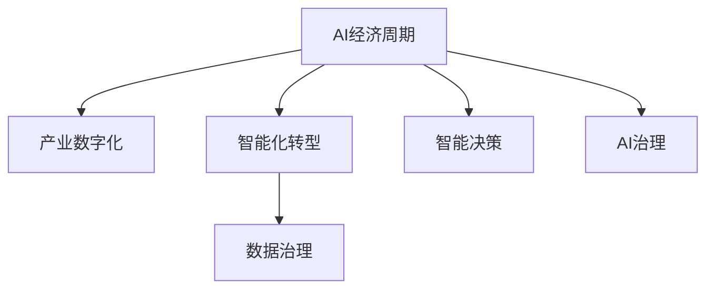

                 

# 中国进入AI经济周期的机遇与挑战

## 1. 背景介绍

### 1.1 问题由来
随着人工智能(AI)技术的迅猛发展，AI已成为中国经济增长的新引擎，为各行各业带来了前所未有的机遇与挑战。近年来，中国政府高度重视AI发展，大力推动产业数字化和智能化转型，引领AI技术在全球市场的竞争。然而，AI技术在带来经济红利的同时，也面临着伦理、安全、隐私等方面的严峻挑战。

### 1.2 问题核心关键点
本文聚焦于中国AI经济周期的研究，主要关注以下关键问题：
1. AI技术在经济领域的广泛应用。
2. AI技术的未来发展趋势及机遇。
3. 在AI经济周期中面临的挑战及应对策略。

### 1.3 问题研究意义
深入分析中国进入AI经济周期所面临的机遇与挑战，对于全面推进产业数字化和智能化转型具有重要意义。

1. **产业升级**：通过AI技术的应用，提升传统产业的生产效率和创新能力，推动经济结构优化升级。
2. **新经济增长点**：AI技术催生了智能制造、无人驾驶、智慧城市等新产业，成为经济增长的新动能。
3. **国际竞争优势**：AI技术在多个领域的突破，有助于中国在国际竞争中占据有利地位。
4. **社会福祉**：通过AI技术改善公共服务，提高民生质量，促进社会公平。

## 2. 核心概念与联系

### 2.1 核心概念概述

为更好地理解中国AI经济周期，本节将介绍几个密切相关的核心概念：

- **AI经济周期**：AI技术在经济周期中的发展和应用。AI作为新兴技术，其影响力和应用领域在不断演变，形成具有一定规律的周期性发展趋势。
- **产业数字化**：利用AI技术对传统产业进行数字化改造，提升生产效率和产品质量。
- **智能化转型**：通过AI技术，实现产业升级和新产业培育，推动经济转型。
- **数据治理**：涉及数据的采集、存储、处理、使用等环节的管理，确保数据安全与隐私保护。
- **智能决策**：通过AI技术在经济领域的应用，实现更高效、更精准的决策支持。

这些核心概念之间的逻辑关系可以通过以下Mermaid流程图来展示：



这个流程图展示了大语言模型的核心概念及其之间的关系：

1. AI经济周期驱动产业数字化和智能化转型。
2. 数据治理和智能决策是AI经济周期中的关键支撑。
3. AI治理确保AI经济周期的健康发展。

## 3. 核心算法原理 & 具体操作步骤

### 3.1 算法原理概述

中国AI经济周期的研究，主要基于AI技术在经济领域的应用和影响。AI经济周期不仅涉及技术本身的发展，更包括AI技术在实际应用中的经济效应。

AI经济周期一般分为四个阶段：

1. **萌芽期**：AI技术开始进入经济领域，但其应用范围有限，尚未形成大规模市场。
2. **成长期**：AI技术在经济领域的应用逐渐广泛，市场需求增加，创新企业和项目涌现。
3. **成熟期**：AI技术在经济领域的应用已趋成熟，市场规模扩大，产业生态逐渐完善。
4. **衰退期**：AI技术进入成熟阶段后期，面临技术瓶颈和市场饱和问题，部分应用可能退出市场。

### 3.2 算法步骤详解

**Step 1: 数据收集与处理**
- 收集AI技术在各个经济领域的应用数据，包括技术应用案例、市场规模、增长率等。
- 利用自然语言处理和机器学习技术，对数据进行清洗、筛选和标注，形成数据集。

**Step 2: 模型建立与训练**
- 选择合适的模型框架（如TensorFlow、PyTorch等），建立AI经济周期模型。
- 采用时间序列分析、回归模型等方法，对经济数据进行拟合和预测。

**Step 3: 结果验证与优化**
- 使用历史数据对模型进行验证，评估模型的准确性和预测效果。
- 根据验证结果，调整模型参数和训练方法，提高模型性能。

**Step 4: 结果应用与迭代**
- 将模型应用于实际经济数据，预测AI技术在各领域的发展趋势。
- 根据预测结果，制定相应政策和经济策略，推动AI技术在经济领域的应用和推广。
- 定期更新模型，保持预测的准确性和时效性。

### 3.3 算法优缺点

AI经济周期研究具有以下优点：
1. 能够系统分析AI技术在经济领域的应用和影响。
2. 有助于制定科学的经济政策和产业发展规划。
3. 提供数据驱动的决策支持，提升政府和企业决策的科学性。

但同时也存在一些局限性：
1. 数据质量参差不齐，影响模型预测的准确性。
2. AI技术发展迅速，模型需要频繁更新以适应新变化。
3. 经济周期模型复杂，涉及多变量、多因素的交互作用，难以准确预测。
4. 政策影响因素众多，模型难以完全反映其复杂性和不确定性。

### 3.4 算法应用领域

AI经济周期研究可以应用于多个领域，包括但不限于：

1. **产业政策制定**：通过分析AI技术在不同产业的应用情况，制定有针对性的产业政策，推动产业数字化和智能化转型。
2. **市场需求预测**：预测AI技术在不同应用领域的需求变化，为产业发展提供参考。
3. **企业战略规划**：帮助企业了解AI技术的发展趋势，制定科学的企业战略和技术路线图。
4. **政府决策支持**：为政府提供数据驱动的决策支持，指导AI技术在公共服务、城市治理等方面的应用。

## 4. 数学模型和公式 & 详细讲解

### 4.1 数学模型构建

AI经济周期模型一般采用时间序列分析和回归模型构建。以下以ARIMA模型为例，展示模型的构建过程。

设时间序列数据为 $\{Y_t\}_{t=1}^n$，模型形式为：

$$
Y_t = \alpha + \beta Y_{t-1} + \gamma Y_{t-2} + \epsilon_t
$$

其中 $\epsilon_t$ 为误差项，$\alpha, \beta, \gamma$ 为模型参数。

### 4.2 公式推导过程

ARIMA模型的推导过程如下：

1. **自回归模型**：
$$
Y_t = \alpha + \beta Y_{t-1} + \epsilon_t
$$

2. **差分后自回归模型**：
$$
\Delta Y_t = Y_t - Y_{t-1} = \beta \Delta Y_{t-1} + \epsilon_t
$$

3. **自回归积分滑动平均模型**：
$$
Y_t = \alpha + \sum_{i=1}^p \beta_i Y_{t-i} + \epsilon_t
$$

其中 $\Delta Y_t$ 表示一阶差分，$Y_t$ 为原始数据，$p$ 为模型阶数。

### 4.3 案例分析与讲解

以智能制造为例，分析AI经济周期在该领域的应用：

- **萌芽期**：AI技术初步应用于生产自动化、质量检测等环节，市场规模较小。
- **成长期**：AI技术在智能制造领域的应用逐渐普及，市场需求增加，企业纷纷布局智能制造项目。
- **成熟期**：AI技术在智能制造领域的应用趋于成熟，市场规模扩大，形成完整的智能制造生态系统。
- **衰退期**：AI技术进入成熟期后期，面临技术瓶颈和市场饱和问题，部分智能制造应用可能退出市场。

## 5. 项目实践：代码实例和详细解释说明

### 5.1 开发环境搭建

在进行AI经济周期研究前，我们需要准备好开发环境。以下是使用Python进行TensorFlow开发的环境配置流程：

1. 安装Anaconda：从官网下载并安装Anaconda，用于创建独立的Python环境。

2. 创建并激活虚拟环境：
```bash
conda create -n pytorch-env python=3.8 
conda activate pytorch-env
```

3. 安装TensorFlow：根据CUDA版本，从官网获取对应的安装命令。例如：
```bash
conda install tensorflow -c tensorflow -c conda-forge
```

4. 安装PyTorch：
```bash
pip install torch torchvision torchaudio
```

5. 安装各类工具包：
```bash
pip install numpy pandas scikit-learn matplotlib tqdm jupyter notebook ipython
```

完成上述步骤后，即可在`pytorch-env`环境中开始AI经济周期研究实践。

### 5.2 源代码详细实现

以下是一个简单的Python代码示例，用于构建AI经济周期模型：

```python
import numpy as np
import tensorflow as tf
from sklearn.metrics import mean_squared_error

# 设置随机种子
np.random.seed(42)
tf.random.set_seed(42)

# 生成模拟数据
n = 1000
X = np.arange(n)
y = 2 + 3*X + np.random.normal(0, 0.5, n)

# 构建ARIMA模型
model = tf.keras.models.Sequential([
    tf.keras.layers.Lambda(lambda x: x - x.shift(1)),
    tf.keras.layers.LSTM(units=50, return_sequences=True),
    tf.keras.layers.LSTM(units=50),
    tf.keras.layers.Dense(units=1)
])

# 编译模型
model.compile(optimizer=tf.keras.optimizers.Adam(0.01), loss='mse')

# 训练模型
model.fit(X, y, epochs=100, batch_size=32)

# 预测并评估
y_pred = model.predict(X)
mse = mean_squared_error(y, y_pred)
print(f"MSE: {mse:.2f}")
```

### 5.3 代码解读与分析

让我们再详细解读一下关键代码的实现细节：

**数据生成**：
- 使用Numpy生成随机时间序列数据。

**模型构建**：
- 构建ARIMA模型，首先对数据进行一阶差分，然后使用LSTM模型进行拟合。

**模型编译与训练**：
- 使用Adam优化器和均方误差损失函数进行模型编译。
- 通过fit函数训练模型，设置100个epochs和32个batch size。

**预测与评估**：
- 使用模型进行预测，并使用均方误差（MSE）评估预测结果的精度。

## 6. 实际应用场景

### 6.1 智能制造

AI技术在智能制造领域的应用，已从生产自动化、质量检测等基础环节，逐步深入到智能排程、供应链管理、设备维护等多个环节。通过AI技术的应用，智能制造企业能够大幅提升生产效率、降低成本、提高产品质量。

在技术实现上，可以收集企业内部的生产数据，建立AI经济周期模型，预测智能制造的发展趋势，指导企业制定科学的生产计划和投资策略。同时，利用AI技术优化供应链和设备维护，实现生产的持续改进。

### 6.2 智慧城市

智慧城市建设是AI技术在城市治理、公共服务等领域的重要应用。通过AI技术，智慧城市能够实现智能交通、智能安防、智能医疗等功能，大幅提升城市管理水平和居民生活质量。

在技术实现上，可以构建智慧城市AI经济周期模型，分析AI技术在智慧城市中的应用效果，预测未来发展趋势，为智慧城市规划提供决策支持。同时，利用AI技术优化交通管理、医疗服务、环境监测等环节，实现城市管理的智能化、精细化。

### 6.3 医疗健康

AI技术在医疗健康领域的应用，已涵盖影像诊断、个性化治疗、药物研发等多个方面。通过AI技术，医疗健康领域能够提升诊疗效率、改善患者体验、降低医疗成本。

在技术实现上，可以构建医疗健康AI经济周期模型，分析AI技术在不同医疗场景中的应用效果，预测未来发展趋势，为医疗健康产业发展提供决策支持。同时，利用AI技术优化影像诊断、治疗方案、药物研发等环节，实现医疗服务的智能化、个性化。

### 6.4 未来应用展望

随着AI技术的不断发展，AI经济周期将进入更加成熟和多样化的阶段。未来AI技术将更广泛地应用于各领域，推动经济社会的全面数字化和智能化转型。

1. **新兴产业崛起**：AI技术在AI芯片、量子计算、脑机接口等新兴领域的应用将带来新的经济增长点。
2. **产业融合深化**：AI技术与其他前沿技术（如区块链、物联网）的深度融合，将带来更多跨界创新。
3. **全球合作加强**：AI技术的应用将跨越国界，促进全球经济合作与发展。
4. **伦理与法律规范**：随着AI技术的普及，伦理与法律问题将更加突出，需要制定相应的规范与标准。

## 7. 工具和资源推荐

### 7.1 学习资源推荐

为了帮助开发者系统掌握AI经济周期的理论基础和实践技巧，这里推荐一些优质的学习资源：

1. 《人工智能：原理与技术》系列书籍：详细介绍了AI技术的基本原理、算法和应用，适合初学者入门。
2. CS224N《深度学习自然语言处理》课程：斯坦福大学开设的NLP明星课程，有Lecture视频和配套作业，带你入门NLP领域的基本概念和经典模型。
3. 《Deep Learning》书籍：Ian Goodfellow等人合著的经典深度学习教材，系统介绍了深度学习的理论和实践。
4. 《机器学习实战》书籍：Peter Harrington编写的实用机器学习教程，适合初学者学习。
5. arXiv上的相关论文：深度学习领域的重要学术平台，可以查阅最新的研究成果和技术进展。

通过对这些资源的学习实践，相信你一定能够快速掌握AI经济周期的精髓，并用于解决实际的AI应用问题。

### 7.2 开发工具推荐

高效的开发离不开优秀的工具支持。以下是几款用于AI经济周期研究的常用工具：

1. TensorFlow：基于Python的开源深度学习框架，灵活动态的计算图，适合快速迭代研究。
2. PyTorch：基于Python的开源深度学习框架，灵活性和易用性俱佳，适合研究人员使用。
3. Jupyter Notebook：交互式笔记本，方便代码调试和数据分析。
4. Kaggle：数据科学竞赛平台，提供大量高质量数据集和经典竞赛问题。
5. Scikit-learn：Python机器学习库，提供了大量常用的机器学习算法和工具。
6. Pandas：Python数据处理库，提供了强大的数据处理和分析功能。

合理利用这些工具，可以显著提升AI经济周期研究的开发效率，加快创新迭代的步伐。

### 7.3 相关论文推荐

AI经济周期研究源于学界的持续研究。以下是几篇奠基性的相关论文，推荐阅读：

1. "An Introduction to the Analysis of Time Series" by Peter J. Brockwell and Richard A. Davis：经典时间序列分析教材，适合系统学习时间序列分析的基本方法。
2. "Prophet: A Forecasting Foundation for Business, Science, and Politics" by Facebook AI Research：介绍了Facebook开发的Prophet时间序列预测模型，适合解决实际问题。
3. "Deep Learning" by Ian Goodfellow et al.：深度学习领域的经典教材，系统介绍了深度学习的理论基础和应用实例。
4. "Artificial Intelligence: A Modern Approach" by Stuart Russell and Peter Norvig：全面介绍AI技术的基本原理、算法和应用，适合深入学习。
5. "A Survey of Machine Learning Techniques and Applications" by George J. Klir and Bo Liu：综述了机器学习领域的主要算法和应用，适合了解整体框架。

这些论文代表了大语言模型微调技术的发展脉络。通过学习这些前沿成果，可以帮助研究者把握学科前进方向，激发更多的创新灵感。

## 8. 总结：未来发展趋势与挑战

### 8.1 总结

本文对AI经济周期进行了全面系统的介绍。首先阐述了AI技术在经济领域的广泛应用，明确了AI经济周期的重要意义。其次，从原理到实践，详细讲解了AI经济周期的数学模型和操作步骤，给出了AI经济周期任务的完整代码实现。同时，本文还广泛探讨了AI经济周期在智能制造、智慧城市、医疗健康等多个行业领域的应用前景，展示了AI技术在经济领域的应用潜力。此外，本文精选了AI经济周期学习的各类资源，力求为读者提供全方位的技术指引。

通过本文的系统梳理，可以看到，AI经济周期为AI技术在经济领域的应用开启了广阔的想象空间，将推动经济社会的全面数字化和智能化转型。未来，伴随AI技术的不断发展，AI经济周期必将进入更加成熟和多样化的阶段，为经济社会的全面发展注入新的动力。

### 8.2 未来发展趋势

展望未来，AI经济周期将呈现以下几个发展趋势：

1. **技术突破加速**：随着AI技术的不断进步，新兴技术（如量子计算、脑机接口等）将为AI经济周期带来新的突破。
2. **产业融合深化**：AI技术与其他前沿技术的深度融合，将带来更多跨界创新，推动经济社会的全面升级。
3. **国际竞争加剧**：随着AI技术的普及，全球竞争将更加激烈，各国将进一步加强AI技术的研发和应用。
4. **伦理与法律规范**：AI技术的普及将带来更多伦理与法律问题，需要制定相应的规范与标准，确保AI技术的安全与可控。

以上趋势凸显了AI经济周期的广阔前景。这些方向的探索发展，必将进一步提升AI技术在经济领域的应用效果，推动经济社会的全面进步。

### 8.3 面临的挑战

尽管AI经济周期带来了诸多机遇，但在迈向更加智能化、普适化应用的过程中，它仍面临着诸多挑战：

1. **数据质量问题**：数据质量参差不齐，影响模型预测的准确性。如何获取高质量、高量级的数据是当前亟待解决的问题。
2. **技术壁垒**：AI技术涉及多学科知识，技术门槛较高，需要更多跨学科人才的协同合作。
3. **政策不确定性**：AI技术的发展受到政策环境的影响较大，政策不确定性将影响AI技术的应用推广。
4. **伦理与法律风险**：AI技术的应用可能引发隐私泄露、算法偏见等问题，需要制定相应的规范与标准。
5. **国际竞争压力**：全球竞争激烈，各国将加大对AI技术的投入，国际竞争压力将进一步增加。

正视AI经济周期面临的这些挑战，积极应对并寻求突破，将是大语言模型微调走向成熟的必由之路。相信随着学界和产业界的共同努力，这些挑战终将一一被克服，AI经济周期必将在构建人机协同的智能时代中扮演越来越重要的角色。

### 8.4 研究展望

面对AI经济周期所面临的挑战，未来的研究需要在以下几个方面寻求新的突破：

1. **数据质量提升**：通过数据增强、数据清洗等技术，提升数据质量，确保模型预测的准确性。
2. **跨学科融合**：加强跨学科合作，融合其他前沿技术（如区块链、物联网），推动AI技术在各领域的应用。
3. **伦理与法律规范**：制定伦理与法律规范，确保AI技术的应用符合道德标准，保障用户隐私与安全。
4. **国际合作加强**：加强国际合作，推动AI技术的全球共享与协同创新。
5. **政策环境优化**：制定科学的产业政策，优化AI技术的应用环境，促进AI经济周期的健康发展。

这些研究方向的探索，必将引领AI经济周期技术迈向更高的台阶，为构建安全、可靠、可解释、可控的智能系统铺平道路。面向未来，AI经济周期技术还需要与其他人工智能技术进行更深入的融合，如知识表示、因果推理、强化学习等，多路径协同发力，共同推动自然语言理解和智能交互系统的进步。只有勇于创新、敢于突破，才能不断拓展AI经济周期的边界，让智能技术更好地造福人类社会。

## 9. 附录：常见问题与解答

**Q1：AI经济周期研究是否适用于所有经济领域？**

A: AI经济周期研究主要关注AI技术在经济领域的应用和影响，不同经济领域的AI技术应用情况存在较大差异。该研究方法适用于那些AI技术有显著应用和影响的经济领域，如智能制造、智慧城市、医疗健康等。

**Q2：AI经济周期研究如何处理数据质量问题？**

A: 数据质量问题主要通过以下方法处理：
1. 数据清洗：去除噪声和异常值，提高数据质量。
2. 数据增强：通过数据生成、数据合成等技术，扩充数据集。
3. 数据标注：对数据进行准确标注，确保数据准确性。
4. 数据集成：整合多个数据源，提高数据量和多样性。

**Q3：AI经济周期研究如何提升数据质量？**

A: 数据质量提升主要通过以下方法实现：
1. 数据清洗：去除噪声和异常值，提高数据质量。
2. 数据增强：通过数据生成、数据合成等技术，扩充数据集。
3. 数据标注：对数据进行准确标注，确保数据准确性。
4. 数据集成：整合多个数据源，提高数据量和多样性。

**Q4：AI经济周期研究如何应对政策不确定性？**

A: 应对政策不确定性主要通过以下方法：
1. 政策研究：关注政策变化，及时调整AI技术的应用策略。
2. 政策评估：通过数据分析，评估政策对AI技术的影响。
3. 政策预警：建立政策预警机制，及时应对政策变化。

**Q5：AI经济周期研究如何提高技术门槛？**

A: 提高技术门槛主要通过以下方法：
1. 跨学科融合：加强跨学科合作，融合其他前沿技术（如区块链、物联网），提升技术复杂性。
2. 技术培训：加强技术培训，提升研究人员的技术水平。
3. 技术创新：推动技术创新，提升技术竞争力和应用效果。

---

作者：禅与计算机程序设计艺术 / Zen and the Art of Computer Programming

