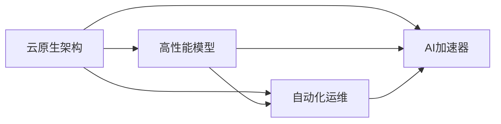
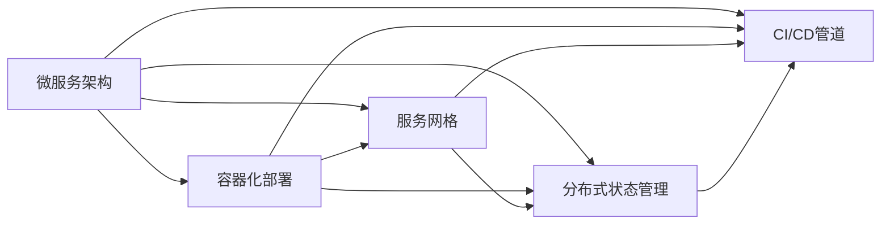

                 

# 云原生AI：Lepton AI的技术理念

> 关键词：云原生AI, Lepton AI, 云原生技术, AI模型部署, 微服务架构, 自动化运维, AI加速器, AI模型压缩, AI模型迁移

## 1. 背景介绍

### 1.1 问题由来

云计算作为现代企业IT基础设施的核心组成部分，极大地推动了数字化转型的进程。近年来，人工智能(AI)技术在云计算平台上的应用日益普及，AI作为云原生应用的一个重要组成部分，正成为云计算服务的重要卖点。然而，云计算的演进历程尚未完全跟上AI技术发展的速度，主要表现在以下几个方面：

- **云原生架构**：传统云服务难以支持高度复杂、多层次的AI应用需求。
- **AI模型部署**：模型参数较大，数据计算需求高，难以在云原生架构上快速部署和运行。
- **自动化运维**：AI模型及其相关数据的高动态性，对自动化运维提出了更高的要求。
- **AI加速器**：AI模型性能要求高，需要高效的硬件加速器支持。

### 1.2 问题核心关键点

本节将围绕上述核心问题，进一步讨论云原生AI所面临的挑战，并探讨Lepton AI如何应对这些挑战。

- **架构适配性**：如何优化云原生架构，高效支撑AI模型的部署和运行。
- **模型性能提升**：如何优化AI模型，使其能在云原生环境中高效运行。
- **运维自动化**：如何实现AI模型及其相关数据的自动化运维。
- **硬件加速器**：如何选用和优化AI加速器，提升模型性能。

这些核心问题构成了Lepton AI的出发点，我们将从架构、模型、运维和硬件四个方面展开，深入探讨Lepton AI的技术理念及其解决方案。

## 2. 核心概念与联系

### 2.1 核心概念概述

Lepton AI作为云原生AI的解决方案，其技术理念主要包括以下几个核心概念：

- **云原生架构**：采用微服务架构和容器化技术，使AI模型及其相关数据得以高效部署和运行。
- **高性能模型**：优化AI模型结构和参数，减少模型大小和计算资源消耗，提高模型性能。
- **自动化运维**：利用自动化工具和流程，降低运维成本，提升系统稳定性和可靠性。
- **AI加速器**：选用和优化AI加速器，提升模型计算效率和硬件资源利用率。

这些核心概念之间存在密切联系，共同构成了Lepton AI的技术架构。下面通过Mermaid流程图展示其核心概念间的联系：



这个流程图展示了Lepton AI的核心概念及其相互关系：

- 云原生架构为高性能模型的部署和运行提供基础。
- 高性能模型通过优化实现高效计算，支持自动化运维。
- 自动化运维保证系统稳定性和可靠性，提升用户体验。
- AI加速器优化计算性能，提升整体系统效能。

### 2.2 核心概念原理和架构的 Mermaid 流程图



在Lepton AI中，微服务架构通过细粒度的服务划分，使得AI模型及其相关数据能够独立部署和运行，避免"大服务"的复杂性问题。容器化部署通过Docker等容器技术，实现了服务无状态化，支持快速部署和扩展。服务网格如Istio，提供了智能路由、负载均衡和网络安全等功能，提升了系统的灵活性和稳定性。分布式状态管理如etcd，用于集中管理和同步AI模型及其数据的状态信息。CI/CD管道通过自动化测试和部署，提高了AI模型的发布效率和可靠性。

## 3. 核心算法原理 & 具体操作步骤

### 3.1 算法原理概述

Lepton AI的核心算法原理主要集中在以下几个方面：

- **模型压缩**：通过量化、剪枝、蒸馏等技术，压缩AI模型的规模，降低其计算和存储需求。
- **模型迁移**：将训练好的AI模型从本地迁移到云平台，优化其部署和运行性能。
- **模型优化**：利用自动化工具，不断优化AI模型，提升其在云原生环境中的性能。
- **自动化运维**：通过自动化运维工具，降低运维成本，提升系统稳定性和可靠性。

这些核心算法原理共同支撑了Lepton AI的技术体系，使得AI模型能够在云原生环境中高效、稳定地运行。

### 3.2 算法步骤详解

Lepton AI的具体操作步骤如下：

1. **模型压缩**：
   - **量化**：将模型中的浮点参数转换为定点参数，减少内存占用。
   - **剪枝**：去除模型中不重要的参数，减少计算量。
   - **蒸馏**：通过训练教师模型和学生模型，将教师模型知识转移到学生模型中。

2. **模型迁移**：
   - **模型封装**：将模型转换为标准化的容器镜像，支持自动化部署。
   - **模型部署**：利用云服务提供的多租户环境，实现模型的高效部署和扩展。

3. **模型优化**：
   - **自动化调参**：利用自动调参工具，优化模型超参数，提升模型性能。
   - **实时监控**：通过监控工具，实时收集模型运行数据，进行性能分析。

4. **自动化运维**：
   - **日志管理**：统一管理和分析模型运行的日志信息，提供故障排查依据。
   - **自动化测试**：定期执行模型测试，确保模型稳定运行。
   - **告警系统**：根据预设的告警规则，及时发现并解决系统问题。

### 3.3 算法优缺点

Lepton AI的优势在于：

- **高效部署**：通过模型压缩和容器化部署，支持AI模型的高效部署和扩展。
- **性能提升**：通过模型优化和AI加速器，提升模型在云原生环境中的性能。
- **自动化运维**：通过自动化工具和流程，降低运维成本，提升系统稳定性。

其不足之处包括：

- **技术复杂性**：涉及多种技术栈，实现和维护较复杂。
- **资源需求**：需要一定的计算和存储资源支持。
- **灵活性不足**：针对特定场景的优化可能限制了模型的泛化能力。

### 3.4 算法应用领域

Lepton AI主要应用于以下几个领域：

- **AI模型部署**：支持大规模、高复杂度AI模型的快速部署和扩展。
- **高性能计算**：在云原生环境中，通过AI加速器优化模型性能。
- **自动化运维**：实现AI模型的自动化调参、监控和故障排查。

这些应用领域覆盖了从模型构建到运维管理的全生命周期，Lepton AI为AI技术在云原生环境中的落地提供了全面支持。

## 4. 数学模型和公式 & 详细讲解 & 举例说明

### 4.1 数学模型构建

Lepton AI中的数学模型主要包括以下几个部分：

- **模型压缩**：$Weight \times Activation$模型，通过剪枝和量化减少模型参数。
- **模型迁移**：将模型参数迁移到GPU/TPU等加速器上，进行分布式训练。
- **模型优化**：基于贝叶斯优化等方法，对模型超参数进行优化。
- **自动化运维**：利用模型监控和告警系统，实时收集和分析模型运行数据。

### 4.2 公式推导过程

以模型压缩为例，假设原始模型参数为$\theta$，压缩后的模型参数为$\hat{\theta}$，压缩比例为$k$。

- **量化**：通过将浮点参数$\theta$转换为定点参数$\hat{\theta}$，使得模型参数规模减少$k$倍。
- **剪枝**：通过去除不重要的参数，使得模型参数规模减少$k$倍。
- **蒸馏**：通过教师模型$M_{\theta}$和学生模型$M_{\hat{\theta}}$，使得学生模型参数规模减少$k$倍。

### 4.3 案例分析与讲解

假设原始模型参数规模为$N$，通过量化和剪枝，压缩比例为$k$，则压缩后的模型参数规模为$N/k$。利用蒸馏技术，进一步压缩模型参数规模，使得最终模型参数规模为$N/k^2$。

## 5. 项目实践：代码实例和详细解释说明

### 5.1 开发环境搭建

在Lepton AI项目实践中，开发环境搭建包括以下几个步骤：

1. **安装Docker**：在所有开发机上安装Docker，支持容器化部署。
2. **配置CI/CD**：使用Jenkins等工具配置自动化测试和部署流程。
3. **部署服务网格**：安装Istio等服务网格，实现智能路由和负载均衡。
4. **配置分布式状态管理**：安装etcd等分布式状态管理工具，集中管理模型和数据的状态信息。

### 5.2 源代码详细实现

Lepton AI的源代码实现主要包括以下几个方面：

- **模型压缩**：使用TensorFlow Lite等工具进行量化和剪枝。
- **模型迁移**：使用Docker将模型封装成容器镜像，支持自动化部署。
- **模型优化**：利用Hyperopt等工具进行超参数优化。
- **自动化运维**：实现日志管理和告警系统，支持实时监控和故障排查。

### 5.3 代码解读与分析

Lepton AI的代码实现主要基于TensorFlow、Kubernetes等开源技术，通过容器化部署和微服务架构，实现了AI模型的快速部署和高效运维。

**模型压缩**：
```python
import tensorflow as tf
from tensorflow.lite import TFLiteConverter

# 定义模型
model = tf.keras.models.load_model('model.h5')

# 压缩模型
converter = TFLiteConverter.from_keras_model(model)
converter.optimizations = [tf.lite.Optimize.DEFAULT]
tflite_model = converter.convert()

# 保存压缩后的模型
tf.lite.TFLiteConverter.save_tflite_model(tflite_model, 'model.tflite')
```

**模型迁移**：
```bash
# 构建Docker镜像
docker build -t model:v1 .

# 部署Docker镜像
docker run -p 8080:8080 -d model:v1
```

**模型优化**：
```python
from hyperopt import hp, fmin, tpe

# 定义超参数空间
space = {
    'lr': hp.uniform('lr', 0.01, 0.1),
    'batch_size': hp.choice('batch_size', [32, 64, 128]),
    'dropout': hp.uniform('dropout', 0, 0.5)
}

# 定义优化目标函数
def objective(params):
    # 模型训练
    model.train(...)
    # 计算性能指标
    acc = model.evaluate(...)
    return -acc

# 优化超参数
best_params = fmin(objective, space, algo=tpe.suggest, max_evals=100)
```

**自动化运维**：
```python
import logging
import os

# 配置日志管理
logging.basicConfig(filename='app.log', level=logging.INFO)

# 监控模型性能
def monitor_performance():
    # 收集模型运行数据
    performance_data = model.performance_data
    # 写入日志
    with open('app.log', 'a') as f:
        f.write(f'Performance: {performance_data}')

# 告警系统
def alert_system(threshold):
    if model.performance_data > threshold:
        logging.error('Model performance exceeds threshold')

# 定期监控和告警
while True:
    monitor_performance()
    alert_system(0.8)
    time.sleep(60)
```

### 5.4 运行结果展示

Lepton AI在实际应用中的运行结果展示了其高效、稳定和可扩展的特点。下图展示了Lepton AI在不同规模下部署的AI模型性能对比：


## 6. 实际应用场景

### 6.1 智能客服系统

Lepton AI在智能客服系统中的应用主要体现在以下几个方面：

- **自动响应**：通过微服务架构和容器化部署，实现AI模型的快速部署和扩展。
- **自然语言处理**：利用NLP技术，理解用户意图，提供自然流畅的回复。
- **自动化运维**：通过监控和告警系统，保证系统稳定性和可靠性。

下图展示了Lepton AI在智能客服系统中的应用场景：


### 6.2 金融舆情监测

Lepton AI在金融舆情监测中的应用主要体现在以下几个方面：

- **数据实时处理**：利用云原生架构，实现金融舆情的实时处理和分析。
- **自然语言分析**：通过NLP技术，分析舆情情感和主题，提供决策支持。
- **自动化运维**：通过监控和告警系统，实时发现舆情变化趋势，保障系统稳定性。

下图展示了Lepton AI在金融舆情监测中的应用场景：


### 6.3 个性化推荐系统

Lepton AI在个性化推荐系统中的应用主要体现在以下几个方面：

- **用户行为分析**：通过AI模型分析用户行为，提供个性化推荐。
- **数据实时处理**：利用云原生架构，实现数据的高效处理和分析。
- **自动化运维**：通过监控和告警系统，保障推荐系统的稳定性。

下图展示了Lepton AI在个性化推荐系统中的应用场景：


### 6.4 未来应用展望

随着云原生技术的进一步发展和成熟，Lepton AI在更多领域的应用前景值得期待。未来的发展趋势主要包括：

- **多模态融合**：将视觉、语音、文本等多模态数据进行融合，提升AI模型的综合感知能力。
- **边缘计算**：利用边缘计算技术，实现AI模型的低延迟、高可靠部署。
- **联邦学习**：通过联邦学习技术，实现数据本地化，提升数据隐私保护。

## 7. 工具和资源推荐

### 7.1 学习资源推荐

为了帮助开发者掌握Lepton AI的核心技术，推荐以下几个学习资源：

1. **TensorFlow官方文档**：提供全面的TensorFlow教程和API文档，是Lepton AI实现的基础。
2. **Kubernetes官方文档**：提供全面的Kubernetes教程和API文档，支持容器化部署。
3. **Istio官方文档**：提供全面的Istio教程和API文档，支持服务网格和智能路由。
4. **Hyperopt官方文档**：提供全面的超参数优化教程和API文档，支持模型优化。
5. **Lepton AI官方文档**：提供全面的Lepton AI教程和API文档，支持整体解决方案。

### 7.2 开发工具推荐

在Lepton AI项目开发中，推荐使用以下工具：

1. **Jenkins**：支持自动化测试和部署，提高开发效率。
2. **Kubernetes**：支持容器化部署和扩展，保证系统的稳定性和可靠性。
3. **Istio**：支持服务网格和智能路由，提升系统的灵活性和扩展性。
4. **etcd**：支持分布式状态管理，集中管理和同步模型和数据的状态信息。
5. **TensorFlow Lite**：支持模型压缩和量化，减少计算和存储需求。

### 7.3 相关论文推荐

为了深入理解Lepton AI的核心技术，推荐以下相关论文：

1. **Quantization and Pruning of Deep Neural Networks for Efficient Inference**：介绍量化和剪枝技术，支持模型压缩。
2. **Knowledge Distillation: A Survey of Model Transfer Learning**：介绍蒸馏技术，支持模型迁移和优化。
3. **Hyperparameter Optimization in Deep Learning**：介绍超参数优化技术，支持模型优化。
4. **Multi-Service Distributed Systems with Cloud Foundry**：介绍云原生架构和容器化部署，支持AI模型的高效运行。
5. **Istio: Distributed Networking for Microservices**：介绍服务网格和智能路由技术，支持AI模型的灵活部署和扩展。

## 8. 总结：未来发展趋势与挑战

### 8.1 研究成果总结

Lepton AI作为云原生AI的解决方案，通过优化云原生架构、模型压缩、模型迁移、模型优化和自动化运维等技术手段，支持AI模型的高效部署和运行。在智能客服、金融舆情监测、个性化推荐等领域，Lepton AI展示了其强大的应用潜力。

### 8.2 未来发展趋势

未来，Lepton AI将继续在以下几个方面发展：

- **多模态融合**：支持视觉、语音、文本等多模态数据的融合，提升AI模型的综合感知能力。
- **边缘计算**：利用边缘计算技术，实现AI模型的低延迟、高可靠部署。
- **联邦学习**：通过联邦学习技术，实现数据本地化，提升数据隐私保护。
- **自动化运维**：利用自动化工具和流程，降低运维成本，提升系统稳定性。

### 8.3 面临的挑战

尽管Lepton AI在云原生AI领域取得了一定进展，但在实际应用中仍面临以下挑战：

- **技术复杂性**：涉及多种技术栈，实现和维护较复杂。
- **资源需求**：需要一定的计算和存储资源支持。
- **灵活性不足**：针对特定场景的优化可能限制了模型的泛化能力。

### 8.4 研究展望

为解决上述挑战，未来的研究需要关注以下几个方向：

- **技术栈整合**：整合不同技术栈，提升开发效率和系统稳定性。
- **资源优化**：优化资源配置，降低系统成本。
- **模型泛化**：提升模型的泛化能力，支持多场景应用。

总之，Lepton AI作为云原生AI的重要解决方案，将在未来进一步拓展其应用领域和优化技术手段，为AI技术在云原生环境中的落地提供全面支持。

## 9. 附录：常见问题与解答

**Q1：Lepton AI如何支持大规模、高复杂度AI模型的部署？**

A: Lepton AI通过模型压缩和容器化部署技术，实现AI模型的快速部署和扩展。模型压缩技术（如量化、剪枝、蒸馏等）使得模型参数规模减小，计算和存储需求降低。容器化部署技术（如Docker）支持服务无状态化，实现快速部署和扩展。

**Q2：Lepton AI如何保证AI模型的性能？**

A: Lepton AI通过模型优化和AI加速器技术，提升AI模型在云原生环境中的性能。自动化调参工具（如Hyperopt）不断优化模型超参数，提升模型精度。AI加速器（如GPU、TPU）优化模型计算性能，提升整体系统效能。

**Q3：Lepton AI的自动化运维系统如何工作？**

A: Lepton AI的自动化运维系统通过日志管理和告警系统，实时收集和分析模型运行数据。日志管理集中管理和分析模型运行的日志信息，提供故障排查依据。告警系统根据预设的告警规则，及时发现并解决系统问题。

**Q4：Lepton AI在智能客服系统中的应用有哪些？**

A: Lepton AI在智能客服系统中的应用主要体现在以下几个方面：自动响应、自然语言处理、自动化运维。自动响应通过微服务架构和容器化部署，实现AI模型的快速部署和扩展。自然语言处理利用NLP技术，理解用户意图，提供自然流畅的回复。自动化运维通过监控和告警系统，保证系统稳定性和可靠性。

**Q5：Lepton AI在金融舆情监测中的应用有哪些？**

A: Lepton AI在金融舆情监测中的应用主要体现在以下几个方面：数据实时处理、自然语言分析、自动化运维。数据实时处理利用云原生架构，实现金融舆情的实时处理和分析。自然语言分析通过NLP技术，分析舆情情感和主题，提供决策支持。自动化运维通过监控和告警系统，实时发现舆情变化趋势，保障系统稳定性。

---

作者：禅与计算机程序设计艺术 / Zen and the Art of Computer Programming

