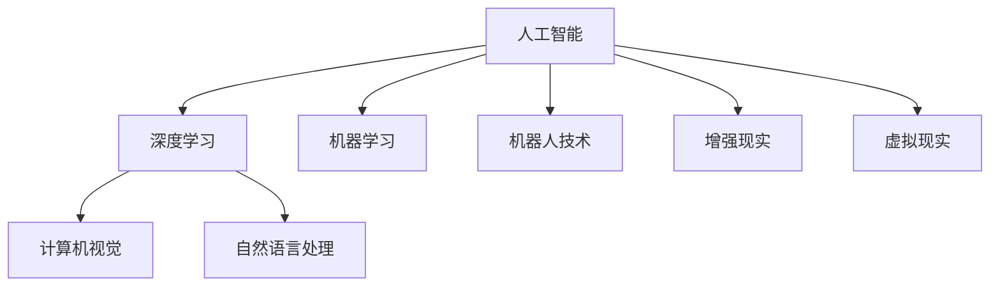

                 

# 人工智能创业：技术创新指南

> 关键词：人工智能,技术创业,创新指南,算法原理,数学模型,项目实践,应用场景,学习资源,未来趋势,常见问题

## 1. 背景介绍

### 1.1 问题由来

随着人工智能技术的快速发展和应用领域的不断拓宽，越来越多的创业者开始将AI作为技术创新的核心动力，试图通过人工智能技术构建新型业务模式，打造全新的解决方案。然而，如何科学地规划技术创新路径，高效地开发AI产品，成功地将技术转化为商业价值，是每个AI创业者所面临的挑战。本文旨在为AI创业者提供一份全面的技术创新指南，帮助他们在人工智能领域的创业道路上走得更稳、更远。

### 1.2 问题核心关键点

人工智能创业的核心在于技术创新，而技术创新又涉及算法选择、数据处理、模型训练、产品设计等多个环节。因此，创业者需要从以下几个关键点入手：

1. **选择合适的人工智能算法**：根据具体应用场景，选择合适的算法框架和模型结构。
2. **获取并处理数据**：确保数据的有效性和多样性，建立高效的数据处理流程。
3. **高效的模型训练**：设计合理的训练策略，提升模型性能和泛化能力。
4. **产品化和商业化**：将技术产品化，制定有效的商业策略，将产品推向市场。

本文将详细介绍这些核心环节的技术要点，帮助创业者在人工智能领域实现成功创新。

## 2. 核心概念与联系

### 2.1 核心概念概述

为更好地理解人工智能创业的技术创新路径，本节将介绍几个密切相关的核心概念：

- **人工智能 (AI)**：以计算机科学和数学为基础，模拟人类智能的领域，涉及感知、推理、学习、自然语言处理等多个分支。
- **深度学习 (DL)**：一种基于神经网络的机器学习方法，用于解决复杂模式识别和预测问题。
- **机器学习 (ML)**：一种通过数据训练模型，使模型能够自动学习和预测的技术。
- **计算机视觉 (CV)**：研究如何让计算机理解和解释视觉信号，包括图像识别、目标检测等。
- **自然语言处理 (NLP)**：让计算机理解、处理和生成自然语言的技术。
- **机器人技术**：结合机械工程、计算机科学等学科，构建自主运行的智能机器人。
- **增强现实 (AR) 和虚拟现实 (VR)**：通过虚拟和现实世界的融合，增强人类与计算机的交互体验。

这些核心概念之间的逻辑关系可以通过以下Mermaid流程图来展示：



这个流程图展示了人工智能相关领域的技术架构，其中深度学习是AI的核心驱动力，机器学习和自然语言处理是其重要的应用分支，而计算机视觉、机器人技术和AR/VR则是AI技术在特定领域的具体实现。

## 3. 核心算法原理 & 具体操作步骤
### 3.1 算法原理概述

人工智能创业的核心在于技术创新，而技术创新的关键在于选择和应用合适的算法。本文将详细介绍几种常用的人工智能算法及其原理，帮助创业者选择合适的技术工具。

- **监督学习 (Supervised Learning)**：利用标注数据训练模型，使模型能够根据输入数据预测输出标签。常见的算法包括线性回归、决策树、支持向量机等。
- **无监督学习 (Unsupervised Learning)**：从未标注数据中学习数据的分布和内在结构，常见的算法包括聚类、降维等。
- **强化学习 (Reinforcement Learning)**：通过与环境的交互，优化策略以最大化长期回报。常见的算法包括Q-learning、Deep Q-Network等。
- **迁移学习 (Transfer Learning)**：利用已有模型的知识，提升新模型的性能。常见的算法包括数据迁移、模型迁移等。
- **生成对抗网络 (GANs)**：通过对抗训练，生成高质量的合成数据。常见的算法包括DCGAN、WGAN等。

这些算法各有特点，适用于不同的应用场景。创业者需要根据具体需求，选择合适的算法框架。

### 3.2 算法步骤详解

人工智能创业的技术创新过程包括以下几个关键步骤：

**Step 1: 问题定义与数据准备**
- 明确创业项目的目标和需求，定义具体的问题。
- 收集和预处理数据，确保数据的质量和多样性。

**Step 2: 算法选择与模型设计**
- 根据问题类型，选择合适的算法和模型结构。
- 设计模型的超参数，如学习率、批量大小等，确保模型能够高效训练。

**Step 3: 模型训练与优化**
- 使用训练数据训练模型，优化超参数，提升模型性能。
- 利用验证集评估模型效果，调整模型参数。

**Step 4: 模型评估与部署**
- 在测试集上评估模型性能，确保模型泛化能力。
- 将模型部署到实际应用场景中，收集反馈，持续优化。

### 3.3 算法优缺点

不同算法具有不同的优缺点，以下是一些常见的算法及其特点：

**监督学习**：
- 优点：模型性能稳定，适用于标注数据较多、问题定义明确的情况。
- 缺点：需要大量标注数据，数据收集成本高，容易过拟合。

**无监督学习**：
- 优点：不需要标注数据，数据来源广泛，适用于数据量大但标注困难的情况。
- 缺点：模型效果依赖数据分布，对噪声数据敏感。

**强化学习**：
- 优点：能够处理复杂环境，适用于动态环境下的决策优化。
- 缺点：训练过程复杂，需要大量试错和迭代。

**迁移学习**：
- 优点：能够利用已有知识，提升新模型性能，数据需求低。
- 缺点：模型迁移效果依赖于源任务和目标任务之间的相似性。

**生成对抗网络**：
- 优点：能够生成高质量的合成数据，适用于数据稀缺的情况。
- 缺点：训练过程复杂，模型稳定性差，容易产生模式崩溃。

创业者需要根据具体场景，合理选择和组合这些算法，以实现技术创新。

### 3.4 算法应用领域

人工智能算法广泛应用于各个领域，以下是一些典型应用场景：

- **计算机视觉**：用于图像识别、目标检测、图像生成等。
- **自然语言处理**：用于文本分类、情感分析、机器翻译等。
- **机器人技术**：用于自主导航、人机交互、情感识别等。
- **增强现实与虚拟现实**：用于虚拟场景构建、交互式体验等。
- **医疗健康**：用于疾病诊断、药物研发、健康监测等。
- **金融领域**：用于风险评估、欺诈检测、个性化推荐等。
- **智能交通**：用于交通流量预测、自动驾驶、智能监控等。

这些应用场景展示了人工智能技术在不同领域的广泛应用，为创业者提供了丰富的创新方向。

## 4. 数学模型和公式 & 详细讲解 & 举例说明
### 4.1 数学模型构建

本节将介绍几种常见的人工智能算法及其数学模型。

以线性回归为例，其数学模型为：

$$
y = \beta_0 + \beta_1x_1 + \beta_2x_2 + \cdots + \beta_nx_n
$$

其中，$y$ 为输出变量，$x_i$ 为输入变量，$\beta_i$ 为模型参数。

### 4.2 公式推导过程

线性回归的训练过程包括数据拟合和参数求解。

1. 数据拟合：将训练数据代入模型，求解最小二乘解。
2. 参数求解：利用梯度下降等优化算法，求解模型参数，最小化预测误差。

### 4.3 案例分析与讲解

假设我们有一个简单的房屋价格预测任务，输入变量包括房屋面积、楼层、朝向等，输出变量为房屋价格。我们可以使用线性回归模型来预测房屋价格。

1. 数据准备：收集房屋面积、楼层、朝向等数据，并标注房屋价格。
2. 模型训练：使用训练数据训练线性回归模型，求解模型参数。
3. 模型评估：在测试数据上评估模型性能，调整模型参数。
4. 模型部署：将模型部署到实际应用场景中，进行房屋价格预测。

## 5. 项目实践：代码实例和详细解释说明
### 5.1 开发环境搭建

在进行AI项目开发前，需要先搭建好开发环境。以下是使用Python进行深度学习开发的环境配置流程：

1. 安装Anaconda：从官网下载并安装Anaconda，用于创建独立的Python环境。
2. 创建并激活虚拟环境：
```bash
conda create -n pytorch-env python=3.8 
conda activate pytorch-env
```
3. 安装PyTorch：根据CUDA版本，从官网获取对应的安装命令。例如：
```bash
conda install pytorch torchvision torchaudio cudatoolkit=11.1 -c pytorch -c conda-forge
```
4. 安装TensorFlow：
```bash
pip install tensorflow
```
5. 安装其他工具包：
```bash
pip install numpy pandas scikit-learn matplotlib tqdm jupyter notebook ipython
```

完成上述步骤后，即可在`pytorch-env`环境中开始AI项目开发。

### 5.2 源代码详细实现

下面以图像分类任务为例，给出使用TensorFlow进行深度学习项目开发的完整代码实现。

```python
import tensorflow as tf
from tensorflow import keras

# 加载数据集
mnist = keras.datasets.mnist
(train_images, train_labels), (test_images, test_labels) = mnist.load_data()

# 数据预处理
train_images = train_images / 255.0
test_images = test_images / 255.0

# 定义模型
model = keras.Sequential([
    keras.layers.Flatten(input_shape=(28, 28)),
    keras.layers.Dense(128, activation='relu'),
    keras.layers.Dense(10, activation='softmax')
])

# 定义损失函数和优化器
loss_fn = keras.losses.SparseCategoricalCrossentropy(from_logits=True)
optimizer = keras.optimizers.Adam()

# 编译模型
model.compile(optimizer=optimizer, loss=loss_fn, metrics=['accuracy'])

# 训练模型
model.fit(train_images, train_labels, epochs=10, validation_data=(test_images, test_labels))

# 评估模型
test_loss, test_acc = model.evaluate(test_images, test_labels)
print('Test accuracy:', test_acc)
```

### 5.3 代码解读与分析

让我们再详细解读一下关键代码的实现细节：

**数据准备**：
- 使用`keras.datasets.mnist`加载MNIST数据集。
- 对数据进行归一化处理，确保输入数据的范围在[0,1]之间。

**模型定义**：
- 使用`Sequential`定义线性回归模型，包含一个Flatten层、一个Dense层和一个Softmax输出层。
- 使用`Dense`层定义全连接神经网络，设置激活函数为ReLU。

**模型编译**：
- 使用`compile`方法定义损失函数和优化器，设置评估指标为准确率。

**模型训练**：
- 使用`fit`方法训练模型，设置训练轮数为10。
- 使用`validation_data`参数指定验证集，用于评估模型性能。

**模型评估**：
- 使用`evaluate`方法在测试集上评估模型性能，输出测试准确率。

可以看到，TensorFlow提供了便捷的API，使得深度学习模型的开发和训练变得非常简单。开发者可以将更多精力放在模型设计和优化上，而不必过多关注底层的实现细节。

## 6. 实际应用场景
### 6.1 医疗健康

人工智能在医疗健康领域的应用前景广阔。通过深度学习模型，可以实现疾病诊断、个性化治疗、健康监测等任务。

1. **疾病诊断**：利用深度学习模型，对医学影像进行自动诊断，提高诊断效率和准确性。
2. **个性化治疗**：根据患者的基因信息、病史等数据，利用深度学习模型推荐个性化的治疗方案。
3. **健康监测**：利用可穿戴设备采集的数据，通过深度学习模型监测健康状态，提供实时预警和干预建议。

### 6.2 金融领域

金融领域对人工智能的需求日益增加，通过深度学习模型，可以实现风险评估、欺诈检测、个性化推荐等任务。

1. **风险评估**：利用深度学习模型对贷款、投资等金融产品进行风险评估，降低风险损失。
2. **欺诈检测**：通过深度学习模型检测异常交易行为，防止金融欺诈。
3. **个性化推荐**：利用深度学习模型推荐个性化的金融产品，提升用户体验。

### 6.3 智能交通

智能交通是人工智能在城市管理中的应用方向之一。通过深度学习模型，可以实现交通流量预测、自动驾驶、智能监控等任务。

1. **交通流量预测**：利用深度学习模型预测交通流量，优化交通管理。
2. **自动驾驶**：通过深度学习模型实现自动驾驶，提高行车安全和效率。
3. **智能监控**：利用深度学习模型对视频监控数据进行分析，提供实时预警和异常识别。

### 6.4 未来应用展望

未来，人工智能技术将在更多领域得到应用，为各行各业带来变革性影响。以下是一些可能的应用方向：

1. **智能制造**：通过深度学习模型实现智能制造，提高生产效率和产品质量。
2. **农业科技**：利用深度学习模型进行精准农业，提高农业生产效率和资源利用率。
3. **智慧城市**：通过深度学习模型实现智慧城市管理，提高城市运行效率和居民生活质量。
4. **环境保护**：利用深度学习模型进行环境监测和污染源识别，提供科学决策支持。

## 7. 工具和资源推荐
### 7.1 学习资源推荐

为帮助AI创业者系统掌握人工智能技术，这里推荐一些优质的学习资源：

1. **《深度学习》课程**：斯坦福大学开设的深度学习课程，涵盖了深度学习的基础和高级内容，适合入门学习。
2. **《TensorFlow官方文档》**：TensorFlow的官方文档，提供了详细的API参考和示例代码，是学习TensorFlow的最佳资源。
3. **《Python深度学习》书籍**：弗朗索瓦·切雷里(François Chollet)著，全面介绍了深度学习原理和TensorFlow的应用，适合进阶学习。
4. **《自然语言处理综论》**：清华大学郑南宁教授著，涵盖了自然语言处理的基础和高级内容，适合深入学习。
5. **Kaggle竞赛平台**：Kaggle提供了大量的数据集和比赛，适合实践和检验深度学习模型的效果。

通过对这些资源的学习实践，相信你一定能够系统掌握人工智能技术，并用于解决实际的商业问题。

### 7.2 开发工具推荐

高效的开发离不开优秀的工具支持。以下是几款用于AI项目开发的常用工具：

1. **Jupyter Notebook**：支持Python和R等语言的开发环境，适合数据处理和模型训练。
2. **Google Colab**：谷歌提供的云端Jupyter Notebook环境，免费提供GPU/TPU算力，方便开发者快速实验最新模型。
3. **PyCharm**：JetBrains公司开发的IDE，支持Python和TensorFlow等框架，适合大规模工程开发。
4. **Anaconda Navigator**：Anaconda提供的桌面界面，方便管理虚拟环境和Python包。
5. **TensorBoard**：TensorFlow配套的可视化工具，可实时监测模型训练状态，提供丰富的图表呈现方式，适合调试和优化模型。

合理利用这些工具，可以显著提升AI项目开发的效率，加快创新迭代的步伐。

### 7.3 相关论文推荐

以下是一些关于人工智能技术的重要论文，推荐阅读：

1. **ImageNet Classification with Deep Convolutional Neural Networks**：AlexNet论文，开创了深度学习在图像分类领域的应用。
2. **Long Short-Term Memory**：LSTM论文，提出了一种适用于序列数据处理的神经网络结构。
3. **Attention is All You Need**：Transformer论文，提出了一种全新的神经网络结构，极大地提高了机器翻译的准确性。
4. **AlphaGo Zero**：DeepMind的AlphaGo Zero论文，展示了强化学习在围棋领域的应用。
5. **GPT-3: Language Models are Unsupervised Multitask Learners**：GPT-3论文，展示了大规模无监督预训练语言模型在自然语言处理领域的应用。

这些论文代表了大规模人工智能技术的发展脉络，通过学习这些前沿成果，可以帮助创业者掌握最新的技术趋势和应用方向。

## 8. 总结：未来发展趋势与挑战
### 8.1 研究成果总结

人工智能技术在各个领域的应用取得了显著的成果，但也面临一些挑战和问题：

1. **数据质量问题**：数据质量直接影响模型的性能和泛化能力，需要确保数据的有效性和多样性。
2. **模型复杂度问题**：大规模深度学习模型需要大量的计算资源，如何降低模型复杂度，提升模型效率，是未来研究的重要方向。
3. **算法可解释性问题**：深度学习模型通常被称为“黑盒”，如何提高模型的可解释性，增强用户对模型的信任，是亟待解决的问题。
4. **伦理和安全问题**：深度学习模型可能会产生偏见和歧视，如何确保模型公平性和安全性，是未来研究的重点。

### 8.2 未来发展趋势

未来，人工智能技术将在更多领域得到应用，为各行各业带来变革性影响：

1. **数据驱动的决策**：通过深度学习模型，优化决策过程，提高决策效率和准确性。
2. **智能交互**：通过自然语言处理技术，实现人机自然交互，提升用户体验。
3. **跨领域融合**：将人工智能技术与物联网、区块链等新兴技术结合，拓展应用场景。
4. **联邦学习**：通过分布式训练技术，提升模型泛化能力，保护数据隐私。

### 8.3 面临的挑战

尽管人工智能技术取得了显著的进展，但仍面临一些挑战：

1. **数据获取和标注问题**：获取高质量的数据和标注数据成本高，数据分布不均衡。
2. **计算资源限制**：大规模深度学习模型需要大量的计算资源，如何降低计算成本，提升计算效率，是未来研究的重要方向。
3. **模型可解释性问题**：深度学习模型通常被称为“黑盒”，如何提高模型的可解释性，增强用户对模型的信任，是亟待解决的问题。
4. **伦理和安全问题**：深度学习模型可能会产生偏见和歧视，如何确保模型公平性和安全性，是未来研究的重点。

### 8.4 研究展望

未来，人工智能技术的研究将更多地关注以下几个方向：

1. **联邦学习**：通过分布式训练技术，提升模型泛化能力，保护数据隐私。
2. **跨领域融合**：将人工智能技术与物联网、区块链等新兴技术结合，拓展应用场景。
3. **可解释性增强**：提高模型的可解释性，增强用户对模型的信任，提升模型应用的可靠性。
4. **伦理和安全研究**：建立模型公平性和安全性的保障机制，确保模型应用的伦理性和安全性。

这些研究方向将引领人工智能技术迈向更高的台阶，为构建安全、可靠、可解释、可控的智能系统铺平道路。面向未来，人工智能技术还需要与其他人工智能技术进行更深入的融合，多路径协同发力，共同推动自然语言理解和智能交互系统的进步。只有勇于创新、敢于突破，才能不断拓展人工智能技术的边界，让智能技术更好地造福人类社会。

## 9. 附录：常见问题与解答

**Q1：人工智能创业需要哪些核心技能？**

A: 人工智能创业需要掌握以下核心技能：
1. **算法和模型**：熟悉常见的人工智能算法和模型，能够选择合适的算法框架和模型结构。
2. **数据处理**：能够收集、清洗和预处理数据，确保数据的质量和多样性。
3. **深度学习框架**：掌握常用的深度学习框架，如TensorFlow、PyTorch等，进行模型训练和优化。
4. **业务理解**：理解应用场景和用户需求，设计合理的业务方案和技术方案。
5. **项目管理**：具备项目管理能力，能够高效地规划和执行项目。

**Q2：如何选择深度学习框架？**

A: 选择深度学习框架应考虑以下因素：
1. **社区支持**：选择一个拥有活跃社区和大量开源资源的平台，方便开发者获取帮助和资源。
2. **易用性**：选择一个易用性高的框架，方便快速开发和调试模型。
3. **性能表现**：选择一个性能表现优异的框架，保证模型的训练和推理效率。
4. **生态系统**：选择一个生态系统丰富的框架，方便与其他工具和库集成。

**Q3：如何提高模型的泛化能力？**

A: 提高模型的泛化能力应考虑以下因素：
1. **数据质量**：确保数据的质量和多样性，避免过拟合。
2. **正则化**：使用L2正则化、Dropout等技术，避免模型过拟合。
3. **数据增强**：通过数据增强技术，扩充训练数据，提高模型的泛化能力。
4. **模型复杂度**：简化模型结构，减少模型参数，避免过拟合。
5. **迁移学习**：利用已有模型的知识，提升新模型的性能。

**Q4：如何评估模型的性能？**

A: 评估模型的性能应考虑以下指标：
1. **准确率**：模型在测试集上的分类准确率，反映模型的分类能力。
2. **召回率**：模型对真实正例的识别率，反映模型对正例的覆盖能力。
3. **F1分数**：综合考虑准确率和召回率，反映模型的综合性能。
4. **ROC曲线**：绘制模型的ROC曲线，反映模型的分类性能。
5. **AUC值**：计算模型的AUC值，反映模型的分类性能。

**Q5：如何优化模型的训练过程？**

A: 优化模型的训练过程应考虑以下因素：
1. **超参数调优**：选择合适的超参数，如学习率、批量大小等，提升模型的训练效率和效果。
2. **学习率调度**：采用合适的学习率调度策略，避免学习率过大或过小。
3. **正则化**：使用L2正则化、Dropout等技术，避免模型过拟合。
4. **梯度累积**：采用梯度累积技术，提高模型的训练效率。
5. **模型并行**：采用模型并行技术，提升模型的训练效率。

---

作者：禅与计算机程序设计艺术 / Zen and the Art of Computer Programming

