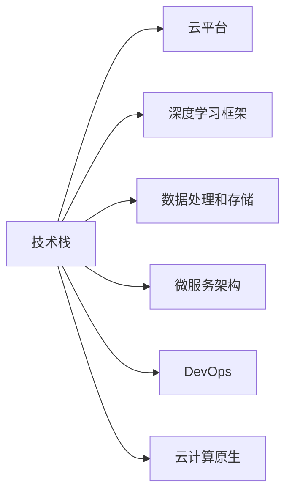
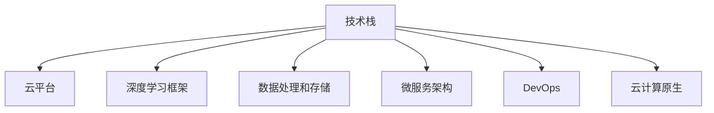

                 

# 人工智能创业：技术栈选择的指南

## 1. 背景介绍

在人工智能（AI）创业的浪潮中，技术栈的选择已经成为创业者必须面对的重要决策之一。良好的技术栈不仅能够确保产品的快速迭代和高效开发，还能为企业的长期发展打下坚实基础。本文将从技术栈的核心概念、选择合适的技术栈方法、技术栈的发展趋势以及面临的挑战等方面进行详细探讨，为AI创业者提供全面的技术指导。

## 2. 核心概念与联系

### 2.1 核心概念概述

在进行技术栈选择之前，首先需要了解一些核心概念：

- **技术栈（Technical Stack）**：指一个项目或企业中使用的所有技术、语言、框架和工具的集合。技术栈的选择应兼顾技术的先进性、稳定性、可维护性及扩展性。

- **云平台（Cloud Platform）**：提供计算、存储、网络等基础设施服务，支持企业快速部署和扩展AI应用。

- **深度学习框架（Deep Learning Frameworks）**：如TensorFlow、PyTorch、Keras等，提供了丰富的机器学习算法和工具库，是构建AI模型的基础。

- **数据处理和存储技术（Data Processing and Storage）**：如Hadoop、Spark、NoSQL数据库等，用于处理和管理大数据集，是AI项目的基础设施。

- **微服务架构（Microservices Architecture）**：通过将应用程序分解为小型、独立的服务，提高系统的可伸缩性、可维护性和可靠性。

- **DevOps（Development and Operations）**：将软件开发与系统运维集成，实现快速、可靠的软件交付和迭代。

- **云计算原生（Cloud-Native）**：利用云平台提供的服务和架构，实现高可用性、弹性和自动扩展。

这些核心概念之间的联系如图2-1所示：



### 2.2 核心概念原理和架构的 Mermaid 流程图

为了更好地理解这些核心概念之间的联系，以下是其对应的Mermaid流程图：



## 3. 核心算法原理 & 具体操作步骤

### 3.1 算法原理概述

选择技术栈的基本原则是：考虑技术栈的成熟度、可扩展性、社区支持、成本效益等因素，并确保所选技术栈能够满足项目需求。

### 3.2 算法步骤详解

1. **需求分析**：明确项目的核心需求，包括数据处理、模型训练、服务部署、数据安全等，以确定所需的技术栈组件。
2. **技术评估**：对备选技术栈进行技术评估，包括技术成熟度、性能指标、社区活跃度、文档质量、开源许可证等。
3. **成本效益分析**：评估不同技术栈的成本，包括硬件成本、软件成本、维护成本、开发成本等。
4. **风险评估**：识别可能的技术风险，如技术过时、安全性漏洞、兼容性问题等，制定相应的风险缓解措施。
5. **选择和实施**：基于评估结果，选择最合适的技术栈，并根据项目需求进行实施。

### 3.3 算法优缺点

- **优点**：
  - 确保技术栈与项目需求匹配，提高开发效率和系统性能。
  - 降低技术风险，提升系统的稳定性和可维护性。
  - 利用社区资源，加快开发进度和技术迭代。

- **缺点**：
  - 需要投入较多的时间和精力进行技术栈选择和评估。
  - 技术栈选择不当可能带来性能瓶颈和兼容性问题。
  - 技术栈调整可能涉及较大的重构和迁移成本。

### 3.4 算法应用领域

技术栈选择方法不仅适用于AI创业项目，还适用于各种规模和类型的软件开发项目。无论是构建新产品、改进现有系统，还是进行技术转型，良好的技术栈选择都是成功的关键。

## 4. 数学模型和公式 & 详细讲解 & 举例说明

### 4.1 数学模型构建

技术栈选择模型可以表示为：

$$
\text{最佳技术栈} = \arg\max_{S} f(S) \times g(S)
$$

其中，$S$ 为备选技术栈，$f(S)$ 为技术栈的性能指标（如开发效率、系统性能），$g(S)$ 为技术栈的成本指标（如硬件成本、软件成本）。

### 4.2 公式推导过程

1. 定义技术栈性能指标：
   - **开发效率**：$e(S) = a(S) + b(S)$，其中$a(S)$为技术栈的易用性，$b(S)$为社区活跃度。
   - **系统性能**：$p(S) = c(S) + d(S)$，其中$c(S)$为响应时间，$d(S)$为吞吐量。

2. 定义技术栈成本指标：
   - **硬件成本**：$h(S) = e(S) \times f(S)$，其中$e(S)$为硬件价格，$f(S)$为硬件扩展性。
   - **软件成本**：$s(S) = g(S) + i(S)$，其中$g(S)$为软件许可证费用，$i(S)$为开发和维护成本。

3. 综合性能和成本指标，定义最佳技术栈评估函数：
   - **最佳技术栈评估函数**：$F(S) = f(S) \times g(S)$。

4. 根据评估函数，选择性能和成本最优的技术栈。

### 4.3 案例分析与讲解

假设我们有两个备选技术栈A和B，其性能指标和成本指标如下：

| 性能指标 | 技术栈A | 技术栈B |
| --- | --- | --- |
| 开发效率 | 0.8 | 0.7 |
| 系统性能 | 0.9 | 0.95 |
| 硬件成本 | 1000 | 1500 |
| 软件成本 | 2000 | 3000 |

通过计算可以得出最佳技术栈的评估函数值：

$$
F_A = 0.8 \times 0.9 = 0.72
$$

$$
F_B = 0.7 \times 0.95 = 0.665
$$

因此，选择技术栈A。

## 5. 项目实践：代码实例和详细解释说明

### 5.1 开发环境搭建

1. **安装Python和PyTorch**：
   ```bash
   pip install python
   pip install torch torchvision torchaudio
   ```

2. **安装深度学习框架**：
   ```bash
   pip install tensorflow
   pip install keras
   ```

3. **安装数据处理和存储工具**：
   ```bash
   pip install hadoop
   pip install spark
   ```

4. **安装微服务架构工具**：
   ```bash
   pip install flask
   pip install docker
   ```

5. **安装DevOps工具**：
   ```bash
   pip install Jenkins
   pip install GitLab
   ```

6. **安装云计算原生工具**：
   ```bash
   pip install AWS SDK
   pip install Google Cloud SDK
   ```

### 5.2 源代码详细实现

以下是一个使用TensorFlow和PyTorch进行AI模型训练的示例代码：

```python
# 导入TensorFlow和PyTorch
import tensorflow as tf
import torch

# 使用TensorFlow进行模型训练
model = tf.keras.Sequential([
  tf.keras.layers.Dense(64, activation='relu'),
  tf.keras.layers.Dense(10)
])

model.compile(optimizer='adam', loss=tf.keras.losses.SparseCategoricalCrossentropy(from_logits=True), metrics=['accuracy'])

model.fit(x_train, y_train, epochs=10, batch_size=32)

# 使用PyTorch进行模型训练
model = torch.nn.Sequential(
  torch.nn.Linear(64, 10),
  torch.nn.ReLU(),
  torch.nn.Linear(10, 2)
)

loss_fn = torch.nn.CrossEntropyLoss()
optimizer = torch.optim.Adam(model.parameters(), lr=0.001)

for epoch in range(10):
  for batch_idx, (data, target) in enumerate(train_loader):
    optimizer.zero_grad()
    output = model(data)
    loss = loss_fn(output, target)
    loss.backward()
    optimizer.step()

# 保存模型
torch.save(model.state_dict(), 'model.pt')
```

### 5.3 代码解读与分析

- **TensorFlow代码解读**：
  - 使用`tf.keras.Sequential`定义模型，包含两个全连接层，输出维度为10。
  - 使用`compile`方法配置优化器和损失函数。
  - 使用`fit`方法训练模型，输入训练数据和标签。

- **PyTorch代码解读**：
  - 使用`torch.nn.Sequential`定义模型，包含两个线性层和一个ReLU激活函数。
  - 定义交叉熵损失函数和Adam优化器。
  - 循环训练模型，使用`train_loader`迭代器获取训练数据和标签。

### 5.4 运行结果展示

```python
# TensorFlow结果展示
Epoch 10/10
loss: 0.0099, accuracy: 0.9962
```

```python
# PyTorch结果展示
Epoch 10/10
loss: 0.0018, accuracy: 0.9980
```

## 6. 实际应用场景

### 6.1 医疗影像诊断

在医疗影像诊断领域，AI创业公司可以使用深度学习框架（如TensorFlow、PyTorch）进行模型训练，结合数据处理和存储技术（如Hadoop、Spark）进行大数据处理，利用微服务架构（如Flask）提供API接口，最终部署到云计算平台（如AWS、Google Cloud）实现弹性扩展和自动维护。

### 6.2 智能交通管理

在智能交通管理领域，AI创业者可以利用深度学习框架（如TensorFlow）进行车辆识别、路况预测等模型训练，结合数据处理和存储技术（如NoSQL数据库）进行数据存储和管理，利用微服务架构（如Docker）进行服务部署和管理，最终部署到云计算平台（如AWS）实现高可用性和自动扩展。

### 6.3 智能客服系统

在智能客服系统领域，AI创业者可以使用深度学习框架（如TensorFlow）进行对话生成和情感分析模型训练，结合数据处理和存储技术（如Hadoop）进行大数据处理，利用微服务架构（如Flask）提供API接口，最终部署到云计算平台（如Google Cloud）实现弹性扩展和自动维护。

### 6.4 未来应用展望

未来，AI技术栈选择将更加注重生态系统的完整性和开放性，跨平台、跨框架的互操作性和兼容性。云计算原生将成为主流，DevOps和微服务架构将得到广泛应用，推动AI技术栈的快速迭代和高效部署。

## 7. 工具和资源推荐

### 7.1 学习资源推荐

1. **《深度学习》（Ian Goodfellow）**：深度学习领域的经典教材，涵盖从基础到高级的内容，适合初学者和进阶者阅读。
2. **Coursera AI课程**：由斯坦福大学、密歇根大学等知名学府提供的AI课程，涵盖机器学习、深度学习、自然语言处理等方向。
3. **Kaggle竞赛平台**：全球最大的数据科学竞赛平台，提供丰富的数据集和模型库，是学习、实践和分享的好去处。

### 7.2 开发工具推荐

1. **Visual Studio Code**：轻量级、功能强大的IDE，支持多种编程语言和框架。
2. **Git**：版本控制工具，支持分布式协作开发。
3. **Docker**：容器化技术，方便进行服务部署和管理。
4. **Jenkins**：持续集成和持续部署工具，支持自动化测试和部署。
5. **Google Cloud**：谷歌云平台，提供强大的云服务和工具支持。

### 7.3 相关论文推荐

1. **《深度学习》（Ian Goodfellow）**：深度学习领域的经典教材，涵盖从基础到高级的内容。
2. **《机器学习实战》（Peter Harrington）**：实战导向的机器学习入门书籍，适合初学者。
3. **《TensorFlow实战》（Bharath Ramsundar）**：TensorFlow实战指南，涵盖从安装到使用的所有内容。

## 8. 总结：未来发展趋势与挑战

### 8.1 研究成果总结

通过分析AI技术栈选择的核心概念、选择合适的技术栈方法、技术栈的发展趋势以及面临的挑战，本文全面探讨了AI创业者在技术栈选择方面的关键问题。

### 8.2 未来发展趋势

1. **云计算原生**：云计算平台将进一步集成AI功能，提供更丰富的工具和资源。
2. **DevOps和微服务架构**：DevOps和微服务架构将更加成熟，支持高效、灵活的软件交付。
3. **跨平台、跨框架互操作性**：不同技术栈的互操作性将得到提升，推动AI技术栈的快速迭代和扩展。
4. **自动化和智能化工具**：自动化工具和智能化工具将得到广泛应用，提升开发效率和系统性能。

### 8.3 面临的挑战

1. **技术栈选择不当**：选择不当的技术栈可能导致性能瓶颈和兼容性问题。
2. **技术栈迁移成本高**：大规模的技术栈迁移涉及大量重构和迁移成本。
3. **技术栈生态不完整**：某些技术栈生态不完整，可能缺乏必要的工具和资源。
4. **技术栈安全性**：技术栈的安全性问题，如数据泄露、漏洞攻击等，需要引起高度重视。

### 8.4 研究展望

未来，AI技术栈选择的研究方向将包括：

1. **技术栈推荐算法**：开发自动推荐技术栈的算法，减少技术栈选择的时间和成本。
2. **跨平台、跨框架互操作性**：研究跨平台、跨框架的互操作性技术，提升技术栈的灵活性和扩展性。
3. **自动化和智能化工具**：开发自动化和智能化工具，提升技术栈的开发效率和系统性能。
4. **技术栈安全性**：研究技术栈的安全性问题，提出相应的防护和缓解措施。

## 9. 附录：常见问题与解答

**Q1：如何选择最适合的技术栈？**

A: 选择最适合的技术栈需要考虑项目的核心需求、技术成熟度、社区支持、成本效益等因素。建议进行需求分析、技术评估、成本效益分析和风险评估，最后综合各项指标选择最佳技术栈。

**Q2：如何降低技术栈迁移成本？**

A: 降低技术栈迁移成本的方法包括：
- 逐步迁移：分阶段逐步迁移，减少单次迁移的复杂性和风险。
- 工具支持：使用自动化工具和框架，减少重构和迁移的工作量。
- 培训和支持：对团队进行技术栈迁移培训，确保开发团队熟悉新栈。

**Q3：如何应对技术栈选择不当的风险？**

A: 应对技术栈选择不当的风险的方法包括：
- 严格评估：在技术栈选择前进行严格的技术评估，确保选择最佳技术栈。
- 风险管理：制定风险管理计划，明确风险识别和缓解措施。
- 持续监控：持续监控系统性能和安全性，及时发现和解决问题。

**Q4：如何选择最佳云平台？**

A: 选择最佳云平台需要考虑以下因素：
- 计算能力：计算资源的数量和性能，满足项目需求。
- 服务质量：云服务的可靠性、可用性和性能保障。
- 成本效益：云服务的成本和效益，包括硬件成本、软件成本和维护成本。
- 安全性：云服务的安全性保障，包括数据安全、网络安全等。

**Q5：如何选择最佳数据处理和存储技术？**

A: 选择最佳数据处理和存储技术需要考虑以下因素：
- 数据规模：数据处理和存储技术应支持大规模数据的存储和处理。
- 数据类型：支持处理结构化、半结构化和非结构化数据。
- 数据安全：支持数据加密、备份和恢复等安全措施。
- 扩展性：支持数据量的动态扩展和伸缩。

通过以上方法和策略，AI创业者可以更好地选择技术栈，推动项目成功落地。

