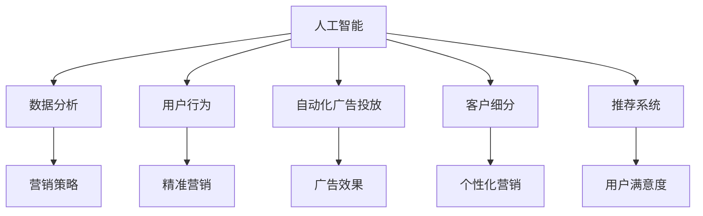

                 

# 人工智能在社交媒体和营销中的应用

> 关键词：人工智能,社交媒体,营销,数据分析,用户行为,自动化,广告投放,客户细分,推荐系统

## 1. 背景介绍

在数字化时代，社交媒体和营销领域正在经历前所未有的变革。随着移动互联网和数字技术的飞速发展，社交媒体平台成为了商家与消费者互动的重要渠道，为品牌和产品提供了前所未有的曝光机会。然而，如何在海量的数据中识别潜在客户，提升营销效率，是每个品牌面临的重要挑战。在这一背景下，人工智能技术应运而生，成为企业数字化转型的关键引擎。

人工智能(AI)技术在社交媒体和营销领域的应用，涵盖了用户行为分析、自动化广告投放、客户细分、推荐系统等多个方面。通过深度学习、自然语言处理、计算机视觉等前沿技术，AI不仅能够高效地处理和分析数据，还能提供精准的营销策略和个性化服务，助力企业在竞争激烈的市场中脱颖而出。

## 2. 核心概念与联系

### 2.1 核心概念概述

为更好地理解AI在社交媒体和营销中的应用，本节将介绍几个关键概念及其联系：

- **人工智能**：通过机器学习、深度学习等技术，使机器具备类似于人类的感知、学习、推理能力，以实现特定目标的技术。
- **社交媒体**：通过网络技术，使人们能够实时分享、交流和互动的虚拟平台，如Facebook、Twitter、微信等。
- **营销**：企业通过各种手段和渠道，向目标市场传递产品或服务信息，以促成交易的过程。
- **数据分析**：通过数据收集、处理、分析和解释，发现有价值的信息，辅助决策和优化过程。
- **用户行为**：用户在使用产品或服务时的各种行为，如浏览、点击、购买、评论等，是企业进行个性化营销的重要依据。
- **自动化广告投放**：通过算法自动化地进行广告投放，提高广告的点击率和转化率，优化广告预算分配。
- **客户细分**：将市场细分为多个子市场，针对不同子市场进行定制化营销，提升营销效果。
- **推荐系统**：根据用户的历史行为和偏好，推荐其感兴趣的内容和产品，提升用户满意度和转化率。

这些核心概念之间的关系可以通过以下Mermaid流程图来展示：



这个流程图展示了人工智能与营销各关键组件之间的联系：

1. 人工智能通过数据分析挖掘用户行为，提升营销策略的精准性。
2. 自动化广告投放和客户细分结合，实现更高效的广告投放。
3. 推荐系统根据用户行为，提供个性化内容，提升用户体验。

## 3. 核心算法原理 & 具体操作步骤
### 3.1 算法原理概述

AI在社交媒体和营销中的应用，主要依赖于以下几个算法原理：

- **深度学习**：通过多层神经网络，学习数据的复杂特征，实现对用户行为的预测和分类。
- **自然语言处理(NLP)**：理解和处理人类语言的能力，帮助机器理解和生成文本信息。
- **计算机视觉**：识别和处理图像和视频的能力，辅助产品推荐和广告投放。
- **推荐系统算法**：基于用户行为数据，生成个性化推荐内容。

这些算法共同构建了AI在社交媒体和营销中的应用基础。

### 3.2 算法步骤详解

基于AI的社交媒体和营销应用，通常包括以下几个关键步骤：

**Step 1: 数据收集与预处理**
- 从社交媒体平台、网站、应用等渠道收集用户行为数据。
- 清洗数据，去除噪声和冗余信息，确保数据质量。
- 对数据进行标准化和特征工程，提取对营销策略有帮助的特征。

**Step 2: 数据分析与建模**
- 使用统计方法或机器学习模型，对用户行为数据进行分析，挖掘用户需求和行为模式。
- 构建分类、回归、聚类等模型，用于用户分类、广告效果评估、个性化推荐等。

**Step 3: 模型训练与优化**
- 使用大规模标注数据，对深度学习模型进行训练，优化模型参数。
- 采用交叉验证等方法，评估模型性能，选择最优模型。

**Step 4: 模型应用与监控**
- 将训练好的模型部署到生产环境，进行实时预测和推荐。
- 监控模型性能，及时发现和解决模型退化或异常问题。

### 3.3 算法优缺点

AI在社交媒体和营销中的应用，具有以下优点：

- **高效性**：AI技术可以高效地处理和分析大量数据，识别用户行为模式，提供精准的营销策略。
- **个性化**：通过深度学习等技术，AI能够根据用户行为和偏好，提供个性化推荐和广告，提升用户体验和转化率。
- **自动化**：AI技术可以实现自动化广告投放和客户细分，提高营销效率，减少人工干预。

同时，AI技术在应用过程中也存在一些缺点：

- **数据依赖**：AI模型的性能高度依赖于数据的数量和质量，数据不足或噪声较多时，模型效果可能不理想。
- **解释性不足**：AI模型通常被称为"黑盒"模型，其决策过程难以解释，缺乏透明性。
- **成本高昂**：开发和部署AI模型需要投入大量资源，对技术要求较高，初期的成本投入较大。
- **隐私问题**：用户数据的收集和分析可能涉及隐私问题，需要严格遵守法律法规和伦理规范。

### 3.4 算法应用领域

AI在社交媒体和营销中的应用，主要包括以下几个领域：

- **用户行为分析**：通过数据分析，识别用户兴趣、购买意愿等行为模式，帮助企业制定精准营销策略。
- **自动化广告投放**：使用AI算法自动化地进行广告投放，优化广告预算分配，提高广告点击率和转化率。
- **客户细分**：基于用户行为和历史数据，将客户划分为多个细分市场，实现更精细化的营销。
- **推荐系统**：根据用户行为和偏好，生成个性化推荐内容，提升用户满意度和转化率。
- **情感分析**：分析用户对品牌和产品的情感倾向，帮助企业优化营销策略和提升品牌形象。
- **社交媒体监控**：实时监控社交媒体上的品牌提及和话题讨论，及时响应客户需求和调整营销策略。

这些应用领域展示了AI技术在社交媒体和营销中的广泛应用，能够帮助企业实现更高效的营销和更好的用户体验。

## 4. 数学模型和公式 & 详细讲解  
### 4.1 数学模型构建

本节将使用数学语言对AI在社交媒体和营销中的应用进行更加严格的刻画。

假设用户行为数据为 $D=\{(x_i,y_i)\}_{i=1}^N$，其中 $x_i$ 为行为特征向量，$y_i$ 为行为标签。使用深度学习模型 $M_{\theta}$ 对数据进行建模，其中 $\theta$ 为模型参数。模型输出的预测结果为 $\hat{y}$，与真实标签 $y$ 的误差为损失函数 $\mathcal{L}(\hat{y},y)$。模型的优化目标为最小化损失函数：

$$
\theta^* = \mathop{\arg\min}_{\theta} \mathcal{L}(M_{\theta}(x_i),y_i)
$$

其中，常见的损失函数包括交叉熵损失、均方误差损失等。

### 4.2 公式推导过程

以下以二分类任务为例，推导交叉熵损失函数及其梯度的计算公式。

假设模型 $M_{\theta}$ 在输入 $x_i$ 上的输出为 $\hat{y}=M_{\theta}(x_i)$，表示用户行为是否属于某一特定类别。真实标签 $y_i \in \{0,1\}$。则二分类交叉熵损失函数定义为：

$$
\mathcal{L}(\hat{y},y) = -[y\log \hat{y} + (1-y)\log (1-\hat{y})]
$$

将其代入损失函数公式，得：

$$
\mathcal{L}(\theta) = -\frac{1}{N}\sum_{i=1}^N [y_i\log M_{\theta}(x_i)+(1-y_i)\log(1-M_{\theta}(x_i))]
$$

根据链式法则，损失函数对参数 $\theta_k$ 的梯度为：

$$
\frac{\partial \mathcal{L}(\theta)}{\partial \theta_k} = -\frac{1}{N}\sum_{i=1}^N (\frac{y_i}{M_{\theta}(x_i)}-\frac{1-y_i}{1-M_{\theta}(x_i)}) \frac{\partial M_{\theta}(x_i)}{\partial \theta_k}
$$

其中 $\frac{\partial M_{\theta}(x_i)}{\partial \theta_k}$ 可进一步递归展开，利用自动微分技术完成计算。

在得到损失函数的梯度后，即可带入参数更新公式，完成模型的迭代优化。重复上述过程直至收敛，最终得到适应社交媒体和营销任务的最优模型参数 $\theta^*$。

## 5. 项目实践：代码实例和详细解释说明
### 5.1 开发环境搭建

在进行AI项目实践前，我们需要准备好开发环境。以下是使用Python进行TensorFlow开发的环境配置流程：

1. 安装Anaconda：从官网下载并安装Anaconda，用于创建独立的Python环境。

2. 创建并激活虚拟环境：
```bash
conda create -n tf-env python=3.8 
conda activate tf-env
```

3. 安装TensorFlow：根据CUDA版本，从官网获取对应的安装命令。例如：
```bash
conda install tensorflow -c pytorch -c conda-forge
```

4. 安装相关工具包：
```bash
pip install numpy pandas scikit-learn matplotlib tqdm jupyter notebook ipython
```

完成上述步骤后，即可在`tf-env`环境中开始AI项目实践。

### 5.2 源代码详细实现

这里我们以推荐系统为例，给出使用TensorFlow进行个性化推荐模型的PyTorch代码实现。

首先，定义推荐系统任务的数据处理函数：

```python
import tensorflow as tf
from tensorflow.keras import layers
from sklearn.model_selection import train_test_split

def create_dataset(data):
    X, y = data.drop('label', axis=1), data['label']
    X_train, X_test, y_train, y_test = train_test_split(X, y, test_size=0.2)
    return X_train, X_test, y_train, y_test

# 创建数据集
X_train, X_test, y_train, y_test = create_dataset(data)
```

然后，定义模型和优化器：

```python
model = tf.keras.Sequential([
    layers.Dense(64, activation='relu', input_shape=(X_train.shape[1],)),
    layers.Dense(32, activation='relu'),
    layers.Dense(1, activation='sigmoid')
])

optimizer = tf.keras.optimizers.Adam(learning_rate=0.001)
```

接着，定义训练和评估函数：

```python
def train(model, X_train, y_train, X_test, y_test, epochs):
    model.compile(optimizer=optimizer, loss='binary_crossentropy', metrics=['accuracy'])
    model.fit(X_train, y_train, epochs=epochs, validation_data=(X_test, y_test))

def evaluate(model, X_test, y_test):
    model.evaluate(X_test, y_test)
```

最后，启动训练流程并在测试集上评估：

```python
epochs = 10

train(model, X_train, y_train, X_test, y_test, epochs)
evaluate(model, X_test, y_test)
```

以上就是使用TensorFlow对推荐系统进行个性化推荐模型的完整代码实现。可以看到，得益于TensorFlow的强大封装，我们可以用相对简洁的代码完成模型训练和评估。

### 5.3 代码解读与分析

让我们再详细解读一下关键代码的实现细节：

**create_dataset函数**：
- 定义数据预处理函数，通过Pandas读取数据，进行特征工程和数据拆分。

**train和evaluate函数**：
- 定义模型训练和评估函数，使用TensorFlow的Keras API构建模型，使用Adam优化器进行优化。
- 在训练函数中，使用fit方法进行模型训练，同时在验证集上进行评估，并记录精度指标。
- 在评估函数中，直接调用evaluate方法，得到模型在测试集上的精度。

**训练流程**：
- 定义总的epoch数，开始循环迭代
- 每个epoch内，在训练集上进行模型训练
- 在验证集上评估模型精度
- 重复上述步骤直至模型收敛

可以看到，TensorFlow配合Keras API使得模型训练的代码实现变得简洁高效。开发者可以将更多精力放在数据处理、模型改进等高层逻辑上，而不必过多关注底层的实现细节。

当然，工业级的系统实现还需考虑更多因素，如模型的保存和部署、超参数的自动搜索、更灵活的任务适配层等。但核心的AI模型训练过程基本与此类似。

## 6. 实际应用场景
### 6.1 广告投放优化

AI技术在广告投放中的应用，主要体现在自动化广告投放和效果优化上。传统广告投放依赖于人工操作和经验判断，耗时耗力且效果不理想。使用AI技术，可以实现广告投放的自动化和智能化，提升广告投放的效率和效果。

具体而言，可以通过收集用户的浏览、点击、购买等行为数据，构建用户画像，并使用推荐系统算法进行广告投放。AI模型可以根据用户行为特征，实时调整广告投放策略，实现更精准的广告推荐。同时，使用效果评估模型，分析广告效果，优化广告预算分配，进一步提升广告投放的ROI。

### 6.2 社交媒体舆情监控

社交媒体平台上的舆情监控，是品牌和商家了解市场动态、优化营销策略的重要手段。AI技术可以帮助企业实时监控社交媒体上的品牌提及和话题讨论，识别舆情变化趋势，及时响应客户需求和调整营销策略。

具体而言，可以通过爬虫技术收集社交媒体上的数据，使用情感分析算法，分析用户对品牌和产品的情感倾向。使用文本分类算法，对舆情进行分类，识别出负面舆情和潜在问题。通过实时监控，企业可以及时响应舆情变化，采取相应的公关和营销策略，提升品牌形象和用户满意度。

### 6.3 个性化推荐系统

个性化推荐系统是AI在社交媒体和营销中的重要应用之一。通过收集用户的浏览、点击、购买等行为数据，构建用户画像，使用推荐算法为每位用户提供个性化推荐内容。

具体而言，可以使用协同过滤、基于内容的推荐、深度学习等方法，构建推荐模型。AI模型可以根据用户行为特征，生成个性化推荐内容，提升用户满意度和转化率。同时，使用实时推荐系统，可以实时调整推荐内容，提升用户体验和营销效果。

### 6.4 未来应用展望

随着AI技术的不断发展，其在社交媒体和营销中的应用将呈现以下几个趋势：

1. **深度学习和大规模预训练模型**：未来AI在社交媒体和营销中的应用将更多依赖于深度学习和大规模预训练模型，这些模型可以更全面地理解用户行为和需求，提供更精准的推荐和广告投放策略。
2. **多模态学习**：AI模型将越来越多地引入图像、视频、语音等多模态数据，实现多模态信息的协同建模，提升对用户行为的综合理解。
3. **个性化和可解释性**：未来AI将更加注重个性化和可解释性，通过自然语言处理等技术，提升推荐和广告投放的透明性和用户满意度。
4. **自动化和智能化**：AI技术将实现更广泛的自动化和智能化，从数据收集、分析到推荐、投放，各个环节都将具备高度的自动化和智能化能力。
5. **社交计算和群体智能**：AI将更多地引入社交计算和群体智能的思路，通过分析群体行为和交互，提升营销策略的精准性。

以上趋势凸显了AI技术在社交媒体和营销中的广阔前景。这些方向的探索发展，必将进一步提升AI系统的性能和应用范围，为社交媒体和营销领域带来革命性影响。

## 7. 工具和资源推荐
### 7.1 学习资源推荐

为了帮助开发者系统掌握AI在社交媒体和营销中的应用，这里推荐一些优质的学习资源：

1. 《深度学习》系列书籍：由多位AI领域专家联合编写，全面介绍了深度学习的基本概念和前沿技术，是学习AI的基础读物。
2. 《TensorFlow实战Google深度学习》书籍：由TensorFlow官方编写，详细介绍了TensorFlow框架的使用和实践，适合初学者入门。
3. 《Python机器学习》书籍：由机器学习专家编写，介绍了Python在机器学习中的广泛应用，适合AI入门。
4. Kaggle平台：全球最大的数据科学竞赛平台，提供了大量的数据集和竞赛项目，可以帮助开发者快速提升AI实战能力。
5. Coursera平台：提供大量AI相关的在线课程，包括机器学习、深度学习、自然语言处理等，适合系统学习。

通过对这些资源的学习实践，相信你一定能够快速掌握AI在社交媒体和营销中的应用精髓，并用于解决实际的AI问题。
###  7.2 开发工具推荐

高效的开发离不开优秀的工具支持。以下是几款用于AI项目开发的常用工具：

1. TensorFlow：由Google主导开发的开源深度学习框架，生产部署方便，适合大规模工程应用。
2. PyTorch：基于Python的开源深度学习框架，灵活动态的计算图，适合快速迭代研究。
3. scikit-learn：基于Python的机器学习库，提供了丰富的机器学习算法和工具，适合构建推荐系统和数据分析模型。
4. Jupyter Notebook：交互式编程环境，适合进行数据探索、模型训练和结果展示。
5. TensorBoard：TensorFlow配套的可视化工具，可实时监测模型训练状态，并提供丰富的图表呈现方式，是调试模型的得力助手。

合理利用这些工具，可以显著提升AI项目的开发效率，加快创新迭代的步伐。

### 7.3 相关论文推荐

AI在社交媒体和营销中的应用，源于学界的持续研究。以下是几篇奠基性的相关论文，推荐阅读：

1. Attention is All You Need（即Transformer原论文）：提出了Transformer结构，开启了深度学习在NLP领域的应用，推动了个性化推荐和广告投放的发展。
2. DeepFM: A Factorization-Machine based Framework for Cross-Platform Online Marketing：提出DeepFM模型，融合深度学习和FM模型，提高了推荐系统的性能。
3. Advertising Effect Prediction: A Deep Learning Approach to Click-Through Rate Prediction：提出深度学习模型预测广告点击率，提升了广告投放的效果。
4. Social Media Mining and Statistical Learning：分析社交媒体上的用户行为数据，提出了多种分析方法和技术，为社交媒体舆情监控提供了理论基础。
5. Adversarial Attacks against Machine Learning Models: Black-box, Gray-box and White-box:综述了对抗攻击的研究进展，为广告投放和舆情监控的安全性提供了保障。

这些论文代表了大规模应用中的最新进展，通过学习这些前沿成果，可以帮助研究者把握学科前进方向，激发更多的创新灵感。

## 8. 总结：未来发展趋势与挑战

### 8.1 总结

本文对AI在社交媒体和营销中的应用进行了全面系统的介绍。首先阐述了AI技术在社交媒体和营销领域的重要价值，明确了AI在用户行为分析、自动化广告投放、个性化推荐等方面的独特作用。其次，从原理到实践，详细讲解了AI应用的数学模型和关键步骤，给出了AI项目开发的完整代码实例。同时，本文还广泛探讨了AI技术在社交媒体和营销中的应用场景，展示了AI技术的广阔前景。

通过本文的系统梳理，可以看到，AI技术正在成为社交媒体和营销领域的重要引擎，极大地提升了企业的营销效率和用户体验。未来，伴随AI技术的持续演进，AI在社交媒体和营销中的应用将更加广泛和深入，为企业的数字化转型提供强大的技术支持。

### 8.2 未来发展趋势

展望未来，AI在社交媒体和营销中的应用将呈现以下几个发展趋势：

1. **深度学习和大规模预训练模型**：未来AI在社交媒体和营销中的应用将更多依赖于深度学习和大规模预训练模型，这些模型可以更全面地理解用户行为和需求，提供更精准的推荐和广告投放策略。
2. **多模态学习**：AI模型将越来越多地引入图像、视频、语音等多模态数据，实现多模态信息的协同建模，提升对用户行为的综合理解。
3. **个性化和可解释性**：未来AI将更加注重个性化和可解释性，通过自然语言处理等技术，提升推荐和广告投放的透明性和用户满意度。
4. **自动化和智能化**：AI技术将实现更广泛的自动化和智能化，从数据收集、分析到推荐、投放，各个环节都将具备高度的自动化和智能化能力。
5. **社交计算和群体智能**：AI将更多地引入社交计算和群体智能的思路，通过分析群体行为和交互，提升营销策略的精准性。

以上趋势凸显了AI技术在社交媒体和营销中的广阔前景。这些方向的探索发展，必将进一步提升AI系统的性能和应用范围，为社交媒体和营销领域带来革命性影响。

### 8.3 面临的挑战

尽管AI在社交媒体和营销中的应用已经取得了瞩目成就，但在迈向更加智能化、普适化应用的过程中，它仍面临着诸多挑战：

1. **数据隐私和安全**：用户数据的收集和分析可能涉及隐私问题，需要严格遵守法律法规和伦理规范。
2. **数据质量问题**：用户行为数据的质量直接影响AI模型的性能，数据的不完整、噪声等问题需要引起重视。
3. **模型复杂度**：大规模AI模型需要大量计算资源和存储空间，模型的训练和部署成本较高。
4. **模型鲁棒性**：AI模型面对复杂多变的数据环境，需要具备良好的鲁棒性和泛化能力。
5. **可解释性问题**：AI模型的决策过程难以解释，缺乏透明性和可信度。

这些挑战需要研究者不断攻克，才能使AI技术在社交媒体和营销领域充分发挥其潜力。

### 8.4 研究展望

面对AI在社交媒体和营销中所面临的挑战，未来的研究需要在以下几个方面寻求新的突破：

1. **数据隐私保护**：开发隐私保护技术，保护用户数据安全，增强用户信任。
2. **数据质量提升**：研究数据清洗、标注等技术，提高数据质量，增强AI模型的性能。
3. **模型轻量化**：研究模型压缩、量化等技术，降低模型复杂度，提高模型的部署效率。
4. **模型鲁棒性提升**：研究鲁棒性增强技术，增强AI模型对复杂环境的适应能力。
5. **模型可解释性提升**：研究模型可解释性技术，增强AI模型的透明性和可信度。

这些方向的探索，必将推动AI技术在社交媒体和营销领域迈向新的高度，为企业的数字化转型提供更为可靠的保障。

## 9. 附录：常见问题与解答

**Q1：AI在社交媒体和营销中的应用是否存在隐私风险？**

A: AI在社交媒体和营销中的应用，离不开数据的收集和分析。然而，用户数据的收集和分析可能涉及隐私问题，需要严格遵守法律法规和伦理规范。例如，欧盟的GDPR法规对用户数据隐私保护提出了严格的要求，要求企业在数据收集和使用过程中遵循透明性、数据最小化和用户同意的原则。因此，企业在应用AI技术时，需要充分考虑隐私问题，确保用户数据的安全和隐私保护。

**Q2：AI模型如何应对多变的用户行为数据？**

A: 多变的用户行为数据是AI应用中常见的挑战。为了应对这一问题，AI模型通常采用以下策略：

1. **自适应学习**：使用自适应学习算法，根据用户行为的变化动态调整模型参数，提高模型的适应能力。
2. **增量学习**：使用增量学习算法，不断更新模型，适应新的数据分布，保持模型的鲁棒性和泛化能力。
3. **跨领域迁移学习**：使用迁移学习技术，将其他领域的数据和知识引入到当前任务中，增强模型的泛化能力。

这些策略能够帮助AI模型更好地应对多变的用户行为数据，提升模型的稳定性和性能。

**Q3：如何评估AI在社交媒体和营销中的应用效果？**

A: AI在社交媒体和营销中的应用效果，可以通过以下几个指标进行评估：

1. **点击率(CTR)**：广告投放的效果，反映用户对广告的兴趣程度。
2. **转化率(Conversion Rate)**：广告投放的最终效果，反映用户对广告的响应程度。
3. **用户满意度**：通过用户调查和反馈，评估用户对AI推荐和广告投放的满意度。
4. **ROI(投资回报率)**：衡量广告投放的商业价值，反映广告投入带来的收益。
5. **用户留存率**：衡量用户对品牌的忠诚度，反映AI推荐系统的效果。

通过这些指标的评估，可以全面了解AI在社交媒体和营销中的应用效果，发现问题并进行优化。

**Q4：AI技术在社交媒体和营销中的应用面临哪些挑战？**

A: AI技术在社交媒体和营销中的应用面临以下挑战：

1. **数据隐私和安全**：用户数据的收集和分析可能涉及隐私问题，需要严格遵守法律法规和伦理规范。
2. **数据质量问题**：用户行为数据的质量直接影响AI模型的性能，数据的不完整、噪声等问题需要引起重视。
3. **模型复杂度**：大规模AI模型需要大量计算资源和存储空间，模型的训练和部署成本较高。
4. **模型鲁棒性**：AI模型面对复杂多变的数据环境，需要具备良好的鲁棒性和泛化能力。
5. **可解释性问题**：AI模型的决策过程难以解释，缺乏透明性和可信度。

这些挑战需要研究者不断攻克，才能使AI技术在社交媒体和营销领域充分发挥其潜力。

**Q5：如何提升AI在社交媒体和营销中的应用效果？**

A: 提升AI在社交媒体和营销中的应用效果，可以从以下几个方面进行优化：

1. **数据清洗和预处理**：对数据进行清洗和预处理，去除噪声和冗余信息，确保数据质量。
2. **模型优化和调参**：优化模型结构和参数，选择合适的超参数，提高模型性能。
3. **多模态融合**：引入图像、视频、语音等多模态数据，实现多模态信息的协同建模，提升对用户行为的综合理解。
4. **个性化和可解释性**：通过自然语言处理等技术，提升推荐和广告投放的透明性和用户满意度。
5. **自动化和智能化**：实现更广泛的自动化和智能化，从数据收集、分析到推荐、投放，各个环节都将具备高度的自动化和智能化能力。

这些策略能够帮助AI技术在社交媒体和营销领域提升应用效果，实现更高效的营销和更好的用户体验。

**Q6：如何构建高质量的推荐系统？**

A: 构建高质量的推荐系统，可以从以下几个方面进行优化：

1. **数据采集和处理**：从多个渠道采集用户行为数据，进行数据清洗和预处理，确保数据质量。
2. **模型选择和优化**：选择合适的推荐算法，并进行模型优化和调参，提高模型性能。
3. **特征工程和工程优化**：进行特征工程，提取对推荐有帮助的特征，并进行工程优化，提升推荐效果。
4. **模型评估和测试**：使用多种评估指标，对推荐系统进行测试和优化，确保推荐效果。
5. **实时推荐和系统优化**：实现实时推荐系统，根据用户行为实时调整推荐内容，提升用户体验和营销效果。

这些策略能够帮助构建高质量的推荐系统，提升推荐效果和用户满意度。

总之，AI在社交媒体和营销中的应用，能够极大地提升企业的营销效率和用户体验，带来巨大的商业价值。然而，在应用过程中，还需要充分考虑数据隐私、安全、复杂度和可解释性等问题，不断优化和改进AI模型，才能实现更高效、更可靠的营销和广告投放。

