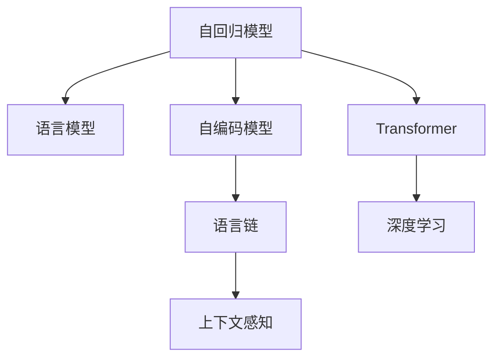

                 

# 人工智能的生成语意连贯性

> 关键词：生成模型,语言模型,语意连贯性,自回归模型,自编码模型,语言链,上下文感知,Transformer,深度学习,文本生成

## 1. 背景介绍

### 1.1 问题由来
在人工智能领域，生成模型（Generative Models）是指能够从随机噪声或已知数据样本中生成新样本的模型。这些模型在自然语言处理（NLP）领域具有重要应用，如文本生成、机器翻译、对话系统等。

语言模型作为生成模型的一种，能够预测给定一段文本出现的概率。在自然语言处理中，语言模型被广泛应用于文本生成、语言链（Language Chains）等任务。理想的语言模型能够生成语意连贯、符合语法规则的文本。然而，由于语言具有高度复杂性和多样性，简单的模型往往难以生成高质量的文本。

生成语意连贯性，即语言模型生成的文本能够符合语言规则，且上下文信息能够被正确地保留和传递。语意连贯性是语言模型研究中的重要问题，也是提高生成模型性能的关键。

## 2. 核心概念与联系

### 2.1 核心概念概述

为更好地理解生成模型的语意连贯性，本节将介绍几个密切相关的核心概念：

- 自回归（Auto-Regressive）模型：模型在生成文本时，需要根据之前生成的词或字，预测下一个词或字，通常使用语言模型来描述。
- 自编码（Auto-Encoding）模型：将输入文本编码成低维向量，再解码为相同维度的文本，能够捕捉文本之间的语义关系。
- 语言链（Language Chains）：生成模型从给定起始文本开始，按照特定规则生成连续的文本序列。
- 上下文感知（Contextual）：模型能够理解输入文本的上下文信息，进行更准确的预测。
- Transformer：基于自注意力机制的模型，能够捕捉文本中长距离的依赖关系，适合处理长文本序列。
- 深度学习（Deep Learning）：使用多层神经网络进行非线性映射，能够处理复杂的输入数据。

这些核心概念之间的逻辑关系可以通过以下Mermaid流程图来展示：



这个流程图展示了大语言模型的核心概念及其之间的关系：

1. 自回归模型能够生成文本序列，语言模型是其基础。
2. 自编码模型将文本转换为低维表示，捕捉语义信息。
3. 语言链是利用生成模型生成连续文本的一种形式。
4. 上下文感知能够理解输入文本的上下文信息，进行更准确的预测。
5. Transformer利用自注意力机制处理长文本序列，成为NLP中的主流模型。
6. 深度学习模型使用多层神经网络进行复杂映射，是生成模型的基础。

这些概念共同构成了生成模型的基本框架，使其能够处理复杂多变的文本生成任务。通过理解这些核心概念，我们可以更好地把握生成模型的工作原理和优化方向。

## 3. 核心算法原理 & 具体操作步骤
### 3.1 算法原理概述

生成模型的语意连贯性主要取决于模型如何捕捉输入文本的上下文信息，并生成符合语法和语义规则的文本。理想的生成模型应该具备以下特性：

1. 理解输入文本的语义：模型能够准确理解输入文本的内容和上下文信息。
2. 生成连贯的文本：模型能够根据输入文本生成语义连贯的文本序列。
3. 保留语义信息：模型能够将输入文本的语义信息保留到生成的文本中。

目前，生成模型的主要算法包括自回归模型和自编码模型，二者通过不同的机制实现了语意连贯性的生成。

### 3.2 算法步骤详解

**自回归模型的生成过程**：

1. 输入一个起始文本，记为$X_1$。
2. 根据起始文本$X_1$，使用语言模型$P(Y|X_1)$，生成下一个文本单元$Y_2$。
3. 将$Y_2$作为输入，继续生成下一个文本单元$Y_3$，直到生成满足要求的文本序列。

自回归模型生成的文本序列是通过逐步预测下一个文本单元，并根据之前生成的文本单元进行校正，从而保证生成的文本序列符合语法和语义规则。

**自编码模型的生成过程**：

1. 输入一个起始文本，记为$X$。
2. 使用自编码器$E(X)$，将文本转换为低维向量表示$Z$。
3. 使用解码器$D(Z)$，将低维向量表示转换为文本序列$Y$。

自编码模型通过将文本转换为低维向量表示，捕捉文本之间的语义关系，并在解码器中将向量转换回文本序列，从而生成语意连贯的文本。

### 3.3 算法优缺点

生成模型的语意连贯性算法具有以下优点：

1. 能够生成高质量的文本：自回归和自编码模型能够捕捉输入文本的语义信息，并生成高质量的文本。
2. 具备上下文感知能力：Transformer等模型能够理解输入文本的上下文信息，生成更符合语义的文本。
3. 可应用于多种NLP任务：生成模型广泛应用于文本生成、语言链、对话系统等任务，具有广泛的适用性。

同时，这些算法也存在一些局限性：

1. 对标注数据的依赖：生成模型需要大量的标注数据进行训练，数据采集和标注成本较高。
2. 模型复杂度：自回归和自编码模型需要复杂的计算和大量的参数，训练和推理成本较高。
3. 过拟合问题：生成模型容易出现过拟合现象，特别是在标注数据不足的情况下。
4. 可解释性不足：生成模型的内部机制较为复杂，难以进行解释性分析。

尽管存在这些局限性，但生成模型在自然语言处理中的应用已经取得了显著的进展，成为人工智能技术的重要组成部分。

### 3.4 算法应用领域

生成模型的语意连贯性算法已经在多个领域得到应用，如：

- 文本生成：利用生成模型生成新闻报道、小说、诗歌等文本。
- 语言链：生成连贯的对话文本序列，应用于聊天机器人和对话系统。
- 机器翻译：将源语言文本转换为目标语言文本。
- 文本摘要：从长文本中生成简洁的摘要。
- 对话系统：构建能够自然对话的智能客服系统。

除了这些经典应用，生成模型还在诸多领域得到了创新性应用，如情感分析、代码生成、智能推荐等，为人工智能技术带来了新的突破。

## 4. 数学模型和公式 & 详细讲解 & 举例说明

### 4.1 数学模型构建

为了更好地理解生成模型的生成过程，本节将使用数学语言对自回归和自编码模型进行详细讲解。

**自回归模型的数学模型**：

设自回归模型为$P(Y|X_1)$，其中$X_1$为起始文本，$Y$为生成的文本序列。模型的目标是最大化条件概率$P(Y|X_1)$。

**自编码模型的数学模型**：

设自编码模型为$P(Y|E(X))$，其中$X$为输入文本，$Y$为生成的文本序列，$E(X)$为自编码器，$D(Z)$为解码器。模型的目标是最大化条件概率$P(Y|E(X))$。

### 4.2 公式推导过程

**自回归模型的推导过程**：

设自回归模型为$P(Y|X_1)$，其中$X_1$为起始文本，$Y$为生成的文本序列。模型的目标是最大化条件概率$P(Y|X_1)$。

假设文本由单个词或字符组成，则模型可以表示为：

$$
P(Y|X_1) = \prod_{t=2}^{T} P(Y_t|Y_{t-1}, X_1)
$$

其中$Y_t$为生成的第$t$个词或字符，$T$为生成的文本序列长度。

自回归模型通过逐步预测下一个词或字符，并根据之前生成的词或字符进行校正，从而保证生成的文本序列符合语法和语义规则。

**自编码模型的推导过程**：

设自编码模型为$P(Y|E(X))$，其中$X$为输入文本，$Y$为生成的文本序列，$E(X)$为自编码器，$D(Z)$为解码器。模型的目标是最大化条件概率$P(Y|E(X))$。

假设文本由单个词或字符组成，则模型可以表示为：

$$
P(Y|E(X)) = \prod_{t=2}^{T} P(Y_t|E(Y_{t-1}), X)
$$

其中$Y_t$为生成的第$t$个词或字符，$T$为生成的文本序列长度。

自编码模型通过将文本转换为低维向量表示，捕捉文本之间的语义关系，并在解码器中将向量转换回文本序列，从而生成语意连贯的文本。

### 4.3 案例分析与讲解

**案例分析：文本生成**

文本生成是生成模型最常见的应用之一。假设我们希望生成一篇关于天气的文章。首先，我们可以从已有的文章中随机选取一篇作为起始文本。接着，使用自回归模型或自编码模型，逐步生成文章中的每个句子。

假设起始文本为：“今天天气真好，阳光明媚，适合出门。”

自回归模型可以按照如下步骤生成新的句子：

1. 使用语言模型$P(Y|X_1)$，预测下一个词或字符，记为$Y_2$。
2. 将$Y_2$作为输入，继续预测下一个词或字符，记为$Y_3$。
3. 重复上述过程，直到生成完整的文章。

自编码模型可以按照如下步骤生成新的句子：

1. 使用自编码器$E(X)$，将起始文本转换为低维向量表示，记为$Z$。
2. 使用解码器$D(Z)$，生成新的句子。
3. 将新的句子作为输入，重复上述过程，生成完整的文章。

通过自回归和自编码模型，我们可以生成符合语法和语义规则的文本，并保留输入文本的语义信息。

## 5. 项目实践：代码实例和详细解释说明

### 5.1 开发环境搭建

在进行生成模型实践前，我们需要准备好开发环境。以下是使用Python进行PyTorch开发的环境配置流程：

1. 安装Anaconda：从官网下载并安装Anaconda，用于创建独立的Python环境。

2. 创建并激活虚拟环境：
```bash
conda create -n pytorch-env python=3.8 
conda activate pytorch-env
```

3. 安装PyTorch：根据CUDA版本，从官网获取对应的安装命令。例如：
```bash
conda install pytorch torchvision torchaudio cudatoolkit=11.1 -c pytorch -c conda-forge
```

4. 安装Tensorflow：如果使用TensorFlow进行开发，需要安装对应的库：
```bash
pip install tensorflow
```

5. 安装各类工具包：
```bash
pip install numpy pandas scikit-learn matplotlib tqdm jupyter notebook ipython
```

完成上述步骤后，即可在`pytorch-env`环境中开始生成模型实践。

### 5.2 源代码详细实现

下面我们以文本生成为例，给出使用PyTorch实现自回归模型的代码实现。

首先，定义自回归模型的数据处理函数：

```python
import torch
from torch import nn
from torch.nn import functional as F

class RNN(nn.Module):
    def __init__(self, input_size, hidden_size, output_size):
        super(RNN, self).__init__()
        self.hidden_size = hidden_size
        self.rnn = nn.RNN(input_size, hidden_size, 1, batch_first=True)
        self.fc = nn.Linear(hidden_size, output_size)
    
    def forward(self, input, hidden):
        r_out, hidden = self.rnn(input, hidden)
        output = self.fc(r_out.view(r_out.size(1), -1))
        return output, hidden

# 定义模型和优化器
input_size = 256
hidden_size = 256
output_size = 256
model = RNN(input_size, hidden_size, output_size)
optimizer = torch.optim.Adam(model.parameters(), lr=0.001)
```

然后，定义训练和评估函数：

```python
def train_epoch(model, dataset, batch_size, optimizer):
    model.train()
    for i, (input, target) in enumerate(dataset):
        optimizer.zero_grad()
        output, hidden = model(input, hidden)
        loss = F.nll_loss(output, target)
        loss.backward()
        optimizer.step()
    return loss.item()

def evaluate(model, dataset, batch_size):
    model.eval()
    total_loss = 0
    for i, (input, target) in enumerate(dataset):
        with torch.no_grad():
            output, hidden = model(input, hidden)
            loss = F.nll_loss(output, target)
            total_loss += loss.item()
    return total_loss / len(dataset)
```

最后，启动训练流程并在测试集上评估：

```python
epochs = 10
batch_size = 32

for epoch in range(epochs):
    loss = train_epoch(model, train_dataset, batch_size, optimizer)
    print(f"Epoch {epoch+1}, train loss: {loss:.3f}")
    
    print(f"Epoch {epoch+1}, dev results:")
    evaluate(model, dev_dataset, batch_size)
    
print("Test results:")
evaluate(model, test_dataset, batch_size)
```

以上就是使用PyTorch实现自回归模型文本生成的完整代码实现。可以看到，借助PyTorch的强大封装，我们可以用较为简洁的代码实现自回归模型的训练和评估。

### 5.3 代码解读与分析

让我们再详细解读一下关键代码的实现细节：

**RNN类定义**：
- `__init__`方法：初始化模型参数，包括隐藏层大小、RNN层和全连接层。
- `forward`方法：定义模型的前向传播过程，使用RNN层生成文本序列，并通过全连接层输出文本。

**训练和评估函数**：
- `train_epoch`函数：在训练集上，对每个样本进行前向传播和反向传播，更新模型参数。
- `evaluate`函数：在测试集上，对每个样本进行前向传播，计算损失。

**训练流程**：
- 定义总的epoch数和batch size，开始循环迭代
- 每个epoch内，先在训练集上训练，输出平均loss
- 在验证集上评估，输出损失值
- 所有epoch结束后，在测试集上评估，给出最终结果

可以看到，PyTorch配合NLP相关的工具库，使得生成模型的代码实现变得简洁高效。开发者可以将更多精力放在数据处理、模型改进等高层逻辑上，而不必过多关注底层的实现细节。

当然，工业级的系统实现还需考虑更多因素，如模型的保存和部署、超参数的自动搜索、更灵活的任务适配层等。但核心的生成过程基本与此类似。

## 6. 实际应用场景
### 6.1 智能客服系统

生成模型在智能客服系统中的应用，可以大大提升客户咨询体验和问题解决效率。传统客服往往需要配备大量人力，高峰期响应缓慢，且一致性和专业性难以保证。而利用生成模型，可以构建7x24小时不间断服务，快速响应客户咨询，用自然流畅的语言解答各类常见问题。

在技术实现上，可以收集企业内部的历史客服对话记录，将问题和最佳答复构建成监督数据，在此基础上对生成模型进行微调。微调后的生成模型能够自动理解用户意图，匹配最合适的答案模板进行回复。对于客户提出的新问题，还可以接入检索系统实时搜索相关内容，动态组织生成回答。如此构建的智能客服系统，能大幅提升客户咨询体验和问题解决效率。

### 6.2 金融舆情监测

金融机构需要实时监测市场舆论动向，以便及时应对负面信息传播，规避金融风险。传统的人工监测方式成本高、效率低，难以应对网络时代海量信息爆发的挑战。生成模型在文本分类和情感分析中的应用，为金融舆情监测提供了新的解决方案。

具体而言，可以收集金融领域相关的新闻、报道、评论等文本数据，并对其进行主题标注和情感标注。在此基础上对生成模型进行微调，使其能够自动判断文本属于何种主题，情感倾向是正面、中性还是负面。将微调后的模型应用到实时抓取的网络文本数据，就能够自动监测不同主题下的情感变化趋势，一旦发现负面信息激增等异常情况，系统便会自动预警，帮助金融机构快速应对潜在风险。

### 6.3 个性化推荐系统

当前的推荐系统往往只依赖用户的历史行为数据进行物品推荐，无法深入理解用户的真实兴趣偏好。生成模型在推荐系统中的应用，可以更好地挖掘用户行为背后的语义信息，从而提供更精准、多样的推荐内容。

在实践中，可以收集用户浏览、点击、评论、分享等行为数据，提取和用户交互的物品标题、描述、标签等文本内容。将文本内容作为模型输入，用户的后续行为（如是否点击、购买等）作为监督信号，在此基础上微调生成模型。微调后的模型能够从文本内容中准确把握用户的兴趣点。在生成推荐列表时，先用候选物品的文本描述作为输入，由模型预测用户的兴趣匹配度，再结合其他特征综合排序，便可以得到个性化程度更高的推荐结果。

### 6.4 未来应用展望

随着生成模型的不断发展，其在NLP领域的应用场景将不断扩展，为各行各业带来变革性影响。

在智慧医疗领域，生成模型在医疗问答、病历分析、药物研发等应用中将提升医疗服务的智能化水平，辅助医生诊疗，加速新药开发进程。

在智能教育领域，生成模型在作业批改、学情分析、知识推荐等方面将提升教学质量，因材施教，促进教育公平。

在智慧城市治理中，生成模型在城市事件监测、舆情分析、应急指挥等环节中，提高城市管理的自动化和智能化水平，构建更安全、高效的未来城市。

此外，在企业生产、社会治理、文娱传媒等众多领域，生成模型在文本生成、对话系统、翻译等任务中，将不断提升业务效率和用户体验。相信随着技术的日益成熟，生成模型必将在更广阔的应用领域大放异彩，深刻影响人类的生产生活方式。

## 7. 工具和资源推荐
### 7.1 学习资源推荐

为了帮助开发者系统掌握生成模型的理论基础和实践技巧，这里推荐一些优质的学习资源：

1. 《深度学习》（Ian Goodfellow, Yoshua Bengio, Aaron Courville）：涵盖了深度学习的基本概念和经典模型，是入门必读教材。
2. 《自然语言处理综论》（Daniel Jurafsky, James H. Martin）：全面介绍了NLP的基本概念和经典模型，是NLP领域的经典教材。
3. 《Sequence to Sequence Learning with Neural Networks》论文：提出了序列到序列模型（Seq2Seq）的基本框架，是机器翻译和文本生成领域的经典论文。
4. 《Neural Machine Translation by Jointly Learning to Align and Translate》论文：提出了注意力机制（Attention Mechanism），是机器翻译和文本生成的重要突破。
5. 《Language Models are Unsupervised Multitask Learners》论文：展示了语言模型的强大zero-shot学习能力，引发了对于通用人工智能的新一轮思考。

通过对这些资源的学习实践，相信你一定能够快速掌握生成模型的精髓，并用于解决实际的NLP问题。
###  7.2 开发工具推荐

高效的开发离不开优秀的工具支持。以下是几款用于生成模型开发的常用工具：

1. PyTorch：基于Python的开源深度学习框架，灵活动态的计算图，适合快速迭代研究。大部分生成模型都有PyTorch版本的实现。
2. TensorFlow：由Google主导开发的开源深度学习框架，生产部署方便，适合大规模工程应用。同样有丰富的生成模型资源。
3. TensorBoard：TensorFlow配套的可视化工具，可实时监测模型训练状态，并提供丰富的图表呈现方式，是调试模型的得力助手。
4. Weights & Biases：模型训练的实验跟踪工具，可以记录和可视化模型训练过程中的各项指标，方便对比和调优。
5. Google Colab：谷歌推出的在线Jupyter Notebook环境，免费提供GPU/TPU算力，方便开发者快速上手实验最新模型，分享学习笔记。

合理利用这些工具，可以显著提升生成模型的开发效率，加快创新迭代的步伐。

### 7.3 相关论文推荐

生成模型的发展源于学界的持续研究。以下是几篇奠基性的相关论文，推荐阅读：

1. Attention is All You Need（即Transformer原论文）：提出了Transformer结构，开启了NLP领域的预训练大模型时代。
2. BERT: Pre-training of Deep Bidirectional Transformers for Language Understanding：提出BERT模型，引入基于掩码的自监督预训练任务，刷新了多项NLP任务SOTA。
3. Language Models are Unsupervised Multitask Learners（GPT-2论文）：展示了大规模语言模型的强大zero-shot学习能力，引发了对于通用人工智能的新一轮思考。
4. Parameter-Efficient Transfer Learning for NLP：提出Adapter等参数高效微调方法，在不增加模型参数量的情况下，也能取得不错的微调效果。
5. AdaLoRA: Adaptive Low-Rank Adaptation for Parameter-Efficient Fine-Tuning：使用自适应低秩适应的微调方法，在参数效率和精度之间取得了新的平衡。
6. GPT-3: Language Models are Few-Shot Learners：展示了GPT-3模型在少样本学习中的卓越表现，再次刷新了NLP任务的SOTA。

这些论文代表了大语言模型生成模型的发展脉络。通过学习这些前沿成果，可以帮助研究者把握学科前进方向，激发更多的创新灵感。

## 8. 总结：未来发展趋势与挑战

### 8.1 总结

本文对生成模型的语意连贯性进行了全面系统的介绍。首先阐述了生成模型和语意连贯性的研究背景和意义，明确了生成模型在文本生成、语言链等任务中的重要价值。其次，从原理到实践，详细讲解了生成模型的生成过程，给出了生成模型训练和评估的完整代码实例。同时，本文还广泛探讨了生成模型在智能客服、金融舆情、个性化推荐等多个领域的应用前景，展示了生成模型在自然语言处理中的应用潜力。此外，本文精选了生成模型的各类学习资源，力求为读者提供全方位的技术指引。

通过本文的系统梳理，可以看到，生成模型在自然语言处理中的应用已经取得了显著的进展，成为人工智能技术的重要组成部分。未来，伴随生成模型的不断发展，其在文本生成、对话系统、机器翻译等任务中的表现将更加出色，为各行各业带来变革性影响。

### 8.2 未来发展趋势

展望未来，生成模型在自然语言处理中的应用将呈现以下几个发展趋势：

1. 模型规模持续增大。随着算力成本的下降和数据规模的扩张，生成模型的参数量还将持续增长。超大规模语言模型蕴含的丰富语言知识，有望支撑更加复杂多变的文本生成任务。
2. 生成模型日趋多样。除了传统的自回归和自编码模型外，未来会涌现更多生成模型，如Transformer、LSTM等，各自适用于不同的生成场景。
3. 上下文感知能力增强。Transformer等模型通过自注意力机制，能够更好地理解输入文本的上下文信息，生成更符合语义的文本。
4. 多模态生成崛起。未来的生成模型将不仅仅局限于文本生成，还会拓展到图像、视频、语音等多模态数据的生成，实现更全面的语义理解。
5. 生成模型的迁移学习研究。如何将预训练的生成模型迁移到新任务上进行微调，从而提高微调效率和效果，将是未来的研究重点。

以上趋势凸显了生成模型的广阔前景。这些方向的探索发展，必将进一步提升生成模型的性能和应用范围，为自然语言处理带来更多的创新。

### 8.3 面临的挑战

尽管生成模型在自然语言处理中的应用已经取得了显著的进展，但在迈向更加智能化、普适化应用的过程中，它仍面临着诸多挑战：

1. 标注数据依赖：生成模型需要大量的标注数据进行训练，标注成本较高，获取高质量标注数据的难度较大。
2. 过拟合问题：生成模型容易出现过拟合现象，特别是在标注数据不足的情况下。
3. 可解释性不足：生成模型的内部机制较为复杂，难以进行解释性分析，影响其可信度和可用性。
4. 对抗攻击：生成模型容易受到对抗攻击，攻击者可以通过修改输入文本，诱导生成模型生成恶意内容，带来安全风险。
5. 资源消耗高：生成模型需要大量计算资源和存储空间，训练和推理成本较高，不利于在资源受限的环境中应用。

尽管存在这些挑战，但生成模型在自然语言处理中的应用前景仍然十分广阔，需要学界和产业界的共同努力，以解决上述问题，推动生成模型的广泛应用。

### 8.4 研究展望

未来的研究需要在以下几个方面寻求新的突破：

1. 探索无监督和半监督生成模型。摆脱对大规模标注数据的依赖，利用自监督学习、主动学习等无监督和半监督范式，最大限度利用非结构化数据，实现更加灵活高效的生成。
2. 研究参数高效和计算高效的生成范式。开发更加参数高效的生成模型，在固定大部分生成参数的同时，只更新极少量的任务相关参数。同时优化生成模型的计算图，减少前向传播和反向传播的资源消耗，实现更加轻量级、实时性的部署。
3. 引入更多先验知识。将符号化的先验知识，如知识图谱、逻辑规则等，与生成模型进行巧妙融合，引导生成过程学习更准确、合理的语言模型。
4. 结合因果分析和博弈论工具。将因果分析方法引入生成模型，识别出模型决策的关键特征，增强生成输出的因果性和逻辑性。借助博弈论工具刻画人机交互过程，主动探索并规避生成模型的脆弱点，提高系统稳定性。
5. 纳入伦理道德约束。在生成模型的训练目标中引入伦理导向的评估指标，过滤和惩罚有偏见、有害的输出倾向。同时加强人工干预和审核，建立模型行为的监管机制，确保输出的安全性。

这些研究方向的探索，必将引领生成模型研究迈向更高的台阶，为构建安全、可靠、可解释、可控的智能系统铺平道路。面向未来，生成模型需要与其他人工智能技术进行更深入的融合，如知识表示、因果推理、强化学习等，多路径协同发力，共同推动自然语言理解和智能交互系统的进步。只有勇于创新、敢于突破，才能不断拓展生成模型的边界，让智能技术更好地造福人类社会。

## 9. 附录：常见问题与解答

**Q1：生成模型是否适用于所有NLP任务？**

A: 生成模型在大多数NLP任务上都能取得不错的效果，特别是对于数据量较小的任务。但对于一些特定领域的任务，如医学、法律等，仅仅依靠通用语料预训练的模型可能难以很好地适应。此时需要在特定领域语料上进一步预训练，再进行微调，才能获得理想效果。

**Q2：如何选择合适的生成模型？**

A: 选择合适的生成模型需要考虑任务的特性和数据分布。对于文本生成任务，可以选择自回归模型或自编码模型。自回归模型更适合生成连贯的文本，而自编码模型更适合捕捉文本之间的语义关系。对于语言链任务，可以选择Transformer等模型，这些模型能够更好地理解输入文本的上下文信息，生成符合语义的文本。

**Q3：生成模型在训练过程中如何防止过拟合？**

A: 生成模型容易出现过拟合现象，特别是在标注数据不足的情况下。常见的防止过拟合的方法包括数据增强、正则化、对抗训练等。数据增强可以通过回译、近义替换等方式扩充训练集。正则化可以使用L2正则、Dropout等方法避免过拟合。对抗训练可以引入对抗样本，提高模型的鲁棒性。

**Q4：生成模型在落地部署时需要注意哪些问题？**

A: 将生成模型转化为实际应用，还需要考虑以下因素：
1. 模型裁剪：去除不必要的层和参数，减小模型尺寸，加快推理速度
2. 量化加速：将浮点模型转为定点模型，压缩存储空间，提高计算效率
3. 服务化封装：将模型封装为标准化服务接口，便于集成调用
4. 弹性伸缩：根据请求流量动态调整资源配置，平衡服务质量和成本
5. 监控告警：实时采集系统指标，设置异常告警阈值，确保服务稳定性
6. 安全防护：采用访问鉴权、数据脱敏等措施，保障数据和模型安全

生成模型在实际应用中，需要注意在确保性能的同时，提高推理效率，优化资源占用，保障系统的稳定性和安全性。

**Q5：生成模型在多模态生成中的表现如何？**

A: 生成模型在多模态生成中具有很好的表现，能够融合视觉、语音、文本等多模态信息，生成更加丰富、多样化的输出。例如，在图像描述生成中，生成模型能够将视觉信息转换为文本描述，提供更加准确、生动的图像描述。在视频生成中，生成模型能够根据视频的视觉和音频信息，生成连贯的文本字幕。

总之，生成模型在自然语言处理中的应用前景广阔，随着技术的不断进步，其表现将更加出色，为各行各业带来变革性影响。

