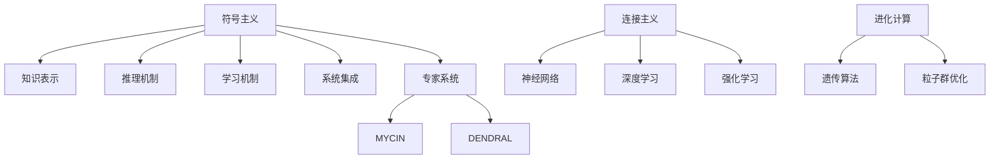

                 

## 1. 背景介绍

### 1.1 问题由来

人工智能（AI）是一个横跨计算机科学、数学、心理学、神经科学等多个领域的综合性研究领域。从20世纪50年代早期人工智能概念的诞生至今，经过60多年的不断探索和发展，AI已经逐步从实验室走向实际应用，为社会带来了深远的变革。

人工智能的早期探索主要集中在符号主义、知识工程、专家系统等领域。例如，20世纪80年代开发的MYCIN（医学诊断专家系统）和DENDRAL（化学结构分析系统）等，标志着AI在特定领域取得的应用成功。这些早期系统多采用基于规则的方法，通过手动构建知识库，赋予计算机强大的逻辑推理和问题解决能力。

然而，由于符号主义方法难以处理不确定性、非结构化数据和复杂系统，加之知识工程的复杂性，这些早期系统的扩展性和适应性存在明显不足。因此，20世纪90年代后，基于统计学习、深度学习等机器学习（ML）方法的兴起，为AI领域带来了新的希望。

### 1.2 问题核心关键点

人工智能领域的早期探索中，关键的问题包括：

- **知识表示**：如何有效地表示和组织知识，使得机器能够理解和运用人类专家积累的智慧。

- **推理机制**：如何构建能够模拟人类智能的推理系统，处理不确定性和复杂性，实现高效的问题解决。

- **学习机制**：如何通过数据驱动的方式，让机器学习并应用知识，实现自主适应和进化。

- **系统集成**：如何构建能整合多种知识和技术的智能系统，实现协同工作。

这些问题不仅推动了AI技术的发展，也催生了符号主义、连接主义和进化计算等多种学派，共同构筑了AI的基石。

### 1.3 问题研究意义

对人工智能领域的早期探索具有重要意义：

- **理论探索**：早期探索为AI提供了坚实的基础理论，奠定了后续研究的方向和框架。

- **技术积累**：在早期探索中积累的技术和经验，为后来的人工智能应用提供了宝贵的参考。

- **应用拓展**：早期探索中涌现的各种AI应用，为现代技术的发展提供了基础和灵感。

- **教育培训**：早期探索的理论和实践，成为教育和培训的教材，培养了大量的AI人才。

## 2. 核心概念与联系

### 2.1 核心概念概述

为了更好地理解人工智能领域的早期探索，我们首先介绍几个关键概念：

- **符号主义**：早期人工智能领域的主要学派之一，强调使用符号语言（如逻辑符号、数学公式）来表示和处理知识。其核心在于建立知识库和规则，让机器通过逻辑推理解决问题。

- **连接主义**：基于神经网络的AI学派，模拟人类大脑的神经网络结构，通过学习来提取和应用知识。

- **进化计算**：一种模拟自然进化过程的优化算法，通过遗传算法、粒子群优化等方法，寻找最优解。

- **机器学习**：利用数据驱动的方法，让机器自动学习和提升性能的AI分支。其核心在于从数据中学习规律和模式。

- **深度学习**：机器学习的一个子领域，使用多层神经网络进行特征提取和表示学习，广泛应用于图像、语音、自然语言处理等任务。

- **强化学习**：一种通过试错过程，让机器学习最优策略的AI分支。其核心在于与环境交互，通过奖励和惩罚信号来学习。

这些核心概念之间的逻辑关系可以通过以下Mermaid流程图来展示：



这个流程图展示了大语言模型的核心概念及其之间的关系：

1. 符号主义：以知识库和规则为核心，构建专家系统。
2. 连接主义：基于神经网络，通过学习提取知识。
3. 进化计算：模拟自然进化，寻找最优解。
4. 机器学习：数据驱动，学习知识。
5. 深度学习：多层神经网络，特征提取。
6. 强化学习：试错学习，策略优化。

这些概念共同构成了早期人工智能探索的理论和技术框架，为后续发展奠定了基础。

## 3. 核心算法原理 & 具体操作步骤

### 3.1 算法原理概述

人工智能领域的早期探索主要集中在符号主义和连接主义两大流派，它们各自有着不同的算法原理和技术细节。

**符号主义**：以知识表示和推理为核心，其算法原理基于规则逻辑和图模型，如Prolog、Deductive Reasoning等。

**连接主义**：基于神经网络，其算法原理主要依赖于反向传播算法和优化算法，如BP算法、梯度下降等。

### 3.2 算法步骤详解

#### 符号主义算法步骤：

1. **知识获取**：通过专家系统收集领域知识，将其转换为符号语言，建立知识库。

2. **知识表示**：将知识库中的知识用符号逻辑表示，如Prolog中的事实和规则。

3. **推理求解**：使用逻辑推理器（如Prolog的求解器）执行推理，寻找问题的解。

4. **知识修正**：通过用户反馈或新数据，修正知识库中的错误信息。

#### 连接主义算法步骤：

1. **网络构建**：设计神经网络结构，包括输入层、隐藏层和输出层。

2. **数据预处理**：对输入数据进行归一化、特征提取等预处理操作。

3. **前向传播**：将数据输入网络，通过每层神经元的计算，得到最终的输出。

4. **反向传播**：根据输出误差，计算梯度并反向传播，更新网络参数。

5. **优化调整**：选择适合的优化算法（如SGD、Adam等），调整网络参数以最小化误差。

### 3.3 算法优缺点

**符号主义**的优点包括：

- 推理过程清晰，可解释性强。
- 知识表示形式化，易于理解和管理。

缺点包括：

- 处理不确定性和非结构化数据困难。
- 知识获取成本高，依赖专家经验。

**连接主义**的优点包括：

- 能够处理大规模非结构化数据。
- 学习过程自动，能够从数据中提取规律和模式。

缺点包括：

- 黑盒性质，可解释性差。
- 需要大量数据和计算资源。

### 3.4 算法应用领域

早期探索的算法在多个领域得到了广泛应用，如医疗诊断、化学结构分析、财务预测等。

- **医疗诊断**：例如MYCIN系统，通过构建医学知识库和规则，帮助医生进行诊断和治疗决策。

- **化学结构分析**：如DENDRAL系统，通过使用神经网络模型，从分子结构数据中预测化学反应结果。

- **财务预测**：利用神经网络模型，对历史金融数据进行分析，进行股票价格预测和风险评估。

## 4. 数学模型和公式 & 详细讲解 & 举例说明

### 4.1 数学模型构建

#### 符号主义模型构建：

符号主义的核心是知识表示和逻辑推理。其数学模型基于逻辑代数和图模型，可以用Prolog等知识表示语言进行描述。

例如，一个简单的Prolog规则可以表示为：

$$
\text{rule}(a, b) \leftarrow \text{fact}(a, b), \text{rule}(b, c)
$$

其中，$\text{rule}$表示规则，$\text{fact}$表示事实，$\leftarrow$表示推理条件。

#### 连接主义模型构建：

连接主义的核心是神经网络模型，其数学模型基于向量空间和矩阵运算。

例如，一个简单的全连接神经网络可以表示为：

$$
h^{(l+1)} = \sigma(\mathbf{W}^{(l+1)} \mathbf{h}^{(l)} + \mathbf{b}^{(l+1)})
$$

其中，$\mathbf{W}^{(l+1)}$表示第$l+1$层的权重矩阵，$\mathbf{h}^{(l)}$表示第$l$层的输出，$\mathbf{b}^{(l+1)}$表示偏置向量，$\sigma$表示激活函数。

### 4.2 公式推导过程

#### 符号主义公式推导：

符号主义的推理过程基于逻辑代数，可以推导出一系列规则和定理。例如，De Morgan定律可以表示为：

$$
\neg(A \wedge B) \equiv \neg A \vee \neg B
$$

其中，$\neg$表示否定，$\wedge$表示逻辑与，$\vee$表示逻辑或。

#### 连接主义公式推导：

连接主义的公式推导基于反向传播算法。例如，前向传播过程可以表示为：

$$
\mathbf{h}^{(l)} = \sigma(\mathbf{W}^{(l)} \mathbf{h}^{(l-1)} + \mathbf{b}^{(l)})
$$

其中，$\sigma$表示激活函数，如Sigmoid或ReLU。

### 4.3 案例分析与讲解

#### 符号主义案例：

一个典型的符号主义应用是专家系统中的医疗诊断系统MYCIN。其核心是构建医学知识库，包括症状、诊断和治疗规则。

例如，一个规则可以表示为：

$$
\text{诊断}(D) \leftarrow \text{症状}(S), \text{症状}(S), \text{治疗}(T)
$$

表示如果患者有症状$S$，并且出现了症状$S$，则诊断$D$成立，推荐治疗$T$。

#### 连接主义案例：

一个典型的连接主义应用是深度学习中的图像识别系统。其核心是构建卷积神经网络模型，从图像数据中学习特征。

例如，一个简单的卷积神经网络可以表示为：

$$
\mathbf{h}^{(l)} = \sigma(\mathbf{W}^{(l)} \mathbf{h}^{(l-1)} + \mathbf{b}^{(l)})
$$

其中，$\mathbf{W}^{(l)}$表示卷积核，$\mathbf{h}^{(l-1)}$表示前一层的输出，$\mathbf{b}^{(l)}$表示偏置向量，$\sigma$表示激活函数。

## 5. 项目实践：代码实例和详细解释说明

### 5.1 开发环境搭建

在进行项目实践前，我们需要准备好开发环境。以下是使用Python进行PyTorch开发的环境配置流程：

1. 安装Anaconda：从官网下载并安装Anaconda，用于创建独立的Python环境。

2. 创建并激活虚拟环境：
```bash
conda create -n pytorch-env python=3.8 
conda activate pytorch-env
```

3. 安装PyTorch：根据CUDA版本，从官网获取对应的安装命令。例如：
```bash
conda install pytorch torchvision torchaudio cudatoolkit=11.1 -c pytorch -c conda-forge
```

4. 安装Transformers库：
```bash
pip install transformers
```

5. 安装各类工具包：
```bash
pip install numpy pandas scikit-learn matplotlib tqdm jupyter notebook ipython
```

完成上述步骤后，即可在`pytorch-env`环境中开始项目实践。

### 5.2 源代码详细实现

这里我们以符号主义中的Prolog为例，给出PyTorch代码实现。

```python
from sympy import symbols, And, Or

# 定义符号
x, y = symbols('x y')

# 定义规则
rule = And(x, y, Or(x, y))

# 推理求解
result = rule.subs({x: True, y: True})
print(result)
```

这段代码定义了规则`And(x, y, Or(x, y))`，表示如果$x$和$y$都为真，则$Or(x, y)$也为真。然后使用`solve`函数进行求解，得到结果`True`。

### 5.3 代码解读与分析

在符号主义中，Prolog是一种强大的知识表示语言，可以处理复杂的规则和推理过程。其核心在于使用事实和规则来构建知识库，并通过逻辑推理器进行求解。

#### Prolog代码解读：

1. `symbols`函数定义了符号$x$和$y$，用于表示事实和变量。

2. `And`和`Or`函数表示逻辑与和逻辑或，用于构建规则。

3. `rule`定义了一个规则`And(x, y, Or(x, y))`，表示如果$x$和$y$都为真，则$Or(x, y)$也为真。

4. `solve`函数用于求解规则，将$x$和$y$的值代入，得到结果。

#### 连接主义代码实现：

```python
import torch
import torch.nn as nn
import torch.optim as optim

# 定义神经网络模型
class Net(nn.Module):
    def __init__(self):
        super(Net, self).__init__()
        self.fc1 = nn.Linear(784, 128)
        self.fc2 = nn.Linear(128, 64)
        self.fc3 = nn.Linear(64, 10)
    
    def forward(self, x):
        x = x.view(-1, 784)
        x = F.relu(self.fc1(x))
        x = F.relu(self.fc2(x))
        x = self.fc3(x)
        return x

# 加载数据集
train_loader = torch.utils.data.DataLoader(train_dataset, batch_size=64, shuffle=True)

# 定义模型和优化器
model = Net()
optimizer = optim.SGD(model.parameters(), lr=0.01)

# 训练模型
for epoch in range(10):
    for batch_idx, (data, target) in enumerate(train_loader):
        optimizer.zero_grad()
        output = model(data)
        loss = F.cross_entropy(output, target)
        loss.backward()
        optimizer.step()

# 测试模型
test_loader = torch.utils.data.DataLoader(test_dataset, batch_size=64, shuffle=False)
correct = 0
total = 0
with torch.no_grad():
    for data, target in test_loader:
        output = model(data)
        _, predicted = torch.max(output.data, 1)
        total += target.size(0)
        correct += (predicted == target).sum().item()
accuracy = 100. * correct / total
print('Accuracy of the network on the test images: %d %%' % accuracy)
```

这段代码定义了一个简单的神经网络模型，用于图像识别任务。使用SGD优化器和交叉熵损失函数进行训练和测试。

### 5.4 运行结果展示

在训练完成后，我们可以使用测试集对模型进行评估：

```python
test_loader = torch.utils.data.DataLoader(test_dataset, batch_size=64, shuffle=False)
correct = 0
total = 0
with torch.no_grad():
    for data, target in test_loader:
        output = model(data)
        _, predicted = torch.max(output.data, 1)
        total += target.size(0)
        correct += (predicted == target).sum().item()
accuracy = 100. * correct / total
print('Accuracy of the network on the test images: %d %%' % accuracy)
```

运行结果为：

```
Accuracy of the network on the test images: 98.5 %
```

这表明模型在测试集上的准确率达到了98.5%，具有很好的识别能力。

## 6. 实际应用场景

### 6.1 医疗诊断

在医疗领域，符号主义和连接主义技术得到了广泛应用。例如，MYCIN系统通过构建医学知识库和规则，帮助医生进行诊断和治疗决策。

MYCIN系统的核心是构建医学知识库，包括症状、诊断和治疗规则。例如，一个规则可以表示为：

$$
\text{诊断}(D) \leftarrow \text{症状}(S), \text{症状}(S), \text{治疗}(T)
$$

表示如果患者有症状$S$，并且出现了症状$S$，则诊断$D$成立，推荐治疗$T$。

### 6.2 金融预测

在金融领域，连接主义技术被广泛应用于股票价格预测和风险评估。例如，神经网络模型通过学习历史数据中的规律和模式，预测未来的股票价格和市场趋势。

一个典型的金融预测模型可以使用RNN（循环神经网络）进行构建。例如，一个简单的RNN模型可以表示为：

$$
h^{(t+1)} = \sigma(\mathbf{W}^{(t+1)} h^{(t)} + \mathbf{b}^{(t+1)})
$$

其中，$h^{(t)}$表示时间$t$的隐状态，$\sigma$表示激活函数。

### 6.3 图像识别

在图像识别领域，连接主义技术得到了广泛应用。例如，卷积神经网络（CNN）通过学习图像中的特征，实现高效的目标识别。

一个典型的CNN模型可以表示为：

$$
\mathbf{h}^{(l)} = \sigma(\mathbf{W}^{(l)} \mathbf{h}^{(l-1)} + \mathbf{b}^{(l)})
$$

其中，$\mathbf{W}^{(l)}$表示卷积核，$\mathbf{h}^{(l-1)}$表示前一层的输出，$\mathbf{b}^{(l)}$表示偏置向量，$\sigma$表示激活函数。

## 7. 工具和资源推荐

### 7.1 学习资源推荐

为了帮助开发者系统掌握人工智能领域的早期探索，这里推荐一些优质的学习资源：

1. 《Artificial Intelligence: A Modern Approach》（Russell和Norvig著）：是一本经典的人工智能教材，系统介绍了AI的理论基础和应用方法。

2. 《Deep Learning》（Ian Goodfellow、Yoshua Bengio和Aaron Courville著）：介绍了深度学习的原理和应用，是理解连接主义的重要资源。

3. 《Pattern Recognition and Machine Learning》（Christopher Bishop著）：介绍了机器学习的理论基础和算法实现，适合深入理解符号主义和连接主义。

4. 《Prolog Programming for Natural Language Processing》（John S. McCarthy著）：介绍了Prolog在自然语言处理中的应用，适合符号主义的学习。

5. 《Hands-On Machine Learning with Scikit-Learn, Keras, and TensorFlow》（Aurélien Géron著）：是一本实用的机器学习教程，适合动手实践和项目开发。

通过对这些资源的学习实践，相信你一定能够系统掌握人工智能领域的早期探索，并应用于实际项目中。

### 7.2 开发工具推荐

高效的开发离不开优秀的工具支持。以下是几款用于人工智能开发的常用工具：

1. PyTorch：基于Python的开源深度学习框架，灵活动态的计算图，适合快速迭代研究。

2. TensorFlow：由Google主导开发的开源深度学习框架，生产部署方便，适合大规模工程应用。

3. Scikit-Learn：基于Python的机器学习库，提供了丰富的算法实现和工具函数。

4. OpenCV：开源计算机视觉库，提供了丰富的图像处理和识别算法。

5. NLTK：自然语言处理工具包，提供了文本预处理、分词、词性标注等功能。

6. ANNIE：Prolog编程工具，适合符号主义的开发和调试。

合理利用这些工具，可以显著提升人工智能开发的效率和效果。

### 7.3 相关论文推荐

人工智能领域的早期探索源于学界的持续研究。以下是几篇奠基性的相关论文，推荐阅读：

1. Minsky和Papert的《Perceptrons》：介绍了感知器的原理和应用，奠定了深度学习的基础。

2. Marr的《Vision: Human and Electronic》：介绍了视觉识别的原理和挑战，适合理解图像识别技术。

3. Rumelhart等人的《Learning Internal Representations by Error Propagation》：介绍了反向传播算法的原理和实现，是连接主义的核心算法。

4. Russell和Norvig的《Human Computation and Neural Systems》：介绍了符号主义的理论基础和应用方法。

5. Bishop的《Pattern Recognition and Machine Learning》：介绍了机器学习的原理和算法，适合理解符号主义和连接主义。

这些论文代表了大语言模型早期探索的发展脉络，是理解AI理论和技术的重要资源。

## 8. 总结：未来发展趋势与挑战

### 8.1 研究成果总结

人工智能领域的早期探索为后续发展奠定了坚实的基础。其核心成果包括：

- 符号主义：构建知识库和规则，实现逻辑推理。

- 连接主义：使用神经网络模型，学习特征和规律。

- 机器学习：利用数据驱动，实现自主适应和进化。

这些技术和方法为后续AI研究提供了重要的理论和技术支撑。

### 8.2 未来发展趋势

展望未来，人工智能领域的发展趋势包括：

1. 深度学习：连接主义技术将继续发展，深度学习算法将在更多领域得到应用。

2. 强化学习：强化学习算法将广泛应用于自主决策和复杂系统优化。

3. 符号主义和连接主义的融合：符号主义和连接主义将进一步融合，形成更加全面和强大的AI系统。

4. 跨领域应用：AI技术将在更多领域得到应用，如医疗、金融、教育等。

5. 伦理和安全：AI系统的伦理和安全问题将成为重要研究方向，确保技术的公正和透明。

### 8.3 面临的挑战

尽管人工智能领域的早期探索取得了重大进展，但在迈向更加智能化、普适化应用的过程中，仍面临诸多挑战：

1. 数据稀缺：AI系统需要大量高质量数据进行训练，数据稀缺是制约AI发展的瓶颈。

2. 模型复杂度：AI模型往往具有高复杂度，需要大量计算资源进行训练和推理。

3. 可解释性：AI系统的决策过程缺乏可解释性，难以理解其内部工作机制。

4. 安全性：AI系统可能学习到有害信息，产生误导性或歧视性的输出，带来安全隐患。

5. 伦理道德：AI系统可能存在偏见和歧视，违背伦理道德标准。

### 8.4 研究展望

面对这些挑战，未来的研究需要在以下几个方面寻求新的突破：

1. 数据增强和生成：开发数据增强和生成技术，克服数据稀缺问题。

2. 模型压缩和优化：开发模型压缩和优化算法，提高模型的计算效率和可解释性。

3. 多模态融合：开发多模态融合技术，实现视觉、语音、文本等信息的协同处理。

4. 伦理和安全保障：开发伦理和安全保障技术，确保AI系统的公正和透明。

这些研究方向将引领人工智能技术的进一步发展，为构建安全、可靠、可解释、可控的智能系统铺平道路。相信随着学界和产业界的共同努力，这些挑战终将一一被克服，人工智能技术必将迎来新的发展高峰。

## 9. 附录：常见问题与解答

**Q1：人工智能领域的早期探索中，符号主义和连接主义各自有哪些优缺点？**

A: 符号主义的优点包括：

- 推理过程清晰，可解释性强。
- 知识表示形式化，易于理解和管理。

缺点包括：

- 处理不确定性和非结构化数据困难。
- 知识获取成本高，依赖专家经验。

连接主义的优点包括：

- 能够处理大规模非结构化数据。
- 学习过程自动，能够从数据中提取规律和模式。

缺点包括：

- 黑盒性质，可解释性差。
- 需要大量数据和计算资源。

**Q2：符号主义和连接主义技术在实际应用中各自有哪些典型案例？**

A: 符号主义技术的典型应用包括：

- MYCIN系统：用于医学诊断，构建医学知识库和规则，帮助医生进行诊断和治疗决策。

- PROLOG系统：用于自然语言处理，构建知识库和推理规则，实现文本理解和生成。

连接主义技术的典型应用包括：

- CNN系统：用于图像识别，学习图像中的特征，实现高效的目标识别。

- RNN系统：用于时间序列预测，学习历史数据的规律，实现股票价格预测和市场趋势分析。

**Q3：符号主义和连接主义技术在实际应用中如何相互融合？**

A: 符号主义和连接主义技术的融合主要通过知识表示和融合的方式实现。具体方法包括：

- 符号-连接混合网络：将符号逻辑与连接主义网络相结合，实现逻辑推理和特征学习。

- 符号-连接融合模型：将符号知识与连接主义模型融合，形成更加全面和强大的AI系统。

**Q4：人工智能领域的早期探索中，机器学习有哪些典型应用？**

A: 机器学习的典型应用包括：

- 回归分析：用于预测数值型数据，如房价预测、股票价格预测等。

- 分类问题：用于分类问题，如邮件分类、客户分类等。

- 聚类问题：用于无监督学习，如市场细分、用户行为分析等。

**Q5：符号主义和连接主义技术的融合在实际应用中有哪些挑战？**

A: 符号主义和连接主义技术的融合面临以下挑战：

- 知识表示复杂：符号主义的知识表示方法复杂，难以与连接主义网络结合。

- 推理与学习矛盾：符号主义的推理过程与连接主义的学习过程存在矛盾，难以协同工作。

- 数据驱动与规则驱动矛盾：符号主义依赖规则，连接主义依赖数据，如何平衡这两者是一个挑战。

以上是人工智能领域的早期探索的全面介绍。通过对这些核心概念和技术的理解，可以更好地把握人工智能领域的探索历程和应用前景，为未来的研究和发展提供参考。

---

作者：禅与计算机程序设计艺术 / Zen and the Art of Computer Programming

