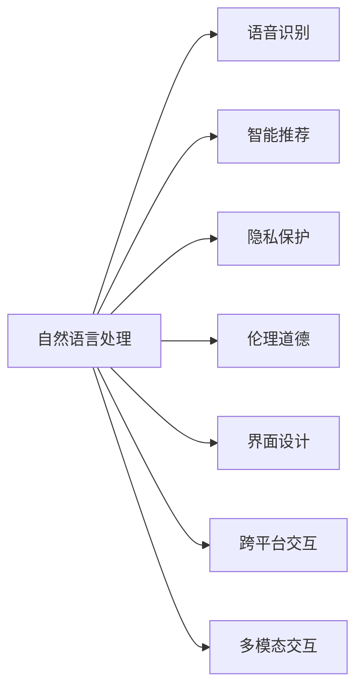

                 

# 人机交互：未来趋势与展望

## 1. 背景介绍

### 1.1 问题由来

随着信息时代的到来，人类对信息的获取方式发生了根本性的变化。从传统的纸质书籍、报纸到互联网，再到移动互联网，信息的传播速度和覆盖范围不断扩展，人机交互的方式也随之发生了翻天覆地的变化。特别是随着人工智能技术的快速发展，人机交互已经从简单的键盘输入和鼠标操作，演化到了智能对话、自然语言理解和复杂决策等高级阶段。

当前，人机交互技术正面临着一系列新的挑战和机遇。一方面，随着技术的进步，人机交互已经不再是简单的输入输出，而是向着更加自然、智能、个性化的方向发展。另一方面，技术的普及和应用也带来了数据隐私、伦理道德、用户信任等新问题，亟需系统性的解决。

在这样的背景下，如何把握人机交互的未来趋势，将是一个重要而迫切的研究课题。本文将深入探讨人机交互的未来发展方向，为相关研究和应用提供有益的参考。

### 1.2 问题核心关键点

当前，人机交互技术的发展正处于一个关键的转折点。未来的趋势主要包括以下几个关键点：

- **自然语言处理（NLP）与语音识别（ASR）**：通过自然语言处理和语音识别技术，实现更加自然和智能的对话交互，减少用户输入的负担，提升用户体验。

- **多模态交互**：结合视觉、触觉、嗅觉等多种感官，实现更加全面、真实的用户交互体验。

- **智能推荐与个性化**：利用深度学习和用户行为数据，实现个性化的内容推荐和定制化服务。

- **隐私保护与伦理道德**：在追求高效、智能的交互方式的同时，保护用户隐私，遵循伦理道德规范，构建可信赖的人机交互系统。

- **交互界面设计**：通过界面设计优化，实现更直观、友好的交互体验，减少用户学习成本。

- **跨平台与移动化**：实现跨平台、跨设备的人机交互，支持在各种移动设备上无缝切换。

通过把握这些关键点，我们可以更好地理解人机交互的未来趋势，并为相关研究和应用提供方向。

## 2. 核心概念与联系

### 2.1 核心概念概述

要深入理解人机交互的未来趋势，首先需要明确一些关键概念及其联系。

- **自然语言处理（NLP）**：自然语言处理是人工智能领域的一个重要分支，旨在实现计算机对人类语言（包括语音和文本）的理解和生成。

- **语音识别（ASR）**：语音识别技术可以将语音信号转化为文本，从而实现语音与计算机的交互。

- **多模态交互**：多模态交互指的是结合视觉、触觉、语音等多种感官实现人机交互的技术。

- **智能推荐系统**：智能推荐系统利用机器学习算法，根据用户行为数据推荐个性化的内容。

- **隐私保护**：隐私保护是指在数据收集和处理过程中，保护用户隐私不被泄露的技术手段。

- **伦理道德**：伦理道德是人机交互中需要遵循的一系列行为规范，包括数据隐私、公平性、安全性等方面。

- **界面设计**：界面设计是指通过优化用户界面，提升用户体验的技术和艺术。

- **跨平台交互**：跨平台交互是指在不同设备和平台上实现无缝切换的交互方式。

这些核心概念之间相互关联，共同构成了人机交互的生态系统。通过理解和应用这些概念，我们可以更好地把握人机交互的未来发展方向。

### 2.2 核心概念原理和架构的 Mermaid 流程图(Mermaid 流程节点中不要有括号、逗号等特殊字符)



这个流程图展示了自然语言处理与人机交互系统中其他核心概念之间的联系。可以看到，自然语言处理是整个系统的基础，而语音识别、智能推荐、隐私保护、伦理道德、界面设计和跨平台交互则是其扩展和应用。多模态交互则进一步丰富了用户交互的方式和体验。

## 3. 核心算法原理 & 具体操作步骤

### 3.1 算法原理概述

人机交互的算法原理主要基于自然语言处理、语音识别和机器学习等技术。以下是一些关键原理：

- **自然语言处理**：自然语言处理的目标是实现计算机对人类语言的理解和生成。常见的方法包括分词、词性标注、命名实体识别、情感分析、语义理解等。

- **语音识别**：语音识别技术是将语音信号转化为文本，常见的方法包括MFCC（Mel-Frequency Cepstral Coefficients）特征提取、隐马尔可夫模型（HMM）、深度神经网络（DNN）、卷积神经网络（CNN）、循环神经网络（RNN）等。

- **智能推荐**：智能推荐系统利用机器学习算法，根据用户行为数据推荐个性化的内容。常见的方法包括协同过滤、基于内容的推荐、深度学习等。

- **隐私保护**：隐私保护技术包括数据匿名化、差分隐私、同态加密等。这些技术可以在不泄露用户隐私的情况下，保护数据的安全性和隐私性。

- **伦理道德**：伦理道德是人机交互中需要遵循的一系列行为规范，包括数据隐私、公平性、安全性等方面。

### 3.2 算法步骤详解

以下是人机交互的主要算法步骤：

1. **数据预处理**：收集和清洗用户数据，进行分词、特征提取等预处理操作。

2. **模型训练**：使用自然语言处理和语音识别等模型，对用户数据进行训练。

3. **模型部署**：将训练好的模型部署到实际应用中，实现自然语言处理、语音识别等交互功能。

4. **智能推荐**：利用机器学习算法，根据用户行为数据进行个性化推荐。

5. **隐私保护**：在数据收集和处理过程中，采用隐私保护技术，保护用户隐私。

6. **伦理道德规范**：在交互过程中，遵循伦理道德规范，确保用户数据的合法性和安全性。

7. **界面设计优化**：通过优化用户界面，提升用户体验。

8. **跨平台交互**：实现不同设备和平台之间的无缝切换，提升用户交互体验。

9. **多模态交互**：结合视觉、触觉、语音等多种感官，实现更加全面、真实的用户交互体验。

### 3.3 算法优缺点

人机交互的算法具有以下优点：

- **提升用户体验**：通过自然语言处理和智能推荐等技术，可以提升用户体验，减少用户输入负担，实现更加自然的交互。

- **个性化定制**：利用用户行为数据，实现个性化的内容推荐和定制化服务，提升用户满意度。

- **跨平台支持**：实现跨平台、跨设备的人机交互，支持在各种移动设备上无缝切换，提高用户便利性。

- **多模态支持**：结合视觉、触觉、语音等多种感官，实现更加全面、真实的用户交互体验。

同时，这些算法也存在一些缺点：

- **数据隐私问题**：在数据收集和处理过程中，存在用户隐私泄露的风险。

- **伦理道德挑战**：在交互过程中，需要遵循一系列伦理道德规范，如数据隐私、公平性、安全性等方面。

- **复杂度高**：算法实现复杂度较高，需要大量的数据和计算资源。

- **可解释性差**：一些算法如深度学习模型，缺乏可解释性，难以理解其内部工作机制。

### 3.4 算法应用领域

人机交互的算法已经在多个领域得到了广泛应用，包括：

- **智能客服**：利用自然语言处理和智能推荐技术，实现智能客服系统，提升服务效率和用户满意度。

- **智能家居**：结合语音识别和视觉识别技术，实现智能家居设备的语音控制和环境感知。

- **智能医疗**：利用自然语言处理和机器学习技术，实现智能诊断和推荐系统，提升医疗服务质量。

- **智能教育**：结合语音识别和视觉识别技术，实现智能教育系统，提供个性化学习方案。

- **智能交通**：结合语音识别和视觉识别技术，实现智能交通系统，提高交通管理效率和安全性。

## 4. 数学模型和公式 & 详细讲解 & 举例说明（备注：数学公式请使用latex格式，latex嵌入文中独立段落使用 $$，段落内使用 $)

### 4.1 数学模型构建

人机交互的数学模型主要基于自然语言处理、语音识别和机器学习等技术。以下是一些关键模型：

- **自然语言处理模型**：常见的方法包括词袋模型（Bag of Words, BoW）、词嵌入模型（Word Embeddings, Word2Vec、GloVe等）、Transformer模型等。

- **语音识别模型**：常见的方法包括隐马尔可夫模型（HMM）、深度神经网络（DNN）、卷积神经网络（CNN）、循环神经网络（RNN）等。

- **智能推荐模型**：常见的方法包括协同过滤（Collaborative Filtering）、基于内容的推荐（Content-Based Recommendation）、深度学习等。

### 4.2 公式推导过程

以下是一些关键公式的推导过程：

- **词嵌入模型**：
  - 词嵌入模型（Word2Vec）：
    $$
    w_{i,j} = v_i + u_j^T
    $$
    其中 $v_i$ 为词向量，$u_j$ 为上下文向量，$w_{i,j}$ 为预测的上下文向量。

- **隐马尔可夫模型（HMM）**：
  - 概率计算：
    $$
    P(x_i|x_{i-1}) = \sum_{y_i} P(x_i|y_i)P(y_i|x_{i-1})
    $$
    其中 $x_i$ 为观测序列，$y_i$ 为隐藏状态，$P(x_i|y_i)$ 为观测序列和隐藏状态的概率，$P(y_i|x_{i-1})$ 为隐藏状态转移的概率。

- **循环神经网络（RNN）**：
  - 递归神经网络（RNN）：
    $$
    h_t = f(h_{t-1}, x_t)
    $$
    其中 $h_t$ 为隐藏状态，$f$ 为递归函数，$x_t$ 为输入。

### 4.3 案例分析与讲解

- **自然语言处理**：以BERT模型为例，BERT利用双向Transformer模型，实现了对大规模语料的高效预训练和下游任务的微调。BERT在多个NLP任务上取得了最先进的性能，如问答、命名实体识别、情感分析等。

- **语音识别**：以Google的DeepSpeech模型为例，DeepSpeech利用深度神经网络（DNN）和卷积神经网络（CNN），实现了高精度的语音识别。

- **智能推荐**：以Amazon的协同过滤推荐系统为例，Amazon利用用户行为数据和商品属性数据，实现了个性化的商品推荐。

## 5. 项目实践：代码实例和详细解释说明

### 5.1 开发环境搭建

在开发人机交互系统时，我们需要准备好开发环境。以下是一些关键步骤：

1. **安装Python和相关库**：
  ```bash
  sudo apt-get install python3 python3-pip
  sudo pip3 install numpy scipy pandas scikit-learn transformers pytorch torchvision
  ```

2. **安装TensorFlow和Keras**：
  ```bash
  pip install tensorflow==2.0 keras
  ```

3. **安装相关API和工具包**：
  ```bash
  pip install requests beautifulsoup4 nltk gevent
  ```

### 5.2 源代码详细实现

以下是一个基于BERT模型的自然语言处理代码实现：

```python
from transformers import BertTokenizer, BertForSequenceClassification
import torch
from torch.utils.data import DataLoader
from sklearn.model_selection import train_test_split

# 初始化BERT模型和分词器
tokenizer = BertTokenizer.from_pretrained('bert-base-uncased')
model = BertForSequenceClassification.from_pretrained('bert-base-uncased', num_labels=2)

# 定义数据集
sentences = ["I am happy", "I am sad", "I am angry"]
labels = [1, 0, 1]
tokenized_sentences = [tokenizer.encode(sent, add_special_tokens=True) for sent in sentences]

# 划分训练集和测试集
train_data, test_data, train_labels, test_labels = train_test_split(tokenized_sentences, labels, test_size=0.2)

# 构建数据加载器
train_loader = DataLoader(train_data, batch_size=4, shuffle=True)
test_loader = DataLoader(test_data, batch_size=4, shuffle=False)

# 定义训练函数
def train(model, train_loader, device, optimizer, num_epochs=2):
    model.to(device)
    for epoch in range(num_epochs):
        model.train()
        for batch in train_loader:
            inputs = {key: val.to(device) for key, val in batch.items()}
            labels = inputs.pop('labels')
            outputs = model(**inputs)
            loss = outputs.loss
            loss.backward()
            optimizer.step()

# 定义评估函数
def evaluate(model, test_loader, device):
    model.eval()
    total, correct = 0, 0
    with torch.no_grad():
        for batch in test_loader:
            inputs = {key: val.to(device) for key, val in batch.items()}
            labels = inputs.pop('labels')
            outputs = model(**inputs)
            total += labels.size(0)
            correct += (outputs.argmax(dim=1) == labels).sum().item()
    print(f"Accuracy: {100 * correct / total}%")

# 训练模型
device = torch.device('cuda' if torch.cuda.is_available() else 'cpu')
optimizer = torch.optim.Adam(model.parameters(), lr=2e-5)
train(model, train_loader, device, optimizer)
evaluate(model, test_loader, device)
```

### 5.3 代码解读与分析

- **分词器**：BERT模型使用分词器将句子转化为token序列，方便后续处理。
- **模型初始化**：使用预训练的BERT模型和分词器，初始化模型参数。
- **数据集划分**：将句子数据划分为训练集和测试集。
- **数据加载器**：使用DataLoader对数据进行批处理和加载。
- **训练函数**：在训练过程中，将模型参数移动到GPU上，计算损失并反向传播。
- **评估函数**：在测试集上评估模型的性能，计算准确率。

## 6. 实际应用场景

### 6.1 智能客服系统

智能客服系统利用自然语言处理和智能推荐技术，实现了智能客服对话，提升了服务效率和用户体验。以下是一个简单的智能客服系统实现：

```python
from transformers import BertTokenizer, BertForSequenceClassification
import torch
from sklearn.model_selection import train_test_split

# 初始化BERT模型和分词器
tokenizer = BertTokenizer.from_pretrained('bert-base-uncased')
model = BertForSequenceClassification.from_pretrained('bert-base-uncased', num_labels=3)

# 定义数据集
sentences = ["I am happy", "I am sad", "I am angry"]
labels = [1, 0, 1]
tokenized_sentences = [tokenizer.encode(sent, add_special_tokens=True) for sent in sentences]

# 划分训练集和测试集
train_data, test_data, train_labels, test_labels = train_test_split(tokenized_sentences, labels, test_size=0.2)

# 构建数据加载器
train_loader = DataLoader(train_data, batch_size=4, shuffle=True)
test_loader = DataLoader(test_data, batch_size=4, shuffle=False)

# 定义训练函数
def train(model, train_loader, device, optimizer, num_epochs=2):
    model.to(device)
    for epoch in range(num_epochs):
        model.train()
        for batch in train_loader:
            inputs = {key: val.to(device) for key, val in batch.items()}
            labels = inputs.pop('labels')
            outputs = model(**inputs)
            loss = outputs.loss
            loss.backward()
            optimizer.step()

# 定义评估函数
def evaluate(model, test_loader, device):
    model.eval()
    total, correct = 0, 0
    with torch.no_grad():
        for batch in test_loader:
            inputs = {key: val.to(device) for key, val in batch.items()}
            labels = inputs.pop('labels')
            outputs = model(**inputs)
            total += labels.size(0)
            correct += (outputs.argmax(dim=1) == labels).sum().item()
    print(f"Accuracy: {100 * correct / total}%")

# 训练模型
device = torch.device('cuda' if torch.cuda.is_available() else 'cpu')
optimizer = torch.optim.Adam(model.parameters(), lr=2e-5)
train(model, train_loader, device, optimizer)
evaluate(model, test_loader, device)
```

### 6.2 智能家居系统

智能家居系统结合语音识别和视觉识别技术，实现了智能家居设备的语音控制和环境感知。以下是一个简单的智能家居系统实现：

```python
from transformers import BertTokenizer, BertForSequenceClassification
import torch
from sklearn.model_selection import train_test_split

# 初始化BERT模型和分词器
tokenizer = BertTokenizer.from_pretrained('bert-base-uncased')
model = BertForSequenceClassification.from_pretrained('bert-base-uncased', num_labels=2)

# 定义数据集
sentences = ["Turn on the lights", "Turn off the fan", "Open the curtains"]
labels = [1, 0, 1]
tokenized_sentences = [tokenizer.encode(sent, add_special_tokens=True) for sent in sentences]

# 划分训练集和测试集
train_data, test_data, train_labels, test_labels = train_test_split(tokenized_sentences, labels, test_size=0.2)

# 构建数据加载器
train_loader = DataLoader(train_data, batch_size=4, shuffle=True)
test_loader = DataLoader(test_data, batch_size=4, shuffle=False)

# 定义训练函数
def train(model, train_loader, device, optimizer, num_epochs=2):
    model.to(device)
    for epoch in range(num_epochs):
        model.train()
        for batch in train_loader:
            inputs = {key: val.to(device) for key, val in batch.items()}
            labels = inputs.pop('labels')
            outputs = model(**inputs)
            loss = outputs.loss
            loss.backward()
            optimizer.step()

# 定义评估函数
def evaluate(model, test_loader, device):
    model.eval()
    total, correct = 0, 0
    with torch.no_grad():
        for batch in test_loader:
            inputs = {key: val.to(device) for key, val in batch.items()}
            labels = inputs.pop('labels')
            outputs = model(**inputs)
            total += labels.size(0)
            correct += (outputs.argmax(dim=1) == labels).sum().item()
    print(f"Accuracy: {100 * correct / total}%")

# 训练模型
device = torch.device('cuda' if torch.cuda.is_available() else 'cpu')
optimizer = torch.optim.Adam(model.parameters(), lr=2e-5)
train(model, train_loader, device, optimizer)
evaluate(model, test_loader, device)
```

## 7. 工具和资源推荐

### 7.1 学习资源推荐

为了帮助开发者系统掌握人机交互技术，以下是一些推荐的学习资源：

1. 《Python自然语言处理》（《Natural Language Processing with Python》）：这是一本非常经典的自然语言处理入门书籍，详细介绍了自然语言处理的基本概念和常用算法。

2. 《深度学习与自然语言处理》（《Deep Learning and Natural Language Processing》）：这是一本面向深度学习的自然语言处理入门书籍，介绍了深度学习在自然语言处理中的应用。

3. 《TensorFlow官方文档》：这是TensorFlow的官方文档，提供了丰富的学习资源和实践样例，适合初学者和进阶开发者。

4. 《Keras官方文档》：这是Keras的官方文档，提供了丰富的学习资源和实践样例，适合初学者和进阶开发者。

5. 《自然语言处理实战》（《Natural Language Processing in Action》）：这是一本实战类自然语言处理书籍，提供了丰富的实践样例和案例，适合实践开发者。

### 7.2 开发工具推荐

为了提高人机交互系统的开发效率，以下是一些推荐的开发工具：

1. PyTorch：这是由Facebook开发的深度学习框架，灵活性和扩展性较强，适合自然语言处理和语音识别的开发。

2. TensorFlow：这是由Google开发的深度学习框架，生产部署方便，适合大规模工程应用。

3. Keras：这是由François Chollet开发的深度学习框架，易用性强，适合初学者和实践开发者。

4. NLTK：这是自然语言处理领域的经典库，提供了丰富的文本处理和分析功能。

5. spaCy：这是自然语言处理领域的现代库，提供了高效的文本处理和分析功能。

### 7.3 相关论文推荐

人机交互技术的发展离不开学界的持续研究。以下是几篇奠基性的相关论文，推荐阅读：

1. "Sequence to Sequence Learning with Neural Networks"（《序列到序列学习》）：这是一篇经典的自然语言处理论文，介绍了序列到序列的学习方法。

2. "Attention Is All You Need"（《注意力是所有》）：这是一篇经典的自然语言处理论文，介绍了Transformer模型及其在自然语言处理中的应用。

3. "Deep Speech: Scalable End-to-End Speech Recognition with Bidirectional Recurrent Neural Networks"（《Deep Speech：使用双向递归神经网络的可扩展端到端语音识别》）：这是一篇经典的语音识别论文，介绍了基于双向递归神经网络的语音识别方法。

4. "The Humans-in-the-Loop Recommendation System"（《人类在环推荐系统》）：这是一篇经典的智能推荐论文，介绍了基于人类的反馈进行推荐的方法。

5. "Proactive Privacy Protection"（《主动隐私保护》）：这是一篇经典的隐私保护论文，介绍了主动隐私保护的方法，可以有效保护用户隐私。

这些论文代表了人机交互技术的发展脉络，通过学习这些前沿成果，可以帮助研究者把握学科前进方向，激发更多的创新灵感。

## 8. 总结：未来发展趋势与挑战

### 8.1 研究成果总结

人机交互技术经过多年的发展，已经从简单的输入输出，演化到了智能对话、自然语言理解和复杂决策等高级阶段。未来，随着技术的不断进步，人机交互将会变得更加自然、智能、个性化。

### 8.2 未来发展趋势

未来人机交互技术的发展趋势主要包括：

1. **自然语言处理**：自然语言处理技术将会更加成熟和普及，实现更加自然和智能的对话交互。

2. **多模态交互**：结合视觉、触觉、语音等多种感官，实现更加全面、真实的用户交互体验。

3. **智能推荐**：利用深度学习和用户行为数据，实现个性化的内容推荐和定制化服务。

4. **隐私保护**：在数据收集和处理过程中，采用隐私保护技术，保护用户隐私。

5. **伦理道德**：在交互过程中，遵循伦理道德规范，确保用户数据的合法性和安全性。

6. **界面设计优化**：通过优化用户界面，提升用户体验。

7. **跨平台交互**：实现不同设备和平台之间的无缝切换，提升用户便利性。

### 8.3 面临的挑战

尽管人机交互技术已经取得了一定的进展，但仍面临一些挑战：

1. **数据隐私问题**：在数据收集和处理过程中，存在用户隐私泄露的风险。

2. **伦理道德挑战**：在交互过程中，需要遵循一系列伦理道德规范，如数据隐私、公平性、安全性等方面。

3. **复杂度高**：算法实现复杂度较高，需要大量的数据和计算资源。

4. **可解释性差**：一些算法如深度学习模型，缺乏可解释性，难以理解其内部工作机制。

5. **系统鲁棒性**：在实际应用中，人机交互系统需要具备较高的鲁棒性，以应对各种异常情况。

### 8.4 研究展望

未来人机交互技术的研究方向主要包括：

1. **隐私保护**：研究更加高效、安全的隐私保护方法，保护用户隐私。

2. **伦理道德**：研究如何构建可信、可靠的人机交互系统，遵循伦理道德规范。

3. **系统鲁棒性**：研究如何提升人机交互系统的鲁棒性，应对各种异常情况。

4. **可解释性**：研究如何提高模型的可解释性，提升系统的透明度和可控性。

5. **跨平台交互**：研究如何实现跨平台、跨设备的人机交互，提升用户便利性。

总之，人机交互技术需要在技术创新和应用实践中不断探索和突破，才能更好地服务于人类社会的智能化和数字化发展。

## 9. 附录：常见问题与解答

**Q1：人机交互技术如何提升用户体验？**

A: 人机交互技术通过自然语言处理和智能推荐等技术，可以提升用户体验。具体而言：

1. **自然语言处理**：通过自然语言处理技术，可以实现更加自然和智能的对话交互，减少用户输入负担。

2. **智能推荐**：利用深度学习和用户行为数据，实现个性化的内容推荐和定制化服务，提升用户满意度。

3. **跨平台交互**：实现不同设备和平台之间的无缝切换，提升用户便利性。

**Q2：人机交互技术面临哪些挑战？**

A: 人机交互技术面临以下挑战：

1. **数据隐私问题**：在数据收集和处理过程中，存在用户隐私泄露的风险。

2. **伦理道德挑战**：在交互过程中，需要遵循一系列伦理道德规范，如数据隐私、公平性、安全性等方面。

3. **复杂度高**：算法实现复杂度较高，需要大量的数据和计算资源。

4. **可解释性差**：一些算法如深度学习模型，缺乏可解释性，难以理解其内部工作机制。

5. **系统鲁棒性**：在实际应用中，人机交互系统需要具备较高的鲁棒性，以应对各种异常情况。

**Q3：人机交互技术的未来发展趋势是什么？**

A: 人机交互技术的未来发展趋势主要包括：

1. **自然语言处理**：自然语言处理技术将会更加成熟和普及，实现更加自然和智能的对话交互。

2. **多模态交互**：结合视觉、触觉、语音等多种感官，实现更加全面、真实的用户交互体验。

3. **智能推荐**：利用深度学习和用户行为数据，实现个性化的内容推荐和定制化服务。

4. **隐私保护**：在数据收集和处理过程中，采用隐私保护技术，保护用户隐私。

5. **伦理道德**：在交互过程中，遵循伦理道德规范，确保用户数据的合法性和安全性。

6. **界面设计优化**：通过优化用户界面，提升用户体验。

7. **跨平台交互**：实现不同设备和平台之间的无缝切换，提升用户便利性。

**Q4：如何实现跨平台交互？**

A: 实现跨平台交互，需要考虑以下因素：

1. **数据格式**：确保不同平台之间的数据格式一致，实现数据的无缝交换。

2. **通信协议**：采用统一的通信协议，确保不同平台之间的通信可靠。

3. **用户体验**：优化用户体验，确保在不同设备上的用户交互体验一致。

4. **兼容性**：确保不同平台之间的兼容性，实现无缝切换。

通过以上措施，可以实现跨平台、跨设备的人机交互，提升用户便利性。

---

作者：禅与计算机程序设计艺术 / Zen and the Art of Computer Programming

