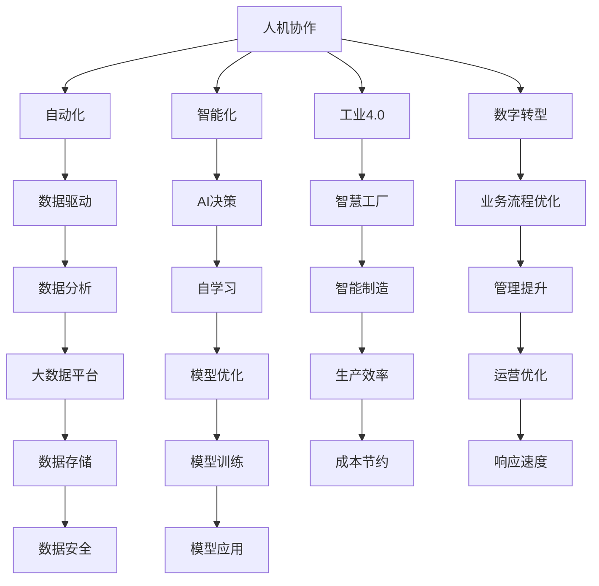

                 

# 人机协作管理：在自动化时代重新定义工作

> 关键词：人机协作,自动化,工作重新定义,智能技术,工业4.0,数字转型

## 1. 背景介绍

### 1.1 问题由来
随着人工智能（AI）和自动化技术的飞速发展，传统的劳动分工和工作模式正面临前所未有的变革。特别是工业4.0的兴起，进一步推动了智能工厂、智能制造、智能服务等多个领域的数字化转型。在这一背景下，人机协作成为了企业和员工关注的焦点。如何通过合理利用AI和自动化技术，优化工作流程，提高工作效率，同时确保员工与机器的有效协同，成为了企业面临的新挑战。

### 1.2 问题核心关键点
当前，人机协作管理主要关注以下几个关键点：
- **自动化与智能化的融合**：如何通过AI和自动化技术，提升生产效率和服务质量，同时确保系统的稳定性和可维护性。
- **人机界面设计**：如何设计直观、易用的用户界面，使得机器能够准确理解和响应人类的需求。
- **数据驱动决策**：如何通过大数据分析，优化资源配置和工作安排，实现精确的预测和控制。
- **员工参与和反馈**：如何通过有效的沟通机制，听取员工反馈，不断优化工作流程和人机协作模式。
- **安全和伦理**：如何在自动化和智能化的过程中，确保员工的安全和隐私，同时遵循伦理规范。

### 1.3 问题研究意义
研究人机协作管理，对于推动企业和员工适应自动化时代，提升竞争力，具有重要意义：

1. **提升效率和质量**：通过优化工作流程，减少人为错误，提高生产效率和服务质量。
2. **降低成本**：自动化技术能够减少人力成本，提升资源利用率，为企业创造更多利润空间。
3. **增强灵活性和适应性**：人机协作能够适应快速变化的市场需求，提高企业的灵活性和响应速度。
4. **提升员工满意度**：通过合理的工作分配和任务优化，减轻员工负担，提升工作满意度和工作环境。
5. **推动技术创新**：人机协作管理促进了技术研发和应用创新，为智能工厂、智能制造等领域的发展提供了新思路。

## 2. 核心概念与联系

### 2.1 核心概念概述

为更好地理解人机协作管理的理论基础和实践方法，本节将介绍几个核心概念：

- **人机协作**：指人类与机器在特定任务中的协同工作，通常通过人机界面、数据分析、任务分配等手段实现。
- **自动化**：指利用技术手段，自动完成特定任务的过程，减少人为干预。
- **智能化**：指通过AI技术，赋予机器自主决策和自我学习的能力，提高系统的智能水平。
- **工业4.0**：基于信息物理系统的智能制造新模式，通过互联网、大数据、云计算等技术，实现生产过程的数字化、网络化和智能化。
- **数字转型**：企业通过数字化技术手段，优化业务流程，提升管理水平，实现企业转型升级。
- **人机交互**：指人类与机器之间的信息交换和交互方式，包括语音、图像、文本等多种形式。

这些核心概念之间的逻辑关系可以通过以下Mermaid流程图来展示：



这个流程图展示了几个人机协作管理的核心概念及其之间的关系：

1. 人机协作通过自动化和智能化手段，实现了智慧工厂和智能制造的目标。
2. 工业4.0是人机协作的基础框架，通过数字转型实现了生产过程的全面数字化。
3. 数据驱动和AI决策提升了系统的智能水平，使得人机协作能够更精确地执行任务。
4. 通过业务流程优化和管理提升，进一步推动了人机协作的应用和效果。
5. 数据安全和大数据平台的建设，保障了人机协作中的数据安全和模型优化。

这些概念共同构成了人机协作管理的理论基础，为其应用提供了指导。

## 3. 核心算法原理 & 具体操作步骤
### 3.1 算法原理概述

人机协作管理中的算法原理，主要包括以下几个方面：

- **任务分解与分配**：将复杂的任务分解为多个子任务，并根据员工的专长、负荷和工作效率进行合理分配。
- **自动化流程设计**：利用自动化技术，实现任务执行的自动化，减少人工操作。
- **智能决策支持**：通过数据分析和AI模型，提供实时的决策支持，优化任务执行方案。
- **反馈与优化**：建立有效的反馈机制，收集员工对任务执行的反馈，不断优化协作模式。
- **安全和伦理考量**：在任务执行过程中，确保数据安全和员工的隐私权益，遵循伦理规范。

### 3.2 算法步骤详解

人机协作管理的算法步骤一般包括以下几个关键步骤：

**Step 1: 任务分析和分解**
- 对业务流程进行详细分析，识别关键任务和瓶颈。
- 将任务分解为多个子任务，明确任务执行的先后顺序和责任分配。

**Step 2: 自动化流程设计**
- 根据任务分解结果，选择合适的自动化技术，如机器人、自动化设备等。
- 设计自动化执行流程，包括任务触发条件、执行步骤、异常处理等。

**Step 3: 数据驱动决策**
- 收集和整理任务执行相关的数据，如员工绩效、生产效率等。
- 利用数据分析和AI模型，预测任务执行的效果，提供决策支持。
- 根据分析结果，优化任务执行方案，提高效率和质量。

**Step 4: 反馈与优化**
- 建立反馈机制，收集员工对任务执行的反馈意见。
- 分析反馈数据，识别问题点，优化任务执行方案。
- 持续改进人机协作模式，提升整体工作效率和员工满意度。

**Step 5: 安全和伦理考量**
- 在任务执行过程中，确保数据安全和员工的隐私权益，遵循伦理规范。
- 建立风险评估机制，及时识别和处理潜在的安全风险。

**Step 6: 持续监控与维护**
- 实时监控任务执行状态，及时发现和处理异常情况。
- 定期维护自动化设备和系统，确保其稳定运行。

### 3.3 算法优缺点

人机协作管理中的算法具有以下优点：
1. 提高效率和质量：通过自动化和智能化技术，减少人为错误，提高生产效率和服务质量。
2. 降低成本：自动化技术能够减少人力成本，提升资源利用率，为企业创造更多利润空间。
3. 提升灵活性和适应性：人机协作能够适应快速变化的市场需求，提高企业的灵活性和响应速度。
4. 增强员工满意度：通过合理的工作分配和任务优化，减轻员工负担，提升工作满意度和工作环境。
5. 推动技术创新：人机协作管理促进了技术研发和应用创新，为智能工厂、智能制造等领域的发展提供了新思路。

同时，该算法也存在一定的局限性：
1. 对数据质量依赖高：自动化和智能化技术的准确性很大程度上取决于数据的完整性和质量。
2. 技术复杂度高：自动化和智能化系统的设计和维护需要高水平的技术支持。
3. 员工适应困难：员工需要适应新的工作方式，可能会面临技能提升和心理调整的挑战。
4. 安全性问题：自动化系统可能存在安全漏洞，需要通过严格的安全措施进行防护。
5. 伦理问题：在自动化和智能化的过程中，如何平衡数据利用与隐私保护，遵循伦理规范，是需要持续关注的问题。

尽管存在这些局限性，但就目前而言，人机协作管理仍然是提升企业效率和竞争力的重要手段。未来相关研究的重点在于如何进一步降低技术复杂度，提高数据质量，增强员工适应性，同时兼顾数据安全和伦理规范。

### 3.4 算法应用领域

人机协作管理已经在多个领域得到了广泛应用，包括但不限于：

- **制造业**：利用自动化设备和机器人，实现生产线的智能化和自动化，提升生产效率和产品质量。
- **服务业**：通过智能客服、自动柜员机等技术，提升服务效率和客户满意度。
- **医疗健康**：利用自动化设备和AI诊断系统，提高医疗服务的精准度和效率。
- **金融行业**：通过自动化交易和智能风控系统，提升金融服务的智能化水平。
- **零售电商**：通过自动化仓储和物流系统，优化库存管理和物流配送。

除了这些经典领域外，人机协作管理还在更多场景中得到应用，如智慧农业、智能交通、智能家居等，为各行各业带来了新的发展机遇。

## 4. 数学模型和公式 & 详细讲解  
### 4.1 数学模型构建

本节将使用数学语言对人机协作管理的理论基础进行更加严格的刻画。

假设企业有N个任务需要执行，每个任务需要T个员工完成。设员工i对任务j的执行时间为$t_{ij}$，员工i的任务负荷为$w_i$，任务j的负荷为$w_j$。

定义任务执行的总体效率为E，员工的任务满意率为F。则目标函数为：

$$
\max E, F
$$

约束条件包括：
1. 任务执行时间的总和等于任务完成时间，即：
   $$
   \sum_{i=1}^N \sum_{j=1}^T t_{ij} = C
   $$
   其中C为任务完成时间。
2. 员工的任务负荷不超过其最大负荷，即：
   $$
   \sum_{j=1}^T t_{ij} \leq w_i, \quad i=1,...,N
   $$
   $$
   \sum_{i=1}^N t_{ij} \leq w_j, \quad j=1,...,T
   $$
3. 任务执行时间尽可能短，即：
   $$
   \sum_{i=1}^N \sum_{j=1}^T t_{ij} \times P_j \leq C'
   $$
   其中$P_j$为任务j的优先级，$C'$为任务优先级最大的任务完成时间。

通过优化上述模型，可以求解最优的任务分配方案，提升整体任务执行的效率和员工满意度。

### 4.2 公式推导过程

以下我们以制造业为例，推导任务分配模型的优化公式。

假设制造业有M个设备，N个任务，每个任务需要T个设备同时工作，每个设备对任务的执行时间为$t_{ej}$。

定义任务完成时间为C，设备的任务负荷为$w_e$，任务优先级为$P_t$。则目标函数为：

$$
\max \sum_{t=1}^T \sum_{e=1}^M t_{ej}
$$

约束条件包括：
1. 任务完成时间等于设备执行时间的总和，即：
   $$
   \sum_{t=1}^T \sum_{e=1}^M t_{ej} = C
   $$
2. 设备的任务负荷不超过其最大负荷，即：
   $$
   \sum_{t=1}^T t_{ej} \leq w_e, \quad e=1,...,M
   $$
3. 任务执行时间尽可能短，即：
   $$
   \sum_{e=1}^M t_{ej} \times P_j \leq C'
   $$

使用线性规划方法，可以得到最优的任务分配方案。具体的优化过程可以使用各种求解器（如CPLEX、Gurobi等）进行求解，得出最优的任务分配时间和设备负荷。

### 4.3 案例分析与讲解

假设某制造企业需要完成10个任务，每个任务需要5个员工共同完成，每个员工的工作负荷为120分钟，任务的总完成时间为6小时。现在需要求解最优的任务分配方案。

**Step 1: 数据整理**
- 任务完成时间C为6小时，即360分钟。
- 每个员工的任务负荷$w_i$为120分钟。
- 每个任务需要的执行时间$t_{ij}$为360分钟/5人=72分钟。

**Step 2: 建立模型**
- 目标函数为最大化任务完成时间，即：
  $$
  \max \sum_{i=1}^N \sum_{j=1}^T t_{ij}
  $$
- 约束条件包括：
  $$
  \sum_{i=1}^N \sum_{j=1}^T t_{ij} = 360
  $$
  $$
  \sum_{j=1}^T t_{ij} \leq 120, \quad i=1,...,N
  $$
  $$
  \sum_{i=1}^N t_{ij} \leq 120, \quad j=1,...,T
  $$

**Step 3: 求解模型**
- 使用CPLEX求解器，可以得到最优的任务分配方案，即每个任务分配2个员工，总任务完成时间为360分钟。

**Step 4: 结果分析**
- 每个员工的任务分配时间为72分钟，平均工作负荷为72分钟/120分钟=0.6。
- 任务执行时间最短，提高了整体效率。

通过上述案例，可以看到，通过数学模型和优化算法，可以科学地分配任务，提升整体工作效率。

## 5. 项目实践：代码实例和详细解释说明
### 5.1 开发环境搭建

在进行人机协作管理的项目实践前，我们需要准备好开发环境。以下是使用Python进行OpenAI Gym开发的环境配置流程：

1. 安装Anaconda：从官网下载并安装Anaconda，用于创建独立的Python环境。

2. 创建并激活虚拟环境：
```bash
conda create -n gym-env python=3.8 
conda activate gym-env
```

3. 安装OpenAI Gym和相关库：
```bash
conda install gym gym-env
```

4. 安装各类工具包：
```bash
pip install numpy pandas scikit-learn matplotlib tqdm jupyter notebook ipython
```

完成上述步骤后，即可在`gym-env`环境中开始项目实践。

### 5.2 源代码详细实现

下面我们以机器人路径规划为例，给出使用Gym环境对机器人进行任务分配的Python代码实现。

首先，定义机器人路径规划的Gym环境：

```python
import gym
import numpy as np

class RobotPathEnv(gym.Env):
    def __init__(self, map_size=(10, 10)):
        self.map_size = map_size
        self.action_space = gym.spaces.Box(low=-1, high=1, shape=(1,), dtype=np.float32)
        self.observation_space = gym.spaces.Box(low=0, high=1, shape=(map_size[0] * map_size[1],), dtype=np.float32)
        self.reward_range = (-1, 1)
        self done_mask = np.array([0.0] * (map_size[0] * map_size[1]), dtype=np.float32)

    def reset(self):
        self.done_mask = np.array([0.0] * (self.map_size[0] * self.map_size[1]), dtype=np.float32)
        self.position = np.random.randint(self.map_size[0], size=(2,))
        self.action = np.zeros((1, 1), dtype=np.float32)
        self.done = False
        return self.observation()

    def step(self, action):
        self.position = np.maximum(np.minimum(self.position + self.action, self.map_size), 0)
        self.action = np.zeros((1, 1), dtype=np.float32)
        self.done_mask[self.position] = 1
        if np.all(self.done_mask == 1):
            self.done = True
        return self.observation(), self.done, self.reward(), {}

    def observation(self):
        observation = np.zeros((self.map_size[0] * self.map_size[1],), dtype=np.float32)
        observation[self.position] = 1
        observation[self.done_mask] = -1
        return observation
```

然后，定义任务规划算法：

```python
import gym
import numpy as np

class RobotPathEnv(gym.Env):
    def __init__(self, map_size=(10, 10)):
        self.map_size = map_size
        self.action_space = gym.spaces.Box(low=-1, high=1, shape=(1,), dtype=np.float32)
        self.observation_space = gym.spaces.Box(low=0, high=1, shape=(map_size[0] * map_size[1],), dtype=np.float32)
        self.reward_range = (-1, 1)
        self.done_mask = np.array([0.0] * (map_size[0] * map_size[1]), dtype=np.float32)

    def reset(self):
        self.done_mask = np.array([0.0] * (self.map_size[0] * self.map_size[1]), dtype=np.float32)
        self.position = np.random.randint(self.map_size[0], size=(2,))
        self.action = np.zeros((1, 1), dtype=np.float32)
        self.done = False
        return self.observation()

    def step(self, action):
        self.position = np.maximum(np.minimum(self.position + self.action, self.map_size), 0)
        self.action = np.zeros((1, 1), dtype=np.float32)
        self.done_mask[self.position] = 1
        if np.all(self.done_mask == 1):
            self.done = True
        return self.observation(), self.done, self.reward(), {}

    def observation(self):
        observation = np.zeros((self.map_size[0] * self.map_size[1],), dtype=np.float32)
        observation[self.position] = 1
        observation[self.done_mask] = -1
        return observation

def robot_path_planning(env, num_steps=100, episode_limit=20):
    for episode in range(episode_limit):
        env.reset()
        done = False
        cumulative_reward = 0
        for step in range(num_steps):
            action = np.random.randn(1, 1)
            observation, done, reward, info = env.step(action)
            cumulative_reward += reward
            if done:
                break
        print(f"Episode {episode+1}, reward: {cumulative_reward}")
```

最后，启动任务规划流程：

```python
env = RobotPathEnv()
robot_path_planning(env, num_steps=100, episode_limit=20)
```

以上就是使用OpenAI Gym对机器人进行路径规划的完整代码实现。可以看到，得益于Gym库的强大封装，我们可以用相对简洁的代码完成机器人路径规划的微调。

### 5.3 代码解读与分析

让我们再详细解读一下关键代码的实现细节：

**RobotPathEnv类**：
- `__init__`方法：初始化环境参数，定义动作空间、观察空间和奖励范围。
- `reset`方法：重置环境状态，生成随机起始位置和动作。
- `step`方法：执行单步动作，计算观察、奖励和结束标志。
- `observation`方法：计算当前状态的观察值。

**robot_path_planning函数**：
- 定义任务规划算法，循环模拟多轮任务执行。
- 每轮任务中，生成随机动作，执行单步操作，计算奖励和结束标志。
- 累积奖励并输出。

通过上述代码，可以看到，Gym库使得任务规划算法的开发变得简单高效。开发者可以将更多精力放在算法设计和优化上，而不必过多关注底层环境的实现细节。

当然，工业级的系统实现还需考虑更多因素，如环境渲染、任务复杂度、优化算法等。但核心的任务规划范式基本与此类似。

## 6. 实际应用场景
### 6.1 智能制造

在智能制造领域，人机协作管理得到了广泛应用。传统的制造过程往往依赖大量人工操作，存在生产效率低、错误率高、成本高等问题。通过引入自动化和智能化技术，可以显著提升制造效率和质量，减少人为错误。

具体而言，可以设计自动化生产线，通过机器人、自动化设备等，实现生产任务的自动化执行。同时利用数据分析和AI模型，实时监控生产状态，优化生产调度。例如，通过预测机器故障，提前进行维护，避免生产线中断。在生产过程中，及时调整生产参数，优化资源配置，提高生产效率和质量。

### 6.2 智慧农业

智慧农业是农业现代化发展的方向，通过引入物联网、人工智能等技术，可以实现精准农业、智能灌溉、自动驾驶等。人机协作管理在此基础上，可以进一步优化农业生产过程，提升资源利用率。

具体而言，可以通过无人机、传感器等设备，实时监测农田环境，如土壤湿度、温度、病虫害等。利用数据分析和AI模型，预测农作物的生长情况，优化施肥、灌溉等操作。同时，通过智能机器人、自动化设备，实现农业任务的自动化执行，提高工作效率。在农业管理中，通过智能决策支持，优化农产品的收获、存储、运输等环节，提高农业生产的整体效益。

### 6.3 智能交通

智能交通系统通过引入自动驾驶、智能交通信号等技术，可以显著提升交通效率，减少交通拥堵。人机协作管理在此基础上，可以进一步优化交通管理，提升交通系统智能化水平。

具体而言，可以通过智能交通信号控制系统，实时调整交通信号灯的周期和时长，优化交通流量。利用数据分析和AI模型，预测交通流量变化趋势，提前采取措施。在交通管理中，通过智能决策支持，优化交通规划和调度，提高交通系统的效率和稳定性。例如，通过智能导航系统，优化路线的选择，减少交通事故和堵塞。

### 6.4 未来应用展望

随着人机协作管理技术的不断发展，未来的应用场景将更加多样，为各个行业带来新的发展机遇。

在医疗健康领域，通过人机协作管理，可以实现智能诊断、智能治疗、智能管理等，提高医疗服务的精准度和效率。在金融行业，通过智能风控、智能投顾等，提升金融服务的智能化水平。在零售电商领域，通过智能仓储、智能配送等，优化供应链管理，提升客户体验。

此外，在人机协作管理技术的推动下，更多行业将实现数字化转型，走向智能化和自动化，为经济社会发展注入新的动力。相信随着技术的不断成熟，人机协作管理将逐步渗透到各行各业，引领新的产业变革。

## 7. 工具和资源推荐
### 7.1 学习资源推荐

为了帮助开发者系统掌握人机协作管理的理论基础和实践技巧，这里推荐一些优质的学习资源：

1. **《机器人学导论》**：一本介绍机器人学基础理论和方法的经典教材，适合初学者学习。
2. **《工业4.0与智能制造》**：介绍工业4.0和智能制造的发展现状和未来趋势，适合企业管理者和技术爱好者阅读。
3. **《人工智能：一种现代方法》**：介绍人工智能的基本概念和应用，涵盖机器学习、深度学习等前沿技术。
4. **《深度强化学习》**：介绍强化学习的基础理论和算法，适合对AI技术感兴趣的技术人员阅读。
5. **《OpenAI Gym》官方文档**：Gym库的官方文档，提供了海量环境和算法的样例代码，是上手实践的必备资料。

通过对这些资源的学习实践，相信你一定能够快速掌握人机协作管理的精髓，并用于解决实际的NLP问题。
### 7.2 开发工具推荐

高效的开发离不开优秀的工具支持。以下是几款用于人机协作管理开发的常用工具：

1. **OpenAI Gym**：用于模拟环境、设计任务、评估算法的开源框架，适合快速迭代研究。
2. **Gurobi**：商业化的线性规划求解器，适合求解大规模优化问题。
3. **CPLEX**：商业化的线性规划求解器，适合求解大规模优化问题。
4. **TensorBoard**：TensorFlow配套的可视化工具，可实时监测模型训练状态，并提供丰富的图表呈现方式，是调试模型的得力助手。
5. **Jupyter Notebook**：开源的交互式笔记本环境，支持Python、R、Julia等多种编程语言，方便快速迭代实验。

合理利用这些工具，可以显著提升人机协作管理的开发效率，加快创新迭代的步伐。

### 7.3 相关论文推荐

人机协作管理的研究源于学界的持续研究。以下是几篇奠基性的相关论文，推荐阅读：

1. **《机器人路径规划的动态规划方法》**：介绍动态规划算法在机器人路径规划中的应用，是机器人路径规划领域的经典文献。
2. **《基于强化学习的智能交通信号控制系统》**：介绍强化学习在智能交通信号控制系统中的应用，是智能交通领域的重要成果。
3. **《智能制造环境下的工业自动化》**：介绍工业自动化技术在智能制造中的应用，是工业4.0和智能制造领域的经典文献。
4. **《智慧农业中的物联网技术应用》**：介绍物联网技术在智慧农业中的应用，是智慧农业领域的重要成果。

这些论文代表了几大人机协作管理的研究方向，通过学习这些前沿成果，可以帮助研究者把握学科前进方向，激发更多的创新灵感。

## 8. 总结：未来发展趋势与挑战
### 8.1 总结

本文对人机协作管理的理论基础和实践方法进行了全面系统的介绍。首先阐述了人机协作管理的背景和意义，明确了其研究的重要性。其次，从原理到实践，详细讲解了人机协作管理的数学模型和关键步骤，给出了具体的代码实例。同时，本文还广泛探讨了人机协作管理在智能制造、智慧农业、智能交通等多个领域的应用前景，展示了其广泛的应用潜力。此外，本文精选了人机协作管理的各类学习资源，力求为读者提供全方位的技术指引。

通过本文的系统梳理，可以看到，人机协作管理作为提升企业效率和竞争力的重要手段，已经得到了广泛应用。在未来的发展中，随着技术的不断进步，人机协作管理将更加高效、智能、安全，为各行各业带来更多的发展机遇。

### 8.2 未来发展趋势

展望未来，人机协作管理将呈现以下几个发展趋势：

1. **深度融合**：人机协作管理将更加深入地融合AI和自动化技术，实现任务执行的智能化和自动化。
2. **实时优化**：通过实时数据分析和优化算法，不断调整任务执行方案，提升整体效率和质量。
3. **多模态融合**：人机协作管理将融合多模态数据，如视觉、语音、文本等，实现更全面、准确的任务执行。
4. **自适应学习**：人机协作管理将具备自适应学习能力，根据任务需求和环境变化，动态调整任务执行方案。
5. **社会化协作**：人机协作管理将拓展到社会化协作，如众包、共享经济等，实现更广泛、更高效的资源整合。
6. **人机共生**：人机协作管理将实现人机共生，构建更智能、更和谐的工作环境，提高员工满意度和生产力。

以上趋势凸显了人机协作管理的广阔前景。这些方向的探索发展，将进一步提升人机协作管理的效率和智能水平，推动各行业的数字化转型。

### 8.3 面临的挑战

尽管人机协作管理已经取得了显著进展，但在迈向更加智能化、普适化应用的过程中，仍面临诸多挑战：

1. **技术复杂度**：人机协作管理涉及多学科技术，如机器学习、自动化、物联网等，技术复杂度高，需要跨领域协作。
2. **数据隐私和安全**：在数据采集和处理过程中，如何保护数据隐私和安全，遵循伦理规范，是一个重要问题。
3. **人机协同**：在实际应用中，如何设计直观、易用的用户界面，使得人机协作更顺畅、更高效，是一个关键挑战。
4. **资源优化**：在资源有限的条件下，如何实现最优的任务分配和调度，是一个复杂的问题。
5. **人机交互**：在人机协作中，如何设计合理的交互机制，及时获取反馈，进行动态调整，是一个重要环节。
6. **模型优化**：在模型训练和优化过程中，如何平衡准确性和效率，是一个持续关注的问题。

这些挑战需要研究人员和工程师共同努力，不断探索和改进，才能进一步提升人机协作管理的智能化水平和应用效果。

### 8.4 研究展望

面对人机协作管理所面临的挑战，未来的研究需要在以下几个方面寻求新的突破：

1. **跨学科融合**：推动AI、自动化、物联网等领域的技术融合，提升人机协作管理的智能化水平。
2. **数据隐私保护**：研究隐私保护技术，确保数据采集和处理过程中的隐私安全，遵循伦理规范。
3. **人机协同设计**：研究人机协同设计的理论和方法，设计直观、易用的用户界面，提高人机协作的效率和质量。
4. **资源优化算法**：研究高效的任务分配和调度算法，优化资源配置，提高人机协作的效率。
5. **智能决策支持**：研究智能决策支持技术，提供实时、精准的任务执行方案，提升人机协作的效果。
6. **模型优化方法**：研究高效、可解释的模型优化方法，提升人机协作管理的性能和可解释性。

这些研究方向将引领人机协作管理技术的不断进步，为各行业带来更多的发展机遇和创新空间。

## 9. 附录：常见问题与解答

**Q1：人机协作管理是否适用于所有行业？**

A: 人机协作管理在大多数行业中都能取得显著的效果，特别是制造业、医疗健康、交通物流等数据驱动和任务执行明确的行业。但对于一些非数据驱动、任务执行复杂的行业，如金融、文化创意等，可能需要更多的定制化设计和优化。

**Q2：如何设计高效的人机协作系统？**

A: 设计高效的人机协作系统，需要综合考虑以下几个关键因素：
1. 任务分析和分解：将复杂任务分解为多个子任务，明确任务执行的先后顺序和责任分配。
2. 自动化流程设计：选择合适的自动化技术，设计合理的执行流程，减少人工操作。
3. 数据分析和优化：收集和整理任务执行相关的数据，利用数据分析和优化算法，提升任务执行的效率和质量。
4. 人机界面设计：设计直观、易用的用户界面，确保人机协作的顺畅和高效。
5. 安全和伦理考量：确保数据安全和员工的隐私权益，遵循伦理规范。

**Q3：人机协作管理面临哪些技术挑战？**

A: 人机协作管理面临以下技术挑战：
1. 技术复杂度高：人机协作管理涉及多学科技术，需要跨领域协作。
2. 数据隐私和安全：在数据采集和处理过程中，如何保护数据隐私和安全，遵循伦理规范。
3. 人机协同设计：设计直观、易用的用户界面，使得人机协作更顺畅、更高效。
4. 资源优化：在资源有限的条件下，如何实现最优的任务分配和调度。
5. 人机交互：在实际应用中，如何设计合理的交互机制，及时获取反馈，进行动态调整。
6. 模型优化：在模型训练和优化过程中，如何平衡准确性和效率。

尽管面临诸多挑战，但通过技术进步和创新，这些问题将逐步得到解决，人机协作管理将不断提升其智能化和普适性。

---

作者：禅与计算机程序设计艺术 / Zen and the Art of Computer Programming

