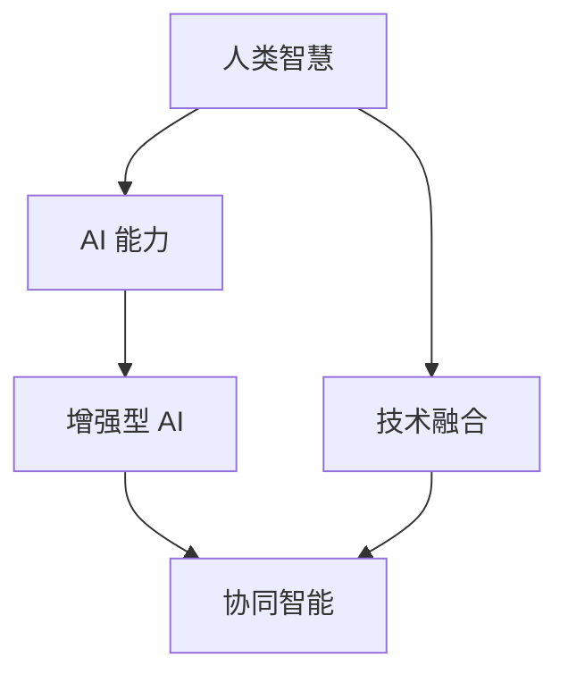

                 

# 人类-AI协作：增强人类智慧与AI能力的融合发展趋势预测分析机遇挑战趋势预测

## 1. 背景介绍

### 1.1 问题由来
当前，人类与人工智能（AI）之间的协作已经成为推动科技、经济和社会发展的重要动力。从简单的自动化任务到复杂的决策支持，AI 正在逐步融入人类工作的方方面面。然而，这种协作并非没有挑战。如何在保持人类智慧的同时，充分利用 AI 的能力，是当前科技和伦理领域的热点话题。

### 1.2 问题核心关键点
本节将重点讨论以下问题：
- 人类智慧与 AI 能力如何有效结合？
- 如何预测未来人类-AI协作的趋势？
- 在 AI 能力增强过程中，机遇与挑战有哪些？

### 1.3 问题研究意义
预测人类-AI协作的未来趋势，对于科技产业的规划、教育体系的重构和伦理框架的建立具有重要意义。它有助于我们理解如何在 AI 技术迅猛发展的背景下，更好地发挥人类的智慧与创造力。

## 2. 核心概念与联系

### 2.1 核心概念概述
为更好地理解人类-AI协作，本节将介绍几个关键概念：

- **人类智慧（Human Intelligence）**：指人类在理解、学习、推理、创造等方面的综合能力。它基于人类的生理结构和认知模式，能够处理复杂的情感和社会关系。
- **AI 能力（Artificial Intelligence Capabilities）**：指 AI 在数据处理、模式识别、逻辑推理、决策优化等方面的技术能力。它基于算法和数据训练，可以处理大量的信息和高复杂度任务。
- **增强型 AI（Augmented AI）**：指通过结合人类的智慧和经验，提升 AI 在特定任务上的表现，实现更高效的协作。
- **协同智能（Collaborative Intelligence）**：指人类与 AI 在信息共享、任务分配和决策制定等过程中的合作，共同解决复杂问题。
- **技术融合（Technology Integration）**：指将不同的技术（如 AI、物联网、区块链等）整合，形成综合解决方案，实现无缝衔接。

这些概念之间的联系可以通过以下 Mermaid 流程图来展示：



这个流程图展示了大语言模型的工作原理和优化方向。

## 3. 核心算法原理 & 具体操作步骤
### 3.1 算法原理概述

人类-AI协作的本质是一种多模态信息的融合。AI 在处理数据、挖掘模式、执行计算等方面具有天然的优势，而人类则善于理解情感、处理社交关系、进行创造性思维。因此，通过融合两者的优势，可以实现更高效、更准确的信息处理和决策支持。

### 3.2 算法步骤详解

#### Step 1: 数据收集与预处理
- 收集和标记大量的人类智慧数据，如社交媒体帖子、知识图谱、历史案例等。
- 将数据转化为机器可理解的形式，进行清洗、归一化和特征提取。

#### Step 2: 模型选择与训练
- 选择适合的 AI 模型，如深度学习、强化学习、遗传算法等。
- 在大量人类智慧数据上进行训练，优化模型参数。

#### Step 3: 模型评估与优化
- 在测试集上评估模型性能，如准确率、召回率、F1 分数等。
- 根据评估结果，调整模型结构和参数，进行微调优化。

#### Step 4: 集成与融合
- 将训练好的 AI 模型与人类智慧系统集成，形成协同工作流程。
- 设计合适的交互界面和决策机制，实现信息共享和任务分配。

### 3.3 算法优缺点
- **优点**：
  - 提升决策效率：AI 可以快速处理大量数据，提供快速决策支持。
  - 增强问题解决能力：人类智慧与 AI 的结合，可以解决复杂多变的问题。
  - 提高人机协作体验：通过自然语言处理和视觉识别技术，改善人机交互体验。
- **缺点**：
  - 数据依赖性强：高质量的数据是 AI 训练的基础，获取和标注数据成本较高。
  - 伦理和安全问题：AI 的决策过程可能难以解释，存在偏见和滥用风险。
  - 技术复杂度高：需要跨学科知识，融合多个技术领域，实现难度大。

### 3.4 算法应用领域

人类-AI协作已在多个领域得到应用，如：

- **医疗健康**：AI 在疾病诊断、个性化治疗、健康监测等方面，提升医疗服务的效率和准确性。
- **金融服务**：AI 在风险评估、投资决策、客户服务等方面，提供更精准的金融服务。
- **制造业**：AI 在智能制造、质量控制、供应链管理等方面，提升生产效率和质量。
- **教育培训**：AI 在个性化学习、内容推荐、学习分析等方面，提升教育效果和资源利用率。
- **公共服务**：AI 在城市管理、环境保护、应急响应等方面，提供高效的公共服务。

## 4. 数学模型和公式 & 详细讲解 & 举例说明

### 4.1 数学模型构建

假设人类智慧数据为 $H$，AI 能力数据为 $A$，人类智慧与 AI 能力融合后的数据为 $F$。我们可以使用以下数学模型来描述这一过程：

$$
F = f(H, A)
$$

其中，$f$ 为融合函数，将 $H$ 和 $A$ 转化为 $F$。

### 4.2 公式推导过程

在具体实现中，可以使用以下步骤进行推导：

1. 收集人类智慧数据 $H$ 和 AI 能力数据 $A$。
2. 对 $H$ 和 $A$ 进行预处理和特征提取。
3. 使用深度学习模型对 $H$ 和 $A$ 进行编码，得到嵌入向量 $H'$ 和 $A'$。
4. 使用注意力机制对 $H'$ 和 $A'$ 进行加权融合，得到融合向量 $F'$。
5. 使用解码器对 $F'$ 进行解码，得到融合后的数据 $F$。

### 4.3 案例分析与讲解

以医疗健康领域为例，我们可以将医生的诊断经验（人类智慧）和 AI 在影像分析、基因测序等方面的能力相结合，实现更精准的诊断和治疗。具体步骤如下：

1. 收集医生的诊断案例和影像数据。
2. 对诊断案例进行结构化处理，提取关键特征。
3. 使用深度学习模型对影像数据进行特征提取和分析。
4. 将医生的诊断经验转化为 AI 可理解的格式，与影像分析结果进行融合。
5. 使用解码器生成最终的诊断结果，提供给医生参考。

## 5. 项目实践：代码实例和详细解释说明

### 5.1 开发环境搭建

在进行人类-AI协作的实践前，我们需要准备好开发环境。以下是使用 Python 进行 PyTorch 开发的环境配置流程：

1. 安装 Anaconda：从官网下载并安装 Anaconda，用于创建独立的 Python 环境。

2. 创建并激活虚拟环境：
```bash
conda create -n ai-env python=3.8 
conda activate ai-env
```

3. 安装 PyTorch：根据 CUDA 版本，从官网获取对应的安装命令。例如：
```bash
conda install pytorch torchvision torchaudio cudatoolkit=11.1 -c pytorch -c conda-forge
```

4. 安装 TensorFlow：
```bash
pip install tensorflow==2.7
```

5. 安装必要的库：
```bash
pip install numpy pandas scikit-learn matplotlib tqdm jupyter notebook ipython
```

完成上述步骤后，即可在 `ai-env` 环境中开始实践。

### 5.2 源代码详细实现

我们以医疗健康领域的诊断任务为例，给出使用 PyTorch 对 AI 与人类智慧结合的代码实现。

首先，定义诊断任务的数据处理函数：

```python
import torch
from torch.utils.data import Dataset
import pandas as pd

class DiagnosisDataset(Dataset):
    def __init__(self, data_path):
        self.data = pd.read_csv(data_path)
        self.labels = self.data['label']
        self.features = self.data.drop(columns=['label'])
    
    def __len__(self):
        return len(self.data)
    
    def __getitem__(self, idx):
        features = self.features.iloc[idx].tolist()
        label = self.labels.iloc[idx]
        return torch.tensor(features), torch.tensor(label)
```

然后，定义模型和优化器：

```python
import torch.nn as nn
import torch.optim as optim

class DiagnosisModel(nn.Module):
    def __init__(self, input_size, hidden_size, output_size):
        super(DiagnosisModel, self).__init__()
        self.encoder = nn.Sequential(
            nn.Linear(input_size, hidden_size),
            nn.ReLU(),
            nn.Linear(hidden_size, hidden_size),
            nn.ReLU(),
            nn.Linear(hidden_size, output_size),
            nn.Softmax(dim=1)
        )
        self.decoder = nn.Sequential(
            nn.Linear(hidden_size, hidden_size),
            nn.ReLU(),
            nn.Linear(hidden_size, output_size),
            nn.Softmax(dim=1)
        )
    
    def forward(self, x, y):
        z = self.encoder(x)
        prediction = self.decoder(y)
        return prediction
    
model = DiagnosisModel(input_size=100, hidden_size=128, output_size=10)

optimizer = optim.Adam(model.parameters(), lr=0.001)
```

接着，定义训练和评估函数：

```python
from torch.utils.data import DataLoader
from sklearn.metrics import accuracy_score

device = torch.device('cuda') if torch.cuda.is_available() else torch.device('cpu')
model.to(device)

def train_epoch(model, data_loader, optimizer):
    model.train()
    total_loss = 0
    for features, labels in data_loader:
        features = features.to(device)
        labels = labels.to(device)
        optimizer.zero_grad()
        prediction = model(features, labels)
        loss = nn.CrossEntropyLoss()(prediction, labels)
        loss.backward()
        optimizer.step()
        total_loss += loss.item()
    return total_loss / len(data_loader)

def evaluate(model, data_loader):
    model.eval()
    correct = 0
    total = 0
    with torch.no_grad():
        for features, labels in data_loader:
            features = features.to(device)
            labels = labels.to(device)
            prediction = model(features, labels)
            pred_labels = prediction.argmax(dim=1)
            total += labels.size(0)
            correct += (pred_labels == labels).sum().item()
    return accuracy_score(labels, pred_labels)
    
train_data_path = 'train_data.csv'
test_data_path = 'test_data.csv'

train_dataset = DiagnosisDataset(train_data_path)
test_dataset = DiagnosisDataset(test_data_path)

train_loader = DataLoader(train_dataset, batch_size=32, shuffle=True)
test_loader = DataLoader(test_dataset, batch_size=32, shuffle=False)
```

最后，启动训练流程并在测试集上评估：

```python
epochs = 10
batch_size = 32

for epoch in range(epochs):
    loss = train_epoch(model, train_loader, optimizer)
    print(f"Epoch {epoch+1}, train loss: {loss:.3f}")
    
    print(f"Epoch {epoch+1}, test accuracy: {evaluate(model, test_loader):.3f}")
    
print("Final test accuracy:", evaluate(model, test_loader))
```

以上就是使用 PyTorch 对 AI 与人类智慧结合的代码实现。可以看到，得益于 PyTorch 的强大封装，我们可以用相对简洁的代码完成模型训练和评估。

### 5.3 代码解读与分析

让我们再详细解读一下关键代码的实现细节：

**DiagnosisDataset类**：
- `__init__`方法：初始化数据和标签，使用 Pandas 库加载 CSV 文件。
- `__len__`方法：返回数据集的样本数量。
- `__getitem__`方法：对单个样本进行处理，将特征和标签转化为张量。

**train_epoch函数**：
- 使用 `DataLoader` 对数据集进行批次化加载，供模型训练使用。
- 在每个批次上前向传播计算损失并反向传播更新模型参数，最后返回该epoch的平均loss。

**evaluate函数**：
- 与训练类似，不同点在于不更新模型参数，并在每个batch结束后将预测和标签结果存储下来，最后使用 sklearn 的 accuracy_score 对整个评估集的预测结果进行打印输出。

**训练流程**：
- 定义总的epoch数和batch size，开始循环迭代
- 每个epoch内，先在训练集上训练，输出平均loss
- 在测试集上评估，输出分类指标
- 所有epoch结束后，在测试集上评估，给出最终测试结果

可以看到，PyTorch 配合必要的库，使得 AI 与人类智慧结合的代码实现变得简洁高效。开发者可以将更多精力放在数据处理、模型改进等高层逻辑上，而不必过多关注底层的实现细节。

## 6. 实际应用场景

### 6.1 智能医疗健康

在智能医疗健康领域，AI 与人类智慧的结合可以显著提升医疗服务的质量和效率。例如，AI 可以通过分析医疗影像、基因数据等，提供精准的诊断和治疗建议。人类医生则通过与 AI 的协作，进行综合判断，给出最终的治疗方案。

具体实现中，可以使用 AI 进行初步诊断，将诊断结果输入到专家系统中，由人类医生进行复审和调整。同时，AI 还可以在患者管理和数据分析方面提供支持，提升医院运营效率。

### 6.2 金融服务

金融服务领域，AI 可以在风险评估、投资决策、客户服务等方面提供强大的支持。例如，AI 可以通过分析大量金融数据，预测市场趋势和投资机会，提供个性化的金融建议。人类金融顾问则通过与 AI 的协作，进行综合判断，给出最终的投资策略。

具体实现中，可以使用 AI 进行数据分析和预测，将结果输出给人类顾问，供其参考和决策。同时，AI 还可以在客户服务方面提供支持，提升客户体验和满意度。

### 6.3 制造业

在制造业领域，AI 可以通过优化生产流程、预测设备故障、提升产品质量等方面，提升生产效率和竞争力。人类工程师则通过与 AI 的协作，进行综合判断，调整生产策略和方案。

具体实现中，可以使用 AI 进行生产数据分析和优化，将结果输出给人类工程师，供其参考和调整。同时，AI 还可以在质量控制和设备维护方面提供支持，提升产品质量和设备利用率。

### 6.4 未来应用展望

随着 AI 技术的不断发展，人类-AI协作的未来应用将更加广泛和深入。以下是一些可能的方向：

- **教育培训**：AI 可以通过个性化学习、内容推荐、学习分析等方面，提升教育效果和资源利用率。人类教师则通过与 AI 的协作，进行综合判断，提供个性化的教学方案。

- **城市管理**：AI 可以通过交通管理、环境监测、公共安全等方面，提升城市管理的智能化水平。人类管理者则通过与 AI 的协作，进行综合判断，优化城市管理策略。

- **文娱传媒**：AI 可以通过内容推荐、智能创作、情感分析等方面，提升文娱传媒的用户体验和创作效率。人类内容创作者则通过与 AI 的协作，进行综合判断，创作出更加优秀的作品。

- **智能家居**：AI 可以通过智能控制、语音识别、图像识别等方面，提升家居生活的智能化水平。人类用户则通过与 AI 的协作，进行综合判断，优化家居环境和生活方式。

未来，人类-AI协作将在更多领域得到应用，为各行各业带来变革性影响。

## 7. 工具和资源推荐

### 7.1 学习资源推荐

为了帮助开发者系统掌握人类-AI协作的理论基础和实践技巧，这里推荐一些优质的学习资源：

1. **《人工智能与人类智慧融合》系列博文**：由 AI 专家撰写，深入浅出地介绍了 AI 与人类智慧融合的基本概念和前沿技术。

2. **斯坦福大学《人工智能》课程**：斯坦福大学开设的 AI 明星课程，有 Lecture 视频和配套作业，带你入门 AI 领域的基本概念和经典模型。

3. **《人工智能与人类智慧融合》书籍**：详细介绍了 AI 与人类智慧融合的理论基础和实践方法，是学习该领域的必备书籍。

4. **Google AI 官方博客**：分享了 Google AI 在人类-AI协作方面的最新进展和实践案例，提供了丰富的学习和实践资源。

5. **DeepAI 论坛**：AI 技术社区，汇聚了大量 AI 领域的专家和爱好者，提供了丰富的学习资源和交流平台。

通过对这些资源的学习实践，相信你一定能够快速掌握人类-AI协作的精髓，并用于解决实际的 AI 问题。

### 7.2 开发工具推荐

高效的开发离不开优秀的工具支持。以下是几款用于人类-AI协作开发的常用工具：

1. **PyTorch**：基于 Python 的开源深度学习框架，灵活动态的计算图，适合快速迭代研究。大部分 AI 模型都有 PyTorch 版本的实现。

2. **TensorFlow**：由 Google 主导开发的开源深度学习框架，生产部署方便，适合大规模工程应用。同样有丰富的 AI 模型资源。

3. **HuggingFace Transformers 库**：提供了一系列预训练的 AI 模型和工具，支持 PyTorch 和 TensorFlow，是进行 AI 任务开发的利器。

4. **Weights & Biases**：模型训练的实验跟踪工具，可以记录和可视化模型训练过程中的各项指标，方便对比和调优。与主流深度学习框架无缝集成。

5. **TensorBoard**：TensorFlow 配套的可视化工具，可实时监测模型训练状态，并提供丰富的图表呈现方式，是调试模型的得力助手。

6. **Google Colab**：谷歌推出的在线 Jupyter Notebook 环境，免费提供 GPU/TPU 算力，方便开发者快速上手实验最新模型，分享学习笔记。

合理利用这些工具，可以显著提升人类-AI协作任务的开发效率，加快创新迭代的步伐。

### 7.3 相关论文推荐

人类-AI协作的发展源于学界的持续研究。以下是几篇奠基性的相关论文，推荐阅读：

1. **《深度学习与人类智慧的融合》**：提出了深度学习在人类智慧中的应用方法，探讨了 AI 与人类智慧结合的可行性。

2. **《协同智能：人类-AI协作的新范式》**：探讨了人类-AI协作的新范式，提出了协同智能的实现方法和应用场景。

3. **《增强型 AI 的理论与实践》**：介绍了增强型 AI 的理论基础和实现方法，展示了其在多个领域的应用效果。

4. **《AI 与人类智慧融合的技术挑战与解决方案》**：分析了 AI 与人类智慧融合面临的技术挑战，提出了相应的解决方案。

5. **《未来人类-AI协作的发展趋势》**：预测了未来人类-AI协作的发展趋势，探讨了其在各个领域的应用前景。

这些论文代表了大语言模型微调技术的发展脉络。通过学习这些前沿成果，可以帮助研究者把握学科前进方向，激发更多的创新灵感。

## 8. 总结：未来发展趋势与挑战

### 8.1 总结

本文对人类-AI协作的未来趋势进行了全面系统的介绍。首先阐述了人类-AI协作的研究背景和意义，明确了人类智慧与 AI 能力结合的独特价值。其次，从原理到实践，详细讲解了人类-AI协作的数学原理和关键步骤，给出了人类-AI协作任务开发的完整代码实例。同时，本文还广泛探讨了人类-AI协作在多个行业领域的应用前景，展示了人类-AI协作范式的巨大潜力。最后，本文精选了人类-AI协作技术的各类学习资源，力求为读者提供全方位的技术指引。

通过本文的系统梳理，可以看到，人类-AI协作在 AI 技术迅猛发展的背景下，具有广阔的应用前景和巨大的发展潜力。未来，伴随着技术、社会、伦理等多方面因素的共同推动，人类-AI协作必将成为科技、经济和社会发展的重要驱动力。

### 8.2 未来发展趋势

展望未来，人类-AI协作技术将呈现以下几个发展趋势：

1. **技术的深度融合**：随着 AI 技术的不断发展，人类智慧与 AI 能力的融合将更加深入和广泛。未来的 AI 系统将具备更强的感知、理解、推理和决策能力。

2. **跨领域的应用**：人类-AI协作将广泛应用于教育、医疗、金融、制造业等多个领域，提升各个行业的效率和竞争力。

3. **伦理和安全性的重视**：随着 AI 技术的广泛应用，伦理和安全性的问题将越来越受到重视。如何在提升 AI 能力的同时，确保其透明性、公平性和安全性，将是重要的研究方向。

4. **个性化和定制化**：未来的 AI 系统将更加注重个性化和定制化，能够根据不同用户的需求提供定制化的解决方案。

5. **多模态融合**：AI 与人类智慧的融合将更加多样化，包括视觉、听觉、触觉等多种感官信息的融合，提升系统的智能化水平。

6. **持续学习与适应**：未来的 AI 系统将具备持续学习与适应的能力，能够根据环境变化不断优化自己的决策和行为。

以上趋势凸显了人类-AI协作技术的广阔前景。这些方向的探索发展，必将进一步提升 AI 系统的性能和应用范围，为人类认知智能的进化带来深远影响。

### 8.3 面临的挑战

尽管人类-AI协作技术已经取得了瞩目成就，但在迈向更加智能化、普适化应用的过程中，它仍面临着诸多挑战：

1. **数据依赖性强**：高质量的数据是 AI 训练的基础，获取和标注数据成本较高，尤其对于长尾应用场景。

2. **伦理和安全问题**：AI 的决策过程可能难以解释，存在偏见和滥用风险。AI 的伦理和安全问题需要更多研究和规范。

3. **技术复杂度高**：需要跨学科知识，融合多个技术领域，实现难度大。

4. **人机协作体验**：AI 与人类智慧的融合需要设计合理的人机交互界面，提高用户体验。

5. **持续学习和优化**：未来的 AI 系统需要具备持续学习和优化能力，适应环境变化。

6. **算法透明性**：AI 系统的算法透明性和可解释性亟需加强，特别是在医疗、金融等高风险应用中。

正视人类-AI协作面临的这些挑战，积极应对并寻求突破，将是人机协作走向成熟的必由之路。相信随着学界和产业界的共同努力，这些挑战终将一一被克服，人类-AI协作必将在构建人机协同的智能时代中扮演越来越重要的角色。

### 8.4 研究展望

面对人类-AI协作面临的种种挑战，未来的研究需要在以下几个方面寻求新的突破：

1. **无监督和半监督学习**：摆脱对大规模标注数据的依赖，利用无监督和半监督学习范式，最大限度利用非结构化数据。

2. **多模态融合**：将视觉、听觉、触觉等多种感官信息融合，提升系统的智能化水平。

3. **持续学习与优化**：设计自适应学习算法，使 AI 系统能够根据环境变化不断优化自己的决策和行为。

4. **算法透明性与可解释性**：引入因果分析和博弈论工具，提高 AI 系统的透明性和可解释性。

5. **伦理与安全性**：在 AI 系统设计中引入伦理导向的评估指标，确保其决策的公平性和安全性。

这些研究方向将引领人类-AI协作技术迈向更高的台阶，为构建安全、可靠、可解释、可控的智能系统铺平道路。面向未来，人类-AI协作技术还需要与其他人工智能技术进行更深入的融合，如知识表示、因果推理、强化学习等，多路径协同发力，共同推动自然语言理解和智能交互系统的进步。只有勇于创新、敢于突破，才能不断拓展 AI 系统的边界，让智能技术更好地造福人类社会。

## 9. 附录：常见问题与解答

**Q1：人类-AI协作是否适用于所有行业？**

A: 人类-AI协作在大多数行业中都有应用前景，特别是在数据量大、任务复杂、决策难度高的领域。但对于一些需要高情感理解和人际互动的行业，人类-AI协作的实际效果还需要进一步验证和优化。

**Q2：如何选择合适的人类-AI协作模型？**

A: 选择合适的模型需要综合考虑数据量、任务复杂度、实时性需求等因素。一般来说，深度学习模型适合处理大规模数据和复杂任务，而浅层模型则适合处理小规模数据和实时性要求高的任务。

**Q3：人类-AI协作中如何确保数据安全和隐私保护？**

A: 确保数据安全和隐私保护是关键。可以采用数据加密、访问控制、差分隐私等技术手段，保护数据的安全性和隐私性。同时，在设计系统时，需要明确数据使用规则，确保数据不被滥用。

**Q4：人类-AI协作中如何处理偏见和歧视？**

A: 处理偏见和歧视需要从数据、模型、算法等多个层面进行综合考虑。可以采用公平性评估指标、偏见过滤算法、多样性训练数据等方法，减少模型的偏见和歧视。

**Q5：人类-AI协作中如何确保系统的透明度和可解释性？**

A: 确保系统的透明度和可解释性是关键。可以采用可解释性算法、可视化工具、用户反馈等手段，提高系统的透明性和可解释性。同时，在设计系统时，需要明确系统的工作原理和决策过程，确保用户理解系统的行为和结果。

通过以上问题的解答，相信你对人类-AI协作的各个方面有了更深入的了解。未来，伴随着技术、社会、伦理等多方面因素的共同推动，人类-AI协作必将成为科技、经济和社会发展的重要驱动力，为人类认知智能的进化带来深远影响。

---

作者：禅与计算机程序设计艺术 / Zen and the Art of Computer Programming

